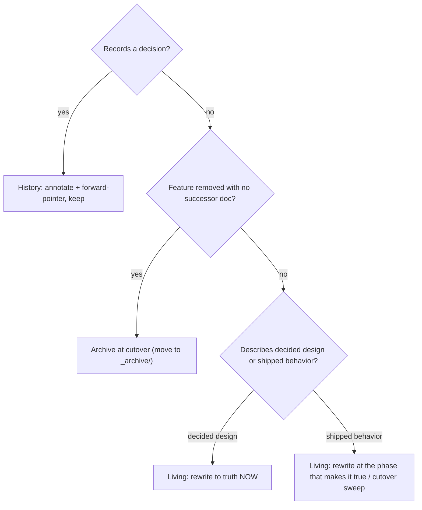

# Documentation Lifecycle — Living Docs vs Decision History

How this project keeps documentation coherent during and after a refactor.
Refines the global `documentation.md` and the managed `documentation-first.md`
rules; does not replace them. Decided 2026-06-19 (decentralized-config Cluster 3).

## Three document classes (different lifecycles)

| Class | Examples | Lifecycle |
|---|---|---|
| **Decision / analysis records** | ADRs (`decisions/`), reviews (`reviews/`), role-first analyses | **Immutable history.** Never rewrite the original decision text. When a later decision invalidates one, mark it superseded and **forward-annotate** (a back-pointer to the refining ADR). Kept forever — they preserve *why*. |
| **Living design / architecture docs** | `design.md`, `requirements.md`, `architecture/spec.md`, `architecture/architecture.md`, integration designs, user guides | **Always reflect the current/target truth.** Rewritten in place to the agreed design — **no inline "stale" or "SUPERSEDED" sections** accumulate inside them. Their history lives in git. |
| **Removed-feature design docs** | design docs for a mechanism that is *deleted*, with no living successor doc | **Archived, not bannered, not deleted.** Move to an `_archive/` directory at cutover (see below). |

Rule of thumb: *if the doc records a decision → it is history (annotate, keep).
If it describes how the system is/will be → it is living (rewrite to truth).*

## Timing — when to update which doc

The single discriminator is **what the doc describes**:

- **Design-intent docs** (state a decision already settled; the implementer reads
  them to build): update **immediately** when the decision lands. Lagging here
  misleads the build. *Examples: the decentralized-config `requirements.md`,
  `design.md`, the ADRs.*
- **Shipped-behavior docs** (describe what currently *works* for a user): update at
  the implementation phase that **makes the change true**, or in a consolidated
  cutover sweep. **Never rewrite ahead of the code** — a guide that documents a
  command before it exists lies in the opposite direction (worse than the lag).
  *Examples: top-level `README.md`, user guides, the tutorial, `spec.md` FRs.*

## Archiving removed-feature design docs

When a feature is removed entirely and its design docs have no living successor
(the successor lives elsewhere, e.g. a new design tree):

1. At the breaking-cutover phase, **move** the docs into a sibling `_archive/`
   directory (e.g. `docs/maintainer/configuration/_archive/<subtree>/`). Do not
   leave them contradicting the active tree; do not delete them (reference value +
   incoming back-references from ADRs).
2. If part of a subtree **survives** (concepts still referenced by live rules/docs),
   **re-home the surviving content into the living doc first**, then archive only the
   dead remainder.
3. Update the area index/README so its "canonical source" pointers redirect to the
   successor.
4. Back-references from frozen ADRs to a moved path may dangle — accept (ADRs are
   history) or fix in one pass; do not block the cutover on it.

## Do / Don't

- **Do** rewrite living docs to the final design; let git hold their history.
- **Do** keep ADRs/reviews/analyses as the written decision trail; annotate forward
  when superseded.
- **Don't** sprinkle "SUPERSEDED" banners inside living design/architecture docs to
  mark stale paragraphs — rewrite the paragraph instead.
- **Don't** rewrite user-facing docs to a model the shipped code does not yet expose.
- **Don't** delete superseded design docs — archive them.
