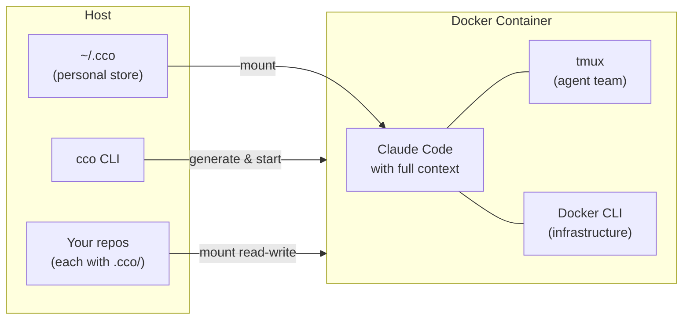

# claude-orchestrator

> Per-project, Docker-isolated Claude Code environments — multi-repo context, shareable team config, and safe autonomy, ready at startup.

**The problem.** Claude Code is powerful, but its context, memory, and
permissions are tied to a single working directory on your local machine. Juggle
several projects, clients, or multi-repo stacks and you end up re-explaining the
same context every session, leaking one project's memory into another, and
choosing between babysitting permission prompts or running
`--dangerously-skip-permissions` unsandboxed on your host.

**What cco does.** Every project gets its own isolated session with the right
repos mounted, the right instructions and docs loaded, its own memory, and a
`project.yml` you can commit so your whole team gets the identical environment.
`cco start client-a` and `cco start client-b` are completely separate contexts
with zero overlap.

cco provides the mechanisms (Docker isolation, context hierarchy, knowledge
packs, agent teams) and ships with **recommended defaults** tested through
real-world agentic development. Every rule, skill, agent, and default is fully
customizable — adopt what works, change what doesn't.

[](LICENSE)

<!-- TODO: add a short demo GIF here (cco start tutorial / a session launching) -->

## Why not just native Claude Code + shell scripts?

cco is **built on** Claude Code, not a replacement — it maps its configuration
tiers directly onto Claude Code's native settings resolution
(managed → user → project → nested) instead of reimplementing them. You *could*
glue the rest together with shell scripts; cco is that glue, hardened and shared:

- **Multi-repo, not single-dir.** A flat `/workspace` with every repo mounted
  and one cross-repo `CLAUDE.md`, instead of one working directory at a time.
- **Isolated memory per project.** Insights from one client never leak into
  another — sessions are fully independent.
- **Config you can commit.** `project.yml` and the project's `.cco/` tree ride
  your normal git, so the environment is reproducible and shareable, not trapped
  on your laptop.
- **Safe autonomy.** Docker *is* the sandbox, so
  `--dangerously-skip-permissions` is safe — no permission prompts, no risk to
  your host.
- **Lifecycle handled.** Socket GID fixes, secret detection, knowledge-pack
  distribution, and versioned updates/migrations are done for you, not
  re-discovered in every script.

## Status

**Alpha (v0.1.0-alpha)** — Under active development and already used daily by the
author for real-world agentic development. It works well in practice, but APIs,
configuration format, and defaults may change between releases.

**Platform support:**
- **macOS** — fully tested, primary development environment. OAuth login supported.
- **Linux** — functional but not yet thoroughly tested. OAuth login is not yet available; authentication requires `CLAUDE_API_KEY` (API key). Linux OAuth support with subscription-based login is planned — see the [roadmap](docs/maintainers/roadmap.md).
- **Windows** — use via WSL2 + Docker Desktop (see [Requirements](#requirements)).

**Planned before stable release:** network hardening (internet access control per project), E2E integration tests, Linux OAuth support. See the [roadmap](docs/maintainers/roadmap.md) for the full plan.

Feedback, bug reports, and contributions are welcome! See [CONTRIBUTING.md](CONTRIBUTING.md).

## Quick Start

Each step earns its place — here's what you get from it:

```bash
# 1. Clone the repository — this is the CLI and its defaults
git clone https://github.com/user/claude-orchestrator.git ~/claude-orchestrator
cd ~/claude-orchestrator

# 2. Add the CLI to PATH — so you can run `cco` from anywhere
# zsh (macOS default):
echo 'export PATH="$PATH:$HOME/claude-orchestrator/bin"' >> ~/.zshrc && source ~/.zshrc
# bash:
# echo 'export PATH="$PATH:$HOME/claude-orchestrator/bin"' >> ~/.bashrc && source ~/.bashrc

# 3. Initialize — copies user defaults into ~/.cco and builds the Docker image
cco init

# 4. Learn by doing — the interactive tutorial walks you through everything
cco start tutorial
```

### The tutorial is your starting point

The built-in **tutorial project** is the recommended way to learn cco. It walks
you through creating and configuring your first project, setting up knowledge
packs for your stack, customizing rules/skills/workflow, and understanding the
context hierarchy — referencing the [user guides](docs/users/README.md) along the
way so you finish with a config that reflects how you actually work.

### Prefer to skip the tutorial?

```bash
cd ~/projects/my-repo         # a repo you want Claude to work in
cco init                      # scaffold <repo>/.cco/ and ensure ~/.cco/global
cco start my-repo
```

Other entry points: `cco join <project>` to join a project whose `<repo>/.cco/`
already exists, and `cco init --migrate <project>` to migrate a legacy project
into the in-repo layout.

## Feature highlights

| Feature | What it gives you | Learn more |
|---|---|---|
| **Multi-repo workspaces** | Group frontend, backend, infra, and docs into one project with a cross-repo `CLAUDE.md`. | [Project setup](docs/users/configuration/guides/project-setup.md) · [project.yml reference](docs/users/configuration/reference/project-yaml.md) |
| **Four-tier context hierarchy** | Managed → Global → Project → Repo, mapped natively onto Claude Code's settings resolution. | [Context hierarchy](docs/users/foundation/reference/context-hierarchy.md) |
| **Knowledge packs** | Reusable docs, rules, agents, and skills — define once, activate per project, share via a sharing repo. | [Knowledge packs](docs/users/packs/guides/knowledge-packs.md) |
| **Shareable, versioned config** | Commit `project.yml` and `<repo>/.cco/` with your repo; version your personal `~/.cco` store with `cco config save/push/pull` and built-in secret detection. | [Configuration management](docs/users/configuration/guides/configuration-management.md) · [Configuring rules](docs/users/configuration/guides/configuring-rules.md) |
| **Isolated memory** | Each project has its own memory and transcripts — no cross-project leakage. | [Concepts](docs/users/foundation/guides/concepts.md) |
| **Agent teams** | tmux sessions with a lead plus teammates; optional iTerm2 on macOS. | [Agent teams](docs/users/integration/guides/agent-teams.md) · [Subagents](docs/users/integration/guides/subagents.md) |
| **Docker-from-Docker** | The Docker socket is mounted, so Claude can run `docker compose` to spin up sibling services (databases, queues). | [Docker & networking](docs/users/environment/guides/docker-and-networking.md) · [Socket security](docs/users/security/guides/socket-security.md) |
| **Flexible authentication** | OAuth (macOS Keychain), API key via env var, GitHub token for `gh`. | [Authentication](docs/users/integration/guides/authentication.md) |
| **Extensible environment** | Per-project setup scripts, extra packages, and custom images. | [Custom environment](docs/users/environment/guides/custom-environment.md) |
| **Browser automation** | Drive Chrome via the DevTools Protocol from inside a session. | [Browser automation](docs/users/integration/guides/browser-automation.md) |
| **Monolithic CLI** | A single Bash script (`bin/cco`) — no dependencies beyond Bash 3.2+, Docker, and standard Unix tools. | [CLI reference](docs/users/reference/cli.md) |

## Use cases

**Multi-project developer** — You work on 5+ projects with different stacks and
conventions. Each has its own `project.yml`: repos mounted, rules loaded, ports
mapped. `cco start client-a` vs `cco start client-b` — completely separate
contexts, zero overlap.

**Team of developers** — Commit the project's `.cco/` to your shared repo. Every
teammate runs `cco start` and gets the same environment: same repos, same
`CLAUDE.md`, same rules and agents. No "works on my machine" for AI context.

**Agency / consultant work** — Each client is a project. Client documentation
lives in a knowledge pack. Claude knows the client's codebase, conventions, and
architecture from session one. Switch clients by switching projects.

## How it works



`cco start` reads the project's `project.yml`, validates repo paths, generates a
`docker-compose.yml`, and launches a container. The entrypoint fixes the Docker
socket permissions and starts tmux, then runs
`claude --dangerously-skip-permissions` — safe, because Docker is the sandbox.
Config is resolved across four tiers that map onto Claude Code's native
settings:

| Orchestrator Layer | Host Source | Container Path | Claude Code Scope | Overridable? |
|---|---|---|---|---|
| `defaults/managed/` | baked in image | `/etc/claude-code/` | Managed (highest priority) | No — baked in image |
| Global `.claude/` | `~/.cco/global/.claude/` | `~/.claude/` | User-level (always loaded) | Yes — user-owned |
| Project `.claude/` | `<repo>/.cco/claude/` | `/workspace/.claude/` | Project-level (always loaded) | Yes — per-project |
| Repo's own `.claude/` | `<repo>/.claude/` | `/workspace/<repo>/.claude/` | Nested (on-demand) | Yes — from repo |

Managed settings (hooks, env vars, deny rules) have the highest priority and
cannot be overridden; user and project settings are fully customizable. For the
full model see the [context hierarchy reference](docs/users/foundation/reference/context-hierarchy.md).

## Documentation

| You are a… | Start here |
|---|---|
| **User** — running cco, configuring projects | [docs/users/README.md](docs/users/README.md) — learning path + per-domain guides and references |
| **Maintainer** — developing/contributing to cco | [docs/maintainers/README.md](docs/maintainers/README.md) — architecture, ADRs, design docs, roadmap |

Full index: [docs/README.md](docs/README.md)

## Requirements

- **OS**: macOS 12+ or Linux — see [compatibility notes](#os-compatibility) below
- **Docker**: Docker Desktop (macOS) or Docker Engine (Linux)
- **Bash**: 3.2+ (the CLI is compatible with macOS default `/bin/bash`)
- **Claude Code**: Pro, Team, Enterprise account, or API key

## OS compatibility

| OS | Status | Notes |
|---|---|---|
| **macOS 12+** | Fully supported | Keychain integration for OAuth, iTerm2 agent teams |
| **Linux** | Fully supported | All features except macOS-specific Keychain and iTerm2 |
| **Windows (WSL2)** | Works, not officially tested | Run as Linux inside WSL2; Docker Desktop with WSL2 backend required |
| **Windows (native)** | Not supported | Would require a PowerShell rewrite; not planned |

> **Windows users:** Install WSL2 + Docker Desktop with the WSL2 backend, then use cco from inside the WSL2 terminal. No changes to the tool are needed.

## Security

The Docker socket is mounted into the container by default so Claude can manage
infrastructure (databases, services) via `docker compose`. This grants full
Docker API access — equivalent to root on the host. If your workflow doesn't need
Docker-from-Docker, disable it in `project.yml`:

```yaml
docker:
  mount_socket: false
```

Or per-session: `cco start my-project --no-docker`

Secrets (API keys, tokens) should go in `secrets.env` files (gitignored,
`chmod 600`), never in `setup.sh` (which is baked into the Docker image and
visible via `docker history`).

For the user-facing socket guidance see
[socket security](docs/users/security/guides/socket-security.md); for the full
threat model and proxy design see the
[security design](docs/maintainers/security/design/design-security-model.md).
