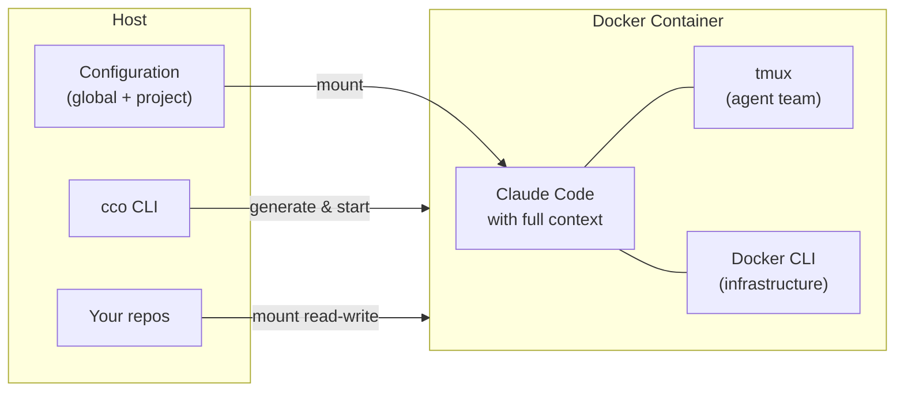

# claude-orchestrator

> The shared Claude Code environment for your team and projects.

Per-project context and team sharing for Claude Code — powered by Docker. Every project has its own repos, instructions, and documentation ready at startup. Commit `project.yml` and your whole team gets the exact same environment.

## Why claude-orchestrator?

- **Per-project context** — Every project has its own repos, rules, documentation and workflow. Claude starts each session already knowing everything — no re-explaining.
- **Shareable environments** — Commit `project.yml`. Everyone on your team gets the exact same Claude setup: same repos, same conventions, same knowledge. One source of truth.
- **Reusable knowledge packs** — Client docs, architecture overviews, coding conventions: define once, activate across projects. No duplication, no drift.
- **Isolated memory** — Each project has its own memory. Insights from one client don't leak into another. Sessions are fully independent.
- **Safe by default** — Docker isolates Claude from the rest of your system. `--dangerously-skip-permissions` is safe inside the container.

## Use cases

**Multi-project developer** — You work on 5+ projects with different stacks and conventions. Each has its own `project.yml`: repos mounted, rules loaded, ports mapped. `cco start client-a` vs `cco start client-b` — completely separate contexts, zero overlap.

**Team of developers** — Commit `project.yml` to your shared repo. Every teammate runs `cco start` and gets the same environment: same repos, same `CLAUDE.md`, same knowledge packs. No "works on my machine" for AI context.

**Agency / consultant work** — Each client is a project. Client documentation lives in a knowledge pack. Claude knows the client's codebase, conventions, and architecture from session one. Switch clients by switching projects.

## How it works



```
Setup: git clone → cco init → cco project create → cco start
```

## Quick Start

```bash
# 1. Clone the repository
git clone https://github.com/user/claude-orchestrator.git
cd claude-orchestrator

# 2. Initialize (copy defaults, build Docker image — ~10 minutes)
bin/cco init

# 3. Create a project
bin/cco project create my-app

# 4. Start the session
bin/cco start my-app
```

## Key features

| Feature | Description |
|---|---|
| **Knowledge packs** | Reusable documents (conventions, overviews, guidelines) defined in `global/packs/` and activated per project in `project.yml` |
| **Four-tier hierarchy** | Managed → Global → Project → Repo, mapped natively onto Claude Code's settings resolution |
| **Shareable project config** | `project.yml` defines repos, ports, packs, and environment — commit it to share the exact setup with your team |
| **Monolithic CLI** | A single Bash script (`bin/cco`) — no dependencies beyond Bash 4+, Docker, and standard Unix tools |
| **Docker-from-Docker** | The Docker socket is mounted into the container. Claude can run `docker compose` to create sibling containers (databases, services) |
| **Agent teams** | tmux sessions with lead + teammates. Optional iTerm2 support on macOS |
| **Flexible authentication** | OAuth (credentials from macOS Keychain), API key via env var, GitHub token for `gh` CLI |
| **Extensible environment** | Setup scripts, extra packages, and custom images configurable per project |

## Documentation

| Path | Content |
|---|---|
| **New users** | [getting-started/](docs/getting-started/) — Overview, installation, first project, concepts |
| **User guides** | [user-guides/](docs/user-guides/) — Project setup, knowledge packs, authentication, agent teams, troubleshooting |
| **Technical reference** | [reference/](docs/reference/) — CLI, project.yml, context hierarchy |
| **Contributing** | [maintainer/](docs/maintainer/) — Architecture, spec, roadmap, design docs |

Full index: [docs/README.md](docs/README.md)

## Requirements

- **OS**: macOS or Linux
- **Docker**: Docker Desktop (macOS) or Docker Engine (Linux)
- **Bash**: 4+ (macOS: the CLI is compatible with `/bin/bash` 3.2)
- **Claude Code**: Pro, Team, Enterprise account, or API key
