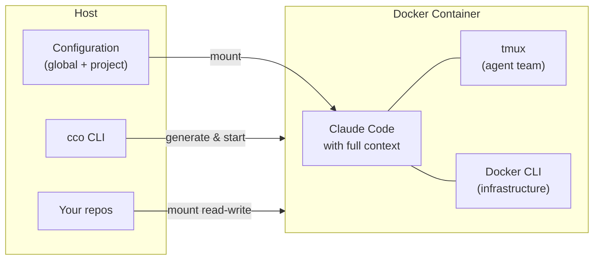

# claude-orchestrator

> The shared Claude Code environment for your team and projects.

Per-project context and team sharing for Claude Code — powered by Docker. Every project has its own repos, instructions, and documentation ready at startup. Commit `project.yml` and your whole team gets the exact same environment.

## Why claude-orchestrator?

- **Multi-repo workspaces** — Group multiple repos (frontend, backend, infra, docs) into a single project. Claude gets a cross-repo `CLAUDE.md` that understands how everything fits together — built on Claude Code's native features, not replacing them.
- **Shareable environments** — Commit the project directory (`project.yml`, `CLAUDE.md`, rules, agents). Everyone on your team gets the same repos, instructions, and conventions.
- **Reusable knowledge packs** — Client docs, architecture overviews, coding conventions, agents, skills, rules: define once, activate across projects. Install packs from remote Config Repos with `cco pack install`, share your own with `cco manifest`.
- **Config versioning & backup** — `cco vault` versions your entire configuration with git, with built-in secret detection. Push to a remote to sync across machines or share with your team.
- **Isolated memory** — Each project has its own memory. Insights from one client don't leak into another. Sessions are fully independent.
- **Safe by default** — Docker isolates Claude from the rest of your system. `--dangerously-skip-permissions` is safe inside the container.

## Use cases

**Multi-project developer** — You work on 5+ projects with different stacks and conventions. Each has its own `project.yml`: repos mounted, rules loaded, ports mapped. `cco start client-a` vs `cco start client-b` — completely separate contexts, zero overlap.

**Team of developers** — Commit the project directory to your shared repo. Every teammate runs `cco start` and gets the same environment: same repos, same `CLAUDE.md`, same rules and agents. No "works on my machine" for AI context.

**Agency / consultant work** — Each client is a project. Client documentation lives in a knowledge pack. Claude knows the client's codebase, conventions, and architecture from session one. Switch clients by switching projects.

## How it works



```
Setup: git clone → cco init → cco project create → cco start
```

## Quick Start

```bash
# 1. Clone the repository
git clone https://github.com/user/claude-orchestrator.git
cd claude-orchestrator

# 2. Initialize (copy defaults, build Docker image)
bin/cco init

# 3. Create a project
bin/cco project create my-app

# 4. Start the session
bin/cco start my-app
```

## Key features

| Feature | Description |
|---|---|
| **Knowledge packs** | Reusable documents (conventions, overviews, guidelines) defined in `packs/` and activated per project in `project.yml` |
| **Four-tier hierarchy** | Managed → Global → Project → Repo, mapped natively onto Claude Code's settings resolution |
| **Config Repo sharing** | Share packs and project templates via git. `cco pack install <url>` / `cco project install <url>` to import, `cco manifest` to export |
| **Vault versioning** | `cco vault` versions your `user-config/` with git and automatic secret detection. Push to a remote for backup and multi-machine sync |
| **Shareable project config** | `project.yml` defines repos, ports, packs, and environment — commit it to share the exact setup with your team |
| **Monolithic CLI** | A single Bash script (`bin/cco`) — no dependencies beyond Bash 3.2+, Docker, and standard Unix tools |
| **Docker-from-Docker** | The Docker socket is mounted into the container. Claude can run `docker compose` to create sibling containers (databases, services) |
| **Agent teams** | tmux sessions with lead + teammates. Optional iTerm2 support on macOS |
| **Flexible authentication** | OAuth (credentials from macOS Keychain), API key via env var, GitHub token for `gh` CLI |
| **Extensible environment** | Setup scripts, extra packages, and custom images configurable per project |

## Documentation

| Path | Content |
|---|---|
| **New users** | [getting-started/](docs/getting-started/) — Overview, installation, first project, key concepts |
| **User guides** | [user-guides/](docs/user-guides/) — Project setup, packs, auth, agent teams, browser, sharing |
| **Technical reference** | [reference/](docs/reference/) — CLI commands, project.yml format, context hierarchy |
| **Contributing** | [maintainer/](docs/maintainer/) — Architecture, spec, roadmap, design docs |
| **Security** | [maintainer/security.md](docs/maintainer/security.md) — Threat model, findings, fix priority |

Full index: [docs/README.md](docs/README.md)

## Requirements

- **OS**: macOS 12+ or Linux — see [compatibility notes](#os-compatibility) below
- **Docker**: Docker Desktop (macOS) or Docker Engine (Linux)
- **Bash**: 3.2+ (the CLI is compatible with macOS default `/bin/bash`)
- **Claude Code**: Pro, Team, Enterprise account, or API key

## OS compatibility

| OS | Status | Notes |
|---|---|---|
| **macOS 12+** | Fully supported | Keychain integration for OAuth, iTerm2 agent teams |
| **Linux** | Fully supported | All features except macOS-specific Keychain and iTerm2 |
| **Windows (WSL2)** | Works, not officially tested | Run as Linux inside WSL2; Docker Desktop with WSL2 backend required |
| **Windows (native)** | Not supported | Would require a PowerShell rewrite; not planned |

> **Windows users:** Install WSL2 + Docker Desktop with the WSL2 backend, then use cco from inside the WSL2 terminal. No changes to the tool are needed.

## Security

The Docker socket is mounted into the container by default so Claude can manage infrastructure (databases, services) via `docker compose`. This grants full Docker API access — equivalent to root on the host. If your workflow doesn't need Docker-from-Docker, disable it in `project.yml`:

```yaml
docker:
  mount_socket: false
```

Or per-session: `cco start my-project --no-docker`

Secrets (API keys, tokens) should go in `secrets.env` files (gitignored, `chmod 600`), never in `setup.sh` (which is baked into the Docker image and visible via `docker history`).

For the full threat model and security analysis, see [docs/maintainer/security.md](docs/maintainer/security.md).
