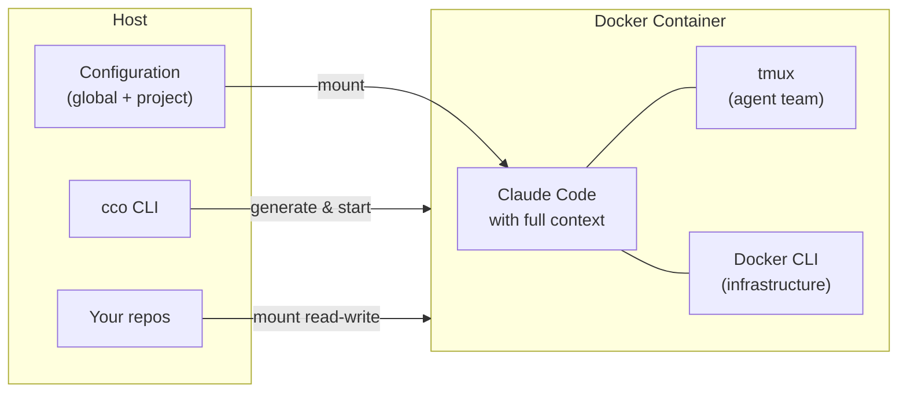

# claude-orchestrator

> Orchestrate Claude Code sessions in Docker.

Isolated Claude Code sessions, preconfigured and ready to use — one command to get started.

## Why claude-orchestrator?

- **Complete isolation** — Each project runs in a dedicated Docker container. No conflicts, no context leaks between projects. `--dangerously-skip-permissions` is safe because Docker is the sandbox.
- **Automatic context** — Repos mounted, knowledge packs activated, CLAUDE.md generated. Claude starts already knowing everything about your project, without manual setup.
- **Integrated agent teams** — tmux sessions with lead + teammates, ready to collaborate. One agent coordinates, others execute.
- **Reusable knowledge packs** — Conventions, guidelines, domain documentation: defined once, activated per project. The source of truth stays in your repo.
- **Isolated memory** — Each project has its own memory directory. Insights and history don't mix between different sessions.

## How it works



```
Setup: git clone → cco init → cco project create → cco start
```

## Quick Start

```bash
# 1. Clone the repository
git clone https://github.com/user/claude-orchestrator.git
cd claude-orchestrator

# 2. Initialize (copy defaults, build Docker image)
bin/cco init

# 3. Create a project
bin/cco project create my-app

# 4. Start the session
bin/cco start my-app
```

## Key features

| Feature | Description |
|---|---|
| **Monolithic CLI** | A single Bash script (`bin/cco`) — no dependencies beyond Bash 4+, Docker, and standard Unix tools |
| **Four-tier hierarchy** | Managed → Global → Project → Repo, mapped natively onto Claude Code's settings resolution |
| **Docker-from-Docker** | The Docker socket is mounted into the container. Claude can run `docker compose` to create sibling containers (databases, services) |
| **Knowledge packs** | Reusable documents (conventions, overviews, guidelines) defined in `global/packs/` and activated per project in `project.yml` |
| **Agent teams** | tmux sessions with lead + teammates. Optional iTerm2 support on macOS |
| **Flexible authentication** | OAuth (credentials from macOS Keychain), API key via env var, GitHub token for `gh` CLI |
| **Extensible environment** | Setup scripts, extra packages, and custom images configurable per project |

## Documentation

| Path | Content |
|---|---|
| **New users** | [getting-started/](docs/getting-started/) — Overview, installation, first project, concepts |
| **User guides** | [user-guides/](docs/user-guides/) — Project setup, knowledge packs, authentication, agent teams, troubleshooting |
| **Technical reference** | [reference/](docs/reference/) — CLI, project.yml, context hierarchy |
| **Contributing** | [maintainer/](docs/maintainer/) — Architecture, spec, roadmap, design docs |

Full index: [docs/README.md](docs/README.md)

## Requirements

- **OS**: macOS or Linux
- **Docker**: Docker Desktop (macOS) or Docker Engine (Linux)
- **Bash**: 4+ (macOS: the CLI is compatible with `/bin/bash` 3.2)
- **Claude Code**: Pro, Team, Enterprise account, or API key
