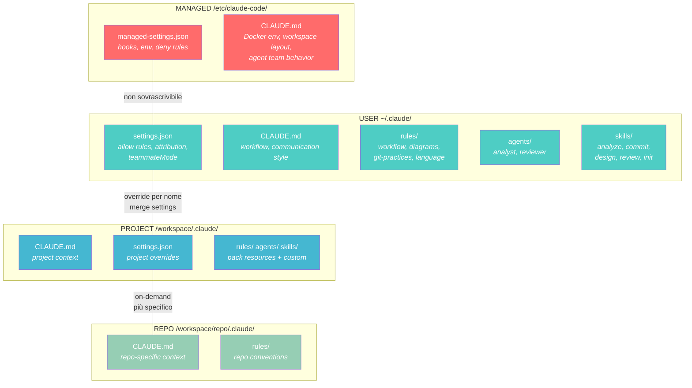

# Analisi: Gerarchia degli Scope e Configurazione

> **Stato**: Analisi — fase di esplorazione e documentazione dei requisiti
> **Data**: 2026-02-27
> **Scope**: Architettura — riorganizzazione tier system/global/project

---

## Indice

1. [Contesto e Motivazione](#1-contesto-e-motivazione)
2. [Comportamento Nativo di Claude Code](#2-comportamento-nativo-di-claude-code)
3. [Mapping Attuale di claude-orchestrator](#3-mapping-attuale-di-claude-orchestrator)
4. [Problemi Identificati](#4-problemi-identificati)
5. [Requisiti](#5-requisiti)
6. [Soluzioni Proposte](#6-soluzioni-proposte)
7. [Raccomandazione](#7-raccomandazione)
8. [Dettaglio: Classificazione File](#8-dettaglio-classificazione-file)
9. [Open Questions](#9-open-questions)

---

## 1. Contesto e Motivazione

claude-orchestrator implementa una gerarchia a tre tier (global → project → repo) che
si mappa sulla risoluzione nativa di Claude Code. Attualmente esiste una separazione
tra `defaults/system/` (sempre sincronizzati) e `defaults/global/` (copiati una volta),
ma la categorizzazione dei file è incompleta:

- **Regole di workflow** (workflow.md, diagrams.md, git-practices.md) sono in "system"
  ma rappresentano preferenze utente personalizzabili.
- **Agents e skills** sono in "system" ma sono esempi di workflow estendibili.
- **settings.json** contiene sia infrastruttura critica (hooks, env vars) sia preferenze
  (attribution, cleanupPeriodDays).
- Non esiste un meccanismo per impedire che l'utente sovrascriva file che il framework
  richiede per funzionare.

---

## 2. Comportamento Nativo di Claude Code

### 2.1 Gerarchia Completa degli Scope

Claude Code implementa **5 livelli** di configurazione, dal più alto al più basso:

| # | Livello | Posizione (Linux) | Chi lo gestisce |
|---|---------|-------------------|-----------------|
| 1 | **Managed** | `/etc/claude-code/` | Admin/Framework |
| 2 | **CLI args** | Argomenti riga di comando | Sessione |
| 3 | **Local** | `.claude/settings.local.json` | Utente (gitignored) |
| 4 | **Project** | `.claude/settings.json` | Team (committato) |
| 5 | **User** | `~/.claude/settings.json` | Utente |

> **Nota**: Il livello Managed è la risposta nativa di Claude Code a "come avere
> configurazione non sovrascrivibile". È progettato per enterprise/organization
> ma funziona su qualsiasi installazione — incluso il nostro container Docker.

### 2.2 Sotto-livelli del Livello Managed

Quando sono presenti più sorgenti managed, solo UNA viene usata:

1. **Server-managed** — via Claude.ai Admin Console (feature a pagamento Teams/Enterprise)
2. **MDM/OS policies** — macOS managed preferences, Windows Group Policy
3. **File-based** — `/etc/claude-code/managed-settings.json` (Linux)
4. **HKCU registry** — solo Windows

Nel nostro container Docker, usiamo il livello 3 (file-based). Se l'utente
ha un account Teams/Enterprise con server-managed settings, quelli avranno
precedenza — comportamento coerente con l'intento enterprise.

### 2.3 Layout del Livello Managed su Linux

**Confermato dal codice sorgente di Claude Code** (analisi di `cli.js`):

```
/etc/claude-code/
├── managed-settings.json        # Settings (precedenza massima)
├── managed-mcp.json             # Server MCP managed
├── CLAUDE.md                    # Istruzioni framework (sempre caricate)
└── .claude/
    ├── rules/                   # Regole managed (*.md)
    ├── skills/                  # Skill managed (*/SKILL.md)
    ├── agents/                  # Agent managed (*.md)
    ├── commands/                # Comandi managed
    └── output-styles/           # Stili di output managed
```

**Attenzione ai nomi file**: Il settings managed si chiama `managed-settings.json`
(NON `settings.json`). Il MCP managed si chiama `managed-mcp.json`.

### 2.4 Comportamento di Risoluzione per Tipo di Risorsa

| Risorsa | Tipo di merge | Comportamento in conflitto |
|---------|---------------|---------------------------|
| `settings.json` | **Merge con precedenza** | Chiavi più specifiche sovrascrivono; chiavi non in conflitto coesistono |
| `CLAUDE.md` | **Additivo** | Tutti i livelli caricati nel contesto; il più specifico prevale in conflitto |
| `rules/*.md` | **Additivo** | Tutti caricati; project rules hanno priorità su user rules |
| `agents/*.md` | **Override per nome** | CLI > Managed > Project > User > Plugin |
| `skills/` | **Override per nome** | Managed > User > Project > Plugin (namespacati) |
| `hooks` | **Merge (tutti eseguiti)** | Tutti gli hook matching vengono eseguiti in parallelo |
| MCP servers | **Override per nome** | Local > Project > User |
| `permissions` | **Merge con precedenza** | deny > ask > allow; prima regola corrispondente vince |

#### Dettaglio: Come CLAUDE.md vengono scoperti

Claude risale ricorsivamente dal cwd fino alla root, caricando ogni `CLAUDE.md`
e `CLAUDE.local.md` che trova. I file nelle sottodirectory vengono scoperti
on-demand quando Claude accede a file in quelle directory.

L'ordine di caricamento per priorità crescente:
```
/etc/claude-code/CLAUDE.md          (Managed — sempre caricato)
~/.claude/CLAUDE.md                 (User — sempre caricato)
~/.claude/rules/*.md                (User rules — sempre caricati)
/workspace/.claude/CLAUDE.md        (Project — sempre caricato)
/workspace/.claude/rules/*.md       (Project rules — sempre caricati)
/workspace/CLAUDE.local.md          (Local — sempre caricato, gitignored)
/workspace/<repo>/.claude/CLAUDE.md (Repo — on-demand, più specifico)
```

Tutti coesistono nel contesto. In caso di istruzioni contrastanti, **il più specifico
prevale** — ma le istruzioni non contrastanti da tutti i livelli rimangono attive.

#### Dettaglio: Come agents vengono risolti

Override per nome con questa precedenza:
```
CLI --agents flag                           (1 — massima)
/etc/claude-code/.claude/agents/ (Managed)  (2)
.claude/agents/          (Project level)    (3)
~/.claude/agents/        (User level)       (4)
Plugin agents/                              (5 — minima)
```

Il livello managed supporta agents. Dall'analisi del codice sorgente,
`/etc/claude-code/.claude/agents/` è una posizione valida. La directory
viene letta da Claude Code con la stessa logica delle altre posizioni agent.

**Nota**: Per agents, **Project > User** — un agent a livello project sovrascrive
quello con lo stesso nome a livello user.

#### Dettaglio: Come skills vengono risolte

Override per nome con questa precedenza:
```
Managed/Enterprise       (1 — massima)
User (~/.claude/skills/) (2)
Project (.claude/skills/)(3)
Plugin (namespaced)      (4 — minima)
```

Le skill dei plugin usano namespace `plugin-name:skill-name` per evitare conflitti.

> **Attenzione: Asimmetria skills vs agents**
>
> Per le skills, **User > Project** — una skill a livello user (`~/.claude/skills/`)
> ha priorità su quella con lo stesso nome a livello project (`.claude/skills/`).
> Questo è l'**opposto** degli agents, dove Project > User.
>
> Implicazioni per claude-orchestrator:
> - **Agents**: Un pack a livello project PUÒ sovrascrivere un agent globale ✓
> - **Skills**: Un pack a livello project NON PUÒ sovrascrivere una skill globale ✗
>   (la skill user/global ha priorità)
>
> Questo è il comportamento nativo documentato da Claude Code. Va tenuto in
> considerazione nella scelta di dove posizionare agents e skills di default.

### 2.5 Impostazioni Managed-Only

Queste chiavi funzionano **esclusivamente** in `managed-settings.json`:

| Chiave | Effetto |
|--------|--------|
| `disableBypassPermissionsMode` | Impedisce `--dangerously-skip-permissions` |
| `allowManagedPermissionRulesOnly` | Solo regole permessi managed si applicano |
| `allowManagedHooksOnly` | Blocca hook user/project/plugin; solo managed e SDK |
| `allowManagedMcpServersOnly` | Solo MCP servers dalla allowlist managed |
| `allowedMcpServers` | Allowlist MCP servers configurabili dall'utente |
| `deniedMcpServers` | Blocklist MCP servers |
| `strictKnownMarketplaces` | Allowlist marketplace plugin |
| `blockedMarketplaces` | Blocklist marketplace plugin |
| `sandbox.network.allowManagedDomainsOnly` | Solo domini di rete managed |
| `forceLoginMethod` | Forza metodo di login |
| `allow_remote_sessions` | Controlla sessioni remote |

---

## 3. Mapping Attuale di claude-orchestrator

### 3.1 Architettura Corrente

```mermaid
graph TB
    subgraph "defaults/system/ (11 file)"
        SS[settings.json<br/>hooks, permissions, env]
        SA[agents/analyst.md<br/>agents/reviewer.md]
        SK[skills/analyze, commit,<br/>design, review, init-workspace]
        SR[rules/workflow.md<br/>rules/diagrams.md<br/>rules/git-practices.md]
    end

    subgraph "defaults/global/ (6 file)"
        GC[CLAUDE.md<br/>Workflow instructions]
        GM[mcp.json<br/>Empty]
        GL[rules/language.md<br/>Template]
        GG[agents/.gitkeep<br/>skills/.gitkeep]
        GS[setup.sh<br/>User setup script]
    end

    subgraph "defaults/_template/ (12+ file)"
        TC[CLAUDE.md, settings.json<br/>rules/language.md]
        TT[project.yml, setup.sh<br/>secrets.env, mcp-packages.txt]
        TD[claude-state/memory/<br/>agents/ skills/ rules/]
    end

    SS -->|"_sync_system_files()<br/>SEMPRE sincronizzato"| G["global/.claude/"]
    SA --> G
    SK --> G
    SR --> G
    GC -->|"cco init<br/>copiato UNA VOLTA"| G
    GM --> G
    GL --> G

    TC -->|"cco project create<br/>scaffolding"| P["projects/<name>/.claude/"]
```



### 3.2 Meccanismo di Sync

La funzione `_sync_system_files()` in `bin/cco` (linee 611–670):

1. Legge `defaults/system/system.manifest` (lista di 11 path)
2. Per ogni file: confronta con `cmp -s`, copia se diverso o mancante
3. Rimuove file presenti nel vecchio manifest ma non nel nuovo (cleanup)
4. Salva il manifest corrente come `.system-manifest` per il prossimo ciclo

Viene chiamata da: `cmd_init()`, `cmd_start()`, `cmd_new()`.
Include anche una fase di bootstrap migration per gestire la transizione
da layout pre-system (righe 619-626 di `bin/cco`).

**Effetto**: Ogni `cco start` riscrive i file di sistema. Un utente che modifica
`global/.claude/rules/workflow.md` perde le modifiche al prossimo avvio.

### 3.3 Dove Vanno i File nel Container

```
Container mount:
~/.claude/           ← global/.claude/ (User scope Claude Code)
/workspace/.claude/  ← projects/<name>/.claude/ (Project scope Claude Code)
/workspace/<repo>/   ← repo montato (Repo scope Claude Code, on-demand)
```

**Mancante**: Non c'è nulla montato in `/etc/claude-code/` (Managed scope).

---

## 4. Problemi Identificati

### P1: Classificazione Semantica Errata

File che rappresentano **preferenze utente** sono classificati come "system" e quindi
vengono riscritti a ogni `cco start`:

| File | Classificazione attuale | Natura reale |
|------|------------------------|--------------|
| `rules/workflow.md` | System (sempre sync) | Preferenza processo (team-specific) |
| `rules/diagrams.md` | System (sempre sync) | Preferenza stile (personale) |
| `rules/git-practices.md` | System (sempre sync) | Preferenza VCS (team-specific) |
| `agents/analyst.md` | System (sempre sync) | Esempio agent (estendibile) |
| `agents/reviewer.md` | System (sempre sync) | Esempio agent (estendibile) |
| `skills/*` (5 skill) | System (sempre sync) | Esempio workflow (personalizzabile) |

### P2: Assenza del Livello Managed

L'architettura attuale usa solo User (`~/.claude/`) e Project (`/workspace/.claude/`).
Non esiste un livello con priorità superiore che non possa essere sovrascritto.
Conseguenze:

- Se un pack o un progetto definiscono un `agents/analyst.md`, sovrascrivono
  quello di sistema (project > user per agents).
- Se l'utente cancella rules di sistema da `global/.claude/rules/`, vengono
  ripristinate al prossimo `cco start` — ma intanto la sessione corrente è senza.
- Non c'è modo di avere hook o settings **garantiti come attivi**.

### P3: Asimmetria negli Override

In `~/.claude/` convivono file framework (sync-always) e file utente (user-owned)
senza distinzione visiva. L'utente non sa quali file può modificare e quali
verranno riscritti al prossimo `cco start`. In più:

- I **pack** possono sovrascrivere agents di sistema a livello project ✓
  (project > user per agents)
- I **pack** NON possono sovrascrivere skills di sistema a livello project ✗
  (user > project per skills — comportamento nativo asimmetrico)
- L'utente può modificare file in `global/.claude/`, ma quelli nel manifest
  vengono riscritti al prossimo avvio

### P4: settings.json Mescola Infrastruttura e Preferenze

Il settings.json corrente in `defaults/system/` contiene:

**Infrastruttura framework** (DEVE essere sempre presente):
- `env.CLAUDE_CODE_EXPERIMENTAL_AGENT_TEAMS` — richiesto per agent teams
- `hooks.SessionStart`, `hooks.SubagentStart`, `hooks.PreCompact` — context injection
- `statusLine` — feedback visivo sessione
- `permissions.deny` — protezione file sensibili

**Preferenze utente** (personalizzabili):
- `permissions.allow` — lista comandi permessi
- `attribution` — formato co-author nei commit
- `teammateMode` — tmux vs iTerm2
- `cleanupPeriodDays` — retention sessioni
- `enableAllProjectMcpServers` — auto-enable MCP
- `alwaysThinkingEnabled` — thinking mode

Avendo tutto in un unico file sync-always, le preferenze vengono sovrascritte.

### P5: Interazione Hook ↔ Scope Non Documentata

Gli hook di context injection (`session-context.sh`, `subagent-context.sh`)
iniettano informazione nel conversation context via `additionalContext`.
Questo è un canale parallelo alla gerarchia degli scope:

- Non crea rules, agents o skills — inietta contesto read-only
- Ha priorità alta nel conversation context (caricato all'inizio della sessione)
- Ma non può imporre behavior binding come una regola in `CLAUDE.md`
- L'hook `session-context.sh` inietta anche il contenuto di
  `/workspace/.claude/packs.md` come knowledge pack (righe 74-80)

---

## 5. Requisiti

### R1: Sfruttare il Comportamento Nativo

> La regola fondamentale di claude-orchestrator è sfruttare il più possibile
> le feature native di Claude Code.

Ogni tier dell'orchestratore deve mappare a un livello nativo di Claude Code:

| Orchestrator Tier | Claude Code Level | Meccanismo |
|-------------------|-------------------|------------|
| **System** | **Managed** (`/etc/claude-code/`) | Non sovrascrivibile, infrastruttura framework |
| **Global** | **User** (`~/.claude/`) | Default preconfigurati, customizzabili dall'utente |
| **Project** | **Project** (`/workspace/.claude/`) | Per-progetto, include pack resources |
| **Repo** | **Nested** (`/workspace/<repo>/.claude/`) | Dal repo montato, on-demand |

### R2: System Non Sovrascrivibile

I file in scope System devono avere priorità su tutto. L'utente non può
sovrascriverli in nessun modo. Contengono:

- Settings e hooks che fanno funzionare il framework
- Istruzioni core su come claude-orchestrator opera
- Regole di behavior universali e trasversali a tutti i progetti

### R3: Global come Template Preconfigurati

I file in scope Global sono esempi funzionanti. L'utente può:

- Modificarli liberamente (non vengono mai riscritti dopo l'init)
- Estenderli con file aggiuntivi
- Usarli come base per personalizzazioni

### R4: Project Override di Global

A livello project, il comportamento nativo di override è:

- `agents/` → override per nome, **Project > User** (project sovrascrive global) ✓
- `skills/` → override per nome, **User > Project** (global ha priorità su project) ⚠️
- `rules/` → additive (tutti caricati, project rules hanno priorità in conflitto) ✓
- `settings.json` → merge (project estende global, project vince in conflitto) ✓

> **Nota**: L'asimmetria skills vs agents è nativa di Claude Code. Le skill
> globali dell'utente hanno priorità su quelle project-level. Questo significa
> che i pack non possono sovrascrivere skill globali, solo aggiungerne di nuove.

### R5: System Non Sovrascrivibile da Project/Global

Il livello managed ha nativamente questa proprietà. In più, le chiavi
`allowManagedHooksOnly` e `allowManagedPermissionRulesOnly` possono
**bloccare** modifiche da livelli inferiori.

---

## 6. Soluzioni Proposte

### Soluzione A: Usare `/etc/claude-code/` (Managed Nativo)

Spostare i file di infrastruttura framework nel livello managed nativo di
Claude Code, servito da `/etc/claude-code/` nel container.

#### Implementazione

**Nel Dockerfile** — creare la struttura managed:
```dockerfile
# Framework managed settings (non sovrascrivibili)
RUN mkdir -p /etc/claude-code/.claude/rules \
             /etc/claude-code/.claude/agents \
             /etc/claude-code/.claude/skills
```

**Nuovo layout `defaults/`**:
```
defaults/
├── managed/                          # → /etc/claude-code/ (MANAGED level)
│   ├── managed-settings.json         # Hooks, env vars, flags framework-critical
│   ├── CLAUDE.md                     # Istruzioni core framework
│   └── .claude/
│       ├── rules/                    # Regole framework (se necessarie)
│       ├── agents/                   # (vuoto — agents vanno in global)
│       └── skills/                   # (vuoto — skills vanno in global)
│
├── global/                           # → ~/.claude/ (USER level, copiati UNA volta)
│   └── .claude/
│       ├── CLAUDE.md                 # Workflow instructions (personalizzabili)
│       ├── mcp.json                  # MCP servers utente (vuoto)
│       ├── settings.json             # Preferenze utente (attribution, teammateMode...)
│       ├── rules/
│       │   ├── workflow.md           # Fasi del workflow (personalizzabile)
│       │   ├── diagrams.md           # Convenzioni diagrammi (personalizzabile)
│       │   ├── git-practices.md      # Convenzioni git (personalizzabile)
│       │   └── language.md           # Preferenze lingua (template)
│       ├── agents/
│       │   ├── analyst.md            # Agent analista (esempio, estendibile)
│       │   └── reviewer.md           # Agent reviewer (esempio, estendibile)
│       └── skills/
│           ├── analyze/SKILL.md      # Skill analisi (esempio)
│           ├── commit/SKILL.md       # Skill commit (esempio)
│           ├── design/SKILL.md       # Skill design (esempio)
│           ├── review/SKILL.md       # Skill review (esempio)
│           └── init-workspace/SKILL.md
│
└── _template/                        # → projects/<name>/.claude/ (scaffolding)
    └── .claude/
        ├── CLAUDE.md                 # Template progetto
        ├── settings.json             # Override vuoto
        └── rules/language.md         # Override lingua template
```

**Nel Dockerfile** — copiare managed files:
```dockerfile
COPY defaults/managed/ /etc/claude-code/
RUN chmod -R 755 /etc/claude-code/
```

**Entrypoint** — nessuna modifica necessaria per managed files. Claude Code
li legge automaticamente da `/etc/claude-code/` senza alcun intervento.

**`_sync_system_files()`** — eliminata o ridotta. Il managed level è nel
Dockerfile (immutabile per la sessione). I global defaults sono copiati
solo da `cmd_init()`.

#### Contenuto di `managed-settings.json`

```json
{
  "$schema": "https://json.schemastore.org/claude-code-settings.json",
  "env": {
    "CLAUDE_CODE_EXPERIMENTAL_AGENT_TEAMS": "1"
  },
  "hooks": {
    "SessionStart": [{
      "hooks": [{
        "type": "command",
        "command": "/usr/local/bin/cco-hooks/session-context.sh",
        "timeout": 10
      }]
    }],
    "SubagentStart": [{
      "hooks": [{
        "type": "command",
        "command": "/usr/local/bin/cco-hooks/subagent-context.sh",
        "timeout": 5
      }]
    }],
    "PreCompact": [{
      "hooks": [{
        "type": "command",
        "command": "/usr/local/bin/cco-hooks/precompact.sh",
        "timeout": 5
      }]
    }]
  },
  "statusLine": {
    "type": "command",
    "command": "/usr/local/bin/cco-hooks/statusline.sh"
  },
  "permissions": {
    "deny": [
      "Read(~/.claude.json)",
      "Read(~/.ssh/*)"
    ]
  }
}
```

#### Contenuto di `/etc/claude-code/CLAUDE.md` (Managed)

Istruzioni core del framework — come claude-orchestrator opera. Universali,
trasversali a tutti i progetti, non sovrascrivibili:

```markdown
# claude-orchestrator Framework

## Docker Environment
- This session runs inside a Docker container managed by claude-orchestrator
- Repos are mounted at /workspace/<repo-name>/
- Docker socket is available — you can run docker and docker compose
- When starting infrastructure, use the project network (cc-<project>)
- Dev servers run inside this container with ports mapped to the host

## Workspace Layout
- /workspace/ is the main working directory
- Each repo is a direct subdirectory of /workspace/
- Files at /workspace/ root are temporary (container-only, lost on exit)
- Persistent work should go in repos and be versioned with git

## Agent Teams
- The lead coordinates and delegates work to teammates
- Each teammate focuses on their specialized domain
- Use the shared task list for coordination
- The lead synthesizes teammate outputs into coherent results
```

#### Pro
- Sfrutta il **meccanismo nativo** di Claude Code (Managed level)
- Non sovrascrivibile da user/project/pack — **garanzia nativa**
- Elimina la necessità di `_sync_system_files()` per infrastruttura
- Immutabile per la durata della sessione (baked nel Docker image)
- Compatibile con server-managed settings enterprise (precedenza corretta)
- Hooks sono garantiti come attivi (managed hooks non disabilitabili dall'utente)
- Separazione pulita: managed = framework, user = preferenze, project = per-progetto

#### Contro
- Richiede `cco build` per aggiornare i file managed (non aggiornabili a runtime)
- Più rigido: se un utente ha un caso d'uso edge che richiede override di un hook,
  non può farlo (by design, ma potrebbe essere limitante)
- La chiave `allowManagedHooksOnly` impedirebbe all'utente di aggiungere i propri
  hook — bisogna NON attivarla per mantenere flessibilità
- Richiede verifica che Claude Code 2.1.56 legga effettivamente tutti i tipi di
  risorse da `/etc/claude-code/.claude/` (confermato dal codice sorgente, ma serve
  test pratico end-to-end)

### Soluzione B: System come Global Protetto (senza Managed)

Mantenere tutti i file in `~/.claude/` (User level) ma separare concettualmente
"framework-owned" e "user-owned" tramite il meccanismo di sync esistente.

#### Implementazione

- `_sync_system_files()` sincronizza solo `settings.json` (infrastruttura minima)
- Tutto il resto (agents, skills, rules) è copiato una volta come default
- Le istruzioni framework vanno nel `CLAUDE.md` globale (additivo con project)

#### Pro
- Nessuna dipendenza su feature managed (più semplice)
- Funziona su qualsiasi versione di Claude Code
- Un unico tier da gestire

#### Contro
- **Non c'è garanzia** che i file framework siano sempre presenti
- L'utente può sovrascrivere settings.json a livello project (merge nativo)
- Gli hook possono essere disabilitati da un settings.json project-level
- Se un pack sovrascrive `agents/analyst.md` a livello project, il framework
  perde il controllo sull'agent base

### Soluzione C: Ibrida — Managed per Settings, Global per il Resto

Usare `/etc/claude-code/` solo per `managed-settings.json` e `CLAUDE.md`
(le risorse la cui protezione è più critica), e mantenere agents/skills/rules
in `~/.claude/` come default preconfigurati.

#### Implementazione

```
/etc/claude-code/
├── managed-settings.json    # Hooks, env, deny rules — non sovrascrivibile
├── CLAUDE.md                # Istruzioni framework — non sovrascrivibile
└── (nient'altro)

~/.claude/
├── settings.json            # Preferenze utente (allow rules, attribution, etc.)
├── CLAUDE.md                # Workflow instructions (personalizzabili)
├── rules/                   # Regole personalizzabili
├── agents/                  # Agent personalizzabili
└── skills/                  # Skill personalizzabili
```

#### Pro
- La parte più critica (hooks, settings framework) è protetta
- Le istruzioni core del framework sono nel CLAUDE.md managed
- Agents, skills e rules rimangono flessibili
- Meno dipendenza sulla feature managed per risorse meno critiche

#### Contro
- Complessità: due location diverse per file "di sistema"
- Non protegge agents/skills dal override a livello project (un pack che definisce
  `agents/analyst.md` sovrascrive quello globale)
- L'utente non sa intuitivamente cosa è managed e cosa è user

---

## 7. Raccomandazione

### Soluzione Raccomandata: A (Managed Nativo Completo)

La Soluzione A è la più coerente con il principio fondamentale del progetto:
**sfruttare il più possibile le feature native di Claude Code**.

Il livello Managed esiste esattamente per il nostro caso d'uso: configurazione
che il "provider dell'ambiente" (l'orchestratore) vuole garantire come attiva.

#### Dettaglio della Separazione Proposta

**Managed (`/etc/claude-code/`)** — Framework, non sovrascrivibile:

| Risorsa | Contenuto | Motivazione |
|---------|-----------|-------------|
| `managed-settings.json` | Hooks paths, env vars framework, deny rules, statusLine | Gli hook DEVONO funzionare sempre |
| `CLAUDE.md` | Docker env, workspace layout, agent team behavior | Claude deve sapere come opera il framework |

> **Nota**: NON mettere agents/skills/rules in managed. Sono estensioni
> di workflow, non infrastruttura. L'utente deve poterli personalizzare.

**Global (`~/.claude/`)** — Default preconfigurati, personalizzabili:

| Risorsa | Contenuto | Motivazione |
|---------|-----------|-------------|
| `settings.json` | Permission allow, attribution, teammateMode, cleanup | Preferenze utente |
| `CLAUDE.md` | Development workflow, communication style | Template personalizzabile |
| `rules/workflow.md` | Fasi strutturate del workflow | Team-specific |
| `rules/diagrams.md` | Convenzioni Mermaid | Preferenza personale |
| `rules/git-practices.md` | Branch strategy, conventional commits | Team-specific |
| `rules/language.md` | Preferenze linguistiche | Personale |
| `agents/analyst.md` | Agent analista (haiku, read-only) | Esempio estendibile |
| `agents/reviewer.md` | Agent reviewer (sonnet, read-only) | Esempio estendibile |
| `skills/analyze/` | Skill di analisi strutturata | Esempio workflow |
| `skills/commit/` | Skill di commit convenzionale | Esempio workflow |
| `skills/design/` | Skill di design strutturato | Esempio workflow |
| `skills/review/` | Skill di review | Esempio workflow |
| `skills/init-workspace/` | Skill di inizializzazione | Esempio workflow |

**Project (`/workspace/.claude/`)** — Per-progetto:

| Risorsa | Contenuto | Motivazione |
|---------|-----------|-------------|
| `CLAUDE.md` | Contesto progetto, repos, architettura | Specifico per progetto |
| `settings.json` | Override per progetto (merge con global) | Estensione per progetto |
| `rules/language.md` | Override lingua per progetto | Il progetto potrebbe avere lingua diversa |
| Pack resources | Skills, agents, rules da packs | Conoscenza specializzata |

#### Gerarchia Risultante



#### Interazione con Hook di Context Injection

Gli hook di context injection (`session-context.sh`, etc.) sono **complementari**
alla gerarchia degli scope. Operano su un piano diverso:

| Meccanismo | Scopo | Priorità | Sovrascrivibile? |
|-----------|-------|----------|-----------------|
| `managed-settings.json` hooks | Definiscono **quando** eseguire script | Managed (massima) | No — i path degli hook sono in managed |
| `session-context.sh` output | Inietta contesto runtime (repos, skills, MCP) | Conversation context | No — sempre eseguito perché l'hook è managed |
| `CLAUDE.md` managed | Behavior binding permanente | Managed (massima) | No |
| `CLAUDE.md` user/project | Behavior binding personalizzabile | User/Project | Sì, per-progetto |
| `rules/*.md` | Regole modulari | Additivo | Sì — project rules prevalgono su user |

**Punto chiave**: Con gli hook in `managed-settings.json`, sono **garantiti**
come attivi indipendentemente da cosa l'utente mette in `settings.json` a livello
user o project. Il merge nativo di hooks è additivo: gli hook managed si
sommano a quelli user/project, non vengono sovrascritti.

#### Impatto su Pack e Overrides

Con la soluzione managed:

| Scenario | Comportamento | Corretto? |
|----------|--------------|-----------|
| Pack definisce `agents/analyst.md` in project | Override dell'analyst globale per quel progetto | ✓ Nativo |
| Utente modifica `~/.claude/rules/workflow.md` | Personalizzazione persistente | ✓ Non più riscritto |
| Project definisce `rules/custom.md` | Additive — caricato con priorità su global | ✓ Nativo |
| Utente tenta di modificare hooks in settings.json | Hook user si sommano a quelli managed | ✓ Non può rimuovere managed hooks |
| `cco build` con nuova versione del framework | Aggiorna managed files nel Docker image | ✓ Aggiornamento pulito |

---

## 8. Dettaglio: Classificazione File

### 8.1 Inventario Completo con Classificazione Proposta

#### Da `defaults/system/` (attuale) → Nuova destinazione

| File attuale | Classificazione | Nuova destinazione | Motivazione |
|-------------|----------------|---------------------|-------------|
| `settings.json` (hooks, env, deny) | Infrastruttura | `defaults/managed/managed-settings.json` | Hook e env DEVONO funzionare sempre |
| `settings.json` (allow, attribution) | Preferenza | `defaults/global/.claude/settings.json` | Personalizzabile |
| `agents/analyst.md` | Esempio workflow | `defaults/global/.claude/agents/analyst.md` | Estendibile/sostituibile |
| `agents/reviewer.md` | Esempio workflow | `defaults/global/.claude/agents/reviewer.md` | Estendibile/sostituibile |
| `skills/analyze/SKILL.md` | Esempio workflow | `defaults/global/.claude/skills/analyze/SKILL.md` | Personalizzabile |
| `skills/commit/SKILL.md` | Esempio workflow | `defaults/global/.claude/skills/commit/SKILL.md` | Personalizzabile |
| `skills/design/SKILL.md` | Esempio workflow | `defaults/global/.claude/skills/design/SKILL.md` | Personalizzabile |
| `skills/review/SKILL.md` | Esempio workflow | `defaults/global/.claude/skills/review/SKILL.md` | Personalizzabile |
| `skills/init-workspace/SKILL.md` | Esempio workflow | `defaults/global/.claude/skills/init-workspace/SKILL.md` | Personalizzabile |
| `rules/workflow.md` | Preferenza processo | `defaults/global/.claude/rules/workflow.md` | Team-specific |
| `rules/diagrams.md` | Preferenza stile | `defaults/global/.claude/rules/diagrams.md` | Personale |
| `rules/git-practices.md` | Preferenza VCS | `defaults/global/.claude/rules/git-practices.md` | Team-specific |

#### Nuovi file da creare

| File | Destinazione | Contenuto |
|------|-------------|-----------|
| `CLAUDE.md` (framework) | `defaults/managed/CLAUDE.md` | Docker env, workspace layout, agent teams |
| `managed-settings.json` | `defaults/managed/managed-settings.json` | Hooks, env, deny rules, statusLine |

### 8.2 Split di settings.json

Il settings.json attuale deve essere **diviso in due file**:

**`defaults/managed/managed-settings.json`** (non sovrascrivibile):
```json
{
  "env": {
    "CLAUDE_CODE_EXPERIMENTAL_AGENT_TEAMS": "1"
  },
  "hooks": {
    "SessionStart": [{ "hooks": [{ "type": "command", "command": "/usr/local/bin/cco-hooks/session-context.sh", "timeout": 10 }] }],
    "SubagentStart": [{ "hooks": [{ "type": "command", "command": "/usr/local/bin/cco-hooks/subagent-context.sh", "timeout": 5 }] }],
    "PreCompact": [{ "hooks": [{ "type": "command", "command": "/usr/local/bin/cco-hooks/precompact.sh", "timeout": 5 }] }]
  },
  "statusLine": { "type": "command", "command": "/usr/local/bin/cco-hooks/statusline.sh" },
  "permissions": { "deny": ["Read(~/.claude.json)", "Read(~/.ssh/*)"] }
}
```

**`defaults/global/.claude/settings.json`** (personalizzabile):
```json
{
  "permissions": {
    "allow": [
      "Bash(git *)", "Bash(npm *)", "Bash(npx *)", "Bash(node *)",
      "Bash(docker *)", "Bash(docker compose *)", "Bash(tmux *)",
      "Bash(python3 *)", "Bash(pip *)",
      "Bash(cat *)", "Bash(ls *)", "Bash(find *)", "Bash(grep *)",
      "Bash(rg *)", "Bash(head *)", "Bash(tail *)", "Bash(wc *)",
      "Bash(sort *)", "Bash(mkdir *)", "Bash(cp *)", "Bash(mv *)",
      "Bash(rm *)", "Bash(chmod *)", "Bash(curl *)", "Bash(wget *)",
      "Bash(jq *)",
      "Read", "Edit", "Write", "WebFetch", "WebSearch", "Task"
    ]
  },
  "attribution": {
    "commit": "Co-Authored-By: Claude <noreply@anthropic.com>",
    "pr": "Generated with Claude Code"
  },
  "teammateMode": "tmux",
  "cleanupPeriodDays": 30,
  "enableAllProjectMcpServers": true,
  "alwaysThinkingEnabled": true
}
```

---

## 9. Open Questions

### Q1: Test End-to-End del Managed Level

Il codice sorgente di Claude Code conferma che `/etc/claude-code/.claude/agents/`,
`skills/`, e `rules/` vengono letti. Tuttavia, serve un **test pratico**:
- Creare agent/skill/rule in `/etc/claude-code/.claude/`
- Verificare che Claude li carichi
- Verificare che non siano sovrascrivibili da user/project con lo stesso nome

### Q2: `allowManagedHooksOnly`

Dobbiamo attivare `allowManagedHooksOnly: true`?
- **Sì** → l'utente non può aggiungere i propri hook a nessun livello
- **No** → l'utente può aggiungere hook custom, i managed hooks sono sempre attivi comunque

**Raccomandazione**: Non attivarlo. L'utente potrebbe voler aggiungere hook custom
(formatter, linter, notification). I managed hooks sono comunque garantiti dal
merge additivo nativo.

### Q3: Aggiornamento Managed Files

I managed files sono nel Docker image. Per aggiornarli serve `cco build`.
Serve un meccanismo di notifica che l'immagine è obsoleta?

### Q4: Migrazione da Configurazione Attuale

Utenti esistenti hanno `global/.claude/` con i file di sistema sincronizzati.
La migrazione deve:
1. Spostare i file infrastruttura in managed (nel Dockerfile)
2. NON cancellare i file esistenti in `global/.claude/` (diventano user-owned)
3. Rimuovere dal `system.manifest` i file spostati
4. Aggiornare `_sync_system_files()` per non più sincronizzare i file migrati
   (o eliminare completamente la funzione)

**Attenzione ai duplicati**: I file attualmente sincronizzati (es.
`global/.claude/rules/workflow.md`) resteranno in `global/.claude/` come
file user-owned, ma i nuovi default da `defaults/global/` includeranno
versioni identiche. `cmd_init()` dovrà gestire il caso "file già presente":
non sovrascrivere, oppure offrire un merge guidato (`cco merge-defaults`).

### Q5: `system.manifest` — Mantenere o Eliminare?

Con la soluzione managed:
- I file framework sono nel Dockerfile (immutabili)
- I file global sono copiati una volta da `cmd_init()`
- `_sync_system_files()` non è più necessaria

Si potrebbe eliminare `system.manifest` e `_sync_system_files()` completamente,
sostituendoli con:
- `COPY` nel Dockerfile per managed files
- `cmd_init()` per global defaults (già funzionante)

### Q6: Contenuto del CLAUDE.md Managed — Quanto Includere?

Il CLAUDE.md managed deve contenere solo istruzioni **universali e trasversali**.
Candidati:
- Docker environment e workspace layout ✓ (sempre vero nel container)
- Agent team coordination ✓ (funzionalità core)
- Regole di sicurezza del container ✓ (protezione framework)

NON candidati (troppo specifici o personalizzabili):
- Development workflow phases ✗ (preferenza processo)
- Communication style ✗ (preferenza personale)
- Git practices ✗ (team-specific)

---

## Appendice: Riferimenti

- [Claude Code Settings](https://code.claude.com/docs/en/settings.md)
- [Server-Managed Settings](https://code.claude.com/docs/en/server-managed-settings.md)
- [Memory Management](https://code.claude.com/docs/en/memory.md)
- [Subagents](https://code.claude.com/docs/en/sub-agents.md)
- [Skills](https://code.claude.com/docs/en/skills.md)
- [Hooks Reference](https://code.claude.com/docs/en/hooks.md)
- [Permissions](https://code.claude.com/docs/en/permissions.md)
- [Plugins](https://code.claude.com/docs/en/plugins.md)
- [Plugins Reference](https://code.claude.com/docs/en/plugins-reference.md)
- Codice sorgente Claude Code: `/usr/local/lib/node_modules/@anthropic-ai/claude-code/cli.js`
