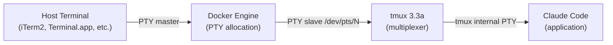
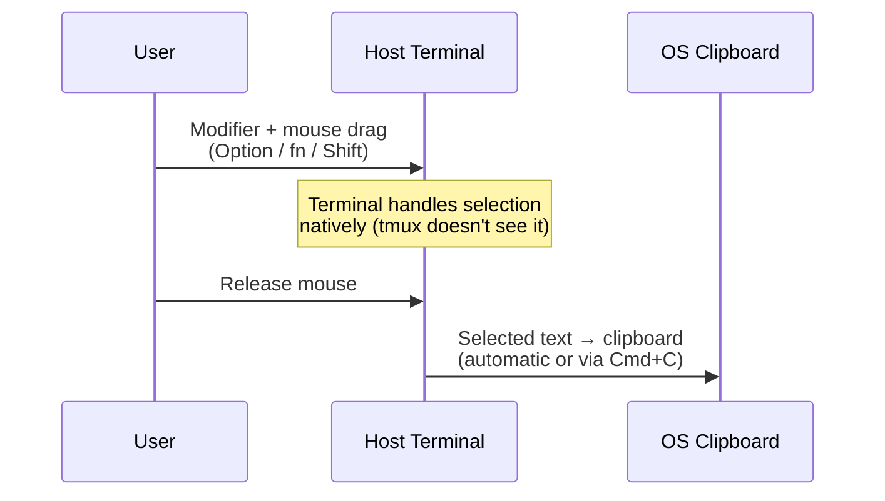

# Analysis: Terminal Clipboard, Mouse and Selection in Docker + tmux

> Date: 2026-02-24
> Status: Analysis complete — pending design phase
> Related: [config/tmux.conf](../../config/tmux.conf) | [architecture.md](../maintainer/architecture.md)

---

## 1. Problem Statement

Users report that copy-paste and text selection don't work as expected when using `cco start` sessions. The behavior varies depending on the host terminal emulator, and the root cause is unclear because the signal path involves four layers: **host terminal → Docker PTY → tmux → application (Claude Code)**.

This document maps the official behavior of each layer, without proposing fixes. It will serve as the reference for a subsequent design session.

---

## 2. The Signal Path

Every keystroke and mouse event travels through four layers. Each layer may intercept, transform, or pass through the signal.



For **output** (application → user's eyes), the flow is reversed. For **clipboard operations** (OSC 52), the escape sequence travels from inside out: application → tmux → Docker PTY → host terminal → OS clipboard.

---

## 3. Layer 1: Docker PTY

### How Docker allocates a TTY

When `docker compose run` is invoked with `stdin_open: true` and `tty: true` (as `cco start` does), Docker:

1. Allocates a pseudo-terminal pair (PTY master + slave) inside the container via `/dev/ptmx`
2. Connects the container's stdin/stdout/stderr to the PTY slave (`/dev/pts/N`)
3. Bridges the host terminal's PTY to the container's PTY master

### What Docker does and does NOT do

| Aspect | Behavior |
|--------|----------|
| Byte passthrough | **Transparent**. Docker does not interpret, filter, or modify escape sequences. All bytes pass as-is between PTY master and slave. |
| OSC 52 sequences | **Passed through**. Docker has no clipboard awareness. |
| Mouse events | **Passed through**. The terminal's mouse reporting protocol (SGR, X10, etc.) is not interpreted by Docker. |
| SIGWINCH (resize) | **Forwarded**. Docker propagates terminal resize signals to the container's PTY. |
| TERM variable | **Inherited** from the host session or set explicitly in the container. Docker does not modify it. |

### Key point

Docker is a transparent pipe. It neither helps nor hinders clipboard or mouse operations. Any issues originate in the layers above (tmux) or below (host terminal).

### Reference

- Docker documentation: [docker run — Foreground](https://docs.docker.com/reference/cli/docker/container/run/#foreground)
- moby source: PTY allocation in `pkg/term/` and `daemon/exec/`

---

## 4. Layer 2: tmux

tmux is the most complex layer. It acts as a **terminal emulator** (receiving input from applications) and a **terminal client** (sending output to the host terminal). It intercepts and reinterprets both mouse events and escape sequences.

### 4.1 Mouse handling

#### `set -g mouse on`

When enabled, tmux sends mouse reporting escape sequences to the outer terminal, requesting all mouse events. The outer terminal then forwards click, drag, and scroll events as escape sequences into tmux instead of handling them natively.

Consequences:
- tmux receives all mouse events and handles them internally (pane selection, scrollback, copy-mode entry, window resize via drag)
- The host terminal **no longer sees mouse events**, so native text selection (and its automatic OS clipboard copy) is disabled
- The user must use tmux's own copy-mode for selection, or hold a modifier key to bypass tmux

#### `set -g mouse off`

tmux does not request mouse reporting. The host terminal handles all mouse events natively. Text selection, copy-paste, and scrolling work as the terminal normally provides. However:
- No mouse-based pane switching or resizing
- No mouse scrollback in tmux (only keyboard)
- Selecting text across pane boundaries selects the raw character grid (including pane borders)

#### tmux copy-mode (with `mouse on`)

When the user clicks and drags inside a tmux pane (with `mouse on`), tmux enters copy-mode. The selection behavior depends on key bindings:

| Binding | Effect |
|---------|--------|
| `mode-keys vi` | vi-style navigation in copy-mode (hjkl, v, y, etc.) |
| `v` in `copy-mode-vi` → `begin-selection` | Start visual selection |
| `y` in `copy-mode-vi` → `copy-selection-and-cancel` | Yank selection to tmux buffer, exit copy-mode |
| `MouseDragEnd1Pane` → `copy-pipe-and-cancel` | Automatically copy to tmux buffer on mouse release (without needing to press `y`) |

**Without `MouseDragEnd1Pane`**, mouse selection in tmux requires the user to: drag to select, then press `y` to copy. This is the current `cco` behavior and is non-obvious to most users.

**With `MouseDragEnd1Pane` → `copy-pipe-and-cancel`**, releasing the mouse button automatically copies the selection. Combined with `set-clipboard on`, this also sends it to the OS clipboard via OSC 52.

### 4.2 OSC 52 clipboard

OSC 52 is an escape sequence that allows applications to set (and optionally read) the OS clipboard:

```
ESC ] 52 ; <target> ; <base64-data> BEL
```

Where `<target>` is `c` (clipboard), `p` (primary selection on X11), or `s` (secondary).

#### `set-clipboard` option

This is the primary control for OSC 52 in tmux:

| Value | Introduced | Behavior |
|-------|-----------|----------|
| `on` | tmux 1.5 | tmux **accepts** OSC 52 from applications inside panes (creates a tmux paste buffer) **AND** re-emits OSC 52 to the outer terminal (reaches OS clipboard). |
| `external` | tmux 2.6 (default since 2.6) | tmux re-emits OSC 52 to the outer terminal **BUT rejects** OSC 52 from applications inside panes. Only tmux's own copy operations generate OSC 52. |
| `off` | tmux 1.5 | Completely disables OSC 52 handling. No clipboard interaction. |

**Critical detail**: the default changed from `on` to `external` in tmux 2.6. Any tmux 2.6+ installation without explicit `set-clipboard on` will silently block applications (like vim or neovim inside the container) from setting the clipboard.

**For Docker containers**, `on` is the correct value: applications inside the container need to set the host clipboard, and they can only do so via OSC 52 through tmux.

#### `allow-passthrough` option (tmux 3.3+)

This controls DCS (Device Control String) passthrough — a different mechanism from OSC 52:

| Value | Behavior |
|-------|----------|
| `off` (default) | DCS passthrough sequences are blocked |
| `on` | DCS passthrough allowed for visible panes |
| `all` | DCS passthrough allowed for all panes (including invisible) |

DCS passthrough is used for: iTerm2 inline images, sixel graphics, Kitty image protocol. It is **NOT required for OSC 52** (which tmux handles natively via `set-clipboard`), but it's a complementary feature.

#### The `Ms` terminal capability

tmux needs to know the format for OSC 52 sequences to emit to the outer terminal. It looks for the `Ms` capability in the outer terminal's terminfo.

- For terminals with `TERM` matching `xterm*`, tmux adds `Ms` automatically
- For other terminal types, `Ms` must be added explicitly via `terminal-overrides` or `terminal-features`

Verify availability: `tmux info | grep Ms:`

If missing, add explicitly:
```
# tmux 3.2+ style:
set -as terminal-features ',xterm-256color:clipboard'

# Legacy style (all versions):
set -as terminal-overrides ',xterm-256color:Ms=\E]52;%p1%s;%p2%s\007'
```

### 4.3 `default-terminal` setting

This sets the `TERM` value **inside** tmux panes. It does NOT affect the outer terminal.

| Value | Availability | Notes |
|-------|-------------|-------|
| `screen-256color` | Universal (all systems) | No italics support, fewer key codes. Legacy choice. |
| `tmux-256color` | Modern ncurses (Debian Bookworm has it) | Full italics, complete key codes, accurate terminfo. |

This setting does not directly affect clipboard behavior, but `tmux-256color` provides a more complete terminfo database for applications inside the container.

### 4.4 `terminal-overrides` and `terminal-features`

These configure capabilities for the **outer** terminal (the one tmux is running inside of):

```
# terminal-overrides (all tmux versions):
# Adds True Color capability for xterm-256color
set -ga terminal-overrides ",xterm-256color:Tc"

# terminal-features (tmux 3.2+):
# Adds clipboard (OSC 52) capability
set -as terminal-features ",xterm-256color:clipboard"
```

The pattern `xterm-256color` matches against the `TERM` value of the outer terminal. If the host terminal sets a different `TERM` (e.g., `alacritty`, `wezterm`), additional overrides may be needed.

### tmux version history (clipboard-relevant changes)

| Version | Change | Impact |
|---------|--------|--------|
| 1.5 | `set-clipboard` added (default: `on`) | First OSC 52 support |
| 2.4 | Copy-mode key bindings restructured | Old `-t vi-copy` syntax no longer works |
| 2.6 | `set-clipboard` gains `external` value; **default changes to `external`** | Applications inside tmux can no longer set clipboard by default |
| 3.2 | `terminal-features` option added; `load-buffer -w` | Cleaner capability configuration |
| 3.3 | `allow-passthrough` option added (default: `off`) | DCS passthrough requires explicit opt-in |
| 3.3a | `refresh-client -l` with argument | Clipboard sync improvements |
| 3.4 | First argument of OSC 52 preserved | Apps can specify clipboard target (`c`, `p`, `s`) |

### Reference

- [tmux Wiki — Clipboard](https://github.com/tmux/tmux/wiki/Clipboard)
- [tmux man page — `set-clipboard`](https://man.openbsd.org/tmux.1)
- [tmux FAQ](https://github.com/tmux/tmux/wiki/FAQ)
- [On tmux OSC-52 support (Kalnytskyi)](https://kalnytskyi.com/posts/on-tmux-osc52-support/)
- [Copying to clipboard from tmux and Vim using OSC 52 (Sunaku)](https://sunaku.github.io/tmux-yank-osc52.html)
- [tmux CHANGES (changelog)](https://github.com/tmux/tmux/blob/master/CHANGES)

---

## 5. Layer 3: Host Terminal Emulators

Each terminal emulator handles mouse events, clipboard, and escape sequences differently. This section documents the official behavior of the major terminals.

### 5.1 macOS: iTerm2

| Feature | Behavior | Configuration |
|---------|----------|---------------|
| OSC 52 write (app → clipboard) | **Supported** | Requires: Preferences > General > Selection > "Applications in terminal may access clipboard" (disabled by default) |
| OSC 52 read (clipboard → app) | **Not supported** | N/A |
| Mouse bypass key | **Option** (Alt) | Holding Option while dragging bypasses tmux mouse capture and activates native terminal selection |
| Native selection clipboard | Copies to macOS pasteboard (Cmd+C or automatic) | Default behavior |
| DCS passthrough | Supported | Used for inline images (`ESC ] 1337 ; File=...`) |
| `TERM` value | `xterm-256color` (default) | Configurable per profile |

**Important**: OSC 52 is disabled by default in iTerm2. Without enabling it in preferences, copy from container applications to the macOS clipboard will silently fail.

### 5.2 macOS: Terminal.app

| Feature | Behavior | Configuration |
|---------|----------|---------------|
| OSC 52 write | **NOT supported** | Terminal.app does not implement OSC 52 |
| OSC 52 read | **NOT supported** | N/A |
| Mouse bypass key | **fn** (Function) | Holding fn while dragging activates native selection |
| Native selection clipboard | Copies to macOS pasteboard | Default behavior |
| DCS passthrough | Not supported | N/A |
| `TERM` value | `xterm-256color` (default) | Configurable |

**Terminal.app cannot receive clipboard data via OSC 52**. For users of Terminal.app, the only copy method is native selection (fn + drag) or manual copy (enter tmux copy-mode, select, then use `pbcopy` via a pipe — impractical in Docker).

### 5.3 Linux: Alacritty

| Feature | Behavior | Configuration |
|---------|----------|---------------|
| OSC 52 write | **Supported** | Out-of-the-box |
| OSC 52 read | Not supported (default) | Can be enabled in config |
| Mouse bypass key | **Shift** | Standard across most Linux terminals |
| Native selection clipboard | Copies to X11/Wayland clipboard | Default behavior |
| `TERM` value | `alacritty` (custom terminfo) | May need `terminal-overrides` in tmux |

**Note**: Alacritty sets `TERM=alacritty` by default. tmux's automatic `Ms` detection only triggers for `xterm*` patterns. If the outer `TERM` is `alacritty`, explicit `terminal-overrides` or `terminal-features` are needed for OSC 52.

### 5.4 Linux/macOS: WezTerm

| Feature | Behavior | Configuration |
|---------|----------|---------------|
| OSC 52 write | **Supported** | Out-of-the-box |
| OSC 52 read | **Supported** | Out-of-the-box |
| Mouse bypass key | **Shift** | Configurable via mouse bindings |
| Native selection clipboard | Copies to system clipboard | Default behavior |
| `TERM` value | `xterm-256color` (default) | Configurable |

WezTerm has the most complete OSC 52 support (both read and write).

### 5.5 Linux/macOS: Kitty

| Feature | Behavior | Configuration |
|---------|----------|---------------|
| OSC 52 write | **Supported** | Out-of-the-box |
| OSC 52 read | Opt-in | `clipboard_control write-clipboard write-primary read-clipboard read-primary` |
| Mouse bypass key | **Shift** | Standard |
| Native selection clipboard | Copies to system clipboard | Default behavior |
| `TERM` value | `xterm-kitty` | May need `terminal-overrides` in tmux |

**Note**: Like Alacritty, Kitty uses a non-`xterm*` TERM value. Explicit clipboard capability may be needed.

### 5.6 Linux/macOS: Ghostty

| Feature | Behavior | Configuration |
|---------|----------|---------------|
| OSC 52 write | **Supported** | Out-of-the-box |
| OSC 52 read | **Supported** | Out-of-the-box |
| Mouse bypass key | **Shift** | Standard |
| Native selection clipboard | Copies to system clipboard | Default behavior |
| `TERM` value | `xterm-ghostty` | May need `terminal-overrides` in tmux |

### 5.7 Windows: Windows Terminal

| Feature | Behavior | Configuration |
|---------|----------|---------------|
| OSC 52 write | **Supported** (since 2021) | Out-of-the-box |
| OSC 52 read | Not supported | N/A |
| Mouse bypass key | **Shift** | Standard |
| Native selection clipboard | Copies to Windows clipboard | Default behavior |
| `TERM` value | Depends on shell/WSL configuration | Typically `xterm-256color` |

### 5.8 Linux: GNOME Terminal (and VTE-based terminals)

| Feature | Behavior | Configuration |
|---------|----------|---------------|
| OSC 52 write | **NOT supported** | VTE library maintainers explicitly rejected OSC 52 for security reasons |
| OSC 52 read | **NOT supported** | N/A |
| Mouse bypass key | **Shift** | Standard |
| Native selection clipboard | Copies to X11/Wayland clipboard | Default behavior |
| `TERM` value | `xterm-256color` | Default |

Applies to all VTE-based terminals: GNOME Terminal, XFCE Terminal, Terminator, Tilix, MATE Terminal.

**VTE terminals cannot receive clipboard data via OSC 52**. Same limitation as Terminal.app — only native selection (Shift + drag) works.

### 5.9 Linux: Konsole

| Feature | Behavior | Configuration |
|---------|----------|---------------|
| OSC 52 write | **Partial** (since 24.12) | Recently implemented, may have issues |
| OSC 52 read | Not supported | N/A |
| Mouse bypass key | **Shift** | Standard |
| Native selection clipboard | Copies to system clipboard | Default behavior |
| `TERM` value | `xterm-256color` | Default |

### Summary: OSC 52 compatibility matrix

| Terminal | OSC 52 | Bypass Key | Platform |
|----------|--------|------------|----------|
| iTerm2 | Yes (opt-in) | Option | macOS |
| Terminal.app | **No** | fn | macOS |
| Alacritty | Yes | Shift | Linux/macOS |
| WezTerm | Yes | Shift | Linux/macOS |
| Kitty | Yes | Shift | Linux/macOS |
| Ghostty | Yes | Shift | Linux/macOS |
| Windows Terminal | Yes | Shift | Windows |
| GNOME Terminal | **No** | Shift | Linux |
| XFCE Terminal | **No** | Shift | Linux |
| Konsole | Partial | Shift | Linux |

---

## 6. How Copy-Paste Works End-to-End

### 6.1 Method A: OSC 52 (programmatic clipboard)

This is the ideal path. An application inside the container sends an OSC 52 escape sequence, and the text arrives in the user's OS clipboard.

```mermaid
sequenceDiagram
    participant App as Application<br/>(vim, Claude Code)
    participant Tmux as tmux
    participant Docker as Docker PTY
    participant Term as Host Terminal
    participant OS as OS Clipboard

    App->>Tmux: ESC]52;c;base64data\a
    Note over Tmux: set-clipboard on:<br/>1. Creates tmux paste buffer<br/>2. Re-emits OSC 52 to outer terminal
    Tmux->>Docker: ESC]52;c;base64data\a
    Note over Docker: Transparent passthrough
    Docker->>Term: ESC]52;c;base64data\a
    Term->>OS: Decodes base64 → sets clipboard
    Note over OS: Text now in clipboard.<br/>User can Cmd+V / Ctrl+V.
```

**Requirements for this to work**:
1. tmux `set-clipboard on` (not `external` or `off`)
2. Host terminal supports OSC 52 (excludes Terminal.app, VTE terminals)
3. tmux knows the outer terminal supports OSC 52 (via `Ms` capability)
4. If the host terminal requires opt-in (iTerm2), it must be enabled

**Failure mode**: if any requirement is unmet, the OSC 52 sequence is silently dropped. No error is displayed.

### 6.2 Method B: tmux copy-mode + OSC 52

The user selects text using tmux's copy-mode (keyboard or mouse), and tmux sends OSC 52 to the outer terminal.

```mermaid
sequenceDiagram
    participant User as User
    participant Term as Host Terminal
    participant Tmux as tmux
    participant OS as OS Clipboard

    User->>Term: Mouse drag (or keyboard in copy-mode)
    Term->>Tmux: Mouse events (SGR encoding)
    Note over Tmux: Enters copy-mode,<br/>highlights selection
    User->>Term: Release mouse (or press 'y')
    Term->>Tmux: MouseDragEnd / key event

    alt MouseDragEnd1Pane bound to copy-pipe-and-cancel
        Note over Tmux: Auto-copies on mouse release
    else No MouseDragEnd binding
        Note over Tmux: User must press 'y' to copy
    end

    Note over Tmux: set-clipboard on:<br/>emits OSC 52 to outer terminal
    Tmux->>Term: ESC]52;c;base64data\a
    Term->>OS: Sets clipboard
```

**This is the primary copy method when `mouse on` is set**. It works in any terminal that supports OSC 52.

### 6.3 Method C: Native terminal selection (bypass tmux)

The user holds a modifier key to bypass tmux's mouse capture, activating the host terminal's native text selection.



**This is the only copy method for Terminal.app and VTE terminals** (which don't support OSC 52).

**Limitations**:
- Selection crosses tmux pane boundaries (selects raw character grid including borders and status bar)
- No awareness of tmux's content structure
- Works only for visible text on screen

### 6.4 Paste: from OS clipboard to container

Paste always works the same way regardless of the method used to copy:

| Method | How it works |
|--------|-------------|
| **Terminal paste** (Cmd+V / Ctrl+Shift+V) | The terminal sends the clipboard content as keyboard input. Goes through Docker PTY → tmux → application. Works everywhere. |
| **tmux paste** (prefix + `]`) | Pastes from tmux's internal paste buffer. Only contains text copied via tmux copy-mode (not from OS clipboard). |
| **Bracketed paste** | Most modern terminals wrap pasted text in `ESC[200~...ESC[201~` sequences. tmux and applications can detect this to avoid interpreting pasted text as commands. |

**Key asymmetry**: paste (clipboard → container) always works via terminal input. The problem is only with **copy** (container → clipboard).

---

## 7. Current Configuration State

File: `config/tmux.conf` (as of 2026-02-24)

```bash
set -g default-terminal "screen-256color"
set -ga terminal-overrides ",xterm-256color:Tc"
set -g mouse on
set -g set-clipboard on
setw -g mode-keys vi
bind-key -T copy-mode-vi v send-keys -X begin-selection
bind-key -T copy-mode-vi y send-keys -X copy-selection-and-cancel
```

### What works

| Feature | Status | Notes |
|---------|--------|-------|
| `set-clipboard on` | Correct | Enables OSC 52 for applications and tmux copy-mode |
| `mouse on` | Correct | Enables mouse-based pane switching, scrollback, copy-mode entry |
| `mode-keys vi` | Correct | vi-style copy-mode navigation |
| `v` → begin-selection | Correct | Standard vi selection start |
| `y` → copy-selection-and-cancel | Correct | Standard vi yank |

### What's missing or suboptimal

| Issue | Current | Recommended | Reason |
|-------|---------|-------------|--------|
| `default-terminal` | `screen-256color` | `tmux-256color` | More complete terminfo (italics, key codes). Available in Debian Bookworm. |
| Explicit clipboard capability | Missing | `set -as terminal-features ",xterm-256color:clipboard"` | Makes OSC 52 explicit instead of relying on heuristic `xterm*` matching. Needed if outer TERM is not `xterm*`. |
| `allow-passthrough` | Missing (default: off) | `set -g allow-passthrough on` | Enables DCS passthrough for iTerm2 inline images and other sequences. Not strictly needed for OSC 52, but complementary. |
| `MouseDragEnd1Pane` binding | Missing | `bind-key -T copy-mode-vi MouseDragEnd1Pane send-keys -X copy-pipe-and-cancel` | Auto-copies on mouse release. Without this, users must press `y` after selecting — non-obvious UX. |
| `C-v` rectangle toggle | Missing | `bind-key -T copy-mode-vi C-v send-keys -X rectangle-toggle` | Enables rectangular (column) selection in copy-mode. |
| Bypass key documentation | Only iTerm2 + Terminal.app | All major terminals | Users on Linux/Windows don't know how to bypass tmux mouse. |

### Environment details

- **tmux version**: 3.3a (Debian Bookworm)
- **`tmux-256color` terminfo**: available
- **Container base**: node:22-bookworm (Debian 12)

---

## 8. Intrinsic Limitations (Not Fixable)

These are constraints imposed by the host terminal or architecture. No tmux or Docker configuration can work around them.

| Limitation | Affected Users | Workaround |
|------------|---------------|------------|
| Terminal.app does not support OSC 52 | macOS users with Terminal.app | Use native selection (fn + drag). Or switch to iTerm2/WezTerm/Ghostty/Kitty. |
| VTE terminals do not support OSC 52 | GNOME Terminal, XFCE Terminal, Terminator, Tilix users | Use native selection (Shift + drag). Or switch to Alacritty/WezTerm/Ghostty/Kitty/Foot. |
| Native selection crosses pane boundaries | All terminals, when using modifier bypass | This is a fundamental limitation: the host terminal sees the screen as a flat character grid, not as tmux panes. |
| tmux paste buffer is separate from OS clipboard | All users | tmux `prefix + ]` pastes from tmux buffer, not OS clipboard. Use terminal paste (Cmd+V / Ctrl+Shift+V) for OS clipboard. |
| iTerm2 OSC 52 is opt-in | iTerm2 users who haven't enabled the preference | Must be documented. No way to auto-enable from inside the container. |

---

## 9. Open Questions for Design Phase

1. **Should we add `allow-passthrough on`?** It has security implications (any process in a pane can send arbitrary escape sequences to the host terminal). For a development container running `--dangerously-skip-permissions`, this may be acceptable.

2. **Should `MouseDragEnd1Pane` copy-pipe include a command?** The `copy-pipe-and-cancel` form without a command only copies to the tmux buffer (and clipboard via OSC 52). Adding a command (e.g., piping to a file) could provide fallback for terminals without OSC 52, but adds complexity.

3. **Should we document the iTerm2 preference requirement in the quick-start guide or in an entrypoint message?** A startup warning could help users who haven't enabled OSC 52 in iTerm2.

4. **Should we add `terminal-overrides` for non-xterm TERM values?** Alacritty (`alacritty`), Kitty (`xterm-kitty`), and Ghostty (`xterm-ghostty`) use custom TERM values. We could add broad overrides, but this increases config maintenance.

5. **Is `mouse on` the right default?** It provides pane switching and scrollback, but creates the bypass-key confusion. An alternative is `mouse off` with keyboard-only navigation, which gives users native terminal selection by default — but loses mouse UX.

---

## 10. References

### tmux

- [tmux Wiki — Clipboard](https://github.com/tmux/tmux/wiki/Clipboard)
- [tmux Wiki — FAQ](https://github.com/tmux/tmux/wiki/FAQ)
- [tmux man page](https://man.openbsd.org/tmux.1)
- [tmux CHANGES (changelog)](https://github.com/tmux/tmux/blob/master/CHANGES)
- [On tmux OSC-52 support — Kalnytskyi](https://kalnytskyi.com/posts/on-tmux-osc52-support/)
- [Copying to clipboard from tmux and Vim using OSC 52 — Sunaku](https://sunaku.github.io/tmux-yank-osc52.html)
- [tmux in practice: integration with system clipboard — FreeCodeCamp](https://www.freecodecamp.org/news/tmux-in-practice-integration-with-system-clipboard-bcd72c62ff7b/)

### Terminal emulators

- [iTerm2 — General Preferences Documentation](https://iterm2.com/documentation-preferences-general.html)
- [Alacritty — Configuration](https://alacritty.org/config-alacritty.html)
- [WezTerm — Mouse Binding Documentation](https://wezfurlong.org/wezterm/config/mouse.html)
- [Kitty — Configuration](https://sw.kovidgoyal.net/kitty/conf/)
- [Ghostty — Documentation](https://ghostty.org/docs)
- [VTE Bug 795774 — OSC 52 rejection](https://bugzilla.gnome.org/show_bug.cgi?id=795774)
- [Konsole MR #767 — OSC 52 implementation](https://invent.kde.org/utilities/konsole/-/merge_requests/767)
- [Windows Terminal Issue #2946 — OSC 52 support](https://github.com/microsoft/terminal/issues/2946)

### Docker

- [Docker CLI reference — docker run](https://docs.docker.com/reference/cli/docker/container/run/)
- [moby Issue #728 — Interactive Shell TTY](https://github.com/moby/moby/issues/728)

### OSC 52 specification

- [xterm Control Sequences — Operating System Commands](https://invisible-island.net/xterm/ctlseqs/ctlseqs.html#h3-Operating-System-Commands)
