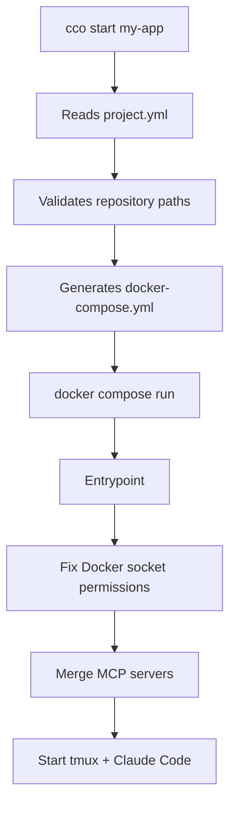

# Your first project

> Complete walkthrough: from project creation to your first Claude Code session.

---

## 1. Create the project

```bash
cco project create my-app --repo ~/projects/my-app
```

This generates the structure in `projects/my-app/`:

```
projects/my-app/
├── project.yml              # Main configuration
├── .claude/
│   ├── CLAUDE.md            # Instructions for Claude (project level)
│   ├── settings.json        # Settings override (optional)
│   ├── agents/              # Custom subagents (optional)
│   └── rules/               # Custom rules (optional)
├── claude-state/            # Memory and transcripts (persist across sessions)
│   └── memory/
└── docker-compose.yml       # Auto-generated by `cco start`
```

For multi-repo projects, pass multiple `--repo` flags:

```bash
cco project create my-saas \
  --repo ~/projects/backend-api \
  --repo ~/projects/frontend-app \
  --description "SaaS platform with API and frontend"
```

---

## 2. Configure project.yml

Open `projects/my-app/project.yml` and verify the configuration:

```yaml
repos:
  - path: ~/projects/my-app
    name: my-app

docker:
  ports:
    - "3000:3000"        # Dev server
  env:
    NODE_ENV: development
```

Main sections:

- **`repos`** — repositories to mount in `/workspace/` (read-write)
- **`docker.ports`** — ports exposed to `localhost` on the host
- **`docker.env`** — environment variables available in the container
- **`packs`** — knowledge packs to activate (optional)

For the complete reference, see [project-yaml.md](../reference/project-yaml.md).

---

## 3. Customize CLAUDE.md

The file `projects/my-app/.claude/CLAUDE.md` contains the instructions Claude receives at startup. You have two options:

### Option A: Use /init-workspace (recommended)

In the first session, Claude can analyze the codebase and automatically generate a detailed CLAUDE.md:

```
> /init-workspace
```

The skill explores each repository, detects the stack and commands, and generates a structured CLAUDE.md with: overview, layout, commands, architecture.

### Option B: Write manually

Include at least: project overview, architecture, main commands (build, test, dev server), and specific conventions.

---

## 4. Start the session

```bash
cco start my-app
```

### What happens during startup



1. The CLI reads `project.yml` and verifies that the repositories exist
2. Generates `docker-compose.yml` with volume mounts, ports, and variables
3. Launches the container with `docker compose run --rm --service-ports`
4. The entrypoint configures Docker socket permissions and starts tmux
5. Claude Code starts with `--dangerously-skip-permissions` (safe in the container)
6. The `SessionStart` hook injects the project context (repos, MCP, packs)

---

## 5. Using the session

### What Claude knows

At startup, Claude has already loaded:

- **Global instructions** (`~/.claude/CLAUDE.md`) — workflow, git practices, general rules
- **Project instructions** (`/workspace/.claude/CLAUDE.md`) — project-specific context
- **Session context** — list of repositories, available MCP servers, knowledge packs
- **Memory** — notes from previous sessions (if any)

### Agent teams

Claude can create agent teams to work in parallel. In tmux mode (default), each teammate appears as a separate tmux pane. Navigation:

| Shortcut | Action |
|----------|--------|
| `Ctrl-b` + arrow keys | Navigate between panes |
| `Ctrl-b` + `z` | Zoom/unzoom current pane |
| `Ctrl-b` + `[` | Scroll mode (then `q` to exit) |

### Docker-from-Docker

Claude can launch infrastructure directly:

```
> Start postgres and redis for the project
```

Claude will run `docker compose up` creating sibling containers on the host, reachable via the shared network `cc-my-app`.

### Copy text from tmux

To copy text (e.g., authentication URL):

1. `Ctrl-b` + `[` — enter copy mode
2. Navigate and select with arrow keys
3. `Enter` — copy to tmux clipboard
4. `Ctrl-b` + `]` — paste

---

## 6. Stop the session

Type `/exit` in the Claude session, or from another terminal:

```bash
cco stop my-app
```

### What persists

| Element | Persists? | Where |
|----------|-----------|------|
| Git commits | Yes | In repositories mounted from the host |
| Claude memory | Yes | `projects/my-app/claude-state/memory/` |
| Session transcript | Yes | `projects/my-app/claude-state/` |
| Container files | No | Lost at exit (container `--rm`) |
| Sibling containers | Yes | Remain active until stopped |

Memory and transcripts allow you to resume work with `/resume` even after a Docker image rebuild.

---

## Next steps

- [Key concepts](concepts.md) — understand context hierarchy, knowledge packs, agent teams
- [Project setup](../user-guides/project-setup.md) — advanced guide on repos, extra_mounts, packs, CLAUDE.md
- [CLI reference](../reference/cli.md) — all commands and `project.yml` format
