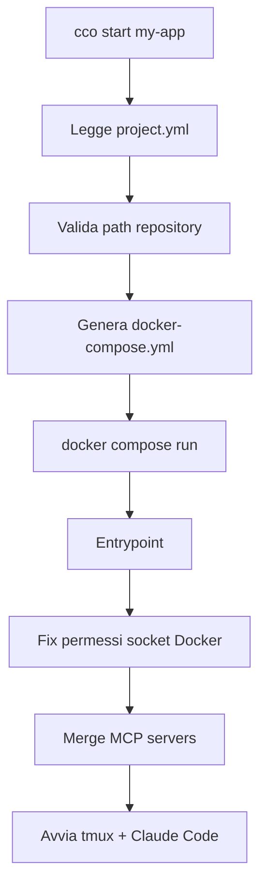

# Il tuo primo progetto

> Walkthrough completo: dalla creazione del progetto alla prima sessione Claude Code.

---

## 1. Crea il progetto

```bash
cco project create my-app --repo ~/projects/my-app
```

Questo genera la struttura in `projects/my-app/`:

```
projects/my-app/
├── project.yml              # Configurazione principale
├── .claude/
│   ├── CLAUDE.md            # Istruzioni per Claude (livello progetto)
│   ├── settings.json        # Override settings (opzionale)
│   ├── agents/              # Subagent custom (opzionale)
│   └── rules/               # Regole custom (opzionali)
├── claude-state/            # Memoria e transcript (persistenti tra sessioni)
│   └── memory/
└── docker-compose.yml       # Auto-generato da `cco start`
```

Per progetti multi-repo, passa piu flag `--repo`:

```bash
cco project create my-saas \
  --repo ~/projects/backend-api \
  --repo ~/projects/frontend-app \
  --description "Piattaforma SaaS con API e frontend"
```

---

## 2. Configura project.yml

Apri `projects/my-app/project.yml` e verifica la configurazione:

```yaml
repos:
  - path: ~/projects/my-app
    name: my-app

docker:
  ports:
    - "3000:3000"        # Dev server
  env:
    NODE_ENV: development
```

Le sezioni principali:

- **`repos`** — repository da montare in `/workspace/` (read-write)
- **`docker.ports`** — porte esposte verso `localhost` sull'host
- **`docker.env`** — variabili d'ambiente disponibili nel container
- **`packs`** — knowledge pack da attivare (opzionale)

Per la reference completa vedi [cli.md](../reference/cli.md).

---

## 3. Personalizza CLAUDE.md

Il file `projects/my-app/.claude/CLAUDE.md` contiene le istruzioni che Claude riceve all'avvio. Hai due opzioni:

### Opzione A: Usa /init-workspace (consigliato)

Alla prima sessione, Claude puo analizzare il codebase e generare automaticamente un CLAUDE.md dettagliato:

```
> /init-workspace
```

La skill esplora ogni repository, rileva stack e comandi, e genera un CLAUDE.md strutturato con: overview, layout, comandi, architettura.

### Opzione B: Scrivi manualmente

Includi almeno: overview del progetto, architettura, comandi principali (build, test, dev server), e convenzioni specifiche.

---

## 4. Avvia la sessione

```bash
cco start my-app
```

### Cosa succede durante l'avvio



1. Il CLI legge `project.yml` e verifica che le repository esistano
2. Genera `docker-compose.yml` con volume mount, porte e variabili
3. Lancia il container con `docker compose run --rm --service-ports`
4. L'entrypoint configura i permessi del socket Docker e avvia tmux
5. Claude Code si avvia con `--dangerously-skip-permissions` (sicuro nel container)
6. L'hook `SessionStart` inietta il contesto del progetto (repo, MCP, pack)

---

## 5. Usare la sessione

### Cosa sa Claude

All'avvio, Claude ha gia caricato:

- **Istruzioni globali** (`~/.claude/CLAUDE.md`) — workflow, git practices, regole generali
- **Istruzioni progetto** (`/workspace/.claude/CLAUDE.md`) — contesto specifico del progetto
- **Contesto sessione** — lista repository, MCP server, knowledge pack disponibili
- **Memoria** — note dalle sessioni precedenti (se esistenti)

### Agent team

Claude puo creare agent team per lavorare in parallelo. In modalita tmux (default), ogni teammate appare come un pannello tmux separato. Navigazione:

| Shortcut | Azione |
|----------|--------|
| `Ctrl-b` + frecce | Naviga tra pannelli |
| `Ctrl-b` + `z` | Zoom/unzoom pannello corrente |
| `Ctrl-b` + `[` | Modalita scroll (poi `q` per uscire) |

### Docker-from-Docker

Claude puo lanciare infrastruttura direttamente:

```
> Avvia postgres e redis per il progetto
```

Claude eseguira `docker compose up` creando container fratelli sull'host, raggiungibili tramite la rete condivisa `cc-my-app`.

### Copia testo da tmux

Per copiare testo (es. URL di autenticazione):

1. `Ctrl-b` + `[` — entra in modalita copia
2. Naviga e seleziona con i tasti freccia
3. `Enter` — copia nella clipboard tmux
4. `Ctrl-b` + `]` — incolla

---

## 6. Fermare la sessione

Digita `/exit` nella sessione Claude, oppure da un altro terminale:

```bash
cco stop my-app
```

### Cosa persiste

| Elemento | Persiste? | Dove |
|----------|-----------|------|
| Commit git | Si | Nelle repository montate dall'host |
| Memoria Claude | Si | `projects/my-app/claude-state/memory/` |
| Session transcript | Si | `projects/my-app/claude-state/` |
| File nel container | No | Persi al termine (container `--rm`) |
| Container fratelli | Si | Rimangono attivi finche non fermati |

La memoria e i transcript permettono di riprendere il lavoro con `/resume` anche dopo un rebuild dell'immagine Docker.

---

## Prossimi passi

- [Concetti chiave](concepts.md) — capire la gerarchia di contesto, knowledge pack, agent team
- [Project setup](../user-guides/project-setup.md) — guida avanzata su repos, extra_mounts, packs, CLAUDE.md
- [CLI reference](../reference/cli.md) — tutti i comandi e il formato `project.yml`
