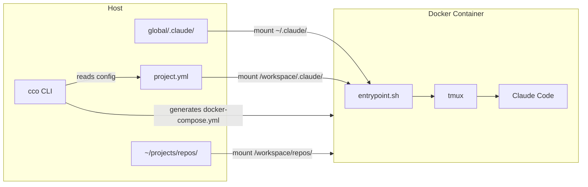

# What is claude-orchestrator

> Isolated Claude Code sessions in Docker, ready to use with a single command.

---

## What is it

claude-orchestrator is a tool that manages Claude Code sessions inside Docker containers. Each session is automatically configured with:

- Project repositories mounted read-write
- Complete context (instructions, rules, agents, skills)
- Agent teams ready for collaborative work
- Isolated memory per project

A single command (`cco start my-app`) launches everything.

---

## Why use it

| Problem | Solution |
|----------|-----------|
| Managing multiple projects with different configurations | Each project has its own `project.yml` with repos, ports, environment variables |
| Context lost between sessions | Four-level hierarchy: managed, global, project, repository |
| Complex agent teams to configure | Automatic configuration with tmux (or iTerm2) |
| Unstructured workflow | Predefined phases (Analysis, Design, Implementation, Documentation) with manual transitions |
| Shared memory between projects | Each project has its own isolated `claude-state/` directory |
| Risk of damage to host filesystem | Docker provides complete isolation: `--dangerously-skip-permissions` is safe in the container |

---

## How it works

The startup flow is straightforward:

1. **`cco start my-app`** — the CLI reads `project.yml`
2. **Generates `docker-compose.yml`** — volume mounts for repos, ports, environment variables
3. **Launches the Docker container** — image with Claude Code, tmux, Docker CLI, git
4. **Entrypoint** — fixes permissions, configures MCP, starts tmux
5. **Claude Code** — starts with all context already loaded

Inside the container, Claude Code has access to:

- **All project repositories** in `/workspace/`
- **Host Docker socket** to launch sibling containers (postgres, redis, etc.)
- **Exposed ports** to `localhost` on the host machine
- **Git and GitHub CLI** for commits, pushes and pull requests

---

## Next step

Go to the [installation guide](installation.md) to set up claude-orchestrator on your machine.
