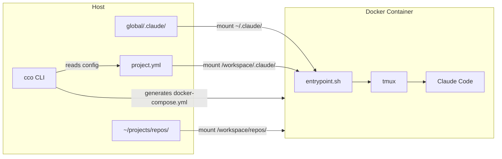

# What is claude-orchestrator

> The shared Claude Code environment for your team and projects.

---

## What it solves

Working with Claude Code on real projects has a recurring friction: every new session, you re-explain the project. Every new teammate, they configure Claude differently. Every client switch, you manually reload context.

claude-orchestrator eliminates that friction. Each project is a self-contained environment — repos mounted, instructions loaded, documentation available — ready at startup, shareable across your team.

| Problem | Solution |
|---|---|
| Every session, you re-explain the project to Claude | Per-project `CLAUDE.md` + knowledge packs: context is ready at startup |
| Different rules and docs per project/client | Each project is isolated: its own repos, instructions, memory |
| Your team configures Claude differently — no shared baseline | Commit the project directory: everyone gets the same repos, instructions, rules, and agents |
| Client docs and architecture specs scattered across sessions | Knowledge packs: define once, activate per project |
| Claude modifying files across the wrong project | Docker isolation: Claude can only touch what's mounted |
| `--dangerously-skip-permissions` feels risky on your machine | Safe in the container — Docker is the sandbox |

---

## Who is it for

- **Developers** working on multiple projects or clients simultaneously
- **Teams** who want a consistent, shared Claude Code environment
- **Agencies** managing per-client context and documentation
- **Anyone** who has ever re-explained their codebase to Claude at the start of a session

---

## What it is

claude-orchestrator manages Claude Code sessions inside Docker containers. Each session is configured with:

- Project repositories mounted read-write
- Complete context (instructions, rules, agents, skills, knowledge packs)
- Isolated memory per project
- Optional agent teams for collaborative work

A single command (`cco start my-app`) launches everything.

---

## How it works

The startup flow is straightforward:

1. **`cco start my-app`** — the CLI reads `project.yml`
2. **Generates `docker-compose.yml`** — volume mounts for repos, ports, environment variables
3. **Launches the Docker container** — image with Claude Code, tmux, Docker CLI, git
4. **Entrypoint** — fixes permissions, configures MCP, starts tmux
5. **Claude Code** — starts with all context already loaded

Inside the container, Claude Code has access to:

- **All project repositories** in `/workspace/`
- **Host Docker socket** to launch sibling containers (postgres, redis, etc.)
- **Exposed ports** to `localhost` on the host machine
- **Git and GitHub CLI** for commits, pushes and pull requests

---

## Next step

Go to the [installation guide](installation.md) to set up claude-orchestrator on your machine.
