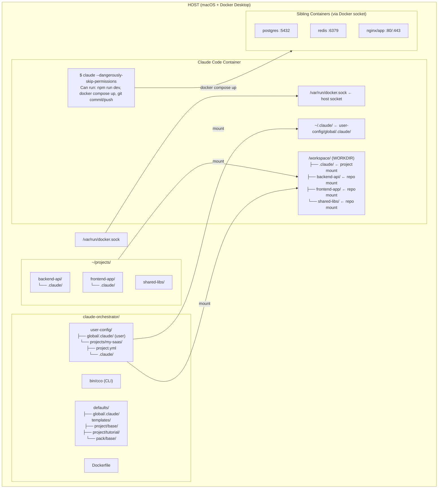
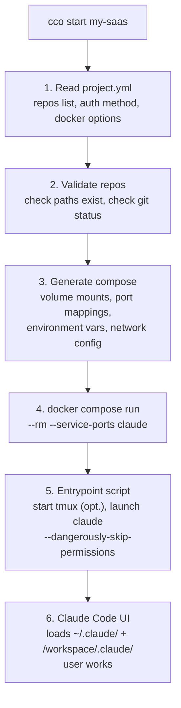
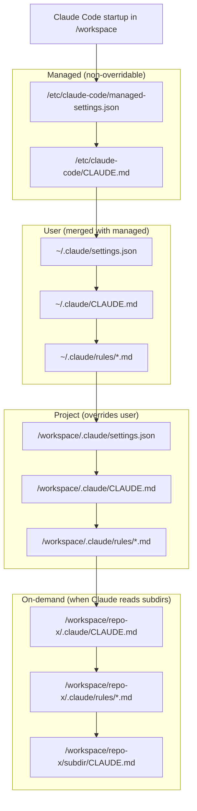
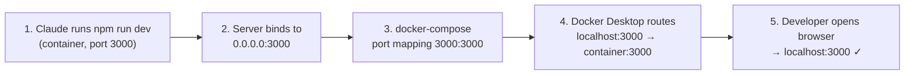
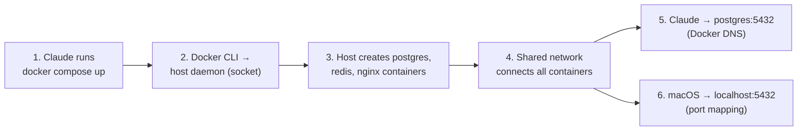

# Architecture & Design

> Version: 1.0.0
> Status: v1.0 — Current
> Related: [spec.md](./spec.md) | [docker.md](../integration/docker/design.md) | [context.md](../../reference/context-hierarchy.md)

---

## 1. System Overview



---

## 2. Key Architecture Decisions

### ADR-1: Docker as the Only Sandbox

**Context**: Claude Code offers native sandboxing (Seatbelt on macOS, bubblewrap on Linux). We need to decide whether to layer it with Docker.

**Decision**: Use Docker as the sole isolation mechanism. Disable native sandboxing.

**Rationale**:
- Docker provides filesystem and network isolation by design
- `--dangerously-skip-permissions` is safe within a container — the blast radius is the container
- Native sandboxing inside Docker requires `enableWeakerNestedSandbox`, which the docs explicitly state "considerably weakens security"
- No advantage in combining both; Docker alone is more secure than weakened native sandbox
- Git feature branches provide an additional safety net — any damage is reversible

**Consequences**:
- Container must NOT be run with `--privileged`
- Docker socket mount is the only intentional privilege escalation (see ADR-4)

---

### ADR-2: Workspace Layout — Flat Subdirectories

**Context**: Claude Code has one working directory. Multi-repo projects need a strategy.

**Decision**: WORKDIR = `/workspace`. Each repo is mounted as a direct subdirectory.

```
/workspace/              ← cwd, project-level .claude/ lives here
├── repo-alpha/          ← volume mount of real repo
│   └── .claude/         ← repo's own context (included in mount)
└── repo-beta/
    └── .claude/
```

**Rationale**:
- Claude Code discovers CLAUDE.md files recursively in subtrees — nested `.claude/` directories are loaded on-demand when Claude reads files there
- No `--add-dir` needed, no `CLAUDE_CODE_ADDITIONAL_DIRECTORIES_CLAUDE_MD` needed
- Clean hierarchy: `/workspace/.claude/CLAUDE.md` is project-level, subdirectories are repo-level
- Matches Claude Code's natural resolution order

**Consequences**:
- All repos appear as subdirectories of `/workspace`
- The project CLAUDE.md at `/workspace/.claude/CLAUDE.md` is the primary instruction file
- Repo CLAUDE.md files activate only when Claude reads files in that repo's directory

---

### ADR-3: Four-Tier Context Hierarchy (Updated — Managed Scope)

**Context**: Claude Code has a fixed precedence for settings and memory. We need to map our config to it. Claude Code's Managed level (`/etc/claude-code/`) provides non-overridable configuration.

**Decision**: Map orchestrator config to Claude Code's full native hierarchy:

| Orchestrator Layer | Container Path | Claude Code Scope | Loaded | Overridable? |
|---|---|---|---|---|
| `defaults/managed/` | `/etc/claude-code/` | Managed | Always at launch | No |
| `user-config/global/.claude/` | `~/.claude/` | User-level | Always at launch | Yes |
| `user-config/projects/<n>/.claude/` | `/workspace/.claude/` | Project-level | Always at launch | Yes |
| (repo's own `.claude/`) | `/workspace/<repo>/.claude/` | Nested | On-demand | Yes |

**Rationale**:
- Exact match with Claude Code's resolution order: managed → user → project → nested
- Managed level guarantees framework hooks and settings are always active
- Settings precedence works correctly: managed > user; project overrides user
- No hacks, symlinks, or custom scripts needed

**Consequences**:
- Framework infrastructure (hooks, env, deny rules) is in managed — always active, non-overridable
- User preferences (agents, skills, rules, settings) are in user level — fully customizable
- Repo-level `.claude/` files stay in the actual repos (not duplicated in orchestrator)
- The `user-config/global/.claude/` directory must NOT contain project-specific data

---

### ADR-4: Docker-from-Docker via Socket Mount

**Context**: Claude needs to run `docker compose up` for microservices and run dev servers with accessible ports.

**Decision**: Mount the host's Docker socket into the Claude container. This is "Docker-from-Docker" (DfD), NOT Docker-in-Docker (DinD).

```yaml
volumes:
  - /var/run/docker.sock:/var/run/docker.sock
```

**How it works**:
1. Docker CLI inside the Claude container sends commands to the HOST Docker daemon
2. `docker compose up` creates **sibling containers** on the host (not nested)
3. Sibling containers share the host's Docker network
4. Port mappings on sibling containers are accessible from macOS via `localhost:<port>`

**For dev servers inside the Claude container** (e.g., `npm run dev`):
- Use docker-compose port mapping: `ports: ["3000:3000"]`
- The dev server binds to `0.0.0.0:3000` inside the container
- Docker Desktop for Mac routes `localhost:3000` on macOS to the container

**For sibling containers** (postgres, redis, etc.):
- Created via `docker compose up` from within Claude container
- Use a shared Docker network so Claude container can reach them
- Port mappings make them accessible from macOS too

**Rationale**:
- DfD is simpler and more performant than DinD
- No `--privileged` flag needed (just socket access)
- Single Docker daemon = no image duplication, shared cache
- Standard pattern used by CI/CD tools (Jenkins, GitLab Runner)

**Risks**:
- Docker socket = root-equivalent access to host Docker daemon
- Acceptable for single-developer workstation
- Claude container could theoretically manipulate other containers on the host
- Mitigated by: developer oversight, feature branches, session isolation

**Consequences**:
- Docker CLI and docker-compose must be installed in the image
- Container user needs permission to access the socket (group `docker` or socket permissions)
- Shared Docker networks need consistent naming to avoid conflicts between projects

---

### ADR-5: Authentication Strategy

**Decision**: Support multiple auth mechanisms, layered per project.

| Method | Mechanism | Use Case |
|--------|-----------|----------|
| OAuth (default) | Credentials seeded from macOS Keychain to `global/claude-state/.credentials.json` | Pro/Team/Enterprise subscriptions |
| API Key | `ANTHROPIC_API_KEY` env var | Direct API access, CI/CD |
| GitHub auth | `GITHUB_TOKEN` env var → `gh auth login --with-token` + `gh auth setup-git` | git push (HTTPS), `gh pr create`, MCP GitHub server |
| Per-project secrets | `secrets.env` at global and project level, loaded as runtime `-e` flags | Service tokens (never written to docker-compose.yml) |

**Implementation**:
- **OAuth**: On macOS, the CLI extracts credentials from macOS Keychain (`Claude Code-credentials`) and seeds them to `user-config/global/claude-state/.credentials.json`. Inside the container, Claude Code reads from `~/.claude/.credentials.json` (the Linux plaintext location). The `~/.claude.json` file (mounted from `global/claude-state/claude.json`) stores preferences and MCP servers — NOT auth tokens.
- **API Key**: `ANTHROPIC_API_KEY` env var passed to container via `--env` or `.env` file.
- **GitHub**: `GITHUB_TOKEN` env var triggers `gh auth login --with-token` + `gh auth setup-git` in the entrypoint. This enables git push (HTTPS), `gh pr create`, and MCP GitHub server — all with a single token.
- **Secrets**: `secrets.env` at both global and project level, loaded as runtime `-e` flags (never written to `docker-compose.yml`).

**Why not just mount `~/.claude.json` read-write?**
The current model uses a shared writable `user-config/global/claude-state/claude.json` that is synced from host when host has more recent data (by comparing `numStartups`). This avoids race conditions from concurrent writes by host and container Claude Code instances (which previously caused JSON corruption — "control characters are not allowed" errors). The `claude.json` file stores only preferences and MCP server config; OAuth credentials are handled separately via `.credentials.json`.

---

### ADR-6: Claude State Isolation and Persistence (Updated — Sprint 7-Vault)

**Context**: Claude Code stores auto memory and session transcripts at `~/.claude/projects/<project>/`. Since we mount `user-config/global/.claude/` to `~/.claude/`, all projects would share the same state location. Additionally, the ephemeral container (`--rm`) loses all in-container data on exit, including session transcripts needed for `/resume`.

**Decision**: Each project gets a dedicated `.cco/claude-state/` directory for session transcripts, and a separate `memory/` directory for auto memory. Both are mounted to the appropriate paths inside the container.

```yaml
volumes:
  # Session transcripts (gitignored — large, transient)
  - ./.cco/claude-state:/home/claude/.claude/projects/-workspace
  # Auto memory (vault-tracked — small, valuable)
  - ./memory:/home/claude/.claude/projects/-workspace/memory
```

The identifier `-workspace` comes from Claude Code encoding the absolute working directory path by replacing each `/` with `-`. Since WORKDIR is `/workspace`, the encoded identifier is `-workspace`.

The child bind mount (`memory`) shadows the `memory/` subdirectory within the parent mount (`.cco/claude-state`). Docker's mount precedence guarantees the child mount takes priority at runtime. This means any files at `.cco/claude-state/memory/` (from pre-Sprint 7 installations) are invisible to the container — the new `memory/` directory is used instead.

**Rationale**:
- Auto memory is useful and should not be disabled
- Project-specific insights should not leak across projects
- Session transcripts (needed for `/resume`) must survive container restarts and image rebuilds
- Memory files are small and valuable — they should be vault-tracked for multi-PC sync
- Transcripts are large and transient — they should remain gitignored
- Separating the two allows the vault to version memory without pulling in transcripts

**Consequences**:
- Each project directory has two state directories: `.cco/claude-state/` (gitignored) and `memory/` (vault-tracked)
- Two Docker mounts per project: one for `.cco/claude-state/` (transcripts) and one for `memory/` (auto memory)
- The mount target path depends on how Claude Code derives the project identifier
- Migration 008 (`migrations/project/008_separate_memory.sh`) copies `.cco/claude-state/memory/` to `memory/` for existing projects; the old directory is kept as fallback but shadowed by the child mount at runtime

---

### ADR-7: Display Mode for Agent Teams

**Decision**: Support both tmux and iTerm2 modes. User chooses via global settings or CLI flag.

**tmux mode** (recommended default):
- tmux is installed in the Docker image
- Agent teams create split panes inside the container's tmux session
- Works in ANY terminal emulator
- No host-side configuration needed

**iTerm2 mode**:
- Requires `it2` CLI installed on host
- Requires Python API enabled in iTerm2 settings
- Provides native iTerm2 panes (not inside tmux)
- More polished UX but more setup

**Configuration**:
```json
// user-config/global/.claude/settings.json
{
  "teammateMode": "tmux"   // or "auto" for iTerm2 detection
}
```

**CLI override**:
```bash
cco start my-project --teammate-mode tmux
cco start my-project --teammate-mode auto  # iTerm2 if available
```

---

## 3. Component Design

### 3.1 Docker Image

See [DOCKER.md](../integration/docker/design.md) for full specification.

**Key aspects**:
- Base: `node:22-bookworm`
- Installs: Claude Code, git, tmux, docker CLI, docker-compose, dev tools
- Non-root user: `claude` (with docker group for socket access)
- Entrypoint: wrapper script that starts tmux (if configured) then launches Claude

### 3.2 CLI (`bin/cco`)

See [CLI.md](../../reference/cli.md) for full specification.

**Key aspects**:
- Single bash script, no external dependencies
- Reads `project.yml`, generates docker-compose, runs container
- Supports: start, new, project create/list, build, stop

### 3.3 Context & Settings

See [CONTEXT.md](../../reference/context-hierarchy.md) for full specification.

**Key aspects**:
- Three-tier hierarchy matching Claude Code native scopes
- Modular rules in `.claude/rules/` at each level
- Auto memory isolated per project

### 3.4 Subagents

See [SUBAGENTS.md](../../user-guides/advanced/subagents.md) for full specification.

**Key aspects**:
- Two default subagents: analyst (haiku, read-only) and reviewer (sonnet, read-only)
- Defined in `user-config/global/.claude/agents/`
- Projects can add their own in `user-config/projects/<n>/.claude/agents/`
- Documentation for creating new subagents

---

## 4. Data Flow

### 4.1 Session Startup Flow



### 4.2 Context Resolution at Launch



### 4.3 Network Flow: Dev Server



### 4.4 Network Flow: Docker-from-Docker



---

## 5. Security Considerations

| Risk | Mitigation |
|------|------------|
| Docker socket = root on host Docker | Single-developer workstation; developer reviews all changes |
| `--dangerously-skip-permissions` | Container isolation limits blast radius |
| GitHub auth via `GITHUB_TOKEN` | Fine-grained PAT scoped per project; SSH keys not mounted by default |
| OAuth token in container | Read-only mount; container is ephemeral |
| Claude modifies repos | Feature branches; git provides full history and rollback |
| Sibling containers access | Shared Docker network is scoped per project |

---

### ADR-8: Tool vs User Config Separation (Updated — Managed Scope)

**Context**: `global/` and `projects/_template/` were tracked in git. When users customized their global settings or CLAUDE.md, they had a dirty git state and couldn't do `git pull` to update the tool without merge conflicts. The original `_sync_system_files()` mechanism always overwrote agents, skills, rules, and settings.json — preventing user customization.

**Decision**: Three-tier defaults leveraging Claude Code's native Managed level:
- `defaults/managed/` — framework infrastructure (hooks, env, deny rules, framework CLAUDE.md), baked into Docker image at `/etc/claude-code/` (Managed level — non-overridable)
- `defaults/global/` — user defaults (agents, skills, rules, settings.json, CLAUDE.md, mcp.json), copied once by `cco init` (User level — fully customizable)
- `templates/project/base/` — default project template, scaffolded by `cco project create`
- `user-config/` — gitignored, owned by the user (contains `global/`, `projects/`, `packs/`, `templates/`)

**Mechanism**:
- `cco init` copies user defaults to `user-config/global/` on first setup; `--force` resets user defaults
- Managed files are baked into the Docker image via `COPY defaults/managed/ /etc/claude-code/` in the Dockerfile — updated only via `cco build`
- `_migrate_to_managed()` handles one-time migration from the old `_sync_system_files()` layout: removes `.system-manifest`, splits old unified settings.json into managed + user
- No more `_sync_system_files()` — agents, skills, rules, and settings are user-owned after initial copy

**Rationale**:
- `git pull` always works cleanly — no conflicts with user customizations
- Framework infrastructure (hooks, env vars) is guaranteed to be active via Claude Code's Managed level
- Users can freely customize agents, skills, rules, and settings without losing changes on restart
- Clear ownership: managed = framework (non-overridable), user = preferences (customizable)
- Multi-PC support: clone the tool repo on any machine, run `cco init`, done

**Consequences**:
- First-time setup requires `cco init` before `cco start`
- Managed settings updates require `cco build` (baked in image)
- User defaults (agents, skills, rules, settings, CLAUDE.md) are user-owned and never overwritten
- `cco init --force` resets user defaults to defaults/global/ templates
- Migration from old layout is automatic on first `cco init` after update

### ADR-9: Knowledge Packs — Copy vs Mount for Resources

**Status**: Superseded by ADR-14 (Zero-Duplication Pack Resource Delivery)

**Context**: Knowledge Packs bundle documentation (knowledge), plus optional skills, agents, and rules for project-level tooling. The knowledge files are large documents meant to be read by Claude at runtime. Skills, agents, and rules are configuration files that Claude Code expects at specific paths inside `.claude/`.

**Original Decision**: Use two different strategies for the two resource types:
- **Knowledge files** → mounted read-only as Docker volumes at `/workspace/.claude/packs/<name>/`
- **Skills, agents, rules** → copied into `projects/<name>/.claude/` at `cco start` time

**Why Superseded**: ADR-14 eliminates the copy mechanism entirely. All pack resources (including skills, agents, and rules) are now delivered via read-only Docker volume mounts. Individual file mounts (one per rule/agent, one directory per skill) solve the Docker mount-shadowing problem without physical copying. This eliminates `.pack-manifest`, stale copy risk, and host filesystem pollution. See ADR-14 for the current design.

---

### ADR-10: Git Worktree Isolation

**Context**: Repos are bind-mounted directly from host to container. Host and container share the same git state. Concurrent git operations (user on host + Claude in container) can conflict. Users need the ability to work on a branch while Claude works on another.

**Decision**: Provide opt-in worktree isolation. When enabled (`--worktree` flag or `worktree: true` in project.yml), repos are mounted at `/git-repos/` (hidden from Claude) and the entrypoint creates worktrees at `/workspace/` on a dedicated branch (`cco/<project>`).

**Rationale**:
- Worktrees created inside the container have consistent paths — the `.git` file references `/git-repos/<repo>/.git/worktrees/...` which is valid inside the container
- Commits are stored in the host repo's object store (via bind mount) and survive container stop
- Claude sees `/workspace/<repo>` as a normal repo — zero behavior change
- Branch `cco/<project>` persists on host, enabling session resume
- Default behavior (no `--worktree`) is unchanged — zero risk for existing users
- Post-session cleanup runs in `cmd_start()` after `docker compose run` returns, eliminating the need for `cco stop`

**Consequences**:
- Worktree directory is ephemeral (lost on container stop), but commits persist
- `session-context.sh` must check for `.git` as file or directory (`[ -e ]` not `[ -d ]`)
- Docker-compose generation has two volume modes: direct mount (default) or `/git-repos/` mount (worktree)
- Multiple projects cannot use `--worktree` on the same repo simultaneously with the same branch

**Design doc**: [worktree-design.md](../integration/worktree/design.md) | **Analysis**: [worktree-isolation.md](../integration/worktree/analysis.md)

---

### ADR-11: External Service Authentication via Tokens

**Status: Implemented**

**Context**: Container sessions need to push to GitHub, create PRs, and interact with external services via MCP servers. SSH keys mounted from the host fail due to UID mismatch and `:ro` permissions. `gh` CLI is not installed. There's no standardized way to provide service tokens.

**Decision**: Use fine-grained GitHub PAT (`GITHUB_TOKEN`) as the primary auth mechanism. Install `gh` CLI in the Dockerfile. Configure git credential helper via `gh auth setup-git` in the entrypoint. Remove SSH key mount from the default compose template (opt-in via `docker.mount_ssh_keys`). Support per-project `secrets.env` that overrides global values.

**Rationale**:
- One token handles git push (HTTPS), `gh` CLI, and MCP GitHub — no separate auth per tool
- Fine-grained PATs can be scoped to specific repos and permissions (principle of least privilege)
- SSH keys grant access to ALL repos — over-permissive for agent use
- Per-project secrets enable different token scopes per project
- `secrets.env` values are passed as runtime `-e` flags — never written to `docker-compose.yml`

**Consequences**:
- Users must create a GitHub PAT and save it in `secrets.env`
- SSH-only remotes (non-GitHub) require explicit opt-in
- `gh` CLI adds ~50 MB to the Docker image
- Existing SSH key mount is removed from default — breaking change for users relying on it (but it was broken anyway)

**Design doc**: [auth-design.md](../integration/auth/design.md) | **Analysis**: [authentication-and-secrets.md](../integration/auth/analysis.md)

---

### ADR-12: Environment Extensibility

**Status: Implemented**

**Context**: The Docker image is built once and shared across all projects. Some projects need additional system packages, npm packages, or runtime configuration. The only extension mechanism is `--mcp-packages` for global npm packages. Users have no way to customize the environment per project without editing the Dockerfile.

**Decision**: Provide five complementary extension mechanisms:
1. `user-config/global/setup-build.sh` — executed during `cco build` for system-level packages (all projects, root)
2. `user-config/global/setup.sh` — executed at container start for global runtime config (all projects, user `claude`)
3. `user-config/projects/<name>/setup.sh` — executed at container start for per-project runtime setup
4. `user-config/projects/<name>/mcp-packages.txt` — per-project npm MCP packages (runtime install)
5. `docker.image` in project.yml — use a completely custom Docker image per project

**Rationale**:
- Build-time setup (1) handles heavy dependencies without per-session startup cost
- Global runtime setup (2) handles dotfiles, aliases, tmux config for all projects
- Per-project runtime setup (3, 4) enables per-project customization without image rebuild
- Custom image (5) gives full control for projects with complex needs
- All four are opt-in with no impact on default behavior

**Consequences**:
- `user-config/global/setup-build.sh` requires `cco build` after changes
- `user-config/global/setup.sh` runs at every `cco start` as user `claude` (not root)
- Runtime setup scripts (2, 3, 4) increase container startup time proportionally to install size
- Custom images must be maintained by the user, but can extend the base image
- Template files are created by `cco init` and `cco project create`

**Design doc**: [environment-design.md](../configuration/environment/design.md) | **Analysis**: [environment-extensibility.md](../configuration/environment/analysis.md)

---

## 6. ADR: Managed Integrations — `.cco/managed/` Convention

**Date**: 2026-03-03
**Status**: Accepted

**Context**: claude-orchestrator provides integrations that the framework controls
(Browser MCP, future: GitHub MCP, RAG). These integrations generate config files at
runtime and were previously mixed into the project root alongside user files
(`browser-mcp.json`, `.browser-port`). This created ambiguity about what is
user-owned vs framework-managed.

**Decision**: Framework-generated integration files are written to
`user-config/projects/<name>/.cco/managed/` and mounted read-only at `/workspace/.managed/` in the
container. User files (`mcp.json`, `.claude/`, `project.yml`) remain at the project
root. The entrypoint merges all `*.json` files in `/workspace/.managed/` into
`~/.claude.json` via a generic loop — adding a new integration requires no entrypoint
change.

**Rationale**:
- Clear visual separation: everything in `.cco/managed/` is framework-owned
- Users cannot accidentally edit managed config (`.cco/managed/` is gitignored, mounted `:ro`)
- New integrations follow a documented 8-step protocol without modifying existing code
- The generic entrypoint loop means zero entrypoint changes per new integration

**Consequences**:
- `.cco/managed/` is always gitignored (migration 003 adds it automatically)
- `cco stop <project>` cleans up files in `.cco/managed/` (not the directory itself)
- `cco chrome` reads the effective port from `.cco/managed/.browser-port`
- Conflict warning in entrypoint if a managed server key overrides a user-configured one

**See also**: [managed-integrations.md](../decisions/managed-integrations.md)

---

### ADR-13: Secure-by-Default Config Parsing

**Date**: 2026-03-09
**Status**: Accepted

**Context**: The YAML parser (`lib/yaml.sh`) is extremely permissive. It accepts any
input and defers validation to Docker or Claude Code at runtime. A security audit
revealed that malformed configuration — trailing spaces, boolean variants (`yes`,
`True`), missing fields, wrong indentation — can silently change security-relevant
behavior. Specifically, `extra_mounts[].readonly: "true   "` (with trailing spaces)
was mounted read-write because the parser compared with `==` instead of normalizing.
This is a class of bugs where **config parsing errors silently weaken security**.

**Decision**: Adopt the principle of **secure-by-default config parsing**:

1. **Restrictive defaults**: When a security-relevant field is omitted, the default
   MUST be the most restrictive value. Specifically:
   - `extra_mounts[].readonly` → default `true` (read-only) when field is omitted
   - `docker.mount_socket` → default `false` (opt-in; changed in Sprint 6-Security Phase A)
   - `browser.enabled` → remains `false` (disabled)
   - `github.enabled` → remains `false` (disabled)

2. **Robust boolean parsing**: All boolean fields MUST be parsed through a shared
   helper that:
   - Trims leading/trailing whitespace
   - Normalizes to lowercase
   - Accepts YAML boolean variants: `true/false`, `yes/no`, `on/off`, `1/0`
   - Rejects unrecognized values with a warning and defaults to the safe value

3. **Fail-safe on parse error**: If a value cannot be parsed or is malformed, the
   parser MUST:
   - Emit a warning visible to the user
   - Fall back to the most restrictive/safe default
   - Never silently accept an invalid value

4. **Validate before apply**: All parsed values MUST be validated in `cmd_start()`
   before generating `docker-compose.yml`. Validation includes:
   - `name`: matches `^[a-zA-Z0-9][a-zA-Z0-9_-]*$`, max 63 chars
   - `repos[]`: every `path:` has a corresponding `name:`
   - `docker.ports[]`: matches `^[0-9]+:[0-9]+(/tcp|/udp)?$`
   - `docker.env`: every line has `KEY: value` format
   - `browser.cdp_port`: numeric, range 1-65535
   - `browser.mcp_args`: values escaped before JSON injection
   - `auth.method`: enum `oauth` | `api_key`

5. **Whitespace handling**: All parsed values MUST have leading and trailing
   whitespace trimmed. The AWK parser already strips some whitespace, but the
   trimming MUST be applied consistently to all fields, including list items
   and nested values.

**Rationale**:
- Trailing spaces in `readonly: true   ` caused a real-world security bug
  where an extra mount was writable when it should have been read-only
- Silent data loss in repos/extra_mounts state machines caused missing mounts
  with no user feedback
- The YAML parser has no external dependency (no yq) — validation must be
  done in bash/awk, making explicit checks essential
- "Never crash" is still a goal, but "never silently weaken security" takes
  priority over "never emit an error"

**Breaking changes**:
- `extra_mounts[].readonly` default changes from `false` to `true`. Users with
  existing writable extra mounts must add `readonly: false` explicitly. This is
  a security improvement — the new default matches the primary use case (reference
  material, specs, docs).

**Consequences**:
- A `_parse_bool()` helper function is added to `lib/yaml.sh`
- `cmd_start()` gains a validation pass before compose generation
- Invalid config now produces user-visible warnings instead of silent acceptance
- All boolean fields use the same normalization path

---

### ADR-14: Zero-Duplication Pack Resource Delivery

**Date**: 2026-03-11
**Status**: Accepted

**Context**: Pack resources (knowledge, rules, agents, skills) were physically copied from `user-config/packs/` into each project's `.claude/` directory at `cco start` time. This caused file duplication across projects, risk of stale/divergent copies, and host filesystem pollution. The fundamental value proposition of packs is reuse without copy-paste.

**Decision**: Pack resources are delivered to containers via read-only Docker volume mounts in the generated `docker-compose.yml`, never copied to project directories. Each resource type maps to the appropriate mount strategy:
- Knowledge dirs: one directory mount per pack → `/workspace/.claude/packs/<name>:ro`
- Rules: one file mount per rule → `/workspace/.claude/rules/<file>.md:ro` (Claude Code requires flat files)
- Agents: one file mount per agent → `/workspace/.claude/agents/<file>.md:ro` (flat files)
- Skills: one directory mount per skill → `/workspace/.claude/skills/<name>:ro`

The `packs.md` index file remains generated into the project's `.claude/` as it is project-specific (lists only packs referenced in that project's `project.yml`).

**Consequences**:
- Zero file duplication: pack source in `user-config/packs/` is the single source of truth
- Pack updates are immediately visible on next `cco start` (no stale copies)
- Project `.claude/` directories contain only project-owned files
- `.pack-manifest` tracking mechanism is eliminated
- Mount count in docker-compose.yml increases (N mounts per pack instead of 1 copy operation), but compose is generated so verbosity is irrelevant
- Read-only mounts prevent accidental in-container edits to pack resources

---

## 7. Limitations and Trade-offs

| Limitation | Impact | Workaround |
|------------|--------|------------|
| Docker Desktop Mac networking | No true `host` networking; port mapping required | Explicit port ranges in project config |
| Auto memory path derivation | Depends on Claude Code internal logic | May need testing; mount path may need adjustment |
| tmux inside Docker | No native clipboard integration with macOS | Use iTerm2 mode or manual copy |
| Container ephemeral by default | Session transcripts lost on container removal | `.cco/claude-state/` mount persists transcripts; `/resume` works across rebuilds |
| Single Docker daemon | All projects share the daemon | Use distinct network names per project |
