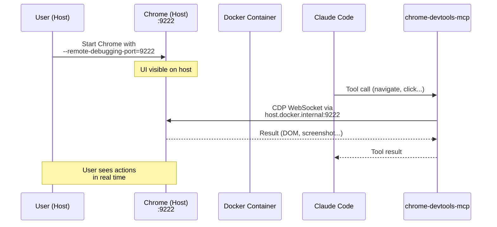
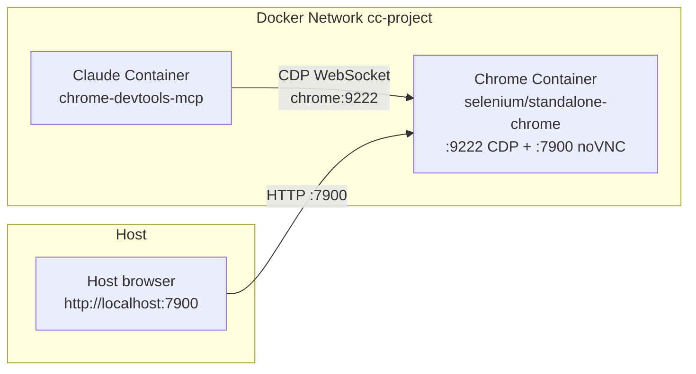
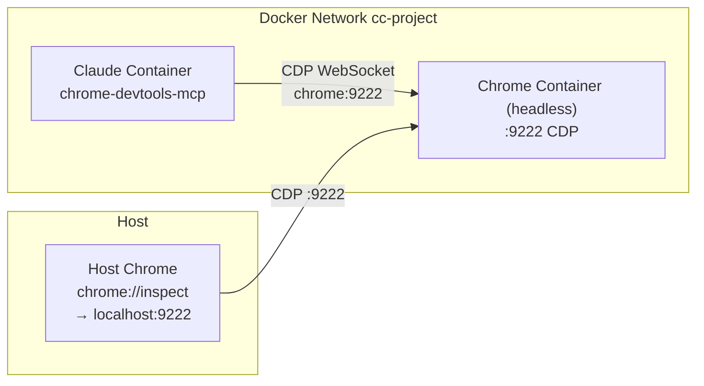

# Analysis: Browser Automation via Chrome DevTools MCP

> **Status**: Analysis — exploration and requirements documentation phase
> **Date**: 2026-02-27
> **Scope**: Feature — browser automation integration in Docker container

---

## Table of Contents

1. [Context and Motivation](#1-context-and-motivation)
2. [Native Claude Code Behavior](#2-native-claude-code-behavior)
3. [Docker Environment Constraints](#3-docker-environment-constraints)
4. [Requirements](#4-requirements)
5. [Browser Automation MCP Options](#5-browser-automation-mcp-options)
6. [Proposed Architectures](#6-proposed-architectures)
7. [Recommendation](#7-recommendation)
8. [Implementation Technical Details](#8-implementation-technical-details)
9. [Security Considerations](#9-security-considerations)
10. [Open Questions](#10-open-questions)

---

## 1. Context and Motivation

claude-orchestrator runs Claude Code in a Docker container. For frontend projects,
the ability to navigate a browser, test the UI, read console logs, and take
screenshots is essential. The requirement is:

1. Claude (in the container) controls a browser via MCP
2. The user **sees** the browser on their own host operating system with a UI
3. The solution integrates as much as possible with Claude Code's native features

In the roadmap, Browser Automation MCP was among the last priorities. However,
it is necessary to properly test frontend projects and improve debugging.

---

## 2. Native Claude Code Behavior

### 2.1 "Claude in Chrome" — Native Integration

Claude Code offers a native browser integration that can be activated with `claude --chrome`
or the `/chrome` command. Documented in [Use Claude Code with Chrome](https://code.claude.com/docs/en/chrome.md).

**Native architecture:**
```
Chrome Extension ("Claude in Chrome")
    ↕ Chrome Native Messaging API (stdio pipes, local IPC)
Native Messaging Host (JSON config file + local executable)
    ↕ stdio pipes
Claude Code CLI (local process)
```

**Native capabilities**: navigation, clicking, form filling, console reading, screenshots,
GIF recording, access to user login sessions.

**Requirements**:
- Chrome or Edge on the local system
- "Claude in Chrome" extension v1.0.36+
- Claude Code v2.0.73+
- Native Messaging Host configuration file installed locally:
  - macOS: `~/Library/Application Support/Google/Chrome/NativeMessagingHosts/com.anthropic.claude_code_browser_extension.json`
  - Linux: `~/.config/google-chrome/NativeMessagingHosts/com.anthropic.claude_code_browser_extension.json`

### 2.2 Why Native Integration Does NOT Work in Docker

The Native Messaging API is **inherently local**:

- Communication via **stdio pipes** between processes on the same filesystem
- No listening TCP socket (confirmed: `ss -tlnp | grep claude` returns nothing)
- Extension discovery is based on **local configuration files** in the Chrome filesystem
- Does not cross the Docker container boundary
- Confirmed by [bug #25506](https://github.com/anthropics/claude-code/issues/25506):
  the feature is not supported in DevContainer/SSH remote scenarios

**Conclusion**: The native "Claude in Chrome" integration is not usable in our
context. We need an approach based on a standalone MCP server that uses a network protocol.

### 2.3 MCP in Claude Code — Configuration

Claude Code supports MCP servers with three transports ([MCP docs](https://code.claude.com/docs/en/mcp.md)):

| Transport | Format | Use case |
|-----------|--------|----------|
| `stdio` | Local process, stdin/stdout | Local servers (in the container) |
| `http` | Streamable HTTP | Remote servers |
| `sse` | Server-Sent Events (deprecated) | Legacy |

**MCP configuration scopes:**

| Scope | Storage | Use |
|-------|---------|-----|
| `local` | `.claude/settings.local.json` (in project root, gitignored) | Private, per-project |
| `project` | `.mcp.json` in project root | Shared via VCS |
| `user` | `~/.claude.json` global | All projects |
| `managed` | `managed-mcp.json` in `/etc/claude-code/` | Framework-level |

The `.mcp.json` file supports **variable expansion**: `${VAR}` and `${VAR:-default}`.

---

## 3. Docker Environment Constraints

### 3.1 Constraint: Network Isolation

The Claude Code container is isolated from the host's filesystem and network.
Communication with the browser must happen via:

- **Exposed port** (Docker port mapping)
- **Docker network** (between sibling containers)
- **`host.docker.internal`** (toward the host, Docker Desktop)

### 3.2 Constraint: No GUI in Container

The container is based on `node:22-bookworm` without X11/Wayland. It cannot
display graphical interfaces directly.

### 3.3 Constraint: macOS Docker Desktop

On macOS (the primary target for claude-orchestrator):
- `host.docker.internal` automatically resolves to the host's IP
- `network_mode: host` **does not work** (refers to Linux VM, not macOS)
- Port mappings work correctly

### 3.4 Constraint: Chrome Host Header

Chrome validates the `Host` header of connections to the debugging port. If it is not
`localhost` or `127.0.0.1`, it rejects the connection. Solutions:
- Chrome flag `--remote-allow-origins=*` (permissive but simple)
- Reverse proxy that rewrites the Host header
- Connection from `localhost` (only if in the same network namespace)

---

## 4. Requirements

### R1: Claude Controls the Browser

Claude Code in the container must be able to use MCP tools to:
- Navigate to URLs
- Click, fill forms, interact with the page
- Read the browser console (logs, errors)
- Take screenshots
- Execute JavaScript in the context of the page
- Inspect network traffic

### R2: The User Sees the Browser

The user must view the browser with a UI on their own host operating system.
They must be able to see the agent's actions in real time.

### R3: Optional Feature

Not all projects need the browser. The integration must be activatable per-project,
without impact on sessions that do not use it.

### R4: Native Integration

Following the fundamental principle of the project, the solution must leverage
as much as possible ready-made components (existing MCP servers, standard protocols)
without reinventing.

### R5: Setup Simplicity

The user must be able to activate browser automation with minimal effort.
Ideally a flag in `project.yml` and a single command to start Chrome on the host.

---

## 5. Browser Automation MCP Options

### 5.1 Chrome DevTools MCP (Recommended)

**Repository**: [ChromeDevTools/chrome-devtools-mcp](https://github.com/ChromeDevTools/chrome-devtools-mcp)
**Author**: Google (Chrome DevTools team)
**Protocol**: Chrome DevTools Protocol (CDP) via WebSocket

#### MCP Configuration

```json
{
  "mcpServers": {
    "chrome-devtools": {
      "command": "npx",
      "args": ["-y", "chrome-devtools-mcp@latest",
               "--browserUrl=http://host.docker.internal:9222"]
    }
  }
}
```

#### Available Tools (29 total, 6 categories)

**Input Automation (9)**:

| Tool | Description |
|------|-------------|
| `click` | Click on page elements |
| `drag` | Drag-and-drop operations |
| `fill` | Populate a single form field |
| `fill_form` | Fill entire form |
| `handle_dialog` | Handle JavaScript dialogs (alert, confirm, prompt) |
| `hover` | Trigger hover state |
| `press_key` | Simulate keyboard input |
| `type_text` | Insert text |
| `upload_file` | Upload file |

**Navigation (6)**:

| Tool | Description |
|------|-------------|
| `close_page` | Close tab |
| `list_pages` | List open tabs |
| `navigate_page` | Navigate to URL |
| `new_page` | Open new tab |
| `select_page` | Switch active tab |
| `wait_for` | Wait for condition/event |

**Emulation (2)**:

| Tool | Description |
|------|-------------|
| `emulate` | Simulate device configurations (CPU, network) |
| `resize_page` | Change viewport dimensions |

**Performance (4)**:

| Tool | Description |
|------|-------------|
| `performance_start_trace` | Start trace recording |
| `performance_stop_trace` | Stop recording |
| `performance_analyze_insight` | Extract metrics (LCP, TBT, etc.) |
| `take_memory_snapshot` | Capture heap snapshot |

**Network (2)**:

| Tool | Description |
|------|-------------|
| `list_network_requests` | List network requests |
| `get_network_request` | Details of specific request |

**Debugging (6)**:

| Tool | Description |
|------|-------------|
| `evaluate_script` | Execute JavaScript in page context |
| `get_console_message` | Access console message |
| `list_console_messages` | List console messages |
| `lighthouse_audit` | Lighthouse quality audit |
| `take_screenshot` | Visual screenshot |
| `take_snapshot` | DOM snapshot (structure + styles) |

#### Complete Configuration Flags

| Flag | Type | Default | Description |
|------|------|---------|-------------|
| `--browserUrl` / `-u` | string | — | URL of debuggable Chrome instance |
| `--wsEndpoint` / `-w` | string | — | Direct WebSocket endpoint |
| `--wsHeaders` | JSON string | — | Custom headers for WebSocket |
| `--autoConnect` | boolean | false | Auto-connect to Chrome 144+ |
| `--headless` | boolean | false | Chrome without UI |
| `--executablePath` / `-e` | string | — | Chrome executable path |
| `--isolated` | boolean | false | Temporary profile |
| `--userDataDir` | string | — | Chrome profile directory |
| `--channel` | string | stable | Chrome channel |
| `--viewport` | string | — | Initial dimensions (e.g., "1280x720") |
| `--proxyServer` | string | — | Proxy configuration |
| `--acceptInsecureCerts` | boolean | — | Ignore certificate errors |
| `--chromeArg` | string[] | — | Additional Chrome arguments |
| `--slim` | boolean | — | Minimal set: 3 tools (navigate, evaluate, screenshot) |
| `--experimentalScreencast` | boolean | — | Screencast (requires ffmpeg) |
| `--categoryEmulation` | boolean | true | Enable emulation tools |
| `--categoryPerformance` | boolean | true | Enable performance tools |
| `--categoryNetwork` | boolean | true | Enable network tools |
| `--no-usage-statistics` | boolean | — | Disable telemetry |
| `--no-performance-crux` | boolean | — | Disable CrUX API |
| `--logFile` | string | — | Debug log file path |

### 5.2 Playwright MCP

**Repository**: [microsoft/playwright-mcp](https://github.com/microsoft/playwright-mcp)
**Author**: Microsoft
**Protocol**: CDP (via Playwright) or SSE

- 23+ core tools for browser automation
- Accessibility-first approach (accessible DOM snapshot, fewer tokens)
- Multi-browser support: Chrome, Firefox, WebKit, Edge
- Official Docker image: `mcr.microsoft.com/playwright/mcp`
- SSE transport available (`--port 8931`)
- Connection to existing browser supported

### 5.3 Browserbase MCP

**Repository**: [browserbase/mcp-server-browserbase](https://github.com/browserbase/mcp-server-browserbase)
**Author**: Browserbase Inc.
**Protocol**: Cloud-based (Stagehand on Playwright)

- Cloud-hosted browser (not local)
- Pay-per-use
- Anti-detection (stealth mode, proxy)
- Not usable offline
- Does not allow direct user visualization

### 5.4 Comparison

| Aspect | chrome-devtools-mcp | playwright-mcp | browserbase-mcp |
|--------|-------------------|---------------|----------------|
| **Author** | Google | Microsoft | Browserbase Inc. |
| **Tool count** | 29 (3 in slim) | 23+ | ~10-15 |
| **Performance profiling** | Yes | No | No |
| **Network inspection** | Yes (detailed) | Yes (basic) | No |
| **Lighthouse audit** | Yes | No | No |
| **Multi-browser** | Chrome only | Chrome, Firefox, WebKit | Chrome cloud only |
| **Token efficiency** | Medium (screenshot, but also offers structured `take_snapshot`) | High (accessibility snapshot) | Medium |
| **Connection to existing browser** | Yes | Yes | No |
| **Works offline** | Yes | Yes | No |
| **Browser visible** | Yes (headed) | Yes (headed) | No |
| **Cost** | Free | Free | Pay-per-use |
| **Dedicated Docker image** | No | Yes | No |

---

## 6. Proposed Architectures

### Architecture A: Chrome on Host (Headed, Visible)

The user starts Chrome with remote debugging on their own operating system.
Claude in the container connects via CDP through `host.docker.internal`.



**Host setup:**
```bash
# macOS
/Applications/Google\ Chrome.app/Contents/MacOS/Google\ Chrome \
  --remote-debugging-port=9222 \
  --remote-allow-origins=* \
  --user-data-dir="$HOME/.chrome-debug"

# Linux
google-chrome \
  --remote-debugging-port=9222 \
  --remote-allow-origins=* \
  --user-data-dir="$HOME/.chrome-debug"
```

**MCP config in container:**
```json
{
  "mcpServers": {
    "chrome-devtools": {
      "command": "npx",
      "args": ["-y", "chrome-devtools-mcp@latest",
               "--browserUrl=http://host.docker.internal:9222"]
    }
  }
}
```

#### Pros
- **Native UI** — Chrome runs normally on the host, full and fluid UI
- **Minimal setup** — no additional containers, no VNC
- **Performance** — no remote rendering overhead
- **Direct interaction** — user can use the browser manually and Claude simultaneously
- **Dedicated profile** — `--user-data-dir` isolates from the main Chrome profile

#### Cons
- **Manual setup** — user must start Chrome with specific flags
- **Host dependency** — requires Chrome installed on host
- **`--remote-allow-origins=*`** — necessary but permissive
- **Separate profile** — does not share login/cookies from main browser profile
  (actually an advantage for security)
- **Native Linux**: requires `--add-host=host.docker.internal:host-gateway`
  in docker-compose

### Architecture B: Chrome in Sibling Container + noVNC

A sibling container with Chrome + VNC server. The user views the browser via
a web browser at `http://localhost:7900`.



**Generated docker-compose.yml:**
```yaml
services:
  claude:
    # ... standard config ...
    depends_on:
      - browser

  browser:
    image: selenium/standalone-chrome:latest
    ports:
      - "${BROWSER_VNC_PORT:-7900}:7900"    # noVNC web UI
    shm_size: "2g"
    environment:
      - SE_VNC_NO_PASSWORD=1
      - SE_SCREEN_WIDTH=1920
      - SE_SCREEN_HEIGHT=1080
      - SE_START_XVFB=true
    networks:
      - cc-${PROJECT_NAME}
```

**MCP config:**
```json
{
  "mcpServers": {
    "chrome-devtools": {
      "command": "npx",
      "args": ["-y", "chrome-devtools-mcp@latest",
               "--browserUrl=http://browser:9222"]
    }
  }
}
```

#### Pros
- **Fully automated** — `cco start` handles everything
- **No manual setup** — no Chrome to start manually on the host
- **Cross-platform** — works on macOS, Linux, Windows
- **Complete isolation** — Chrome runs in its own container
- **Browser monitoring** — `http://localhost:7900` works everywhere

#### Cons
- **Visual latency** — noVNC adds rendering latency
- **Reduced quality** — VNC compression, not native Chrome
- **Resources** — additional Chrome container (RAM, CPU)
- **`shm_size: 2g`** — Chrome requires adequate shared memory; Docker default
  (64MB) causes crashes
- **Non-interactive** — user cannot easily interact with the browser
  (input via noVNC is limited)
- **CDP Host Header** — Chrome container may reject connections
  with hostname `browser` instead of `localhost`; requires `--remote-allow-origins=*`
  when starting Chrome

### Architecture C: Chrome in Sibling Container + CDP Port Forward

Like B, but without VNC. The user opens the host's native Chrome DevTools
pointing to `localhost:9222`. Visualization via Chrome DevTools "Inspect"
or with "chrome://inspect".



**docker-compose.yml:**
```yaml
services:
  browser:
    image: zenika/alpine-chrome:with-puppeteer
    command:
      - "--no-sandbox"
      - "--remote-debugging-address=0.0.0.0"
      - "--remote-debugging-port=9222"
      - "--remote-allow-origins=*"
      - "--disable-gpu"
      - "--headless=new"
    ports:
      - "${BROWSER_CDP_PORT:-9222}:9222"
    shm_size: "2g"
    networks:
      - cc-${PROJECT_NAME}
```

#### Pros
- **Lightweight** — no VNC, no display server
- **Automated** — managed by `cco start`
- **Native DevTools** — user can use full Chrome DevTools

#### Cons
- **Headless** — browser is not visible, only inspectable via DevTools
- **Limited UX** — chrome://inspect is a developer tool, not direct browser visualization
- **Does not satisfy R2** — user does not "see the browser" in traditional sense
- For a complete experience, combine with Architecture D (hybrid)

### Architecture D: Hybrid — Support Both Host and Container

Support both modes (A and B), selectable in `project.yml`:

```yaml
browser:
  enabled: true
  mode: host      # "host" (Chrome on host) or "container" (Chrome containerized)
  cdp_port: 9222  # CDP port
  vnc_port: 7900  # noVNC port (container mode only)
```

#### Pros
- **Maximum flexibility** — user chooses the best approach for their setup
- **Host mode** — for interactive development, native UI, performance
- **Container mode** — for CI/CD, automated testing, headless environments

#### Cons
- **Implementation complexity** — two code paths in the CLI
- **Duplicate documentation** — two setup guides

---

## 7. Recommendation

### Recommended Solution: D (Hybrid) with Default to Host

**Rationale**:
1. **Host mode** fully satisfies R2 (user sees browser) and R4 (minimal setup)
2. **Container mode** covers CI/CD and automated testing
3. Flexibility justifies minimal additional complexity

**Default**: `mode: host` — the most natural experience for interactive development.

### MCP Server: chrome-devtools-mcp

- Official tool from Google's Chrome DevTools team
- 29 complete tools (automation + performance + network + debugging)
- Performance profiling and Lighthouse audit are unique capabilities
- Connection to existing browser via `--browserUrl`
- Slim mode to reduce context window consumption

### Step-by-Step Implementation

#### Step 1: Pre-install chrome-devtools-mcp in Dockerfile

```dockerfile
# Pre-install for fast startup (avoid npx download every session)
RUN npm install -g chrome-devtools-mcp@latest
```

#### Step 2: Add `browser:` in project.yml

```yaml
# projects/<name>/project.yml
browser:
  enabled: false          # default: disabled
  mode: host              # "host" or "container"
  cdp_port: 9222          # CDP port (host) or exposed port (container)
  vnc_port: 7900          # noVNC port (container mode only)
  mcp_args: []            # additional flags for chrome-devtools-mcp
```

#### Step 3: Generate MCP config in `cco start`

When `browser.enabled: true`:

**Host mode** — inject into project `.mcp.json`:
```json
{
  "mcpServers": {
    "chrome-devtools": {
      "command": "chrome-devtools-mcp",
      "args": ["--browserUrl=http://host.docker.internal:9222"]
    }
  }
}
```

Add to docker-compose.yml:
```yaml
services:
  claude:
    extra_hosts:
      - "host.docker.internal:host-gateway"  # Linux only, macOS has it built-in
```

**Container mode** — generate browser service in docker-compose:
```yaml
services:
  browser:
    image: selenium/standalone-chrome:latest
    ports:
      - "7900:7900"
    shm_size: "2g"
    environment:
      - SE_VNC_NO_PASSWORD=1
      - SE_SCREEN_WIDTH=1920
      - SE_SCREEN_HEIGHT=1080
    networks:
      - cc-${PROJECT_NAME}
```

And inject into `.mcp.json`:
```json
{
  "mcpServers": {
    "chrome-devtools": {
      "command": "chrome-devtools-mcp",
      "args": ["--browserUrl=http://browser:9222"]
    }
  }
}
```

#### Step 4: Helper script for starting Chrome on host

`cco chrome` — convenience command that prints the command to start Chrome:

```bash
# cco chrome
echo "Start Chrome on the host with:"
echo ""
echo "  /Applications/Google\\ Chrome.app/Contents/MacOS/Google\\ Chrome \\"
echo "    --remote-debugging-port=9222 \\"
echo "    --remote-allow-origins=* \\"
echo '    --user-data-dir="$HOME/.chrome-debug"'
```

On macOS, it could also start Chrome directly with `open`:
```bash
cco chrome start   # Start Chrome with remote debugging
cco chrome stop    # Close debug Chrome session
```

#### Step 5: User documentation

- `docs/user-guides/browser-automation.md` — setup and usage guide
- Section in `docs/reference/cli.md` for `cco chrome`
- Example in `docs/user-guides/project-setup.md` for `browser:` in project.yml

---

## 8. Implementation Technical Details

### 8.1 Chrome DevTools Protocol (CDP)

CDP is a remote debugging protocol exposed by Chrome on the configured port.
It offers two main endpoints:

| Endpoint | Protocol | Use |
|----------|----------|-----|
| `GET http://host:9222/json/version` | HTTP | Browser info, WebSocket URL |
| `GET http://host:9222/json/list` | HTTP | List active tabs |
| `ws://host:9222/devtools/page/<id>` | WebSocket | Control specific tab |
| `ws://host:9222/devtools/browser/<id>` | WebSocket | Global browser control |

chrome-devtools-mcp manages the WebSocket connection internally. Configuration
requires only `--browserUrl` (HTTP endpoint).

### 8.2 `host.docker.internal`

| Platform | Availability | Notes |
|----------|--------------|-------|
| macOS (Docker Desktop) | Automatic | Resolves to native host IP |
| Windows (Docker Desktop) | Automatic | Resolves to native host IP |
| Linux (Docker Desktop) | Automatic | Like macOS/Windows |
| Linux (native Docker Engine) | Manual | Requires `--add-host=host.docker.internal:host-gateway` |

In the generated docker-compose.yml, `extra_hosts` is added always
for cross-platform compatibility:

```yaml
services:
  claude:
    extra_hosts:
      - "host.docker.internal:host-gateway"
```

On macOS Docker Desktop, this entry is redundant but harmless.

### 8.3 Chrome Host Requirements

From Chrome 136+, `--user-data-dir` is **mandatory** when using
`--remote-debugging-port` ([details](https://developer.chrome.com/blog/remote-debugging-port)).
Chrome refuses to start without a dedicated profile for security reasons.

```bash
# ERROR (Chrome 136+): missing --user-data-dir
chrome --remote-debugging-port=9222

# CORRECT
chrome --remote-debugging-port=9222 --user-data-dir="$HOME/.chrome-debug"
```

The dedicated profile:
- Isolates data from the main Chrome profile (cookies, login, extensions)
- Persists between sessions (useful to maintain login on test sites)
- Can be deleted with `rm -rf "$HOME/.chrome-debug"`

### 8.4 Integration with Entrypoint

The entrypoint requires no changes for the browser. MCP configuration
is already handled by the merge in `~/.claude.json` (lines 37-64 of entrypoint.sh).

The `chrome-devtools-mcp` MCP server is a stdio process started by Claude Code
when needed — not a persistent service.

### 8.5 Integration with Session Context Hook

The `session-context.sh` already discovers and reports configured MCP servers.
With browser enabled, the output will include:

```
MCP servers (1): chrome-devtools
```

No changes needed to the hook.

### 8.6 Telemetry and Privacy

chrome-devtools-mcp sends by default:
- **Usage statistics** to Google (opt-out with `--no-usage-statistics`)
- **Visited URLs** to CrUX API for performance data (opt-out with
  `--no-performance-crux`)
- Alternative env vars: `CHROME_DEVTOOLS_MCP_NO_USAGE_STATISTICS=1` or `CI=1`
  (note: `CI=1` could have side effects on other tools in the container like
  test runners and build tools; prefer explicit flags)

**Recommendation**: Disable both by default in the orchestrator configuration:

```json
{
  "mcpServers": {
    "chrome-devtools": {
      "command": "chrome-devtools-mcp",
      "args": [
        "--browserUrl=http://host.docker.internal:9222",
        "--no-usage-statistics",
        "--no-performance-crux"
      ]
    }
  }
}
```

---

## 9. Security Considerations

### 9.1 CDP Exposes Complete Browser Control

Port 9222 (or configured one) gives access to:
- Arbitrary JavaScript execution in the context of any page
- Reading/modifying cookies, localStorage, sessionStorage
- Intercepting network requests (including those with credentials)
- Screenshots of potentially sensitive content
- Complete access to the DOM of every tab

### 9.2 Mitigations

| Risk | Mitigation |
|------|-----------|
| Unauthorized access to CDP port | Dedicated profile (`--user-data-dir`); port not exposed publicly |
| Leak of main browser credentials | Separate profile, no access to main Chrome profile |
| MCP server sends data to third parties | `--no-usage-statistics --no-performance-crux` |
| Compromised container controls host browser | Risk is intrinsic to design; mitigated by profile isolation |
| `--remote-allow-origins=*` | Acceptable for local development; do not use in production |

### 9.3 Security Recommendations for Documentation

1. **Always** use dedicated `--user-data-dir` (never the main profile)
2. Do not navigate to sensitive sites (banking, admin) in debug profile
3. Close debug Chrome after development session
4. Do not expose CDP port on public network interfaces
5. In shared environments, consider container mode with VNC password

---

## 10. Open Questions

### Q1: Pre-installation in Dockerfile vs npx on-demand

Pre-install `chrome-devtools-mcp` in Dockerfile:
- **Pro**: Instant startup, no download each session
- **Con**: Increases image size, version locked

Alternative option: add to `MCP_PACKAGES` build arg for users who want it.
This keeps it optional at the build level.

### Q2: `cco chrome` — Host Automation

How much to automate Chrome launch on the host?
- **Minimal**: print command and let user execute
- **Medium**: script that launches Chrome and verifies port availability
- **Maximum**: integration with launchd/systemd for persistent debug profile

### Q3: Playwright MCP as Alternative Option

Offer playwright-mcp as an option? Could be useful for:
- Projects needing cross-browser testing (Firefox, WebKit)
- Accessibility-first approach (fewer tokens, structured snapshot)
- Official Docker image ready to use

### Q4: Container Mode — Which Base Image?

| Image | Size | Features |
|-------|------|----------|
| `selenium/standalone-chrome` | ~1.5GB | Chrome + VNC + noVNC + WebDriver |
| `zenika/alpine-chrome:with-puppeteer` | ~500MB | Chrome + Puppeteer, Alpine-based |
| `browserless/chrome` | ~1.2GB | Chrome + HTTP API + health check |

`selenium/standalone-chrome` is most complete for our use case
(includes noVNC built-in for visualization).

### Q5: Interaction with Docker Socket

Sibling containers (browser) are created on the same Docker daemon as host.
Currently `cco start` generates `docker-compose.yml` with services. Adding
a `browser` service is natural and consistent with existing Docker-from-Docker
architecture.

However, the `browser` service is different in type: it is not project
infrastructure (like postgres or redis) but a **development tool**. The
distinction should be documented.

### Q6: Timeout and MCP Resilience

chrome-devtools-mcp might not connect if Chrome is not yet started on the host.
Proposed handling:
- Claude Code shows MCP error (native behavior)
- User starts Chrome and retries
- The session-context.sh could verify CDP connectivity and warn

---

## Appendix: References

- [Use Claude Code with Chrome (beta)](https://code.claude.com/docs/en/chrome.md)
- [Connect Claude Code to tools via MCP](https://code.claude.com/docs/en/mcp.md)
- [ChromeDevTools/chrome-devtools-mcp](https://github.com/ChromeDevTools/chrome-devtools-mcp)
- [Chrome DevTools Protocol Documentation](https://chromedevtools.github.io/devtools-protocol/)
- [Bug #25506: Chrome extension cannot connect in DevContainer](https://github.com/anthropics/claude-code/issues/25506)
- [Feature #15125: Support targeting specific Chrome instances](https://github.com/anthropics/claude-code/issues/15125)
- [microsoft/playwright-mcp](https://github.com/microsoft/playwright-mcp)
- [browserbase/mcp-server-browserbase](https://github.com/browserbase/mcp-server-browserbase)
- [null-runner/chrome-mcp-docker](https://github.com/null-runner/chrome-mcp-docker)
- [avi686/chrome-devtools-mcp-docker](https://github.com/avi686/chrome-devtools-mcp-docker)
- [Docker MCP Toolkit](https://www.docker.com/blog/add-mcp-servers-to-claude-code-with-mcp-toolkit/)
- [Chrome Remote Debugging Port Security (Chrome 136+)](https://developer.chrome.com/blog/remote-debugging-port)
