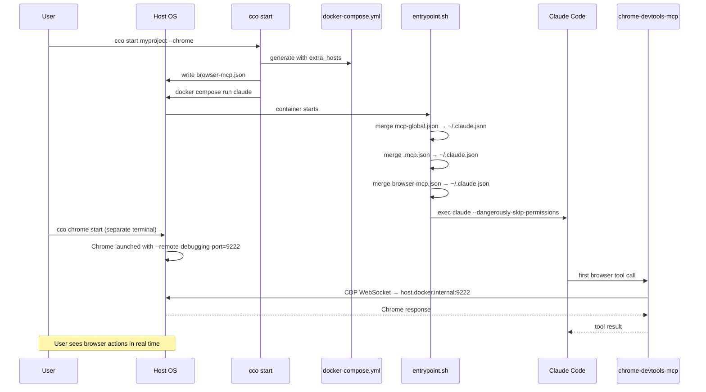

# Browser MCP Integration — Design

> Status: design complete, ready for implementation.
> Sprint: 4
> Depends on: Scope Hierarchy Refactor (Sprint 3) ✓

---

## Table of Contents

1. [Overview](#1-overview)
2. [Decisions](#2-decisions)
3. [Configuration Schema](#3-configuration-schema)
4. [Architecture](#4-architecture)
5. [Component Design](#5-component-design)
6. [Generated Files](#6-generated-files)
7. [`cco chrome` Command](#7-cco-chrome-command)
8. [Backward Compatibility](#8-backward-compatibility)
9. [Test Plan](#9-test-plan)
10. [Security Notes](#10-security-notes)

---

## 1. Overview

Enable Claude (running in the Docker container) to control a browser via the
`chrome-devtools-mcp` MCP server (Google Chrome DevTools team). The browser
runs on the host OS and is visible to the user in real time.

**What is implemented in this sprint (Sprint 4):**
- `browser.enabled` / `browser.mode: host` in `project.yml`
- `--chrome` flag override in `cco start`
- `chrome-devtools-mcp` pre-installed in the Docker image
- Auto-generated `browser-mcp.json` injected at `cco start`
- Third MCP merge source in `entrypoint.sh`
- `cco chrome [start|stop|status]` helper command for host-side Chrome management
- Test coverage in `tests/test_start_dry_run.sh` and `tests/test_chrome.sh`

**Out of scope for Sprint 4 (deferred):**
- Container mode (`mode: container` — sibling Chrome + noVNC)
- Playwright MCP as alternative

**References:**
- [analysis.md](../future/browser-mcp/analysis.md) — options evaluation, requirements, open questions resolved
- [roadmap.md](../roadmap.md) — Sprint 4 position

---

## 2. Decisions

### D1: Host mode only in Sprint 4

Container mode (sibling Chrome + noVNC) is deferred to a future sprint. The two
modes are fully independent code paths; implementing host mode first covers the
primary interactive development use case. Container mode will be added as a
follow-on, reusing the same `browser.mode` field in `project.yml`.

### D2: Activation at startup, not mid-session

MCP servers must be configured at container start time (they are loaded by
Claude Code when it reads `.mcp.json`). There is no mechanism to dynamically
add MCP servers to a running Claude Code session. Therefore:

- `browser.enabled: true` in `project.yml` → active for every session of that project
- `cco start <project> --chrome` → one-session override without modifying `project.yml`

The `/chrome` built-in slash command is a different system (Native Messaging API,
not usable in Docker). Do **not** create a skill named `chrome` to avoid naming
conflicts. The `cco chrome` helper runs on the host, not inside the container.

### D3: Separate `browser-mcp.json`, user's `mcp.json` untouched

The browser MCP configuration is framework-managed (auto-generated by `cco start`,
like `docker-compose.yml`). It must not be merged into or overwrite the user's
`mcp.json`, which may contain custom MCP servers.

Solution: generate a dedicated `browser-mcp.json` in the project directory,
mount it as a third MCP source, and add a third merge step in `entrypoint.sh`.
The file is gitignored.

### D4: `chrome-devtools-mcp` pre-installed in Dockerfile

Pre-installing avoids a download on every session start. It is a framework
dependency, not a per-project package, so it belongs in the Docker image rather
than in `mcp-packages.txt`. The package is small enough to not significantly
impact image size.

### D5: Privacy by default

All generated MCP configs include `--no-usage-statistics` and `--no-performance-crux`
to disable telemetry without relying on `CI=1` (which has side effects on test
runners and build tools in the container).

### D6: `extra_hosts` always added for host mode

`host.docker.internal:host-gateway` is added to `extra_hosts` whenever browser
host mode is active. It is harmless on macOS Docker Desktop (where the host is
already resolvable) and required on Linux with native Docker Engine.

### D7: Single MCP server — chrome-devtools-mcp

Playwright MCP is not offered as an alternative. A single well-integrated
solution is preferable to a choice that adds complexity. Users who need
Playwright can configure it manually via their project's `mcp.json`.

---

## 3. Configuration Schema

### `project.yml` — new `browser:` section

```yaml
# ── Browser Automation (optional) ───────────────────────────────────
# browser:
#   enabled: false          # true to activate chrome-devtools-mcp
#   mode: host              # "host" (Chrome on host, visible to user)
#                           # "container" (not yet implemented, Sprint 5+)
#   cdp_port: 9222          # CDP port Chrome listens on (host mode)
#   mcp_args: []            # extra flags passed to chrome-devtools-mcp
```

**Defaults** (all fields optional):

| Field | Default | Notes |
|-------|---------|-------|
| `browser.enabled` | `false` | Must be explicitly set to `true` |
| `browser.mode` | `host` | Only `host` is implemented in Sprint 4 |
| `browser.cdp_port` | `9222` | Standard Chrome remote debugging port |
| `browser.mcp_args` | `[]` | Appended after the built-in flags |

### `cco start` — new flag

```
cco start <project> --chrome       # Activate browser for this session only
```

`--chrome` sets `browser.enabled=true` and `browser.mode=host` for the current
invocation without modifying `project.yml`. Equivalent to having `browser.enabled: true`
in `project.yml` for one session.

---

## 4. Architecture

### Host mode flow



### File relationships

```
projects/myproject/
├── project.yml            ← user-owned, source of truth
├── docker-compose.yml     ← auto-generated by cco start (gitignored)
├── browser-mcp.json       ← auto-generated by cco start (gitignored)
├── mcp.json               ← user-owned (optional), untouched by browser feature
└── .claude/
    └── CLAUDE.md          ← user-owned

Container:
~/.claude.json             ← merged at startup: global + project + browser MCPs
/workspace/.mcp.json       ← bind-mounted from projects/myproject/mcp.json
/workspace/browser-mcp.json ← bind-mounted from projects/myproject/browser-mcp.json
```

---

## 5. Component Design

### 5.1 `Dockerfile`

Add `chrome-devtools-mcp` to the global npm install block alongside Claude Code:

```dockerfile
# MCP servers — pre-installed for instant startup
RUN npm install -g chrome-devtools-mcp
```

Placement: after the Claude Code install, before `COPY` of config files.

### 5.2 `lib/cmd-start.sh`

#### Parsing (after existing `mount_socket` parsing)

```bash
# ── Browser config ───────────────────────────────────────────────────
local browser_enabled browser_mode browser_cdp_port
browser_enabled=$(yml_get "$project_yml" "browser.enabled")
[[ "$browser_enabled" != "true" ]] && browser_enabled="false"

# --chrome flag overrides project.yml
[[ "${opt_chrome:-false}" == "true" ]] && browser_enabled="true"

browser_mode=$(yml_get "$project_yml" "browser.mode")
[[ -z "$browser_mode" ]] && browser_mode="host"

browser_cdp_port=$(yml_get "$project_yml" "browser.cdp_port")
[[ -z "$browser_cdp_port" ]] && browser_cdp_port="9222"
```

#### Flag parsing

In the `while` loop where CLI arguments are parsed, add:

```bash
--chrome) opt_chrome="true" ;;
```

#### Generate `browser-mcp.json`

Called before `docker compose run`, after all config is resolved:

```bash
if [[ "$browser_enabled" == "true" ]]; then
    _generate_browser_mcp "$project_dir/browser-mcp.json" \
        "$browser_mode" "$browser_cdp_port"
fi
```

```bash
_generate_browser_mcp() {
    local out_file="$1" mode="$2" cdp_port="$3"

    local browser_url
    if [[ "$mode" == "host" ]]; then
        browser_url="http://host.docker.internal:${cdp_port}"
    else
        # container mode: deferred
        browser_url="http://browser:${cdp_port}"
    fi

    printf '{
  "mcpServers": {
    "chrome-devtools": {
      "command": "chrome-devtools-mcp",
      "args": [
        "--browserUrl=%s",
        "--no-usage-statistics",
        "--no-performance-crux"
      ]
    }
  }
}\n' "$browser_url" > "$out_file"
}
```

#### `docker-compose.yml` generation — `extra_hosts`

In the `services.claude:` block, after the `networks:` entry:

```bash
if [[ "$browser_enabled" == "true" && "$browser_mode" == "host" ]]; then
    printf '    extra_hosts:\n'
    printf '      - "host.docker.internal:host-gateway"\n'
fi
```

#### `docker-compose.yml` generation — browser-mcp.json mount

In the `volumes:` section of `services.claude:`, after the project MCP mount block:

```bash
if [[ "$browser_enabled" == "true" && -f "$project_dir/browser-mcp.json" ]]; then
    printf '      # Browser MCP config\n'
    printf '      - ./browser-mcp.json:/workspace/browser-mcp.json:ro\n'
fi
```

#### Dry-run output

When `--dry-run` is active, emit a summary line:

```
ℹ Browser: host mode (host.docker.internal:9222)
```

### 5.3 `config/entrypoint.sh`

Add a third MCP merge step, after the existing project MCP merge (lines 56–64):

```bash
# Browser MCP servers (framework-managed, generated by cco start)
MCP_BROWSER="/workspace/browser-mcp.json"
if [ -f "$MCP_BROWSER" ]; then
    server_count=$(jq '.mcpServers | length' "$MCP_BROWSER" 2>/dev/null || echo "0")
    if [ "$server_count" -gt 0 ]; then
        merged=$(jq -s \
            '.[0] * {mcpServers: ((.[0].mcpServers // {}) + (.[1].mcpServers // {}))}' \
            "$CLAUDE_JSON" "$MCP_BROWSER" 2>/dev/null) \
            && echo "$merged" > "$CLAUDE_JSON"
    fi
fi
```

This is identical in structure to the global and project MCP merge steps.
The guard `if [ -f "$MCP_BROWSER" ]` makes it a no-op for projects without browser enabled.

### 5.4 `defaults/_template/project.yml`

Add the `browser:` section after the `docker:` block, fully commented out:

```yaml
# ── Browser Automation (optional) ───────────────────────────────────
# Enable Claude to control a browser via chrome-devtools-mcp (CDP).
# The browser runs on your host OS and is visible while Claude operates it.
#
# Prerequisites:
#   1. Run: cco chrome start   (launches Chrome with remote debugging)
#   2. Set: browser.enabled: true in this file (or use --chrome flag)
#
# browser:
#   enabled: false          # true to activate chrome-devtools-mcp
#   mode: host              # "host" = Chrome on host (default and only mode)
#   cdp_port: 9222          # Chrome remote debugging port (default: 9222)
#   mcp_args: []            # extra flags for chrome-devtools-mcp
```

### 5.5 `.gitignore` additions

In `defaults/_template/.gitignore` (or equivalent), add:

```
browser-mcp.json
```

This file is auto-generated alongside `docker-compose.yml`.

---

## 6. Generated Files

### `projects/<name>/browser-mcp.json` (host mode)

```json
{
  "mcpServers": {
    "chrome-devtools": {
      "command": "chrome-devtools-mcp",
      "args": [
        "--browserUrl=http://host.docker.internal:9222",
        "--no-usage-statistics",
        "--no-performance-crux"
      ]
    }
    }
  }
}
```

Custom `cdp_port` (e.g., `9223`) results in `--browserUrl=http://host.docker.internal:9223`.
Additional `mcp_args` are appended after `--no-performance-crux`.

### `docker-compose.yml` diff (host mode)

```yaml
services:
  claude:
    # ... existing config ...
    volumes:
      # ... existing volumes ...
      - ./browser-mcp.json:/workspace/browser-mcp.json:ro   # NEW
    extra_hosts:                                              # NEW
      - "host.docker.internal:host-gateway"                  # NEW
```

No new services. No port changes. The `browser-mcp.json` mount is the only
volume addition.

---

## 7. `cco chrome` Command

A host-side helper that manages Chrome's debug session. It does not run inside
the container.

### Subcommands

| Command | Action |
|---------|--------|
| `cco chrome` | Alias for `cco chrome start` |
| `cco chrome start` | Launch Chrome with remote debugging enabled |
| `cco chrome stop` | Kill the debug Chrome process |
| `cco chrome status` | Check if CDP endpoint is reachable |

### Implementation: `lib/cmd-chrome.sh`

```bash
cmd_chrome() {
    local subcmd="${1:-start}"
    shift || true
    case "$subcmd" in
        start)  _chrome_start "$@" ;;
        stop)   _chrome_stop  "$@" ;;
        status) _chrome_status "$@" ;;
        *)      error "Unknown subcommand: $subcmd. Use: start, stop, status" ;;
    esac
}

_chrome_start() {
    local port="${1:-9222}"
    local data_dir="${HOME}/.chrome-debug"

    if _chrome_is_running "$port"; then
        ok "Chrome is already running on CDP port ${port}"
        _chrome_status "$port"
        return 0
    fi

    info "Starting Chrome with remote debugging on port ${port}..."
    info "Profile directory: ${data_dir}"

    if [[ "$(uname)" == "Darwin" ]]; then
        # macOS
        local chrome_bin="/Applications/Google Chrome.app/Contents/MacOS/Google Chrome"
        if [[ ! -x "$chrome_bin" ]]; then
            error "Google Chrome not found at: $chrome_bin"
            info "Install Chrome from https://www.google.com/chrome/"
            return 1
        fi
        "$chrome_bin" \
            --remote-debugging-port="$port" \
            --remote-allow-origins="*" \
            --user-data-dir="$data_dir" \
            &>/dev/null &
        disown
    else
        # Linux
        local chrome_cmd
        for cmd in google-chrome google-chrome-stable chromium chromium-browser; do
            if command -v "$cmd" &>/dev/null; then
                chrome_cmd="$cmd"; break
            fi
        done
        if [[ -z "${chrome_cmd:-}" ]]; then
            error "Chrome not found. Install with: sudo apt install google-chrome-stable"
            return 1
        fi
        "$chrome_cmd" \
            --remote-debugging-port="$port" \
            --remote-allow-origins="*" \
            --user-data-dir="$data_dir" \
            &>/dev/null &
        disown
    fi

    # Wait up to 5s for CDP to become available
    local i
    for i in 1 2 3 4 5; do
        sleep 1
        if _chrome_is_running "$port"; then
            ok "Chrome ready on CDP port ${port}"
            info "Profile: ${data_dir} (isolated from your main Chrome profile)"
            info "To stop: cco chrome stop"
            return 0
        fi
    done

    warn "Chrome started but CDP not yet reachable on port ${port}"
    info "It may take a few more seconds. Check with: cco chrome status"
}

_chrome_stop() {
    local port="${1:-9222}"
    if ! _chrome_is_running "$port"; then
        info "No Chrome debug session found on port ${port}"
        return 0
    fi
    # Find and kill the Chrome process listening on the port
    local pid
    pid=$(lsof -ti "tcp:${port}" 2>/dev/null | head -1)
    if [[ -n "$pid" ]]; then
        kill "$pid" 2>/dev/null && ok "Chrome debug session stopped (pid ${pid})"
    else
        warn "Could not find process on port ${port}"
    fi
}

_chrome_status() {
    local port="${1:-9222}"
    if _chrome_is_running "$port"; then
        ok "Chrome is running and accepting CDP connections on port ${port}"
        # Fetch and display version info
        local version_info
        version_info=$(curl -s --max-time 2 "http://localhost:${port}/json/version" 2>/dev/null)
        if [[ -n "$version_info" ]]; then
            local browser_ver
            browser_ver=$(echo "$version_info" | grep -o '"Browser":"[^"]*"' | cut -d'"' -f4)
            [[ -n "$browser_ver" ]] && info "Browser: ${browser_ver}"
        fi
    else
        warn "Chrome is not running or CDP port ${port} is not reachable"
        info "Start with: cco chrome start"
        return 1
    fi
}

_chrome_is_running() {
    local port="${1:-9222}"
    curl -s --max-time 1 "http://localhost:${port}/json/version" &>/dev/null
}
```

### Routing in `bin/cco`

In the main dispatch block:

```bash
source "$LIB_DIR/cmd-chrome.sh"
# ...
chrome) cmd_chrome "$@" ;;
```

In the help text:

```
  cco chrome [start|stop|status]  Manage Chrome debug session on host
```

---

## 8. Backward Compatibility

| Scenario | Impact |
|----------|--------|
| Existing projects without `browser:` | Zero: `browser_enabled` defaults to `false`, no changes to compose or MCP |
| Existing `mcp.json` in project | Untouched: browser config goes to separate `browser-mcp.json` |
| Entrypoint on project without browser | The `if [ -f "$MCP_BROWSER" ]` guard is a no-op |
| `cco start` without `--chrome` | No change in behavior |
| `cco build` (image rebuild) | Required once to pre-install `chrome-devtools-mcp`; existing images continue to work with `npx -y chrome-devtools-mcp` fallback |

**Migration for existing installations**: none required. Users who want browser
support rebuild the image with `cco build` and add `browser.enabled: true` to
their `project.yml`.

**Note on `npx` fallback**: if the image is not rebuilt, Claude Code will invoke
the MCP server as `npx -y chrome-devtools-mcp` (via package.json discovery) which
works but adds ~5s on first use. No error, just slower. The design doc should note
this distinction.

---

## 9. Test Plan

### `tests/test_start_dry_run.sh` — new test cases

| Test | What it verifies |
|------|-----------------|
| `test_browser_disabled_by_default` | No `extra_hosts`, no `browser-mcp.json`, no browser service when `browser:` section absent |
| `test_browser_host_mode_extra_hosts` | `extra_hosts: host.docker.internal:host-gateway` present in compose when `browser.enabled: true` |
| `test_browser_mcp_json_generated` | `browser-mcp.json` file created in project dir with correct content |
| `test_browser_mcp_mounted_in_compose` | `./browser-mcp.json:/workspace/browser-mcp.json:ro` appears in compose volumes |
| `test_browser_custom_cdp_port` | Custom `cdp_port: 9223` results in `--browserUrl=http://host.docker.internal:9223` in `browser-mcp.json` |
| `test_browser_chrome_flag_override` | `--chrome` flag on `cco start` activates browser even without `browser.enabled` in project.yml |
| `test_browser_disabled_no_mcp_file` | When `browser.enabled: false`, no `browser-mcp.json` is created |
| `test_browser_mcp_privacy_flags` | Generated config always contains `--no-usage-statistics` and `--no-performance-crux` |
| `test_browser_mcp_args_appended` | `mcp_args: ["--slim"]` results in `--slim` appended after privacy flags |
| `test_browser_user_mcp_json_untouched` | User's `mcp.json` content is not modified when browser is enabled |

### `tests/test_chrome.sh` — new test file

| Test | What it verifies |
|------|-----------------|
| `test_chrome_status_no_chrome` | `cco chrome status` returns non-zero when Chrome not running |
| `test_chrome_help` | `cco chrome --help` shows usage text |

Note: `_chrome_start` and `_chrome_stop` involve process management and are tested
manually / as integration tests. Unit tests focus on output and file generation.

---

## 10. Security Notes

Reproduced from the analysis for implementer reference:

- **Always use `--user-data-dir`**: required by Chrome 136+ when using `--remote-debugging-port`. Isolates data from the main Chrome profile. `cco chrome start` always passes `$HOME/.chrome-debug`.
- **`--remote-allow-origins=*`**: necessary for the container to connect to the host's Chrome. Acceptable for local development; document that users should not use this in production.
- **Port 9222 is local-only by default**: Chrome binds to `127.0.0.1:9222`, not `0.0.0.0`. Do not expose this port via Docker port mappings.
- **Telemetry disabled by default**: `--no-usage-statistics --no-performance-crux` in all generated configs.
- **Separate profile**: Claude (via MCP) can read/write cookies, localStorage, and intercept network requests of the debug profile. Users should avoid navigating to sensitive sites (banking, internal admin) in the debug Chrome session.
