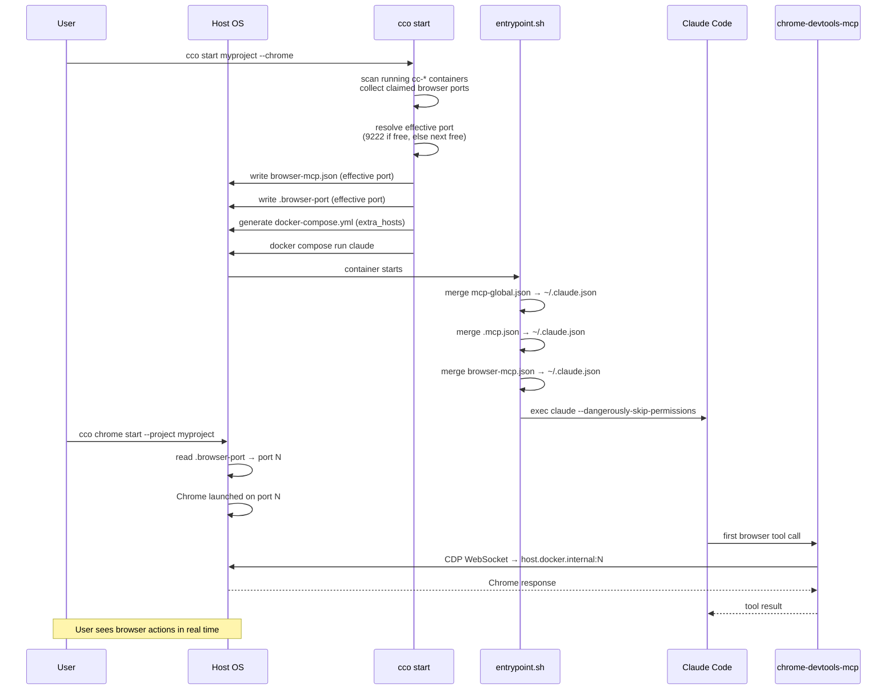
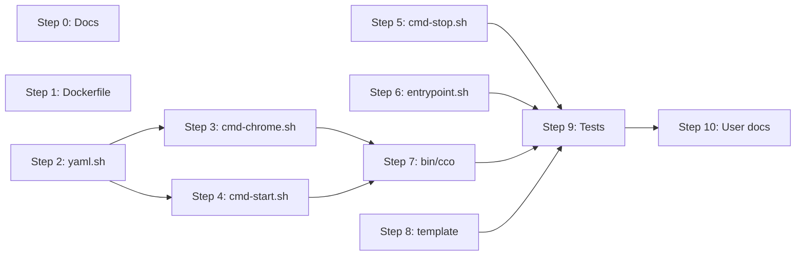

# Browser MCP Integration — Design

> Status: design complete, ready for implementation.
> Sprint: 4
> Depends on: Scope Hierarchy Refactor (Sprint 3) ✓

---

## Table of Contents

1. [Overview](#1-overview)
2. [Decisions](#2-decisions)
3. [Configuration Schema](#3-configuration-schema)
4. [Architecture](#4-architecture)
5. [Component Design](#5-component-design)
6. [Generated Files](#6-generated-files)
7. [`cco chrome` Command](#7-cco-chrome-command)
8. [Backward Compatibility](#8-backward-compatibility)
9. [Test Plan](#9-test-plan)
10. [Security Notes](#10-security-notes)
11. [Implementation Plan](#11-implementation-plan)

> **Revision note (2026-03-02)**: Added port conflict resolution (D8, D9): auto-assign
> with warning, `.browser-port` runtime file, `cco chrome --project` flag.

---

## 1. Overview

Enable Claude (running in the Docker container) to control a browser via the
`chrome-devtools-mcp` MCP server (Google Chrome DevTools team). The browser
runs on the host OS and is visible to the user in real time.

**What is implemented in this sprint (Sprint 4):**
- `browser.enabled` / `browser.mode: host` in `project.yml`
- `--chrome` flag override in `cco start`
- `chrome-devtools-mcp` pre-installed in the Docker image
- Auto-generated `browser-mcp.json` injected at `cco start`
- Third MCP merge source in `entrypoint.sh`
- `cco chrome [start|stop|status]` helper command for host-side Chrome management
- Test coverage in `tests/test_start_dry_run.sh` and `tests/test_chrome.sh`

**Out of scope for Sprint 4 (deferred):**
- Container mode (`mode: container` — sibling Chrome + noVNC)
- Playwright MCP as alternative

**References:**
- [analysis.md](./analysis.md) — options evaluation, requirements, open questions resolved
- [roadmap.md](../roadmap.md) — Sprint 4 position

---

## 2. Decisions

### D1: Host mode only in Sprint 4

Container mode (sibling Chrome + noVNC) is deferred to a future sprint. The two
modes are fully independent code paths; implementing host mode first covers the
primary interactive development use case. Container mode will be added as a
follow-on, reusing the same `browser.mode` field in `project.yml`.

### D2: Activation at startup, not mid-session

MCP servers must be configured at container start time (they are loaded by
Claude Code when it reads `.mcp.json`). There is no mechanism to dynamically
add MCP servers to a running Claude Code session. Therefore:

- `browser.enabled: true` in `project.yml` → active for every session of that project
- `cco start <project> --chrome` → one-session override without modifying `project.yml`

The `/chrome` built-in slash command is a different system (Native Messaging API,
not usable in Docker). Do **not** create a skill named `chrome` to avoid naming
conflicts. The `cco chrome` helper runs on the host, not inside the container.

### D3: Separate `browser-mcp.json`, user's `mcp.json` untouched

The browser MCP configuration is framework-managed (auto-generated by `cco start`,
like `docker-compose.yml`). It must not be merged into or overwrite the user's
`mcp.json`, which may contain custom MCP servers.

Solution: generate a dedicated `browser-mcp.json` in the project directory,
mount it as a third MCP source, and add a third merge step in `entrypoint.sh`.
The file is gitignored.

### D4: `chrome-devtools-mcp` pre-installed in Dockerfile

Pre-installing avoids a download on every session start. It is a framework
dependency, not a per-project package, so it belongs in the Docker image rather
than in `mcp-packages.txt`. The package is small enough to not significantly
impact image size.

### D5: Privacy by default

All generated MCP configs include `--no-usage-statistics` and `--no-performance-crux`
to disable telemetry without relying on `CI=1` (which has side effects on test
runners and build tools in the container).

### D6: `extra_hosts` always added for host mode

`host.docker.internal:host-gateway` is added to `extra_hosts` whenever browser
host mode is active. It is harmless on macOS Docker Desktop (where the host is
already resolvable) and required on Linux with native Docker Engine.

### D7: Single MCP server — chrome-devtools-mcp

Playwright MCP is not offered as an alternative. A single well-integrated
solution is preferable to a choice that adds complexity. Users who need
Playwright can configure it manually via their project's `mcp.json`.

### D8: Auto-assign port on conflict, warn user

Multiple simultaneous `cco start` sessions with `browser.enabled: true` would
connect different Claude agents to the same Chrome instance (same port) — causing
interleaved, unpredictable browser actions.

**Policy**: two sessions are never allowed to share the same CDP port.

**Mechanism**: at `cco start` time, scan running `cc-*` containers to collect
their claimed browser ports. If the configured `cdp_port` is already taken,
auto-assign the next free port (9222 → 9223 → 9224 …) and warn the user.
Scanning running containers (not configured projects) avoids false positives from
projects that are not currently active.

**Why auto-assign rather than hard-block**: forcing the user to manually edit
`project.yml` every time they want to run two projects simultaneously is poor UX.
Auto-assignment is transparent; the warning keeps the user informed.

### D9: `.browser-port` runtime state file

When the effective port differs from `project.yml`'s `cdp_port` (due to
auto-assignment), the actual port must be discoverable. It is written to
`projects/<name>/.browser-port` at `cco start` time and deleted by `cco stop`.

This file is:
- Gitignored (like `docker-compose.yml`)
- Read by `cco chrome --project <name>` to find the correct port without
  requiring the user to track port numbers manually
- Written even when no conflict occurs (always reflects the effective port)

---

## 3. Configuration Schema

### `project.yml` — new `browser:` section

```yaml
# ── Browser Automation (optional) ───────────────────────────────────
# browser:
#   enabled: false          # true to activate chrome-devtools-mcp
#   mode: host              # "host" (Chrome on host, visible to user)
#                           # "container" (not yet implemented, Sprint 5+)
#   cdp_port: 9222          # CDP port Chrome listens on (host mode)
#   mcp_args: []            # extra flags passed to chrome-devtools-mcp
```

**Defaults** (all fields optional):

| Field | Default | Notes |
|-------|---------|-------|
| `browser.enabled` | `false` | Must be explicitly set to `true` |
| `browser.mode` | `host` | Only `host` is implemented in Sprint 4 |
| `browser.cdp_port` | `9222` | Preferred CDP port — may be auto-assigned if taken (see D8) |
| `browser.mcp_args` | `[]` | Appended after the built-in flags |

`cdp_port` is a **preference**, not a guarantee. The effective port used at runtime
is always written to `projects/<name>/.browser-port` (see D9).

### `cco start` — new flag

```
cco start <project> --chrome       # Activate browser for this session only
```

`--chrome` sets `browser.enabled=true` and `browser.mode=host` for the current
invocation without modifying `project.yml`. Equivalent to having `browser.enabled: true`
in `project.yml` for one session.

---

## 4. Architecture

### Host mode flow



### File relationships

```
projects/myproject/
├── project.yml            ← user-owned, source of truth (cdp_port = preferred port)
├── docker-compose.yml     ← auto-generated by cco start (gitignored)
├── browser-mcp.json       ← auto-generated by cco start (gitignored)
├── .browser-port          ← runtime: effective CDP port (gitignored)
├── mcp.json               ← user-owned (optional), untouched by browser feature
└── .claude/
    └── CLAUDE.md          ← user-owned

Container:
~/.claude.json             ← merged at startup: global + project + browser MCPs
/workspace/.mcp.json       ← bind-mounted from projects/myproject/mcp.json
/workspace/browser-mcp.json ← bind-mounted from projects/myproject/browser-mcp.json
```

---

## 5. Component Design

### 5.1 `Dockerfile`

Add `chrome-devtools-mcp` to the global npm install block alongside Claude Code:

```dockerfile
# MCP servers — pre-installed for instant startup
# chrome-devtools-mcp is a framework dependency (not a user package),
# hardcoded like Claude Code itself. It is always available in the image
# regardless of per-project configuration. Projects without browser.enabled
# simply never mount the browser-mcp.json that references it.
RUN npm install -g chrome-devtools-mcp@latest
```

Placement: after the Claude Code install, before `COPY` of config files.

> **Note**: This is intentionally hardcoded rather than using `MCP_PACKAGES`.
> `chrome-devtools-mcp` is a framework-level dependency — the orchestrator
> manages its lifecycle. User MCP packages (`mcp-packages.txt`) serve a
> different purpose: per-project, user-chosen servers.

### 5.2 `lib/cmd-start.sh`

#### Parsing (after existing `mount_socket` parsing)

```bash
# ── Browser config ───────────────────────────────────────────────────
local browser_enabled browser_mode browser_cdp_port browser_effective_port
browser_enabled=$(yml_get "$project_yml" "browser.enabled")
[[ "$browser_enabled" != "true" ]] && browser_enabled="false"

browser_mode=$(yml_get "$project_yml" "browser.mode")
[[ -z "$browser_mode" ]] && browser_mode="host"

# --chrome flag overrides project.yml (forces enabled + host mode)
[[ "${opt_chrome:-false}" == "true" ]] && browser_enabled="true" && browser_mode="host"

browser_cdp_port=$(yml_get "$project_yml" "browser.cdp_port")
[[ -z "$browser_cdp_port" ]] && browser_cdp_port="9222"

local browser_mcp_args=""
browser_mcp_args=$(yml_get_list "$project_yml" "browser.mcp_args")

# Resolve effective port (auto-assign if preferred port is taken)
if [[ "$browser_enabled" == "true" && "$browser_mode" == "host" ]]; then
    browser_effective_port=$(_resolve_browser_port "$browser_cdp_port" "$project_name")
fi
```

#### Port conflict resolution functions

```bash
# Returns CDP ports claimed by running cco sessions (one per line).
# Iterates project directories (not container names) to avoid mismatch
# when project.yml `name:` differs from the directory name.
_collect_claimed_browser_ports() {
    local current_project="$1"
    local claimed=()
    for proj_dir in "$PROJECTS_DIR"/*/; do
        [[ ! -d "$proj_dir" ]] && continue
        local proj; proj=$(basename "$proj_dir")
        [[ "$proj" == "$current_project" ]] && continue
        local yml="$proj_dir/project.yml"
        [[ ! -f "$yml" ]] && continue
        local enabled; enabled=$(yml_get "$yml" "browser.enabled")
        [[ "$enabled" != "true" ]] && continue
        # Verify container is actually running (use yml name, fallback to dir name)
        local yml_name; yml_name=$(yml_get "$yml" "name")
        [[ -z "$yml_name" ]] && yml_name="$proj"
        local container="cc-${yml_name}"
        docker ps --format '{{.Names}}' 2>/dev/null | grep -q "^${container}$" || continue
        # Read effective port (runtime file > project.yml > default)
        if [[ -f "$proj_dir/.browser-port" ]]; then
            claimed+=("$(cat "$proj_dir/.browser-port")")
        else
            local port; port=$(yml_get "$yml" "browser.cdp_port")
            [[ -z "$port" ]] && port="9222"
            claimed+=("$port")
        fi
    done
    printf '%s\n' "${claimed[@]}"
}

# Finds the lowest free port starting from preferred, skipping claimed ports
_resolve_browser_port() {
    local preferred="$1"
    local current_project="$2"
    local claimed=()
    while IFS= read -r line; do
        [[ -n "$line" ]] && claimed+=("$line")
    done < <(_collect_claimed_browser_ports "$current_project")

    local port="$preferred"
    while true; do
        local taken=false
        for c in "${claimed[@]}"; do
            [[ "$c" == "$port" ]] && taken=true && break
        done
        if [[ "$taken" == "false" ]]; then
            if [[ "$port" != "$preferred" ]]; then
                warn "Browser: CDP port ${preferred} is claimed by another session."
                warn "         Using port ${port} instead."
                info "         Run: cco chrome start --project ${current_project}"
            fi
            echo "$port"
            return
        fi
        ((port++))
    done
}
```

#### Flag parsing

In the `while` loop where CLI arguments are parsed, add:

```bash
--chrome) opt_chrome="true" ;;
```

#### Generate `browser-mcp.json` and `.browser-port`

> **Execution order**: `_generate_browser_mcp` is called BEFORE the compose
> generation block. The compose volume mount uses a simple
> `[[ "$browser_enabled" == "true" ]]` check — it does not test for the
> file's existence because the file is always generated first when enabled.

Called before `docker compose run`, after port resolution:

```bash
if [[ "$browser_enabled" == "true" ]]; then
    _generate_browser_mcp "$project_dir/browser-mcp.json" \
        "$browser_mode" "$browser_effective_port" "$browser_mcp_args"
    # Write effective port for cco chrome --project and cco stop
    echo "$browser_effective_port" > "$project_dir/.browser-port"
fi
```

```bash
_generate_browser_mcp() {
    local out_file="$1" mode="$2" cdp_port="$3" mcp_args="$4"

    local browser_url
    if [[ "$mode" == "host" ]]; then
        browser_url="http://host.docker.internal:${cdp_port}"
    else
        # container mode: deferred
        browser_url="http://browser:${cdp_port}"
    fi

    # Build extra args JSON lines from mcp_args (newline-separated list)
    local extra_args=""
    if [[ -n "$mcp_args" ]]; then
        while IFS= read -r arg; do
            [[ -n "$arg" ]] && extra_args+=",
        \"${arg}\""
        done <<< "$mcp_args"
    fi

    printf '{
  "mcpServers": {
    "chrome-devtools": {
      "command": "chrome-devtools-mcp",
      "args": [
        "--browserUrl=%s",
        "--no-usage-statistics",
        "--no-performance-crux"%s
      ]
    }
  }
}\n' "$browser_url" "$extra_args" > "$out_file"
}
```

#### `docker-compose.yml` generation — `extra_hosts`

Injection point: between the `ports:` block (lines ~307-322 of `cmd-start.sh`)
and the final `cat <<YAML` (line ~325) that emits `networks:` + `working_dir:`.
`extra_hosts` is a service-level key and must appear before `networks:`.

```bash
# extra_hosts (browser host mode)
if [[ "$browser_enabled" == "true" && "$browser_mode" == "host" ]]; then
    echo "    extra_hosts:"
    echo '      - "host.docker.internal:host-gateway"'
fi

# Network (MUST be the last service-level section, followed by top-level networks)
cat <<YAML
    networks:
      - ${network}
    working_dir: /workspace
...
```

#### `docker-compose.yml` generation — browser-mcp.json mount

In the `volumes:` section of `services.claude:`, after the project MCP mount block:

```bash
if [[ "$browser_enabled" == "true" && -f "$project_dir/browser-mcp.json" ]]; then
    printf '      # Browser MCP config\n'
    printf '      - ./browser-mcp.json:/workspace/browser-mcp.json:ro\n'
fi
```

#### Dry-run output

When `--dry-run` is active, emit a summary line including the effective port:

```
ℹ Browser: host mode (host.docker.internal:9222)
```

If the port was auto-assigned:
```
⚠ Browser: CDP port 9222 is claimed by another session. Using 9223 instead.
ℹ Browser: host mode (host.docker.internal:9223)
```

### 5.3 `config/entrypoint.sh`

Add a third MCP merge step, after the existing project MCP merge (lines 56–64):

```bash
# Browser MCP servers (framework-managed, generated by cco start)
MCP_BROWSER="/workspace/browser-mcp.json"
if [ -f "$MCP_BROWSER" ]; then
    server_count=$(jq '.mcpServers | length' "$MCP_BROWSER" 2>/dev/null || echo "0")
    if [ "$server_count" -gt 0 ]; then
        merged=$(jq -s \
            '.[0] * {mcpServers: ((.[0].mcpServers // {}) + (.[1].mcpServers // {}))}' \
            "$CLAUDE_JSON" "$MCP_BROWSER" 2>/dev/null) \
            && echo "$merged" > "$CLAUDE_JSON"
    fi
fi
```

This is identical in structure to the global and project MCP merge steps.
The guard `if [ -f "$MCP_BROWSER" ]` makes it a no-op for projects without browser enabled.

### 5.4 `defaults/_template/project.yml`

Add the `browser:` section after the `docker:` block, fully commented out:

```yaml
# ── Browser Automation (optional) ───────────────────────────────────
# Enable Claude to control a browser via chrome-devtools-mcp (CDP).
# The browser runs on your host OS and is visible while Claude operates it.
#
# Prerequisites:
#   1. Run: cco chrome start   (launches Chrome with remote debugging)
#   2. Set: browser.enabled: true in this file (or use --chrome flag)
#
# browser:
#   enabled: false          # true to activate chrome-devtools-mcp
#   mode: host              # "host" = Chrome on host (default and only mode)
#   cdp_port: 9222          # Chrome remote debugging port (default: 9222)
#   mcp_args: []            # extra flags for chrome-devtools-mcp
```

### 5.5 `lib/cmd-stop.sh` — cleanup `.browser-port`

When a project session is stopped, delete the runtime state file:

```bash
# In cmd_stop(), after docker compose down
local browser_port_file="$project_dir/.browser-port"
[[ -f "$browser_port_file" ]] && rm -f "$browser_port_file"
```

This ensures the port is released for other sessions. If `cco stop` is not called
(e.g., container exited unexpectedly), the stale `.browser-port` file may linger.
`_collect_claimed_browser_ports()` cross-checks against running containers, so a
stale file from a dead session does not block port assignment — the port from a
non-running container is not in the `docker ps` output and is therefore ignored.

### 5.6 `.gitignore` — no action needed

The `projects/` directory is already fully gitignored by the root `.gitignore`.
Both `browser-mcp.json` and `.browser-port` live inside `projects/<name>/`,
so no additional `.gitignore` entries are required.

---

## 6. Generated Files

### `projects/<name>/browser-mcp.json` (host mode)

```json
{
  "mcpServers": {
    "chrome-devtools": {
      "command": "chrome-devtools-mcp",
      "args": [
        "--browserUrl=http://host.docker.internal:9222",
        "--no-usage-statistics",
        "--no-performance-crux"
      ]
    }
  }
}
```

Custom `cdp_port` (e.g., `9223`) results in `--browserUrl=http://host.docker.internal:9223`.
Additional `mcp_args` are appended after `--no-performance-crux`.

### `docker-compose.yml` diff (host mode)

```yaml
services:
  claude:
    # ... existing config ...
    volumes:
      # ... existing volumes ...
      - ./browser-mcp.json:/workspace/browser-mcp.json:ro   # NEW
    extra_hosts:                                              # NEW
      - "host.docker.internal:host-gateway"                  # NEW
```

No new services. No port changes. The `browser-mcp.json` mount is the only
volume addition.

### `projects/<name>/.browser-port`

A single-line plain text file containing the effective CDP port integer.

```
9223
```

Written at `cco start`, deleted at `cco stop`. Used by `cco chrome --project`
to find the right port without requiring the user to remember auto-assigned values.

---

## 7. `cco chrome` Command

A host-side helper that manages Chrome's debug session. It does not run inside
the container.

### Subcommands

| Command | Action |
|---------|--------|
| `cco chrome` | Alias for `cco chrome start` |
| `cco chrome start [--project \<name\>] [--port \<n\>]` | Launch Chrome with remote debugging |
| `cco chrome stop  [--project \<name\>] [--port \<n\>]` | Kill the debug Chrome process |
| `cco chrome status [--project \<name\>] [--port \<n\>]` | Check if CDP endpoint is reachable |

**Port resolution priority** (for `start`, `stop`, `status`):
1. `--port <n>` explicit flag
2. `--project <name>` → reads `projects/<name>/.browser-port` (effective runtime port)
3. `--project <name>` → falls back to `projects/<name>/project.yml` `browser.cdp_port`
4. Default: `9222`

`--project` is the recommended usage when running multiple sessions, as it
automatically finds the correct port regardless of auto-assignment.

### Implementation: `lib/cmd-chrome.sh`

```bash
cmd_chrome() {
    local subcmd="${1:-start}"
    shift || true
    case "$subcmd" in
        start)  _chrome_start "$@" ;;
        stop)   _chrome_stop  "$@" ;;
        status) _chrome_status "$@" ;;
        *)      error "Unknown subcommand: $subcmd. Use: start, stop, status" ;;
    esac
}

# Resolve port: --port flag > .browser-port file > project.yml > default 9222
_chrome_resolve_port() {
    local opt_port="" opt_project=""
    while [[ $# -gt 0 ]]; do
        case "$1" in
            --port)    opt_port="$2";    shift 2 ;;
            --project) opt_project="$2"; shift 2 ;;
            *)         shift ;;
        esac
    done

    if [[ -n "$opt_port" ]]; then
        echo "$opt_port"; return
    fi

    if [[ -n "$opt_project" ]]; then
        # Warn if container is not running (stale runtime file)
        local yml_name container_name
        yml_name=$(yml_get "$PROJECTS_DIR/$opt_project/project.yml" "name" 2>/dev/null)
        [[ -z "$yml_name" ]] && yml_name="$opt_project"
        container_name="cc-${yml_name}"
        if ! docker ps --format '{{.Names}}' 2>/dev/null | grep -q "^${container_name}$"; then
            warn "Container ${container_name} is not running. Port may be stale."
        fi
        local runtime_file="$PROJECTS_DIR/$opt_project/.browser-port"
        if [[ -f "$runtime_file" ]]; then
            cat "$runtime_file"; return
        fi
        local yml="$PROJECTS_DIR/$opt_project/project.yml"
        if [[ -f "$yml" ]]; then
            local p; p=$(yml_get "$yml" "browser.cdp_port")
            [[ -n "$p" ]] && echo "$p" && return
        fi
    fi

    echo "9222"
}

_chrome_start() {
    local port; port=$(_chrome_resolve_port "$@")
    local data_dir="${HOME}/.chrome-debug"

    if _chrome_is_running "$port"; then
        ok "Chrome is already running on CDP port ${port}"
        _chrome_status --port "$port"
        return 0
    fi

    info "Starting Chrome with remote debugging on port ${port}..."

    if [[ "$(uname)" == "Darwin" ]]; then
        local chrome_bin="/Applications/Google Chrome.app/Contents/MacOS/Google Chrome"
        if [[ ! -x "$chrome_bin" ]]; then
            error "Google Chrome not found at: $chrome_bin"
            info "Install Chrome from https://www.google.com/chrome/"
            return 1
        fi
        "$chrome_bin" \
            --remote-debugging-port="$port" \
            --remote-allow-origins="*" \
            --user-data-dir="$data_dir" \
            &>/dev/null &
        disown
    else
        local chrome_cmd=""
        for cmd in google-chrome google-chrome-stable chromium chromium-browser; do
            command -v "$cmd" &>/dev/null && chrome_cmd="$cmd" && break
        done
        if [[ -z "$chrome_cmd" ]]; then
            error "Chrome not found. Install with: sudo apt install google-chrome-stable"
            return 1
        fi
        "$chrome_cmd" \
            --remote-debugging-port="$port" \
            --remote-allow-origins="*" \
            --user-data-dir="$data_dir" \
            &>/dev/null &
        disown
    fi

    # Wait up to 5s for CDP to become available
    local i
    for i in 1 2 3 4 5; do
        sleep 1
        if _chrome_is_running "$port"; then
            ok "Chrome ready on CDP port ${port}"
            info "Profile: ${data_dir} (isolated from your main Chrome profile)"
            info "To stop: cco chrome stop"
            return 0
        fi
    done

    warn "Chrome started but CDP not yet reachable on port ${port}"
    info "Check with: cco chrome status"
}

_chrome_stop() {
    local port; port=$(_chrome_resolve_port "$@")
    if ! _chrome_is_running "$port"; then
        info "No Chrome debug session found on port ${port}"
        return 0
    fi
    local pid=""
    if command -v lsof &>/dev/null; then
        pid=$(lsof -ti "tcp:${port}" 2>/dev/null | head -1)
    elif command -v fuser &>/dev/null; then
        pid=$(fuser "${port}/tcp" 2>/dev/null | awk '{print $1}')
    fi
    if [[ -n "$pid" ]]; then
        kill "$pid" 2>/dev/null && ok "Chrome debug session stopped (pid ${pid})"
    else
        warn "Could not find process on port ${port}. Kill Chrome manually."
    fi
}

_chrome_status() {
    local port; port=$(_chrome_resolve_port "$@")
    if _chrome_is_running "$port"; then
        ok "Chrome is running and accepting CDP connections on port ${port}"
        local version_info browser_ver
        version_info=$(curl -s --max-time 2 "http://localhost:${port}/json/version" 2>/dev/null)
        browser_ver=$(echo "$version_info" | grep -o '"Browser":"[^"]*"' | cut -d'"' -f4)
        [[ -n "$browser_ver" ]] && info "Browser: ${browser_ver}"
    else
        warn "Chrome is not running or CDP port ${port} is not reachable"
        info "Start with: cco chrome start"
        return 1
    fi
}

_chrome_is_running() {
    local port="${1:-9222}"
    curl -s --max-time 1 "http://localhost:${port}/json/version" &>/dev/null
}
```

### Routing in `bin/cco`

> **Important**: `lib/cmd-chrome.sh` MUST be created in the same commit that adds
> the `source` line in `bin/cco`, otherwise the CLI will fail on load.

In the main dispatch block:

```bash
source "$LIB_DIR/cmd-chrome.sh"
# ...
chrome) cmd_chrome "$@" ;;
```

In the help text:

```
  cco chrome [start|stop|status]            Manage Chrome debug session on host
             [--project <name>]             Auto-detect port from project runtime state
             [--port <n>]                   Explicit CDP port (default: 9222)
```

---

## 8. Backward Compatibility

| Scenario | Impact |
|----------|--------|
| Existing projects without `browser:` | Zero: `browser_enabled` defaults to `false`, no changes to compose, MCP, or stop |
| Existing `mcp.json` in project | Untouched: browser config goes to separate `browser-mcp.json` |
| Entrypoint on project without browser | The `if [ -f "$MCP_BROWSER" ]` guard is a no-op |
| `cco start` without `--chrome` | No change in behavior |
| `cco stop` on project without browser | `rm -f .browser-port` is a no-op if file is absent |
| `cco build` (image rebuild) | Required once to pre-install `chrome-devtools-mcp`; existing images continue to work with `npx -y chrome-devtools-mcp` fallback |
| Stale `.browser-port` from crashed session | Port is ignored: `_collect_claimed_browser_ports()` validates against running containers |

**Migration for existing installations**: none required. Users who want browser
support rebuild the image with `cco build` and add `browser.enabled: true` to
their `project.yml`.

**Note on `npx` fallback**: if the image is not rebuilt, Claude Code will invoke
the MCP server as `npx -y chrome-devtools-mcp` (via package.json discovery) which
works but adds ~5s on first use. No error, just slower. The design doc should note
this distinction.

---

## 9. Test Plan

### `tests/test_start_dry_run.sh` — new test cases

| Test | What it verifies |
|------|-----------------|
| `test_browser_disabled_by_default` | No `extra_hosts`, no `browser-mcp.json`, no browser service when `browser:` section absent |
| `test_browser_host_mode_extra_hosts` | `extra_hosts: host.docker.internal:host-gateway` present in compose when `browser.enabled: true` |
| `test_browser_mcp_json_generated` | `browser-mcp.json` file created in project dir with correct content |
| `test_browser_mcp_mounted_in_compose` | `./browser-mcp.json:/workspace/browser-mcp.json:ro` appears in compose volumes |
| `test_browser_custom_cdp_port` | Custom `cdp_port: 9223` results in `--browserUrl=http://host.docker.internal:9223` in `browser-mcp.json` |
| `test_browser_chrome_flag_override` | `--chrome` flag on `cco start` activates browser even without `browser.enabled` in project.yml |
| `test_browser_disabled_no_mcp_file` | When `browser.enabled: false`, no `browser-mcp.json` is created |
| `test_browser_mcp_privacy_flags` | Generated config always contains `--no-usage-statistics` and `--no-performance-crux` |
| `test_browser_mcp_args_appended` | `mcp_args: ["--slim"]` results in `--slim` appended after privacy flags |
| `test_browser_user_mcp_json_untouched` | User's `mcp.json` content is not modified when browser is enabled |

### `tests/test_start_dry_run.sh` — port conflict tests

| Test | What it verifies |
|------|-----------------|
| `test_browser_port_conflict_auto_assign` | When another running container claims port 9222, effective port becomes 9223; `browser-mcp.json` contains `9223`; `.browser-port` contains `9223`; warning emitted |
| `test_browser_port_no_conflict` | No other containers running: effective port equals `cdp_port`; no warning emitted |
| `test_browser_port_stale_browser_port_file` | Stale `.browser-port` from non-running container is ignored; original port is used |
| `test_browser_port_written_to_file` | `.browser-port` is created with correct port on `cco start` |
| `test_browser_stop_removes_port_file` | `.browser-port` is deleted on `cco stop` |

### `tests/test_chrome.sh` — new test file

| Test | What it verifies |
|------|-----------------|
| `test_chrome_status_no_chrome` | `cco chrome status` returns non-zero when Chrome not running |
| `test_chrome_help` | `cco chrome --help` shows usage text |
| `test_chrome_resolve_port_explicit` | `--port 9223` returns 9223 regardless of other flags |
| `test_chrome_resolve_port_from_project` | `--project foo` reads `projects/foo/.browser-port` if present |
| `test_chrome_resolve_port_fallback_yml` | `--project foo` falls back to `project.yml` `cdp_port` when `.browser-port` absent |
| `test_chrome_resolve_port_default` | No flags → returns 9222 |

Note: `_chrome_start` and `_chrome_stop` involve OS process management and
Chrome binary detection. They are covered by manual integration tests only.
Unit tests focus on port resolution logic and file I/O.

---

## 10. Security Notes

Reproduced from the analysis for implementer reference:

- **Always use `--user-data-dir`**: required by Chrome 136+ when using `--remote-debugging-port`. Isolates data from the main Chrome profile. `cco chrome start` always passes `$HOME/.chrome-debug`.
- **`--remote-allow-origins=*`**: necessary for the container to connect to the host's Chrome. Acceptable for local development; document that users should not use this in production.
- **Port 9222 is local-only by default**: Chrome binds to `127.0.0.1:9222`, not `0.0.0.0`. Do not expose this port via Docker port mappings.
- **Telemetry disabled by default**: `--no-usage-statistics --no-performance-crux` in all generated configs.
- **Separate profile**: Claude (via MCP) can read/write cookies, localStorage, and intercept network requests of the debug profile. Users should avoid navigating to sensitive sites (banking, internal admin) in the debug Chrome session.

---

## 11. Implementation Plan

Ordered file-by-file plan with dependencies and verification steps.

### Step 0 — Docs (design finalization)

Already done as part of this design revision:

| # | File | Change |
|---|------|--------|
| A | `docs/maintainer/browser-mcp/design.md` | Fixes C1-C5, W1-W7, added this section |
| B | `docs/maintainer/browser-mcp/analysis.md` | Moved from `future/browser-mcp/` |
| C | `docs/maintainer/future/browser-mcp/` | Removed (empty after move) |
| — | `docs/README.md`, `docs/maintainer/README.md`, `docs/maintainer/roadmap.md` | Updated links to analysis.md |

### Step 1 — Dockerfile

Add `chrome-devtools-mcp@latest` to the image.

```dockerfile
RUN npm install -g chrome-devtools-mcp@latest
```

**Placement**: after the Claude Code npm install, before `COPY` of config files.

**Verify**:
```bash
docker build -t cco-test . && docker run --rm cco-test chrome-devtools-mcp --version
```

### Step 2 — lib/yaml.sh

Add `yml_get_list` function for reading simple YAML arrays (used for `browser.mcp_args`).

**Depends on**: nothing.

**Verify**:
```bash
bin/test tests/test_yaml.sh   # if yaml tests exist
```

### Step 3 — lib/cmd-chrome.sh (new file)

Create the host-side Chrome management command.

Functions:
- `cmd_chrome` — dispatcher (`start`/`stop`/`status`)
- `_chrome_start` — launch Chrome with remote debugging
- `_chrome_stop` — kill Chrome debug process (`lsof` with `fuser` fallback)
- `_chrome_status` — check CDP endpoint reachability
- `_chrome_resolve_port` — port resolution: `--port` > `.browser-port` > `project.yml` > `9222`
- `_chrome_is_running` — curl-based CDP health check

**Depends on**: Step 2 (uses `yml_get` from yaml.sh).

> **Important**: this file MUST be committed together with the `source` line in
> `bin/cco` (Step 7) — otherwise the CLI breaks on load.

**Verify**:
```bash
bin/test tests/test_chrome.sh
```

### Step 4 — lib/cmd-start.sh

The largest change. Add in order:

1. **Flag parsing**: `--chrome) opt_chrome="true" ;;`
2. **Browser config parsing**: read `browser.enabled`, `browser.mode`, `browser.cdp_port`, `browser.mcp_args` from `project.yml`; apply `--chrome` override after parsing
3. **Port resolution functions**: `_collect_claimed_browser_ports` (iterates `$PROJECTS_DIR`, validates running containers) and `_resolve_browser_port` (while-read loop, no `mapfile`)
4. **`_generate_browser_mcp`**: generates `browser-mcp.json` with privacy flags and optional `mcp_args`
5. **Compose injection**: `browser-mcp.json` volume mount + `extra_hosts` (between `ports:` and `networks:`)
6. **Dry-run output**: summary line with effective port

**Depends on**: Step 2 (yml_get_list), Step 3 (shared patterns).

**Verify**:
```bash
bin/test tests/test_start_dry_run.sh
```

### Step 5 — lib/cmd-stop.sh

Add `.browser-port` cleanup after `docker compose down`:

```bash
local browser_port_file="$project_dir/.browser-port"
[[ -f "$browser_port_file" ]] && rm -f "$browser_port_file"
```

**Depends on**: nothing (standalone change).

**Verify**:
```bash
bin/test tests/test_start_dry_run.sh   # port file lifecycle tests
```

### Step 6 — config/entrypoint.sh

Add third MCP merge step for `/workspace/browser-mcp.json`, after the existing
project MCP merge. Identical pattern to the global and project merge steps.

**Depends on**: nothing (standalone change, guarded by `[ -f "$MCP_BROWSER" ]`).

**Verify**: manual test — start a session with `browser.enabled: true` and
verify `~/.claude.json` inside the container contains `chrome-devtools` MCP server.

### Step 7 — bin/cco

1. `source "$LIB_DIR/cmd-chrome.sh"` in the source block
2. `chrome) cmd_chrome "$@" ;;` in the dispatch case
3. Help text for `cco chrome` command

**Depends on**: Step 3 (cmd-chrome.sh must exist).

**Verify**:
```bash
bin/cco chrome --help
bin/cco help | grep chrome
```

### Step 8 — defaults/_template/project.yml

Add commented `browser:` section after the `docker:` block, with all fields
documented and defaulted.

**Depends on**: nothing.

**Verify**: `cco project create test-browser` and check the generated `project.yml`.

### Step 9 — Tests

Two files:

| File | Content |
|------|---------|
| `tests/test_start_dry_run.sh` | Add browser test cases (10 compose tests + 5 port conflict tests) |
| `tests/test_chrome.sh` | **New file** — 6 port resolution tests |

**Depends on**: Steps 3, 4, 5 (functions under test must exist).

**Verify**:
```bash
bin/test tests/test_start_dry_run.sh
bin/test tests/test_chrome.sh
bin/test   # full suite — no regressions
```

### Step 10 — User-facing docs

| File | Change |
|------|--------|
| `docs/reference/cli.md` | Add `cco chrome` command reference |
| `docs/user-guides/project-setup.md` | Add `browser:` section in project.yml guide |
| `docs/maintainer/roadmap.md` | Update Sprint 4 status to "in progress" / "done" |

**Depends on**: Steps 1-9 (document what was implemented).

### Summary: dependency graph



> **Note**: Steps 0, 1, 5, 6, and 8 have no code dependencies on other steps
> and can be implemented in parallel. Step 2 (yaml.sh) blocks Steps 3 and 4.
> Steps 3 and 4 both block Step 7. All implementation steps (1-8) must be
> complete before Step 9 (tests) and Step 10 (docs).

### Final checklist

- [ ] `bin/test` — full suite passes (zero regressions)
- [ ] `bin/test tests/test_start_dry_run.sh` — all browser tests pass
- [ ] `bin/test tests/test_chrome.sh` — all chrome command tests pass
- [ ] `cco build` — image builds with `chrome-devtools-mcp` pre-installed
- [ ] `cco start <project> --chrome --dry-run` — correct compose output
- [ ] Manual: `cco start <project>` with `browser.enabled: true` → container starts, `~/.claude.json` has chrome-devtools MCP
- [ ] Manual: `cco chrome start --project <name>` → Chrome launches on correct port
- [ ] Manual: `cco chrome status --project <name>` → reports running
- [ ] Manual: `cco stop <project>` → `.browser-port` cleaned up
- [ ] No stale links to `future/browser-mcp/` in docs (excluding this design doc's Step 0 historical record)
