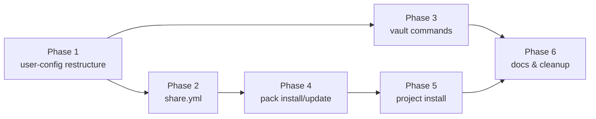

# Implementation Plan: Config Repo

> **Status**: Implementation plan — pending approval
> **Date**: 2026-03-04
> **Design**: [design.md](./design.md)
> **Branch**: `feat/config-repo/user-config-restructure`

---

## Overview

Implementation of the Config Repo feature (Sprint 6 + Sprint 10 unified).
Six phases, each producing a working, committable state.

**Implementation order rationale**: directory restructure first (foundation),
then share.yml (needed by install), then vault (independent), then install
commands (depends on share.yml), then project install (depends on template
vars), then docs/cleanup.

---

## Phase 1 — Directory Restructure (`user-config/`)

Foundation phase. All subsequent phases depend on this.

### 1.1 Update `bin/cco` environment variables with auto-detection

**File**: `bin/cco` (lines 8-10)

Replace:
```bash
PROJECTS_DIR="${CCO_PROJECTS_DIR:-$REPO_ROOT/projects}"
GLOBAL_DIR="${CCO_GLOBAL_DIR:-$REPO_ROOT/global}"
```

With auto-detection logic that supports both old and new layouts:
```bash
USER_CONFIG_DIR="${CCO_USER_CONFIG_DIR:-$REPO_ROOT/user-config}"

# Auto-detect: if user-config/ doesn't exist but old global/ does → legacy layout
# This allows cco update to find existing config and run the migration
if [[ -z "${CCO_USER_CONFIG_DIR:-}" && ! -d "$USER_CONFIG_DIR/global" && -d "$REPO_ROOT/global/.claude" ]]; then
    # Legacy layout — migration not yet run
    GLOBAL_DIR="${CCO_GLOBAL_DIR:-$REPO_ROOT/global}"
    PROJECTS_DIR="${CCO_PROJECTS_DIR:-$REPO_ROOT/projects}"
    PACKS_DIR="${CCO_PACKS_DIR:-$REPO_ROOT/global/packs}"
    TEMPLATES_DIR="${CCO_TEMPLATES_DIR:-$REPO_ROOT/user-config/templates}"
    _CCO_LEGACY_LAYOUT=true
else
    GLOBAL_DIR="${CCO_GLOBAL_DIR:-$USER_CONFIG_DIR/global}"
    PROJECTS_DIR="${CCO_PROJECTS_DIR:-$USER_CONFIG_DIR/projects}"
    PACKS_DIR="${CCO_PACKS_DIR:-$USER_CONFIG_DIR/packs}"
    TEMPLATES_DIR="${CCO_TEMPLATES_DIR:-$USER_CONFIG_DIR/templates}"
    _CCO_LEGACY_LAYOUT=false
fi
```

Add deprecation warnings after sourcing modules:
```bash
if [[ -n "${CCO_GLOBAL_DIR:-}" ]]; then
    warn "CCO_GLOBAL_DIR is deprecated. Use CCO_USER_CONFIG_DIR instead."
    warn "  Current: CCO_GLOBAL_DIR=$CCO_GLOBAL_DIR"
    warn "  Suggested: export CCO_USER_CONFIG_DIR=$(dirname "$CCO_GLOBAL_DIR")"
fi
if [[ -n "${CCO_PROJECTS_DIR:-}" ]]; then
    warn "CCO_PROJECTS_DIR is deprecated. Use CCO_USER_CONFIG_DIR instead."
fi
```

**Why auto-detection**: `cco update` must find the existing config at the old
paths to run the migration that moves them to the new paths. Without this,
changing the vars first breaks the migration flow.

Add `vault` and `share` command routing to the case statement.
Source new modules: `source "$LIB_DIR/share.sh"` (Phase 2),
`source "$LIB_DIR/cmd-vault.sh"` (Phase 3).
These can be initially empty stubs sourced only after they exist.

### 1.2 Update `lib/packs.sh` — path references

**File**: `lib/packs.sh`

Specific changes:
- Line 36: `$GLOBAL_DIR/packs/${pack_name}/pack.yml` → `$PACKS_DIR/${pack_name}/pack.yml`
- Line 177: `$GLOBAL_DIR/packs/$name` → `$PACKS_DIR/$name`
- Update Globals comment (line 7): add `PACKS_DIR`

### 1.3 Update `lib/cmd-pack.sh` — path references and messages

**File**: `lib/cmd-pack.sh`

Specific changes (all `$GLOBAL_DIR/packs` → `$PACKS_DIR`):
- Line 44: `$GLOBAL_DIR/packs/$name` → `$PACKS_DIR/$name`
- Line 45: error message `global/packs/$name/` → `packs/$name/`
- Line 75: success message `global/packs/$name/` → `packs/$name/`
- Line 81: info message `global/packs/$name/pack.yml` → `packs/$name/pack.yml`
- Line 89: loop `$GLOBAL_DIR/packs` → `$PACKS_DIR`
- Line 133: `$GLOBAL_DIR/packs/$name` → `$PACKS_DIR/$name`
- Line 135: error message `global/packs/$name/` → `packs/$name/`
- Line 269: `$GLOBAL_DIR/packs/$name` → `$PACKS_DIR/$name`
- Line 270: error message
- Line 339: `$GLOBAL_DIR/packs/$name` → `$PACKS_DIR/$name`
- Line 343: loop `$GLOBAL_DIR/packs` → `$PACKS_DIR`
- Update Globals comment (line 7): replace `GLOBAL_DIR` with `PACKS_DIR, PROJECTS_DIR`

### 1.4 Update `lib/cmd-project.sh` — path references

**File**: `lib/cmd-project.sh`

Specific changes:
- Line 245: `$GLOBAL_DIR/packs/$pack` → `$PACKS_DIR/$pack`
- Line 355: `$GLOBAL_DIR/packs/$pack` → `$PACKS_DIR/$pack`
- Line 356: error message `global/packs/` → `packs/`

### 1.5 Update `lib/cmd-start.sh` — path references

**File**: `lib/cmd-start.sh`

Specific changes:
- Line 437: `$GLOBAL_DIR/packs/${pack_name}/pack.yml` → `$PACKS_DIR/${pack_name}/pack.yml`
- Line 471: `$GLOBAL_DIR/packs/${pack_name}/pack.yml` → `$PACKS_DIR/${pack_name}/pack.yml`

All other `$GLOBAL_DIR` and `$PROJECTS_DIR` references use the variable
(not hardcoded paths), so they adapt automatically.

### 1.6 Update `lib/cmd-init.sh` — new directory structure

**File**: `lib/cmd-init.sh`

Change init to create `user-config/` structure:
- Line 58: check `$GLOBAL_DIR/.claude` (works with both layouts via auto-detect)
- Line 59: message `global/ already exists` → `Config already initialized`
- Line 66-69: create `$USER_CONFIG_DIR/` parent, then copy to `$GLOBAL_DIR/.claude/`
- Line 80: success message: update path references
- Lines 114-118: replace:
  ```bash
  mkdir -p "$PROJECTS_DIR"
  mkdir -p "$GLOBAL_DIR/packs"
  ok "Projects directory ready at projects/"
  ok "Packs directory ready at global/packs/ ..."
  ```
  With:
  ```bash
  mkdir -p "$PROJECTS_DIR"
  mkdir -p "$PACKS_DIR"
  mkdir -p "$TEMPLATES_DIR"
  ok "Projects directory ready"
  ok "Packs directory ready"
  ok "Templates directory ready"
  ```

### 1.7 Update `.gitignore` in tool repo

**File**: `.gitignore`

Replace:
```gitignore
# User configuration (created by cco init, customized by user)
/global/
/projects/
```
With:
```gitignore
# User configuration — new unified structure
/user-config/

# Legacy layout (pre-migration) — keep during transition
/global/
/projects/
```

Also update `global/secrets.env` → `user-config/global/secrets.env` and
keep the old pattern during transition.

### 1.8 Migration script

**File**: `migrations/global/003_user-config-dir.sh`

> **Note**: global migrations currently have IDs 1 and 2. Next is **3**, not 4.

```bash
MIGRATION_ID=3
MIGRATION_DESC="Restructure to unified user-config directory"

migrate() {
    local target_dir="$1"  # Receives $GLOBAL_DIR/.claude

    # Use REPO_ROOT directly (available in subshell context — inherited from parent)
    # Do NOT derive from target_dir — fragile path arithmetic
    local user_config="$REPO_ROOT/user-config"
    local old_global="$REPO_ROOT/global"
    local old_projects="$REPO_ROOT/projects"

    # Skip if user has CCO_USER_CONFIG_DIR set to external path
    if [[ -n "${CCO_USER_CONFIG_DIR:-}" ]]; then
        user_config="$CCO_USER_CONFIG_DIR"
    fi

    # Skip if already migrated (user-config/global/.claude exists)
    [[ -d "$user_config/global/.claude" ]] && return 0

    # Skip if nothing to migrate (fresh install already uses new layout)
    [[ ! -d "$old_global/.claude" ]] && return 0

    info "Migrating to user-config/ directory structure..."

    # 1. Create user-config/
    mkdir -p "$user_config"

    # 2. Elevate packs BEFORE moving global (packs are inside global/)
    if [[ -d "$old_global/packs" ]]; then
        mv "$old_global/packs" "$user_config/packs"
        ok "  Elevated global/packs/ → user-config/packs/"
    else
        mkdir -p "$user_config/packs"
    fi

    # 3. Move global/ → user-config/global/
    if [[ -d "$old_global" ]]; then
        mv "$old_global" "$user_config/global"
        ok "  Moved global/ → user-config/global/"
    fi

    # 4. Move projects/ → user-config/projects/
    if [[ -d "$old_projects" ]]; then
        mv "$old_projects" "$user_config/projects"
        ok "  Moved projects/ → user-config/projects/"
    else
        mkdir -p "$user_config/projects"
    fi

    # 5. Create templates/ (new, empty)
    mkdir -p "$user_config/templates"
    ok "  Created user-config/templates/"

    info ""
    info "Migration complete. Run 'cco vault init' to enable versioning."

    return 0
}
```

**Key differences from original plan:**
- Uses `$REPO_ROOT` directly instead of fragile `$target_dir/../../..`
- Migration ID is 3 (not 4)
- Handles `CCO_USER_CONFIG_DIR` pointing to external path
- Prints per-step progress

### 1.9 Update `lib/utils.sh` — check_global()

**File**: `lib/utils.sh` (line 32-36)

`check_global()` checks `$GLOBAL_DIR/.claude`. With auto-detection in
`bin/cco`, `GLOBAL_DIR` always points to the right location, so no change
needed. Document this dependency in a comment.

### 1.10 Update test helpers

**File**: `tests/helpers.sh`

```bash
# setup_cco_env: add USER_CONFIG_DIR and PACKS_DIR
setup_cco_env() {
    local tmpdir="$1"
    export CCO_USER_CONFIG_DIR="$tmpdir/user-config"
    export CCO_GLOBAL_DIR="$tmpdir/user-config/global"
    export CCO_PROJECTS_DIR="$tmpdir/user-config/projects"
    export CCO_PACKS_DIR="$tmpdir/user-config/packs"
    export CCO_TEMPLATES_DIR="$tmpdir/user-config/templates"
    export CCO_DUMMY_REPO="$tmpdir/dummy-repo"
    mkdir -p "$CCO_USER_CONFIG_DIR" "$CCO_GLOBAL_DIR" "$CCO_PROJECTS_DIR" \
             "$CCO_PACKS_DIR" "$CCO_TEMPLATES_DIR" "$CCO_DUMMY_REPO"
}

# setup_global_from_defaults: updated paths
setup_global_from_defaults() {
    local tmpdir="$1"
    mkdir -p "$tmpdir/user-config/global"
    cp -r "$REPO_ROOT/defaults/global/.claude" "$tmpdir/user-config/global/.claude"
    mkdir -p "$tmpdir/user-config/packs"
}

# create_pack: use PACKS_DIR
create_pack() {
    local tmpdir="$1" name="$2" yml_content="$3"
    local pack_dir="$tmpdir/user-config/packs/$name"
    mkdir -p "$pack_dir"
    printf '%s\n' "$yml_content" > "$pack_dir/pack.yml"
}

# run_cco: pass all env vars
run_cco() {
    CCO_OUTPUT=$(
        CCO_USER_CONFIG_DIR="$CCO_USER_CONFIG_DIR" \
        CCO_GLOBAL_DIR="$CCO_GLOBAL_DIR" \
        CCO_PROJECTS_DIR="$CCO_PROJECTS_DIR" \
        CCO_PACKS_DIR="$CCO_PACKS_DIR" \
        CCO_TEMPLATES_DIR="$CCO_TEMPLATES_DIR" \
        bash "$REPO_ROOT/bin/cco" "$@" 2>&1
    ) || return $?
}
```

### 1.11 Update existing tests

**Files affected**: all tests that reference paths

- `tests/test_init.sh` line 115: `$CCO_GLOBAL_DIR/packs` → `$CCO_PACKS_DIR`
- `tests/test_init.sh` line 108: `$CCO_PROJECTS_DIR` (already uses var, OK)
- `tests/test_update.sh` line 198: schema_version assertion `2` → `3`
  (migration 003 bumps the version)
- `tests/test_pack_cli.sh`: audit all `$CCO_GLOBAL_DIR/packs` → `$CCO_PACKS_DIR`
- `tests/test_packs.sh`: audit all path references
- `tests/test_project_create.sh`: audit pack references

New test: migration from old structure
```bash
test_migration_old_to_user_config() {
    local tmpdir; tmpdir=$(mktemp -d); trap "rm -rf '$tmpdir'" EXIT

    # Simulate OLD layout (pre-migration)
    mkdir -p "$tmpdir/global/.claude/rules"
    mkdir -p "$tmpdir/global/packs/test-pack"
    mkdir -p "$tmpdir/projects/my-project"
    echo "test" > "$tmpdir/global/.claude/settings.json"
    echo "test" > "$tmpdir/global/packs/test-pack/pack.yml"

    # Point env vars to old layout
    export CCO_GLOBAL_DIR="$tmpdir/global"
    export CCO_PROJECTS_DIR="$tmpdir/projects"
    unset CCO_USER_CONFIG_DIR CCO_PACKS_DIR CCO_TEMPLATES_DIR

    # Create .cco-meta at schema 2
    create_cco_meta "$tmpdir/global/.claude/.cco-meta" "schema_version: 2
created_at: 2026-01-01T00:00:00Z
updated_at: 2026-01-01T00:00:00Z
languages:
  communication: English
  documentation: English
  code_comments: English
manifest:"

    run_cco update

    # Verify migration occurred
    assert_dir_exists "$tmpdir/user-config/global/.claude"
    assert_dir_exists "$tmpdir/user-config/packs/test-pack"
    assert_dir_exists "$tmpdir/user-config/projects/my-project"
    assert_dir_exists "$tmpdir/user-config/templates"
    # Old dirs should be gone
    assert_dir_not_exists "$tmpdir/global"
    assert_dir_not_exists "$tmpdir/projects"
}
```

> **Note**: `assert_dir_not_exists` helper needs to be added to `helpers.sh`.

**Commit**: `feat: restructure to unified user-config directory`

---

## Phase 2 — share.yml Management

### 2.1 Create `lib/share.sh`

New module. Source it from `bin/cco` after `source "$LIB_DIR/packs.sh"`.

Functions:

```bash
share_read()          # Parse share.yml, output structured data (uses yaml.sh)
share_add_entry()     # Add pack or template entry to share.yml
share_remove_entry()  # Remove entry from share.yml
share_refresh()       # Regenerate share.yml by scanning packs/ and templates/
share_validate()      # Cross-check share.yml vs disk (warn on stale entries)
share_init()          # Create minimal share.yml for a new config dir
```

**YAML writing strategy**: share.yml has a simple, flat structure.
Use `cat <<EOF` to regenerate the entire file on each modification.
Do NOT attempt incremental sed-based YAML editing (fragile).
`share_refresh()` scans directories and regenerates from scratch.
`share_add_entry()` and `share_remove_entry()` call `share_refresh()`
internally (simplest approach, no partial YAML manipulation).

### 2.2 Integrate into existing pack commands

**File**: `lib/cmd-pack.sh`

- `cmd_pack_create()`: after creating pack dir + pack.yml, call
  `share_refresh "$USER_CONFIG_DIR"` to regenerate share.yml
- `cmd_pack_remove()`: after removing pack dir, call
  `share_refresh "$USER_CONFIG_DIR"` to update share.yml

### 2.3 Add `cco share` command

**Files**: `bin/cco` (case statement), `lib/share.sh` (command functions)

Subcommands:
- `cco share refresh` — regenerate share.yml from packs/ and templates/
- `cco share validate` — cross-check share.yml vs disk
- `cco share show` — display share.yml contents formatted

### 2.4 Auto-generate share.yml on `cco init`

**File**: `lib/cmd-init.sh`

After creating the directory structure, call `share_init "$USER_CONFIG_DIR"`.
This generates a minimal share.yml:

```yaml
# Auto-generated by cco — edit description and tags as needed
name: ""
description: ""

packs: []

templates: []
```

### 2.5 Tests

- `tests/test_share.sh` (new):
  - Test `share_refresh` generates correct YAML from pack dirs
  - Test `share_refresh` updates on pack create/remove
  - Test `share_validate` warns on stale entries
  - Test `share_init` creates minimal share.yml

**Commit**: `feat: add share.yml management (auto-generated, required manifest)`

---

## Phase 3 — Vault Commands

### 3.1 Create `lib/cmd-vault.sh`

New module. Source from `bin/cco`.

```bash
cmd_vault_init()     # git init + .gitignore template + share.yml if missing
cmd_vault_sync()     # pre-commit summary + secret detection + git add -A + commit
cmd_vault_diff()     # categorized git diff/status
cmd_vault_log()      # git log --oneline
cmd_vault_restore()  # git checkout <ref> -- . (with confirmation)
cmd_vault_remote()   # git remote add <name> <url>
cmd_vault_push()     # git push [<remote>]
cmd_vault_pull()     # git pull [<remote>]
cmd_vault_status()   # init state + remote sync + uncommitted count
```

### 3.2 Vault .gitignore template

Baked as a heredoc in `cmd_vault_init()`. Contents per design §8.
This is the `.gitignore` INSIDE `user-config/` (the vault repo),
NOT the tool repo's `.gitignore` (which is separate).

### 3.3 Pre-commit summary and secret detection in `cmd_vault_sync()`

Implementation per design §4:

1. Run `git -C "$USER_CONFIG_DIR" status --porcelain`
2. **Secret detection**: scan for `secrets.env`, `*.key`, `*.pem`,
   `.credentials.json`. If any would be staged → **abort with error**
   (not just warning). Print which files matched.
3. Parse and categorize changes by directory prefix:
   - `packs/` → Packs
   - `projects/` → Projects
   - `global/` → Global settings
   - `templates/` → Templates
4. Display summary grouped by category
5. Prompt `Proceed? [Y/n]` (skip with `--yes`)
6. `--dry-run` shows summary and exits without committing
7. On confirm: `git add -A` → `git commit -m "vault: <message>"`

### 3.4 Wire into `bin/cco`

Add `vault` command routing with all subcommands.

### 3.5 Tests

- `tests/test_vault.sh` (new):
  - Test vault init creates git repo + .gitignore
  - Test vault init outside user-config (external path)
  - Test vault sync with --dry-run shows summary
  - Test vault sync --yes skips prompt
  - Test vault sync aborts on secret files
  - Test vault status on non-initialized dir
  - Test vault diff categorizes output

**Commit**: `feat: add cco vault commands for config versioning`

---

## Phase 4 — Pack Install / Update from Remote

### 4.1 Clone helper function

**File**: `lib/remote.sh` (new module, sourced by `bin/cco`)

```bash
_supports_sparse_checkout() {
    # Test actual sparse-checkout functionality, not just --help
    local test_dir; test_dir=$(mktemp -d)
    git -C "$test_dir" init -q 2>/dev/null
    git -C "$test_dir" sparse-checkout set "dummy" 2>/dev/null
    local rc=$?
    rm -rf "$test_dir"
    return $rc
}

_clone_config_repo() {
    local url="$1" ref="${2:-}" token="${3:-}"
    local tmpdir; tmpdir=$(mktemp -d "${TMPDIR:-/tmp}/cco-XXXXXX")

    # Auth: set token for HTTPS if provided
    local -a git_opts=()
    if [[ -n "$token" ]]; then
        git_opts+=(-c "http.extraHeader=Authorization: Bearer $token")
    elif [[ -n "${GITHUB_TOKEN:-}" && "$url" == *github.com* ]]; then
        git_opts+=(-c "http.extraHeader=Authorization: Bearer $GITHUB_TOKEN")
    fi

    # Primary: sparse-checkout (git 2.25+)
    if _supports_sparse_checkout; then
        git "${git_opts[@]}" clone --no-checkout --filter=blob:none \
            ${ref:+--branch "$ref"} "$url" "$tmpdir" 2>/dev/null \
            || die "Failed to clone $url"
    else
        # Fallback: shallow clone
        git "${git_opts[@]}" clone --depth 1 \
            ${ref:+--branch "$ref"} "$url" "$tmpdir" 2>/dev/null \
            || die "Failed to clone $url"
    fi

    echo "$tmpdir"
}

_cleanup_clone() {
    local tmpdir="$1"
    [[ -d "$tmpdir" && "$tmpdir" == /tmp/cco-* ]] && rm -rf "$tmpdir"
}
```

### 4.2 `cmd_pack_install()`

**File**: `lib/cmd-pack.sh`

Flow:
1. Parse args (url, `--pick`, `--token`, `@ref`)
2. Clone to tmpdir via `_clone_config_repo()`
3. Validate: `share.yml` exists OR `pack.yml` at root (single-pack exception)
4. Read share.yml → list available packs
5. If multi-pack + no `--pick` → interactive selection (list + prompt)
6. If sparse-checkout supported: `git sparse-checkout set packs/<name>` + checkout
7. Copy pack dir to `$PACKS_DIR/<name>/`
8. Write `.cco-source` metadata (YAML: source, path, ref, installed, updated)
9. Update local `share.yml` via `share_refresh "$USER_CONFIG_DIR"`
10. Cleanup tmpdir via `_cleanup_clone()`
11. Print confirmation

### 4.3 `cmd_pack_update()`

**File**: `lib/cmd-pack.sh`

1. Read `$PACKS_DIR/<name>/.cco-source` via yaml.sh
2. If `source: local` → error "Pack was created locally, no remote source"
3. Clone from recorded source URL + ref
4. Compare remote version vs local (`diff -rq`)
5. If local modifications and no `--force` → warn and abort with diff preview
6. Replace pack contents, update `.cco-source` updated date
7. `share_refresh "$USER_CONFIG_DIR"`

### 4.4 `cmd_pack_export()`

**File**: `lib/cmd-pack.sh`

```bash
tar czf "${name}.tar.gz" -C "$PACKS_DIR" --exclude='.cco-source' \
    --exclude='.cco-install-tmp' "$name"
```

### 4.5 Conflict handling

Per design §5: check if `$PACKS_DIR/<name>` exists before copying.
- Read existing `.cco-source` if present
- If source URL matches → offer to update (call `cmd_pack_update`)
- If source URL differs → prompt: overwrite / keep / abort
- If `source: local` → always prompt before overwriting

### 4.6 Tests

- `tests/test_pack_install.sh` (new):
  - Create a temporary bare git repo as mock remote
  - Test install from local git repo
  - Test install `--pick` specific pack
  - Test install conflict (existing pack with same name)
  - Test update from recorded source
  - Test export creates valid archive
  - Test install rejects repo without share.yml

**Commit**: `feat: add cco pack install/update/export for remote Config Repos`

---

## Phase 5 — Project Install + Template Variables

### 5.1 Template variable resolver

**File**: `lib/cmd-project.sh` (new function)

```bash
_resolve_template_vars() {
    local template_file="$1" target_file="$2" project_name="${3:-}"
    local -a substitutions=()

    # Scan for {{VARIABLE}} patterns
    local vars
    vars=$(grep -oE '\{\{[A-Z_]+\}\}' "$template_file" | sort -u || true)

    [[ -z "$vars" ]] && { cp "$template_file" "$target_file"; return 0; }

    info "Template requires the following values:"
    local var name value default
    for var in $vars; do
        name="${var//[\{\}]/}"
        default=""

        # Predefined defaults
        case "$name" in
            PROJECT_NAME) default="${project_name:-}" ;;
        esac

        if [[ -n "$default" ]]; then
            read -rp "  $name [$default]: " value < /dev/tty
            value="${value:-$default}"
        else
            read -rp "  $name: " value < /dev/tty
        fi

        [[ -z "$value" ]] && die "Value required for $name"
        substitutions+=("-e" "s|{{$name}}|$value|g")
    done

    sed "${substitutions[@]}" "$template_file" > "$target_file"
}
```

**Note**: reads from `/dev/tty` explicitly (same pattern as existing
interactive prompts in `cmd_pack_remove` and `update.sh`).

### 5.2 `cmd_project_install()`

**File**: `lib/cmd-project.sh`

Flow mirrors pack install:
1. Clone remote repo via `_clone_config_repo()`
2. Validate share.yml (check `templates:` section)
3. If `--pick`, select specific template; else list available
4. Copy template to `$PROJECTS_DIR/<name>/`
5. Resolve template variables in `project.yml` and `.claude/CLAUDE.md`
6. Print summary

### 5.3 Wire into `bin/cco`

Add `install` subcommand to `project)` case (line 76).

### 5.4 Tests

- `tests/test_project_install.sh` (new):
  - Test template variable scanning and substitution
  - Test predefined variable defaults
  - Test project install from mock remote
  - Test `--as` rename

**Commit**: `feat: add cco project install with template variable resolution`

---

## Phase 6 — Documentation & Cleanup

### 6.1 Update `CLAUDE.md` (repo root)

- Add `lib/share.sh`, `lib/remote.sh`, `lib/cmd-vault.sh` to key files
- Update `PACKS_DIR` in architecture section
- Add vault and share commands to build/run section
- Update directory layout description

### 6.2 Update `docs/reference/cli.md`

Add documentation for new commands:
- `cco vault init|sync|diff|log|restore|remote|push|pull|status`
- `cco pack install|update|export`
- `cco project install`
- `cco share refresh|validate|show`

### 6.3 Update `docs/user-guides/project-setup.md`

Add section on installing packs and project templates from remote Config Repos.

### 6.4 Update `projects/claude-orchestrator/.claude/CLAUDE.md`

Update architecture section with `user-config/` structure and new lib modules.

### 6.5 Update `docs/maintainer/docker/design.md`

Update directory structure section to reflect `user-config/`.

**Commit**: `docs: update documentation for Config Repo feature`

---

## Dependency Graph



Phases 2 and 3 can be committed independently after Phase 1.
Phase 4 depends on Phase 2 (share.yml validation on install).
Phase 5 depends on Phase 4 (shared clone helper in `lib/remote.sh`).

---

## Files Changed Summary

### Phase 1 — Modified files
| File | Change |
|---|---|
| `bin/cco` | Add `USER_CONFIG_DIR`, `PACKS_DIR`, `TEMPLATES_DIR`; auto-detect; deprecation warnings; vault/share routing |
| `lib/packs.sh` | `$GLOBAL_DIR/packs` → `$PACKS_DIR` (2 occurrences) |
| `lib/cmd-pack.sh` | `$GLOBAL_DIR/packs` → `$PACKS_DIR` (10+ occurrences); update user-facing messages |
| `lib/cmd-project.sh` | `$GLOBAL_DIR/packs` → `$PACKS_DIR` (3 occurrences); update messages |
| `lib/cmd-start.sh` | `$GLOBAL_DIR/packs` → `$PACKS_DIR` (2 occurrences) |
| `lib/cmd-init.sh` | Create `user-config/` structure; update messages |
| `.gitignore` | Add `user-config/`; keep `global/` + `projects/` for transition |
| `tests/helpers.sh` | Add `CCO_USER_CONFIG_DIR`, `CCO_PACKS_DIR`, `CCO_TEMPLATES_DIR` to setup |
| `tests/test_init.sh` | Update path assertions |
| `tests/test_update.sh` | Update schema_version assertions (2 → 3) |
| `tests/test_pack_cli.sh` | Update pack path references |
| `tests/test_packs.sh` | Update pack path references |

### Phase 1 — New files
| File | Purpose |
|---|---|
| `migrations/global/003_user-config-dir.sh` | Migration: move global/ + projects/ → user-config/ |

### Phases 2-5 — New files
| File | Phase | Purpose |
|---|---|---|
| `lib/share.sh` | 2 | share.yml lifecycle management |
| `lib/cmd-vault.sh` | 3 | Vault commands (git-backed versioning) |
| `lib/remote.sh` | 4 | Clone helper, sparse-checkout, auth |
| `tests/test_share.sh` | 2 | share.yml tests |
| `tests/test_vault.sh` | 3 | Vault command tests |
| `tests/test_pack_install.sh` | 4 | Remote pack install/update tests |
| `tests/test_project_install.sh` | 5 | Project install + template var tests |

---

## Risk Mitigation

| Risk | Mitigation |
|---|---|
| Migration breaks existing users | Auto-detect legacy layout; idempotent migration; `$REPO_ROOT` instead of fragile path derivation |
| `cco update` can't find old config | Auto-detect: if `user-config/global` missing but `global/` exists → use old paths |
| Env var deprecation breaks scripts | Legacy vars continue to work (override derived); warning only |
| Sparse-checkout not available | Fallback to shallow clone + selective copy |
| YAML parser limitations | share.yml regenerated fully (no incremental editing) |
| Secret leak via vault sync | Pre-commit scan + **abort** on secrets (not just warning) |
| bash 3.2 compat | Test arrays with `set -u`; use `${arr[@]+"${arr[@]}"}` pattern |
| Test suite breakage | Update helpers first; all tests use env vars (not hardcoded paths) |
