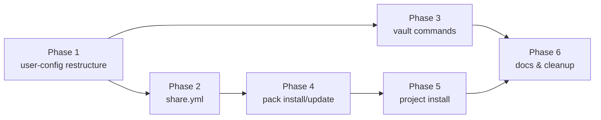

# Implementation Plan: Config Repo

> **Status**: Implementation plan — pending approval
> **Date**: 2026-03-04
> **Design**: [design.md](./design.md)
> **Branch**: `feat/config-repo/user-config-restructure`

---

## Overview

Implementation of the Config Repo feature (Sprint 6 + Sprint 10 unified).
Six phases, each producing a working, committable state.

**Implementation order rationale**: directory restructure first (foundation),
then share.yml (needed by install), then vault (independent), then install
commands (depends on share.yml), then project install (depends on template
vars), then tests throughout.

---

## Phase 1 — Directory Restructure (`user-config/`)

Foundation phase. All subsequent phases depend on this.

### 1.1 Update `bin/cco` environment variables

**File**: `bin/cco` (lines 8-10)

Replace:
```bash
PROJECTS_DIR="${CCO_PROJECTS_DIR:-$REPO_ROOT/projects}"
GLOBAL_DIR="${CCO_GLOBAL_DIR:-$REPO_ROOT/global}"
```

With:
```bash
USER_CONFIG_DIR="${CCO_USER_CONFIG_DIR:-$REPO_ROOT/user-config}"
GLOBAL_DIR="${CCO_GLOBAL_DIR:-$USER_CONFIG_DIR/global}"
PROJECTS_DIR="${CCO_PROJECTS_DIR:-$USER_CONFIG_DIR/projects}"
PACKS_DIR="${CCO_PACKS_DIR:-$USER_CONFIG_DIR/packs}"
TEMPLATES_DIR="${CCO_TEMPLATES_DIR:-$USER_CONFIG_DIR/templates}"
```

Add deprecation warnings after sourcing modules:
```bash
# Deprecation warnings for legacy env vars
if [[ -n "${CCO_GLOBAL_DIR:-}" ]]; then
    warn "CCO_GLOBAL_DIR is deprecated. Use CCO_USER_CONFIG_DIR instead."
fi
if [[ -n "${CCO_PROJECTS_DIR:-}" ]]; then
    warn "CCO_PROJECTS_DIR is deprecated. Use CCO_USER_CONFIG_DIR instead."
fi
```

Add `vault` and `share` command routing to the case statement.

### 1.2 Update `lib/packs.sh` — path references

**File**: `lib/packs.sh`

Replace all `$GLOBAL_DIR/packs` references with `$PACKS_DIR`.
Grep for: `GLOBAL_DIR.*packs`, `global/packs`, `"$GLOBAL_DIR"/packs`.

### 1.3 Update `lib/cmd-pack.sh` — path references

**File**: `lib/cmd-pack.sh`

Same: replace `$GLOBAL_DIR/packs` → `$PACKS_DIR` in all pack commands
(create, list, show, remove, validate).

### 1.4 Update `lib/cmd-init.sh` — new directory structure

**File**: `lib/cmd-init.sh`

Change init to create `user-config/` structure:
- Create `$USER_CONFIG_DIR/` (not `global/` at root)
- Create `$PACKS_DIR/` (not `$GLOBAL_DIR/packs/`)
- Create `$TEMPLATES_DIR/`
- Copy `defaults/global/.claude/` → `$GLOBAL_DIR/.claude/`
- Write `.cco-meta` inside `$GLOBAL_DIR/.claude/`

### 1.5 Update `lib/cmd-start.sh` — path references

**File**: `lib/cmd-start.sh`

Audit all references to `$GLOBAL_DIR` and `$PROJECTS_DIR`.
Most should already use the variables (not hardcoded paths).
Verify pack resource copying uses `$PACKS_DIR`.

### 1.6 Update `.gitignore` in tool repo

**File**: `.gitignore`

Replace:
```
/global/
/projects/
```
With:
```
/user-config/
```

Keep `/global/` and `/projects/` temporarily for migration transition
(users who haven't migrated yet). Remove after two releases.

### 1.7 Migration script

**File**: `migrations/global/004_user-config-dir.sh`

```bash
MIGRATION_ID=4
MIGRATION_DESC="Restructure to unified user-config directory"

migrate() {
    local target_dir="$1"  # This is $GLOBAL_DIR/.claude
    local repo_root
    repo_root="$(cd "$target_dir/../../.." && pwd)"

    local user_config="$repo_root/user-config"
    local old_global="$repo_root/global"
    local old_projects="$repo_root/projects"

    # Skip if already migrated
    [[ -d "$user_config/global" ]] && return 0

    # 1. Create user-config structure
    mkdir -p "$user_config"

    # 2. Elevate packs BEFORE moving global
    if [[ -d "$old_global/packs" ]]; then
        mv "$old_global/packs" "$user_config/packs"
    else
        mkdir -p "$user_config/packs"
    fi

    # 3. Move global/ → user-config/global/
    if [[ -d "$old_global" ]]; then
        mv "$old_global" "$user_config/global"
    fi

    # 4. Move projects/ → user-config/projects/
    if [[ -d "$old_projects" ]]; then
        mv "$old_projects" "$user_config/projects"
    fi

    # 5. Create templates/ (new, empty)
    mkdir -p "$user_config/templates"

    # 6. Update .gitignore
    # (handled by update system, not migration)

    info "Migrated to user-config/ directory structure"
    info "Run 'cco vault init' to enable versioning"
    return 0
}
```

### 1.8 Update `lib/cmd-update.sh`

Ensure the update command resolves paths correctly with the new
`USER_CONFIG_DIR` base. The migration engine in `lib/update.sh` receives
`$GLOBAL_DIR/.claude` as target — verify this still works after path changes.

### 1.9 Tests

- `tests/test_init.sh` — verify `cco init` creates `user-config/` structure
- `tests/test_invariants.sh` — update path assertions
- New test: migration from old structure to `user-config/`

**Commit**: `feat: restructure to unified user-config directory`

---

## Phase 2 — share.yml Management

### 2.1 Create `lib/share.sh`

New module with functions:

```bash
share_read()          # Parse share.yml, output structured data
share_add_entry()     # Add pack or template entry to share.yml
share_remove_entry()  # Remove entry from share.yml
share_refresh()       # Regenerate share.yml from disk scan
share_validate()      # Cross-check share.yml vs disk
share_init()          # Create minimal share.yml for a new config dir
```

Uses `lib/yaml.sh` for YAML reading. For YAML writing, use simple
`cat <<EOF` generation (share.yml is simple enough — flat list of entries).

### 2.2 Integrate into existing pack commands

**File**: `lib/cmd-pack.sh`

- `cmd_pack_create()`: after creating pack structure, call
  `share_add_entry "pack" "$name" "$description"`
- `cmd_pack_remove()`: before removing pack dir, call
  `share_remove_entry "pack" "$name"`

### 2.3 Add `cco share` command

**File**: `bin/cco` — add `share` to case statement
**File**: `lib/cmd-pack.sh` or new `lib/cmd-share.sh`

Subcommands:
- `cco share refresh` — regenerate share.yml from packs/ and templates/
- `cco share validate` — check consistency
- `cco share show` — display share.yml contents formatted

### 2.4 Auto-generate share.yml on `cco init`

After init creates the `user-config/` structure, generate a minimal
`share.yml` (empty packs/templates lists).

### 2.5 Tests

- Test share.yml generation on pack create
- Test share.yml update on pack remove
- Test share refresh regenerates correctly
- Test share validate catches stale entries

**Commit**: `feat: add share.yml management (auto-generated, required manifest)`

---

## Phase 3 — Vault Commands

### 3.1 Create `lib/cmd-vault.sh`

New module implementing all vault subcommands:

```bash
cmd_vault_init()     # git init + .gitignore template
cmd_vault_sync()     # pre-commit summary + git add -A + commit
cmd_vault_diff()     # categorized git diff
cmd_vault_log()      # git log --oneline
cmd_vault_restore()  # git checkout <ref> -- . (with confirmation)
cmd_vault_remote()   # git remote add/remove
cmd_vault_push()     # git push
cmd_vault_pull()     # git pull
cmd_vault_status()   # init state + remote sync + uncommitted count
```

### 3.2 Vault .gitignore template

Baked as a heredoc in `cmd_vault_init()`. Contents per design §8.

### 3.3 Secret detection in `cmd_vault_sync()`

Before committing, scan staged files for patterns matching secrets:
- `secrets.env`, `*.key`, `*.pem`, `.credentials.json`
- If found: abort with error (not just warning)

### 3.4 Pre-commit summary in `cmd_vault_sync()`

Implementation per design §4:
1. `git status --porcelain` → parse and categorize by directory prefix
2. Display summary grouped by packs/projects/global/templates
3. Prompt `Proceed? [Y/n]` (skip with `--yes`)
4. `--dry-run` shows summary and exits

### 3.5 Wire into `bin/cco`

Add `vault` command routing:
```bash
vault)
    subcmd="${1:-}"
    [[ -z "$subcmd" ]] && die "Usage: cco vault <init|sync|diff|log|restore|remote|push|pull|status>"
    shift
    case "$subcmd" in
        init)    cmd_vault_init "$@" ;;
        sync)    cmd_vault_sync "$@" ;;
        # ...etc
    esac
    ;;
```

### 3.6 Tests

- Test vault init creates git repo + .gitignore
- Test vault sync with pre-commit summary
- Test vault sync --dry-run
- Test vault sync refuses to commit secrets
- Test vault status on non-initialized dir
- Test vault restore with confirmation

**Commit**: `feat: add cco vault commands for config versioning`

---

## Phase 4 — Pack Install / Update from Remote

### 4.1 Clone helper function

**File**: `lib/cmd-pack.sh` (or new `lib/remote.sh`)

```bash
_clone_config_repo() {
    local url="$1" ref="${2:-}" token="${3:-}" tmpdir
    tmpdir=$(mktemp -d /tmp/cco-XXXX)

    # Try sparse-checkout first
    if _supports_sparse_checkout; then
        git clone --no-checkout --filter=blob:none "$url" "$tmpdir"
        # sparse-checkout set is done later per resource
    else
        # Fallback: shallow clone
        git clone --depth 1 ${ref:+--branch "$ref"} "$url" "$tmpdir"
    fi

    echo "$tmpdir"
}

_supports_sparse_checkout() {
    git sparse-checkout set --help &>/dev/null 2>&1
}
```

Auth resolution order: SSH agent → `GITHUB_TOKEN` → `--token` → system git credential helper.

### 4.2 `cmd_pack_install()`

**File**: `lib/cmd-pack.sh`

Flow:
1. Parse args (url, --pick, --token, @ref)
2. Clone to tmpdir
3. Validate share.yml exists (or pack.yml at root for single-pack)
4. Read share.yml → list available packs
5. If multi-pack + no --pick → interactive selection
6. If sparse-checkout: `git sparse-checkout set packs/<name>`
7. Copy pack dir to `$PACKS_DIR/<name>/`
8. Write `.cco-source` metadata
9. Update local `share.yml` via `share_add_entry()`
10. Cleanup tmpdir

### 4.3 `cmd_pack_update()`

**File**: `lib/cmd-pack.sh`

1. Read `$PACKS_DIR/<name>/.cco-source`
2. If `source: local` → skip (no remote)
3. Clone from recorded source URL + ref
4. Compare remote version vs local (diff)
5. If local modifications and no `--force` → warn and abort
6. Replace pack contents, update `.cco-source` (updated date)

### 4.4 `cmd_pack_export()`

**File**: `lib/cmd-pack.sh`

Simple tar.gz of the pack directory, excluding `.cco-source`:
```bash
tar czf "$name.tar.gz" -C "$PACKS_DIR" --exclude='.cco-source' "$name"
```

### 4.5 Conflict handling

Per design §5: check if pack name exists before copying.
- Source matches → offer update
- Source differs → prompt overwrite/keep/abort
- Local pack → always prompt

### 4.6 Tests

- Test install from local git repo (mock)
- Test install --pick specific pack
- Test install conflict (existing pack)
- Test update from recorded source
- Test export creates valid archive
- Test install rejects repo without share.yml

**Commit**: `feat: add cco pack install/update/export for remote Config Repos`

---

## Phase 5 — Project Install + Template Variables

### 5.1 Template variable resolver

**File**: `lib/cmd-project.sh` (extend existing)

```bash
_resolve_template_vars() {
    local template_file="$1" target_file="$2"
    local -a substitutions=()

    # Scan for {{VARIABLE}} patterns
    local vars
    vars=$(grep -oE '\{\{[A-Z_]+\}\}' "$template_file" | sort -u)

    [[ -z "$vars" ]] && { cp "$template_file" "$target_file"; return 0; }

    info "Template requires the following values:"
    for var in $vars; do
        local name="${var//[\{\}]/}"
        local default=""

        # Predefined defaults
        case "$name" in
            PROJECT_NAME) default="${project_name:-}" ;;
        esac

        if [[ -n "$default" ]]; then
            read -rp "  $name [$default]: " value
            value="${value:-$default}"
        else
            read -rp "  $name: " value
        fi

        [[ -z "$value" ]] && die "Value required for $name"
        substitutions+=("-e" "s|{{$name}}|$value|g")
    done

    sed "${substitutions[@]}" "$template_file" > "$target_file"
}
```

### 5.2 `cmd_project_install()`

**File**: `lib/cmd-project.sh`

Flow mirrors pack install:
1. Clone remote repo
2. Validate share.yml (check `templates:` section)
3. If --pick, select specific template; else list available
4. Copy template to `$PROJECTS_DIR/<name>/`
5. Resolve template variables in `project.yml`
6. Resolve template variables in `.claude/CLAUDE.md` (if any)
7. Print summary

### 5.3 Wire into `bin/cco`

Add `install` subcommand to `project)` case:
```bash
project)
    case "$subcmd" in
        install) cmd_project_install "$@" ;;
        # ...existing commands
    esac
```

### 5.4 Tests

- Test template variable scanning
- Test predefined variable defaults
- Test custom variable prompting
- Test project install from remote repo
- Test project install --as renames correctly

**Commit**: `feat: add cco project install with template variable resolution`

---

## Phase 6 — Documentation & Cleanup

### 6.1 Update CLAUDE.md

- Update workspace layout section
- Update architecture diagram
- Update key files list
- Add vault and share commands

### 6.2 Update `docs/reference/cli.md`

Add documentation for new commands:
- `cco vault *`
- `cco pack install/update/export`
- `cco project install`
- `cco share *`

### 6.3 Update `docs/user-guides/project-setup.md`

Add section on installing from remote Config Repos.

### 6.4 Update project CLAUDE.md

Update `projects/claude-orchestrator/.claude/CLAUDE.md` with new structure.

**Commit**: `docs: update documentation for Config Repo feature`

---

## Dependency Graph



Phases 2 and 3 can be developed in parallel after Phase 1.
Phase 4 depends on Phase 2 (share.yml validation).
Phase 5 depends on Phase 4 (shared clone helper).

---

## Risk Mitigation

| Risk | Mitigation |
|---|---|
| Migration breaks existing users | Idempotent migration + backward-compat env vars |
| Sparse-checkout not available | Fallback to shallow clone + selective copy |
| YAML parser limitations | share.yml is flat, simple — within yaml.sh capabilities |
| Secret leak via vault sync | Pre-commit scan + abort on secrets (not just warning) |
| bash 3.2 compat | Test arrays with `set -u`; use `${arr[@]+"${arr[@]}"}`|
