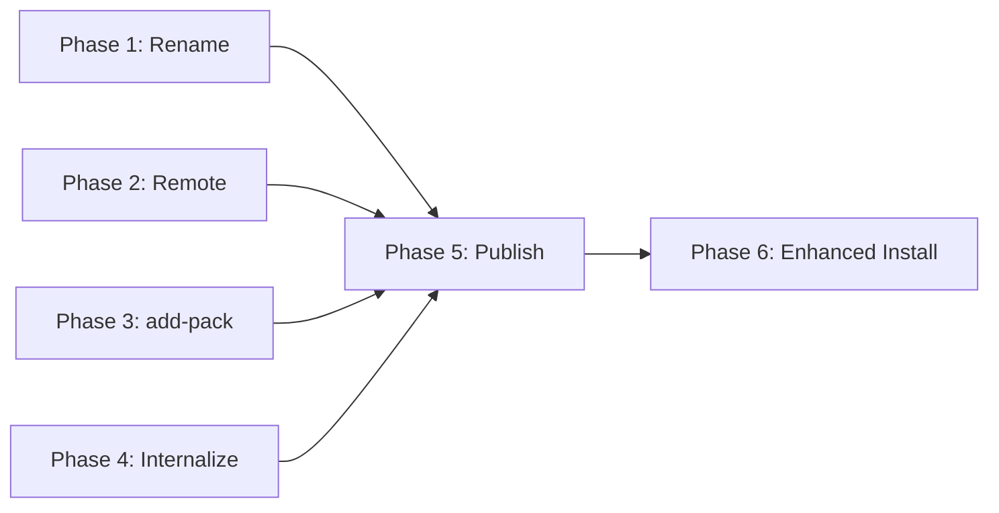

# Sharing System — Design

> Detailed design for the sharing enhancements identified in the
> [sharing analysis](./sharing-analysis.md). Covers command signatures,
> data flows, file formats, and implementation decisions.
>
> Produced: 2026-03-05. Builds on the existing [Config Repo design](./design.md).

---

## Table of Contents

1. [Rename: share → manifest](#1-rename-share--manifest)
2. [Remote management: cco remote](#2-remote-management-cco-remote)
3. [Pack publish](#3-pack-publish)
4. [Project publish](#4-project-publish)
5. [Project add-pack / remove-pack](#5-project-add-pack--remove-pack)
6. [Pack internalize](#6-pack-internalize)
7. [Enhanced project install (auto-clone + auto-packs)](#7-enhanced-project-install)
8. [Manifest scope and lifecycle](#8-manifest-scope-and-lifecycle)
9. [Implementation plan](#9-implementation-plan)

---

## 1. Rename: share → manifest

### What changes

| Before | After |
|---|---|
| `cco share refresh` | `cco manifest refresh` |
| `cco share validate` | `cco manifest validate` |
| `cco share show` | `cco manifest show` |
| `share.yml` | `manifest.yml` |
| `lib/share.sh` | `lib/manifest.sh` |
| `tests/test_share.sh` | `tests/test_manifest.sh` |

### Migration

Migration `005_rename_share_to_manifest.sh`:

```bash
migrate() {
    local dir="$1"
    if [[ -f "$dir/share.yml" && ! -f "$dir/manifest.yml" ]]; then
        mv "$dir/share.yml" "$dir/manifest.yml"
    fi
}
```

Scope: `global` (runs on `user-config/`).

### Internal references

All functions in `lib/manifest.sh` keep their logic unchanged. Renames:
- `share_init()` → `manifest_init()`
- `share_refresh()` → `manifest_refresh()`
- `share_validate()` → `manifest_validate()`
- `share_show()` → `manifest_show()`
- `cmd_share()` → `cmd_manifest()`

`bin/cco`: update dispatch, help text, source line.

All other `lib/*.sh` files that call `share_refresh()` must be updated to
`manifest_refresh()`.

### Backward compatibility

No backward compatibility for `share.yml` in remote repos. Only `manifest.yml`
is supported. Repos using the old `share.yml` must rename to `manifest.yml`.

---

## 2. Remote management: cco remote

### Rationale

Remotes serve two purposes:
1. **Vault**: `push`/`pull` personal config to a backup repo
2. **Publish**: push packs/projects to shared Config Repos

Currently remotes live inside vault's git config (`cco vault remote add`).
Promoting remotes to top-level makes them usable without vault initialization
and reflects their broader purpose.

### Storage

Remotes are stored in `$USER_CONFIG_DIR/.cco-remotes` (simple key-value file):

```
alberghi=git@github.com:alberghi-it/cco-config.git
acme=git@github.com:acme-corp/cco-config.git
personal=git@github.com:jdoe/cco-vault.git
```

Format: `<name>=<url>`, one per line. Lines starting with `#` are comments.
File is gitignored by vault (contains no secrets, but is machine-specific).

If vault is initialized, `cco remote add` also adds the remote to the vault's
git config (so `cco vault push <name>` works). But remotes work independently
of vault — a user can register remotes without vault init.

### Commands

```
cco remote add <name> <url>
cco remote remove <name>
cco remote list
```

**`cco remote add <name> <url>`**

```bash
# Validates name (lowercase, alphanumeric, hyphens)
# Validates URL (basic check: contains : or /)
# Appends to .cco-remotes
# If vault initialized: git -C "$USER_CONFIG_DIR" remote add <name> <url>
```

**`cco remote remove <name>`**

```bash
# Removes from .cco-remotes
# If vault initialized: git -C "$USER_CONFIG_DIR" remote remove <name>
# Warns if any packs have publish_target == <name>
```

**`cco remote list`**

```
Remotes:
  alberghi    git@github.com:alberghi-it/cco-config.git
  acme        git@github.com:acme-corp/cco-config.git
  personal    git@github.com:jdoe/cco-vault.git
```

### Vault integration

`cco vault push [<remote>]` and `cco vault pull [<remote>]` continue to work.
If vault is initialized, they use git's native remote system. The `.cco-remotes`
file is the source of truth; vault remotes are kept in sync.

### Implementation

New file: `lib/cmd-remote.sh` (~80 lines).

Dispatch in `bin/cco`:
```bash
remote)  cmd_remote "$@" ;;
```

---

## 3. Pack publish

### Signature

```
cco pack publish <name> [<remote>] [OPTIONS]

Options:
  --message <msg>    Commit message (default: "publish pack <name>")
  --dry-run          Show what would be published, don't push
  --force            Overwrite remote version without confirmation
  --token <token>    Auth token for HTTPS remotes
```

### Argument resolution

The `<remote>` argument is resolved in order:
1. If it matches a registered remote name → use that URL
2. If it contains `:` or `/` → treat as direct URL
3. If omitted → read `publish_target` from `.cco-source`
4. If none of the above → error with suggestion to register a remote

### Flow

```
cco pack publish alberghi-it alberghi
│
├─ 1. Validate pack exists in $PACKS_DIR/alberghi-it/
├─ 2. Resolve remote "alberghi" → git@github.com:alberghi-it/cco-config.git
├─ 3. Clone remote repo to temp dir (_clone_config_repo)
│     If empty repo (first publish): initialize with manifest.yml
├─ 4. Internalize if needed:
│     If pack has knowledge.source in pack.yml:
│       Copy files from source → tmpdir/packs/<name>/knowledge/
│       Remove source: field from tmpdir pack.yml
│       (Local pack unchanged)
├─ 5. Copy pack to tmpdir/packs/<name>/
│     Exclude: .cco-source, .cco-install-tmp
├─ 6. Refresh manifest in tmpdir (manifest_refresh on tmpdir)
├─ 7. Git add + commit in tmpdir
│     Message: "publish pack <name>" or --message value
├─ 8. Git push to remote
├─ 9. Update local .cco-source:
│     publish_target: alberghi
├─ 10. Cleanup tmpdir
└─ 11. Print confirmation
```

### .cco-source extension

```yaml
# Existing fields (for installed packs):
source: https://github.com/team/config.git
path: packs/my-pack
ref: main
installed: 2026-03-04
updated: 2026-03-04

# New field (for published packs):
publish_target: alberghi
```

For locally created packs, `.cco-source` is created on first publish:

```yaml
source: local
publish_target: alberghi
```

### Conflict handling

If the remote repo already has `packs/<name>/`:
- Show diff summary (files added/changed/removed)
- Prompt for confirmation (unless `--force`)
- On confirm: overwrite remote version

### Dry-run

`--dry-run` performs steps 1-6, prints the diff, and exits without pushing.

---

## 4. Project publish

### Signature

```
cco project publish <name> [<remote>] [OPTIONS]

Options:
  --message <msg>    Commit message
  --dry-run          Show what would be published
  --force            Overwrite without confirmation
  --token <token>    Auth token for HTTPS remotes
  --no-packs         Don't bundle project's packs (default: packs are included)
```

### Reverse-templating

When publishing a project, repo paths must be converted to template variables
and repo URLs must be captured. This happens automatically:

**Input** (local `project.yml`):
```yaml
repos:
  - path: ~/projects/backend-api
    name: backend-api
  - path: ~/projects/web-frontend
    name: web-frontend
```

**Output** (published template):
```yaml
repos:
  - path: "{{REPO_BACKEND_API}}"
    name: backend-api
    url: git@github.com:acme-corp/backend-api.git
  - path: "{{REPO_WEB_FRONTEND}}"
    name: web-frontend
    url: git@github.com:acme-corp/web-frontend.git
```

### Reverse-template algorithm

For each repo entry:
1. Generate variable name: `REPO_` + uppercase(name with `-` → `_`)
   Example: `backend-api` → `{{REPO_BACKEND_API}}`
2. Replace `path:` value with the template variable
3. Infer `url:` from the repo's git remote:
   ```bash
   git -C "$(expand_path "$repo_path")" remote get-url origin 2>/dev/null
   ```
   If the repo directory doesn't exist or has no remote: omit `url:`, warn user
4. Keep `name:` unchanged

The local `project.yml` is **never modified**. Reverse-templating happens only
on the copy in the temp directory.

### Pack bundling

If the project declares `packs: [pack-a, pack-b]` and `--include-packs` is true
(default):

1. For each declared pack: check if it exists in `$PACKS_DIR/`
2. If found: publish it alongside the project (same flow as `pack publish`,
   including internalization of source-referencing packs)
3. Pack goes to `tmpdir/packs/<name>/` in the remote repo
4. Manifest is refreshed to include both template and packs

This ensures that `cco project install <url> --pick albit-book` can auto-install
the project's packs from the same repo.

### Project destination in remote repo

Published projects go to `templates/<name>/` in the remote Config Repo (not
`projects/`). The `projects/` directory is for personal project configs (vault);
`templates/` is for shareable templates.

### Flow

```
cco project publish albit-book alberghi
│
├─ 1. Validate project exists in $PROJECTS_DIR/albit-book/
├─ 2. Resolve remote
├─ 3. Clone remote repo to temp dir
├─ 4. Reverse-template project.yml (paths → variables, add URLs)
├─ 5. Copy project to tmpdir/templates/albit-book/
│     Exclude: docker-compose.yml, .managed/, .pack-manifest,
│              .cco-meta, claude-state/
├─ 6. If --include-packs: publish each declared pack (internalize if needed)
├─ 7. Refresh manifest in tmpdir
├─ 8. Git add + commit + push
├─ 9. Cleanup
└─ 10. Print confirmation with published resources summary
```

### Files excluded from publish

These are runtime/generated files that should not be in a template:

- `docker-compose.yml` (generated by `cco start`)
- `.managed/` (runtime MCP configs)
- `.pack-manifest` (session-specific)
- `.cco-meta` (update system metadata)
- `claude-state/` (session transcripts, memory)
- `secrets.env` (secrets)

---

## 5. Project add-pack / remove-pack

### Signature

```
cco project add-pack <project> <pack>
cco project remove-pack <project> <pack>
```

### add-pack flow

1. Validate project exists in `$PROJECTS_DIR/<project>/`
2. Validate pack exists in `$PACKS_DIR/<pack>/`
3. Read `project.yml`
4. Check if pack already in `packs:` list → warn and exit if duplicate
5. Append pack name to `packs:` section using sed/awk
6. Print confirmation

### remove-pack flow

1. Validate project exists
2. Read `project.yml`
3. Check if pack is in `packs:` list → warn and exit if not found
4. Remove pack entry from `packs:` section
5. Print confirmation

### YAML editing strategy

The `packs:` section in `project.yml` is a simple YAML list:

```yaml
packs:
  - pack-a
  - pack-b
```

**add-pack**: append `  - <name>` after the last pack entry (or after `packs:`
if list is empty / `packs: []`).

**remove-pack**: delete the line matching `  - <name>` under `packs:`.

Edge cases:
- `packs: []` (empty array on same line) → replace with `packs:\n  - <name>`
- No `packs:` section → append entire section
- Pack name with special regex chars → quote in sed pattern

### Implementation

Add to `lib/cmd-project.sh`: `cmd_project_add_pack()` and
`cmd_project_remove_pack()`.

Update `bin/cco` dispatch:
```bash
add-pack)    cmd_project_add_pack "$@" ;;
remove-pack) cmd_project_remove_pack "$@" ;;
```

---

## 6. Pack internalize

### Signature

```
cco pack internalize <name>
```

Converts a source-referencing pack to self-contained by copying knowledge files
from the external `source:` directory into the pack's own `knowledge/` directory
and removing the `source:` field from `pack.yml`.

### Flow

1. Read `pack.yml` → extract `knowledge.source` and `knowledge.files`
2. If no `source:` field → message "pack is already self-contained", exit 0
3. Expand source path, validate directory exists
4. For each file in `knowledge.files`:
   - Copy from `$source/$file` to `$pack_dir/knowledge/$file`
   - Create subdirectories as needed
   - Warn if file not found (but continue)
5. Remove `source:` line from `pack.yml`
6. Print summary: N files internalized

### Reversibility

This is a one-way operation. The original `source:` path is lost. If the user
wants to revert, they must manually re-add the `source:` field to `pack.yml`.

This is acceptable because:
- Internalize is an explicit user action
- The source files on disk are not modified or deleted
- Users can version-track with `cco vault` before internalizing

---

## 7. Enhanced project install

### Current behavior

`cco project install <url>` installs a template, resolves `{{VARIABLES}}`, and
creates the project. It does not check for required packs or handle repo cloning.

### Enhanced flow

```
cco project install <url> [--pick <name>] [--as <name>] [--var K=V]
│
├─ 1. Clone remote Config Repo
├─ 2. Select template (--pick or auto if single)
├─ 3. Copy to $PROJECTS_DIR/<name>/
├─ 4. Resolve template variables (existing behavior)
│
│  ── NEW: Repo handling ──
├─ 5. For each repo in template:
│     ├─ Show: "backend-api (git@github.com:acme-corp/backend-api.git)"
│     ├─ Prompt: "Local path [~/repos/backend-api]: "
│     ├─ If path exists → use it
│     ├─ If path doesn't exist AND url available:
│     │   ├─ "Path does not exist. Clone from <url>? [Y/n]"
│     │   ├─ If yes: git clone <url> <path>
│     │   └─ If no: ask for different path
│     ├─ If path doesn't exist AND no url:
│     │   └─ "Path does not exist. Please provide a valid path."
│     └─ Update project.yml with resolved path (remove url: field)
│
│  ── NEW: Pack auto-install ──
├─ 6. Read packs: list from installed project.yml
├─ 7. For each pack:
│     ├─ If exists in $PACKS_DIR/ → skip (already installed)
│     ├─ If exists in cloned Config Repo packs/ → auto-install
│     │   (same as cco pack install, reusing the temp clone)
│     └─ If not found anywhere → warn:
│         "Pack 'X' required but not found. Install manually."
├─ 8. Create claude-state/memory/ directory
└─ 9. Print summary
```

### Repo prompt details

**Default path**: `~/repos/<repo-name>` (simple, predictable convention).

**Template variable for repos**: when `project install` encounters a repo entry
with `path: "{{REPO_BACKEND_API}}"`, the variable is resolved through the repo
prompt (not the generic variable prompt). This provides a better UX with name
and URL context.

**Non-interactive mode**: all repo paths must be provided via `--var`:
```bash
cco project install <url> --pick albit-book \
  --var REPO_BACKEND_API=~/repos/backend-api \
  --var REPO_WEB_FRONTEND=~/repos/web-frontend
```

If any repo path is missing in non-interactive mode, the command fails with a
clear error listing the required `--var` flags.

### url: field in final project.yml

After installation, the `url:` field is **kept** in `project.yml` as metadata.
It's ignored by `cco start` (which only reads `path:` and `name:`), but serves
as documentation and could be used by future tooling.

```yaml
repos:
  - path: ~/repos/backend-api        # resolved path
    name: backend-api
    url: git@github.com:acme-corp/backend-api.git   # metadata, ignored by cco start
```

---

## 8. Manifest scope and lifecycle

### Where manifests live

| Location | Purpose | Who creates it | Who reads it |
|---|---|---|---|
| `user-config/manifest.yml` | Index of local packs/templates | `cco manifest refresh` | Rare: only if user shares entire user-config |
| `<shared-repo>/manifest.yml` | Index of shared resources | `cco pack/project publish` (auto) | `cco pack/project install` (consumer) |

### Key insight

The manifest is **primarily a consumer-facing artifact** in shared repos. In the
local user-config, it's optional metadata.

### When manifests are refreshed

| Event | Local manifest | Remote manifest |
|---|---|---|
| `cco pack create` | Auto-refresh | N/A |
| `cco pack remove` | Auto-refresh | N/A |
| `cco pack publish` | No change | Auto-refresh in temp clone before push |
| `cco project publish` | No change | Auto-refresh in temp clone before push |
| `cco manifest refresh` | Explicit refresh | N/A (works on local only) |

The `publish` commands handle remote manifest refresh transparently — the user
never needs to run `cco manifest refresh` on a shared repo manually.

### Local manifest: keep or remove?

**Keep** — it's harmless and has marginal utility:
- `cco manifest show` gives a quick inventory
- `cco manifest validate` catches stale entries
- If user decides to share their entire user-config later, manifest is ready

But auto-refresh on `pack create/remove` can be made optional or silent.

---

## 9. Implementation Plan

### Phase 1: Rename share → manifest

**Scope**: rename only, no new features. All 359 tests must pass after rename.

1. Rename `lib/share.sh` → `lib/manifest.sh`
2. Rename all functions: `share_*` → `manifest_*`
3. Update `bin/cco`: source line, dispatch, help text
4. Update all callers in `lib/*.sh`
5. Rename `tests/test_share.sh` → `tests/test_manifest.sh`
6. Update test internals
7. Create migration `005_rename_share_to_manifest.sh`
8. No backward compat for `share.yml` — only `manifest.yml` supported
9. Update all docs references
10. Run full test suite

### Phase 2: cco remote

**Scope**: new top-level command, vault integration.

1. Create `lib/cmd-remote.sh`
2. Add `.cco-remotes` file format
3. Update `bin/cco` dispatch and help
4. Update `lib/cmd-vault.sh` to delegate remote operations
5. Add `tests/test_remote.sh`
6. Update docs

### Phase 3: project add-pack / remove-pack

**Scope**: YAML manipulation for project.yml packs list.

1. Add `cmd_project_add_pack()` and `cmd_project_remove_pack()` to
   `lib/cmd-project.sh`
2. Update `bin/cco` dispatch under `project` subcommand
3. Add tests to `tests/test_project_create.sh` or new file
4. Update CLI reference docs

### Phase 4: pack internalize

**Scope**: convert source-referencing packs to self-contained.

1. Add `cmd_pack_internalize()` to `lib/cmd-pack.sh`
2. Update `bin/cco` dispatch under `pack` subcommand
3. Add tests
4. Update docs

### Phase 5: pack publish + project publish

**Scope**: the core sharing feature. Depends on Phase 1 (manifest) and Phase 2
(remotes).

1. Add `cmd_pack_publish()` to `lib/cmd-pack.sh`
   - Clone remote, copy pack, internalize if needed, refresh manifest, push
2. Add `cmd_project_publish()` to `lib/cmd-project.sh`
   - Reverse-template repo paths, infer URLs, bundle packs, push
3. Update `bin/cco` dispatch and help
4. Add tests (mock git operations)
5. Update docs

### Phase 6: enhanced project install

**Scope**: auto-clone repos + auto-install packs. Enhancement to existing command.

1. Extend `cmd_project_install()` in `lib/cmd-project.sh`:
   - Detect repo entries with `url:` field
   - Prompt for paths with clone offer
   - Auto-install missing packs from same Config Repo
2. Update template variable resolution to handle repo-specific prompts
3. Add tests
4. Update docs

### Dependencies



Phases 1-4 are independent of each other and can be implemented in parallel
or any order. Phase 5 depends on 1, 2, and 4. Phase 6 depends on 5
(uses the same repo URL and pack bundling mechanisms).

---

## Appendix A: Updated manifest.yml format

```yaml
# manifest.yml — auto-generated by cco, do not edit manually
# Describes resources available in this Config Repo.

name: "alberghi-it-config"
description: "Packs and project templates for Alberghi IT"

packs:
  - name: alberghi-it
    description: "Knowledge base for alberghi.it development"
    tags: [hospitality, backend, conventions]
  - name: alberghi-common
    description: "Shared conventions across alberghi projects"
    tags: [conventions]

templates:
  - name: albit-book
    description: "Booking system project template"
    tags: [booking, fullstack]
    packs: [alberghi-it, alberghi-common]
    repos:
      - name: backend-api
        url: git@github.com:acme-corp/backend-api.git
      - name: albit-booking
        url: git@github.com:alberghi-it/albit-booking.git
```

**New fields in templates section**:
- `packs:` — list of packs required by this template (informational, for
  `manifest show` and install planning)
- `repos:` — list of repos with names and URLs (informational)

These are populated automatically during `cco project publish`.

## Appendix B: .cco-source format (extended)

```yaml
# For a pack installed from a remote Config Repo:
source: https://github.com/alberghi-it/cco-config.git
path: packs/alberghi-it
ref: main
installed: 2026-03-05
updated: 2026-03-05
publish_target: alberghi

# For a locally created pack:
source: local
publish_target: alberghi

# For a pack with no remote association:
source: local
```

## Appendix C: .cco-remotes format

```
# CCO Config Repo remotes
# Format: name=url
alberghi=git@github.com:alberghi-it/cco-config.git
acme=git@github.com:acme-corp/cco-config.git
personal=git@github.com:jdoe/cco-vault.git
```

## Appendix D: Example end-to-end workflow

### Publisher (Alice)

```bash
# Setup remotes (once)
cco remote add alberghi git@github.com:alberghi-it/cco-config.git

# Create pack and project
cco pack create alberghi-it
# ... add knowledge files, configure pack.yml ...

cco project create albit-book --repo ~/projects/albit-booking
cco project add-pack albit-book alberghi-it

# Publish
cco pack publish alberghi-it alberghi
cco project publish albit-book alberghi

# Later updates
# ... edit pack ...
cco pack publish alberghi-it         # remembers target
```

### Consumer (colleague Marco)

```bash
# Install project (includes pack auto-install + repo clone)
cco project install git@github.com:alberghi-it/cco-config.git --pick albit-book

# Output:
# Installing template 'albit-book'...
#
# This project requires 1 repository:
#
#   albit-booking (git@github.com:alberghi-it/albit-booking.git)
#     Local path [~/repos/albit-booking]: ~/dev/albit-booking
#     Path does not exist. Clone from git@github.com:...? [Y/n]: Y
#     Cloning into ~/dev/albit-booking...
#
# Auto-installing pack 'alberghi-it' from same Config Repo...
#
# Project 'albit-book' installed.
# Packs installed: alberghi-it
# Repos cloned: albit-booking (~/dev/albit-booking)

cco start albit-book
```
