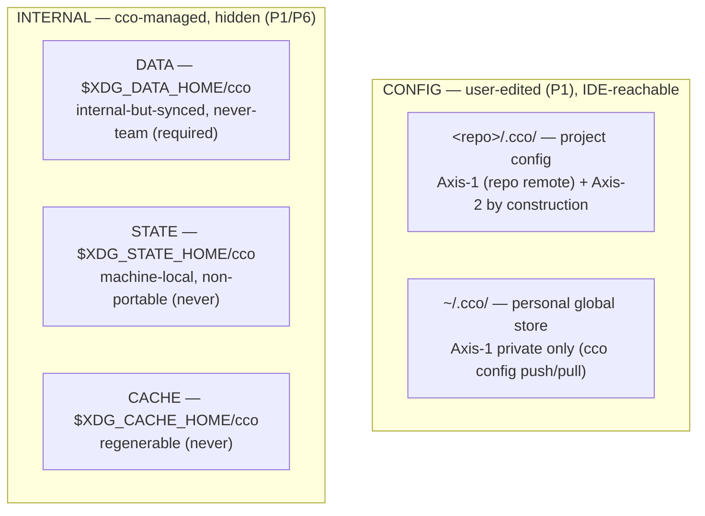

# M — Consolidated Design Handoff (post Cat-4): the end-state, ready to write into `design.md`

**Status**: Working draft for analysis **M** (consolidated resource taxonomy & mapping). Produced
2026-06-17 after the Cat-4 synthesis (ADR-0015), validated by the maintainer in session. This is the
**cross-ADR synthesis of the end-state** that does not yet exist as a single document — it is M's
starting scaffold, **not** a new decision. M validates it against P1–P12, turns it into the
authoritative `resource → (bucket, sync-profile)` table, **rewrites `design.md §2.1/2.2/2.3`**, fixes
conflicts C1–C4, and resolves the two remaining open placements (registry scope; DATA byte-level).

**Read first**: `guiding-principles.md` (P1–P12, source of truth). **Grounded in**: ADRs 0001–0015.
**Feeds**: the M ADR + the `design.md §2` rewrite. **Hands off**: S (sharing/resolve), T (transport/
state-sync), E (impl follow-ups).

> Nothing here overrides an ADR. Where this draft and an ADR disagree, the ADR wins and this draft is
> the defect to correct.

---

## 1. The three cardinal moves (why the model looks like it does)

1. **Config decentralizes** — project config → `<repo>/.cco/` (rides the repo remote); personal global
   config → `~/.cco/` (its own private git working tree). No central vault, no profile-branches.
2. **Internal centralizes, keyed-by-identity** — internal metadata **leaves** the config buckets and
   lives in hidden XDG dirs under `projects/<id>/…`, `packs/<name>/…`. This **dissolves the dual-axis
   leak**: internal data no longer rides the repo remote, so it cannot reach teammates (ADR-0013).
3. **Co-locate by sync-profile, not functional domain** — every datum (P11) is classified on
   `(nature × sync-profile)` and placed where that profile is expressible. Heterogeneous profiles in
   one file = **split signal** (how `.cco/meta` was broken up).

---

## 2. The 4-bucket taxonomy (3 → 4: DATA added by ADR-0015)



| Bucket | Path (default) | Override | Nature | Sync |
|---|---|---|---|---|
| CONFIG / repo | `<repo>/.cco/` | — | config | Axis-1 (repo remote) **+ Axis-2 by construction** |
| CONFIG / personal | `~/.cco/` | — | config | Axis-1 **private only** — never team |
| **DATA** ⭐ | `$XDG_DATA_HOME/cco` → `~/.local/share/cco` | `$CCO_DATA_HOME` | internal | **Axis-1 `required`, never team** |
| STATE | `$XDG_STATE_HOME/cco` → `~/.local/state/cco` | `$CCO_STATE_HOME` | internal | **`never`** |
| CACHE | `$XDG_CACHE_HOME/cco` → `~/.cache/cco` | `$CCO_CACHE_HOME` | internal | **`never`** |

DATA completes ADR-0007's XDG CONFIG/DATA/STATE/CACHE mapping (DATA was left unassigned). UX split:
**`~/.cco` = what you edit & version · `~/.local/share/cco` = internal but *portable*/synced ·
`state/`+`cache/` = plumbing you never sync.** Resolver rules (ADR-0007) apply to DATA too: host-side
only, anti-in-container guard, treat unset/empty/non-absolute XDG var as absent, `mkdir -p` `0700`.

---

## 3. Final directory structures (target — M finalizes byte-level)

**`<repo>/.cco/`** — project config, machine-agnostic (logical names only, **never real paths**):
```
<repo>/.cco/
  project.yml            # source of truth: repos[], extra_mounts[], packs:, llms: (by-name refs)
  secrets.env            # gitignored (secret values), IDE-reachable
  secrets.env.example    # committed
  claude/                # → overlaid :ro onto /workspace/.claude (the "synced" .claude scope)
    CLAUDE.md  rules/  agents/  skills/  settings.json
  mcp.json setup.sh mcp-packages.txt   # project config (H5 — confirm in M)
```
NO longer here (all internal → STATE/CACHE/DATA): `source`, `meta`, `base/`, `local-paths.yml`,
generated `docker-compose.yml`, `claude-state/`, `memory/`.

**`~/.cco/`** — personal global store (own git repo, authored-only, opt-in private remote):
```
~/.cco/
  .git/  .gitignore             # allowlist whitelist (explicit staging, never git add -A)
  packs/<name>/                 # hand-authored packs (pack.yml + .md)
  templates/                    # user project/pack templates
  global/.claude/               # global Claude config (CLAUDE.md, rules, agents, skills, settings, mcp.json)
  secrets.env(.example)         # global secrets, gitignored
  languages                     # ← the ONE config datum extracted from .cco/meta (D4); regenerates language.md
  setup.sh setup-build.sh mcp-packages.txt   # global (fixes C3)
  <coordinate registry?>        # ← config (P12); GLOBAL-vs-PER-PROJECT placement = OPEN (M, §7)
```
Changes vs prior drafts: `tags.yml` **moved out** → DATA (ADR-0015); `manifest.yml` **removed**
(ADR-0012); llms **content** is **not** here → CACHE; the `!tags.yml` allowlist (ADR-0008) is **dropped**.

**`$XDG_DATA_HOME/cco`** ⭐ — internal-but-synced, never-team (the 4th bucket):
```
~/.local/share/cco/
  tags.yml                       # per-user GLOBAL tag registry (ex-profiles)
  remotes                        # de-tokenized registry: name → url (Config Repo endpoints)
  projects/<id>/source           # install-provenance (url+ref), keyed-by-identity
  packs/<name>/source            # idem
  templates/<name>/source        # idem
```
OPEN (M): exact byte-level layout; `source` file format (standalone vs folded into a per-resource
record); registry **scope/namespacing** (shared with the coordinate-registry question, §7).

**`$XDG_STATE_HOME/cco`** — machine-local, non-portable; partitioned by sync-eligibility (ADR-0013 D2):
```
~/.local/state/cco/
  index                          # real host-absolute paths (subsumes @local + per-repo local-paths.yml), scan-rebuildable
  remotes-token                  # SECRET, isolated, never-sync (split from the DATA registry)
  last_seen / last_read          # global changelog trackers
  claude.json .credentials.json  # seeded auth
  sync-meta                      # sync-set membership + fingerprints (§4.6)
  projects/<id>/
    session/   memory/  claude-state/(transcripts)   # ← opt-in P8 (future state-sync)
    update/    meta(hashes, schema_version, policies, flags)  base/(3-way merge ancestors)  # ← never-sync
    docker-compose.yml  .tmp/
```
The `/session` (opt-in) vs `/update` (never) split is the **allowlist boundary** protecting the future
P8 sync from ever sweeping base/hashes/tokens.

**`$XDG_CACHE_HOME/cco`** — regenerable, never-sync:
```
~/.cache/cco/
  llms/<name>/        # llms content download (re-fetchable) + cache-state (etag, resolved_url, downloaded)
  installed/          # Config-Repo clones for install/update
  remote_cache        # remote HEAD + ts (avoids network on update checks)
  projects/<id>/.claude/   # generated overlays (packs.md, workspace.yml) → :ro into /workspace/.claude
  *.bak  dry-run/     # update artifacts
```

---

## 4. Consolidated resource → (bucket, mutator, sync)

"Mutator" applies the P1 edit-criterion (config = user via IDE; internal = `cco …` only).

| Resource | Bucket | Mutator | Sync |
|---|---|---|---|
| `project.yml`, `claude/`, `mcp.json`, `setup.sh`, `mcp-packages.txt` | `<repo>/.cco` | user (IDE) | repo remote (both axes) |
| project `secrets.env` | `<repo>/.cco` (gitignored) | user (IDE) | none (local) |
| `packs/`, `templates/`, `global/.claude/`, `languages`, global `setup*.sh` | `~/.cco` | user (IDE / config-editor agent) | `cco config push/pull` (private) |
| global `secrets.env` | `~/.cco` (gitignored) | user (IDE) | none (or private; confirm) |
| **coordinate registry** (referenced repos/llms `name→url`) | CONFIG (scope → M) | user (CLI as editor; value is user knowledge) | Axis-1 + **resolved-at-publish** (P12) |
| `tags.yml` | **DATA** | `cco tag add/rm` | `required` |
| `remotes` (`name→url`) | **DATA** | `cco remote add/...` | `required` |
| `source` (install-provenance) | **DATA** | cco (install/update) | `required` (travels with its resource; re-stripped at publish) |
| `index` (real paths) | STATE | cco (`resolve`/`index refresh`) | `never` |
| `base/` (merge ancestors) | STATE `/update` | cco (update) | `never` (version-tied) |
| `meta` (hashes, schema_version, policies, flags, changelog markers) | STATE `/update` | cco (update) | `never` |
| `remotes-token` | STATE | `cco remote set-token` | `never` (security) |
| `sync-meta`, seeded `claude.json`/`.credentials.json`, generated compose | STATE | cco | `never` |
| `memory/`, transcripts | STATE `/session` | Claude / cco | **`opt-in`** (P8 future) |
| llms **content**, cache-state | CACHE | cco (`llms install/update`) | `never` (re-fetch) |
| `installed/` clones, `remote_cache`, overlays, `.bak` | CACHE | cco | `never` |

---

## 5. Feature notes (end-state, pointers to ADRs)

- **Sync (ADR-0003/0007/0008)** — two orthogonal axes. Axis-1: `<repo>/.cco` via repo remote; `~/.cco`
  via `cco config push/pull`; DATA `required`; STATE `/session` opt-in (P8). Axis-2 (team): **always** a
  Config Repo (3rd repo as remote). Sync transports commits, never fabricates; pull non-ff → abort+notify.
  **Transport ∩ P8 (ADR-0015 D6, owned by T)**: one git engine may serve DATA + STATE-`/session` +
  `~/.cco`, with a **per-store sync-class allowlist** (DATA=required · session=opt-in · update/token=never
  · `~/.cco`=required) and separate dirs.
- **Update / merge (ADR-0006/0013)** — `cco update` = migrations (schema_version) + discovery (framework
  defaults via 3-way merge with `base/`; remote source via `source` + `remote_cache`) + changelog. Three
  change classes: additive (`changelog.yml`) · opinionated (`defaults/global/`, `--diff/--sync`) · breaking
  (migration scripts, idempotent, per scope). H6 refactor: STATE paths into the merge functions.
- **Sharing (ADR-0012, → S)** — team-sharing only via Config Repo; `~/.cco` private-only; `manifest.yml`
  **removed** → structure-based discovery (`ls templates/*/`, `ls packs/*/`); **resolve-at-boundary** at
  publish (inject referenced coordinates; re-strip internal `source`).
- **Tags (ADR-0010/0011/0015)** — profiles removed → per-user tags, CLI-canonical, internal; registry in
  **DATA**; never-team (never in `pack.yml`/`project.yml`/index → no publish leak).
- **Memory (ADR-0009)** — `memory/` + transcripts = STATE, **no sync v1** (the old "vault-tracked, syncs
  across machines" promise disappears — fix docs incl. the managed `memory-policy.md` baked in image).
- **Referenced-resource coordinates (ADR-0014, → S)** — reference **by-name**; coordinate `name→url`
  (+variant/ref) = **config** (P12), stored once (DRY), synced + resolved-at-publish; **local-path** =
  internal-local (STATE index); llms **content** = CACHE. ⚠️ **Disambiguation**: the *coordinate registry*
  (referenced resources, **team-shared → config**) is **distinct** from the *remotes registry* (Config-Repo
  endpoints, **never-team → DATA**) — same `name→url` shape, opposite axis-2 → opposite bucket.

---

## 6. Legacy → new **migration fan-out map** (maintainer note, 2026-06-17)

The migration from the centralized model is a **fan-out**, not a move: **one** legacy file/container maps
to **N** destinations across CONFIG/DATA/STATE/CACHE, splitting previously-unified files. The **map** is a
derived view of M's authoritative table (target spec); the **mechanism** is the lazy `cco migrate <project>`
from the Phase-3 backup (ADR-0006), implemented in `design.md §9` / phases / migration scripts (E).

| Legacy (centralized) | New destination(s) — fan-out |
|---|---|
| `user-config/projects/<name>/` (config + state mixed) | config → `<repo>/.cco/` · compose/claude-state/meta/base → STATE `projects/<id>/` · `source` → DATA |
| `.cco/meta` (grab-bag) | hashes/schema/policies/flags → **STATE `/update`** · `languages` → **`~/.cco`** (config) · `remote_cache` → **CACHE** · changelog markers → **STATE** |
| `.cco/base/` | **STATE `/update`** (`never`; H6 path remap) |
| `.cco/source` | **DATA** `…/source`, keyed-by-identity (`required`) |
| `remotes` (url + token) | **split**: `name→url` → **DATA** registry · token → **STATE** `remotes-token` |
| profiles (vault git-branches) | **DATA** `tags.yml` (each profile → a tag seed; CLI prompt) |
| `~/.cco/manifest.yml` | **removed** (no target; Phase-3 cleanup) |
| `pack-manifest` | **removed** (no migrator) |
| `memory/` (vault-tracked) | **STATE `/session`** `projects/<id>/memory/` (no sync) |
| `claude-state/` (transcripts) | **STATE `/session`** |
| `@local` + per-repo `local-paths.yml` | **STATE `index`** (host-absolute, scan-rebuildable) |
| llms (content + url/variant) | content → **CACHE** · coordinate (`url`+`variant`) → **config** coordinate registry |

Migration invariants: lossless (capture active-profile uncommitted WIP); idempotent; the backup flattens
profile-branches → plain layout before fan-out (no branch traversal at migrate time).

---

## 7. M — what to produce (scope), conflicts to fix, open decisions

**Produce**: (1) THE authoritative, exhaustive `resource → (destination, sync-profile)` table;
(2) **rewrite `design.md §2.1/2.2/2.3`** as a **4-bucket** layout (the trees in §3 here); (3) the
**legacy→new fan-out map** (§6) folded into the canonical table; (4) validate the whole design against
**P1–P12** and fix conflicts; (5) record the M ADR (next free = **0016**).

**Conflicts to fix (from grounding)**:
- **C1** — `design.md:136` `backups/` under `~/.cco` → **STATE**.
- **C2** — ADR-0007 `llms/ → CACHE` refined by ADR-0014: only llms **content** → CACHE; **coordinate** → config.
- **C3** — `design.md §2.3` `~/.cco` tree incomplete (missing global `secrets.env`, `setup.sh`,
  `setup-build.sh`, `mcp-packages.txt`); **`manifest.yml` must NOT appear** (removed). Add `languages`;
  **move `tags.yml` OUT** to DATA.
- **C4** — `.cco/source` / pack `.cco/meta` inside config buckets violate P6 → resolved by ADR-0013
  (internal out, centralized); reflect in the trees.

**Open decisions M must settle**:
1. **Coordinate registry scope/namespacing** — global (`~/.cco`) vs per-project vs a section in
   `project.yml`; name namespacing across repos + llms (ADR-0014 open). Shared with where the canonical
   `name→url` physically lives.
2. **DATA byte-level layout** — `tags.yml` / `remotes` format; `source` standalone-vs-folded; the
   `projects|packs|templates/<id>/` keying.
3. **`source` sync direction confirm** — `required` is fixed (ADR-0015); confirm no machine-specific datum
   leaks into it (it must carry upstream `url+ref` only, never a local path/hash).

**Also absorbs**: review follow-ups H5 (project-config inventory: mcp.json/setup.sh/mcp-packages.txt/
`.cco/managed`) and H6 (merge-engine STATE path remap) and M3.

**NOT in M (hand-off)**: S (manifest-removal structure-based discovery, publish-boundary resolution,
repo-URL persistence/Axis-1 gap, `llms:`/`repos:` schema + migration, no-token-leak check, A4 fallback,
Axis-1 public-repo); T (unified transport, R-state-sync, background auto-sync); E (impl-time follow-ups).
These are derivable from what is already fixed — mostly implementation detail / secondary features.

---

## 8. Method reminder (P10/P11 + ADR-0014 lens)

Classify each datum from **role + problem + how-mutated**, never surface/path. Decompose files into
constituent data; classify on `resource-type × sharing-sync-profile`; apply P6 (team-shared ⇒ not
internal) and DRY as discriminators; heterogeneous profiles = split; resolve at the boundary, don't
duplicate. Maintainer confirmation on UX/sync-strategy choices. Record the ADR + propagate to living docs.
