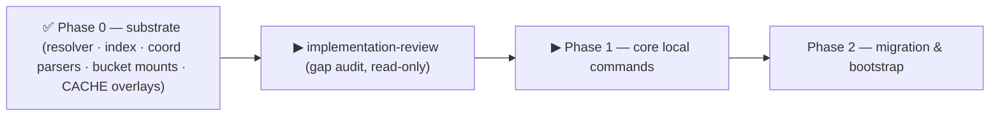

# P1 — Phase-1 launch handoff (core local commands)

**Purpose.** Launch **Phase 1 (core local commands)** in a fresh, clean session, now that **Phase 0
(substrate) is CLOSED** (`7dcf1e8`, suite 995/2 delta-green). Phase 1 builds the first command layer that
**consumes** the P0 substrate (the XDG 4-bucket resolver, the STATE index, the final `yaml.sh` coordinate
parsers). This file is self-contained: working method, source-of-truth, mandatory preliminary analysis,
scope with exact symbols, invariants, test contracts, and what comes after. Produced 2026-06-21 on
`feat/vault/decentralized-config` (commits **local** — the maintainer pushes from the Mac).

> **Adherence audit DONE (2026-06-21)** — `reviews/21-06-2026-impl-adherence-review.md` (first run of
> `implementation-review-handoff.md`). Result: P0 substrate **conformant**, delta-green re-confirmed live
> **995/2**, Transitional Registry **fully intact**, **0 🔴 code bugs**. **One test-infra blocker for P1
> test-writing → HITL-1**: the runner `( set -e; fn )` **masks all non-final assertion failures**, and the
> `[[ … ]] || fail` idiom (used in the new `test_index.sh`/`test_paths.sh`) masks **just as much** as bare
> `assert_*` — only `… || return 1` reliably aborts. **Resolve HITL-1 BEFORE authoring the P1 tests** (see
> §5) so `test_sync.sh`/resolve/fingerprint/aggregator contracts are real, not masked. Recommended fix
> (maintainer's call): make `_run_test` treat a captured `ASSERTION FAILED` sentinel as a failure regardless
> of exit code (one line, zero test churn). HITL-2 (low): `remotes-token` 0600 mode is unasserted.

---

## 0. Working method (read first — applies to P1 and every later phase)

Unchanged from `Y-handoff-implementation.md` §1–§2 (the master). In brief:
- **`design.md` + `guiding-principles.md` + the ADRs are the SOURCE OF TRUTH.** Derive every choice from
  them; the more specific/authoritative wins; record any reconciliation.
- **Build every module ONCE, in its final form** (dependency + reuse + open-closed). Implementation order
  ≠ design chronology.
- **Green-per-phase = DELTA-based.** After each commit the FAIL set must be **exactly the 2 known baseline
  failures** (§4). Run the FULL `CCO_ALLOW_HOST_RESOLVE=1 ./bin/test` **before and after** — a clean caller
  map can miss side-effect consumers (the §5 lesson).
- **Code-ground every claim** (re-read; line numbers drift; map writers/readers/consumers **incl. tests**).
- **If implementation reveals a genuine design/sequencing gap, PAUSE and discuss** (workflow rule).
  Decisions affecting **how the toolkit is used** (UX/interface/placement/sync) need **maintainer
  confirmation** (P10 method-lesson b) — use `AskUserQuestion`, present options + a spec-grounded
  recommendation, persist the decision.
- **bash 3.2 / macOS `/bin/bash`**: no `declare -A`; guard empty arrays under `set -u`
  (`${arr[@]+"${arr[@]}"}`); awk for parsing.
- **Doc lifecycle**: P1 is code + tests + (only on a decision change) design/ADRs. Shipped-behavior docs
  ride the **P3** cutover sweep — never rewrite them ahead of the code.
- **Atomic local commits**, conventional-commit messages ending with the `Co-Authored-By` trailer.

## 1. Source of truth for P1

- **`design.md`** — **§4 (Sync = Copy)** in full: §4.1 model (synced set = `project.yml` + `claude/**`
  [+ `secrets.env.example`]; **never** `secrets.env` / repo-root `.claude/` / system dirs), §4.2 the **4
  command forms** + flags (`--dry-run` / `--auto-approve` / `--check`), §4.3 behavior (resolve → truthful
  diff → confirm → copy), §4.4 `cco start` source selection + **the ordered H1 sequence**, §4.6 **sync-state
  tracking + the fingerprint contract**. **§3** (machine-agnostic config + the STATE index). **§9 Phase 1**
  (the scope bullet). **§11 row 1** (the Phase-1 test contract). **§5** (`@local` now index-backed — reused).
- **ADRs** — **0008** (sync-as-copy; reminders transport already-made commits, never fabricate; pull
  non-ff → abort); **0017 D2** (`cco resolve --scan` absorbs the retired `cco index refresh`; `cco start
  --from` Case-C precedence `--from` > `entry` > prompt; unresolved → explicit prompt); **0022 D3** (`--scan`
  non-destructive merge-upsert, AD5 keep-existing, no `--prune`) **+ F39** (fingerprint: hash over the §4.1
  set, write post-receive + source-side, lazy read-time compare, no-fingerprint = pristine); **0023 D1–D3**
  (`cco config` vs `cco project` namespace; `cco project validate` contract; `cco project add <res>` +
  `--path` embed-at-add). **Principles**: **P3** (two orthogonal sync axes), **P7** (sync mechanics),
  **P14** (reachability layered, never hard-block).

## 2. Context to load (reading order)

1. §0 above. 2. `guiding-principles.md` (P1–P17). 3. `Y-handoff-implementation.md` (master: method + full
P0–P5 map + invariants + the v1 command surface + the deferred list). 4. The **adherence-review report**
just produced (gap state). 5. `design.md` §3 / §4 / §9 P1 / §11 row 1. 6. ADRs 0008/0017/0022/0023.
7. Personal progress note `decentralized-config-impl-progress.md`. 8. The P0 code P1 builds on:
`lib/index.sh` (STATE index API), `lib/yaml.sh` (coordinate parsers), `lib/paths.sh` (buckets),
`lib/local-paths.sh` (the **transitional** @local plumbing — see §6, do **not** delete here).

## 3. Mandatory preliminary analysis (before writing code)

1. **Confirm baseline green-as-expected.** `git status` clean on `feat/vault/decentralized-config`; run the
   FULL `CCO_ALLOW_HOST_RESOLVE=1 ./bin/test` → **995 passed / 2 failed** (§4). A third failure ⇒ stop.
2. **Read the actual current code** (line numbers drift):
   - `bin/cco` dispatcher — there is **no** top-level `cco sync` / `cco resolve` / `cco path` yet (only
     **`cco project resolve`**, the legacy local-path resolver). Decide the new dispatch entries.
   - `lib/index.sh` — the STATE index API (`_index_set_path`, `_index_get_path`, `_index_path_conflicts`
     for AD5, project→members). `cco resolve`/`--scan`/`cco path` are thin command wrappers over it.
   - `lib/yaml.sh` — the coordinate parsers (`yml_get_repo_coords`/`yml_get_mount_coords`/
     `yml_get_pack_coords`, `yml_get_llms` with url). Clone-from-`url` reads the coordinate.
   - `lib/local-paths.sh` — the schema bridge (`_effective_repo_mounts`/`_effective_extra_mounts`,
     `_resolve_entry_index`) + the **kept-transitional** @local plumbing. Reuse the bridge; do not delete it.
   - `lib/cmd-start.sh` — where the H1 ordered sequence + the unresolved prompt + the divergence notice +
     `--from` selection are wired (the reminder aggregator plugs in **after** member resolution).
   - The legacy reminder/divergence logic (`lib/cmd-vault.sh`, `lib/local-paths.sh`) — model the new
     non-blocking aggregator on the design (do not resurrect vault-specific behavior).
3. **Map the full consumer set incl. tests.** `grep -rn` the new command names + `cco project resolve`
   call-sites; identify which existing tests touch resolution/divergence so the new tests slot in cleanly.
4. **Confirm the invariants (§5) + the delta-green contract before the first edit.**

## 4. The 2 known baseline failures — DO NOT re-investigate

- `test_update / test_update_migrations_run_in_order` — stale `schema_version` → rewritten in **P2**.
- `test_llms / test_resolve_name_from_full_variant_url` — stale name-derivation → rewritten in **P4–P5**.

Delta-green = after each P1 commit the FAIL set is exactly these two. A third failure = a regression.

## 5. P1 — scope (confirm against the code you just read)

Build the first command layer on the P0 substrate. Final form, no merge engine, no legacy resurrection.

- **`lib/cmd-sync.sh` (NEW) — `cco sync` (sync = copy).** The **4 forms** (§4.2: positional = target,
  `--from` = source, default source = cwd): `cco sync` · `cco sync <repo>` · `cco sync --from <repo>` ·
  `cco sync <repoA> --from <repoB>`. Behavior (§4.3): resolve source+targets via the index → **truthful
  diff** (plain diff, machine-agnostic content) → if no diff, no-op exit 0 → else show diff + **confirm**
  (unless `--auto-approve`) → **filesystem copy** of the §4.1 synced set into each target. Flags
  `--dry-run` / `--auto-approve` / `--check` (exit-code only). **Synced set = `project.yml` + `claude/**`
  [+ `secrets.env.example`]; NEVER `secrets.env`, repo-root `.claude/`, system dirs.** No 3-way merge, no
  sync-base, no commit-time. Print which repos changed (the user commits with normal git).
- **`cco resolve` / `cco path` (NEW) — index-backed resolution.** `cco resolve` materializes the index for
  the current project's members (clone-from-`url` when the coordinate carries one; prompt/skip per ADR-0017
  D2 / §4.4). **`cco resolve --scan`** = non-destructive **merge-upsert** (ADR-0022 D3): scan for member
  repos, add/refresh name→path bindings, **preserve out-of-`<dir>` entries + `cco path set` overrides**,
  **AD5 conflict ⇒ keep existing**, **no `--prune`**. `cco path set <name> <abs>` / `cco path list` — direct
  index edits. (`--scan` absorbs the retired `cco index refresh`.)
- **Non-blocking reminder aggregator (NEW) — ADR-0008.** One surface emitting non-blocking reminders:
  (a) uncommitted `~/.cco`; (b) uncommitted involved `<repo>/.cco`; (c) cross-repo divergence (consuming the
  §4.6 sync-state). **H1 invariant**: all reminders fire **after** member resolution (never against an empty
  index). Shared by `cco start` (the §4.4 ordered sequence) and `cco sync`.
- **Sync-state tracking + fingerprint (NEW) — §4.6 / ADR-0022 F39.** Per-machine STATE bookkeeping (never
  committed): which members carry a synced copy vs code-only / divergent; a **last-synced fingerprint** per
  repo = hash over the §4.1 synced set, **written after a repo receives a sync (target) + for the source at
  the same `cco sync`**; divergence is **lazy/read-time** (current hash ≠ stored ⇒ edited-locally);
  **no stored fingerprint ⇒ pristine, never divergent**. Drives (c) above and `cco sync`/`cco join` target
  selection. (Hash algorithm + rollback richness are impl details — FR-Y-S6.)
- **`cco project add repo|mount|llms|pack` + `--path` + `cco project validate` / `coords` (NEW, generic) —
  ADR-0023 D1–D3.** Built **generically on the P0 index/coordinate substrate**: `add` embeds the coordinate
  in the manifest (url-from-origin) and, with one-shot `--path`, also writes the index binding;
  `cco project validate` is the **share-readiness** check (cwd-first, exit 0/1/2, presence-only +
  `--reachable`, detect-only, machine-agnostic, ERE); `cco project coords --diff [--sync --from]`.
  The **pack-resolution backend** is **deferred to P4/P5** (ADR-0022/F15 — generic loop now, backend later);
  the **`cco config validate` orphan-prune** is **P5**.
- **Wire `cco start --from` + the ordered H1 sequence (§4.4).** Source precedence `--from` > `entry` >
  prompt; unresolved member/mount → explicit **[r]esolve / [c]lone `<url>` / [s]kip** prompt (F49, never a
  silent empty mount); source-transparency line + passive ⚠ badge (P14).
- **Tests (§11 row 1):** NEW `test_sync.sh` (copy semantics, 4 forms, confirm, the never-sync exclusions);
  `cco resolve` incl. clone-from-`url` + `--scan` upsert (preserves out-of-dir + `path set`; AD5
  keep-existing; no `--prune`); **sync-meta fingerprint** (write post-receive + source-side, lazy compare,
  no-fp = pristine); **reminder aggregator (a/b/c) + H1 ordering** (resolve before notices). **Mask-safe
  assertions (HITL-1, 2026-06-21 audit):** under the runner `( set -e; fn )`, **both** bare `assert_*`
  **and** `[[ … ]] || fail "msg"` swallow non-final failures — only `… || return 1` aborts the test fn. Write
  every multi-assert P1 test with `… || return 1` (or land HITL-1's runner-side sentinel fix first); after
  writing, re-run the full suite to surface anything the masking was hiding.

## 6. Invariants (never violate)

- **H1 — resolution before notices/divergence.** Any cross-repo divergence check or reminder is computed
  **after** member resolution, never against an unresolved/empty index. Shared by `cco start`/`cco sync`/
  the aggregator.
- **AD3 / G8** — no real path ever enters committed config; `project.yml` carries **logical names +
  coordinates only**; the **STATE index** holds the machine-local paths; `git diff` on `.cco/` stays
  truthful.
- **P7 sync mechanics** — sync **copies already-made commits, never fabricates them**; no per-command
  network sync; `cco config push/pull` is **P3** (not P1); a non-fast-forward pull aborts + notifies.
- **Synced-set boundary (§4.1)** — `cco sync` copies only `project.yml` + `claude/**` [+
  `secrets.env.example`]; it **never** touches `secrets.env`, repo-root `.claude/`, or system dirs.
- **P14 reachability** — resolution/validation surfaces are **layered + non-blocking**; `cco project
  validate` is exit-code-only and never the git push path.
- **Do NOT undo the transitional choices** — Commit A's schema-bridge + kept @local plumbing in
  `local-paths.sh`, Commit B's dual-seed + kept legacy `CCO_*_DIR`. They die in **P3/P4** by design;
  deleting early re-breaks delta-green. (See the Transitional Registry in `implementation-review-handoff.md`
  §4.)
- **compose↔entrypoint container-path contract** + **host-side resolver guard (H4)** remain intact.

## 7. Explicitly NOT in P1 (deferred — do not build here)

`cco config save/push/pull` + allowlist staging (**P3**); the legacy cutover — delete `cco vault *` /
`cco project create` / sanitize-extract-restore (**P3**); the **pack-resolution backend** (3-layer
resolver, **P4/P5**); `cco config validate` orphan-prune (**P5**); `source`→DATA relocation (**P4**);
merge-engine paths → STATE (**P2**); `cco tag`/`cco list --tag` (**P3**). See `Y-handoff-implementation.md`
§6 for the full deferred list.

## 8. After P1 — proceeding

Phase 1 delivers the command layer that P2 consumes. Next: **Phase 2 — migration & bootstrap** (J0 four-root
bootstrap; `cco init --migrate`; **T5 lands here** — merge-engine `.cco/base`+`.cco/meta` → STATE `/update`,
H6 + global-meta decompose; the P2 migration writes the complete final `project.yml` in one pass). Re-read
the spec, run the same delta-green loop, dedicate a **clean session**, and **pause + maintainer-confirm**
any UX/interface/placement decision. Consider an **adherence audit**
(`implementation-review-handoff.md`) at the P1→P2 boundary.
