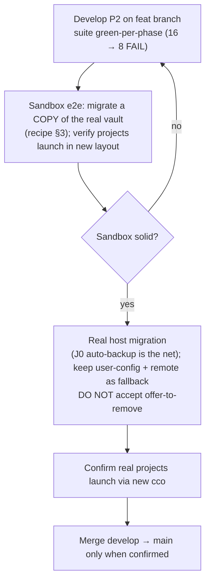

# P2 — Developer Pre-Release Validation (dogfooding) & Legacy-Vault Fate

**Purpose.** Phase 2 is the **breaking cutover** that migrates the maintainer's own
working config from the legacy central vault (`user-config/`) to the decentralized
layout (`<repo>/.cco/` + `~/.cco` + DATA/STATE/CACHE). The maintainer develops this on
`feat/vault/decentralized-config` and must be able to **test the migration end-to-end
before merging to `main`** without ever risking the live config that launches their
real projects. This doc captures the validation workflow and the legacy-vault fate.
Decided 2026-06-22 (Phase-2 preliminary analysis); grounded in **ADR-0006** (breaking
cutover / lazy migration / raw-tar backup), **ADR-0007/0008** (`~/.cco` fresh git store,
remote opt-in), and the env-var root resolution in `bin/cco:32–46`.

> Audience: the maintainer (and any future cco developer dogfooding a breaking phase).
> This is **dev process**, not a shipped feature.

---

## 1. Legacy-vault fate (confirmed, no design change)

The migration does **not** transplant the old vault's git history into `~/.cco`.

- **`~/.cco` is git-init'd fresh** (J0 / ADR-0008) — a brand-new, empty/authored store.
- **The legacy vault (`user-config/`, with its `.git` and its remote) stays intact on
  disk** — the migration *reads from a backup copy*, never mutates `user-config/`.
- **A raw-tar backup** (`<state>/cco/backups/vault-<date>.tar.gz`, `0600`, STATE) captures
  the whole vault (incl. `.git` + `profile-state/<branch>/` shadows + all profiles'
  secrets) — a second, independent backup (ADR-0006 Decision 2).
- The old vault is removed **only** on explicit user opt-in, **after** a verified backup
  (M8). Default: it stays as an additional fallback.

**Net redundancy**: original `user-config/` + its remote + the raw-tar archive. The new
system re-initializes new repos — exactly the clean-replace model.

### Nuance — the remote is NOT carried over
The legacy vault had a git **remote** (private, for multi-PC sync of `user-config/`).
The new `~/.cco` gets its **own opt-in remote**, configured via `cco config push/pull`,
which is **Phase 3**, not Phase 2. So during P2 alone, `~/.cco` is **locally versioned,
no remote**; the old remote stays attached to the old `user-config/` (extra remote
backup) and is not auto-migrated.

### Open item for Design — global/packs/templates migration into `~/.cco`
`design.md` §9 P2 details the **per-project** migrate and the `.cco/meta` decompose, but
is light on **how the legacy global config (`global/.claude`: agents/rules/skills/
settings) + authored packs + templates** move into `~/.cco`. A fresh `cco init` copies
the framework **defaults**, not the maintainer's customizations. P2 Design must define
this (candidate: a global mode of `cco init --migrate` that copies `global/.claude` +
`packs/` + `templates/` from the backup into `~/.cco`, profile→tag at read time per
ADR-0010). Tracked so the maintainer's personal global config is **not lost** in cutover.

---

## 2. Why a sandbox is needed

Once the **new** cco runs on the host, `cco start <project>` uses cwd-first/decentralized
resolution (P2 replaces `_start_resolve_project`) and will **not** find projects in the
old `$PROJECTS_DIR/<name>` layout until each is migrated. Meanwhile the **old** cco (on
`main`/`develop`) keeps working against `user-config/`.

By design the migration is **non-destructive** (lazy, reads from backup, never mutates
`user-config/`; J0's first-run vault backup is a copy; nothing auto-deletes). The only
real loss risk is accepting the **offer-to-remove** before validating. So:

> **Rule: never accept the legacy-vault offer-to-remove until the feature is merged to
> `main` and the new flow is confirmed working.**

For repeatable e2e testing, isolate everything in a throwaway sandbox so the real
`~/.cco`, the real DATA/STATE/CACHE, and the real `user-config/` are never touched.

---

## 3. Sandbox recipe

`bin/cco` resolves every root from env vars (`bin/cco:32–46` + the XDG resolver in
`lib/paths.sh`). Point them at throwaway dirs and feed a **copy** of the real vault:

```bash
# Test shell on the HOST (macOS/Linux), on feat/vault/decentralized-config:
export CCO_USER_CONFIG_DIR=/tmp/cco-dogfood/user-config   # COPY of the real vault
export CCO_DATA_HOME=/tmp/cco-dogfood/data
export CCO_STATE_HOME=/tmp/cco-dogfood/state
export CCO_CACHE_HOME=/tmp/cco-dogfood/cache
export HOME=/tmp/cco-dogfood/home          # isolates ~/.cco -> /tmp/cco-dogfood/home/.cco

cp -a /real/path/user-config /tmp/cco-dogfood/user-config   # realistic data
./bin/cco init --migrate <project>          # exercise migration on a copy
```

**Notes**
- `~/.cco` has **no dedicated override** (`= $HOME/.cco`, by ADR-0007 design — the
  non-overridable dotdir). To isolate it you **must** override `HOME` — the same
  HOME-flip the test harness already uses (Commit B). Alternatively accept the real
  `~/.cco` being created (it is **new and harmless** — it does not collide with the
  legacy `user-config/`), but the clean sandbox is safer for repeated runs.
- `CCO_ALLOW_HOST_RESOLVE=1` is **not** needed on the host (the H4 guard only fires
  inside a container); it is the test-suite hatch.
- Self-development caveat: this session runs **inside a container**; build/run changes
  are tested on the **host** (`exit` → `cco build && cco start`). The sandbox lives on
  the host.

---

## 4. Validation sequence



1. **Develop** P2 on the branch; suite green-per-phase (the FAIL set shrinks 16 → 8 as
   the owned `test_update_*`/`test_migration_005` tests are rewritten).
2. **Sandbox e2e** (recipe §3): migrate a copy of the real vault; verify projects launch
   in the new decentralized layout; iterate.
3. **Real host migration** only after the sandbox is solid: J0's automatic vault backup
   is the safety net; keep `user-config/` + its remote as fallback; **do not** accept the
   offer-to-remove.
4. **Merge** `develop` → `main` only when the real flow is confirmed (ADR-0006 Decision 5).

---

## 5. Possible convenience (evaluate in Design, not a blocker)

A `cco init --migrate --dry-run` (preview the would-be `<repo>/.cco/` without writing,
no index registration) would make step 2 more ergonomic and lower the stakes of a real
run. Weigh against v1 scope; the sandbox already covers the need.
