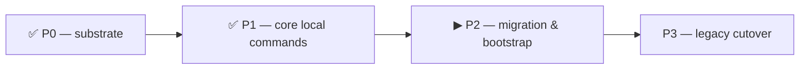

# P2 — Phase-2 launch handoff (migration & bootstrap)

**Purpose.** Launch **Phase 2 (migration & bootstrap)** in a fresh, clean session, now that **Phase 1
(core local commands) is CLOSED** (`56ca45c`→`e48abdd`, suite 1043/16 delta-green). Phase 2 is the phase
that **writes the complete final decentralized config once**: it bootstraps the four buckets, backs up
the legacy vault, and migrates each project into `<repo>/.cco/` in one pass — and it relocates the
update-engine artifacts (`.cco/base`/`.cco/meta`) into STATE. This file is self-contained: working
method, source-of-truth, mandatory preliminary analysis, scope with exact symbols, invariants, test
contracts, and what comes after. Produced 2026-06-22 on `feat/vault/decentralized-config` (commits
**local** — the maintainer pushes from the Mac).

> **Phase 1 recap.** 6 atomic commits, every one full-suite delta-green = the re-baselined 16. Built
> `cco resolve`/`cco path` (index-backed, `--scan` non-destructive upsert, clone-from-`url`), the
> sync-meta fingerprint (§4.6/F39), the non-blocking reminder aggregator (ADR-0008, H1), `cco sync`
> (4 forms, copy, never-sync exclusions), the `cco start` aggregator hook (H1), and `cco project add`
> (embed-at-add + one-shot `--path`). **3 maintainer scope-forks** were taken (deviating from the
> P1-handoff literal *toward* design §9/§11, the source of truth) and **two of them hand work to P2**:
> - the **D-start source-selection** (`cco start --from` / Case-C precedence / divergence notice /
>   source-transparency line + passive ⚠ badge, §4.4) was **re-sequenced to P2** — it is coupled to how
>   `cco start` finds the project (central by-name → decentralized cwd-first), which **this phase
>   introduces**, so it is built once here against the final layout;
> - the legacy `cco project resolve` / `cco project validate <name>` / `cco project add-pack` (central
>   `$PROJECTS_DIR` layout) were **kept intact, superseded → removed at P3**.

---

## 0. Working method (read first — applies to P2 and every later phase)

Unchanged from `Y-handoff-implementation.md` §1–§2 (the master). In brief:
- **`design.md` + `guiding-principles.md` + the ADRs are the SOURCE OF TRUTH.** Derive every choice from
  them; the more specific/authoritative wins; record any reconciliation. **Where the per-phase handoff
  and the living design diverge, design §9/§11 + the ADRs win** (the P1 cycle confirmed this three
  times — see the scope-forks above).
- **Build every module ONCE, in its final form** (dependency + reuse + open-closed). The P2 migration
  writes the **complete final `project.yml` in one pass** so no file is ever schema-migrated twice.
- **Green-per-phase = DELTA-based, but the target EVOLVES in P2.** Unlike P1 (which owned none of the 16
  known failures, so the count stayed flat), **P2 OWNS 8 of the 16** (the `test_update_*` +
  `test_migration_005` set — §4). As you rewrite them they turn ❌→✅, so the FAIL set **shrinks from 16
  toward 8** (the remaining 5 P3 + 3 P4–5). Run the FULL `CCO_ALLOW_HOST_RESOLVE=1 ./bin/test`
  **before and after** every commit; a *new* red outside the owned set is a regression — stop.
- **Code-ground every claim** (re-read; line numbers drift; map writers/readers/consumers **incl. tests**).
- **If implementation reveals a genuine design/sequencing gap, PAUSE and discuss** (workflow rule).
  Decisions affecting **how the toolkit is used** (UX/interface/placement/sync) need **maintainer
  confirmation** (P10 method-lesson b) — use `AskUserQuestion`, present options + a spec-grounded
  recommendation, persist the decision. *(P1 used this pattern at every fork — keep it.)*
- **Write every test mask-safe**: the runner now catches the `ASSERTION FAILED` sentinel (HITL-1), but
  prefer `… || return 1` too so a mid-test failure aborts the function.
- **bash 3.2 / macOS `/bin/bash`**: no `declare -A`; guard empty arrays under `set -u`
  (`${arr[@]+"${arr[@]}"}`); awk for parsing.
- **Doc lifecycle**: P2 is code + tests + (only on a decision change) design/ADRs. Shipped-behavior docs
  (README, guides, the ~43-occurrence "Config Repo"→"sharing repo" sweep, the `_archive/` move) ride the
  **P3** cutover sweep — never rewrite them ahead of the code. The driver is
  `resource-coherence-inventory.md`.
- **Atomic local commits**, conventional-commit messages ending with the `Co-Authored-By` trailer.

## 1. Source of truth for P2

- **`design.md`** — **§9 Phase 2** in full (the scope spine), **§11 row 2** (the Phase-2 test contract),
  **§2.2** (the internal buckets + the global STATE `/update` home pinned here), **§3** (the index the
  migration populates), **§4.4** (the `cco start` ordered sequence — the deferred D-start work lands
  here). **§7/§9 Phase 3** for the boundary (what P2 must *not* delete yet).
- **ADRs** — **0021** (resource lifecycle: `cco init --migrate [--sync]` is the entry verb — top-level
  `cco migrate` was dropped; `cco forget`; F59 delete-cascade is P5 not here); **0017 D3** (J0 bootstraps
  **all four** roots incl. DATA on **any** command, per-root idempotent M6); **0006** (backup = raw tar
  of the whole vault incl. `.git` + `profile-state/` shadows → captures *all* profiles' secrets;
  marker + archive-authoritative F43; atomic-staged F44; backup-verified-before-read M8);
  **0009** (memory → machine-local STATE `<state>/cco/projects/<id>/memory/`; non-clobber on re-run
  F11); **0010** (profile→tag prompt, lossless, both branches; F42 profile-selection accepted-regression);
  **0013 D4** (global `.cco/meta` **decompose**, not relocate); **0016 D5/D6** (base/meta → STATE keyed
  by identity, H6 — re-sequenced here from P0; merge *logic* unchanged); **0022 D1** (the `source`→DATA
  relocation is **P4, NOT here** — the migrator reads provenance **in place**; D2 index global-flat;
  forward-annotated for P4); **0012** (the `manifest:` meta marker is dropped). **Principles**: **P15/F37**
  (never fabricate a coordinate; cache-iff-coordinate), **H6/H7**, **AD3/G8** (no real path in committed
  config), **AD12** (breaking cutover, new layout only).

## 2. Context to load (reading order)

1. §0 above. 2. `guiding-principles.md` (P1–P17). 3. `Y-handoff-implementation.md` (master: method + full
P0–P5 map + invariants + the v1 command surface + the deferred list). 4. **The recurring
`implementation-review-handoff.md`** + decide whether to run a light P1→P2 adherence audit first (§3).
5. `design.md` §9 P2 / §11 row 2 / §2.2 / §3 / §4.4. 6. ADRs 0021/0017/0006/0009/0010/0013/0016/0022/0012.
7. Personal progress note `decentralized-config-impl-progress.md` (the live cursor). 8. The code P2
rewrites/relocates: `lib/cmd-init.sh` (current `cco init`), `lib/cmd-vault.sh` (vault init + the raw-tar
backup machinery the migrate-reader reuses), `lib/update*.sh` + `lib/paths.sh` (the `.cco/base`/`.cco/meta`
artifact homes to re-point — `update-hash-io.sh`, `update-meta.sh`, and the `_cco_project_*` helpers),
`lib/cmd-start.sh` (where the deferred D-start source-selection wires in, on top of the P1 aggregator
hook), `lib/cmd-resolve.sh` (the index/membership the migration + `cco join` populate), `migrations/`
(existing `global`/`project` scopes; `pack`/`template` to be created).

## 3. Mandatory preliminary analysis (before writing code)

1. **Confirm baseline green-as-expected.** `git status` clean on `feat/vault/decentralized-config`; run
   the FULL `CCO_ALLOW_HOST_RESOLVE=1 ./bin/test` → **1043 passed / 16 failed** (the P1 end-state). A
   *different* failure set ⇒ stop and reconcile.
2. **Decide the adherence audit (maintainer steer 2026-06-22: a fresh full cycle is NOT required because
   P1 was built delta-green with maintainer-confirmed forks at every interface point and self-caught its
   own issues — the trap bug, the masking).** **Recommendation: run a LIGHT, read-only P1 adherence pass**
   via the recurring `implementation-review-handoff.md` playbook **as the first step of this session**
   (a fresh-session run is more independent than the same session that wrote the code) — scoped to: the
   6 P1 commits conform to design §9 P1 + ADR-0008/0017 D2/0022 D3/0023 D3; the **Transitional Registry**
   is still intact (P1 added the 3 superseded-legacy items — confirm they are *intentional*, not errors);
   the 3 scope-forks match design §9/§11. If the audit is skipped, record that choice. Either way it is
   **read-only** — it does not gate the build beyond surfacing 🔴s.
3. **Read the actual current code** (line numbers drift):
   - `cmd-vault.sh` — the existing vault `init`/backup + the `profile-state/<branch>/` shadow layout (the
     raw-tar backup must capture all profiles' secrets — F1/F9); the minimal legacy-vault **reader** lives
     **only** inside migrate mode.
   - `update-hash-io.sh` / `update-meta.sh` / `paths.sh` — where `.cco/base/` + `.cco/meta` are written
     and read today; identify every `_cco_project_meta`/`_cco_project_base_dir` (+ global/pack variants)
     site to re-point to STATE. The merge **logic** in `update-merge.sh` must stay unchanged.
   - `cmd-init.sh` — current `cco init` (becomes J0-aware + gains `--migrate`/`join`).
   - `cmd-start.sh` — the P1 aggregator hook (`_start_emit_reminders` after `_start_resolve_paths`); the
     deferred D-start source-selection wires onto the decentralized layout this phase creates.
4. **Map the full consumer set incl. tests.** `grep -rn` the `.cco/base`/`.cco/meta` paths + the migration
   call-sites; the **8 owned `test_update_*`/`test_migration_005`** failures (§4) are the tests this phase
   rewrites to the STATE homes — make them green as you relocate.
5. **Confirm the invariants (§6) + the evolving delta-green contract before the first edit.**

## 4. The 16 known baseline failures — P2 OWNS 8 of them

Full list + rationale: `implementation-review-handoff.md` §4 / `reviews/21-06-2026-impl-adherence-review.md`
§9. P2 **rewrites/fixes** the 8 update-engine ones (they turn ❌→✅ as base/meta relocate to STATE + the
`--check`/migration behavior is rewritten); the other 8 stay red until their phase.

- **P2 — rewrite THIS phase (8):** `test_update_migrations_run_in_order`, `test_update_refreshes_cco_base`,
  `test_update_automerge_non_overlapping`, `test_update_dry_run`, `test_update_discovery_then_news`,
  `test_update_news_first_then_discovery`, `test_update_news_first_no_hint_on_discovery`,
  `test_migration_005_renames_setup_with_build_content`.
- **P3 — remove (5):** `test_vault_switch_to_main_shared_only`, `test_profile_show_active_profile`,
  `test_vault_move_preserves_unaccounted_files`, `test_vault_push_with_profile_syncs_shared`,
  `test_profile_create_preserves_unaccounted_files`.
- **P4–P5 — rewrite (3):** `test_resolve_name_from_full_variant_url`, `test_publish_ignore_path_patterns`,
  `test_project_internalize_updates_base`.

**End-of-P2 delta-green target = 8 failures** (the 5 P3 + 3 P4–5). A *new* red outside the owned set = a
regression.

## 5. P2 — scope (confirm against the code you just read)

Write the complete final decentralized config once. Final form, build-once, breaking cutover (new layout
only — no dual-read).

- **J0 first-run bootstrap (ADR-0017 D3).** On **any** `cco` command (incl. `cco start` and `cco init`),
  create the four roots when missing: `~/.cco` (git-init'd, D4) + DATA/STATE/CACHE
  (`~/.local/{share,state,cache}/cco`). **Per-root idempotent (M6)** — a missing single root is created
  without disturbing the others. `cco init` is **not** special (does not own system-dir creation).
- **Legacy-vault backup (ADR-0006).** First run backs up the legacy vault as a **raw tar of the whole
  vault** (incl. `.git` + the inactive `profile-state/<branch>/` shadows → captures **all** profiles'
  secrets, flattened at read-time; F1/F9). Marker + archive-authoritative (F43); atomic-staged write
  (F44); **backup verified before any migrate read** (M8). Print instructions.
- **`cco init --migrate <project> [--sync]` (ADR-0021) + `cco init` / `cco join`.** Lazy, per-project,
  from the backup; a minimal legacy-vault **reader** exists **only** inside migrate mode. The migration
  **writes the complete final `project.yml` in ONE pass** — repos + llms + **packs** coordinates all in
  final form; the pack `url`/`ref`/`resource` is **backfilled from the installed pack's recorded `source`
  read IN PLACE** (the `source`→DATA relocation is **P4** — do not relocate here); **absent → authored-in-
  repo (P15/F37); never fabricate a `url`**. So **no migrated file is ever schema-migrated again**
  (open-closed; the P0 parser already reads the final map shape). `cco join` populates the index +
  project membership for a fresh clone (reuses the P1 `cco resolve`/index primitives). **Interrupted-
  migrate atomicity (F44)**: a partial `.cco/` is cleaned and re-run is safe; **defensive name-uniqueness
  assert (F12)**; `<state>/cco/migration-state` marker idempotency (F43).
- **Merge-engine artifact paths → STATE (H6 / ADR-0016 D5 — re-sequenced from P0).** Relocate `.cco/base/`
  + `.cco/meta` → STATE `/update`, keyed by identity: `<state>/cco/projects/<id>/update/{meta,base}`,
  packs at `<state>/cco/packs/<name>/update/base/`. Re-point the `paths.sh` helpers
  (`_cco_project_meta`/`_cco_project_base_dir` + global/pack variants); **the merge logic in
  `update-merge.sh` is unchanged**. Built here because the P2 migration is what **creates** base/meta
  (build-once).
- **Global `.cco/meta` decompose (ADR-0013 D4 — not a mere relocate).** `languages` → config
  `~/.cco/languages`; `last_seen`/`last_read` → STATE top-level (§2.2); `schema_version`/policies/flags/
  `local_framework_override` → the global STATE `/update` meta (**home pinned here**:
  `<state>/cco/global/update/{meta,base}` — fills the §2.2 gap); the `manifest:` marker is **dropped**
  (ADR-0012).
- **Memory relocation (ADR-0009).** `cco init --migrate` copies the project's `memory/` from the backup
  into `<state>/cco/projects/<id>/memory/` (one-time file copy, machine-local, no versioning); **re-run
  non-clobber (F11)** — never overwrites newer local memory. Satisfies the Phase-3 GATE BL2 by
  construction.
- **Profile→tag prompt (ADR-0010).** Migration **asks the user (CLI)** whether to convert legacy profiles
  into tags (seed each resource's origin profile as a tag value in `<data>/cco/tags.yml`, DATA) or start
  untagged — **lossless either way** (F42 profile-selection = accepted regression). *(The `cco tag add/rm`
  + `cco list --tag` wiring itself is **P3**; here it is only the migration-time seeding + prompt.)*
- **Create the missing migration scope dirs (F37).** Add `migrations/pack/` + `migrations/template/` so
  the scopes named in `CLAUDE.md` / `.claude/rules/update-system.md` are real. The `packs:` list→map
  transform is a **project-scope** migration.
- **Deferred D-start source-selection (re-sequenced from P1 — build once here on the decentralized
  layout, §4.4).** Now that migration produces `<repo>/.cco/project.yml`, wire on top of the P1 aggregator
  hook: **`cco start [project] --from <repo>`** (source precedence **`--from` > the optional `entry` repo
  > prompt** for divergent Case-C); cwd-first invocation (from a repo dir → use the invoking repo's
  `.cco/`, AD6); **unresolved member/mount → explicit [r]esolve / [c]lone `<url>` / [s]kip prompt** (F49,
  never a silent empty mount — reuse `_prompt_for_path`); the **divergence notice** (non-blocking, the
  §4.4 (c) facet) and the **source-transparency line** `started <project> from <repo> [source: …]` +
  passive ⚠ badge (P14). Keep the ordered sequence: resolve source → resolve members → resolve/clone
  unresolved → **only now** compute divergence + reminders → start (H1). *(Pause + maintainer-confirm any
  UX nuance, e.g. exact prompt/notice copy.)*

## 6. Invariants (never violate)

- **Build-once / no double schema-migration** — the migration writes the complete final `project.yml`
  in one pass; **never fabricate a `url`** the migrator cannot read from a recorded `source` (P15/F37).
- **`source` stays in place in P2** — the `source`→DATA relocation + field rename is **P4** (ADR-0022 D1).
  Reading provenance in place is correct here; relocating early breaks delta-green.
- **H6 keyed-by-identity** — base/meta live under STATE keyed by project/pack/global id; the merge
  **logic** is unchanged (only the paths move). Global meta is **decomposed**, not relocated whole.
- **AD3 / G8** — no real path ever enters committed config; the migrated `project.yml` carries **logical
  names + coordinates only**; machine-local paths go to the STATE index; `git diff` on `.cco/` stays
  truthful.
- **H1** — any divergence/reminder is computed **after** member resolution (the P1 hook + the P2 D-start
  wiring both honor this).
- **compose↔entrypoint container-path contract** + **host-side resolver guard (H4)** remain intact.
- **Do NOT undo the still-live transitional choices** — the schema bridge + `@local` plumbing in
  `local-paths.sh` and the kept legacy `cco project resolve`/`validate <name>`/`add-pack` die in **P3**;
  the dual-seed + kept legacy `CCO_*_DIR` die in **P3/P4**. (T5/base-meta **does** retire here — that is
  this phase's job.) See the Transitional Registry in `implementation-review-handoff.md` §4.

## 7. Explicitly NOT in P2 (deferred — do not build here)

The legacy **deletion** — `cco vault *`, `cco project create`, profile/switch/shadow machinery, the
custom sanitize/virtual-diff/extract-restore, and the superseded legacy `cco project resolve`/`validate
<name>`/`add-pack` (**P3**); `cco config save/push/pull` + allowlist staging (**P3**); the `cco tag
add/rm` + `cco list --tag` **wiring** (**P3** — P2 only seeds tags at migration time); the **`source`→DATA
relocation** + field rename (**P4**); manifest **code** removal / structure-based discovery (**P4**); the
3-layer **pack-resolution backend** (**P4/P5**); `cco project validate` (full contract) + `cco project
coords` (**P5 / P4–P5**); `cco forget` + delete-cascade (**P5**). See `Y-handoff-implementation.md` §6
for the full deferred list.

## 8. After P2 — proceeding

Phase 2 leaves the migration + bootstrap + the decentralized `cco start` in place; P3 (legacy cutover) is
the big breaking deletion that can finally run *because the migration exists*. Next: **Phase 3 — legacy
cutover** (delete vault/profiles/`project create`/sanitize + the superseded P1 legacy verbs; wire `cco
tag`/`cco list --tag`; `cco config save/push/pull`; **this is the shipped-behavior doc cutover sweep**,
inventory-driven). Re-read the spec, run the same delta-green loop (the FAIL set keeps shrinking),
dedicate a **clean session**, and **pause + maintainer-confirm** any UX/interface/placement decision.
Run an **adherence audit** (`implementation-review-handoff.md`) at the P2→P3 boundary.
