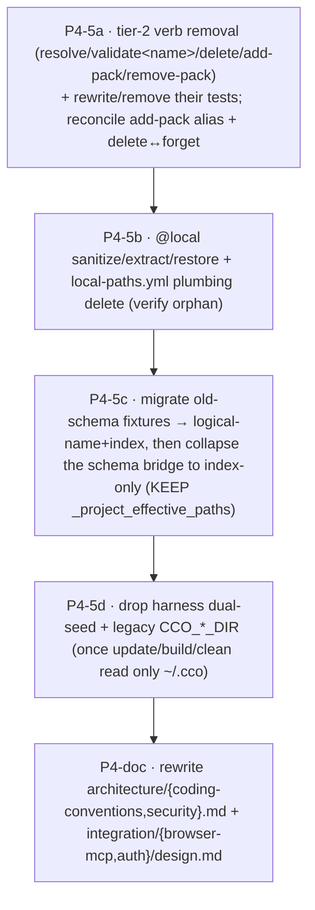

# P4-5 handoff — Legacy teardown (+ P4-doc) — closes Phase 4

Self-contained launcher for a **clean session** to finish Phase 4 of the decentralized in-repo config
refactor: **P4-5 legacy teardown** then **P4-doc** (deferred maintainer-doc rewrites). The sharing core
(P4-1…P4-4) has landed; what remains is removing the transitional scaffolding now that its consumers are
gone, then rewriting the docs that described the deleted code.

Branch `feat/vault/decentralized-config`, commits **LOCAL** (the maintainer pushes from the Mac).

---

## ⏩ RESUME STATUS (read this FIRST)

> **UPDATE 2026-06-24 — P4-5a + P4-5b DONE, paused mid-P4-5 for maintainer travel. RESUME AT P4-5c.**
> The 4 open reconciliations are RESOLVED (maintainer, AskUserQuestion): (1) `add-pack` alias **DROPPED now**
> (no alias, AD12 — deviates from ADR-0023 D3, reconciliation recorded); (2) `cco project delete` **REMOVED now**
> (deregister gap until `cco forget`/P5 accepted); (3) schema-bridge → **FULL collapse in P4-5c**; (4) **P4-5d
> DEFERRED to P5** — code-grounded: central `$PROJECTS_DIR` is still load-bearing in ~10 commands not yet on the
> index (`$GLOBAL_DIR` already `~/.cco/global`). **P4-5a `3b0859b`** (tier-2 verbs removed + rejections;
> `cmd-project-delete.sh`/`cmd-project-pack-ops.sh` deleted; suite 862/1). **P4-5b `34b3429`** (orphan @local
> vault/publish family deleted from `local-paths.sh`, −468 lines; KEPT the bridge + `_resolve_project_paths_impl`/
> `_resolve_start_paths`/`_get_repo_url`/`_resolve_entry`/`_update_yml_path` for P4-5c; `test_local_paths.sh`
> 40→18; suite **840/1**). **NEXT = P4-5c** (bridge FULL collapse → index-only; KEEP `_project_effective_paths`
> the function, drop its legacy branch). **Maintainer asked to PROPOSE the P4-5c sub-commit decomposition BEFORE
> coding** (it is gated by migrating the old-schema `- path:`/`- source:` fixtures — current map + the dies-with-
> legacy-branch function list are in the live progress note `decentralized-config-impl-progress.md`). Then P4-doc.
> Delta-green now measured vs **840/1**. Full detail in the progress note.

**Phase 4 is IN PROGRESS. P4-1 + P4-2 + P4-3 + P4-4 have landed; start here at P4-5.** Do NOT re-run the §1
P3→P4 boundary audit (it is done); a **light re-baseline check** is enough. The **`decentralized-config`
design is the single SOURCE OF TRUTH**, precedence: `guiding-principles.md` (P1–P18) → ADRs (0005–0027) →
living `design.md` → `requirements.md`. The more specific/authoritative wins; **record any reconciliation**;
a genuine design gap ⇒ **PAUSE and discuss**.

**Baseline = 883/1** with `CCO_ALLOW_HOST_RESOLVE=1 ./bin/test`. The **1** = `test_resolve_name_from_full_variant_url`
(P5 llms straddler — out of scope until P5). **Delta-green is measured against this 1; a 2nd failure is a
regression.** (P4-4 dropped the pass-count from 938→883 by *intentionally* removing tests for the deleted
project-sharing commands — not regressions.)

**First actions:** (1) `git log --oneline -12` + read the live progress note `decentralized-config-impl-progress.md`;
(2) re-run the baseline; (3) **code-ground every symbol below — line numbers drift, re-grep before editing.**

---

## 0. Authoritative methodology (the law — unchanged across the whole refactor)

- **Design governs.** Precedence as above. The build does not invent behaviour; it realizes the frozen design.
- **Build method** (Cluster-2 directive): **dependency + reuse + open-closed**, **build-once-in-final-form**,
  **breaking cutover** (no dual-read in the new layout; ~2 known users). Removed verbs get **no alias** unless
  an ADR says so (**AD12**) — e.g. ADR-0023 D3 keeps `add-pack` as an alias of `cco project add pack` "for one
  release" (see §3).
- **Delta-green per commit.** Each commit leaves cco runnable and the suite at the 1 known failure (no new
  reds). Decompose a co-dependent cutover into a few **large coordinated commits** (working tree red only
  *between* edits within a commit).
- **Maintainer-confirm** any UX / interface / placement / sequencing choice (AskUserQuestion). Propose the
  sub-commit decomposition + the open reconciliations (§3) **before** coding.
- **Code-ground every claim** (re-read; line numbers drift). **bash 3.2 / macOS** (`/bin/bash`, guard empty
  arrays under `set -u`).
- **Run tests with the hatch:** `CCO_ALLOW_HOST_RESOLVE=1 ./bin/test` (without it, pure path-resolver unit
  tests fail on the H4 anti-in-container guard *by design*). `--file <name>` / `--filter <substr>` to scope.
- **Self-development caveat:** edits to `config/`, `Dockerfile`, baked `defaults/managed/**` are NOT live this
  session (need `cco build`); `lib/`, `internal/`, `templates/`, `docs/` ARE host-side and testable now.

---

## 1. FIRST ACTION — light re-baseline (NOT a full audit)

The P3→P4 adherence audit was the phase-boundary audit and is **done** (`reviews/24-06-2026-impl-adherence-review.md`).
For P4-5 just **re-confirm the baseline** (883/1) and skim the Transitional Registry (§3 below + `implementation-review-handoff.md` §4)
so you delete only sanctioned items with their consumers. A **P4→P5 adherence audit** runs at the *next*
boundary (after P4-doc), not now.

## 2. Context to load (reading order)

1. `guiding-principles.md` (**P1–P18**) — esp. **P13** (projects ride the code remote), **P14** (reachability
   never hard-blocks), **AD3/G8** (no real host path in committed config).
2. **This file.**
3. The live progress note **`decentralized-config-impl-progress.md`** (cursor + full P4-1…P4-4 detail) + `git log --oneline -15`.
4. `implementation-review-handoff.md` **§4 (Transitional Registry)** — the authoritative list of what P4-5 retires.
5. `design.md` **§9** (build phases — P4/P5), **§2.4/§3** (the index is the name→path map; coordinates are
   per-unit embedded), **§6.2/§7** (current command surface — already verdict-faithful).
6. ADRs: **0023 D1/D2/D3** (command namespace; `cco project validate` share-readiness = **P5**; `add-pack`
   one-release alias), **0017 D2** (`cco resolve` / `--from` — the replacement for the legacy `cco project
   resolve`), **0021** (`cco forget` lifecycle, **P5**).
7. The code (re-grep — see §3): `lib/local-paths.sh`, `lib/cmd-project-query.sh`, `lib/cmd-project-pack-ops.sh`,
   `lib/cmd-project-delete.sh`, `lib/cmd-start.sh`, `lib/workspace.sh`, `lib/cmd-update.sh`/`update*.sh`,
   `tests/helpers.sh`, `bin/cco`.

## 3. Scope — P4-5 legacy teardown (then P4-doc)

Authoritative scope = **Transitional Registry §4** (`implementation-review-handoff.md`) + `P4-handoff-sharing-core.md`
§3 item 6. The items below are now retire-able because their consumers (vault P3-3, project publish/install/update/
internalize P4-4e) are **gone**. **Re-grep every symbol — line numbers are post-P4-4 and will drift.**

### Registry items that DIE in P4-5

1. **`@local` sanitize / extract / restore + `local-paths.yml` plumbing → index-only** (`lib/local-paths.sh`).
   - Functions: `_sanitize_project_paths` (~`:257`), `_extract_local_paths` (~`:702`), `_restore_local_paths`
     (~`:774`), `_resolve_all_local_paths`, `_resolve_installed_paths`, `_write_local_paths`, the `@local`-marker
     awk in `_resolve_project_paths`. These were consumed only by the vault + project publish/install paths —
     **verify they are now orphan** (`grep -rn` their names across `lib/ bin/`) and delete with any now-dead
     `local-paths.yml` writers/readers. The machine-local index (`lib/index.sh`) is the sole name→path map.
2. **Per-section schema bridge → collapses to index-only.** `_effective_repo_mounts` / `_effective_extra_mounts`
   (local-paths.sh, ~`:1101`/`:1132`) currently branch per schema (legacy `- path:`/`- source:` ⇒ legacy chain;
   empty ⇒ logical-name ⇒ STATE index). The bridge can collapse to **index-only** **once no test/fixture passes
   the old `- path:`/`- source:` schema**. → This is the delicate half: **migrate the remaining old-schema
   fixtures** to the logical-name + index schema first, then remove the legacy branch. **KEEP `_project_effective_paths`**
   (~`:1236`) — it is consumed by `cmd-start`; re-grep its callers before touching anything.
3. **Tier-2 legacy project verbs** (bin/cco `project` arms + their funcs), deleted **with their consumers
   (tests)**: `cco project resolve` (`cmd_project_resolve`, cmd-project-query.sh) → replaced by top-level
   **`cco resolve`** (ADR-0017 D2, already exists); `cco project validate <name>` (`cmd_project_validate`,
   the legacy central-layout variant) — **note:** the *share-readiness* `cco project validate` is a **P5**
   build (ADR-0023 D2), so P4-5 removes only the legacy variant; `cco project delete` (`cmd_project_delete`)
   — reconcile with **`cco forget`** (ADR-0021, P5); `cco project add-pack`/`remove-pack`
   (`cmd_project_add_pack`/`_remove_pack`, cmd-project-pack-ops.sh) — **ADR-0023 D3 keeps `add-pack` as an
   alias of `cco project add pack` "for one release"** ⇒ confirm with the maintainer whether to keep the
   alias or drop it now.
4. **Harness dual-seed + legacy `CCO_*_DIR`.** `tests/helpers.sh` `setup_global_from_defaults` dual-seeds the
   legacy `$CCO_GLOBAL_DIR` *and* `~/.cco/global`; `bin/cco` still resolves legacy `CCO_GLOBAL_DIR`/`CCO_PROJECTS_DIR`/…
   and prints deprecation warnings. Remove the dual-seed + the legacy var resolution **once `cco update`/`build`/
   `clean` read only `~/.cco`** — re-grep the remaining `$GLOBAL_DIR`/`$PROJECTS_DIR`/`CCO_*_DIR` consumers
   (notably the `cco update` engine's legacy installed-project logic in `update.sh`, which P4-4 left intact).

### Open reconciliations to confirm with the maintainer BEFORE coding (AskUserQuestion)

- **`add-pack` alias:** keep (ADR-0023 D3 "one release") or drop now (AD12 breaking)?
- **`cco project delete` vs `cco forget`:** is the legacy `delete` removed now (forget is P5), or kept until
  forget lands? (Avoid leaving users with no deregister path.)
- **Schema-bridge collapse scope:** confirm the set of old-schema fixtures to migrate (this is what gates the
  collapse) — it may be large; propose the sub-commit decomposition.

### Proposed build sequence (maintainer-confirm — co-dependent, delta-green per commit)

Boundaries are **maintainer-confirmable** — propose, then build. The order is a suggestion; the hard constraint
is that each commit stays delta-green (e.g. the bridge collapse (C) cannot precede its fixture migration).

### P4-doc (closes the phase)

Full rewrite (living docs → current truth, per `.claude/rules/documentation-lifecycle.md`):
`docs/maintainer/architecture/coding-conventions.md`, `architecture/security.md`,
`integration/browser-mcp/design.md`, `integration/auth/design.md` — they still document the deleted
`cmd-vault.sh` and the `@local`/tier-2 code this phase removes (logged in `resource-coherence-inventory.md`).
P3-5 only re-pointed their `vault/` path tokens into `_archive/`; the prose rewrite lands here.

## 4. Cross-cutting invariants (never violate)

- **4-bucket taxonomy** (ADR-0007/0015/0016): CONFIG `~/.cco` · DATA `~/.local/share/cco` (synced) · STATE
  `~/.local/state/cco` (machine-local: index, base/+meta, tokens, memory/transcripts) · CACHE (regenerable).
- **The index is the name→path map** (STATE) — there is no `@local` and no `local-paths.yml` in the final state.
  **AD3/G8 — no real host path ever enters committed config.**
- **P13** projects ride the code-repo remote (no publish boundary). **P14** reachability is layered + never a
  hard block. **Host-side resolver guard (H4)** + the **compose↔entrypoint container-path contract** are
  invariants — P4-5 changes host-side resolution, NOT the container paths `entrypoint.sh` sees.

## 5. What landed (P4-1…P4-4) — the substrate P4-5 builds on

- **P4-1** `82b6956` — `source`→DATA relocation, key rename `url`/`ref`/`resource`, `publish_target`
  re-derived (F4); `commit/installed/updated`→STATE meta. ADR-0022 D1.
- **P4-2** `6b2673f` — structure-based discovery (`_discover_resources`); **manifest subsystem DELETED**
  (`lib/manifest.sh` + `cco manifest`). ADR-0012/0018 D3.
- **P4-3** `cf8d03b` — sync-before-publish: whole-file 3-way `_pack_sync_merge` vs the pack-scoped STATE
  `base/` (recorded on install+publish via `_record_tree_as_base`), abort-on-conflict (P16), `--force`=opt-in
  clobber. ADR-0022 D5.
- **P4-4** (5 sub-commits `3f85de7`/`56ac61c`/`ef2ad01`/`fc8f2ee`/`a5d6cca`) — 2×2 verb wiring: pack `import`;
  project `export`/`import` (`lib/cmd-project-export-import.sh`); template 2×2 (both kinds by marker +
  sync-before-publish parity, `_cco_template_base_dir`); `cco init --template`; **REMOVED project
  publish/install/update/internalize** (ADR-0018 D2 / ADR-0023 D4c — current internalize-semantic retired,
  name reserved post-v1) + nomenclature config→sharing repo + AD12 no-alias rejections. Suite 920/1→**883/1**.
- **Orphan noted:** `_resolve_template_vars` (cmd-template.sh) is now dead (was a project-install consumer);
  full `{{VAR}}` resolution for `cco init --template` adapted to the new `claude/` layout is a **P5** item.

## 6. Explicitly DEFERRED to P5 — do NOT build in P4-5

`cco project validate` full share-readiness contract (ADR-0023 D2) + `cco config validate [--fix]` orphan-prune ·
`cco forget` + delete-cascade (ADR-0021) · `cco update --check` (DATA-driven 3-state) · three-layer pack
resolution + `internalize` (pack/template cut-url + `--as`; project Case-C) + `export --bundle-packs` ·
`cco project coords` · `cco config protect` helper (docs-only v1) · index per-project namespacing · T state-sync.

## 7. After P4-5 + P4-doc → Phase 4 CLOSED → P5

Run a **P4→P5 adherence audit** at the boundary (`implementation-review-handoff.md` playbook). P5 lands the §6
list on the P4 sharing substrate. **Pre-merge to develop/main: full dogfooding e2e on the Mac**
(`P2-dogfooding-validation.md` §3) on a vault **copy** with sandboxed roots; **never accept the legacy-vault
offer-to-remove until merged + validated.** After P5, the refactor is v1-complete — reconcile both roadmaps and
mark the ADRs.

> Next free ADR = **0028**. Live cursor = `decentralized-config-impl-progress.md`. Roadmaps: global
> `docs/maintainer/decisions/roadmap.md` + `analysis-roadmap.md` (both updated through P4-4).
