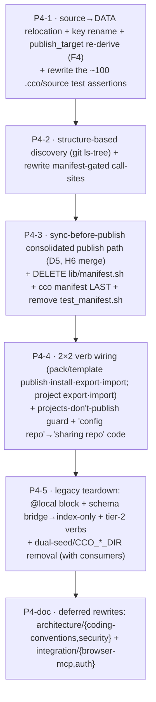

# P4 handoff — Sharing core (manifest removal · sync-before-publish · 2×2 · source→DATA · legacy teardown)

**Purpose.** Phases 0–3 are ✅ CLOSED: the substrate, the core-local commands, migration/bootstrap, and the
whole legacy cutover (vault/profiles gone, decentralized `cco start`, `cco tag`/`cco config`, `cco init`
scaffold, config-editor built-in, the shipped-behavior doc sweep + `_archive/`). The decentralized runtime
is **live**. **Phase 4 makes the SHARING surface real on that final substrate** — and it is where the
remaining transitional scaffolding (the `@local` block, the per-section schema bridge, the tier-2 legacy
verbs, `lib/manifest.sh`, dual-seed/`CCO_*_DIR`) is **deleted build-once with its consumers**. Self-contained.
Produced 2026-06-24. Baseline **936 passed / 3 failed** on `feat/vault/decentralized-config` (commits
**local** — the maintainer pushes from the Mac). Next free ADR = **0028**.

---

## ⏩ RESUME STATUS (updated 2026-06-24 — read this FIRST)

**Phase 4 is IN PROGRESS. The §1 P3→P4 adherence audit is DONE and P4-1 + P4-2 have landed.** Start the
next session at **P4-3 (sync-before-publish)** — do NOT re-run the §1 boundary audit (it was the P3→P4
audit; a light re-baseline check is enough). The **`decentralized-config` design (`guiding-principles.md`
P1–P18 → ADRs → `design.md` → `requirements.md`) remains the single SOURCE OF TRUTH**; this status only
records where the build is.

**Done this cycle (commits LOCAL):**
- **Audit ✅** `reviews/24-06-2026-impl-adherence-review.md` — READY FOR P4, 0 blockers / 0 HITL. 4 parallel
  read-only lenses + adversarial verify. Baseline confirmed **936/3** (the 3 = exact P4–P5 set).
- **P4-1 ✅** `82b6956` — **source → DATA** (ADR-0022 D1): `_cco_{pack,project}_source` →
  `<data>/cco/{packs/<name>,projects/<id>}/source`, new `_cco_template_source`; key rename
  `source→url` / `path→resource` (`ref` kept); bookkeeping `commit/installed/updated` → STATE
  `/update` meta (new `_meta_record_provenance` / `_meta_installed_commit`; project-meta generator
  preserve-list extended); **F4** `publish_target` dropped → re-derived via new
  `remote_get_name_for_url` (url→name reverse-lookup), `_update_publish_target` deleted, post-publish
  records `url` (working-copy P16); ALL read/write sites flipped per `design §9`; idempotent
  `_relocate_legacy_pack_sources` in `cco update`; **llms source NOT relocated** (already CACHE-split).
  Suite **939/1** (resolved the 2 P4 baseline failures).
- **P4-2 ✅** `6b2673f` — **structure-based discovery + manifest subsystem REMOVED** (ADR-0012/0018 D3):
  new `_discover_resources <root> packs|templates` (`lib/remote.sh`; a `<section>/<name>/` carrying
  `pack.yml`/`project.yml`); `_clone_for_publish` empty-seed → `--allow-empty` commit; rewrote pack +
  project install discovery readers; dropped every `manifest_refresh`/`manifest_init` writer; **deleted**
  `lib/manifest.sh` + the `cco manifest` arm/source/usage + `tests/test_manifest.sh`. Suite **915/1**.
  > **Build-boundary reconciliation:** the manifest subsystem is **fully dead** once structure-discovery
  > exists (no reader — `cco pack list` already scans `$PACKS_DIR/*/`), so its deletion was **folded from
  > P4-3 into P4-2** ("delete LAST" = right after discovery). **⇒ P4-3 below is now sync-before-publish
  > ONLY.** (Forward-annotated in ADR-0012.) End state unchanged.

**Baseline now = 915/1.** The 1 = `test_resolve_name_from_full_variant_url` (P5 llms straddler — out of
scope until P5). Delta-green is measured against this 1; a 2nd failure is a regression. Run with the hatch:
`CCO_ALLOW_HOST_RESOLVE=1 ./bin/test`.

**Remaining P4 tasks (build order — each a delta-green commit; §3 has the full scope):**
1. **P4-3 — sync-before-publish** (ADR-0022 D5 / §6.2). Corrects the **clone-then-overwrite** data-loss
   defect in `cmd_pack_publish` (`rm -rf "$tmpdir/packs/$name"; cp -R "$pack_dir" …` blindly discards a
   co-maintainer's remote-only changes). Build: (a) record the published/installed pack tree as the
   **pack-scoped STATE `base/`** (`_cco_pack_base_dir` `paths.sh:148` — already exists) on **both**
   `_install_pack_from_dir` and publish (the §6.2.5 "Record" step); (b) a **file-level 3-way tree merge**
   `_pack_sync_merge <base> <ours> <theirs> <out>` (union of files; only-ours→ours · only-theirs→theirs ·
   both-equal→ours · both-differ → **CONFLICT → abort** "run `cco pack update` first", P16; handle
   adds/deletes) — whole-file, NOT line-level (`update-merge.sh` `_merge_file` is available if line-level
   is wanted, but D5 says abort-on-conflict); (c) rewrite publish: first-publish (no base) → init/add,
   push if FF; subsequent (base exists) → merge → write to publish temp → commit → push → record the
   merged tree as the new base; if the remote already carries the pack on first publish → divergence →
   merge path (never blind-overwrite). **Tests (§11 row 4):** new no-clobber tests in `test_pack_publish.sh`
   (co-maintainer remote-only change survives a republish; first-publish init vs subsequent merge;
   abort-on-conflict). The full P4-3 design is captured in the progress note (`decentralized-config-impl-progress.md`).
2. **P4-4 — 2×2 verb wiring + nomenclature** (ADR-0018 D2 / ADR-0023 D4). packs/templates:
   `publish|install|export|import`; projects: `export|import` **only** (projects-don't-publish guard, P13).
   REMOVE `cmd-project-{publish,install}.sh` + arms; REFACTOR pack publish/remote; BUILD-NEW pack `import`,
   project `export`/`import`, template `publish/install/export/import` (today `cmd-template.sh` has only
   list/show/create/remove). "config repo" → "sharing repo" in code (~32 occurrences, **most absorbed by
   the cmd-project-{publish,install} deletions**; residue in `cmd-update.sh`/`cmd-remote.sh`/`remote.sh`).
3. **P4-5 — legacy teardown** (Transitional Registry §4): `@local` sanitize/extract/restore + `local-paths.yml`
   plumbing → index-only; per-section schema bridge (`_effective_repo_mounts`/`_effective_extra_mounts`)
   → collapses to index-only; tier-2 legacy verbs (`cco project resolve`/`validate <name>`/`add-pack`/
   `remove-pack`/`delete`) deleted with consumers; harness dual-seed + legacy `CCO_*_DIR` removed. **KEEP**
   `_project_effective_paths` (the one `@local`-adjacent helper, consumed by `cmd-start` — re-grep callers).
4. **P4-doc** — full rewrite of `architecture/{coding-conventions,security}.md` +
   `integration/{browser-mcp,auth}/design.md` (they document the deleted `cmd-vault.sh` + the `@local`/tier-2
   code P4-5 removes; logged in `resource-coherence-inventory.md`).

**Methodology (unchanged — see §0):** design+principles+ADRs govern every decision (more specific wins;
record reconciliations; a genuine gap ⇒ PAUSE + discuss). Build method = **dependency + reuse + open-closed**,
**build-once-in-final-form**, **breaking cutover**; each commit leaves cco runnable + the suite delta-green;
**maintainer-confirm** any UX/interface/placement/sequencing choice (AskUserQuestion); **code-ground every
claim** (re-read — line numbers drift); bash 3.2 / macOS. **Live cursor + full P4-1/P4-2 detail + the P4-3
design** = the progress note `decentralized-config-impl-progress.md`.

---

## 0. Authoritative methodology (unchanged — the law)

The **`decentralized-config` design IS the source of truth**, in precedence order:
`guiding-principles.md` (P1–P18) → ADRs (0005–0027) → living `design.md` → `requirements.md`. The more
specific/authoritative wins; **record any reconciliation**; a genuine design gap ⇒ **PAUSE and discuss**.
**Build method** (Cluster-2 directive, non-negotiable): **dependency + reuse + open-closed**,
**build-once-in-final-form**, **breaking cutover** (no dual-read in the new layout — there are only ~2 known
users). Non-negotiables: **AD12 breaking cutover** (new model only; removed verbs get **no** alias unless an
ADR says so — e.g. `add-pack` alias "for one release", ADR-0023 D3); **AD3/G8** no real host path in committed
config (`git diff` always truthful); **P14 reachability is NEVER a hard block**; **P15** a shared resource's
local copy is never its source; **P16** never clobber a co-maintainer; **P17** permissions delegated to git.
**Each commit leaves cco runnable + the suite delta-green** — the **3** baseline failures
(`test_resolve_name_from_full_variant_url`, `test_publish_ignore_path_patterns`,
`test_project_internalize_updates_base`) are the **P4–P5 set** and resolve as their files are rewritten; a
**4th** failure is a regression. **Run with the hatch: `CCO_ALLOW_HOST_RESOLVE=1 ./bin/test`** (without it
3–4 pure path-resolver unit tests fail on the H4 guard *by design*). **Maintainer-confirm** any
UX/interface/placement/sequencing choice (AskUserQuestion). **Code-ground every claim** (line numbers drift —
re-read before editing). **bash 3.2 / macOS** (`/bin/bash`, no Homebrew bash; guard empty arrays under
`set -u`). **Self-development caveat:** edits to `config/`, `Dockerfile`, baked `defaults/managed/**` are NOT
live this session (need `cco build`); `lib/`, `internal/`, `templates/`, `docs/` ARE host-side and testable
via `./bin/test` now.

## 1. FIRST ACTION (MANDATORY) — P3→P4 adherence audit before any P4 code

Run the recurring **`implementation-review-handoff.md`** playbook (read-only, code/doc-grounded, parallel
lenses → adversarial verify → 4-state classify ✅/❌/🟡/🔴). It must confirm:

1. **Baseline** is exactly **936/3** (`CCO_ALLOW_HOST_RESOLVE=1 ./bin/test`); the 3 = the P4–P5 set above.
2. **Phase 3 conformant**: decentralized `cco start` reads `<repo>/.cco/` (`cmd-start.sh:_start_resolve_project`);
   vault/profile world gone (no `lib/cmd-vault.sh`); `cco tag`/`cco list --tag` over DATA `tags.yml`
   (`lib/tags.sh`); `cco config save/push/pull` (`lib/cmd-config.sh`); `cco init` scaffolds `<repo>/.cco/` +
   idempotent global-ensure + `migration-state` marker gate (`lib/cmd-init.sh`, `migrate.sh`); config-editor
   built-in (`internal/config-editor/`, ADR-0027); `_archive/` move done.
3. **Transitional Registry (§4) still intact for the items P4 retires** — they must be present-but-legacy,
   NOT prematurely deleted: the `@local`/sanitize/extract/restore + `local-paths.yml` plumbing
   (`lib/local-paths.sh`), the per-section schema bridge (`_effective_repo_mounts`/`_effective_extra_mounts`),
   the tier-2 legacy verbs (`cco project resolve`/`validate <name>`/`add-pack`/`remove-pack`/`delete`),
   `lib/manifest.sh` + `cco manifest`, the harness dual-seed + legacy `CCO_*_DIR`. **These die in P4** — a
   missing one is a finding (early cleanup), a present one is expected.
4. **Refresh the registry** at the end: anything P4 lands moves ❌→✅ / gone.

Record a one-line confirmation per item; a genuine gap ⇒ PAUSE.

## 2. Context to load (reading order)

1. `guiding-principles.md` (**P1–P18**). 2. **This file.** 3. `Y-handoff-implementation.md` **§3 P4**
(authoritative phase scope) + **§4** (invariants) + **§5** (the v1 command surface) + **§6** (explicitly
deferred). 4. `design.md` **§9 P4** (the build script) + **§11 row 4** (test plan + existing-suite teardown)
+ **§6.2** (consolidated publish path) + **§2.4** (the resolver table / cache-vs-source discriminator).
5. The load-bearing ADRs: **0012** (manifest removed), **0018** (sharing 2×2 + structure-based discovery, D2/D3),
**0022** (coordinate model: D1 source→DATA + `publish_target` re-derive, **D5 sync-before-publish**, D4
cache-iff-coordinate), **0019** (pack lifecycle + reachability, D3/D4), **0023** (command surface; D4 sharing
verdicts; D2 validate → P5). 6. `implementation-review-handoff.md` **§4** (Transitional Registry — what P4
retires). 7. The personal progress note `decentralized-config-impl-progress.md` (live cursor) +
`git log --oneline -15`. 8. The code: `lib/manifest.sh`, `lib/cmd-pack.sh`, `lib/remote.sh`, `lib/cmd-project-*.sh`,
`lib/cmd-template.sh`, `lib/local-paths.sh`, `lib/yaml.sh`, `lib/cmd-start.sh`, `lib/update*.sh`.

## 3. Scope — P4 Sharing core (the resume work)

Authoritative scope = `Y-handoff §3 P4` + `design §9 P4` + `§11 row 4` (read them — do not work from this
summary alone). The deliverables:

1. **`source` → DATA relocation (T4-source, re-sequenced here from P0; ADR-0022 D1).** The substrate the
   rest of P4 builds on. Relocate `<repo|pack>/.cco/source` → `<data>/cco/{projects,packs,templates}/<id>/source`;
   rename keys **`source:`→`url:`**, **`path:`→`resource:`** (`ref:` kept); move `commit`/`version` → STATE
   `/update` meta; **drop `publish_target`** (re-derive on demand via `remotes` reverse-lookup, **F4**). All
   read/write sites flip together + a relocation step migrates existing old-location `source`. **llms `source`
   excluded** (already CACHE/coordinate-split). The ~100 hardcoded `.cco/source` assertions in
   `test_publish_install_sync`/`test_pack_install`/`test_pack_publish`/`test_project_publish`/
   `test_pack_internalize` are rewritten **with** this relocation (that is exactly why it was deferred to P4 —
   delta-green/build-once).
2. **Manifest removal = code/data split (F14) — DISCOVERY BEFORE DELETE.** Build **structure-based discovery**
   (`git ls-tree` over `packs/*/` + `templates/*/` on a treeless clone; no `manifest.yml`; ADR-0012/0018 D3) +
   rewrite every manifest-gated call-site **first**; delete `lib/manifest.sh` + `cco manifest` +
   `manifest_init`/`manifest_refresh` call sites **LAST**. (`cco init` already emits no manifest — verify.)
   Remove `test_manifest.sh`.
3. **sync-before-publish (the data-loss defect; ADR-0022 D5 / §6.2).** Consolidated publish path: resolve the
   remote (explicit arg, else re-derive `publish_target` by reverse-looking `url` up in `remotes`); **pull +
   3-way merge against the pack-scoped STATE `base/`** (`<state>/cco/packs/<name>/update/base/`, reusing the
   P2-relocated merge engine **H6**, `update-merge.sh` logic unchanged); init-at-first-publish vs
   merge-on-existing; **abort-on-conflict, never clobber a co-maintainer (P16)**. Corrects the
   clone-then-overwrite fast-forward push (~`cmd-pack.sh:1024` — re-grep).
4. **2×2 verb wiring (ADR-0018 D2 / ADR-0023 D4 verdicts).** **packs**: `publish|install|export|import`;
   **templates**: `publish|install|export|import`; **projects**: `export|import` **only** — no publish/install
   (projects ride their own repo remote; **projects-don't-publish guard, P13**). Verdicts: project
   publish/install **REMOVED**; pack publish/remote **REFACTORED**; manifest **DROPPED**; pack `import` +
   project `export`/`import` + template 2×2 **BUILD-NEW**.
5. **Nomenclature migration** "config repo" → "sharing repo" in **code** paths (the docs were swept in P3-5;
   never rename a config **bucket** — only the publish/install remote concept).
6. **Legacy teardown — build-once with consumers (Transitional Registry §4).** The `@local`
   sanitize/extract/restore + `local-paths.yml` plumbing in `lib/local-paths.sh` → final state **index-only**;
   the per-section schema bridge (`_effective_repo_mounts`/`_effective_extra_mounts`) **collapses to
   index-only** once legacy `- path:`/`- source:` fixtures are gone; the tier-2 legacy verbs
   (`cco project resolve`/`validate <name>`/`add-pack`/`remove-pack`/`delete`) deleted with their
   publish/install/query consumers; harness **dual-seed** + legacy **`CCO_*_DIR`** removed once
   update/build/clean read only `~/.cco`. `_project_effective_paths` (consumed by `cmd-start`) is the one
   `@local`-adjacent helper to KEEP (re-grep its callers before deleting anything).
7. **Deferred-from-P3-5 doc rewrites ride here (logged in `resource-coherence-inventory.md`):** full rewrite of
   `docs/maintainer/architecture/{coding-conventions,security}.md` + `integration/{browser-mcp,auth}/design.md`
   — they document the now-deleted `cmd-vault.sh` and the **`@local`/tier-2 code this phase removes**, so the
   rewrite becomes true here. (P3-5 re-pointed only their `vault/`→`_archive/` path tokens.)

**Tests (§11 row 4):** rewrite `test_pack_publish.sh`, `test_pack_install.sh`, `test_publish_install_sync.sh`,
`test_project_install.sh`/`test_project_install_enhanced.sh`, `test_project_publish.sh`, `test_template.sh` to
the 2×2 + coordinate model; **remove** `test_manifest.sh`. The 3 baseline failures resolve here/P5
(`test_publish_ignore_path_patterns` + `test_project_internalize_updates_base` are P4; the llms
`test_resolve_name_from_full_variant_url` straddles P4–P5).

### Proposed build sequence (maintainer-confirm before coding — it is a **breaking, co-dependent** cutover)

Like P2/P3, this is a co-dependent cutover (you cannot relocate `source` without the readers, nor delete
`manifest.sh` without discovery). Decompose into a few **large coordinated commits**, each delta-green:

Rationale: `source`→DATA is the data substrate every sharing read/write touches (P4-1 first); discovery must
exist **before** `manifest.sh` is deleted (P4-2 before P4-3); the 2×2 wiring sits on the consolidated
publish path (P4-4 after P4-3); the legacy teardown removes scaffolding only once nothing reads it (P4-5
last); the deferred maintainer-doc rewrites describe the code P4-5 finalizes (P4-doc closes the phase). The
boundary between commits is **maintainer-confirmable** — propose, then build.

## 4. Cross-cutting invariants (never violate — `Y-handoff §4`)

- **4-bucket taxonomy** (ADR-0007/0015/0016): CONFIG `~/.cco` (authored, versioned) · DATA `~/.local/share/cco`
  (internal, **synced** — `source`, `tags.yml`, de-tokenized `remotes`) · STATE `~/.local/state/cco`
  (machine-local, **never-sync** — index, `base/`+`meta`, tokens, memory/transcripts) · CACHE (regenerable).
  Each datum's home = the authoritative table in **ADR-0016**.
- **Coordinate model** (ADR-0016 D2 / 0019 / 0022): the coordinate (`name`+`url`) is **per-unit, embedded in
  the versioned manifest** (`project.yml`/`pack.yml`) — **no central registry**; the **index** maps
  `name→path` (STATE). **AD3/G8 — no real host path ever enters committed config.**
- **P14 reachability** is layered (embed-at-add → heal-at-resolve → `cco project validate` → opt-in hook →
  passive ⚠) and **never a hard block**. `cco project validate` is exit-code-only, never on the git push path.
- **P15** cache-vs-source discriminator = the coordinate's presence in the manifest entry (ADR-0022 D4 + the
  §2.4 resolver table). **P16** sync-before-publish never clobbers. **P17** git owns permissions, cco assists.
- **Host-side resolver guard (H4)** and the **compose↔entrypoint container-path contract** are invariants —
  P4 changes host-side resolution/data homes, NOT the container paths `entrypoint.sh` sees.

## 5. What landed (P3) + the Transitional Registry items P4 retires

**Phase 3 (legacy cutover) ✅ CLOSED** — P3-1 decentralized `cco start` + D-start UX (`36660fd`/`365d16f`) ·
P3-2 `cco tag`/`cco list --tag` + `cco config save/push/pull` (`548f2e5`/`f7f41c1`) · P3-3 vault/profile world
removed (`a76e1f6`, −3732 lines) · P3-3b `cco init` scaffold + `cco project create` deleted, ADR-0026
(`35f5797`/`d9e44a2`) · P3-4 config-editor built-in + `--mount` + edit-protection, ADR-0027
(`531a0f8`/`2783ce5`/`f590efe`/`871993e`) · P3-5 shipped-behavior doc cutover sweep A/B+C + Section D archive
(`5c6ad29`/`141e24e`/`56967cf`/`a3e0618`/`c3cb598`). Suite **936/3**.

**Registry items that DIE in P4 (do not delete early; delete build-once with consumers):**
- `@local`/sanitize/extract/restore + `local-paths.yml` plumbing (`lib/local-paths.sh`) → index-only.
- Per-section schema bridge (`_effective_repo_mounts`/`_effective_extra_mounts`) → collapses to index-only.
- `T4-source` — `<repo|pack>/.cco/source` (read in place since P0) → DATA + key rename + `publish_target`
  re-derive (**P4-1 above**).
- Tier-2 legacy verbs `cco project resolve`/`validate <name>`/`add-pack`/`remove-pack`/`delete`.
- `lib/manifest.sh` + `cco manifest` (+ `manifest_init`/`manifest_refresh`).
- Harness **dual-seed** + legacy **`CCO_*_DIR`** (once update/build/clean read only `~/.cco`).

**Already retired (do NOT re-add):** T5 base/meta→STATE (P2-2), T4-tags (P3-2a), vault/profile world (P3-3),
`cco project create` (P3-3b).

## 6. Explicitly DEFERRED to P5 — do NOT build in P4 (`Y-handoff §6`)

Three-layer pack resolution (one deterministic resolver from the §2.4 table, cache-iff-coordinate) ·
`internalize` (pack/template cut-url + `--as` fork; project internalize = Case-C, post-v1) +
internalize-as-cache prompt + `export --bundle-packs` · **`cco update --check`** (DATA-driven 3-state) ·
lifecycle (`cco forget`, delete-cascade) · **`cco project validate`** full share-readiness contract +
**`cco config validate [--fix]`** orphan-prune · `cco config protect` = **docs-only v1** (helper deferred) ·
S8 no-token-leak checklist (M3 from P0 satisfies it by construction). Also post-v1: index per-project
namespacing (global-flat v1), Case-C convergence merge, `coords-lookup` persistence, **T** state-sync.

## 7. After P4 → P5 (sharing extensions & lifecycle) → v1 done

Run a **P4→P5 adherence audit** at the boundary. P5 lands the deferred §6 list on the P4 sharing substrate.
**Pre-merge to develop/main: full dogfooding e2e on the Mac** (`P2-dogfooding-validation.md` §3) on a vault
**copy** with sandboxed roots; **never accept the legacy-vault offer-to-remove until merged + validated**.
After P5, the decentralized in-repo config refactor is v1-complete — reconcile both roadmaps, mark the ADR
range closed, and prune the consumed phase handoffs (keep `Y-handoff-implementation.md` as the master).
