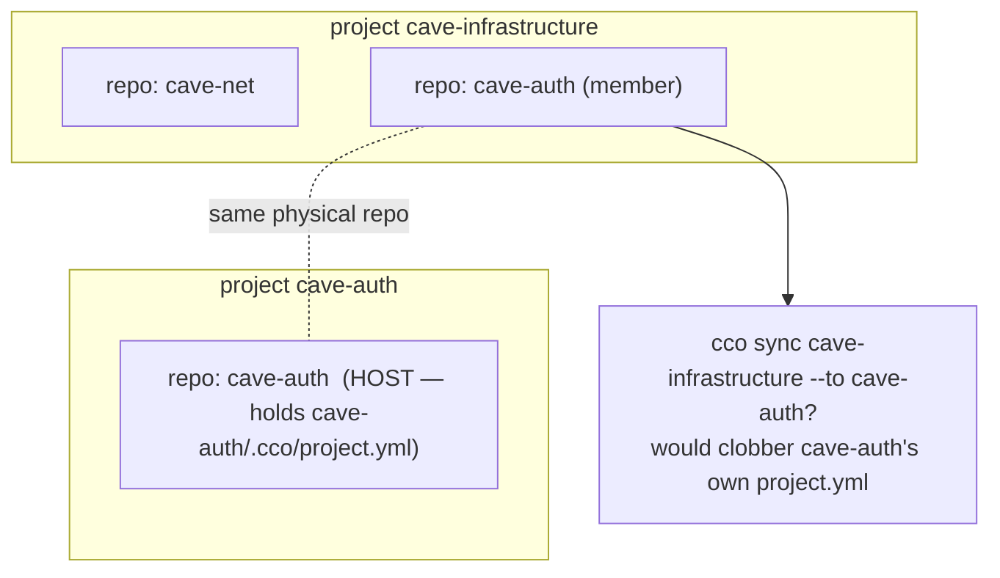

# RD-repo-multi-project — a repo referenced by multiple projects (dedicated analysis)

**Status**: **OPEN — analysis not started.** Surfaced 2026-06-22 during the Phase-2
preliminary analysis (it had not emerged in any prior analysis/review). **Gates Phase-2
implementation** (it can change the "final" `project.yml` shape/layout that P2 writes
build-once). Run in its **own clean session** before P2 design is finalized; open by
reading `guiding-principles.md` (P1–P17) + this file. Decision affects **how the toolkit
is used** → **maintainer confirmation required** (P10 method-lesson b).

---

## 1. Problem

A repo can be a member of **more than one project**. Example: the `cave-auth` repo is a
member of project **`cave-infrastructure`** *and* is the host of project **`cave-auth`**.

In the decentralized model each repo has exactly **one** `<repo>/.cco/` holding **one**
`project.yml`. So: **which project's config does `cave-auth/.cco/project.yml` hold, and
what happens to `cco sync` and `cco start` when a repo participates in two projects?**

**Hard constraint (maintainer):** *1 repo referenced by different projects must keep
working.* The question is whether `<repo>/.cco` holds **one** project config or **N**.

## 2. What the current design already says (and the gap)

- **Index supports multi-membership** (§3 / ADR-0022 D2): *"a repo used by two projects =
  one [path] entry"*; the repo appears in several `projects: { <name>: { repos: [...] } }`
  lists. **Path resolution of a multi-referenced repo is already handled.**
- **Symmetric model** (§2.4): *"`project.yml` … identical in every repo"* — implicitly
  assumes **1 repo ⇒ 1 project**. This is the unstated assumption that breaks.
- **`cco sync`** (§4.1): copies a source repo's `.cco/` set (`project.yml` + `claude/**`)
  into target member repos. **No guard** against overwriting a target that hosts a
  *different* project.
- **Cases A/B/C** (§4.5): Case A = config only in the host repo; Case B = synced copies
  identical across members; Case C = intentional divergence. None address a member repo
  that is itself another project's host.

**The gap is narrow:**
- **Case A → no conflict.** `cave-auth` (member of `cave-infrastructure`) carries only its
  *own* project's `.cco/`; `cave-infrastructure` references it via the index. Multi-reference
  works today.
- **Case B → real conflict.** Replicating `cave-infrastructure`'s `.cco/` into `cave-auth`
  **clobbers** the `cave-auth` project's `project.yml`.
- **`cco start` cwd-first** from `cave-auth/` is **ambiguous** if the repo could mean two
  projects (likely answer: the project it *hosts*, but undecided).

## 3. Candidate options (to analyse, not yet decided)

| # | Shape | Schema change? | Sync semantics | Notes |
|---|-------|----------------|----------------|-------|
| **1** | `<repo>/.cco/project.yml` holds **exactly one** project (the repo's host project); other projects **reference** it via the index only | **No** | `cco sync 
` **skips with a warning** any member repo that hosts a *different* project — never clobbers | Preserves build-once for P2; multi-reference via index; a shared member loses Case-B symmetric resilience for that repo |
| **2** | `<repo>/.cco/` holds **N** projects (e.g. `projects/<name>.yml`) | **Yes** | sync targets a specific project file; `start` picks by name/cwd | Full multi-membership; **breaks the "final schema" → impacts P2 build-once** (P2 would write a non-final shape) |
| **3** | Hybrid: a repo is a **sync-member of ≤1** project, **reference-member of N** | Maybe | one sync set per repo; explicit which project "owns" the committed `.cco/` | Middle ground; needs a rule for choosing the owning project |

## 4. Constraints / invariants the resolution must honour

- **Multi-reference must keep working** (maintainer hard constraint).
- **Build-once / no double schema-migration** — if the answer changes the `project.yml`
  shape/layout, P2's migration-writer must emit the **final** shape (so this must land
  **before** P2 implementation).
- **AD3/G8** — committed config stays machine-agnostic (logical names + coordinates), truthful `git diff`.
- **`cco sync` must never silently clobber** a repo that hosts a different project (the new guard).
- **`cco start` cwd resolution** must be unambiguous from any repo dir (AD6).
- **Index stays global-flat by name** (ADR-0022 D2) — already multi-membership-capable.

## 5. Impact / why it gates Phase 2

P2 *"writes the complete final `project.yml` in one pass"* (build-once). If the resolution
is Option 2 (or any schema/layout change), P2 writing the single-project shape now would
force a second schema-migration later — a direct **build-once violation**. P2's migration
writer **and** `cco sync`/`cco start` semantics depend on this decision. → **Resolve before
P2 design is finalized.**

## 6. Reading order for the analysis session

1. `guiding-principles.md` (P1–P17, esp. P10 method). 2. This file. 3. `design.md`
§2.4 (symmetric model), §3 (index/multi-membership), §4.1/§4.4/§4.5 (sync + cases),
§9 P2 (the migration writer that depends on the outcome). 4. ADR-0001/0002 (decentralization,
machine-agnostic symmetry) + ADR-0022 D2 (global-flat index). 5. Code: `lib/cmd-sync.sh`
(the copy + the missing clobber-guard), `lib/cmd-start.sh` `_start_resolve_project` (cwd
resolution), `lib/index.sh` (`projects:` membership), `lib/cmd-resolve.sh`. 6. The Phase-2
handoff `P2-handoff-migration-bootstrap.md` (so the resolution feeds the migration writer).

## 7. Deliverable

An **ADR** (next free = 0024) resolving the one-vs-N question + the `cco sync` clobber-guard
+ the `cco start` cwd rule, with **maintainer confirmation** on the UX/model choice; then
propagate to living `design.md` (§2.4/§3/§4) + the P2 handoff before P2 implementation.
