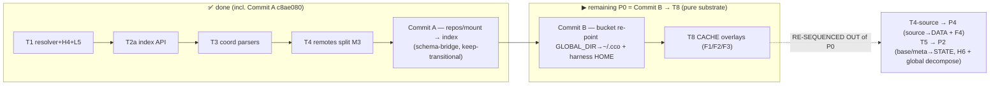

# Z — Phase-0 implementation **resume cursor**

**Status (2026-06-19):** implementation is **in progress, Phase 0 (substrate)**. Four atomic commits
landed on `feat/vault/decentralized-config`, suite **985 passed / 2 failed** (the 2 are pre-existing
baseline drift, NOT this work — see §4). Working tree clean. Commits are **local** (pushed from the
maintainer's Mac).

> This file is the **resume cursor** — where we are and what to do next. The **method, phase map, and
> invariants** live in **`Y-handoff-implementation.md`** (still authoritative — read it for the "how").
> Read Y for method; read this for position.

---

## 1. Cursor — what is done

| Step | Commit | What landed | Tests |
|---|---|---|---|
| **T1** | `ff8278b` | XDG 4-bucket resolver (`lib/paths.sh`): `_cco_{config,data,state,cache}_dir`, `CCO_*_HOME`>`XDG_*_HOME/cco`>default, `0700`; **H4** anti-in-container guard + escape hatch; **L5** symlink-safe `bin/cco` self-location | +8 |
| **T2a** | `d913e5c` | `lib/index.sh` — machine-local STATE index API (`paths:` name→abs + `projects:` members), atomic `mktemp`+`mv`, global-flat (H7), `_index_path_conflicts` for AD5. Additive (sourced, not wired) | +9 |
| **T3** | `992738d` | Final coordinate parsers in `lib/yaml.sh`: `yml_get_repo_coords`/`yml_get_mount_coords`/`yml_get_pack_coords`; `yml_get_packs` now map+string; `yml_get_llms` +url. **Additive** — legacy `yml_get_repos`/`yml_get_extra_mounts` untouched | +7 |
| **T4-remotes** | `2bdf80e` | M3 remotes split: url→DATA `<data>/cco/remotes`, token→STATE `<state>/cco/remotes-token` (0600). `setup_cco_env` now exports `CCO_{DATA,STATE,CACHE}_HOME`+`CCO_ALLOW_HOST_RESOLVE` (additive) | rewrite |
| **Commit A** | `c8ae080` | repos/mount resolution wired to the STATE index via a **transitional schema-bridge** (per-section: legacy `- path:`/`- source:` ⇒ legacy chain; logical-name ⇒ index) + **keep-transitional** @local plumbing (NOT deleted — kept for vault/publish until P3/P4). `local-paths.sh` bridge emitters + `_resolve_entry_index`; cmd-start/workspace/cmd-project-query bridged; harness `minimal_project_yml`→new schema + `seed_index_path`; +6 index tests. **DEVIATES from this file's §3 literal scope** (see §2.5 / Z2-superseding note below) | 991/2 |

## 2. Decisions LOCKED this session (do not re-litigate)

1. **H4 guard** = full ADR-0007 guard (`$HOME=/home/claude` OR `/.dockerenv` ⇒ abort) **+ documented
   escape hatch `CCO_ALLOW_HOST_RESOLVE=1`** for tests/dev only. This dev container looks like a session
   container, so the harness MUST set the hatch (it does, via `setup_cco_env`).
2. **Green-per-phase = DELTA-based** (each step adds ZERO new failures; green at the P0 boundary).
3. **T3 boundary refined**: coordinate parsers are built additively now; the **repos/extra_mounts
   path→index cutover** (deleting the legacy path-based parsers + rewiring their 23 consumers) lands in
   **Commit A/B**, because that change is co-dependent with the resolution/mount/harness rewire.
4. **Cutover style = FEW LARGE COORDINATED COMMITS** (not expand-contract, not red intermediates): the
   repos/mount/bucket/harness change is co-dependent (can't flip fixtures to the new schema without code
   reading it, and vice versa), so it lands as 1–2 large commits that are green before and after.

## 3. Remaining P0 — detailed scope

**Remaining P0 = Commit B → T8 (pure substrate); Commit A is DONE (`c8ae080`).** Both "internal-artifact
relocation" items (T4-source, T5) are re-sequenced OUT of P0 (their tests are hardcoded in later phases —
see below). **Start with Commit B (dedicated launch handoff `Z3-handoff-commit-b.md`).**

- **T4-source — RE-SEQUENCED to P4 (maintainer-confirmed 2026-06-19, Option B).** The `source`→DATA
  relocation + key-rename (`url`/`ref`/`resource`) + `commit`/`version`→STATE-meta + `publish_target`
  re-derivation (F4, ADR-0022 D1) is **no longer a P0 item**. Code-grounded reason: its read/write sites
  are the sharing/update commands whose **~100 hardcoded `.cco/source` test assertions**
  (`test_publish_install_sync` 53, `test_pack_internalize` 16, `test_pack_install` 13,
  `test_pack_publish`/`test_project_publish` 5 each) are rewritten in **P4–P5**; relocating in P0 would
  add ~100 new failures, breaking delta-green. Nothing in P0–P3 needs `source` in DATA — the P2 pack-`url`
  backfill reads provenance **in place**. Persisted: `design.md` §9 (P0 note, P2, P4) + §11; ADR-0022 D1
  forward-annotated (decision unchanged, build phase P0/P2→P4). The handoff's original T4-source
  caller-map omitted the test files (the §5 trap) — recon caught it before any code was written.
- **T4-tags**: **DEFERRED to P3** — the DATA `tags.yml` registry has no consumer until `cco tag add/rm` +
  `cco list --tag` are wired (P3). Nothing to build in P0.
- **T5 — RE-SEQUENCED to P2 (maintainer-confirmed 2026-06-19).** Relocate merge-engine artifacts
  `.cco/base/` + `.cco/meta` → STATE `/update` (`lib/paths.sh` helpers `_cco_project_meta`/
  `_cco_project_base_dir` + global/pack variants; merge *logic* unchanged). **Not P0.** Reason: its tests
  are hardcoded across **P2** (`test_update`, ~122 global+project `.cco/{meta,base}` refs) **and P4–P5**
  (`test_publish_install_sync`, ~40 project refs) — relocating in P0 breaks delta-green. Nothing in P0–P1
  needs base/meta in STATE; the **P2 migration creates base/meta** → relocate there in final form
  (build-once) + co-locate with `test_update`'s P2 rewrite. The **global `.cco/meta` is a DECOMPOSE** (not
  just relocate; ADR-0013 D4): `languages`→`~/.cco`, `last_seen`/`last_read`→STATE top-level, `schema_
  version`/policies→**`<state>/cco/global/update/`** (new home, pinned — filled the §2.2/ADR-0016-D6 gap),
  `manifest:` dropped. `test_publish_install_sync` meta/base refs get a P2 spot-fix (full rewrite P4).
  Persisted: `design.md` §2.2 + §9 (P0 note, P2) + §11; ADR-0016 D6 forward-annotated. H6/ADR-0016 D5.
- **Commit A ✅ DONE (`c8ae080`, 2026-06-19): repos/mount resolution wired to the STATE index.** The
  end-state matches the design, but **TWO maintainer-confirmed refinements changed HOW** (vs the bullets
  that originally stood here — see Z2 §4 + the vault progress memory):
  - **Keep-transitional, NOT delete.** The `@local`/sanitize/extract/restore/`local-paths.yml` plumbing in
    `local-paths.sh` was **NOT deleted**, and the sanitize calls in `cmd-vault.sh`/`cmd-project-publish.sh`
    were **NOT neutralized** — deleting now breaks vault/publish tests that assert `@local` and are
    scheduled for P3/P4 → delta-green break. They stay alive (consumed only by vault/publish) and die in **P3/P4**.
  - **Transitional per-section schema bridge, NOT "no dual-read".** `§9 "no dual-read"` vs `§11 "delta-green
    with only test_local_paths rewritten"` were contradictory: ~12 P3/P4/P5 test files pass OLD-schema
    fixtures to `cco start`/resolve. The resolver/mount-gen detect schema per section
    (`yml_get_repos`/`yml_get_extra_mounts` non-empty ⇒ legacy chain; empty ⇒ `yml_get_repo_coords`/
    `yml_get_mount_coords` + STATE index). Collapses to index-only when legacy dies (P3/P4); final shipped
    state is index-only (honors §9 intent). Bridge emitters `_effective_repo_mounts`/`_effective_extra_mounts`
    + `_resolve_entry_index` in `local-paths.sh`; cmd-start/workspace/cmd-project-query read via the bridge.
  - `tests/helpers.sh`: `minimal_project_yml`→new schema + `seed_index_path` seeds `dummy-repo` in
    `setup_cco_env`. `test_local_paths.sh` = **ADDED** index-resolution tests (NOT rewritten — @local funcs
    kept). Coord reads use tab-PEEL splitting (`IFS=$'\t' read` collapses empty middle fields → mis-assigns
    a name-only mount's target/readonly).
  - Both deviations follow the **Z §5 transitional precedent** (vault-git mirror kept till P3). **Do NOT**
    "fix" them by deleting early — that re-breaks delta-green. They are removed in P3/P4 by design.
- **Commit B** (BIG, coordinated): bucket re-point. **← NEXT (see `Z3-handoff-commit-b.md`).**
  - `lib/cmd-start.sh` / `lib/cmd-new.sh`: final host-absolute mount map — `claude-state`→STATE,
    `memory`→STATE, `.cco/managed`→CACHE (`:ro`), global config/`secrets.env`/`mcp.json`→`~/.cco`;
    `GLOBAL_DIR`→`~/.cco`; `secrets.sh:load_global_secrets` re-pointed. **Container side of
    `entrypoint.sh` UNCHANGED** (compose↔entrypoint container-path contract = invariant).
  - `tests/helpers.sh`: `setup_cco_env` sets `HOME=$tmpdir/home` (to redirect `~/.cco`) and drops the
    legacy `CCO_*_DIR` exports. (Careful: changing HOME globally — verify no test depends on real HOME.)
- **T8**: carried RD-claude-mount (ADR-0005) — generate `packs.md`/`workspace.yml` into CACHE + overlay
  `:ro` (F1); reserve `packs/`/`llms/` + cross-tree collision warning (F2); parent rw, overlays `:ro` (F3).

## 4. The 2 known baseline failures — DO NOT re-investigate

These predate ALL implementation (confirmed by stashing T1 and re-running on the clean baseline). They
live in files the §11 teardown rewrites later; they get fixed THEN, not now:

- `test_update / test_update_migrations_run_in_order` — asserts `schema_version: 11`, code reaches `14`
  (stale test after new migrations were added). → rewritten in **P2**.
- `test_llms / test_resolve_name_from_full_variant_url` — derives `example-react`, asserts `react`
  (name-derivation vs stale expectation). → rewritten in **P4–P5**.

"Delta-green" means: after each step, the FAIL set is exactly these two. Any third failure = a regression
you introduced — fix it before committing.

## 5. Gotchas / lessons (carry forward)

- **Validate on the FULL suite, not just the mapped callers.** T4 removed the remotes vault-git sync;
  the public-API caller map (5 callers) was clean, but `cco vault remote/push/pull/status` was a **hidden
  consumer** relying on the git side-effect → 4 vault tests regressed. Fix: the **vault-git mirror is KEPT
  transitional** (removed in P3 with the vault). Lesson: a "clean caller map" can miss side-effect
  consumers — run `./bin/test` (full) after every cutover.
- **The harness already exports the 4-bucket env additively** (`CCO_{DATA,STATE,CACHE}_HOME` +
  `CCO_ALLOW_HOST_RESOLVE`) alongside legacy `CCO_*_DIR`. Commit B removes the legacy `CCO_*_DIR` and adds
  `HOME` override; until then both coexist.
- **Coordinate parsers exist but are not yet consumed.** `yml_get_repo_coords`/`mount_coords`/`pack_coords`
  are built (T3); the legacy `yml_get_repos`/`yml_get_extra_mounts` still serve their consumers until
  Commit A deletes them. Use the `*_coords` parsers in Commit A.
- **Index is wired-ready but unwired.** `lib/index.sh` is sourced in `bin/cco` and fully tested; nothing
  calls it yet. Commit A is where resolution starts reading/writing it.

## 6. Working agreement (unchanged — see Y §1–§2)

bash-3.2 clean (awk, no `declare -A`, guard empty arrays under `set -u`) · commits **local**, push from
Mac · **self-dev caveat**: edits to `Dockerfile`/`config/entrypoint.sh`/`config/hooks/*` are NOT active
in-session (test via `cco build && cco start`) · **doc-lifecycle** (`.claude/rules/documentation-lifecycle.md`):
shipped-behavior docs ride the Phase-3 cutover sweep, never rewrite ahead of code · pause & discuss on a
real design/sequencing gap (design FROZEN).

## 7. Reading order for the resume session

1. **This file** (cursor). 2. `Y-handoff-implementation.md` (method + full P0–P5 map + invariants).
3. `design.md` **§2.2/§2.4/§3** (buckets/schema/index), **§9** (P0–P5 build script), **§11** (test plan +
existing-suite teardown). 4. ADRs **0007/0015/0016** (buckets/taxonomy), **0022** (coordinate/source/index),
**0009/0010** (memory/tags) for the cutover. 5. The code touched so far: `lib/paths.sh`, `lib/index.sh`,
`lib/yaml.sh`, `lib/cmd-remote.sh`, `tests/helpers.sh`. 6. Personal progress note (vault memory):
`decentralized-config-impl-progress.md`.

## 8. Start here

Next free ADR = **0024** (none needed for Commit-B/T8 unless a new decision surfaces). **Commit A is DONE
(`c8ae080`); the next clean session executes Commit B via its dedicated launch handoff →
`Z3-handoff-commit-b.md`** (source-of-truth refs + mandatory preliminary analysis + scope with exact
symbols). Begin with the coordinated **Commit B** (bucket re-point `GLOBAL_DIR`→`~/.cco` + host-absolute
STATE/CACHE mounts + harness `HOME` — the big breaking cutover; recon its consumers + harness flip first,
per §5), keep the suite delta-green (the 2 baseline failures only), commit atomically. Then **T8**. **Both
relocation items are re-sequenced OUT of P0** (§3): **T4-source → P4** (source→DATA + F4), **T5 → P2**
(base/meta→STATE, H6 + global decompose). Pause and discuss if a real design gap surfaces; otherwise the
ADRs/design are the spec.
