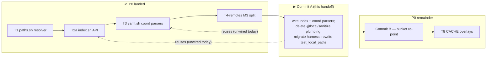

# Z2 — Commit A launch handoff (repos/mount schema cutover)

**Purpose.** Launch **Commit A** in a fresh, clean session. Commit A is the next concrete step of the
decentralized-config implementation (**Phase 0 / substrate**). This file is self-contained: it names the
**source-of-truth** documents you must respect, the **context** to load, a **mandatory preliminary
analysis** to run *before* writing any code, the **scope** with exact symbols, the **working agreement**,
and the **invariants**. Produced 2026-06-19 on `feat/vault/decentralized-config` (commits **local** —
the maintainer pushes from the Mac).

> **Where this sits.** P0 remaining work = **Commit A → Commit B → T8** (pure substrate). The two
> "internal-artifact relocation" items were re-sequenced **out of P0** after code-grounded recon
> (their tests are hardcoded in later phases): **T4-source → P4**, **T5 → P2**. So your P0 job is the
> two harness-driven coordinated cutovers (Commit A, then Commit B) plus T8. Start with **Commit A**.



---

## 1. SOURCE OF TRUTH — always respect, never silently diverge

These are the frozen specification. If implementation reveals a **genuine** design/sequencing gap,
**pause and discuss** (workflow rule + the §5 lesson below) — do not improvise around it. Otherwise the
documents below are the spec.

- **`guiding-principles.md`** — the foundational principles **P1–P17**. Every decision must be coherent
  with them. Most relevant to Commit A: **P1** (config vs internal — edit criterion), **P6** (hide
  internal; never in a config bucket), **P12** (referenced-resource coordinates are config, embedded
  per-unit), **P2** (destination taxonomy / 4 buckets).
- **`design.md`** — the living design (single source of truth alongside `requirements.md`). For Commit A
  read **§2** (layout: 2.1 in-repo config, 2.4 `project.yml` schema + coordinate semantics), **§3**
  (machine-agnostic config + the **index**: AD5 uniqueness, `cco resolve`/`--scan`, `@local` gone),
  **§5** (`@local` resolution reused, index-backed), **§9 Phase 0** (the build script), **§11** (test
  plan + existing-suite teardown).
- **ADRs** (`decisions/`, frozen history — read, never rewrite): **0001** decentralized-in-repo,
  **0002** machine-agnostic committed config (symmetric `project.yml`, truthful `git diff`), **0003**
  sync-as-copy, **0007/0015/0016** buckets + 4-bucket taxonomy, **0014/0016 D2/0022** the coordinate
  model (`name`+`url`+`ref`/`variant`, index maps `name→path`), **0023 D5** extra_mounts schema
  (`name`+optional `url`/`ref`/`target`/`readonly`). ADRs **0016 D4** (index subsumes `@local` +
  `local-paths.yml`) and **0022 D2** (index global-flat, atomic `mktemp`+`mv`, no-lock, H7) are the
  direct authorities for Commit A.

> Memory aid: **config decentralizes; internal centralizes keyed-by-identity.** A real path is internal
> machine-local → it lives in the **STATE index**, *never* in committed `project.yml` (AD3/G8 — `git
> diff` is always truthful).

## 2. Context to load first (reading order)

1. **`guiding-principles.md`** (P1–P17). 2. **`Y-handoff-implementation.md`** (the build method +
full P0–P5 map + cross-cutting invariants — the "how"). 3. **`Z-handoff-p0-resume.md`** (the P0 resume
cursor: what landed, the **2 baseline failures**, the **§5 gotcha**, and the Commit-A/B/T8 scope).
4. **`design.md` §2/§3/§9/§11** (above). 5. The load-bearing **ADRs** (above). 6. Personal progress note
(maintainer vault memory): `decentralized-config-impl-progress.md`.

## 3. MANDATORY preliminary analysis (verify code + current state BEFORE editing)

Do this **first**, in the clean session, to rebuild the necessary context. Do **not** start editing
until it is done — Commit A is a co-dependent breaking cutover; a partial mental model causes regressions.

1. **Confirm the baseline is green-as-expected.** `git status` (clean, on `feat/vault/decentralized-config`),
   then run the **full suite** `./bin/test` and confirm **985 passed / 2 failed**, where the 2 are exactly
   the known baseline drift (`test_update_migrations_run_in_order` schema_version, `test_llms`
   name-derivation — see Z §4). If a third failure exists, stop and investigate before touching anything.
2. **Map the FULL consumer set (the §5 lesson — include tests + side-effect consumers).** The legacy
   parsers Commit A deletes are `yml_get_repos` / `yml_get_extra_mounts`:
   ```bash
   grep -rn 'yml_get_repos\|yml_get_extra_mounts' lib/ tests/
   grep -rn '@local\|local-paths\.yml\|_sanitize_project_paths\|_extract_local_paths\|_restore_local_paths' lib/ tests/
   ```
   Build a complete writer/reader/consumer table **including the test files** before editing. (The
   handoffs that listed only `lib/` callers are what caused two earlier mis-scopings — do not repeat it.)
3. **Read the actual current code** (do not trust line numbers — they drift):
   - `lib/local-paths.sh` — the `@local`/sanitize/extract/restore + `.cco/local-paths.yml` plumbing to
     **delete**, and the resolution functions to **rewire** to the index (see §4).
   - `lib/cmd-start.sh`, `lib/workspace.sh` — mount generation that consumes `yml_get_repos`/
     `yml_get_extra_mounts` (path:name emitters).
   - `lib/cmd-project-query.sh` (`cco resolve`/`--show`), `lib/cmd-vault.sh` (sanitize/extract calls).
   - `lib/index.sh` — the **already-built, unwired** STATE index API you will wire:
     `_index_get_path` / `_index_set_path` / `_index_remove_path` / `_index_list_paths` /
     `_index_path_conflicts` (AD5) / `_index_get_project_repos` / `_index_set_project_repos`.
   - `lib/yaml.sh` — the **already-built, unwired** coord parsers you will consume:
     `yml_get_repo_coords` (name+url+ref), `yml_get_mount_coords` (name+url+ref+target+readonly),
     `yml_get_pack_coords`.
   - `tests/helpers.sh` — `minimal_project_yml` (emits the **old** `repos:\n  - path:` schema) +
     `setup_cco_env` + `create_project`; and `tests/test_local_paths.sh` (885 lines, index-model rewrite).
4. **Confirm the invariants** (§6) and the **delta-green contract** (§5) before the first edit.

## 4. Commit A — scope (the plan; confirm against the code you just read)

**Style: ONE large coordinated breaking cutover** (AD12 — no dual-read, no deprecation window). The
schema flip and the code reading it are co-dependent (you cannot flip the fixtures without the code, and
vice versa), so this lands as a single commit that is **green before and after**. New layout only.

- **`lib/local-paths.sh`**: **delete** the `@local` / `_sanitize_project_paths` / `_extract_local_paths`
  / `_restore_local_paths` / `_write_local_paths` / `_local_paths_get/set` / `_update_yml_path`
  (`.cco/local-paths.yml`) plumbing. **Rewire** resolution (`_resolve_entry`, `_resolve_project_paths(_impl)`,
  `_resolve_start_paths`, `_resolve_installed_paths`, `_resolve_all_local_paths`,
  `_project_effective_paths`, `_assert_resolved_paths`) to read the **STATE index** (T2a) for paths and
  `yml_get_repo_coords` / `yml_get_mount_coords` (T3) for names/coords. **Keep** the interactive prompt
  UI (`_prompt_for_path`, `_get_repo_url`) but redirect its storage to `_index_set_path`. Because no real
  path is ever written to `project.yml`, there is nothing to sanitize and `git diff` stays truthful
  (AD3/G8).
- **`lib/cmd-start.sh` / `lib/workspace.sh`**: rewire mount-gen to read repo/mount **names** (via the
  coord parsers) + look up absolute paths in the index. **Delete** the `yml_get_repos` /
  `yml_get_extra_mounts` path:name emitters once their last consumer is gone.
- **`tests/helpers.sh`**: migrate `minimal_project_yml` to the **new schema** (`name` + `url?`/`ref?`)
  **and seed the index** (the co-dependent flip — fixtures must match the code). Other tests built on the
  harness flip with it (§11: harness migrates first).
- **Neutralize** the `_sanitize_project_paths` / extract-restore calls in `cmd-vault.sh` and
  `cmd-project-publish.sh` (no-op under AD3; the vault itself is deleted later in **P3**, so keep it
  runnable, not pretty).
- **Rewrite `tests/test_local_paths.sh`** to the index model (it is a P0 rewrite per §11).
- **`cco resolve`** = today's `cco project resolve` (kept as the familiar verb; `cmd-project-query.sh`).
  `--scan` upsert / clone-from-`url` resolution land in **P1** — Commit A only needs the index-backed
  path lookup + the interactive prompt redirected to the index. Keep P1 surface out of this commit.

> **Watch for side-effect consumers** (the lesson that bit T4-remotes): a "clean public-API caller map"
> can miss a hidden consumer that relied on a side effect. After every change, run the **full** `./bin/test`,
> not just the files you think you touched.

## 5. Working agreement & the delta-green contract

- **Delta-green (strict).** After Commit A the failing set must be **exactly the 2 known baseline
  failures** (Z §4). Any third failure is a regression you introduced — fix it before committing. Run the
  full `./bin/test` before and after.
- **Atomic commit, local.** Commit when green; the maintainer pushes from the Mac. Branch
  `feat/vault/decentralized-config` (per `.claude/rules/git-workflow.md` — feature branches off
  `develop`; `main` only for release). Conventional-commit message; end with the `Co-Authored-By` trailer.
- **bash 3.2 / macOS `/bin/bash`.** No `declare -A`; guard empty arrays under `set -u`
  (`${arr[@]+"${arr[@]}"}`); awk for parsing; no Homebrew-bash features (`coding-conventions.md`). The new
  awk parsers (T3) and index (T2a) are already bash-3.2-clean — keep your wiring the same.
- **Self-development caveat** (`/workspace/.claude/CLAUDE.md`): edits to `Dockerfile`,
  `config/entrypoint.sh`, `config/hooks/*` are **NOT active** in the running session (test via `cco build
  && cco start`). Commit A touches none of these container files; the **container side of
  `entrypoint.sh` is an invariant** anyway (see §6).
- **Doc lifecycle** (`.claude/rules/documentation-lifecycle.md`): shipped-behavior docs (README, guides,
  tutorial, FRs) ride the **Phase-3** cutover sweep — **do not** rewrite them ahead of the code. Commit A
  is code + tests + (if a decision changes) the design/ADRs only.

## 6. Invariants (never violate)

- **AD3 / G8** — no real path ever enters committed `project.yml`; `git diff` is always truthful. The
  index (`<state>/cco/index`, machine-local STATE) is the sole home of `name→absolute-path`.
- **AD5 uniqueness** — one logical name → one absolute path per machine; `_index_path_conflicts` enforces
  it (warn + keep-existing on conflict; never silent overwrite).
- **Index is global-flat for v1** (one machine-global `paths:` map; a repo used by two projects = one
  entry); per-project namespacing is **reserved post-v1** (ADR-0022 D2). Atomic write `mktemp`+`mv`,
  single-writer, **no file lock** (H7).
- **compose↔entrypoint container-path contract** — the container side of `entrypoint.sh` consumes fixed
  container paths; Commit A only changes **host-side** mount sources/resolution. Do not touch the
  container paths.
- **Host-side resolver guard (H4)** — paths resolve host-side only; the test harness sets
  `CCO_ALLOW_HOST_RESOLVE=1` (this dev container looks like a session container). Real hooks never set it.

## 7. After Commit A (for context — not this commit)

- **Commit B** (bucket re-point): final host-absolute mount map — `claude-state`→STATE, `memory`→STATE,
  `.cco/managed`→CACHE (`:ro`), global config/`secrets.env`/`mcp.json`→`~/.cco`; `GLOBAL_DIR`→`~/.cco`
  for `cco start` **and** `cco new`; `secrets.sh:load_global_secrets` re-pointed; container side of
  `entrypoint.sh` UNCHANGED. Harness `setup_cco_env` sets `HOME=$tmpdir/home` and drops legacy
  `CCO_*_DIR` exports. (Folds the old T6+T7-HOME.)
- **T8** (carried RD-claude-mount, ADR-0005): generate `packs.md`/`workspace.yml` into CACHE + overlay
  `:ro` (F1); reserve `packs/`/`llms/` + cross-tree collision warning (F2); parent rw, overlays `:ro` (F3).
- **Re-sequenced out of P0:** **T5 → P2** (`.cco/base`+`.cco/meta` → STATE, H6, + global-meta decompose;
  see design §9 P2, ADR-0016 D6 forward-annotation), **T4-source → P4** (source→DATA + F4; design §9 P4,
  ADR-0022 D1 forward-annotation). Do **not** pull these into Commit A.

## 8. Start here

After the §3 preliminary analysis (baseline green, full consumer map, code read, invariants confirmed),
implement Commit A as one coordinated cutover, keep the suite delta-green, and commit atomically. Then
proceed to Commit B, then T8. Pause and discuss if a real design/sequencing gap surfaces; otherwise the
ADRs / `design.md` / `guiding-principles.md` are the spec. Next free ADR = **0024**.
