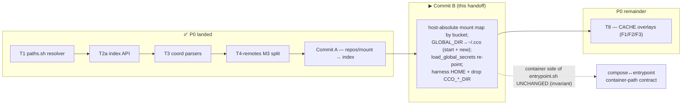

# Z3 — Commit B launch handoff (bucket re-point)

**Purpose.** Launch **Commit B** in a fresh, clean session. Commit B is the next concrete step of the
decentralized-config implementation (**Phase 0 / substrate**), after **Commit A** (`c8ae080`) wired
repos/mount resolution to the STATE index. This file is self-contained: it names the **source-of-truth**
documents you must respect, the **context** to load, a **mandatory preliminary analysis** to run *before*
writing any code, the **scope** with exact symbols, the **working agreement**, and the **invariants**.
Produced 2026-06-19 on `feat/vault/decentralized-config` (commits **local** — the maintainer pushes from
the Mac).

> **Where this sits.** P0 remaining work = **Commit B → T8** (pure substrate). The two
> "internal-artifact relocation" items were re-sequenced **out of P0** (their tests are hardcoded in later
> phases): **T4-source → P4**, **T5 → P2**. So your P0 job is the bucket re-point (Commit B) plus T8. Start
> with **Commit B**.



---

## 1. SOURCE OF TRUTH — always respect, never silently diverge

These are the frozen specification. If implementation reveals a **genuine** design/sequencing gap,
**pause and discuss** (workflow rule + the §5 lesson) — do not improvise around it. Otherwise the documents
below are the spec.

- **`guiding-principles.md`** — foundational principles **P1–P17**. Most relevant to Commit B: **P2**
  (destination taxonomy / 4 buckets: CONFIG `~/.cco` + DATA/STATE/CACHE), **P6** (hide internal; never in a
  config bucket).
- **`design.md`** — the living design. For Commit B read **§2.2** (internal buckets DATA/STATE/CACHE —
  what belongs where), **§9 Phase 0** (the **BL3 "compose generation, final mount map"** bullet — the exact
  per-mount bucket destinations + the host-absolute conversion + the global-secrets/OAuth env re-point + the
  "container side of `entrypoint.sh` is unchanged" invariant), and **§11** (the Phase-0 test row: "compose
  mount bucket map (BL3)" + "secrets/OAuth env-injection re-point").
- **ADRs** (`decisions/`, frozen history — read, never rewrite): **0005** (RD-claude-mount — the
  claude-state/memory/CACHE-overlay model T8 carries), **0007/0015/0016** (the 4-bucket taxonomy:
  CONFIG=`~/.cco`, DATA=`$XDG_DATA_HOME/cco`, STATE=`$XDG_STATE_HOME/cco`, CACHE=`$XDG_CACHE_HOME/cco`).

> Memory aid: **config decentralizes; internal centralizes keyed-by-identity.** Per-machine session state
> (transcripts, memory) is **STATE**; regenerable framework output (`.cco/managed`, `packs.md`,
> `workspace.yml`) is **CACHE**; personal global config (`~/.cco`) is **CONFIG**. The committed repo `.cco/`
> stays machine-agnostic config (AD3/G8).

## 2. Context to load first (reading order)

1. **`guiding-principles.md`** (P1–P17). 2. **`Y-handoff-implementation.md`** (the build method + full
P0–P5 map + cross-cutting invariants — the "how"). 3. **`Z-handoff-p0-resume.md`** (the P0 resume cursor:
what landed incl. **Commit A**, the **2 baseline failures**, and the **Commit-A deviations you must NOT
undo** — keep-transitional @local plumbing + the transitional schema-bridge). 4. **`design.md` §2.2/§9
Phase 0 (BL3)/§11** (above). 5. The load-bearing **ADRs** (above). 6. Personal progress note (maintainer
vault memory): `decentralized-config-impl-progress.md` (the "Commit A ✅" entry records the exact
deviations + the gotchas).

## 3. MANDATORY preliminary analysis (verify code + current state BEFORE editing)

Do this **first**, in the clean session, to rebuild context. Do **not** start editing until it is done —
Commit B is a co-dependent breaking cutover (compose host-source re-point + harness `HOME`/env flip land
together); a partial mental model causes regressions.

1. **Confirm the baseline is green-as-expected.** `git status` (clean, on `feat/vault/decentralized-config`
   — note the pre-existing unstaged deletion of `S-handoff-sharing-unification.md` is the maintainer's, not
   yours; leave it), then run the **full suite** `CCO_ALLOW_HOST_RESOLVE=1 ./bin/test` and confirm
   **991 passed / 2 failed / 993 total** — the new post-Commit-A baseline (Commit A added 6 index tests).
   The 2 failures are exactly the known baseline drift (`test_update_migrations_run_in_order` schema_version,
   `test_resolve_name_from_full_variant_url` llms name-derivation — Z §4). A third failure ⇒ stop and
   investigate before touching anything.
2. **Map the FULL consumer set (the §5 lesson — include tests + side-effect consumers).** The host-side
   sources Commit B re-points are everything anchored at `GLOBAL_DIR` and the relative `./…` compose mounts:
   ```bash
   grep -rn 'GLOBAL_DIR' lib/ bin/cco                       # 12 lib files + bin/cco define/use it
   grep -rn '\./\.cco/claude-state\|\./memory\|\./\.cco/managed\|--project-directory' lib/cmd-start.sh
   grep -rn 'GLOBAL_DIR\|claude-state\|/memory\|\.cco/managed' lib/cmd-new.sh
   grep -rn 'load_global_secrets\|GLOBAL_DIR' lib/secrets.sh
   grep -rn 'CCO_GLOBAL_DIR\|CCO_PROJECTS_DIR\|CCO_PACKS_DIR\|CCO_TEMPLATES_DIR\|CCO_LLMS_DIR\|HOME=' tests/
   ```
   Build a complete writer/reader/consumer table **including the test files** before editing. `GLOBAL_DIR`
   is defined in **`bin/cco:36/42`** (`${CCO_GLOBAL_DIR:-…}`) and consumed in `utils.sh`, `cmd-update.sh`,
   `secrets.sh`, `cmd-new.sh`, `cmd-init.sh`, `cmd-clean.sh`, `cmd-project-create.sh`, `update.sh`,
   `paths.sh`, `update-hash-io.sh`, `cmd-build.sh`, `cmd-start.sh`. Decide which of these are Commit-B
   (the runtime mount/secret path) vs which ride later phases (init/update/build/clean = not session-mount).
3. **Read the actual current code** (do not trust line numbers — they drift):
   - `lib/paths.sh` — the **T1 bucket helpers** you will target: `_cco_config_dir` (=`~/.cco`),
     `_cco_state_dir`, `_cco_cache_dir`, `_cco_data_dir`. Confirm their override/default precedence and the
     H4 host-resolve guard.
   - `lib/cmd-start.sh` — `_start_generate_compose` (the `volumes:` block ~lines 438–543): the
     `${GLOBAL_DIR}/claude-state/claude.json`+`.credentials.json` mounts (~442/444), the `${GLOBAL_DIR}/
     .claude/*` global-config mounts (~446–452), the project `./.cco/claude-state` (~458), `./memory`
     (~459), and `./.cco/managed` (~495) mounts; and `_start_launch`'s `docker compose … --project-directory
     "$project_dir"` (~759). Note **`compose_file=$(_cco_project_compose "$output_dir")`** — picking the
     compose base dir is part of BL3 (sources now span three roots; `--project-directory` anchors only one).
   - `lib/cmd-new.sh` — its **own** inline compose block (`${GLOBAL_DIR}/.claude/*` ~98–102, `${tmp_dir}/
     claude-state` ~106): the `GLOBAL_DIR`→`~/.cco` re-point must cover `cco new` too (Z2 §7).
   - `lib/secrets.sh` — `load_global_secrets` (~111) reads `$GLOBAL_DIR/secrets.env`; `load_secrets_file`.
   - `config/entrypoint.sh` — read it to confirm the **container-side paths it consumes are fixed** (the
     contract you must NOT change; §6). **Self-dev caveat:** edits to `entrypoint.sh` are NOT active in this
     session anyway — but Commit B should not touch it.
   - `tests/helpers.sh` — `setup_cco_env` (currently exports legacy `CCO_*_DIR` **and** the additive
     `CCO_{DATA,STATE,CACHE}_HOME` + `CCO_ALLOW_HOST_RESOLVE`, and seeds `dummy-repo` via `seed_index_path`).
     Commit B sets `HOME="$tmpdir/home"` (to redirect `~/.cco`) and drops the legacy `CCO_*_DIR` exports.
4. **Confirm the invariants** (§6) and the **delta-green contract** (§5) before the first edit.

## 4. Commit B — scope (the plan; confirm against the code you just read)

**Style: ONE large coordinated breaking cutover** (AD12 — no dual-read, no deprecation window). The
host-source re-point and the harness `HOME`/env flip are co-dependent (you cannot flip the harness to
`~/.cco`-under-HOME without the code reading the buckets, and vice versa), so this lands as a single commit
that is **green before and after**. (Folds the old **T6** compose-mounts + **T7-HOME** harness items.)

- **`lib/cmd-start.sh` (`_start_generate_compose`)** — final **host-absolute** mount map by bucket
  (design §9 BL3 / ADR-0005 / §2.2):
  - project `claude-state` (session transcripts) → **STATE** (`_cco_state_dir`, keyed by project identity).
  - `memory` → **STATE** (machine-local; ADR-0009).
  - `.cco/managed` → **CACHE** (`_cco_cache_dir`), overlaid **`:ro`**.
  - global config (`${GLOBAL_DIR}/.claude/*`, `secrets.env`, `mcp.json`, and the global `claude-state/
    claude.json`+`.credentials.json`) → **`~/.cco`** (`_cco_config_dir`).
  - Convert every **framework** compose mount source from the relative `./…` (anchored to one
    `project_dir`) to a **host-absolute** path, and pick the compose base dir (**STATE**) since config/
    state/cache now live under three roots and `--project-directory` anchors only one. Keep **user**
    repo/extra-mount sources exactly as Commit A's bridge emits them (already host-absolute).
- **`lib/cmd-new.sh`** — apply the same `GLOBAL_DIR`→`~/.cco` re-point and bucket destinations to the
  `cco new` inline compose block (transcripts/state under STATE, etc.).
- **`GLOBAL_DIR`→`~/.cco`** for **both** `cco start` and `cco new`: re-point the runtime mount/secret use of
  `GLOBAL_DIR` to `_cco_config_dir`. Decide precisely where (likely a single resolution point) without
  disturbing the non-session consumers (`cmd-init`/`cmd-update`/`cmd-build`/`cmd-clean`/`cmd-project-create`)
  that ride later phases — confirm via the §3 consumer table.
- **`lib/secrets.sh`** — `load_global_secrets` re-pointed to read `<~/.cco>/secrets.env` for both flows.
- **`config/entrypoint.sh` container side UNCHANGED** — it consumes fixed container paths; Commit B only
  changes **host-side** mount sources. The compose↔entrypoint container-path contract is an **invariant**
  (§6).
- **`tests/helpers.sh` (`setup_cco_env`)** — set **`HOME="$tmpdir/home"`** (so `~/.cco` resolves into the
  tmpdir) and **drop the legacy `CCO_*_DIR` exports** (keep the `CCO_{DATA,STATE,CACHE}_HOME` +
  `CCO_ALLOW_HOST_RESOLVE` + `seed_index_path` already there). **CAREFUL:** changing `HOME` globally for the
  whole suite is the highest-risk part — verify no test depends on the real `HOME` (e.g. git identity,
  `~/.gitconfig`); spot-fix as needed. Other tests built on the harness flip with it.

> **Watch for side-effect consumers** (the lesson that bit T4-remotes, and again the Commit-A scope): a
> "clean public-API caller map" can miss a hidden consumer. After every change, run the **full**
> `CCO_ALLOW_HOST_RESOLVE=1 ./bin/test`, not just the files you think you touched.

## 5. Working agreement & the delta-green contract

- **Delta-green (strict).** After Commit B the failing set must be **exactly the 2 known baseline failures**
  (Z §4). Any third failure is a regression you introduced — fix it before committing. Run the full suite
  before and after. **Baseline is now `991 passed / 2 failed / 993 total`** (post-Commit-A; the count grew
  because Commit A added 6 index tests).
- **Atomic commit, local.** Commit when green; the maintainer pushes from the Mac. Branch
  `feat/vault/decentralized-config` (per `.claude/rules/git-workflow.md` — feature branches off `develop`;
  `main` only for release). Conventional-commit message; end with the `Co-Authored-By` trailer. Stage only
  the files you changed — do **not** sweep in the pre-existing `S-handoff-sharing-unification.md` deletion.
- **bash 3.2 / macOS `/bin/bash`.** No `declare -A`; guard empty arrays under `set -u`
  (`${arr[@]+"${arr[@]}"}`); awk for parsing; no Homebrew-bash features (`coding-conventions.md`).
- **Self-development caveat** (`/workspace/.claude/CLAUDE.md`): edits to `Dockerfile`,
  `config/entrypoint.sh`, `config/hooks/*` are **NOT active** in the running session (test via `cco build &&
  cco start`). Commit B must **not** touch the container side of `entrypoint.sh` anyway (see §6).
- **Doc lifecycle** (`.claude/rules/documentation-lifecycle.md`): shipped-behavior docs (README, guides,
  tutorial, FRs) ride the **Phase-3** cutover sweep — **do not** rewrite them ahead of the code. Commit B is
  code + tests + (if a decision changes) the design/ADRs only.
- **Do NOT undo Commit A's transitional choices** (Z-handoff §3): the keep-transitional @local plumbing and
  the per-section schema bridge are deliberate and die in P3/P4. Deleting them now re-breaks delta-green.

## 6. Invariants (never violate)

- **compose↔entrypoint container-path contract** — the container side of `entrypoint.sh` consumes fixed
  container paths (`/home/claude/.claude/…`, `/workspace/…`); Commit B only changes **host-side** mount
  sources/resolution. Do not touch the container paths.
- **AD3 / G8** — no real path ever enters committed `project.yml`; `git diff` is always truthful. (Commit B
  touches framework mount sources + global config, not the committed repo `.cco/`.)
- **Bucket taxonomy (ADR-0007/0015/0016)** — CONFIG=`~/.cco` (`_cco_config_dir`), DATA=`_cco_data_dir`,
  STATE=`_cco_state_dir`, CACHE=`_cco_cache_dir`. Co-locate each mount by its sync profile (P2/P6).
- **Host-side resolver guard (H4)** — paths resolve host-side only; the test harness sets
  `CCO_ALLOW_HOST_RESOLVE=1` (this dev container looks like a session container). Real hooks never set it.
- **Commit-A bridge intact** — the schema bridge + keep-transitional @local plumbing stay until P3/P4.

## 7. After Commit B (for context — not this commit)

- **T8** (carried RD-claude-mount, ADR-0005): generate `packs.md`/`workspace.yml` into **CACHE** + overlay
  `:ro` (F1); reserve `packs/`/`llms/` + cross-tree collision warning (F2); parent rw, overlays `:ro` (F3).
  Closes Phase 0.
- **Re-sequenced out of P0:** **T5 → P2** (`.cco/base`+`.cco/meta` → STATE, H6, + global-meta decompose;
  design §9 P2, ADR-0016 D6 forward-annotation), **T4-source → P4** (source→DATA + F4; design §9 P4,
  ADR-0022 D1 forward-annotation). Do **not** pull these into Commit B.

## 8. Start here

After the §3 preliminary analysis (baseline 991/2 green, full consumer map incl. tests, code read,
invariants confirmed), implement Commit B as one coordinated cutover, keep the suite delta-green, and commit
atomically. Then proceed to **T8** (closes Phase 0). Pause and discuss if a real design/sequencing gap
surfaces; otherwise the ADRs / `design.md` / `guiding-principles.md` are the spec. Next free ADR = **0024**.
