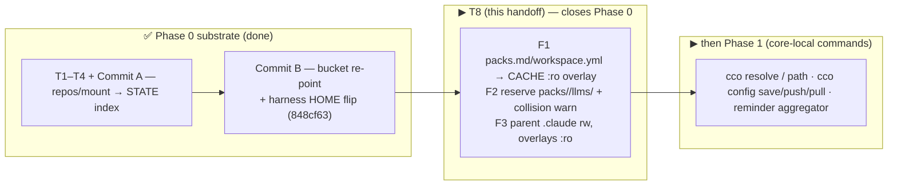

# Z4 — T8 launch handoff (CACHE overlays — closes Phase 0)

**Purpose.** Launch **T8** in a fresh, clean session. T8 is the **last Phase-0 item**: it carries the
RD-claude-mount items (ADR-0005) — generate `packs.md`/`workspace.yml` into **CACHE** and overlay them
`:ro` (F1), reserve `packs/`/`llms/` + warn on cross-tree name collisions (F2), and keep the parent
`.claude` mount read-write with the overlays `:ro` (F3). Completing T8 **closes Phase 0 (substrate)**.
This file is self-contained: it states the **working method**, the **source-of-truth** documents, the
**context** to load, a **mandatory preliminary analysis** to run *before* writing code, the **scope**, the
**invariants**, and the **roadmap instructions** for what comes after. Produced 2026-06-20 on
`feat/vault/decentralized-config` (commits **local** — the maintainer pushes from the Mac).

> **Where this sits.** Phase 0 = T1 → T2a → T3 → T4-remotes → **Commit A** (`c8ae080`) → **Commit B**
> (`848cf63`) → **T8 (this handoff)**. After T8, Phase 0 is done and the work continues at **Phase 1**.

---

## 0. WORKING METHOD (read first — applies to T8 and every later phase)

This is how the implementation proceeds; it does not change between tasks.

- **`design.md` + `guiding-principles.md` + the ADRs (`decisions/`) are the SOURCE OF TRUTH and the
  reference for every decision.** They are the frozen specification. When you must choose between options,
  derive the answer from them. `guiding-principles.md` (P1–P17) gives the foundational rules; `design.md`
  is the living target design; the ADRs hold the *why*. If two of them appear to conflict, the more
  specific/authoritative one wins (e.g. `design.md` §2.2 "byte-level layout fixed by ADR-0016" over a
  coarse paraphrase elsewhere) — and you record the reconciliation.
- **If implementation reveals a GENUINE design/sequencing gap or contradiction, PAUSE and discuss**
  (workflow rule). Do **not** improvise around the spec. Decisions that affect **how the toolkit is used**
  (UX, interface, bucket placement, sync strategy) require **maintainer confirmation** — they are not
  derivable from code alone (guiding-principles P10 method-lesson b). Use `AskUserQuestion`, present
  options + a recommendation grounded in the spec, then persist the decision.
- **Build method = dependency + reuse + open-closed; build every module ONCE in its final form**
  (never schema-migrate a file twice). Implementation order ≠ design chronology (design §9 preamble).
- **Green-per-phase = DELTA-based.** After each commit the failing set must be **exactly the 2 known
  baseline failures** (see §4). A third failure is a regression — fix it before committing. **Run the
  FULL `CCO_ALLOW_HOST_RESOLVE=1 ./bin/test` before and after** — a "clean caller map" can miss
  side-effect consumers (the §5 lesson that bit T4-remotes and shaped Commit B's harness).
- **Code-ground every claim.** Read the actual current code (line numbers drift); build the full
  writer/reader/consumer map **including the test files** before editing.
- **Atomic local commits**, conventional-commit messages ending with the `Co-Authored-By` trailer; the
  maintainer pushes from the Mac. Stage only the files you changed (leave the pre-existing unstaged
  deletion of `S-handoff-sharing-unification.md` as the maintainer has it).
- **bash 3.2 / macOS `/bin/bash`**: no `declare -A`; guard empty arrays under `set -u`
  (`${arr[@]+"${arr[@]}"}`); awk for parsing (`coding-conventions.md`).
- **Doc lifecycle** (`.claude/rules/documentation-lifecycle.md`): decision/analysis records are immutable
  history (forward-annotate when superseded); living design docs are rewritten in place; **shipped-behavior
  docs (README, guides, tutorial, FRs) ride the Phase-3 cutover sweep — never rewrite them ahead of code.**
  T8 is code + tests + (only if a decision changes) the design/ADRs.
- **Self-development caveat** (`/workspace/.claude/CLAUDE.md`): edits to `Dockerfile`,
  `config/entrypoint.sh`, `config/hooks/*` are **NOT active** in the running session. T8 must **not** touch
  the container side of `entrypoint.sh` (see §6 invariant).

## 1. SOURCE OF TRUTH for T8 — always respect, never silently diverge

- **`guiding-principles.md`** — foundational P1–P17. Most relevant to T8: **P1** (config vs internal —
  generated overlays are internal, not user-authored config), **P2** (destination taxonomy: regenerable
  output → **CACHE**), **P6** (hide internal; never write generated files into a committed config bucket).
- **`design.md`** — read **§2.2** (CACHE bucket — the `projects/<id>/.claude/` line: "generated overlays
  (`packs.md`, `workspace.yml`) → `:ro` into `/workspace/.claude` (F1)"), and **§9 Phase 0** the three
  "Carried RD-claude-mount items (ADR-0005)" bullets — **(F1)** generate `packs.md`/`workspace.yml` into
  CACHE and overlay `:ro` instead of writing into the committed project `.claude/`; **(F2)** treat
  `packs/`/`llms/` as reserved + warn on cross-tree name collisions; **(F3)** keep the parent mount rw,
  overlays `:ro`. And **§11** the Phase-0 test row (the "F2 cross-tree collision warning" contract).
- **ADRs** (frozen history — read, never rewrite): **0005** (dual-claude-scope / the `/workspace/.claude`
  single-mount finding C4 whose mount mechanics RD-claude-mount carries), **0007/0015/0016** (the 4-bucket
  taxonomy CONFIG/DATA/STATE/CACHE).

> Memory aid: **config decentralizes; internal centralizes.** Generated, regenerable framework output
> (`packs.md`, `workspace.yml`, `managed/*`) is **CACHE** — it must not be written into the committed
> project `.claude/` (that would dirty the repo and violate P6/G8). Commit B already moved `managed/` to
> CACHE; **T8 extends the very same overlay pattern** to `packs.md`/`workspace.yml`.

## 2. Context to load first (reading order)

1. **§0 (working method) above.** 2. `guiding-principles.md` (P1–P17). 3. `Y-handoff-implementation.md`
(build method + full P0–P5 map + cross-cutting invariants). 4. `Z-handoff-p0-resume.md` (the P0 cursor:
what landed incl. Commit A + Commit B, the **2 baseline failures**, and the **transitional choices you must
NOT undo**). 5. `design.md` §2.2 / §9 Phase 0 (F1/F2/F3) / §11. 6. ADR-0005 + the bucket ADRs.
7. Personal progress note (maintainer vault memory): `decentralized-config-impl-progress.md`.

## 3. MANDATORY preliminary analysis (verify code + state BEFORE editing)

1. **Confirm the baseline is green-as-expected.** `git status` (clean on `feat/vault/decentralized-config`
   — leave the pre-existing unstaged `S-handoff-…` deletion), then run the **full suite**
   `CCO_ALLOW_HOST_RESOLVE=1 ./bin/test` and confirm **991 passed / 2 failed / 993 total** (§4). A third
   failure ⇒ stop and investigate before touching anything.
2. **Read the actual current code** (do not trust line numbers — they drift):
   - `lib/cmd-start.sh` `_start_generate_metadata` (~`608`) — writes `packs_md="$output_dir/.claude/packs.md"`
     and calls `_generate_workspace_yml "$output_dir" …`. Note how Commit B handled the **parallel** case
     for `managed/`: `managed_gen_dir` = dry-run→`$output_dir/.cco/managed`, real→`$session_cache_dir/managed`;
     mount source = real `${session_cache_dir}/managed`. **Replicate that exact pattern** for the two
     `.claude` overlay files.
   - `lib/workspace.sh` `_generate_workspace_yml` (~`10`) — writes `$project_dir/.claude/workspace.yml`;
     it **preserves existing descriptions** (idempotent). Re-point its output dir without breaking that.
   - `lib/cmd-start.sh` `_start_generate_compose` — the project `.claude` mount is now
     `${project_dir}/.claude:/workspace/.claude` (rw, F3 parent). The memory child mount
     (`${session_state_dir}/session/memory:…/-workspace/memory`) is the **precedent for a child `:ro`
     overlay on top of a parent mount** — model the packs.md/workspace.yml overlays on it.
   - `session_cache_dir` is already computed in `_start_load_config` (`$(_cco_cache_dir)/projects/$project_name`);
     `_cco_cache_dir` is `<cache>/cco`. The design home is `<cache>/cco/projects/<id>/.claude/`.
   - The dry-run dump message (`_start_show_summary`, ~`750`) lists `.claude/packs.md` /
     `.claude/workspace.yml`; keep it pointing at the dump for inspection.
3. **Map the full consumer set incl. tests.** `grep -rn 'packs.md\|workspace.yml\|packs_md' lib/ tests/`.
   Identify the existing assertions (`test_start_dry_run`, `test_packs`, `test_project_*`, `test_managed_scope`)
   that pin `packs.md`/`workspace.yml` host paths — they will need the same suffix-vs-prefix treatment Commit B
   used. **Remember the runner asserts only the LAST line's status** (fix masked assertions too).
4. **Confirm the invariants (§6) and the delta-green contract before the first edit.**

## 4. The 2 known baseline failures — DO NOT re-investigate

- `test_update / test_update_migrations_run_in_order` — asserts a stale `schema_version`; → rewritten in **P2**.
- `test_llms / test_resolve_name_from_full_variant_url` — stale name-derivation expectation; → rewritten in **P4–P5**.

"Delta-green" = after T8 the FAIL set is exactly these two. Any third failure = a regression you introduced.

## 5. T8 — scope (confirm against the code you just read)

Apply the **same CACHE-overlay pattern Commit B used for `managed/`** to the two generated `.claude` files:

- **F1 — generate into CACHE + overlay `:ro`.** Generate `packs.md` and `workspace.yml` into the CACHE
  project dir `<cache>/cco/projects/<id>/.claude/` (real start) / the dump `$output_dir/.claude/` (dry-run),
  instead of into the committed project `.claude/`. Mount each as a **child `:ro` file overlay** onto
  `/workspace/.claude/packs.md` and `/workspace/.claude/workspace.yml` (mount source = the real CACHE path,
  like the managed mount). Introduce a `claude_overlay_dir` analogous to `managed_gen_dir`.
- **F3 — parent rw, overlays `:ro`.** The parent `${project_dir}/.claude:/workspace/.claude` stays rw; the
  two generated files are child `:ro` mounts layered on top (Docker child-mount precedence — the memory
  child mount is the precedent). The committed project `.claude/` is **never written** by `cco start`.
- **F2 — reserve `packs/`/`llms/` + cross-tree collision warning.** Warn when a committed
  `.claude//<name>` would collide with a pack/llms file that mounts to the same container path
  (e.g. committed `.claude/rules/foo.md` vs a pack's `rules/foo.md`); pack `:ro` wins. Detect-and-warn only
  (never hard-block — consistent with the layered, never-hard-block philosophy P14).
- **Tests** (design §11 Phase-0 row): add/adjust the bucket-overlay assertions + the **F2 collision-warning**
  test; re-point any existing `packs.md`/`workspace.yml` host-path assertions to the CACHE-overlay forms
  (suffix-based where possible). Keep `--dry-run --dump` writing the files under `$output_dir/.claude/` for
  inspection (dump layout unchanged).
- **Out of scope / do NOT touch:** the container side of `entrypoint.sh` (invariant §6); the legacy
  `CCO_*_DIR` and dual-seed (kept transitional — Commit B); the Commit-A schema-bridge + @local plumbing.

## 6. Invariants (never violate)

- **compose↔entrypoint container-path contract** — the container side of `entrypoint.sh` consumes fixed
  container paths (`/home/claude/.claude/…`, `/workspace/.claude/…`); T8 only changes **host-side** mount
  sources + where generated files are written. Container paths unchanged.
- **P6 / G8 / AD3** — generated/internal files never live in a committed config bucket; `git diff` on the
  repo `.cco/`/`.claude/` stays truthful. T8 removes the last writes of generated output into the committed
  project `.claude/`.
- **Bucket taxonomy (ADR-0007/0015/0016)** — regenerable output → CACHE (`_cco_cache_dir`).
- **Host-side resolver guard (H4)** — paths resolve host-side only; tests set `CCO_ALLOW_HOST_RESOLVE=1`.
- **Do NOT undo the transitional choices** — Commit A's schema-bridge + @local plumbing, Commit B's kept
  legacy `CCO_*_DIR` + dual-seed + non-re-pointed `check_global`. They die in P3/P4 by design; deleting
  early re-breaks delta-green.

## 7. After T8 — proceeding with the roadmap

Phase 0 is the substrate; the layers above consume it. After T8 (Phase 0 **closed**), proceed in
dependency order along **`design.md` §9** (and `Y-handoff-implementation.md`):

- **Phase 1 — core-local commands** (consume the substrate): `lib/cmd-sync.sh` (`cco config save/push/pull`
  copy semantics, no merge engine); `cco resolve`/`cco path` (index-backed, incl. clone-from-`url`;
  `cco resolve --scan` non-destructive upsert, ADR-0022 D3); the **non-blocking reminder aggregator**
  (uncommitted `~/.cco` / `<repo>/.cco`, cross-repo divergence; H1 ordering = reminders after member
  resolution).
- **Phase 2 — migration & bootstrap** (writes the complete final config once): J0 four-root bootstrap;
  `cco init --migrate`; **T5 lands here** (merge-engine `.cco/base`+`.cco/meta` → STATE `/update`, H6 +
  global-meta decompose; ADR-0016 D6).
- **Phase 3 — legacy cutover** (the big breaking deletion): remove the vault/profiles/`project create`;
  wire `cco tag`; the Commit-A/B transitional choices **die here**; shipped-behavior doc cutover sweep.
- **Phase 4 — sharing core**: manifest removal (code/data split, discovery-before-delete);
  sync-before-publish; 2×2 verbs; **T4-source lands here** (source→DATA + F4; ADR-0022 D1).
- **Phase 5 — sharing extensions & lifecycle**: 3-layer pack resolution; `cco forget`; `cco project
  validate` / `cco config validate`; delete-cascade; `cco config protect`.

Each phase: re-read the spec, run the same delta-green loop, dedicate a **clean session** per cohesive unit,
and (per §0) **pause + maintainer-confirm** any UX/interface/placement decision. The **maintainer-confirmed
command surface** is ADR-0023; the **deferred-post-v1** list and per-phase test contracts are in
`Y-handoff-implementation.md` + `design.md` §11. **T = post-v1 state-sync** (out of scope for v1).

## 8. Start here

Run the §3 preliminary analysis (baseline 991/2 green, code read, full consumer map incl. tests, invariants
confirmed). Implement T8 as the CACHE-overlay extension of Commit B's `managed/` pattern, keep the suite
delta-green (the 2 baseline failures only), commit atomically. **T8 closes Phase 0** — then continue at
**Phase 1** (§7). Pause and discuss on a genuine design/sequencing gap; otherwise **`design.md` +
`guiding-principles.md` + the ADRs are the spec**. Next free ADR = **0024**.
