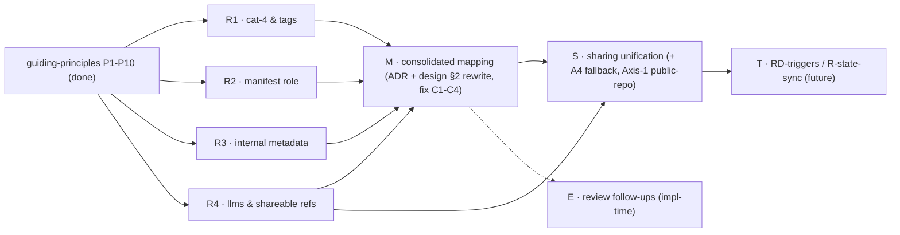

# Decentralized cco Config — Analysis Roadmap

**Status**: Living tracker (started 2026-06-16). Orders the remaining design analyses by
dependency/convenience so each runs in its **own clean session** without losing context.
**Foundation**: every analysis opens by reading **`guiding-principles.md`** (P1–P10, source of truth)
and validates its decisions against it. Decisions are recorded as ADRs + propagated to `design.md`,
`requirements.md`, and `resource-coherence-inventory.md`.

> **Method (P10)**: classify each resource from its **role + problem solved + principles**, never from
> its current surface/path. A borderline resource gets its **own clean session**; correct placement
> needs undivided context on that resource's purpose. Each analysis: (1) state role + problem solved;
> (2) classify on both axes (destination P2 + sync-profile P3) via P1–P9; (3) flag/resolve conflicts
> with `design.md`/ADRs; (4) record an ADR + propagate to living docs; (5) mark `DONE` here.

---

## Completed (config design)

| Item | Output |
|---|---|
| RD-claude-mount / RD-paths / RD-home / RD-memory / RD-authoring | ADR-0005 / 0007 / 0008 / 0009 / 0010 |
| Cross-domain coherence review | `reviews/16-06-2026-design-coherence-review.md` |
| Resource-coherence inventory (old-model references) | `resource-coherence-inventory.md` |
| **Guiding principles (foundation, P1–P10)** | `guiding-principles.md` |
| **Preliminary grounding** (destination + sync model) | folded into R1–R4 / M below |

---

## Analyses (ordered)

> The preliminary grounding (2 analysts, this session) produced a near-complete destination map and a
> sync-profile assignment, but the maintainer **reopened** three borderline classifications that the
> grounding had answered too quickly (tags/4th-category, manifest, internal metadata). Each becomes a
> dedicated role-first analysis (R1–R3) that feeds the consolidated mapping (M).

### R1 — Category-4 & tags classification  ·  status: TODO (next)
**Role/problem to establish first**: how is a tag *set* — by editing `tags.yml` in an IDE (→ config,
P1) or via a `cco tag …` CLI (→ internal, P1)? What problem do tags solve and for whom?
**Decide**: (a) does a **4th "internal-but-synced" category** exist (cco-managed, hidden, NOT
IDE-edited, but private-multi-PC synced)? Weigh completeness/future-extension vs duplication vs
alternatives that avoid a 4th bucket. (b) Is `tags.yml` config (`~/.cco`) or internal-but-synced? Other
members? **Validate the maintainer's intuition explicitly (confirm or reject with reasons).**
**Note**: ADR-0010 fixed tag *semantics* (per-user, never team, synced); R1 fixes the *bucket & nature*
and may refine ADR-0010's placement. **Output**: ADR + update `guiding-principles.md` P2 (4th row) + feed M.

### R2 — manifest.yml: role & necessity  ·  status: TODO
**Role/problem to establish first**: what problem did `manifest.yml` solve; is it auto-generated,
CLI-managed, or hand-edited (it says "Auto-generated by cco")? Does it serve **private multi-PC** sync at
all, or is it a **team-sharing-only** concept (the Config-Repo index) — or partly obsolete under the new
model? Can multi-PC sync work without it?
**Decide**: keep / relocate / scope-to-team / remove; and its classification + bucket if kept.
**Output**: ADR (or a decision recorded in S if it proves team-sharing-only) + feed M. May couple with S.

### R3 — Internal metadata & state placement  ·  status: TODO
**Scope (resources)**: `.cco/source` (project + pack provenance), pack `.cco/meta`, `.cco/base/`
(merge-engine ancestors, project + global), `.claude/.cco/pack-manifest`, remotes registry **+ tokens**.
**Role/problem to establish first**: each is cco-managed metadata coupled to a resource; today several sit
*inside* config buckets (violating P6) or hold secrets (tokens). **Decide**: STATE mirror (strict P6) vs a
documented sidecar exception; how the merge engine resolves `base/` from STATE (H6); tokens stay STATE +
never synced (security invariant). **Output**: ADR + feed M. Absorbs review follow-ups H6/M3.

### R4 — llms: nature & shareable references  ·  status: TODO
**Role/problem to establish first**: are llms **URL-only re-fetchable** (→ CACHE) or also
**manually-editable curated** resources (→ `~/.cco` config)? **Then**: what must travel so a third party
can fully **resolve** a shared project/pack — llms **source URLs** and repo **remote URLs** — across both
axes (private multi-PC *and* team). Evaluate "promote full source/URL into project/pack by name+source"
vs alternatives. **Output**: ADR (llms nature + shareable-reference model) + fills the llms cell in M +
closes inventory open #2. Interlinks with S (team resolve).

### M — Consolidated resource taxonomy & mapping  ·  status: BLOCKED on R1–R4
**Goal**: THE authoritative, exhaustive `resource → (destination, sync-profile)` table; **validate the
whole design against P1–P10 and fix the conflicts**; rewrite the layout trees to be exhaustive.
**Conflicts to fix (from grounding)**: **C1** `design.md:136` `backups/` in `~/.cco` → STATE; **C2** ADR-0007
`llms/`→CACHE conditional on R4; **C3** `design.md §2.3` `~/.cco` tree **incomplete** (missing global
`secrets.env`, `setup.sh`, `setup-build.sh`, `mcp-packages.txt`, `manifest.yml`); **C4** `.cco/source` /
pack `.cco/meta` inside config buckets violate P6 (→ R3). **Already grounded (decided pending M)**: project
`mcp.json`/`setup.sh`/`mcp-packages.txt` → `<repo>/.cco/` (H5); `.cco/managed`, generated compose,
`claude-state`, `memory`, `meta`, `pack-manifest` → STATE; `install-tmp`/`.bak`/overlays/Config-Repo clones
→ CACHE. **Output**: **ADR (resource taxonomy)** + rewrite `design.md §2.1/2.2/2.3` + close inventory open
items. Absorbs review follow-ups H5/H6/M3.

### S — Sharing model unification  ·  status: TODO (after R4)
**Goal**: unify/simplify team-sharing (Config Repos = a third repo as remote; access via git token /
public). Confirm `~/.cco` = private-only; team-sharing always via a Config Repo. Evaluate cco's
**opinionated defaults as an official public Config Repo, shipped separately** (R-pkg / R-update-native).
**Also owns**: the **Axis-1 public-repo question** (P3 note — forbid/allow/escape-hatch for a public
personal remote); the **A4 fallback option (B)** (solo adopter: project `.cco/` under `~/.cco`, outside the
repo — index `config_path` field, `~/.cco/projects/` re-expansion, `cco start` discovery/precedence;
post-v1). **Depends on**: R4 (what travels), M. **Output**: ADR(s) / a dedicated sharing design doc.

### T — RD-triggers / R-state-sync  ·  status: FUTURE
Background daemon / native hooks / git hooks vs manual-only (v1 = manual). Owns `~/.cco` background
auto-sync and **R-state-sync** (memory + transcripts cross-PC/cross-team opt-in, ADR-0009) — the future
STATE-sync category (P8). **Depends on**: R1–S settled.

### E — Review follow-ups (implementation-detail)  ·  status: TODO (during/just-before implementation)
From `reviews/16-06-2026-design-coherence-review.md`, not blocking Phase 0: H2 (reminder-aggregator cost),
H7 (index concurrency & namespacing), M1/M2 (sync edge cases + sync-state lifecycle), H8 (join Case-C),
M4/M5 (extra_mounts schema/migration). Best resolved against real code during implementation. (H5/H6/M3
are absorbed by M/R3.)

---

## Dependency order

**Recommended sequence**: R1 → R2 → R3 → R4 (independent; can interleave) → **M** (consolidate + fix
conflicts) → S → (T, E around implementation). R1 is the suggested **next** session.

## Notes
- The three former "carried confirmations" are **now analyses** R1 (4th-category/tags), R2 (manifest),
  R3 (`.cco/source`/`.cco/meta`) — not quick confirmations: each needs role-first analysis (P10).
- ADR numbers are assigned when each session runs (next free number; last used = 0010).
