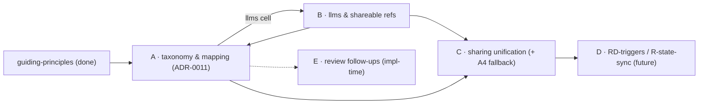

# Decentralized cco Config — Analysis Roadmap

**Status**: Living tracker (started 2026-06-16). Orders the remaining design analyses by
dependency/convenience so each runs in its **own clean session** without losing context.
**Foundation**: every analysis opens by reading **`guiding-principles.md`** (P1–P9, source of truth)
and validates its decisions against it. Decisions are recorded as ADRs + propagated to `design.md`,
`requirements.md`, and `resource-coherence-inventory.md`.

> **How to use**: pick the next `TODO` domain whose dependencies are met, start a clean session,
> read `guiding-principles.md` + this entry + the cited docs, run the analysis (specialized agents),
> produce the ADR + doc updates, then mark the domain `DONE` here.

---

## Completed (config design)

| Item | Output |
|---|---|
| RD-claude-mount | ADR-0005 |
| RD-paths | ADR-0007 |
| RD-home | ADR-0008 |
| RD-memory | ADR-0009 (memory = STATE; R-state-sync deferred) |
| RD-authoring | ADR-0010 (direct `~/.cco` edit; per-user tags) |
| Cross-domain coherence review | `reviews/16-06-2026-design-coherence-review.md` |
| Resource-coherence inventory (old-model references) | `resource-coherence-inventory.md` |
| **Guiding principles (foundation)** | `guiding-principles.md` |
| **Preliminary grounding** (destination + sync model) | this roadmap (domain A entry) |

---

## Domains (ordered)

### A — Resource taxonomy & destination/sync mapping  ·  status: GROUNDED, pending confirmations → formalize next
**Goal**: one authoritative, exhaustive `resource → (destination, sync-profile)` mapping; complete the
incomplete design layout; **validate the current design against P1–P9 and fix conflicts**.
**Depends on**: guiding-principles (done). **One cell waits on B**: `llms/` destination follows its nature.
**Output**: **ADR-0011** (resource taxonomy & mapping) + rewrite `design.md §2.1/2.2/2.3` trees (make
exhaustive) + close `resource-coherence-inventory.md` open items; absorbs review follow-ups H5/H6/M3
(destinations).

**Preliminary grounding results (this session — to formalize):**
- **`<repo>/.cco/` (project config)**: `project.yml`, `secrets.env(.example)`, `.cco/claude/`, **+ (resolve)
  `mcp.json` / `setup.sh` / `mcp-packages.txt`** (H5: project config, IDE-authored; mcp.json uses `${VAR}`+secrets.env).
- **`~/.cco/` (global config)**: `packs/`, `templates/`, `global/.claude/`, `tags.yml`, **+ design-tree OMISSIONS to add**:
  `manifest.yml`, global `secrets.env` (gitignored), `setup.sh`, `setup-build.sh`, `mcp-packages.txt`.
- **STATE**: generated compose, `claude-state/`, `memory/`, `meta`, `managed/` (runtime effective state),
  `base/` (project+global merge ancestors — H6), `pack-manifest`, index, sync-meta, auth seeds, **+ `backups/` (relocate from `~/.cco`)**.
- **CACHE**: `install-tmp/`, `.bak`/`.tmp`/dry-run, Config-Repo clones, generated overlays (`packs.md`/`workspace.yml`), `llms/` *(pending B)*.
- **4th "internal-but-synced" category → RESOLVED-EMPTY** (considered, rejected): every candidate fits an
  existing bucket — remotes+tokens → STATE/not-synced (tokens secret), manifest → `~/.cco` config (synced via the store),
  tags → `~/.cco`, index/sync-meta → STATE/not-synced.
- **Conflicts to fix in formalization**: (C1) `design.md:136` puts `backups/` in `~/.cco` → move to STATE;
  (C2) ADR-0007 `llms/`→CACHE is conditional on B; (C3) `design.md §2.3` `~/.cco` tree incomplete (see omissions);
  (C4) `.cco/source` + pack `.cco/meta` live inside config buckets → relocate to STATE (P6) or document an exception.
- **Pending maintainer confirmations** (carried below): 4th-row resolved-empty; `manifest.yml` = synced
  private-multi-PC config (not gitignored-regenerable); `.cco/source`/`.cco/meta` → STATE mirror vs sidecar exception.

### B — llms nature & shareable references  ·  status: TODO
**Goal**: resolve the *nature* of llms (URL-only re-fetchable → CACHE, vs manually-editable curated → `~/.cco` config),
which fixes its destination (the open cell in A). Then: **what must travel for a third party to fully resolve a
shared project/pack** — llms **source URLs** and repo **remote URLs** — across both sync axes (private multi-PC *and*
team-sharing). Evaluate "promote full source/URL into project/pack by name+source" vs alternatives.
**Depends on**: A (buckets). **Feeds back**: llms destination cell into A's mapping.
**Output**: ADR (llms nature + shareable-reference model); update `design.md` + inventory open #2.

### C — Sharing model (export/import + team-sharing unification)  ·  status: TODO
**Goal**: unify/simplify the team-sharing surface (Config Repos = a third repo as remote; access via git token /
public). Confirm `~/.cco` = private-only; team-sharing always via a Config Repo. Evaluate making cco's **opinionated
default resources an official public Config Repo, shipped separately** (relates to R-pkg / R-update-native). Also owns
the **A4 fallback option (B)** — solo cco adopter whose project `.cco/` lives under `~/.cco` outside the repo
(index `config_path` field, `~/.cco/projects/` re-expansion, `cco start` discovery/precedence) — post-v1.
**Depends on**: B (what travels). **Output**: ADR(s) / possibly a dedicated sharing design doc.

### D — RD-triggers (future opt-in auto-sync)  ·  status: FUTURE
Background daemon / native hooks / git hooks vs manual-only (v1 = manual). Owns `~/.cco` background auto-sync and,
together with **R-state-sync** (memory + transcripts cross-PC/cross-team, ADR-0009), any non-explicit Axis-1 sync.
**Depends on**: A–C settled. **Output**: ADR (or roadmap item if kept post-v1).

### E — Review follow-ups (implementation-detail)  ·  status: TODO (during/just-before implementation)
From `reviews/16-06-2026-design-coherence-review.md`, not blocking Phase 0: H2 (reminder-aggregator cost & scoping),
H7 (index concurrency & namespacing), M1/M2 (sync edge cases + sync-state lifecycle event→mutation), H8 (join Case-C
flow) + M4/M5 (extra_mounts schema/migration). Best resolved against real code during implementation.

---

## Dependency order

Recommended sequence: **A (formalize) → B → backfill llms into A → C → (D, E around implementation).**

## Carried confirmations (resolve when formalizing A)
1. **4th "internal-but-synced" category** → mark **resolved-empty** (grounding recommendation).
2. **`manifest.yml`** → **private-multi-PC config in `~/.cco`** (synced via `cco config push/pull`), not a
   gitignored-regenerable file.
3. **`.cco/source` + pack `.cco/meta`** → **STATE mirror** (strict P6) vs a documented sidecar exception inside the
   resource dir — pick one.
