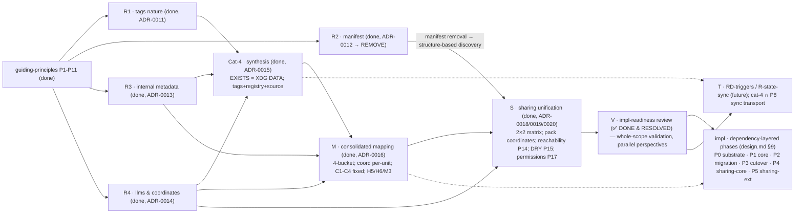

# Decentralized cco Config — Analysis Roadmap

**Status**: Living tracker (started 2026-06-16). Orders the remaining design analyses by
dependency/convenience so each runs in its **own clean session** without losing context.
**Foundation**: every analysis opens by reading **`guiding-principles.md`** (P1–P17, source of truth;
P13–P17 added by the S cycle) and validates its decisions against it. Decisions are recorded as ADRs + propagated to `design.md`,
`requirements.md`, and `resource-coherence-inventory.md`.

> **Method (P10 + ADR-0011)**: classify each resource from its **role + problem solved + principles**,
> never from its current surface/path. A borderline resource gets its **own clean session**; correct
> placement needs undivided context on that resource's purpose. Each analysis validates resources
> **one-by-one**: (1) **current-state recap (code-grounded)**; (2) state role + problem solved;
> (3) classify on both axes (destination P2 + sync-profile P3) via P1–P9; (4) flag/resolve conflicts
> with `design.md`/ADRs; (5) **maintainer confirm/reject** on UX/usage-impacting choices (interface,
> sync strategy) — not derivable from code alone; (6) record an ADR + propagate to living docs; (7)
> mark `DONE` here.
>
> **Lessons (ADR-0011)**: *don't discard/accept a priori* — classify only from the validated role (a
> first pass mis-classified tags from the *absence* of a CLI). **Cross-cutting verdicts are
> synthesised, not per-resource** — the 4th-category existence is decided by a dedicated **Cat-4
> synthesis** over *all* candidates (R1–R4), not inside any single resource analysis.

---

## Completed (config design)

| Item | Output |
|---|---|
| RD-claude-mount / RD-paths / RD-home / RD-memory / RD-authoring | ADR-0005 / 0007 / 0008 / 0009 / 0010 |
| Cross-domain coherence review | `reviews/16-06-2026-design-coherence-review.md` |
| Resource-coherence inventory (old-model references) | `resource-coherence-inventory.md` |
| **Guiding principles (foundation, P1–P12)** | `guiding-principles.md` (P11 added by R3/ADR-0013; P12 + ADR-0014 method lesson added by R4; P2 4th-bucket **resolved** = XDG DATA by Cat-4/ADR-0015) |
| **Preliminary grounding** (destination + sync model) | folded into R1–R4 / M below |
| **S — sharing model unification** | ADR-0018 / 0019 / 0020 (P13–P17) |
| **V — impl-readiness review** (whole-scope, multi-agent ultracode) | `reviews/18-06-2026-impl-readiness-review.md` (58 findings + 5 critic; 37 decisions) |

---

## Post-V: cluster-by-cluster resolution (in progress, 2026-06-18)

V findings were resolved **cluster by cluster** with the maintainer, persisted to ADRs/design before
implementation. The method + outcomes live in `reviews/18-06-2026-impl-readiness-review.md` and ADRs
0021–0023 (the cluster-resolution scaffold handoff was consumed — in git history).

| Cluster | Scope | Status |
|---|---|---|
| 1 — Migration safety | F1/F9/F10/F11/F12/F42/F43/F44 + new F59 | **RESOLVED & PERSISTED** → ADR-0021 (new) + ADR-0006/0009/0010 + design §7/§9/§11 + requirements FR-M1/M2 |
| 2 — Phasing & test-plan re-sync | F2/F7/F35/F36 + critic (test-suite teardown, entrypoint, secrets-env, spec.md, roadmap) | **RESOLVED & PERSISTED** → no new ADR; design §9/§11 6-phase map (E dissolved) + §6.2/§12 xrefs |
| 3 — Doc drift / re-sync | F3/F20/F21/F22/F23/F24/F30/F31/F32/F33 + critic | **Block A RESOLVED & PERSISTED** (rule `documentation-lifecycle.md` + design-intent re-sync + inventory); **Block B** rides the Phase-3 cutover |
| 4 — Coordinate model & resolution | F4/F6/F14/F15/F16/F17/F29/F37–F41/F45/F48/F56 | **RESOLVED & PERSISTED** → ADR-0022 (new) + forward-annot ADR-0016/0017/0018/0019 + design §2.2–§12 + requirements FR-Y-S6 |
| 5 — Command surface & UX | F13/F18/F19/F25/F26/F27/F34/F46/F47/F49/F50 | **RESOLVED & PERSISTED** → ADR-0023 (new, D1–D6) + forward-annot ADR-0016/0018/0019/0020/0021 + design §2.4/§3/§4.4/§6.2/§7/§8 |

**The impl-readiness review (V) is FULLY RESOLVED — all 5 clusters closed (2026-06-19). Implementation IN PROGRESS along the `design.md` §9 P0–P5 phases.** Phase 0 (substrate) commits landed (`feat/vault/decentralized-config`, local): **T1** resolver+H4+L5 `ff8278b` · **T2a** index API `d913e5c` · **T3** coordinate parsers `992738d` · **T4-remotes** M3 split `2bdf80e` · **Commit A** repos/mount resolution wired to the STATE index `c8ae080` (suite **991/2**, +6 index tests) · **Commit B** session-mount bucket re-point + harness HOME flip `848cf63` (2026-06-20; suite **991/2** delta-green). Commit B emits the **final host-absolute mount map**: global config→CONFIG `~/.cco/global`, `secrets.env`/`setup.sh`→CONFIG `~/.cco` top-level, auth-seeds+transcripts+memory→STATE (keyed by project id), managed overlays generated+mounted→CACHE; `load_global_secrets`→`~/.cco/secrets.env`; container side of `entrypoint.sh` **unchanged** (compose↔entrypoint contract). Two maintainer decisions: **D1** follow design §2.2/§2.3 over the earlier coarse "→ ~/.cco" mapping (auth seeds = machine-local STATE, not CONFIG; global config under `~/.cco/global`; secrets/setup top-level — it is the frozen spec and is build-once) and **D2** managed **generation** target → CACHE here (not deferred to T8). Harness: HOME flipped into the tmpdir + hermetic `~/.gitconfig` (the ~12 git-committing suites + `protocol.file.allow=always`), **dual-seed** (legacy GLOBAL_DIR + new `~/.cco/global`), legacy `CCO_*_DIR` **KEPT** (still consumed by the not-yet-cutover commands → dropping breaks delta-green; the §3/§5 consumer-map lesson). Commit A's two **transitional** choices stand (keep-transitional @local plumbing + per-section schema bridge; die in P3/P4). **T8** `7dcf1e8` (2026-06-21) **closes Phase 0**: the generated `.claude` overlays `packs.md`/`workspace.yml` now generate into the CACHE bucket (`<cache>/cco/projects/<id>/.claude/`) and overlay `:ro` onto `/workspace/.claude` (ADR-0005 **F1** — extends Commit B's managed CACHE-overlay model; metadata generated before compose so overlays mount by existence), `_detect_cross_tree_conflicts` warns on committed-config vs pack/llms overlay collisions (**F2** — reserved `packs/`/`llms/` + per-file `rules`/`agents`/`skills`; pack `:ro` wins, never hard-block, P14), and the parent `.claude` mount stays rw with the committed tree never written (**F3**; +4 tests, fixed a masked F3 assertion). Suite **995/2** delta-green. Both "internal-artifact relocation" items remain re-sequenced OUT of P0 (tests hardcoded in later phases): **T4-source → P4** (source→DATA/F4; ADR-0022 D1 forward-annot) and **T5 → P2** (base/meta→STATE H6 + global-meta decompose; ADR-0016 D6 forward-annot). **Phase 0 substrate ✅ CLOSED. Adherence audit DONE (2026-06-21)** → `reviews/21-06-2026-impl-adherence-review.md` (first run of the recurring `implementation-review-handoff.md` playbook; 8 lenses, code-grounded): **Transitional Registry FULLY INTACT** (no early cleanup, no unsanctioned dual-read), **0 🔴 code-conformance bugs**, P0 elements all ✅. The substantive finding was **test-infra, not code**: the runner `( set -e; fn )` **masked all non-final assertion failures** — and (broader than the registry §6 note) the `[[ … ]] || fail` idiom in the new `test_index.sh`/`test_paths.sh` masked too; only `… || return 1` aborts. **HITL-1 RESOLVED + APPLIED** (maintainer-approved): `bin/test:_run_test` now treats a captured `ASSERTION FAILED` sentinel as failure — this **un-masked 17 hidden failures** (the "995/2 delta-green" was masked). All 17 = stale-assertion/legacy test-drift in §11 rewrite/remove buckets, NOT P0 code regressions; the 3 P0-scope `test_invariants` (stale `./` mount literal + missing `.cco/` compose path) were **spot-fixed** → green. **HITL-2 also RESOLVED** (`test_remote_token_file_is_0600` asserts the `remotes-token` 0600 mode, S8). **New verified baseline = 982/16** (the 16 = 8 update/P2 + 5 vault-profile/P3 + 3 sharing/P4-5, each ❌→✅/removed in its phase; registry §4 + P1-handoff §4 re-baselined). **Phase 1 (core local) ✅ CLOSED (2026-06-22)** — 6 atomic commits `56ca45c`→`e48abdd` (cco resolve/path · sync-meta fingerprint · reminder aggregator · cco sync · cco start aggregator+H1 · cco project add), each full-suite delta-green against the re-baselined 16; suite **1043/16**. **3 maintainer scope-forks** (deviate from the P1-handoff literal *toward* design §9/§11, the source of truth): (1) legacy `cco project resolve` / `cco project validate <name>` / `cco project add-pack` (central layout) kept intact, **superseded → removed at P3** (different names coexist; deleting early breaks delta-green); (2) `cco start` `--from` / Case-C precedence / divergence notice / source-transparency **RE-SEQ → P2** (coupled to start's central→decentralized project-finding, which the P2 migration introduces — build-once there); (3) `cco project validate` full contract (ADR-0023 D2, incl. pack-collision ERROR) → **P5** (design §11 row 5 + needs the pack backend), `cco project coords` → **P4/P5**. **RD-repo-multi-project ✅ RESOLVED → ADR-0024**, **re-coherence sweep ✅ DONE** (`8e7cc9a`, suite **1044/16**), **P2 Design ✅ DONE 2026-06-22 → ADR-0025** (migration ownership: eager global via `cco update` + lazy per-project via `cco init --migrate`; backup any-command; vault removal offered only at `cco update` default-keep; `.cco/meta` hash `manifest:`→STATE meta NOT dropped — only `manifest.yml`/`pack-manifest` removed; both §4a opens closed). **Next = Phase 2 implementation** along the maintainer-approved build sequence (`P2-handoff-migration-bootstrap.md` §5b: P2-1 bootstrap+backup · P2-2 H6+global-meta decompose [16→8] · P2-3 `cco update` eager global · P2-4 `cco init --migrate` lazy + `cco init`/`join` · P2-5 D-start+D5), clean session, start at **P2-1**; method/phase-map = `Y-handoff-implementation.md` (the per-cycle scaffold handoffs M/R3/S/V/W/X/Z* and the consumed `P1-handoff-core-local.md` were removed — in git history). T = post-v1 state-sync. **Phase 2 ✅ CLOSED 2026-06-22** — 5 commits `c1e0369`→`767de86` (P2-1 J0 bootstrap + raw-tar vault backup→STATE · P2-2 H6 base/meta→STATE keyed-by-`name` + global-meta decompose [FAIL 16→8] · P2-3 eager global migration via `cco update` · P2-4 `cco init --migrate` lazy + `cco join` + migration 013 + `migrations/{pack,template}/` · P2-5 D5 observability). **D-start source-selection re-sequenced P2-5 → P3** (code-grounded: `cco start` still mounts the central layout; the decentralized `<repo>/.cco/` start read-path is the P3 cutover). **P2→P3 adherence audit ✅ DONE 2026-06-23** (`reviews/23-06-2026-impl-adherence-review.md`, 4 parallel read-only lenses + adversarial verify): P2 fully conformant, **0 🔴 / 0 blockers / 0 genuine HITL**; **T5 (base/meta) RETIRED** from the Transitional Registry; baseline re-stated **16→8** (8 P2-owned update/merge/migration tests flipped ❌→✅); a false-alarm "+3 test bugs" cluster (one lens ran without the `CCO_ALLOW_HOST_RESOLVE=1` hatch → H4-guard reds on pure path-resolver unit tests) reproduced + rejected; doc-coherence clean (shipped-behavior docs correctly not rewritten ahead). **Suite 1087/8 delta-green. Next = Phase 3 (legacy cutover).** **PHASE 3 IN PROGRESS (2026-06-23) — P3-1/P3-2/P3-3/P3-3b ✅ DONE, the vault/profile world REMOVED + `cco init` is the single decentralized project entry verb (`cco project create` deleted), suite 921/3 delta-green:** P3-1a `36660fd` (decentralized `cco start` read-path flip central→`<repo>/.cco/` + harness-first `create_project`) · P3-1b `365d16f` (D-start UX: source-transparency line, passive ⚠ badge, conscious-skip P14, F49 prompt reused) · P3-2a `548f2e5` (`cco tag`/`cco list` over DATA `tags.yml`, kind auto-detect — new `lib/tags.sh`) · P3-2b `f7f41c1` (`cco config save/push/pull` — allowlist double-barrier + 2-pass secret-scan + non-FF-pull-abort + advisory private-remote warning; `cco config validate` → P5) · P3-3 `a76e1f6` (delete `lib/cmd-vault.sh` −3732 + memory auto-commit D33/`.gitkeep` D32 + update.sh snapshots; remove `test_vault.sh`+`test_vault_profiles.sh`; +6 `test_decentralized_cutover.sh`). **9 maintainer decisions** along the way (tier-split, UX copy, scope deferrals), all reconciled with design+ADR + persisted. **Tier-2 legacy verbs + `@local` block DEFERRED → P4** (build-once with their publish/install/query consumers). **P3-3b ARCHITECTURE → ADR-0026** (`60fa04f`, maintainer-proposed + implementer-validated): `cco init` = single project entry verb (idempotent global-ensure from defaults + per-repo scaffold + index register); J0=roots / `cco init`=global-content-fresh / `cco update`=vault-migration; migration-gate → `migration-state` marker (non-destructive `cco update` after init). **P3-3b ✅ DONE 2026-06-23** — §1.5 coherence review CONFIRMED ADR-0026; build **re-sequenced (Option B, maintainer)** into 2 coordinated delta-green commits (the global retarget wasn't isolable from the still-central update/clean/manifest engines + ~150 global-only `run_cco init` tests): **`9e15924`** docs · **`35f5797`** global-home cutover `GLOBAL_DIR`→`~/.cco/global` + `init_global` test helper · **`d9e44a2`** init transform (idempotent global-ensure + per-repo `<repo>/.cco/` scaffold + index-register + §3b marker-gate non-destructive `cco update`; deleted `cco project create`, relocated `_resolve_template_vars`→`cmd-template.sh`; base `project.yml`→coordinate schema). Removed tests for gone/deferred behavior (create-time meta/base/source, `--template` instantiation, central project-scoped `update --sync/--diff` → rebuilt P4). **Resume = `P3cd-handoff-config-editor-and-docs.md`** (P3-4 config-editor rehome → P3-5 shipped-behavior doc cutover sweep; P3-3b→P3-4 adherence audit first). ADRs **0005–0026**; next free **0027**. Baseline **921/3**. **P3-4 ✅ DONE 2026-06-23 → ADR-0027** (config-editor = built-in `internal/config-editor/` [git mv + runtime-generated project.yml `readonly:false`]; `--mount` repeatable ro-default D2; narrow agentic edit-protection D3 `<repo>/.cco` :ro overlay + `--enable-config-edit`; 4 commits `531a0f8`/`2783ce5`/`f590efe`/`871993e`; suite **936/3**). **P3-5 ✅ DONE 2026-06-24** (shipped-behavior doc cutover sweep, inventory-driven: A/B `5c6ad29` + C `141e24e` [24 user-facing+contract docs] + **Section D** `56967cf` D-rehome [file-policy/dual-tracker canonical → `update-system/`] + `a3e0618` D-archive [`git mv` vault/sharing/resource-lifecycle → `_archive/`, refs re-pointed] + `c3cb598` status; suite **936/3**). **PHASE 3 ✅ CLOSED.** Deferred to P4 (logged): full rewrite of `architecture/{coding-conventions,security}.md` + `integration/{browser-mcp,auth}/design.md` (document deleted `cmd-vault.sh` + still-present `@local`/tier-2). **PHASE 4 (sharing core) IN PROGRESS (2026-06-24, maintainer-approved):** P3→P4 adherence audit ✅ (`reviews/24-06-2026-impl-adherence-review.md` — READY FOR P4, 0 blockers/0 HITL; 4 parallel read-only lenses [Phase-3 conformance · Transitional-Registry intactness · taxonomy/coordinate/invariants · P4-readiness call-site map] + adversarial verify; baseline 936/3 = exact P4-5 set). **P4-1 ✅** `82b6956` (source→DATA relocation, identity-keyed `<data>/cco/{packs/<name>,projects/<id>}/source` + new `_cco_template_source`; key rename `source→url`/`path→resource` (ref kept); bookkeeping `commit/installed/updated`→STATE meta via new `_meta_record_provenance`/`_meta_installed_commit` + project-meta generator preserve-list extended; **F4** `publish_target` dropped, re-derived via new `remote_get_name_for_url` url→name reverse-lookup, `_update_publish_target` deleted, post-publish records `url` (working-copy P16); ALL read/write sites flipped per design §9; idempotent `_relocate_legacy_pack_sources` in `cco update`; llms source excluded; ADR-0022 D1; suite **939/1**, resolved the 2 P4 baseline failures). **P4-2 ✅** `6b2673f` (structure-based discovery `_discover_resources <root> packs|templates` [a `<section>/<name>/` carrying pack.yml/project.yml] replacing the manifest.yml index; `_clone_for_publish` empty-seed → `--allow-empty` commit; rewrote pack+project install discovery readers; dropped all `manifest_refresh`/`manifest_init` writers [nothing reads the local manifest — `cmd_pack_list` already scans by structure]; **DELETED the manifest subsystem** `lib/manifest.sh`+`cco manifest` arm/source/usage+`tests/test_manifest.sh`; ADR-0012/0018 D3; suite **915/1**). **Build-boundary reconciliation (documented):** the manifest subsystem is fully dead once structure-discovery exists → its deletion **folded P4-3→P4-2** ("delete LAST" = right after discovery) ⇒ **P4-3 is now sync-before-publish ONLY.** **P4-3 ✅** `cf8d03b` (sync-before-publish, ADR-0022 D5/§6.2: whole-file 3-way tree merge `_pack_sync_merge` base=STATE `base/` / ours=`~/.cco/packs/<name>` / theirs=remote, abort-on-conflict P16, base recorded on install+publish via generic `_record_tree_as_base`, `--force`=opt-in clobber; corrects the clone-then-overwrite defect; suite 915/1→920/1). **P4-4 ✅** (2×2 verb wiring, 5 delta-green sub-commits `3f85de7`/`56ac61c`/`ef2ad01`/`fc8f2ee`/`a5d6cca`): **a** pack `import`; **b** project `export`/`import` (new `cmd-project-export-import.sh`, bundle committed `.cco/`−secrets.env [ADR-0024 D6] + 2-pass secret-scan + F12 + index-register); **c** template 2×2 (both kinds by marker via extended `_discover_resources`/`_template_kind_of` + full sync-before-publish parity reusing `_pack_sync_merge`/new `_cco_template_base_dir`); **d** `cco init --template <name>` (instantiation, replaces the removed project-install `--pick` template path); **e** REMOVED project publish/install/update/internalize (ADR-0018 D2; current internalize-semantic retired ADR-0023 D4c, name reserved post-v1; maintainer-confirmed beyond handoff-literal) + nomenclature config→sharing repo + AD12 no-alias rejections; suite 920/1→**883/1** (drop = intentionally-removed tests for deleted commands, 0 new fails). Living re-sync: design §6.2 verdict-faithful; ADR-0022 D5 + ADR-0023 D4a impl-annotations. **P4-5 ✅ (a/b/c) + P4-doc ✅ — PHASE 4 build+doc COMPLETE (2026-06-24, suite 827/1).** P4-5a `3b0859b` (tier-2 verbs `cco project resolve`/`validate <name>`/`delete`/`add-pack`/`remove-pack` removed, no alias — AD12; `cmd-project-delete.sh`/`cmd-project-pack-ops.sh` deleted) · P4-5b `34b3429` (orphan `@local` vault/publish plumbing deleted from `local-paths.sh`, −468) · P4-5c-1a `89d18e0`/1b `9e167db`/1b+ `5fc7a54` (migrate every bridge-fed `repos`/`extra_mounts` fixture → logical-name + STATE-index seed; **+2 production fixes the collapse exposed**: `workspace.sh` description-seed awk → final `- name:` schema, and the `config-editor` runtime generator → index-based mounts) · P4-5c-2 `105bd9c` (**schema bridge COLLAPSED to index-only** — legacy `- path:`/`- source:`/@local arm removed from the 4 bridge fns; `_get_repo_url`/`_resolve_entry`/`_update_yml_path`/`_local_paths_set` deleted; `_local_paths_get` kept for `cco init --migrate`) · P4-5c-3 `bdc90a0` (legacy parsers `yml_get_repos`/`yml_get_extra_mounts` removed; `yml_get_repo_coords`/`yml_get_mount_coords` are the sole readers) · P4-doc `91433c5`+`5c7fc96` (living-rewrite `architecture/{coding-conventions,security}.md` + `integration/browser-mcp` to surviving helpers/`cco config`/`cco init`; auth/design.md needed no change; cli.md/config-management shipped-behavior — add-pack alias dropped, `cco project validate`+`cco forget` marked 🚧 planned/P5). **P4-5d (legacy `$PROJECTS_DIR`/`CCO_*_DIR` central-layout teardown) DEFERRED → P5** (still load-bearing in ~11 commands not yet on the index). **P4→P5 adherence audit ✅ DONE 2026-06-24** (`reviews/24-06-2026-p4-p5-adherence-review.md`; 4 parallel read-only lenses + adversarial verify): Phase-4 code **fully conformant — 0 code 🔴 / 0 blockers / 0 design gaps**; Transitional Registry refreshed (all P0–P4 items retired; live set = the P4-5d group + the 1 P5 straddler — the 11-site `$PROJECTS_DIR` call-map captured in the report §2); one **doc-only** finding cluster (shipped-behavior docs documented P5-not-built verbs `cco forget`/`update --check`/`config validate`/`project coords`/`template update`/`template internalize` as shipped) → **maintainer Option A, FIXED** (🚧 markers in cli.md + configuration-management.md, docs-only, suite 827/1). **⇒ PHASE 4 CLOSED.** **PHASE 5 IN PROGRESS (2026-06-24, order maintainer-confirmed; index namespacing = POST-V1):** **P5-0 ✅** `2f93de8` (llms name-derivation — path segment wins over domain; resolved the last straddler → **baseline 828/0**) · **P5-1a ✅** `95b7767` (managed runtime browser/github → CACHE via new `_cco_project_cache_managed`; the 3 readers stop/chrome/start-port migrated central→index+CACHE, fixing a latent read-where-start-no-longer-writes bug). **PHASE P5-1 (P4-5d central-layout teardown) ✅ COMPLETE (2026-06-25, 4 delta-green commits):** **P5-1b-1** `0da6153` (pure project.yml readers project-query/pack/llms/template-`--from` → STATE index via `_index_list_projects`+`_resolve_unit_dir_for_project`) · **P5-1b-2** `6209bae` (`cco clean` → index + artifacts re-homed: `.bak`/`.new`/`.tmp`→committed `<repo>/.cco/`, generated compose→STATE; new test helper `state_project_compose`) · **P5-1b-3** `7e9d458` (`cco update` project loop → decentralized: `_update_project` reads `<repo>/.cco/claude` + `_cco_project_id` for identity; NEW `_cco_project_seed_update_state` born-at-latest [meta@latest + base seed] wired into `cco init` scaffold + `cco init --migrate`, so a decentralized project runs zero legacy `.claude` migrations) · **P5-1c** `0116679` (teardown: removed `$PROJECTS_DIR`/`CCO_PROJECTS_DIR` + bin/cco legacy-layout branch + deprecation warnings + harness dual-seed; 10 test files migrated to host `.cco/`+STATE/CACHE/DATA). Central project layout fully gone; suite **828/0**. **PHASE P5-2 (lifecycle verbs) ✅ COMPLETE (2026-06-25, 3 commits + doc, suite 828→843/0):** `ed2b7ee` (delete-cascade in pack/template `remove` + new `_tags_forget` primitive), `d706226` (`cco forget <project>` — deregister index/STATE/DATA/CACHE/tags, shared-repo guard, preview+confirm/`-y`, repo untouched, scan self-heal), `93542cd` (`cco config validate [--dry-run|--fix [-y]]` full-bucket orphan sweep, exit-0 report, STATE/CACHE main-confirm + synced-DATA second-confirm), doc `1ef9814` (ADR-0021 §Open predicate-set resolved). **PHASE P5-3 (sharing-ext pack lifecycle) ✅ COMPLETE (2026-06-25, 4 commits + doc, suite 843→859/0):** `9c5986d` (three-layer mount resolver `_pack_resolve_dir` `~/.cco/packs`→`<repo>/.cco/packs` cache; **start = warn+conscious-skip, NO layer-2 url-fetch** maintainer-confirmed; rewired every start-time pack/llms consumer), `4961d87` (`pack internalize --as` fork + build-new `cco template internalize`), `b88bc18` (`project export --bundle-packs` dependency-closure + import-installs), `44199f9` (`init --template` full `{{VAR}}` over project.yml + whole `claude/` tree), doc `f187003` (ADR-0019 §Open annotated). **Deferred (surfaced):** D6 interactive internalize-as-cache prompt at `cco resolve` + `cco update` cache refresh; `cco project internalize` (Case-C post-v1). **Next = P5-4** (`cco project validate` share-readiness exit 0/1/2 + ADR-0022 D4 pack no-coord ERROR row; `cco project coords` cross-unit ADR-0016 D3) → P5-5 update --check → P5-6 config protect → P5-doc → pre-merge dogfooding. Resume handoff = `P5-final-stretch-handoff.md`. ADRs **0005–0027**; next free **0028**. Baseline **859/0**.

---

## Analyses (ordered)

> The preliminary grounding (2 analysts, this session) produced a near-complete destination map and a
> sync-profile assignment, but the maintainer **reopened** three borderline classifications that the
> grounding had answered too quickly (tags/4th-category, manifest, internal metadata). Each becomes a
> dedicated role-first analysis (R1–R3) that feeds the consolidated mapping (M).

### R1 — tags nature & the Cat-4 method  ·  status: RESOLVED-PARTIAL (ADR-0011, 2026-06-17)
**Resolved (nature)**: the tag interface is **CLI-canonical** (`cco tag add/rm` + `cco list --tag`),
so by P1 tags are **internal** (cco-managed, not hand-edited) — correcting ADR-0010's provisional
"config" framing. Semantics unchanged (per-user, never-team, synced cross-PC). UX-confirmed by the
maintainer (CLI assign/filter >> hand-editing YAML; registry is a structured table, cf. `.git/index`).
**Deferred (placement + cat-4 verdict)**: `tags.yml`'s **physical bucket** (dedicated 4th
"internal-but-synced" bucket vs co-locate in `~/.cco`) and the **4th-category existence/membership**
are decided by the **Cat-4 synthesis** (new step below), since both depend on the full validated
candidate set (R1–R4). Selection rule: co-locate in `~/.cco` only if tags are the *sole* member;
else prefer a dedicated bucket. **Method correction recorded**: cat-4 is a *synthesis* verdict, not a
per-resource one — do not pre-judge. **Output**: ADR-0011 (+ `guiding-principles.md` P2/P10 +
`design.md` annotations updated). **Feeds**: the Cat-4 synthesis, then M.

### R2 — manifest.yml: role & necessity  ·  status: DONE (ADR-0012, 2026-06-17) — **REMOVE**
**Finding (code-grounded)**: every functional *read* of `manifest.yml` is discovery/validation
(`project/pack install`), both fully replaceable by navigating the Config Repo's predefined
structure (`templates/*/`, `packs/*/`) — each resource self-describes via its own
`pack.yml`/`project.yml`. No manifest-exclusive datum is consumed: descriptions come from
`pack.yml`; **repo URLs travel injected in the published `project.yml`** (`_sanitize` →
`_resolve_installed_paths`), **not** via the manifest; the manifest's `repos:url`, sharing tags,
and repo identity are **write-only**. The local `~/.cco/manifest.yml` has **no consumer**.
**Decision**: **remove `manifest.yml` entirely** — discovery becomes structure-based; delete
`lib/manifest.sh` + `cco manifest` + the `manifest_refresh`/`manifest_init` call sites. It is
**Domain-B** (Config-Repo-bound), **not** Axis-1 → **not a cat-4 candidate**. Write-only metadata
(repo identity, sharing tags, single-file catalogue) is dropped — re-add minimally only on real
need (YAGNI). **Output**: ADR-0012; the team-sharing **refactor is owned by S**. **Moots**
inventory open #1.

### R3 — Internal metadata & the unified update/merge mechanism  ·  status: DONE (ADR-0013, 2026-06-17)
**Resolved**: all in-scope files are **internal** → excluded a priori from `~/.cco`/`<repo>/.cco`
(P1/P6); they go to **STATE/CACHE/cat-4**, **centralized keyed-by-resource/project identity** even
as config decentralizes per-repo. This **dissolves** the dual-axis `<repo>/.cco` leak (internal data
no longer rides the repo remote) and closes inventory **C4**. STATE refined with a three-value
**sync class** (`never`/`opt-in`/`required`) + recommended internal partition (`/session` vs
`/update`) so the future P8 sync is allowlist-bounded. `.cco/meta` **split by responsibility**
(hashes/schema/policies/changelog→STATE·`never`; `languages`→**config/preference**, the one
exception; `remote_cache`→CACHE; flags→STATE). `base/`→**STATE, `never`-sync** (corrects today's
vault-sync; H6 merge-path refactor **accepted**). remotes **split** (token→STATE·`never`;
de-tokenized registry→**cat-4 candidate**). `source`→internal **cat-4 candidate** (sidecar dropped).
`pack-manifest`→**removed** outright (no migrator). **R3↔S boundary**: R3 owns local+Axis-1 (Class B);
team-sharing/publish-install/opinionated-package (A+C, P9)→**S**, consuming R3's shared-surface map.
**New principle P11** (three-question classification) added to `guiding-principles.md`.
**Output**: ADR-0013. **Feeds**: Cat-4 synthesis (`source` + registry candidates) + M.

Original reframing note (kept for context)

**status: REFRAMED → dedicated clean session**
**Scope (resources)**: `.cco/source` (project/pack/llms provenance), `.cco/meta` (a **grab-bag**:
schema/hashes/policies/changelog/languages/remote_cache/flags), `.cco/base/` (merge ancestors),
`.claude/.cco/pack-manifest` (legacy), remotes registry **+ tokens**.
**Reframed (this session, 2026-06-17)**: these files are all metadata serving **one** thing — the
resource **diff/update/merge mechanism** — and several **mix responsibilities with different
sync/sharing profiles in one file** (esp. `.cco/meta`). Placement can't be decided until the
mechanism's shape + the **team-shared ↔ private-multi-PC boundary** are framed. **Two-phase plan**:
**Phase 0** — cardinal points (resource classes A team-shared / B private-multi-PC / C cco
opinionated-as-external-package; per-datum: what/why/scope/sync-profile; the A↔B boundary; couples
with **S** + **P9**); **Phase 1** — split each file by profile & place each datum.
**Validated conclusions (carry forward)**: `source` = resource-coupled provenance (multi-PC synced
*with* the resource, **never team**); sidecar works for `~/.cco`-resident resources, but for
`<repo>/.cco` the repo remote couples sync+sharing (P5) so "multi-PC yes, team no" is **not**
expressible there → **cat-4 *location* reopened** for repo-scoped per-user data (OPEN, not settled); `.cco/meta` → **split by responsibility/profile** (update-state→STATE · languages→preference
· changelog→notification · remote_cache→CACHE); `.cco/base/` → **STATE, machine-local, NOT synced**
(corrects today's vault-tracking; same profile as meta-hashes → co-locate; H6 merge-engine refactor
cost); `pack-manifest` → **remove** (legacy, mooted by cutover); remotes → **split** (tokens→STATE
never-synced · de-tokenized registry→cat-4 candidate). **Principle**: *co-locate by sync-profile, not
just functional domain.* **Full context**: ADR-0013 (the R3 scaffold handoff was consumed — in git
history). **Output**: ADR(s) + feed M + the Cat-4 synthesis (source/remotes inputs). Absorbs H6/M3.

### R4 — llms: nature & shareable references  ·  status: DONE (ADR-0014, 2026-06-17)
**Resolved**: llms **content** = re-fetchable → **CACHE** (`never`-sync; hand-curated llms **not**
supported — no code path, YAGNI). The shareable-reference question generalized: llms URLs and project
**repo** URLs are the **same data category** — *coordinates of by-name-referenced resources* — designed
together (**model C, unified**). A referenced resource decomposes by sync-profile: **name** (config,
travels with the manifest) · **coordinate `name→url`(+variant/ref)** (**config** — team-shared ⇒ not
internal by P6; stored **once**/DRY; **synced cross-PC + resolved-at-publish for team**; enables
auto-resolve) · **local-path** (repos: internal, **local-only**, explicit `cco resolve`) · **content**
(llms: CACHE). **Option A (inline url per-manifest) rejected** (denormalization → update anomaly).
**Refines C2** (only llms *content*→CACHE; *coordinate*→config). **Removes llms from Cat-4** (config,
not internal-never-team); R3 install-provenance `source` stays a candidate (kept **distinct**). New
**principle P12** + **ADR-0014 method lesson** (the reusable analysis lens) added to
`guiding-principles.md`. **Output**: ADR-0014. **Hands to M** (registry scope/namespacing) **and S**
(publish-boundary resolution, repo URL persistence/Axis-1 gap, `llms:`/`repos:` schema + migration).

### Cat-4 — 4th-category synthesis  ·  status: DONE (ADR-0015, 2026-06-17) — **EXISTS = XDG DATA**
**Resolved**: the cross-cutting verdict R1 deferred. **(1) The 4th "internal-but-synced **never-team**"
category EXISTS** — none of config/STATE/CACHE expresses the `(internal · Axis-1 · never-team)` profile;
it is the XDG **DATA** tier, **completing** ADR-0007's CONFIG/DATA/STATE/CACHE map (DATA was left
unassigned). Location: **`$XDG_DATA_HOME/cco` → `~/.local/share/cco`** (override `$CCO_DATA_HOME`).
**(2) Membership** = `tags.yml` (R1) · **de-tokenized remotes registry** + **install-provenance
`source`** (R3) — `source` sync-class resolved to **`required`** (travels with its Axis-1-synced
resource; never-team via publish re-strip). **Excluded**: tokens (STATE·`never`, security), llms/repo
coordinate (config, P12), manifest (removed). **(3) `tags.yml` placement**: ≥2 members → selection rule
picks a **dedicated bucket** → `<DATA>/cco/tags.yml` (**not** `~/.cco`). **(informational, → T)**: one
git transport (ADR-0008) may serve DATA + STATE-`/session` + `~/.cco`, with a **per-store sync-class
allowlist** and separate dirs. Refines ADR-0007 §Decision-2 (registry STATE→DATA; token stays STATE).
**Output**: ADR-0015 (+ `guiding-principles.md` P2 + roadmap + inventory updated). **Feeds & unblocks**: M
(byte-level layout + registry scope/namespacing).

### M — Consolidated resource taxonomy & mapping  ·  status: DONE (ADR-0016 + ADR-0017, 2026-06-17)
**Resolved**: produced THE authoritative `resource → (bucket, mutator, sync)` table; rewrote
`design.md §2.1/2.2/2.3` to the **4-bucket** layout (CONFIG×2/DATA/STATE/CACHE); fixed conflicts
**C1–C4**; absorbed **H5/H6/M3**. **Two open decisions settled**: (1) **coordinate scope** = *per-unit,
embedded in the versioned manifest* (uniform `project.yml`/`pack.yml` schema, `package.json` model) —
**refines ADR-0014**: the maintainer surfaced that the by-construction-shared repo (P5) has **no
publish boundary**, so a central registry can't reach a repo-cloning teammate; source-of-truth = the
unit's manifest (repos self-heal from their git remote), cross-unit replication = intentional
independence, consistency **by tooling not storage** (`cco config coords --diff/--sync`), content→CACHE,
local-path→STATE index; (2) **DATA byte-level** = `tags.yml` (typed keys) · `remotes` · per-identity
standalone `source` files (upstream-only, `required`). Also fixed: the **STATE index subsumes** `@local`
+ per-repo `local-paths.yml` (byte-level, D4); **P12 refined**; opt-in `cco config validate` hook (D9).
**Output**: ADR-0016 + `design.md §2` rewrite + `guiding-principles.md` P12 + this roadmap + inventory.
**Hands to**: **S** (publish resolution, coordinate CLI + validation, `llms:`/`repos:` schema+migration),
**E** (H6 merge-path, M3 remote decoupling, index concurrency/H7).
> **Scaffold (consumed — in git history)**: the M cross-ADR end-state synthesis (4-bucket trees,
> consolidated table, legacy→new fan-out map, conflicts/open-decisions). Maintainer-validated
> 2026-06-17; consumed by ADR-0016.
> **M-review refinements → ADR-0017** (maintainer, same day): coordinate field semantics (url/ref
> optional, llms url mandatory, origin derivation, url-may-differ→warn); CLI consolidation (`cco resolve
> [--scan][--all]` absorbs `index refresh`; `cco start --from`; start-unresolved prompt); J0 bootstraps
> all 4 buckets incl DATA on any command; `~/.cco` always git-versioned + **public-remote allow+warn
> (resolves P3)**. Futures F1–F4 → S (Domain-B realignment) / T (DATA-STATE sync-engine).

### S — Sharing model unification  ·  status: DONE (ADR-0018 + ADR-0019 + ADR-0020, 2026-06-18)
> **Scaffold (consumed — in git history)**: the S sharing-unification scope (S1–S11, consumed inputs,
> open decisions, reading order) — resolved by ADR-0018/0019/0020.
**Resolved** across three ADRs:
- **ADR-0018 (sharing surface)**: nomenclature **config bucket vs sharing repo** ("config repo"
  retired); a symmetric **2×2 command matrix** (`publish`↔`install` for packs/templates; `export`↔
  `import` tar for all incl. projects); **projects do NOT publish/install** — `<repo>/.cco` rides the
  code-repo remote (P5/**P13**), the asymmetry is **inherent & kept** (reject `cco share` facade /
  packs-as-repos); sharing-repo structure = `packs/`+`templates/` only, **structure-based discovery**
  (manifest removed, ADR-0012), init-at-first-publish, merge-on-existing; **`cco update --check`**;
  **solo-adopter A+B v1, C post-v1** with reserved hooks (the A4 fallback folds here).
- **ADR-0019 (reachability & pack lifecycle)**: coordinate model **extended to packs**; **unified
  boundary-less reachability** (P-URL ≡ pack-reachability; layered embed/heal/validate, never
  hard-block, **P14**); **a shared resource's local copy is never its source** (DRY, **P15** — the
  maintainer correction); **working-copy lifecycle + sync-before-publish** fix (**P16**); **two
  resolution axes** (mount local-first vs update source-of-truth); **internalize-as-cache** (opt-in,
  last-layer, the sole cache exception; `export --bundle-packs` for tar dependency-closure); templates
  scaffold-only; the **coordinate CLI / `cco config validate`** reachability contract.
- **ADR-0020 (permissions)**: enforcement **delegated to git** (**P17**, like auth P7) — cco assists
  (optional `cco config protect`), never gatekeeps; sharing-repo whole-repo split + repo-splitting for
  read granularity; project-repo `<repo>/.cco` co-writability accepted; **S8 no-token-leak** invariant
  confirmed.
**Principles persisted**: `guiding-principles.md` **P13–P17**. **Propagated**: `design.md`
§2.1/§2.4/§6.2/§7/§12 + this roadmap + `resource-coherence-inventory.md` + `requirements.md` +
`docs/maintainer/decisions/roadmap.md`. **Hands to**: **E** (impl: manifest deletion, structure-based
discovery, sync-before-publish, 2×2 wiring, pack-coordinate schema + migration, `cco update --check`,
`cco config protect`, S8 checklist), **a dedicated post-v1 analysis** (solo-adopter Case C).

### T — RD-triggers / R-state-sync  ·  status: FUTURE
Background daemon / native hooks / git hooks vs manual-only (v1 = manual). Owns `~/.cco` background
auto-sync and **R-state-sync** (memory + transcripts cross-PC/cross-team opt-in, ADR-0009) — the future
STATE-sync category (P8). **From ADR-0017 (F4)**: the **DATA/STATE sync-engine choice** — git (ADR-0015
D6) is a *recommendation*, not a constraint; a more appropriate engine may fit, **evaluated
transversally with the project-sync daemon** (different scopes, possibly shared infra). **Depends on**:
R1–S settled.

### V — Impl-readiness review (whole-scope validation)  ·  status: ✅ DONE & FULLY RESOLVED (all 5 clusters, 2026-06-19) → implementation
> **Report**: `reviews/18-06-2026-impl-readiness-review.md` — scope (all ADRs 0001–0020 + P1–P17 + living
> docs + code), **8 parallel review perspectives** (cross-ADR/principle coherence; design↔ADR↔req sync;
> completeness/gaps; ambiguity/impl-readiness; §9 phasing re-validation; code-grounding/feasibility;
> doc-coherence-sweep readiness; migration/cutover safety), method, reading order.
**Goal**: a **read-only validation gate** over the *entire* decentralized-config design **before**
implementation — find inconsistencies, gaps, ambiguities, cross-ADR conflicts, impl-readiness blockers
on paper (cheap to fix). The design grew across ~20 ADRs + refinement cycles; no pass has validated the
whole body as one. **Run in a clean session, ideally with parallel agents on different perspectives**
(multi-modal sweep → adversarial verify → dedup → severity-rank → completeness critic). **Output**:
`reviews/<date>-impl-readiness-review.md` (severity-ranked findings + maintainer-decision flags).
**Does NOT** write code or re-open settled decisions without a principle-level reason. (The V launch
scaffold was consumed — in git history.) The recurring **implementation-adherence** equivalent, run at
each phase boundary during the build, is now `implementation-review-handoff.md`. **Then → implementation.**

### E — Implementation  ·  status: DISSOLVED into the dependency-layered phase map (design.md §9, Cluster 2, 2026-06-18)
The former "E" workstream is **no longer a separate timeline**. Cluster 2 of the V impl-readiness review
re-derived the implementation order from **dependency + reuse + open-closed** (build the most-reused
substrate first; build every module once in its final form) — design and UX unchanged, only the build
order. Every former "→ E" item now has a **phase home** in design.md §9 (Phase 0 substrate · 1 core ·
2 migration · 3 cutover · 4 sharing-core · 5 sharing-ext). Carried-item anchors: **H7** (index
concurrency/namespacing) → Phase 0 (where the index is born); **M3** (remotes DATA/STATE split) → Phase 0
substrate (M3 satisfies the Phase-5 S8 invariant by construction); **H6** (`base`/`meta`→STATE merge-paths)
→ **Phase 2** (re-sequenced from P0 2026-06-19 — tests straddle P2/P4 + global-meta decompose; reused by
update + sync-before-publish) — *classification absorbed by M/R3*; **H2**
(reminder-aggregator cost), **M1/M2** (sync edge cases + sync-state lifecycle) → Phase 1; **H8** (join
Case-C) → Phase 2; **M4/M5** (extra_mounts schema/migration) → Phase 0 (schema) + Phase 2 (migration).
Test contracts + existing-suite teardown: design.md §11.

---

## Dependency order

**Recommended sequence**: R1 ✅ → R2 ✅ → R3 ✅ (ADR-0013) → R4 ✅ (ADR-0014) → **Cat-4 ✅ (ADR-0015 —
4th bucket EXISTS = XDG DATA)** → **M ✅ (ADR-0016 — authoritative table; 4-bucket §2 rewrite; coordinate
per-unit/`package.json` model; DATA byte-level; STATE index subsumes @local; C1–C4; H5/H6/M3)** → **S ✅
(ADR-0018/0019/0020 — sharing unification: 2×2 matrix, pack coordinates + reachability P14, DRY P15,
working-copy lifecycle P16, permissions delegated-to-git P17; manifest-removal realized; solo-adopter
A+B)** → **V ✅ (DONE & FULLY RESOLVED — all 5 clusters; Cluster 5 → ADR-0023; design READY)** →
**impl IN PROGRESS — dependency-layered phases P0–P5, design.md §9; Phases 0–3 ✅ CLOSED**
(P0 substrate · P1 core-local 1043/16 · P2 migration 1087/8 · P3 legacy-cutover 936/3). RD-repo-multi-project
✅ RESOLVED → ADR-0024 (Option 1: one config home per repo, referenced by N; no schema change). ADRs
**0005–0027** (P2 → 0025, P3-3b → 0026, P3-4 → 0027). The vault/profile world is removed, the decentralized
runtime is live (`cco init` scaffold + `<repo>/.cco/` `cco start` + `cco tag`/`cco config` + config-editor
built-in), and the doc cutover sweep + `_archive/` are done. **Phase 4 (sharing core) + P4-doc ✅ COMPLETE** —
P4-1…P4-4 (source→DATA · structure-discovery + manifest removed · sync-before-publish · 2×2 verb wiring) +
P4-5 (a/b/c: tier-2 verbs removed · `@local` plumbing deleted · schema bridge collapsed to index-only ·
legacy parsers removed) + P4-doc; **P4-5d (central `$PROJECTS_DIR`/`CCO_*_DIR` teardown) deferred → P5**.
**P4→P5 adherence audit ✅ DONE 2026-06-24** (`reviews/24-06-2026-p4-p5-adherence-review.md`): Phase-4 code
**fully conformant — 0 code 🔴 / 0 blockers / 0 design gaps**; Transitional Registry refreshed (P0–P4 retired;
live set = P4-5d + the 1 P5 straddler); one doc-only forward-written-marks cluster (`cco forget`/`update
--check`/`config validate`/`project coords`/`template update`/`template internalize`) **FIXED** (🚧 markers,
docs-only, suite 827/1). **⇒ PHASE 4 CLOSED. Next = P5.** Resume handoff = `P5-final-stretch-handoff.md`;
method/phase-map = `design.md` §9 → (T future). **Phase 5 IN PROGRESS: P5-0…P5-5 ✅ DONE
(2026-06-25, suite 894/0)** — P5-4 `cco project validate`+`coords` (`48a44b0`/`5f6c506`); P5-5
`cco update --check` 3-state (packs+templates only, projects excluded P13; `5753513`/`13b7573`).
**Next = P5-6** (`cco config protect` documentation only — helper deferred post-v1, ADR-0023 D6) →
P5-doc → pre-merge dogfooding.
**Config + sharing design CLOSED; V fully resolved (all 5 clusters); implementation Phases 0–4 closed +
Phase 5 in progress (P5-0/1/2/3 done — teardown + lifecycle verbs + three-layer pack resolution); next =
P5-4 (`cco project validate` share-readiness + `cco project coords`).**

## Notes
- R1 is **resolved-partial** (ADR-0011): tag *nature* fixed (CLI-canonical → internal); the
  *4th-category verdict* + tag *placement* were **deferred** to the new **Cat-4 synthesis** step,
  because a cross-cutting verdict must be synthesised over *all* validated candidates, not decided
  inside one resource analysis.
- R2 is **DONE** (ADR-0012): `manifest.yml` is functionally redundant (every read is
  discovery/validation, replaceable by the Config Repo's directory structure) → **removed**; the
  team-sharing refactor is owned by S. Not a cat-4 candidate.
- R3 is **DONE** (ADR-0013, 2026-06-17): all in-scope internal-metadata files are **internal** →
  excluded from the config buckets and **centralized keyed-by-identity** in STATE/CACHE/cat-4 (config
  decentralizes, internal centralizes), which **dissolves** the dual-axis `<repo>/.cco` leak. `.cco/meta`
  split by responsibility; `base/`→STATE·`never`-sync (H6 refactor accepted); remotes split
  (token·`never` / registry→cat-4); `source`→cat-4 candidate (sidecar dropped); `pack-manifest`
  removed. STATE refined with a `never`/`opt-in`/`required` sync class. Principle **P11** added.
  Team-sharing (A+C) handed to **S** via R3's shared-surface map. Full context: ADR-0013 (the R3
  scaffold handoff was consumed — in git history).
- R4 is **DONE** (ADR-0014, 2026-06-17): llms content → CACHE (hand-curated rejected); the
  shareable-reference question generalized into the **"referenced-resource coordinate" model** (repos
  + llms, **unified — option C**): reference by-name; one **canonical coordinate `name→url`(+variant/
  ref)** = config, synced cross-PC + resolved-at-publish (DRY, auto-resolve); **local-path** stays
  internal-local; **content** → CACHE. Inline-A rejected (denormalization). llms removed from Cat-4
  (config). New **P12** + **method lesson** (the reusable analysis lens) added. Registry
  scope/namespacing → M; resolve-at-publish + repo URL persistence + schema/migration → S.
- Cat-4 is **DONE** (ADR-0015, 2026-06-17): the 4th "internal-but-synced, never-team" category
  **EXISTS** = the XDG **DATA** tier (`$XDG_DATA_HOME/cco` → `~/.local/share/cco`, override
  `$CCO_DATA_HOME`), completing ADR-0007's CONFIG/DATA/STATE/CACHE map (DATA was unassigned). Members:
  `tags.yml` · de-tokenized remotes registry · install-provenance `source` (sync resolved to
  **`required`**). Tokens excluded (STATE·`never`, security); llms/repo coordinate excluded (config,
  P12); manifest removed. `tags.yml` placement → **dedicated bucket** (≥2 members ⇒ selection rule),
  `<DATA>/cco/tags.yml`. Transport ∩ P8 (one git engine, per-store allowlist) → informational, owned
  by T. P2 of `guiding-principles.md` updated (4th bucket now resolved). Byte-level layout + registry
  scope/namespacing → **M**. Refines ADR-0007 §Decision-2 (registry STATE→DATA; token stays STATE).
- M is **DONE** (ADR-0016, 2026-06-17): the authoritative `resource → (bucket, mutator, sync)` table +
  4-bucket `design.md §2` rewrite + C1–C4 fixes + H5/H6/M3. **Coordinate placement resolved per-unit,
  embedded in the versioned manifest** (uniform `project.yml`/`pack.yml` schema, `package.json` model) —
  **refines ADR-0014**: a maintainer-surfaced gap (the by-construction-shared repo, P5, has **no publish
  boundary** → a central registry can't reach a repo-cloning teammate). Source-of-truth = the unit's
  manifest (repos self-heal from their git remote); cross-unit replication = intentional independence;
  consistency **by tooling not storage**; content→CACHE; local-path→**STATE index** (subsumes `@local` +
  per-repo `local-paths.yml`, D4). **DATA byte-level** finalized (`tags.yml` typed keys · `remotes` ·
  per-identity standalone `source`). **P12 refined**; opt-in `cco config validate` hook (D9). Coordinate
  CLI + publish resolution + `llms:`/`repos:` schema/migration → **S**; H6/M3/H7 → **E**.
- M-review refinements (maintainer, 2026-06-17) → **ADR-0017**: coordinate field semantics (repo `url`
  optional/bootstrap, `ref` optional/default-branch, llms `url` mandatory, `origin` derivation,
  url-may-differ→**warn not enforce**); CLI consolidation onto **`cco resolve`** (`--scan` absorbs
  `index refresh`, `--all`) + **`cco start --from`** (Case-C source) + explicit prompt on
  start-with-unresolved; **J0** bootstraps all 4 buckets incl **DATA** on **any** command, per-root
  idempotent; **`~/.cco` always git-versioned**, remote opt-in private-default, **public allow+warn →
  resolves P3**. Futures F1 (local-file llms) · F2 (Case-C convergence merge, reuse 3-way) → §12; F3
  (Domain-B Config-Repo realignment) → **S**; F4 (DATA/STATE sync-engine choice) → **T**.
- S is **DONE** (ADR-0018/0019/0020, 2026-06-18): sharing model unified. **Config bucket vs sharing
  repo** nomenclature; **2×2 command matrix** (projects ride the repo remote — no publish/install,
  the asymmetry is inherent & kept, **P13**); **coordinate model extended to packs** with **unified
  boundary-less reachability** (layered embed/heal/validate, never hard-block, **P14**); **a shared
  resource's local copy is never its source** (DRY, **P15** — the maintainer's in-session correction
  captured as principle); **working-copy lifecycle + sync-before-publish** (**P16**); **two resolution
  axes** (mount local-first vs update source-of-truth); **internalize-as-cache** (opt-in, last-layer,
  the sole cache exception); templates scaffold-only; **permissions delegated to git, cco assists**
  (**P17**); S8 no-token-leak confirmed. Manifest-removal (ADR-0012) is realized via structure-based
  discovery. Opinionated-defaults-as-sharing-repo (F-opin) designed, migrated post-impl. New principles
  **P13–P17** added. Impl → **E**; solo-adopter Case C → dedicated post-v1 analysis.
- ADR numbers are assigned when each session runs (next free number; last used = **0025**; next free = **0026**).
