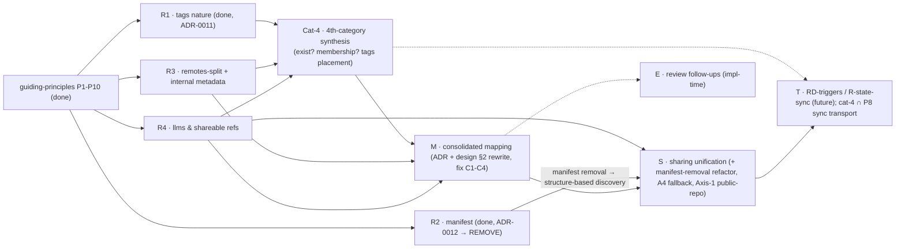

# Decentralized cco Config — Analysis Roadmap

**Status**: Living tracker (started 2026-06-16). Orders the remaining design analyses by
dependency/convenience so each runs in its **own clean session** without losing context.
**Foundation**: every analysis opens by reading **`guiding-principles.md`** (P1–P10, source of truth)
and validates its decisions against it. Decisions are recorded as ADRs + propagated to `design.md`,
`requirements.md`, and `resource-coherence-inventory.md`.

> **Method (P10 + ADR-0011)**: classify each resource from its **role + problem solved + principles**,
> never from its current surface/path. A borderline resource gets its **own clean session**; correct
> placement needs undivided context on that resource's purpose. Each analysis validates resources
> **one-by-one**: (1) **current-state recap (code-grounded)**; (2) state role + problem solved;
> (3) classify on both axes (destination P2 + sync-profile P3) via P1–P9; (4) flag/resolve conflicts
> with `design.md`/ADRs; (5) **maintainer confirm/reject** on UX/usage-impacting choices (interface,
> sync strategy) — not derivable from code alone; (6) record an ADR + propagate to living docs; (7)
> mark `DONE` here.
>
> **Lessons (ADR-0011)**: *don't discard/accept a priori* — classify only from the validated role (a
> first pass mis-classified tags from the *absence* of a CLI). **Cross-cutting verdicts are
> synthesised, not per-resource** — the 4th-category existence is decided by a dedicated **Cat-4
> synthesis** over *all* candidates (R1–R4), not inside any single resource analysis.

---

## Completed (config design)

| Item | Output |
|---|---|
| RD-claude-mount / RD-paths / RD-home / RD-memory / RD-authoring | ADR-0005 / 0007 / 0008 / 0009 / 0010 |
| Cross-domain coherence review | `reviews/16-06-2026-design-coherence-review.md` |
| Resource-coherence inventory (old-model references) | `resource-coherence-inventory.md` |
| **Guiding principles (foundation, P1–P10)** | `guiding-principles.md` |
| **Preliminary grounding** (destination + sync model) | folded into R1–R4 / M below |

---

## Analyses (ordered)

> The preliminary grounding (2 analysts, this session) produced a near-complete destination map and a
> sync-profile assignment, but the maintainer **reopened** three borderline classifications that the
> grounding had answered too quickly (tags/4th-category, manifest, internal metadata). Each becomes a
> dedicated role-first analysis (R1–R3) that feeds the consolidated mapping (M).

### R1 — tags nature & the Cat-4 method  ·  status: RESOLVED-PARTIAL (ADR-0011, 2026-06-17)
**Resolved (nature)**: the tag interface is **CLI-canonical** (`cco tag add/rm` + `cco list --tag`),
so by P1 tags are **internal** (cco-managed, not hand-edited) — correcting ADR-0010's provisional
"config" framing. Semantics unchanged (per-user, never-team, synced cross-PC). UX-confirmed by the
maintainer (CLI assign/filter >> hand-editing YAML; registry is a structured table, cf. `.git/index`).
**Deferred (placement + cat-4 verdict)**: `tags.yml`'s **physical bucket** (dedicated 4th
"internal-but-synced" bucket vs co-locate in `~/.cco`) and the **4th-category existence/membership**
are decided by the **Cat-4 synthesis** (new step below), since both depend on the full validated
candidate set (R1–R4). Selection rule: co-locate in `~/.cco` only if tags are the *sole* member;
else prefer a dedicated bucket. **Method correction recorded**: cat-4 is a *synthesis* verdict, not a
per-resource one — do not pre-judge. **Output**: ADR-0011 (+ `guiding-principles.md` P2/P10 +
`design.md` annotations updated). **Feeds**: the Cat-4 synthesis, then M.

### R2 — manifest.yml: role & necessity  ·  status: DONE (ADR-0012, 2026-06-17) — **REMOVE**
**Finding (code-grounded)**: every functional *read* of `manifest.yml` is discovery/validation
(`project/pack install`), both fully replaceable by navigating the Config Repo's predefined
structure (`templates/*/`, `packs/*/`) — each resource self-describes via its own
`pack.yml`/`project.yml`. No manifest-exclusive datum is consumed: descriptions come from
`pack.yml`; **repo URLs travel injected in the published `project.yml`** (`_sanitize` →
`_resolve_installed_paths`), **not** via the manifest; the manifest's `repos:url`, sharing tags,
and repo identity are **write-only**. The local `~/.cco/manifest.yml` has **no consumer**.
**Decision**: **remove `manifest.yml` entirely** — discovery becomes structure-based; delete
`lib/manifest.sh` + `cco manifest` + the `manifest_refresh`/`manifest_init` call sites. It is
**Domain-B** (Config-Repo-bound), **not** Axis-1 → **not a cat-4 candidate**. Write-only metadata
(repo identity, sharing tags, single-file catalogue) is dropped — re-add minimally only on real
need (YAGNI). **Output**: ADR-0012; the team-sharing **refactor is owned by S**. **Moots**
inventory open #1.

### R3 — Internal metadata & the unified update/merge mechanism  ·  status: REFRAMED → dedicated clean session
**Scope (resources)**: `.cco/source` (project/pack/llms provenance), `.cco/meta` (a **grab-bag**:
schema/hashes/policies/changelog/languages/remote_cache/flags), `.cco/base/` (merge ancestors),
`.claude/.cco/pack-manifest` (legacy), remotes registry **+ tokens**.
**Reframed (this session, 2026-06-17)**: these files are all metadata serving **one** thing — the
resource **diff/update/merge mechanism** — and several **mix responsibilities with different
sync/sharing profiles in one file** (esp. `.cco/meta`). Placement can't be decided until the
mechanism's shape + the **team-shared ↔ private-multi-PC boundary** are framed. **Two-phase plan**:
**Phase 0** — cardinal points (resource classes A team-shared / B private-multi-PC / C cco
opinionated-as-external-package; per-datum: what/why/scope/sync-profile; the A↔B boundary; couples
with **S** + **P9**); **Phase 1** — split each file by profile & place each datum.
**Validated conclusions (carry forward)**: `source` = resource-coupled provenance (multi-PC synced
*with* the resource, **never team**, publish-excluded; cat-4 *profile* but **sidecar**, not a bucket
member); `.cco/meta` → **split by responsibility/profile** (update-state→STATE · languages→preference
· changelog→notification · remote_cache→CACHE); `.cco/base/` → **STATE, machine-local, NOT synced**
(corrects today's vault-tracking; same profile as meta-hashes → co-locate; H6 merge-engine refactor
cost); `pack-manifest` → **remove** (legacy, mooted by cutover); remotes → **split** (tokens→STATE
never-synced · de-tokenized registry→cat-4 candidate). **Principle**: *co-locate by sync-profile, not
just functional domain.* **Full context + open questions**: see **`R3-update-metadata-handoff.md`**.
**Output**: ADR(s) + feed M + the Cat-4 synthesis (source/remotes inputs). Absorbs H6/M3.

### R4 — llms: nature & shareable references  ·  status: TODO
**Role/problem to establish first**: are llms **URL-only re-fetchable** (→ CACHE) or also
**manually-editable curated** resources (→ `~/.cco` config)? **Then**: what must travel so a third party
can fully **resolve** a shared project/pack — llms **source URLs** and repo **remote URLs** — across both
axes (private multi-PC *and* team). Evaluate "promote full source/URL into project/pack by name+source"
vs alternatives. **Output**: ADR (llms nature + shareable-reference model) + fills the llms cell in M +
closes inventory open #2. Interlinks with S (team resolve).

### Cat-4 — 4th-category synthesis  ·  status: BLOCKED on R1–R4 (new step, ADR-0011)
**Goal**: the cross-cutting verdict R1 deliberately deferred. With **all** candidates validated
(R1 tags · ~~R2 manifest~~ → **removed, ADR-0012, not a candidate** · R3 remotes-split + internal
metadata · R4 llms), decide: **(1)** does the
4th "internal-but-synced" category **exist** (cco-managed, hidden, NOT IDE-edited, but private
multi-PC synced)? **(2)** its **membership** (each of: `tags.yml`; de-tokenized remotes registry;
others — **never** tokens, which stay STATE non-synced for security); **(3)** the **placement of
`tags.yml`** per the selection rule (sole member → co-locate in `~/.cco`, balance cost/benefit;
else → dedicated bucket for cleanliness). **Also weigh (informational)**: whether the cat-4 sync
**transport** should be **unified** with the future STATE-sync (P8) — one "internal cross-PC sync"
mechanism across STATE, tags, and any cat-4 member (STATE keeps its dedicated XDG dir; only the
transport is shared). **Output**: ADR (cat-4 existence + membership + tags placement) → feeds M.
**Depends on**: R1–R4. **Blocks**: the tag/remotes cells of M.

### M — Consolidated resource taxonomy & mapping  ·  status: BLOCKED on R1–R4 + Cat-4
**Goal**: THE authoritative, exhaustive `resource → (destination, sync-profile)` table; **validate the
whole design against P1–P10 and fix the conflicts**; rewrite the layout trees to be exhaustive.
**Conflicts to fix (from grounding)**: **C1** `design.md:136` `backups/` in `~/.cco` → STATE; **C2** ADR-0007
`llms/`→CACHE conditional on R4; **C3** `design.md §2.3` `~/.cco` tree **incomplete** (missing global
`secrets.env`, `setup.sh`, `setup-build.sh`, `mcp-packages.txt`) — *note: `manifest.yml` is **removed**
(ADR-0012), so it must **not** appear in the tree*; **C4** `.cco/source` /
pack `.cco/meta` inside config buckets violate P6 (→ R3). **Already grounded (decided pending M)**: project
`mcp.json`/`setup.sh`/`mcp-packages.txt` → `<repo>/.cco/` (H5); `.cco/managed`, generated compose,
`claude-state`, `memory`, `meta`, `pack-manifest` → STATE; `install-tmp`/`.bak`/overlays/Config-Repo clones
→ CACHE. **Output**: **ADR (resource taxonomy)** + rewrite `design.md §2.1/2.2/2.3` + close inventory open
items. Absorbs review follow-ups H5/H6/M3.

### S — Sharing model unification  ·  status: TODO (after R4)
**Goal**: unify/simplify team-sharing (Config Repos = a third repo as remote; access via git token /
public). Confirm `~/.cco` = private-only; team-sharing always via a Config Repo. Evaluate cco's
**opinionated defaults as an official public Config Repo, shipped separately** (R-pkg / R-update-native).
**Also owns**: the **manifest-removal refactor (ADR-0012)** — replace `manifest.yml` discovery/validation
in `project/pack install` with **structure-based discovery** (`ls templates/*/`, `ls packs/*/`), replace
the empty-repo `manifest_init` with a `.gitkeep`/first-resource commit, and decide whether any **minimal**
repo identity/catalogue surface is worth re-introducing (default: no, YAGNI); the **Axis-1 public-repo
question** (P3 note — forbid/allow/escape-hatch for a public personal remote); the **A4 fallback option
(B)** (solo adopter: project `.cco/` under `~/.cco`, outside the repo — index `config_path` field,
`~/.cco/projects/` re-expansion, `cco start` discovery/precedence; post-v1). **Depends on**: R4 (what
travels), M. **Output**: ADR(s) / a dedicated sharing design doc.

### T — RD-triggers / R-state-sync  ·  status: FUTURE
Background daemon / native hooks / git hooks vs manual-only (v1 = manual). Owns `~/.cco` background
auto-sync and **R-state-sync** (memory + transcripts cross-PC/cross-team opt-in, ADR-0009) — the future
STATE-sync category (P8). **Depends on**: R1–S settled.

### E — Review follow-ups (implementation-detail)  ·  status: TODO (during/just-before implementation)
From `reviews/16-06-2026-design-coherence-review.md`, not blocking Phase 0: H2 (reminder-aggregator cost),
H7 (index concurrency & namespacing), M1/M2 (sync edge cases + sync-state lifecycle), H8 (join Case-C),
M4/M5 (extra_mounts schema/migration). Best resolved against real code during implementation. (H5/H6/M3
are absorbed by M/R3.)

---

## Dependency order

**Recommended sequence**: R1 ✅ → R2 ✅ → **R3 (reframed → dedicated clean session: update/merge
mechanism + metadata split; see `R3-update-metadata-handoff.md`)** → R4 → **Cat-4 synthesis**
(cross-cutting verdict over R1/R3/R4, manifest excluded) → **M** (consolidate + fix conflicts) → S
(executes the manifest-removal refactor) → (T, E around implementation). **R3 is the suggested next
session — start from the handoff doc (Phase 0 cardinal points).**

## Notes
- R1 is **resolved-partial** (ADR-0011): tag *nature* fixed (CLI-canonical → internal); the
  *4th-category verdict* + tag *placement* were **deferred** to the new **Cat-4 synthesis** step,
  because a cross-cutting verdict must be synthesised over *all* validated candidates, not decided
  inside one resource analysis.
- R2 is **DONE** (ADR-0012): `manifest.yml` is functionally redundant (every read is
  discovery/validation, replaceable by the Config Repo's directory structure) → **removed**; the
  team-sharing refactor is owned by S. Not a cat-4 candidate.
- R3 is **REFRAMED → dedicated clean session** (2026-06-17): the internal-metadata files all serve
  the **unified diff/update/merge mechanism**, and `.cco/meta` mixes profiles → the analysis is
  reframed as *(Phase 0)* framing the mechanism + the team-shared↔private-multi-PC boundary, then
  *(Phase 1)* splitting/placing by sync-profile. Validated conclusions, code anchors, principles,
  and open questions are persisted in **`R3-update-metadata-handoff.md`** (the next session opens
  from it). Key principle: **co-locate by sync-profile, not just functional domain.**
- ADR numbers are assigned when each session runs (next free number; last used = **0012**).
