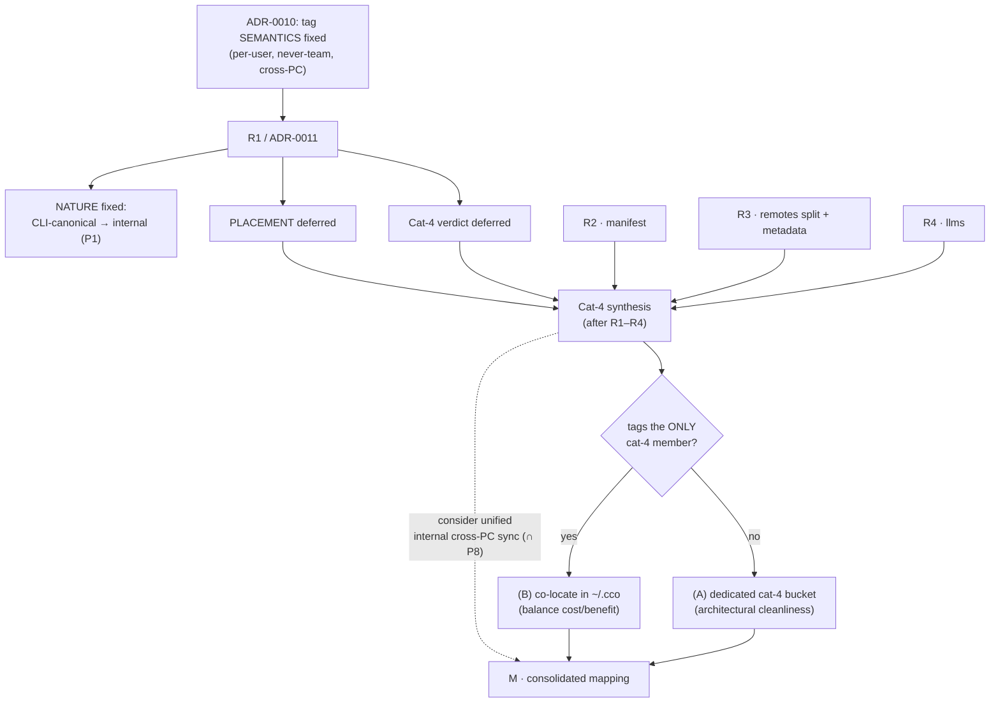

# ADR 0011 — Tag Resource Nature (CLI-canonical, internal, cross-PC-synced) & the Cat-4 Method

**Status**: Accepted (2026-06-17)
**Deciders**: maintainer + design session
**Context docs**: `../requirements.md` (FR-C, §8), `../design.md` §2.3, §2.4, §3, §7,
`../guiding-principles.md` (P1–P10), `../analysis-roadmap.md` (R1)
**Related ADRs**: 0010 (tag *semantics* — this ADR refines *nature & placement*, not semantics),
0008 (`~/.cco` git working tree + allowlist incl. `!tags.yml`), 0004/0007 (config/STATE/CACHE
buckets + XDG locations), 0002 (machine-local index — paths only)
**Resolves**: R1 (partial — tag *nature* fixed; tag *physical placement* and the 4th-category
existence verdict are **deferred to the Cat-4 synthesis**, see `analysis-roadmap.md`)

---

## Context

ADR-0010 fixed tag **semantics** (per-user, multi-valued, transversal, **never** team-shared,
synced across the user's own machines — Domain A / Axis-1) and **provisionally** placed
`tags.yml` in `~/.cco` as *config*. R1 must settle two things ADR-0010 left open:

1. the tag **nature** — are tags *config* (user-authored, IDE-edited) or *internal*
   (cco-managed via CLI), per the P1 edit-criterion?
2. whether a **4th destination category "internal-but-synced"** exists (cco-managed, hidden,
   NOT IDE-edited config, but worth private multi-PC sync), and if so whether `tags.yml`
   belongs to it.

**Code-grounded facts (today's tree).** Tags are **build-new**: no `cco tag` command exists
(`bin/cco` dispatch table, ~137–232), `cco list --tag` does not exist (`lib/cmd-pack.sh`
`cmd_pack_list`, ~93–123), and no `tags.yml` file is read or written anywhere in `lib/`/`bin/`.
The only existing "tags" are **Domain-B sharing metadata** round-tripped in the manifest
(`lib/manifest.sh` ~77–79, 334–360) — preserved across `manifest refresh`, explicitly **not**
from `pack.yml`. That is a **different concept** from ADR-0010's per-user tags.

**Method correction (P10).** A first pass tried to decide the 4th-category verdict *before* a
complete, code-grounded, maintainer-validated inventory of all candidate resources (tags,
remotes registry, manifest, internal metadata, llms). That ordering is backwards: the
4th-category existence is a **synthesis** decision over *all* candidates, not a per-resource one.
A per-resource analysis that classifies in isolation risks the exact error this ADR corrects —
classifying tags from the *absence* of a CLI rather than from a deliberate design choice.

## Decision

### 1. Tag interface = **CLI-canonical**
`cco tag add/rm <resource> <tag>` (write) and `cco list --tag <t>` (read) are the **canonical**
mutation and query paths. The user is **not expected to hand-edit** the registry. Rationale
(UX, maintainer-confirmed): assigning a tag to a resource and filtering listings is materially
more convenient via a command than by opening and editing a YAML file by hand; and the registry
is a **structured reference table** (every value references a resource cco already knows), whose
consistency — name normalization, no dangling references on rename, no malformed YAML breaking
all tag-filtered discovery — is best enforced by a CLI mediator. The structural analogue is
`.git/index`: a CLI-managed registry, not a hand-authored document.

### 2. Tag nature = **internal** (P1)
Because the canonical mutation path is the CLI (not IDE authoring), `tags.yml` is **internal**
by P1's edit-criterion — cco-managed, CLI-updated, not hand-edited. This **corrects ADR-0010's
provisional "config" framing**. ADR-0010's **semantics are unchanged**: tags remain per-user,
**never** team-shared (Domain B), synced **cross-PC** (Domain A / Axis-1). This ADR specifies
what ADR-0010 left implicit (the mutation mechanism); it does not overturn it. Authoring of
**packs/templates** stays **direct `~/.cco` edit** (ADR-0010) — only the **tag registry**
becomes CLI-managed.

### 3. Physical placement = **DEFERRED to the Cat-4 synthesis**
`tags.yml` is internal **and** must sync cross-PC — the canonical "internal-but-synced" profile,
which the current 3-bucket taxonomy (config / STATE / CACHE) does not express. Two resolutions:

- **(B) Co-locate in `~/.cco`** as a CLI-managed file that rides `~/.cco`'s existing sync
  (`cco config push/pull`) and privacy boundary (P5 — `~/.cco` is private-only). Half-enabled
  already by the `!tags.yml` allowlist (ADR-0008). **Cost**: relaxes P2 ("config buckets hold
  **only** P1-config") and tensions P6 (an internal file inside a config working tree).
- **(A) A dedicated 4th "internal-but-synced" bucket** — hidden, synced. Preserves P6 strictly.
  **Cost**: its own sync transport + privacy boundary.

**Selection rule (maintainer):** choose **(B)** *only if* tags turn out to be the **sole**
cat-4 resource — then a cost/benefit balance decides; **otherwise prefer architectural
cleanliness and separation of responsibility → (A)**. The choice therefore **cannot** be made
in isolation; it is taken in the synthesis once every candidate's nature is known.

### 4. 4th-category existence = **NOT pre-judged**; decided by a dedicated **Cat-4 synthesis**
The earlier "reject the 4th category a priori (no members)" is itself **rejected** as premature.
The category's existence and membership are decided by a **Cat-4 synthesis** step that runs
**after** the per-resource analyses R1–R4, with full awareness of all candidates:
`tags.yml`; the **de-tokenized remotes registry** (R3 — tokens are secret and **never** sync, a
security invariant); `manifest.yml` (R2 — Domain-B, regenerable); internal metadata (R3). Do
**not** discard candidates a priori; classify **after** analysis.

### 5. Method (persisted for future sessions)
Each roadmap analysis validates resources **one-by-one**, with **explicit maintainer
confirmation** on choices that affect how the toolkit is used (UX, interface, sync strategy).
Per resource: **current-state recap (code-grounded) → role + problem → validation against
ADRs/principles → maintainer confirm/reject → nature + classification + sync strategy.** Surface
placement is never evidence (P10); a candidate is classified from its role, and the cross-cutting
verdicts (like cat-4) are **synthesised** from the validated set, not assumed.

> **Completeness note — Cat-4 ∩ STATE-sync (P8).** The 4th category ("internal-but-synced") and
> the *future* STATE-sync (P8: memory + transcripts, opt-in, cross-PC) share a core: **resources
> of internal nature that sync cross-PC only**. STATE keeps its dedicated XDG directory, but the
> **sync transport** could be **unified** across STATE, `tags.yml`, and any cat-4 member — a
> single "internal cross-PC sync" mechanism, distinct from both `<repo>/.cco` (repo remote) and
> the team-sharing Config-Repo path. Recorded for decision completeness; to be weighed in the
> Cat-4 synthesis (informational now, not decided).

## Alternatives Considered

| Alternative | Pros | Cons | Verdict |
|-------------|------|------|---------|
| **Tags = hand-edited config in `~/.cco`** (ADR-0010 provisional) | No new CLI; rides `~/.cco` sync directly | Worse UX (edit YAML by hand); classification derived from the *absence* of a CLI, not a real design choice; no normalization / dangling-ref protection | **Rejected** (nature corrected to internal) |
| **Reject the 4th category a priori (no members)** | Closes the question fast | Premature — cat-4 is a synthesis over all candidates; the de-tokenized remotes registry is a live candidate (R3); risks force-classifying from surface | **Rejected** |
| **Decide placement now (force A or B)** | One less open item | Depends on the *full* candidate set + their natures, unknown until R1–R4; the selection rule itself is conditional on cat-4 membership | **Rejected** (deferred to synthesis) |
| **CLI-canonical tags → internal nature; placement & cat-4 deferred to a post-R1–R4 synthesis (chosen)** | Correct UX-driven nature; placement decided with full information; method made rigorous (per-resource validation + maintainer confirmation); ADR-0010 semantics preserved | `cco tag` is new CLI surface; tags.yml nature flips from the provisional "config" (doc updates); M blocked on the synthesis | **Accepted** |

## Consequences

**Positive** — tag nature is correct and UX-driven (CLI-canonical, internal); physical placement
is decided with full information rather than guessed; the analysis method is made rigorous
(per-resource recap → validation → maintainer confirmation → classification), preventing the
surface-classification error this ADR corrects; ADR-0010's tag semantics are preserved intact.

**Negative** — `cco tag add/rm` + `cco list --tag` are **new CLI surface** to build; `tags.yml`'s
nature flips from ADR-0010's provisional "config" to **internal**, so the living docs
(`design.md` §2.3/§7, `guiding-principles.md` P2, the inventory) need realignment; the **physical
placement stays open** until the Cat-4 synthesis, which therefore **blocks M** for the tag cell.

## Reuse / Drop / Build-new

| Element | Verdict |
|---------|---------|
| `cco tag add/rm <resource> <tag>`; `cco list --tag`; the `tags.yml` registry (**internal**); CLI-mediated normalization + rename-propagation + validation | **Build-new** |
| `~/.cco` allowlist `!tags.yml` (ADR-0008); the cross-PC sync transport (`cco config push/pull`, or a future **unified internal cross-PC sync**) | **Reuse** (placement-dependent) |
| ADR-0010's "direct-edit canonical authoring" **for the tag registry specifically** (authoring of packs/templates stays direct-edit) | **Drop** for tags only |

## Open

- **Physical placement of `tags.yml`** — (A) dedicated cat-4 bucket vs (B) co-locate in `~/.cco`
  → **Cat-4 synthesis** (selection rule in Decision §3).
- **4th-category existence + full membership** → **Cat-4 synthesis** (inputs: R1–R4).
- **Unified internal cross-PC sync mechanism** (cat-4 ∩ STATE-sync P8) → weigh at the synthesis.
- **`cco tag` exact surface** (rename propagation, tag-name normalization rules, stale-ref
  handling) → implementation.
