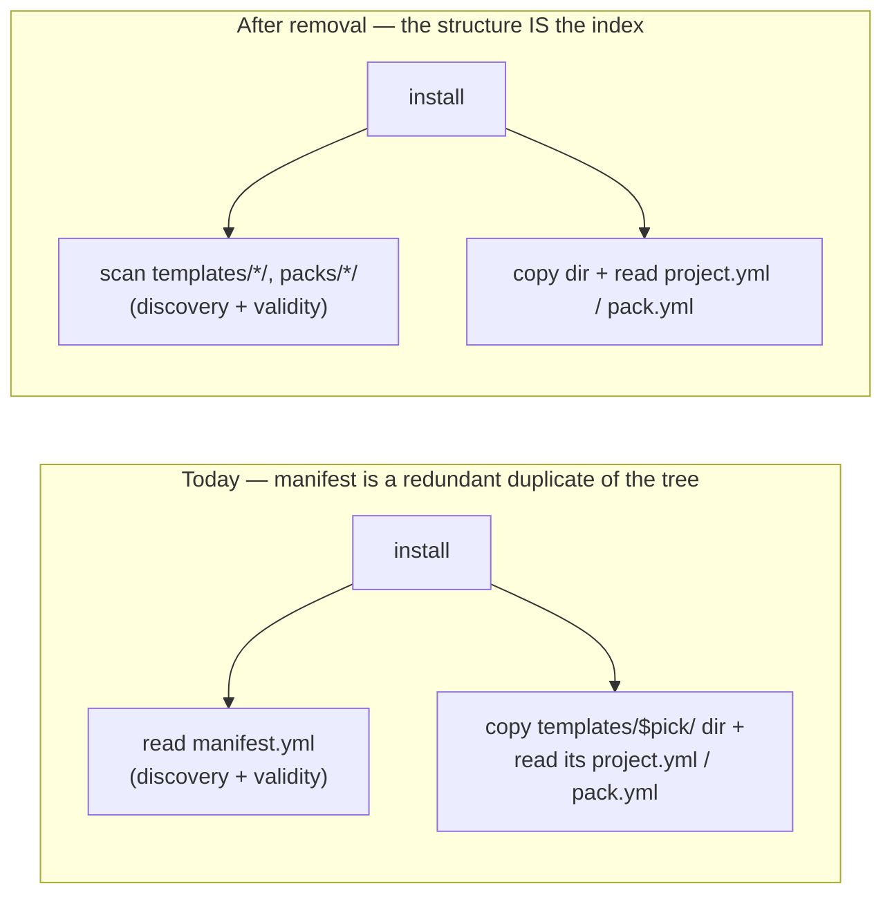

# ADR 0012 — Remove `manifest.yml`: Config Repo discovery via directory structure

**Status**: Accepted (2026-06-17)
**Deciders**: maintainer + design session
**Context docs**: `../analysis-roadmap.md` (R2), `../design.md` §2.3/§7, `../requirements.md`
(sharing FRs), `../guiding-principles.md` (P1–P10)
**Related ADRs**: 0001 (decentralization), 0004 (config/STATE/CACHE), 0010/0011 (the manifest's
*sharing* tags are a **different concept** from per-user tags); **relates to S** (sharing-model
unification — which **executes** the resulting team-sharing refactor)
**Resolves**: R2 (manifest role & necessity)

---

## Context

`manifest.yml` is self-described in code as *"the index that describes what a Config Repo
contains"* (`cmd_manifest` help; `manifest_show` prints a `Config Repo / Packs / Templates`
view). It lists packs + templates with `name/description/tags` (and, per template, `packs` and
`repos:url`). R2 must establish whether it is actually **needed** — locally and for team
publish/install — or redundant under the decentralized model.

## Finding (code-grounded)

**Every functional *read* of `manifest.yml` is discovery or validation, and both are fully
replaceable by navigating the Config Repo's predefined directory structure** (`packs/*/`,
`templates/*/`, `projects/*/`), where each resource already self-describes via its own
`pack.yml` / `project.yml`:

| Use | What it does | Replacement |
|---|---|---|
| `project install` (`cmd-project-install.sh:106-111`) | "valid Config Repo" marker (`die` if absent) | presence of `templates/`/`packs/` structure |
| `project install` (`:113-138`) | list/validate available **templates** | `ls templates/*/` |
| `project install` (`:140`, `:178-192`) | copy `templates/$pick/`; auto-install its packs | **already directory-based** (reads the template's `project.yml` + `packs/$name/`), never manifest |
| `pack install` (`cmd-pack.sh:468-510`) | marker + list **packs** for a *multi-pack* repo | `ls packs/*/` (single-pack repos already use `pack.yml`, not the manifest) |
| all `manifest_refresh` / `manifest_init` (`cmd-pack`, `cmd-project-install/publish`, `cmd-init`, `remote.sh`) | **write** the manifest | — (housekeeping; nothing reads it functionally) |

**No manifest-exclusive datum is ever consumed:**
- per-entry `description` originates from `pack.yml` (`manifest_refresh` reads `pack.yml` first);
- the **repo URLs** a consumer needs to clone do **not** travel via the manifest — they are
  injected into the published `project.yml` at publish time (`_sanitize` reads `git remote
  get-url`, `local-paths.sh:268-324`) and read back from `project.yml` at install
  (`_resolve_installed_paths`). The manifest's `repos:url` (`manifest.sh:152-160`) is
  **write-only**;
- the per-entry **sharing tags** and the Config Repo's **identity** (`name/description`) are
  likewise **write-only** — displayed only by `manifest show`, consumed by nothing.

A Config Repo's filesystem layout **is** the index. The manifest duplicates it (and `manifest
validate` exists precisely because the duplicate drifts).

## Decision

**Remove `manifest.yml` entirely.** Team-sharing discovery becomes structure-based:

1. **Discovery** = list `templates/*/`, `packs/*/`, `projects/*/` in the cloned Config Repo.
2. **Validity** ("is this a Config Repo?") = presence of the known structure, not a manifest
   marker file.
3. **Resource metadata** = read from each resource's own `pack.yml` / `project.yml`.
4. **Delete** `lib/manifest.sh` and the `cco manifest` command; drop the ~8 `manifest_refresh`
   housekeeping calls and `manifest_init` (empty-repo first publish initialises with a
   `.gitkeep` / the first resource commit instead).
5. **Classification**: the manifest is **Domain-B** (Config-Repo-bound), **not** Axis-1 → it is
   **not** a 4th-category candidate. One candidate is removed from the Cat-4 synthesis.

**Intentionally dropped** (all write-only today, with no consumer): Config Repo **identity**
(`name/description`), per-entry **sharing tags**, and the single-file **catalog**. If a future
"browse/catalogue" UX or a repo identity is genuinely wanted, give it a **minimal dedicated
home then** (YAGNI) — owned by S.

**Execution boundary**: R2 fixes the **finding + the removal decision**. The team-sharing
**refactor** that implements structure-based discovery (install/publish, empty-repo init) is
owned by **S** (sharing-model unification), as the roadmap anticipated ("decision recorded in S
if team-sharing-only").

## Alternatives Considered

| Alternative | Pros | Cons | Verdict |
|-------------|------|------|---------|
| **Keep + rehome to `~/.cco/manifest.yml`** (inventory open #1, provisional) | No code change | Local copy has **no consumer**; conflates the personal store with "a Config Repo"; a single global manifest cannot represent **multi-remote** identities; redundant with disk | **Rejected** |
| **Keep as a Config-Repo-only index** (no local copy) | A one-file catalogue, browsable without scanning | Still redundant with the tree (install already scans dirs); a maintained file that **drifts** (`manifest validate` exists for that); buys nothing the structure doesn't give | **Rejected** |
| **Remove entirely; structure-based discovery (chosen)** | Less code (`lib/manifest.sh` + command gone); no manifest↔disk drift; the repo structure *is* the index; one fewer cat-4 candidate; lean direction | Loses write-only metadata features (re-add minimally only on real need); install/publish discovery refactor is new work (owned by S) | **Accepted** |

## Consequences

**Positive** — removes `lib/manifest.sh`, the `cco manifest` command, and ~8 write-only
`manifest_refresh` calls; eliminates a whole drift/validation surface; simplifies the mental
model (a Config Repo's directories are its catalogue); removes one candidate from the Cat-4
synthesis; advances the lean/simplification direction.

**Negative** — the install/publish **discovery refactor** (dir-scan + empty-repo init
replacement) is new work, owned by **S**; the write-only metadata features (repo identity,
sharing tags, single-file catalogue) are dropped — re-introduce minimally only if a concrete
need emerges; docs and CLI help referencing `cco manifest` must be updated.

## Reuse / Drop / Build-new

| Element | Verdict |
|---------|---------|
| `lib/manifest.sh` (`manifest_init/refresh/validate/show`); `cco manifest` command; `manifest_refresh`/`manifest_init` call sites | **Drop** |
| Structure-based discovery in `project/pack install` (`ls templates/*/`, `ls packs/*/`); structure-based "is a Config Repo" check; empty-repo init via `.gitkeep`/first-resource commit | **Build-new** (in S) |
| Per-resource self-description (`pack.yml`/`project.yml`); repo-URL travel via published `project.yml` (`_sanitize`/`_resolve_installed_paths`) | **Reuse** (unchanged) |

## Open

- Exact **structure-based discovery + validity** implementation and the **empty-repo init**
  replacement → **S**.
- Whether to preserve any **minimal** repo identity / catalogue surface → **S** (only if a real
  need emerges).
- Cleanup of inert `manifest.yml` files in existing installs rides the **Phase-3 breaking
  cutover** (ADR-0006) alongside the vault/store migration — no standalone migration.

## Implementation (forward-annotation, 2026-06-24 — decision unchanged)

Landed in **Phase 4, commit `6b2673f` (P4-2)**. Structure-based discovery is the new
`_discover_resources <root> packs|templates` (in `lib/remote.sh`) — a `<section>/<name>/`
carrying its `pack.yml`/`project.yml`; the empty-repo init replacement is a `git commit
--allow-empty` (no `.gitkeep` needed). The `cco pack|project install` discovery readers were
rewritten onto it and every `manifest_refresh`/`manifest_init` writer call was dropped; then
`lib/manifest.sh`, the `cco manifest` command (now a removed-stub `die`), and `tests/test_manifest.sh`
were deleted. **Code-grounded confirmation of the "no consumer" finding (R2):** the local
`~/.cco/manifest.yml` had no reader — `cco pack list` already scanned `$PACKS_DIR/*/` by structure.
**Build-phase note:** the §9 plan placed the manifest delete in P4-3 (bundled with sync-before-publish);
because the subsystem is fully dead once discovery exists ("delete LAST" = right after discovery),
the deletion was **folded into P4-2** to avoid carrying dead code, leaving P4-3 as sync-before-publish
only. End state unchanged.
