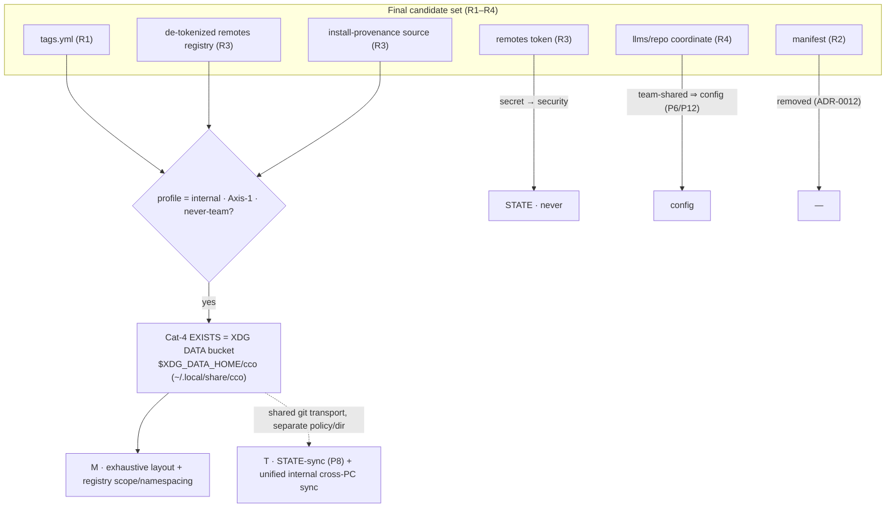

# ADR 0015 — Cat-4 synthesis: the 4th bucket (internal-but-synced, never-team) exists = XDG **DATA**

**Status**: Accepted (2026-06-17)
**Deciders**: maintainer + design session
**Context docs**: `../analysis-roadmap.md` (Cat-4), `../guiding-principles.md` (P1–P12 — esp. P2
4th-bucket row, P10 method, P11 three-question, P12 coordinate discriminator), `../design.md` §2,
`../resource-coherence-inventory.md`
**Related ADRs**: 0004 (config/STATE/CACHE separation), 0007 (system-dir locations / XDG — this ADR
**completes** its CONFIG/DATA/STATE/CACHE mapping by claiming the unused **DATA** tier, and **refines**
its §Decision-2 which provisionally put the remotes registry in STATE), 0008 (sync transports commits,
never fabricates — the cat-4 transport reuses this), 0009 (memory as STATE; P8 STATE-sync), 0010/0011
(tag semantics & nature — placement resolved here), 0012 (manifest removed — not a candidate),
0013 (internal-metadata split — feeds `source` + de-tokenized registry; resolves its open `source`
sync verdict), 0014 (referenced-resource coordinate = **config**, removed from candidates by P12)
**Resolves**: the **Cat-4 synthesis** (R1's deliberately-deferred cross-cutting verdict) — existence,
membership, `tags.yml` placement, the bucket's physical location, and ADR-0013's open `source`
sync-class. **Feeds**: **M** (exhaustive byte-level layout + registry scope/namespacing) and unblocks
the tag/remotes cells of M. **Hands transport mechanism to**: **T** (R-state-sync / unified internal
cross-PC sync) and **S** (publish-boundary, which never touches cat-4).

---

## Context

R1 (ADR-0011) deliberately deferred a **cross-cutting** verdict to a synthesis over *all* validated
candidates: does a **4th destination category** exist — *internal* (cco-managed, hidden, **not**
IDE-edited, P1/P6), **synced private multi-PC** (Axis-1), **never team** (Axis-2) — and if so, what
belongs in it and where does it physically live? The method (ADR-0011 lesson c) is explicit: this is a
**synthesis** decision, never a per-resource one; classifying a candidate in isolation risks the very
surface-error R1 corrected.

With R1–R4 all resolved, the **final validated candidate set** is fixed:

| Candidate | Source | Nature | Axis-1 (cross-PC) | Axis-2 (team) |
|---|---|---|---|---|
| `tags.yml` | R1 / ADR-0011 | internal (CLI-canonical) | `required` | **never** |
| de-tokenized remotes registry (`name→url`) | R3 / ADR-0013 | internal | `required` | **never** |
| install-provenance `source` | R3 / ADR-0013 | internal (cco-derived) | `required` (D3 here) | **never** |
| remotes **token** | R3 / ADR-0013 | internal **secret** | — | — → **STATE·`never`** (security) |
| llms/repo **coordinate** (`name→url`) | R4 / ADR-0014 | **config** (P6/P12) | yes | **yes** (resolve-at-publish) |
| `manifest.yml` | R2 / ADR-0012 | — | — | — → **removed** |

The candidate set is bounded by two prior discriminators that this ADR does **not** relitigate:
**security** (a secret never syncs — token → STATE·`never`) and **P12** (a value that *must* be
team-shared cannot be internal — the llms/repo coordinate is **config**, not cat-4). What remains to
synthesise is the existence verdict, the membership among the three internal-never-team candidates,
and where they physically live.

## Decision

### D1 — The 4th category **EXISTS** = the XDG **DATA** tier

The profile `(internal · Axis-1-synced · never-team)` is real and **expressed by none** of the three
existing buckets:

- **config** (`~/.cco`, `<repo>/.cco`) — would violate P1 (these are CLI-managed, not hand-edited) and
  P6 (internal must never live in a config bucket; would also make `git diff` on config untruthful, G8).
- **STATE** — defined as machine-local, **non-portable**, scan/rebuildable (ADR-0007 §Decision-1).
  Syncing it cross-PC contradicts its identity, and ADR-0013 D2 deliberately keeps STATE `never`-sync
  (base/hashes/tokens) behind a hard allowlist boundary.
- **CACHE** — regenerable/re-fetchable; these data are **authoritative**, not regenerable.

The category is **not invented ad hoc**: ADR-0007 §Context already noted that the XDG spec's
**CONFIG / DATA / STATE / CACHE** split maps onto cco's classes — it claimed STATE and CACHE and left
**DATA unassigned**. The XDG spec orders portability as **DATA > STATE > CACHE** (DATA = "user-specific
data files", the portable/backed-up tier; STATE = "persist between restarts but **not portable
enough** for DATA"; CACHE = disposable). **Cat-4 = "internal but portable/synced" = exactly the DATA
tier.** Adopting it **completes** ADR-0007's XDG mapping rather than adding a foreign convention.

### D2 — Physical location = **`$XDG_DATA_HOME/cco`** (→ `~/.local/share/cco`), override `$CCO_DATA_HOME`

A **dedicated bucket** (not co-located in `~/.cco`), per the selection rule (D4). Its location is the
**DATA** XDG base, resolved with the same precedence ADR-0007 fixed for STATE/CACHE:

| Class | Resolution | Default (Linux + macOS) |
|---|---|---|
| **DATA** (cat-4) | `$CCO_DATA_HOME` → `$XDG_DATA_HOME/cco` → `~/.local/share/cco` | `~/.local/share/cco` |

The `$CCO_DATA_HOME` override ranks above `$XDG_DATA_HOME` (precedent: `CCO_STATE_HOME`/`CCO_CACHE_HOME`,
`GH_CONFIG_DIR`). The same robustness rules apply (treat unset/empty/non-absolute XDG var as absent;
**host-side only**, anti-in-container guard; `mkdir -p` mode `0700`; route through `expand_path()`).
This preserves ADR-0007's clean UX split and *extends* it: **`~/.cco` = what you edit and version ·
`~/.local/share/cco` = internal data that is **portable/synced** · `~/.local/state/cco` +
`~/.cache/cco` = machine-internal plumbing you never sync.**

> **Refines ADR-0007 §Decision-2.** ADR-0007 provisionally listed "the remotes registry **+ tokens**"
> under STATE. Post-R3/this-ADR: the **de-tokenized registry** (`name→url`) moves to **DATA** (cat-4,
> `required`); only the **token** stays in STATE (`never`, isolated). This is the registry/token split
> of ADR-0013 D3 landing at byte level.

### D3 — Membership = {`tags.yml`, de-tokenized remotes registry, install-provenance `source`}

All three are internal (P1), `required`-sync (Axis-1 by design), **never-team** (Axis-2) → DATA.

- **`tags.yml`** — per-user global tag registry (ADR-0010 semantics, ADR-0011 nature). `<data>/cco/tags.yml`.
- **de-tokenized remotes registry** (`name→url`) — the user's personal list of **Config Repo
  endpoints** for publish/install. Synced across the user's PCs; **never** shared (a teammate does not
  need my remotes — published resources travel by their own coordinate, not via my registry). **Token
  split out** to STATE·`never` (re-entered per PC via `cco remote set-token`).
  - **Disambiguation (for M):** this is **distinct** from ADR-0014's **coordinate registry**. Both are
    `name→url` maps, but with **opposite sharing-profiles**: *remotes* = Config-Repo endpoints
    (personal infra, **never-team** → DATA); *coordinates* = referenced-resource locators
    (**must** be team-shared to resolve → **config**, P12). Same shape, opposite axis-2 → opposite bucket.
- **install-provenance `source`** — where an installed pack/template/project came from (`url`+`ref`),
  drives `cco update`. **Sync = `required`** (D3 resolves ADR-0013's open `required? / never+reinstall`):
  the resource it describes (installed pack/template) lives in `~/.cco` and **syncs Axis-1**; for
  `cco update` to work on every PC that has the synced resource, provenance must travel **with** it,
  keyed by resource identity. `source` is **not** version-tied (it records the *upstream* `url+ref`,
  not a local hash or path — unlike `base/`, which is correctly `never`), so syncing it is safe. It is
  **never-team**: at publish it is re-stripped (a teammate's `cco … install` re-establishes *their*
  `source` pointing at the Config Repo) — exactly the "write-only at the boundary" property that made
  the manifest tags non-shared. This keeps it **distinct** from ADR-0014's team-shared coordinate.

**Excluded** (already discriminated, not relitigated): remotes **token** (security → STATE·`never`);
llms/repo **coordinate** (P12 team-shared ⇒ config); `manifest.yml` (removed, ADR-0012).

### D4 — `tags.yml` placement resolved by the selection rule → dedicated bucket

The selection rule (P2 / ADR-0011 §3): co-locate a lone cat-4 resource in `~/.cco` **only if it is the
sole member**; otherwise prefer a **dedicated bucket** for architectural cleanliness. Membership is
**≥2** (in fact 3) → the *sole-member* branch is not taken → **dedicated bucket** (D2). The half-enabled
`!tags.yml` allowlist in `~/.cco` (ADR-0008) is therefore **not** the home; `tags.yml` lives at
`<data>/cco/tags.yml`. (`~/.cco` stays authored-content-only — the precondition ADR-0007 relies on for
the clean in-place git-repo model — and P6 is preserved strictly.)

### D5 — Internal layout: centralized, keyed by identity (byte-level → M)

Following the ADR-0013 corollary ("config decentralizes, internal **centralizes**, keyed by
resource/project identity"), the DATA bucket is centralized:

```
<data>/cco/
  tags.yml                       # per-user global tag registry
  remotes                        # de-tokenized registry: name → url  (token lives in STATE)
  projects/<id>/source           # install-provenance (url+ref), keyed by project identity
  packs/<name>/source            # install-provenance, keyed by pack identity
  templates/<name>/source        # install-provenance, keyed by template identity
```

This is the **shape**, not the final byte-level spec: the exhaustive layout, the `source` file format
(standalone vs folded), and the **registry scope/namespacing** (global vs per-project, shared with
ADR-0014's coordinate registry question) are **finalized in M**.

### D6 — (Informational) Transport ∩ STATE-sync (P8): one engine, separate policy & directory

The future STATE-sync (P8: memory + transcripts, ADR-0009) and cat-4 share a **core**: *internal
resources synced cross-PC via git* (ADR-0008: transports commits, never fabricates). The recommendation
(decision **owned by T**, informational here):

- **Unify the transport** — one git-backed Axis-1 private-remote push/pull engine, ADR-0008-compliant
  (non-fast-forward → abort + notify), serving the internal synced stores.
- **Keep policy and directory per-store separate** — the engine carries a **per-store sync-class
  allowlist**, mirroring ADR-0013 D2's boundary:

  | Store | XDG base | Sync-class | In scope when |
  |---|---|---|---|
  | cat-4 (tags, registry, source) | **DATA** | `required` | **always** (by design) |
  | STATE `/session` (memory, transcripts) | STATE | `opt-in` (P8) | user-gated (T) |
  | STATE `/update` (base, hashes, tokens) | STATE | `never` | **never** |
  | `~/.cco` config | CONFIG dotdir | `required` | always (`cco config push/pull`, ADR-0008) |

  cat-4 (DATA, `required`, never-team) and STATE-session (`opt-in`, possibly cross-team per ADR-0009)
  may share the *engine* but **never** the *scope* — the allowlist guarantees the `never` tier
  (base/hashes/tokens) can never be swept into a sync. Whether cat-4 reuses the `~/.cco` private-remote
  credential/plumbing or gets its own is an **M/T** layout detail; it must **not** ride the `~/.cco`
  working tree itself (P6). v1 stays manual; background auto-sync → T (RD-triggers).



## Alternatives Considered

| Alternative | Pros | Cons | Verdict |
|---|---|---|---|
| **Reject the 4th category; force tags into `~/.cco`** | No new bucket | ≥2 members share the profile; co-locating internal data in a config bucket violates P1/P6 and breaks `~/.cco`'s authored-only precondition (ADR-0007); selection rule explicitly forbids it when members ≥2 | **Rejected** |
| **Put cat-4 under STATE** (`<state>/cco/synced/`) | No new XDG base; one less concept | Contradicts STATE's "machine-local, non-portable" identity (ADR-0007); ignores that XDG already has the right **DATA** tier; muddies the `never`-sync allowlist boundary (ADR-0013 D2) | **Rejected** |
| **New dotdir `~/.cco-data`** | Matches the `~/.cco` dotdir precedent | Breaks ADR-0007's UX split (plumbing belongs in XDG, not a home dotdir); home clutter; non-idiomatic | **Rejected** |
| **`source` = `never` + reinstall** (STATE) | Keeps cat-4 at 2 members; provenance never travels | Resources synced via `cco config push/pull` (not explicit install) arrive on PC-B with **no** provenance → `cco update` broken there until reinstall — a real regression | **Rejected** |
| **4th bucket = XDG DATA (`$XDG_DATA_HOME/cco`); members = tags + registry + source(`required`); tags in the dedicated bucket (chosen)** | Completes ADR-0007's XDG map; spec-correct portability tier; P1/P6 clean; dissolves the no-home tension; principled selection-rule outcome; `source` follows its resource's sync-profile | A 4th location convention now exists (4 bases: CONFIG dotdir + DATA + STATE + CACHE); registry now syncs where it did not (verify no token leak — S); byte-level layout deferred to M | **Accepted** |

## Consequences

**Positive** — the "internal yet privately synced" profile finally has a principled home; ADR-0007's
XDG CONFIG/DATA/STATE/CACHE mapping is **complete**; P1/P6 stay clean (no internal data in config
buckets; `~/.cco` remains authored-only); the selection rule produces a deterministic placement;
`source` provenance correctly follows the sync-profile of the resource it describes; the registry/token
split lands at byte level; one transport can serve all internal Axis-1 sync with a per-store allowlist;
**M is unblocked** (tag/remotes cells) and gains a concrete bucket + layout shape.

**Negative** — a 4th location convention now coexists with the three from ADR-0004/0007 (accepted: it
is the spec's own DATA tier, not a foreign one); the de-tokenized registry **starts** syncing where it
did not before — **S must verify no token leak** at implementation (token stays STATE·`never`); the
exhaustive byte-level layout, the `source` file format, and the registry scope/namespacing are
**deferred to M**; this ADR fixes existence/membership/placement/sync-class, not the final paths.

## Reuse / Drop / Build-new

| Element | Verdict |
|---|---|
| ADR-0007 XDG resolver (precedence, robustness rules, anti-in-container guard) → extend with a **DATA** base + `$CCO_DATA_HOME` override | **Reuse / extend** |
| ADR-0008 git-backed push/pull transport (commits-only, abort on non-ff) as the cat-4 / unified internal cross-PC sync engine | **Reuse** |
| `~/.cco` `!tags.yml` allowlist (ADR-0008) as tags' *home* | **Drop** (tags move to the DATA bucket) |
| de-tokenized remotes registry location in STATE (ADR-0007 §Decision-2 provisional) | **Refactor** (→ DATA) |
| The 4th **DATA** bucket; centralized keyed-by-identity cat-4 layout; per-store sync-class allowlist across DATA/STATE/config | **Build-new** (finalized in M; transport in T) |

## Open (deferred, not unresolved)

- **M** — exhaustive byte-level `<data>/cco/` layout; `source` file format (standalone vs folded into
  a per-resource record); **registry scope/namespacing** (global vs per-project) — shared with
  ADR-0014's coordinate-registry scope question; consolidated `resource → (bucket, sync-profile)` table.
- **S** — security verification that splitting the de-tokenized registry from the token introduces **no
  token leak**; the publish boundary continues to **never** touch cat-4 (re-strips `source`).
- **T (R-state-sync)** — whether to **unify the transport** across cat-4 (DATA, `required`),
  STATE-`/session` (P8, `opt-in`), and `~/.cco` config; per-store allowlist enforcement; background
  auto-sync (RD-triggers). cat-4 itself is `required` and not gated by P8.
