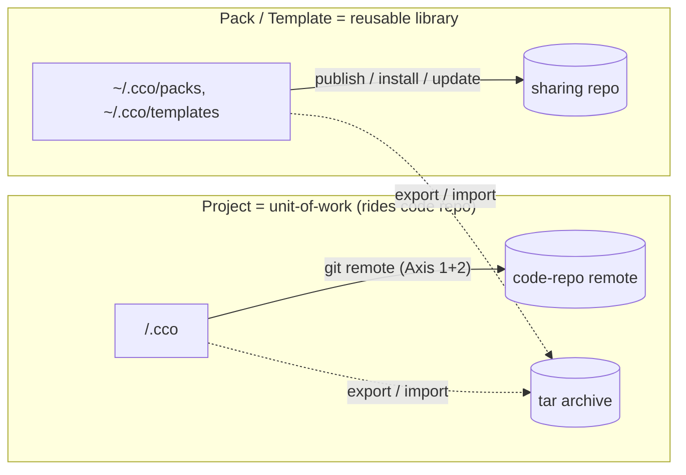

# ADR 0018 — Sharing model unification: nomenclature, command matrix, project-sharing asymmetry, sharing-repo structure

**Status**: Accepted (2026-06-18)
**Deciders**: maintainer + design session (S)
**Context docs**: `../guiding-principles.md` (P3 two axes, P5 sharing asymmetry, P9 packaging —
**P13/P14 added by this cycle**), `../S-handoff-sharing-unification.md`, `../design.md` §6/§7/§10/§12,
`../requirements.md`
**Related ADRs**: 0003 (sync-as-copy), 0008 (sync transports commits; access delegated to git),
0012 (manifest removed — its mechanism is realized here), 0013 (A/B/C resource classes; R3
shared-surface map), 0014/0016 (referenced-resource coordinate model), 0017 (coordinate field
semantics; F3 Domain-B realignment — **resolved here**), 0019 (reachability & pack lifecycle — the
companion of this ADR), 0020 (maintainer/consumer permissions)
**Resolves**: the S-phase **Domain-B / team-sharing** half — the nomenclature, the publish/install/
export/import command matrix, the project-vs-pack sharing asymmetry, and the on-disk sharing-repo
structure after manifest removal. **Hands off**: **E** (impl: structure-based discovery, init-at-
first-publish, `cco update --check`, manifest deletion call-sites), **a dedicated post-v1 analysis**
(solo-adopter Case C).

> This ADR fixes the **sharing surface**; the **referenced-resource reachability + pack lifecycle**
> that flows through it is ADR-0019; the **permission model** is ADR-0020. Read the three together.

---

## Context

The decentralized config refactor (ADRs 0001–0017) decided that project config lives in
`<repo>/.cco/` and is team-shared *by construction* (it rides the application code-repo's git remote,
Axis 1+2, P5), while personal global resources (packs/templates/global `.claude`) live in `~/.cco`
(Axis-1 private). What was **not** revised is the legacy team-sharing surface: the legacy "config
repo" was a *unified* concept (the central user-vault and a team-sharing repo shared one structure and
were interchangeable for team-sharing, backup, and personal config). The decentralized model
**separates** these resources, so the unified term is now ambiguous, and the publish/install/update/
export commands (built for the central-vault world, gated on `manifest.yml`) need a clean redefinition
against the new model (ADR-0017 F3).

A maintainer review during S surfaced a structural fact the earlier ADRs implied but never stated:
**project sharing and pack/template sharing are asymmetric**, and the asymmetry has real consequences
(two sharing paths for the user; a project that references packs cannot trivially "carry" them). This
ADR settles the surface; the asymmetry is examined and **accepted as inherent** (P13).

---

## Decision

### D1 — Nomenclature: "config repo" retired → **config bucket** + **sharing repo**

The unified "config repo" term is **removed**. Two precise terms replace it:

- **Config bucket** — the two CONFIG destinations the user authors and versions: `~/.cco` (personal
  global) and `<repo>/.cco` (project). Already classified as config (P1/P2, ADR-0016 D8).
- **Sharing repo** — a **dedicated git remote** used for `publish`/`install`/`update` of **packs and
  templates** (Axis-2 team-sharing). It is **not** a config bucket and **never** holds project config
  (one exception is examined under solo-adopter Case C, D6 / post-v1).

The guides and CLI copy adopt this split. "Config Repo" in older docs is migrated to "sharing repo".

### D2 — The command matrix: a symmetric 2×2; projects do not publish/install

Resource sharing has **two transports** (a remote sharing repo; a local tar) and **two directions**
(produce; consume), giving a uniform 2×2. `<res>` ∈ {pack, template, project}:

| | **Out** (produce) | **In** (consume) |
|---|---|---|
| **Remote (sharing repo)** | `cco <res> publish` | `cco <res> install` |
| **Local (tar archive)** | `cco <res> export` | `cco <res> import` |

- `publish` ↔ `install`: **packs/templates only**. Live source → updatable via `cco update`.
- `export` ↔ `import`: **packs/templates and projects**. Snapshot (a tar is a frozen point-in-time).
  `import` records a `source` if the tar carries one (then `cco update` works) else it is an
  internalized snapshot. Either can be `internalize`d (ADR-0019 D4).
- **Projects are NOT published/installed.** A project's `<repo>/.cco/` is team-shared by riding the
  code-repo remote (Axis 1+2, P5) — there is **no publish boundary**. A repo with no `.cco/` is
  bootstrapped by `cco init` (clean), `cco init` from a template, `cco migrate` (legacy), or
  `cco project import` (a previously-exported tar). This is the asymmetry of D3/P13.

`import` and `install` stay **separate verbs** (not a unified `import` with url/tar detection): they
differ in *transport* **and** default *lifecycle* (live-updatable vs snapshot); two verbs keep the
mental model crisp and mirror the existing `export`.

### D3 — Sharing-repo structure: `packs/` + `templates/` only; structure-based discovery; init-at-first-publish

Realizing ADR-0012 (manifest removed) for the sharing-repo path:

- **Layout** (v1): `<sharing-repo>/packs/<name>/` and `<sharing-repo>/templates/<name>/` only.
  **No `projects/`** (projects do not publish — D2/P13; the one solo-adopter exception is post-v1, D6).
- **Discovery is structure-based** — enumerate `packs/*/`, `templates/*/` (a treeless/shallow clone +
  `git ls-tree` is enough; reuse `lib/remote.sh` sparse/shallow). Each unit is **self-describing** via
  its own `pack.yml` (name, description). **No `manifest.yml`**, no generated catalogue in v1.
  *(A cco-managed, non-authoritative `index` generated at publish — purely to browse without a clone —
  is reconsidered only if "browse-zero-clone" becomes a real need; structure stays the source of truth.
  Such an index would live **only** in a sharing repo, **never** in `~/.cco`/`<repo>/.cco`.)*
- **Partial install** is supported: enumerate, let the user pick a subset, copy only the selected
  resources into `~/.cco` (no full materialization required).
- **Init-at-first-publish**: an empty git repo set as a cco sharing remote is populated on the **first**
  `cco <res> publish` (no `manifest_init`; a `.gitkeep`/first-resource commit). A pre-existing sharing
  repo is **merged**: the published resource is **added** if new, **updated** if already present
  (sync-before-publish — ADR-0019 D4).
- **Permissions** follow the git host (ADR-0020): maintainers have write (publish/maintain), consumers
  read (install/update). A read-only token simply cannot push.

This deletes `lib/manifest.sh`, `cco manifest`, and the `manifest_refresh`/`manifest_init` call-sites
(publish, install, pack create/remove). Per-resource metadata stays in each `pack.yml`/`project.yml`.

### D4 — The project↔pack/template sharing asymmetry is inherent and intentional (see P13)

A **project** is a *unit-of-work*: its config, code, and repos belong together and share as a bundle
via the code repo's remote. A **pack/template** is a *reusable library*: it has no intrinsic code
remote and is shared separately via a sharing repo. The difference in *sharing mechanism* follows the
difference in *resource role* — it is **structural, not an accidental UX wart**. The conclusion (from
the S asymmetry analysis):

- **Keep the asymmetry.** Do **not** paper over it with a unified `cco share` facade (the mechanism
  difference would still leak; the facade is lipstick and adds dispatch complexity for shallow gain).
- **Reframe the mental model** in the guides: *referenced resources are coordinates (uniform); the
  sharing path follows the resource's role* (project → code remote; pack/template → sharing repo).
- The remaining asymmetry is *reduced where it hurts* (the "bundled packs" case) by the pack model of
  ADR-0019 (referenced packs are coordinates; project-scoped packs may be authored in-repo), **without
  rolling back to a central vault** (a firm constraint).

### D5 — `cco update --check`: update discovery

`cco update` gains a discovery surface so a user can answer "which resources have updates available?":

- **`cco update --check`** — list installed resources (packs/templates/projects) whose upstream
  `source` (DATA) has advanced vs. the local copy, using `remote_cache` (CACHE HEAD+ts) — **no merge**.
- **`cco <res> update [--dry-run]`** — preview the 3-way merge for one resource before applying.

Reuses the R3 shared-surface machinery (`source` provenance, `remote_cache`, 3-way `base/` merge —
ADR-0013 D7); no new transport.

> **`--check` contract SPECIFIED by ADR-0022 D6 (F40, 2026-06-19; the text above is kept as written):** after
> the ADR-0016 bucket split, `source` (DATA), the installed baseline (STATE), and `remote_cache` (CACHE) are no
> longer co-located, so "reuse R3 machinery" is made true by **gating, not co-location**. Iterate the **DATA
> `source`** set; per resource report **3 states** — *not installed here* (DATA source present, no STATE
> install/base → advisory, exit 0; the freshly-synced-second-PC case), *comparable*, *indeterminate*. The
> installed-commit baseline moves to **STATE `/update` meta** (the ADR-0022 D1 relocation). Advancement =
> resolve the **same ref `source` pins** via `ls-remote` (immutable tag never advances; moving branch does).
> Output = one greppable line per resource + summary, **exit 0 always**; `--offline`/`--no-cache` reuse the
> `cmd-update.sh` conventions. Scope stays packs/templates **and** projects (ADR-0018 D5 wording kept).

### D6 — Solo-adopter: A+B in v1; Case C post-v1 with reserved hooks

For a user adopting cco alone inside a team's shared code repo:

- **(A) tolerant team** — `<repo>/.cco/` is committed and rides the repo remote; teammates ignore it
  but accept it as versioned. **Supported by construction** (no mechanism).
- **(B) team forbids `.cco/`** — the user gitignores `<repo>/.cco/`, accepting the loss of project-
  config versioning/sync. **Supported** (a conscious trade-off).
- **(C) built-in fallback to centralized project config** (`<repo>/.cco/` relocated under
  `~/.cco/projects/<name>`, Axis-1 synced, outside the repo) — **deferred post-v1**. It is effectively
  a simplified per-project vault (no branches/custom-diff) and introduces a second `cco start`
  discovery path; it needs a dedicated analysis. v1 **reserves the enabling hooks** so it is not
  painted out: an index `config_path` field (STATE) and `cco start` discovery precedence
  (`<repo>/.cco` → `~/.cco/projects/<name>`). ADR-0019's pack model (project-scoped authored packs +
  by-url references) **reduces the need** for C (the common "I want my packs with my project" case is
  handled without it), which is why C can be deferred with confidence.

> **"Reserved hooks" REFRAMED by ADR-0022 (F41, 2026-06-19; the text above is kept as written):** the index is
> machine-local, scan-rebuildable, never-synced **STATE**, so any future per-project field such as `config_path`
> is an **additive, non-breaking** change by construction — **nothing is reserved or built in v1** (no
> `config_path` slot, no `cco start` precedence code). The `<repo>/.cco` → `~/.cco/projects/<name>` precedence
> is explicitly **post-v1**. `config_path` is still named here as the *intended* future mechanism (breadcrumb),
> just labelled additive-by-construction rather than a carved-out slot.

---

## Principles & method-lessons (persisted — see guiding-principles P13)

- **P13 (sharing asymmetry is inherent)** is the cardinal principle this ADR records: classify a
  resource's sharing path by its **role** (unit-of-work vs reusable library), not by a desire for
  surface symmetry. The asymmetry is a *feature* of the decentralized model, not a defect to hide.
- **Bias to avoid (method):** "two sharing paths is confusing → unify the mechanism." The S analysis
  validated that unifying *storage* (packs-as-repos) or the *CLI* (a `share` facade) buys an *illusory*
  uniformity while the real (and correct) difference persists. Unify the **concept** (everything is a
  coordinate) and the **nomenclature**, not the mechanism.
- **No rollback to a central vault** is a firm constraint: per-project-in-its-repo (IDE editing +
  project↔repo coupling + natural versioning) is a decided win (ADR-0001).

## Alternatives Considered

| Alternative | Pros | Cons | Verdict |
|---|---|---|---|
| **Projects publish/install via a sharing repo** (symmetric with packs) | one uniform sharing path | contradicts P5 (project rides the code remote, no publish boundary); re-introduces a central project store (vault-like) | **Rejected** (D2/P13) |
| **Unified `cco share`/`cco get` facade** over both paths | one verb to learn | hides but does not remove the asymmetry; dispatch complexity; the *why* still needs explaining | **Rejected** (D4) |
| **Unified `import`** (detects url vs tar) | one consume verb | conflates live-updatable vs snapshot lifecycles; less symmetric | **Rejected** (D2 — keep `install`/`import` separate) |
| **Keep a generated catalogue/index in the sharing repo** | browse without a clone | re-introduces the manifest anomaly ADR-0012 removed; YAGNI (treeless clone + `ls-tree` suffices) | **Rejected as default** (D3; reconsider only for browse-zero-clone) |
| **2×2 matrix + structure-based discovery + retired nomenclature (chosen)** | clean mental model; honors ADR-0012/0017; projects stay boundary-less; partial install works | the asymmetry remains (accepted, P13); migration of the term "config repo" across docs | **Accepted** |

## Consequences

**Positive** — a precise vocabulary (config bucket vs sharing repo); a symmetric, learnable command
matrix; the manifest removal is fully realized (structure-based discovery, init-at-first-publish);
`cco update --check` answers a real user question; the asymmetry is settled on a principled basis;
solo-adopter is unblocked (A+B now, C reserved). **Negative** — a doc-wide nomenclature migration; the
project/pack asymmetry persists (accepted); `cco update --check` and structure-based discovery are
net-new build (→ E); the sharing-repo `projects/` directory is intentionally absent, to be revisited
only if Case C is approved.

## Reuse / Drop / Build-new

| Element | Verdict |
|---|---|
| `lib/remote.sh` sparse/shallow clone | **Reuse** (treeless clone + `ls-tree` for structure-based discovery) |
| `lib/manifest.sh`, `cco manifest`, `manifest_refresh`/`manifest_init` call-sites | **Drop** (ADR-0012; replace with structure discovery + init-at-first-publish) |
| `cmd-pack.sh` publish (add/update/merge against existing sharing repo) | **Refactor** (sync-before-publish — ADR-0019 D4; no fast-forward clobber) |
| `cco update` 3-way merge + `source` + `remote_cache` | **Reuse** (`cco update --check` is a read-only front-end) |
| nomenclature "config repo" across docs/CLI | **Migrate** → "sharing repo" / "config bucket" |
| `cco update --check`; structure-based discovery; init-at-first-publish; the 2×2 verb wiring | **Build-new** (→ E) |

## Open (deferred, not unresolved)

- **E** — delete `lib/manifest.sh` + call-sites; implement structure-based discovery (treeless clone +
  `ls-tree`), init-at-first-publish + merge-on-existing, `cco update --check`, the 2×2 verb wiring,
  and the nomenclature migration in docs/CLI copy.
- **Post-v1** — solo-adopter Case C (centralized project-config fallback): the `~/.cco/projects/`
  relocation, the index `config_path` field, and `cco start` discovery precedence (hooks reserved here).
- **Companion ADRs** — referenced-resource reachability + pack lifecycle (0019); maintainer/consumer
  permissions (0020).
