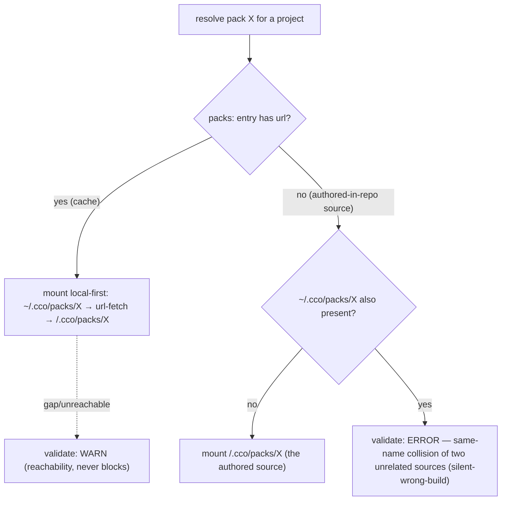
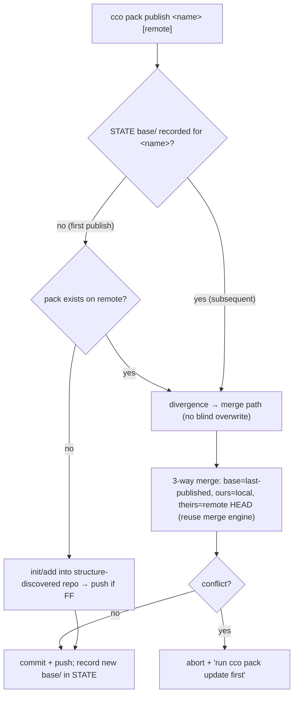

# ADR 0022 — Coordinate Model & Resolution: Implementation-Readiness Decisions

**Status**: Accepted (2026-06-19)
**Deciders**: maintainer + impl-readiness review (V), Cluster 4
**Context docs**: `../design.md` §2.2/§2.4/§3/§4.6/§6.2/§7/§9/§11, `../requirements.md` (FR-Y-S6, AD5), `../reviews/18-06-2026-impl-readiness-review.md` (F4/F16/F17/F29/F38/F40 + the spec-fill set F6/F14/F37/F39/F41/F45/F48/F56)
**Related ADRs**: 0013 (internal-metadata split — `base/`→STATE, `source` keyed-by-identity), 0015 (DATA bucket — `source`/remotes registry; "no machine-specific leak"), 0016 (4-bucket taxonomy — D3 coords-lookup, D4 index, D5 `source`, D7 CACHE), 0017 (CLI lifecycle — D2 `cco resolve`/`--from`), 0018 (sharing 2×2 — D5 `update --check`, D6 Case-C hooks), 0019 (reachability + pack lifecycle — D3/D4/D5 three-layer resolution, sync-before-publish), 0021 (lifecycle entry/cleanup — F6 delete-cascade intersection)

---

## Context

The impl-readiness review (V), Cluster 4, validated the **coordinate model & resolution** scope. The
model itself (per-unit embedded coordinates, the unified "referenced-resource coordinate" abstraction
over repos/llms/packs, the three-layer pack reachability, the 4-bucket taxonomy) is **settled** by ADRs
0013–0019 and is **not** re-opened here. What the review surfaced is a set of **implementation-readiness
gaps**: places where a settled decision lacked the concrete mechanism, migration, or invariant an
implementer needs, or where one document mislabelled the work. Most of those gaps are pure spec-fills
recorded as refinements to the existing ADRs and to `design.md`. This ADR consolidates the **six gaps
that required a genuine decision** so they have a single citable home; the remaining spec-fills
(F6, F14, F37, F39, F41, F45, F48, F56) are persisted in place and listed under *Open / cross-refs*.

A **phasing reconciliation** governs all of Cluster 4: the review was written against the older
"Phases 0–3 + E" vocabulary, but Cluster 2 already re-derived the build order into the **6-layer
dependency map** (P0 substrate · P1 core-local · P2 migration · P3 legacy-cutover · P4 sharing-core ·
P5 sharing-ext) and moved **all** coordinate schema/parsers (repos/llms **and** packs), M3, and H7 into
**P0**. Therefore none of these decisions adds or renumbers a phase; each names its home in the P0–P5
map. (This, by itself, dissolves the "schema lands later in E" half of F15/F14.)

A **coherence thread** links three of the decisions: D1 relocates the per-resource `source` file to
DATA and moves its machine-local `commit`/`installed`/`version` bookkeeping into **STATE `/update`
meta**. D6 (`update --check`) reads that installed-commit **from STATE**, and D5 (pack `base/`) stores
its merge ancestor in **STATE keyed by the same identity**. These three are one coordinated relocation,
not three independent ones.

## Decision

### D1 — `source` provenance: relocate to DATA, rename fields, re-derive `publish_target`

Today each installed resource's provenance lives in the **config bucket** at `<repo|pack>/.cco/source`
with keys `source:`/`path:`/`ref:` plus the machine-local `publish_target:` and `commit:`/`updated:`
bookkeeping. The target (ADR-0016 D5 / ADR-0015 D3) is a **DATA**, identity-keyed, machine-agnostic
upstream coordinate. The review's table mislabelled this "Reuse"; it is a **cross-bucket relocation +
field rename + reader rewrite**.

Decided (review F4 — Option A):

1. **Relocate** `<repo>/.cco/source` → `<data>/cco/projects/<id>/source`, `<pack>/.cco/source` →
   `<data>/cco/packs/<name>/source`, and add a `<data>/cco/templates/<id>/source` variant. Re-point
   `_cco_pack_source`/`_cco_project_source` (`paths.sh`) and add `_cco_template_source`.
2. **Rename** the synced coordinate fields: `source:`→`url:`, `path:`→`resource:`, `ref:` kept. The
   DATA `source` file becomes a **pure upstream coordinate** (`url`/`ref`/`resource`) — nothing
   machine-local.
3. **Relocate** the machine-local bookkeeping (`commit`/`installed`/`updated`/`version`) **out** of the
   coordinate file into **STATE `/update` meta** keyed by identity (where version-tied install state
   belongs per ADR-0013 D2 / ADR-0016 D6). This is the relocation D6 and D5 also depend on.
4. **`publish_target` is re-derived on demand**, never stored: drop it from the `source` schema and
   resolve it by reverse-looking-up the coordinate `url` against the DATA `remotes` registry (exactly
   the fallback `_resolve_publish_remote` already performs). Rationale: `publish_target` is a
   machine-local registry **name**; keeping it in a `required`-synced DATA file would re-open the C4
   dual-axis leak ADR-0013 closed. Cost accepted: when a pack's `url` is not in the local `remotes`
   registry, `cco pack publish <name>` has no default remote and the user passes it explicitly.
5. **llms `source` is NOT relocated** to DATA — ADR-0016 D2/D7 already split it (coordinate → manifest,
   content/cache-state → CACHE). Migration scope is **projects + packs + templates** only.
6. **Migration** (P2): a single idempotent project/pack/template-scope migration performs relocate +
   rename + field-drop, triggered by the existing legacy-format detection in `_is_installed_project`
   (the bare-URL / `native:` / `local` branches become the legacy trigger). It writes the **complete
   final** form in one pass (no double schema-migration — coherent with Cluster 2).

### D2 — Index: ratify the global-flat model for v1; pin the write mechanism (H7)

ADR-0016 D4 and `design.md` §3 already assert a single machine-global `paths:` map with the **AD5
uniqueness invariant** ("one logical name → one absolute path per machine"), the shared-repo-as-one-entry
rule, and the `cco init`/`cco join` collision-refusal UX — yet ADR-0016 D4 simultaneously deferred "the
global-vs-namespaced name question (H7)" to E. A schema/invariant question is **not** an impl detail.

Decided (review F17 — Option A):

- **Ratify** the global-flat index for v1. Per-project namespaced names are **reserved post-v1**
  (documented as "would require revising AD5 + the join semantics"); not built now.
- **Strip** the contradictory "global-vs-namespaced … is impl-time (E)" clause from ADR-0016 D4.
- H7 reduces to **pure mechanism**: atomic write = `mktemp` + `mv` (the existing `local-paths.sh`
  convention), single-writer assumption, **no file lock** in v1 (writes are user-serial; a rare race is
  last-writer-wins and self-heals via `cco resolve --scan`, which is idempotent). Home: **P0**.

### D3 — `cco resolve --scan`: non-destructive merge-upsert + AD5 conflict policy

`cco resolve --scan <dir>` "(re)builds the index", but merge-vs-clobber and the scan-time name-conflict
policy were undefined — a clobber on an existing machine would silently wipe `cco path set` overrides and
out-of-`<dir>` mappings.

Decided (review F38 — Option A):

- `--scan` is an **upsert**, never a wholesale replace: for each discovered logical name it inserts or
  updates only that `name→path` entry plus the project's `repos[]` membership.
- It **never deletes** entries whose path lies outside `<dir>`, nor `cco path set` overrides (preserved
  as siblings, per `design.md` §3).
- On a scan-time conflict (a discovered name already bound to a **different** absolute path) it applies
  the settled **AD5** invariant: warn + **keep the existing binding** by default; interactively offer to
  update; **never silently overwrite**.
- Bootstrap (empty index, fresh machine) is the trivial degenerate case of the same upsert path.
- **No `--prune` in v1** (stale-entry GC is reserved as a future enabler; ADR-0017 D2 was deliberately
  *shrinking* the CLI surface). Reword "rebuild" → "reconcile/upsert" in ADR-0017 D2 / §3. Home: **P1**.

### D4 — Pack three-layer resolution: cache-iff-coordinate invariant + one `ERROR` row

A pack can resolve from `~/.cco/packs/X` (working copy or url-fetched), or `<repo>/.cco/packs/X`
(cache **or** authored-in-repo source). The source-vs-cache role is determined **solely by coordinate
presence** — and the local-first mount precedence can **silently shadow** a stale authored-in-repo pack
with a same-named global one.

Decided (review F29 — Option A; no model change):

- **Invariant**: `<repo>/.cco/packs/X` is a **CACHE iff** its referencing `project.yml` `packs:` entry
  carries a coordinate (`url`); it is an **authored-in-repo SOURCE iff** that entry has no `url`. The
  discriminator is the **coordinate in the manifest entry the resolver already reads** — not a flag
  inside the pack files (this removes the "in-file flag / polymorphic location" concern at its root).
- **Worked-example table** (in `design.md` §2.4): every relevant combination of *(entry-has-url?) ×
  (~/.cco/packs/X present?) × (<repo>/.cco/packs/X present?) × (url-fetch reachable?)* with the resolved
  winner and the validate verdict — so E codes **one** deterministic resolver, not ad-hoc branches.
- **Severity**: keep **WARN** as the default for reachability gaps and the cache-degrades-gracefully case
  (P14/P17). Escalate to **ERROR** for exactly **one** row — a **no-coordinate authored-in-repo pack**
  `<repo>/.cco/packs/X` that **also** exists as `~/.cco/packs/X` — because mount-precedence then runs a
  **different** pack than the one the project authored and committed, with nothing upstream to reconcile
  (two unrelated sources colliding on a name = a genuine silent-wrong-build, categorically distinct from
  a cache fallback). The ERROR lives in `cco config validate` (exit-code only; the command's full
  contract is **Cluster 5 / F26**), so validate stays advisory tooling, never the git push path (P17).

### D5 — `cco pack publish`: consolidated sync-before-publish + pack-scoped STATE `base/`

`cco pack publish` today clones remote HEAD, `rm -rf packs/<name>`, `cp -R` the local copy on top, and
`push origin HEAD` — a **clone-then-overwrite that discards co-maintainers' remote-only changes**
(verified in `cmd-pack.sh`), not the 3-way merge ADR-0019 D4 promises. Three refactors (ADR-0019 D4
merge + ADR-0018 D3 init-or-merge/structure-discovery + ADR-0013 H6 `base/`→STATE) converge on this one
function with no single owning spec, and **packs have no `base/` ancestor today** (`base/` is a
project-update-only concept — `_cco_project_base_dir`).

Decided (review F16 — Option A); the detailed sequence lives in `design.md` §6.2:

- Introduce a **pack-scoped `base/` in STATE**, keyed by identity: `<STATE>/cco/packs/<name>/update/base/`
  (mirroring the project form `<STATE>/cco/projects/<id>/update/base/` / `_cco_project_base_dir`). It is **STATE never-sync** — a local, version-tied merge ancestor
  per machine, never carried in the sharing repo (ADR-0013 D2). Populated on `cco pack install` **and**
  `cco pack publish` (the published tree becomes the recorded last-published commit).
- **First publish** (no recorded base/source) = the init/add path: write the pack into the
  (possibly empty) structure-discovered sharing repo and push if fast-forward. If the remote already
  carries a pack of that name but the local machine has no base, treat it as **divergence** → fall to the
  merge path (never blind-overwrite).
- **Subsequent publish** = **3-way merge**: base = last-published commit's tree (from STATE),
  ours = local `~/.cco/packs/<name>`, theirs = remote HEAD's `packs/<name>/`; **reuse** the existing
  `_collect_file_changes` / 3-way engine (the same one `cco project update` uses); **abort on conflict**
  with a "run `cco pack update` first" reminder (P7 non-FF → abort+notify).
- **Correct** ADR-0019 D4's "fast-forward push that can silently clobber" wording to describe the actual
  **clone-then-overwrite** behavior. Depends on D1 (the base lookup is keyed by the same identity the
  relocated `source` uses). Home: **P4**.

### D6 — `cco update --check`: DATA-driven, install-presence-gated, 3-state contract

`cco update --check` lists installed resources whose upstream `source` advanced. After the ADR-0016
bucket split, `source` (DATA, synced), the installed baseline (STATE), and `remote_cache` (CACHE) are no
longer co-located, so the "reuse R3 machinery" assumption breaks on a freshly-synced second PC (it has
the synced `source` but no local install/base).

Decided (review F40 — Option A); output format detail in `design.md` §7/§6.2:

- **Iteration set = DATA** `<data>/cco/{projects,packs,templates}/<id>/source` (the only bucket
  guaranteed present after a private multi-PC sync).
- **Baseline = STATE** installed-commit (the D1 relocation): gate each row on local install presence.
  Three states per resource: **not installed here** (DATA source exists, STATE has no install/base →
  advisory, exit 0 — the natural degradation), **comparable** (run the existing `_check_remote_update`
  against the advertised ref), **indeterminate** (`unknown`/`unreachable`).
- **Advancement rule**: resolve the **same ref the `source` pins** via `git ls-remote`; an immutable tag
  never advances, a moving branch does. `advanced ≡ available-commit ≠ installed-commit`.
- **Output**: one greppable line per resource + a summary; **exit 0 always** (read-only discovery, never
  a gate — ADR-0008). `--offline`/`--no-cache` reuse the `cmd-update.sh` conventions verbatim
  (`--offline` wins when combined). Home: **P4/P5**.

## Alternatives Considered

| Decision | Chosen | Rejected alternative(s) | Why |
|----------|--------|-------------------------|-----|
| D1 `publish_target` | re-derive on demand | persist in STATE (B); keep in DATA behind allowlist (C) | B keeps a no-arg convenience but adds a never-sync file + stale-pointer risk; C knowingly re-opens the C4 leak. Re-derive stores nothing to leak or drift. |
| D2 index | global-flat ratified, no lock | per-project namespacing (B); advisory file lock (C) | B re-opens settled AD5 + the shared-repo-one-entry win; C adds `flock`/mkdir-lock friction for a race the user-serial model makes near-impossible. |
| D3 scan | merge-upsert default | clobber/replace; `--prune` flag in v1 (B); per-name provenance markers (C) | clobber = the silent data-loss the finding flags; B adds CLI surface ADR-0017 was shrinking, no v1 need; C over-engineers the index schema. |
| D4 pack resolve | invariant + table + one ERROR | all-WARN (B); on-disk self-describing marker (C) | B leaves the silent-wrong-build as an ignorable warning; C re-introduces a storage-based discriminator (dual source of truth) and writes cco markers into authored config buckets. |
| D5 pack publish | STATE base + 3-way merge | abort-on-divergence guard only | the guard stops the data loss but does not deliver ADR-0019 D4's promised real merge; chosen only as a fallback if the merge engine reuse proves costly. |
| D6 update --check | DATA-driven + STATE gate | live-clone-on-demand (B); packs/templates only (C) | B defeats the CACHE `remote_cache` R3 built to avoid network and fits the project fan-out poorly; C narrows ADR-0018 D5's stated scope and excludes imported-project-with-source. |

## Consequences

**Positive** — the coordinate model is implementable end-to-end: every `source` field, path, and reader
is named (D1); the index schema/invariant and write mechanism are fixed before P0 reads them (D2/D3);
the highest-complexity corner (pack three-layer resolution) collapses to one deterministic resolver
table with a single principled hard error (D4); the multi-maintainer publish clobber is actually closed
with a real merge ancestor (D5); `update --check` works on a freshly-synced second PC instead of erroring
(D6). No settled model decision is re-opened.

**Negative** — D1 is the largest single migration (relocate + rename + field-drop + reader rewrite +
STATE-meta writes) and D5 introduces a new STATE store (`packs/<name>/update/base/`); both add code paths
to keep idempotent and to test. D1's `publish_target` re-derive is a mild UX regression when the url is
not in the local registry. D4 adds a second severity tier to `validate` that E must apply narrowly.

## Reuse / Drop / Build-new

| Element | Verdict |
|---------|---------|
| `_resolve_publish_remote` reverse-lookup fallback; `_check_remote_update` state machine + `remote_cache` + `ls-remote` + `--offline`/`--no-cache`; `_collect_file_changes`/3-way merge engine; `_cco_project_base_dir` pattern; `local-paths.sh` `mktemp`+`mv` atomic-write; AD5 uniqueness/refusal invariant | **Reuse** |
| `publish_target:` stored field; `commit`/`installed`/`version` inside `source`; the "global-vs-namespaced is impl-time" clause (ADR-0016 D4); the clone-then-overwrite pack publish path | **Drop** |
| DATA `source` reader keyed on `url`/`resource`/`ref` + `_cco_template_source`; the relocate+rename migration (P2); STATE `/update` installed-commit meta; pack-scoped STATE `base/` + first-vs-subsequent publish; the pack resolver table + validate ERROR row; the `--check` 3-state contract | **Build-new** |

## Open / cross-refs (spec-fills persisted in place, not in this ADR)

- **F6** — remotes url→DATA / token→STATE split decomposition: refines ADR-0016 Reuse/Drop note +
  `design.md` §9 checklist (no new ADR, by F6 Option A). Intersects ADR-0021 §4 delete-cascade.
- **F14** — manifest data/code split (code → P4, inert files → P3 cutover); **F37** — pack name-only→
  coordinate backfill migration (P2) + create `migrations/pack/` + `migrations/template/` scope dirs:
  `design.md` §9/§11 + ADR-0019 §Open.
- **F39** — sync-meta fingerprint write/clear/compare contract: `design.md` §4.6 + `requirements.md`
  FR-Y-S6.
- **F41** — Case-C "reserved hooks" reframed as additive-by-construction: ADR-0018 D6 + `design.md` §12.
- **F45** — coords-lookup **on-demand only** for v1 (drop the CACHE file): ADR-0016 D3/D7 + `design.md`
  §CACHE. **F48** — `cco config coords --sync` = explicit `--from`, never auto-elect: ADR-0016 D3.
  **F56** — llms CACHE collision = re-fetch-on-url-mismatch (last-writer per machine): ADR-0016 D2 note.
  (The `cco config coords`/`validate` command surface itself is **Cluster 5**.)
- `cco config validate` predicate/output contract (carrying D4's ERROR row) → **Cluster 5 / F26**.
