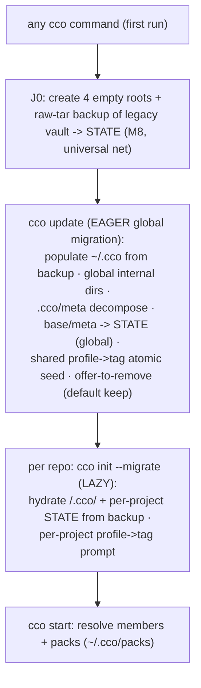

# ADR 0025 — Migration ownership: eager global via `cco update`, lazy per-project via `cco init --migrate`

**Status**: Accepted (2026-06-22)
**Deciders**: maintainer
**Context docs**: `../design.md` §7/§8/§9 P2, `../requirements.md` FR-M1/FR-M2,
`../P2-handoff-migration-bootstrap.md` §4a, `../P2-dogfooding-validation.md` §1
**Related ADRs**: 0006 (breaking cutover / lazy per-project migrate / raw-tar backup — **refined
here**), 0021 (entry verbs: top-level `cco migrate` dropped → `cco init --migrate`), 0017 D3 (J0
first-run bootstrap), 0013 D3/D4/D6 (`.cco/meta` split; the `manifest:` **hash block → STATE**;
`manifest.yml`/`pack-manifest` removed), 0010 §5 (profile→tag: shared atomic / project prompt),
0012 (`manifest.yml` removed)

---

## Context

The Phase-2 preliminary analysis (`P2-handoff` §4a) left **two design items open**:

1. **`manifest:` ambiguity.** `design.md` §9 P2 said "`manifest:` marker dropped (ADR-0012)", but
   the `.cco/meta` `manifest:` block is the load-bearing **per-file hash manifest** (`_read_manifest`
   in `lib/update-meta.sh`, written by both `_generate_global_cco_meta` and
   `_generate_project_cco_meta`; drives the 3-way merge / change detection) — a **different concept**
   from the separate `manifest.yml` sharing file that ADR-0012 removes.

2. **Global migration mechanism.** §9 P2 details the **lazy per-project** migrate and the `.cco/meta`
   decompose, but is light on **how the user's *customized* legacy global config** (`global/.claude`
   agents/rules/skills/settings + authored `packs/` + `templates/` + `setup.sh`/`setup-build.sh`/
   `mcp-packages.txt`/`languages`/`secrets.env`) moves into the fresh `~/.cco`. A clean `cco init`
   copies framework **defaults**, not the user's customizations. The only written candidate
   (`P2-dogfooding` §1) was "a **global mode of `cco init --migrate`**" (a no-arg form) — never ratified.

A top-level `cco migrate` verb was already **dropped** (ADR-0021) to avoid `migrate`↔`update` UX
confusion; the legacy bring-over is a **mode of `cco init`**.

## Decision

### 1. Two migration paths, split by scope-locality

- **Global / non-project migration is EAGER and owned by `cco update`** (the existing migration
  runner). On first run against a legacy install it performs every global transformation the
  decentralized cutover needs that is **not repo-bound**: populate `~/.cco` from the backup
  (`global/.claude` + authored `packs/` + `templates/` + `setup.sh`/`setup-build.sh`/
  `mcp-packages.txt`/`languages`/`secrets.env`), build the global internal dirs, **decompose** the
  global `.cco/meta`, **relocate** the global-scope merge artifacts (`base/`/`meta`) to STATE (H6),
  and **seed the atomic shared-resource profile→tag set** (ADR-0010 §5). **No new verb** — folding the
  global cutover into `cco update` matches cco's existing mental model ("`cco update` = run
  migrations") and avoids a no-arg `cco init --migrate` overload.
- **Per-project migration stays LAZY and owned by `cco init --migrate <project>`** (ADR-0006/0021),
  run inside each already-cloned repo, hydrating `<repo>/.cco/` + the per-project STATE
  (`projects/<id>/{memory,update}`) from the backup, with the **per-project** profile→tag prompt.
- **`cco migrate` top-level does not exist** (ADR-0021, reaffirmed).

### 2. Backup stays on ANY command (first-run safety net), BEFORE `cco update`

FR-M1 is **unchanged**: J0/first-run on **any** `cco` command archives the legacy vault (raw `tar` →
STATE, F1/F9) **before any read**. Rationale: a command run against the new decentralized
expectation that touched or broke files would otherwise have **no net**; the backup must precede
everything, including `cco update`. (J0 itself still creates only the four **empty** roots — the
heavy *populate* is the `cco update` migration; the **backup** is the one heavyweight first-run step
that must be **universal**.)

### 3. Legacy-vault removal is offered ONLY at `cco update`, default keep

After a verified backup **and** the global migration, `cco update` surfaces that the legacy vault
(`user-config/`) is **preserved as a fallback** and prints **how to remove it manually** from the
filesystem. cco **never deletes it automatically** and never prompts a destructive removal on other
commands. **Default: keep** (it does not interfere with the new layout). This honors the dogfooding
rule ("never remove until merged + validated") **by construction** (refines ADR-0006 D2's generic
"offers to remove").

### 4. The `.cco/meta` `manifest:` hash block travels into STATE — it is NOT dropped

Closes item 1: the per-file hash manifest (`meta.manifest`) **relocates whole** into
`<state>/cco/{projects/<id>,global}/update/meta` (ADR-0013 D3; the merge **logic** is unchanged, H6).
What the cutover removes is the **separate `manifest.yml`** sharing file (ADR-0012) and the legacy
**`pack-manifest`** mechanism (ADR-0013 D6) — different concepts. The global STATE `/update` meta
therefore carries **`hashes`** too (correcting the §2.2 global-meta listing that omitted it).

## Ordering (normal flow)

A per-project migrate reads its project config **and** pack provenance from the **backup** and does
**not** depend on the global `~/.cco` populate, so it is **not hard-blocked** if run before
`cco update`; the **universal backup** satisfies M8 regardless of order. Pack *content* resolution
(`~/.cco/packs`) is needed only at `cco start`, after the global migration. The normal/recommended
order is nonetheless backup → `cco update` → `cco init --migrate`.

## Alternatives Considered

| Alternative | Pros | Cons | Verdict |
|---|---|---|---|
| **Global mode of `cco init --migrate`** (no-arg) — prior written candidate | one verb for all migration | ambiguous overload ("init with no project?"); piles global logic into init/migrate tests; two ways to say "migrate" | **Rejected** |
| **Auto-populate global on first `cco init --migrate <project>`** (side-effect) | fewer steps | a project command hides a heavy global backup+populate; surprising; against "`cco update` owns migration" | **Rejected** |
| **Eager global via `cco update` + lazy project via `cco init --migrate`** (chosen) | matches the existing mental model; no new/overloaded verb; fits the §11 P2 test plan (`test_update.sh` + `test_init.sh`); clean scope split | global config is live only once the user runs `cco update` (mitigated: universal backup + printed instructions) | **Accepted** |
| **Move the backup into `cco update`** | no `tar` on `cco stop`/`start` | a destructive-prone first-run with no net if the first command isn't `update` | **Rejected** — the backup must be universal |

## Consequences

**Positive** — closes the two P2 design opens; **no new CLI surface**; global vs project
responsibilities cleanly separated; aligns with the existing migration runner **and** the §11 P2
test contract (`test_update.sh` + `test_init.sh`); the universal backup makes any command order
safe; the legacy vault is preserved by default.

**Negative** — the global decentralized config is not live until the user runs `cco update` once
(acceptable — known users, printed instructions, the backup is already taken); `cco update`'s
first-run path gains the heavyweight populate (tested in `test_update.sh`).

## Open

None blocking P2. The **exact UX copy** (the `cco update` migration summary, the legacy-vault
keep/remove note, the per-project profile→tag prompt) is **maintainer-confirmed at build time**
(P10 lesson b).
