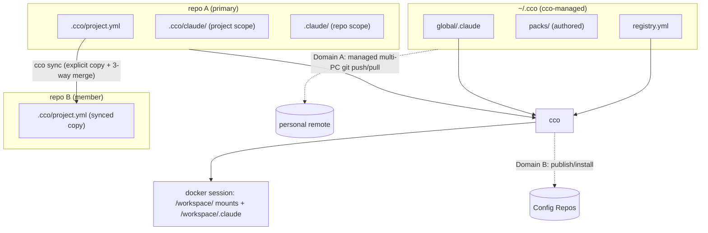
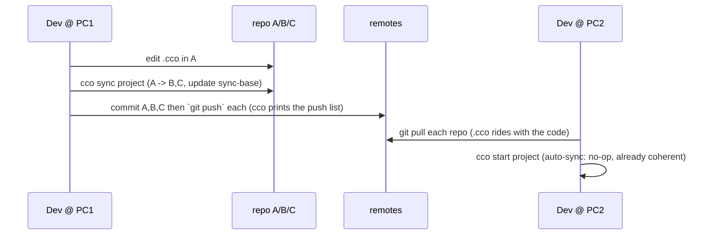

# Decentralized In-Repo Config — Design

**Status**: Draft — design approved at the architectural-choice level (RD9, RD10,
T3 signed off 2026-06-12); ready to drive implementation phases.
**Date**: 2026-06-12
**Requirements**: `requirements.md` (AD1-AD11, FR-*, RD1-RD11)
**Decision record**: `decisions/0001-decentralized-in-repo-config.md`
**Source**: design-wave (sync architecture, `.cco/` layout, command surface,
teardown+migration) + maintainer sign-off.

> `requirements.md` says **what** and **why**; this document says **how**. It is
> the authoritative design for the refactor and drives the phased implementation
> (§9). It supersedes `../vault/profile-isolation-design.md`.

---

## 1. Architecture Overview

Two stores, two sync domains, one merge engine.



- **Per-repo `.cco/`** — a project's config, versioned with the code (user-managed git).
- **`~/.cco/`** — central registry + caches + global config (cco-managed git, opt-in multi-PC sync).
- **Sync** — explicit, reuses the existing 3-way merge engine; triggered auto-on-`cco`-command (+ opt-in hooks).
- **Two domains** — personal multi-PC (A) vs team/external Config Repos (B), strictly separate.

---

## 2. `.cco/` Layout (RD10 = Hybrid, approved)

`project.yml` and `secrets.env.example` sit **flat** at `.cco/` root (entry-point
discoverability); everything else is grouped. `state/` and `secrets/` are
blanket-gitignored so a secret can never sit in a committed directory.

```
<repo>/
├── .claude/                  # COMMITTED, repo root — REPO-LOCAL Claude config
│                             #   → /workspace/<repo>/.claude  (NOT synced)
├── .cco/
│   ├── .gitignore            # blanket-ignores state/ + secrets/ (+ patterns)
│   ├── project.yml           # COMMITTED — entry point (flat, discoverable)
│   ├── secrets.env.example   # COMMITTED — secret skeleton (no real values)
│   ├── claude/               # COMMITTED + SYNCED — PROJECT/cross-repo Claude config
│   │   └── CLAUDE.md, rules/, agents/, skills/   → /workspace/.claude
│   ├── tracked/              # COMMITTED — framework bookkeeping (not user-edited)
│   │   ├── base/             #   update-system 3-way ancestor
│   │   ├── sync-base/        #   cross-repo sync 3-way ancestor
│   │   ├── source            #   "local" | "native:<tmpl>" | remote ref
│   │   └── source-url
│   ├── state/                # GITIGNORED (blanket) — machine/runtime
│   │   ├── meta, docker-compose.yml, managed/, claude-state/, local-paths.yml, .tmp/
│   └── secrets/              # GITIGNORED (blanket)
│       └── secrets.env
└── memory/                   # GITIGNORED per-machine (RD1); opt-in commit
```

**`.cco/.gitignore`** (committed; reuses `lib/secrets.sh` patterns as defense-in-depth):

```gitignore
# blanket: runtime + secrets (no committed content lives here)
state/
secrets/
# defense-in-depth secret patterns
secrets.env
*.env
*.key
*.pem
.credentials.json
# tempfiles / artifacts
*.bak
*.new
project.yml.??????
```

**Why airtight**: a file under `state/`/`secrets/` is structurally un-stageable
(ignored by directory), and the filename patterns catch strays elsewhere. A
pre-commit/pre-push scan (reused from `cmd_vault_save`) refuses anything matching.

**`.claude` dual scope** (AD4, verified): `.cco/claude/` → `/workspace/.claude`
(project, synced); `<repo>/.claude/` → `/workspace/<repo>/.claude` (repo, not synced).

**Path helpers** (`lib/paths.sh`): dual-read — prefer new subdir locations, fall
back to today's flat `.cco/` for legacy installs (backward compatible during the
deprecation window).

---

## 3. `~/.cco/` Central Store & Registry

```
~/.cco/
├── .git/             # cco-managed (Domain A); opt-in remote
├── .gitignore        # ignores registry.yml, remotes, installed/, llms/, secrets
├── registry.yml      # GITIGNORED — project → paths, tags, sync metadata (per-machine)
├── packs/            # COMMITTED + SYNCED — user-authored packs
├── templates/        # COMMITTED + SYNCED — user-authored templates
├── installed/        # GITIGNORED — packs/templates from Config Repos (cache)
├── llms/             # GITIGNORED — llms.txt cache
├── global/
│   ├── .claude/      # COMMITTED + SYNCED — global Claude config
│   └── secrets.env   # GITIGNORED
├── remotes           # GITIGNORED — Config Repo URLs + tokens (per-machine)
└── backups/          # GITIGNORED — vault migration archives
```

**`registry.yml`** (per-machine; real paths differ per PC, so it is gitignored —
NOT synced):

```yaml
version: 1
projects:
  cave-auth:
    tags: [cave]
    repos:
      - { name: cave-auth, path: ~/dev/cave-auth, role: primary }
      - { name: cave-auth-web, path: ~/dev/cave-auth-web }
    sync: { mode: peer, policy: confirm }
    last_start: 2026-06-12T10:30:00Z
```

- Freshness: updated on `init`/`start`/`create`/`delete`; stale entries (missing
  repos) flagged on `cco list`, prunable via `cco registry refresh`.
- `cco list [--tag <t>]` filters in memory — profiles are gone (AD2).

---

## 4. `@local` Path Resolution (reused)

Retained from `../vault/local-path-resolution-design.md`; ~13/18 `local-paths.sh`
functions unchanged.

- Committed `project.yml` uses `@local` for sibling repos + extra mounts; the
  **host repo is implicit `.`** (AD6) — only siblings appear in `repos[]`.
- Real paths live in `.cco/state/local-paths.yml` (gitignored, **per-repo,
  per-machine, never synced**) → committed `project.yml` is identical across a
  project's repos; only the local map differs per machine. Clean and skew-free.
- **Bootstrap (fresh machine)**: clone repo A → `cco start` resolves each `@local`
  sibling via prompt/clone-from-`url:` → writes `local-paths.yml`. No vault needed.
- Optional `path_root` in `local-paths.yml` lets relative sibling paths rebase on
  a new machine (low-priority enhancement).

---

## 5. Multi-Repo Config Sync

### 5.1 Model
A project's config exists as **explicit copies** in each member repo's `.cco/`
(T3, approved — clone-safe, branch-independent), kept identical by `cco sync`. The
**synced set** is: `.cco/project.yml` + `.cco/claude/**` + `.cco/tracked/{source,source-url}`.
**Never**: root `.claude/`, `state/`, `secrets/`, `local-paths.yml`, `memory/`.

A committed **`.cco/tracked/sync-base/`** snapshot is the 3-way ancestor (analogous
to `base/`), updated only on successful sync.

### 5.2 Dual mode (`project.yml`)
```yaml
sync:
  mode: peer            # peer | root
  policy: confirm       # confirm | last-commit-wins   (peer only)
  members:              # or `peers:` — sibling repo names (resolved via registry+local-paths)
    - cave-auth-web
    - cave-infrastructure
  # root mode: root: <repo-name>
```
- **peer + confirm** (default, RD2): detect divergence vs `sync-base`; resolve
  interactively (merge / keep / update) via the existing engine.
- **peer + last-commit-wins**: propagate the most-recently-committed `.cco`.
- **root**: a designated repo is authoritative; root → members.

### 5.3 Trigger (RD9, approved): auto-on-`cco`-command + opt-in hooks
- **Default — auto-on-`cco`-command**: any `cco` command that touches the project
  (notably `cco start`, `cco sync`) runs a best-effort sync first. Non-intrusive,
  no product-repo pollution, immune to the "hooks aren't cloned" problem.
  Coherence is guaranteed at the point that matters — when a session reads config.
- **Opt-in hooks**: `cco sync --install-hooks` installs `pre-commit`/`pre-push`
  per repo (re-entrancy-guarded via `CCO_SYNCING`; escape `SKIP_CCO_HOOKS=1`;
  pre-commit may block, pre-push warns) for users who want commit-time enforcement.
  Documented caveat: `.git/hooks` is not cloned — `cco init` re-installs on a new
  machine.
- **`cco sync --check`** (exit-code only) is exposed so users can wire it into
  their own CI/hooks.
- **Future evolution (not now)**: a lightweight background daemon — see §12.

### 5.4 Coherence & timing (RD11)



Version-skew mitigations:
- **Per-repo set:** `cco sync` writes all members + `sync-base` atomically before
  the user commits; `cco sync` prints the exact `git push` list so members aren't
  left unpushed.
- **`~/.cco` vs repo `.cco`:** independent stores; `~/.cco` carries global/packs,
  not project config — no cross-store version coupling. Managed `~/.cco` sync is
  freshness-throttled (§6.1).
- **Different branches:** a member on another branch is read via `git show
  <branch>:.cco/...` (no checkout); `cco sync` reports each member's active branch.

### 5.5 Engine reuse
`_merge_file`, `_resolve_with_merge` (merge/keep/replace/skip), `_interactive_sync`,
`_file_hash`, `_save_base_version` are reused unchanged (`lib/update-merge.sh`,
`lib/update-sync.sh`, `lib/update-hash-io.sh`). Sync supplies (current, sync-base,
incoming); the engine does the rest.

---

## 6. Two Sync Domains

### 6.1 Domain A — personal multi-PC (cco-managed)
`~/.cco` is a cco-managed git store (opt-in via `cco config init <url>`). Per-repo
`.cco/` rides with the repo's own remote (nothing extra).

- **Managed mode (default)**: pull-before-read / commit+push-after-write on
  operations that touch `~/.cco`. **Best-effort & non-blocking** (FR-C4.2): offline
  / auth / non-fast-forward → warn, continue with local state, defer.
- **Throttle (RD8)**: skip pull if synced < ~120 s ago.
- **Conflict (FR-C4.3)**: auto fast-forward/merge; a true conflict is the only
  case surfaced → `cco config sync` (reuses the merge engine).
- **Manual mode (opt-in)**: `cco config push/pull/status/diff`, auto disabled.
- Gitignored (never synced): `registry.yml`, `remotes` (tokens), `installed/`,
  `llms/`, `global/secrets.env`.

```mermaid
sequenceDiagram
  participant Cmd as cco <cmd> touching ~/.cco
  participant Sync as managed-sync
  participant Rem as personal remote
  Cmd->>Sync: pre-read hook
  Sync->>Sync: fresh < 120s? skip
  Sync->>Rem: git pull --ff-only (best-effort)
  Rem-->>Sync: ok / offline / conflict
  Sync-->>Cmd: continue (warn if offline/conflict — never block)
  Cmd->>Sync: post-write hook (after pack create/edit)
  Sync->>Rem: commit + push (best-effort; mark pending on failure)
```

### 6.2 Domain B — team/external (unchanged)
Publish/install/update/export over Config Repos (`cmd-project-publish.sh`,
`cmd-project-install.sh`, `cmd-pack.sh`, `cmd-remote.sh`, `remote.sh`) — audited
unchanged. `installed/` caches what was installed. A user-authored pack has a
personal working copy (A, synced) and, when shared, an independent published copy
(B). Secrets never travel via either git channel.

---

## 7. Command Surface

| Area | Command | Status |
|------|---------|--------|
| Init | `cco init` (scaffold `<repo>/.cco/`), `cco init --sync <project>` (associate a repo), `cco init --migrate <legacy>` | NEW/transform |
| Run | `cco start [project]` (cwd-aware; auto-resolve `@local`; auto-sync first) | transform |
| Sync | `cco sync <project>` `[--dry-run|--check|--force]`, `cco sync --install-hooks` | NEW |
| Personal store | `cco config init <url> | push | pull | status | diff | sync` | NEW |
| Discovery | `cco list [--tag <t>]`, tag set/edit | NEW |
| Sharing | `cco pack/project publish|install|update|export`, `cco remote …` | unchanged |
| Legacy | `cco vault *` | deprecated alias → migration |

**Discovery**: cwd-first — if the current dir (or an ancestor) has `.cco/project.yml`,
use it; else resolve `<project>` via the registry. Project identity = name key in
`registry.yml`; `.cco/tracked/source` records the project name in-repo.

Naming choices (approved direction): `cco sync` (top-level, not `cco project sync`);
`cco config` for the managed `~/.cco` store; `cco vault` kept only as a deprecated
alias during the migration window.

---

## 8. Key User Journeys

```mermaid
flowchart TD
  subgraph J1["Single-repo"]
    a1[cco init in repo] --> a2[edit .cco/project.yml] --> a3[cco start]
  end
  subgraph J2["Multi-repo associate"]
    b1[configure in repo A] --> b2[repo B: cco init --sync project] --> b3[cco sync project]
  end
  subgraph J3["Fresh machine"]
    c1[git clone repo A] --> c2[cco start] --> c3[resolve @local siblings: prompt/clone] --> c4[run]
  end
  subgraph J6["Migration"]
    d1[cco vault migrate] --> d2[map each vault project to a repo] --> d3[copy into .cco/ + register + backup]
  end
```



(J4 personal multi-PC and J5 team sharing follow §6.)

---

## 9. Teardown & Migration (phased)

Each phase leaves cco runnable + tests green.

- **Phase 0 — new layout + path helpers.** Add the hybrid `.cco/` structure,
  `.gitignore` template, `lib/paths.sh` dual-read, structure migration. Additive.
- **Phase 1 — remove profiles.** Delete profile branch/switch/shadow/shared-sync
  machinery (~1900 lines of `cmd-vault.sh`); keep `@local`, secret-scan,
  gitignore-heal, `_normalize_committed_paths`. Remove `tests/test_vault_profiles.sh`
  (2391 lines); rewrite `test_vault.sh`. All projects coexist; profiles→tags.
- **Phase 2 — Domain A.** `lib/cmd-config.sh` (`cco config …`), `~/.cco` registry +
  managed sync; repurpose vault remote ops (single-branch, no checkout).
- **Phase 3 — per-repo sync + migration.** `lib/cmd-sync.sh` (`cco sync`), `cco
  vault migrate`. Dual-read keeps legacy vault readable.
- **Phase 4 — vault sunset (future).** Drop dual-read after 1-2 releases.

**Migration flow** (`cco vault migrate`, interactive, idempotent, backed-up):
discover vault projects (known only by `@local`) → map each onto a physical repo
(offer clone if missing; designate primary for multi-repo) → copy config into
`<repo>/.cco/` (hybrid layout) + init `sync-base/` → register in `registry.yml` →
`tar.gz` the vault to `~/.cco/backups/` → report + `git push` hint. Rollback:
`.cco/` is in each repo's git; the vault archive preserves full history.

---

## 10. Packaging-Awareness (AD11)

Decentralization cleanly separates **tool** (`bin/cco`, `lib/`, `defaults/`,
`templates/`, `proxy/`, Dockerfile) from **user data** (`~/.cco`, per-repo `.cco`).
This refactor must keep that separation so a future npm/npx package + container
image (a next-sprint workstream) is a drop-in: per-repo `.cco/` holds only
config/bookkeeping (no tool binaries); `~/.cco` is user-local; `bin/cco` resolves
`lib/` relative to its install location. No design choice here may put tool code
inside a repo's `.cco/` or require a source clone to run.

---

## 11. Test Plan

| Phase | New | Rewrite | Remove |
|-------|-----|---------|--------|
| 0 | dual-read path tests | — | — |
| 1 | multi-project coexistence | `test_vault.sh` | `test_vault_profiles.sh` (2391) |
| 2 | `test_config.sh` (Domain A) | `test_vault.sh` | — |
| 3 | `test_sync.sh`, `test_migrate.sh` | `test_vault.sh`, `test_local_paths.sh` | — |

Net: ~2400 lines removed, ~1500 added → narrower, clearer test surface.

---

## 12. Future Evolutions (out of this refactor's scope)

- **Background sync daemon (evaluate)** — an alternative/complement to
  auto-on-`cco`-command + hooks, for fully transparent coherence. Evaluation axes:
  complexity (lifecycle, re-entrancy, cross-platform service mgmt), failure modes
  (silent staleness), UX (invisibility vs debuggability). Likely a file-watch +
  debounce process scoped to registered projects, reusing `cco sync` internals.
  To be designed only if auto-on-command proves insufficient in practice.
- **cco packaging** — npm/npx CLI + image registry (R-pkg).
- **Persistent `/workspace` root** — optional `.cco/workspace/` mount (R-workspace).

---

## 13. Deferred to Implementation
- `registry.yml` exact schema evolution + staleness GC policy.
- Managed-sync backoff/retry specifics; throttle constant (default ~120 s).
- `sync-base/` reset on `cco clean --all`.
- `cco update` offering sibling sync (RD4) — prompt, not automatic.
