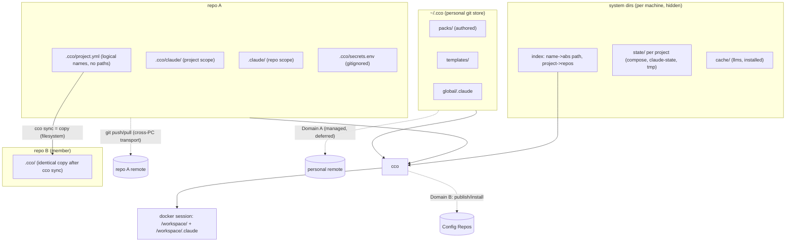
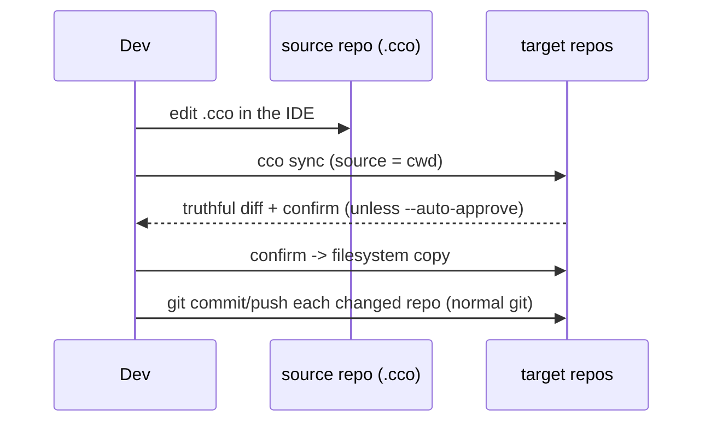

# Decentralized In-Repo Config — Design

**Status**: Approved for implementation (2026-06-15); **§2 layout rewritten to the 4-bucket
taxonomy by ADR-0016 (M, 2026-06-17)**; **Domain-B sharing realigned by the S cycle — §2.1/§2.4
(pack coordinates + project-local packs), §6.2, §7, §12 (ADR-0018/0019/0020, 2026-06-18)**.
Authoritative design; drives the phased implementation (§9).
**Requirements**: `requirements.md` (AD1-AD12, FR-*).
**Decision records**: `decisions/` — ADR-0001 (decentralization), 0002
(machine-agnostic config), 0003 (sync-as-copy), 0004 (config/state/cache separation),
0005 (dual `.claude` scope), 0006 (breaking cutover + lazy migration), 0007 (system-dir
locations / XDG), 0008 (config versioning model), 0009 (auto-memory is machine-local STATE),
0010 (resource authoring + per-user tags), 0011 (tag nature & Cat-4 method), 0012 (manifest
removed), 0013 (internal-metadata split), 0014 (referenced-resource coordinates), 0015 (Cat-4 =
XDG DATA), **0016 (consolidated resource taxonomy — the authoritative `resource → (bucket, sync)`
map; §2 here is its tree projection)**, **0017 (coordinate field semantics + CLI consolidation +
first-run/`~/.cco` lifecycle refinements)**, **0018 (sharing model unification — config-bucket vs
sharing-repo nomenclature, 2×2 command matrix, project/pack asymmetry, sharing-repo structure),
0019 (referenced-resource reachability & pack lifecycle — coordinate model extended to packs,
working-copy lifecycle, internalize-as-cache), 0020 (maintainer/consumer permissions — enforcement
delegated to git, cco assists)**.
**Decision history (historical)**: `reviews/15-06-2026-sync-adversarial-review.md`,
`reviews/15-06-2026-simplification-analysis.md`.

> `requirements.md` says **what** and **why**; this document says **how**. It is the
> single source of truth for the refactor. Open questions are isolated in §13 and are
> the subject of dedicated follow-up analyses; everything else is decided.

---

## 1. Architecture Overview

Three ideas, no custom diff/merge: **machine-agnostic committed config**, **plain
git as the cross-PC transport**, and **sync = copy** within a project on one machine.



- **Committed `<repo>/.cco/`** — machine-agnostic config, versioned with the code.
- **System dirs** — per-machine state, cache, and the name→path index; hidden, never committed.
- **`~/.cco/`** — personal git store for global resources (Domain A; depth deferred).
- **Sync** — a plain copy from a chosen source repo to targets (no merge engine).
- **Cross-PC** — plain `git` on each repo's own remote.

---

## 2. Layout

> **Authoritative as of ADR-0016 (M, 2026-06-17).** The layout is **four destination
> buckets** — two CONFIG (user-edited, IDE-reachable) and three internal (cco-managed,
> hidden): `<repo>/.cco` · `~/.cco` · **DATA** · STATE · CACHE. The full
> `resource → (bucket, mutator, sync)` table lives in `decisions/0016-…`; this section is
> its directory-tree projection. CONFIG buckets hold **only** P1-config; internal data is
> centralized keyed-by-identity in DATA/STATE/CACHE (ADR-0013/0015).
>
> | Bucket | Path (default) | Override | Nature | Sync |
> |---|---|---|---|---|
> | CONFIG / repo | `<repo>/.cco/` | — | config | Axis-1 (repo remote) **+ Axis-2 by construction** |
> | CONFIG / personal | `~/.cco/` | — | config | Axis-1 **private only** — never team |
> | **DATA** | `$XDG_DATA_HOME/cco` → `~/.local/share/cco` | `$CCO_DATA_HOME` | internal | **`required`, never team** |
> | STATE | `$XDG_STATE_HOME/cco` → `~/.local/state/cco` | `$CCO_STATE_HOME` | internal | **`never`** |
> | CACHE | `$XDG_CACHE_HOME/cco` → `~/.cache/cco` | `$CCO_CACHE_HOME` | internal | **`never`** |

### 2.1 In-repo CONFIG (committed) — `<repo>/.cco/`, machine-agnostic only
```
<repo>/
├── .claude/                  # COMMITTED — repo-local Claude config → /workspace/<repo>/.claude
├── .cco/
│   ├── .gitignore            # ignores secrets.env (+ secret patterns); !secrets.env.example
│   ├── project.yml           # logical names + embedded repo/llms coordinates (url/ref/variant); identical across repos
│   ├── secrets.env.example   # COMMITTED skeleton
│   ├── secrets.env           # GITIGNORED — real values, user-edited (only in-repo exception)
│   ├── mcp.json              # project MCP config (H5)
│   ├── setup.sh              # project setup script (H5)
│   ├── mcp-packages.txt      # project MCP package list (H5)
│   ├── claude/               # COMMITTED + (copy-)synced → /workspace/.claude
│   │   └── CLAUDE.md, rules/, agents/, skills/, settings.json   # authored config ONLY — no generated files
│   └── packs/<name>/         # OPTIONAL (ADR-0019) — project-scoped AUTHORED pack (no coordinate = source)
│                             #   OR last-layer CACHE of a referenced pack (has coordinate); ~/.cco/packs resolves first
```
This tree holds **authored config only** (ADR-0016 D8). **No internal data lives here**
(ADR-0013, fixes inventory C4): `source`, `meta`, `base/`, `local-paths.yml`, generated
`docker-compose.yml`, generated `managed/`, `claude-state/`, and `memory/` are all
**evicted** to DATA/STATE/CACHE. Framework-generated files (`packs.md`, `workspace.yml`,
`managed/{browser,github,policy}.json`) are NOT written here — they would pollute the
truthful `git diff` and the sync (ADR-0002/0004). They are produced in the machine-local
cache (§2.2) and overlaid into `/workspace/.claude` via nested `:ro` mounts, exactly like
pack/llms resources (RD-claude-mount, ADR-0005). `packs/` and `llms/` are framework-reserved
sub-paths within `/workspace/.claude`; committed config must not author into them.
**H5**: `mcp.json`/`setup.sh`/`mcp-packages.txt` are project config (here); the generated
`.cco/managed/` follows F1 → CACHE (§2.2). `.cco/.gitignore` (committed):
```gitignore
secrets.env
*.env
*.key
*.pem
.credentials.json
!secrets.env.example
```
A pre-commit/pre-push scan (reused from `lib/secrets.sh`) refuses real secrets and
**exempts `*.example` from the content scan** (FR-S3).

### 2.2 Internal buckets (per machine, hidden, never committed) — DATA / STATE / CACHE
The three internal buckets are **centralized keyed-by-identity** (ADR-0013 corollary: config
decentralizes, internal centralizes). Byte-level layout fixed by ADR-0016 (D5/D6/D7):

**DATA** — `$CCO_DATA_HOME` → `$XDG_DATA_HOME/cco` → `~/.local/share/cco` — *internal-but-synced,
never-team* (`required`, ADR-0015):
```
<data>/cco/
  tags.yml                       # per-user global tag registry — typed keys {packs,projects,templates}→[tags]
  remotes                        # de-tokenized Config-Repo endpoint registry: name→url (token in STATE)
  projects/<id>/source           # install-provenance (url+ref[+resource]), keyed by identity — standalone file
  packs/<name>/source            # idem
  templates/<name>/source        # idem
```

**STATE** — `$CCO_STATE_HOME` → `$XDG_STATE_HOME/cco` → `~/.local/state/cco` — machine-local,
non-portable (`never`); partitioned by sync-eligibility (ADR-0013 D2):
```
<state>/cco/
  index                          # name→abs-path + project→members — SUBSUMES @local + per-repo local-paths.yml (§3)
  remotes-token                  # SECRET, isolated, 0600, never-sync (split from the DATA registry; M3)
  last_seen / last_read          # global changelog markers
  claude.json / .credentials.json  # seeded auth
  sync-meta                      # sync-set membership + last-synced fingerprints (§4.6)
  backups/                       # vault-migration archives — moved OUT of ~/.cco (fixes inventory C1)
  projects/<id>/
    session/   memory/  claude-state/(transcripts)   # opt-in P8 (future R-state-sync)
    update/    meta(hashes, schema_version, policies, flags, local_framework_override)  base/(3-way ancestors)
    docker-compose.yml   .tmp/
```
The `/session` (opt-in) vs `/update` (never) split is the **allowlist boundary** protecting the
future P8 state-sync from ever sweeping base/hashes/tokens.

**CACHE** — `$CCO_CACHE_HOME` → `$XDG_CACHE_HOME/cco` → `~/.cache/cco` — regenerable (`never`):
```
<cache>/cco/
  llms/<name>/                   # llms CONTENT download + cache-state (etag, resolved_url, downloaded) — C2
  installed/                     # Config-Repo clones for install/update
  remote_cache                   # remote HEAD + ts (avoids network on update checks)
  coords-lookup                  # derived name→url lookup (advisory; scan-regenerable) — ADR-0016 D3
  projects/<id>/.claude/         # generated overlays (packs.md, workspace.yml) → :ro into /workspace/.claude (F1)
  projects/<id>/managed/         # generated browser.json / github.json / policy.json → :ro overlay (H5)
  *.bak   dry-run/               # update artifacts (cco clean)
```

**Resolver (ADR-0007/0015), all bases incl. DATA**: resolve **host-side only** (never compute
`$XDG_*` inside the container — explicit anti-in-container guard on `$HOME=/home/claude` /
`/.dockerenv`); treat unset/empty/non-absolute XDG values as absent; `mkdir -p` mode `0700`. The
**index lives in STATE** (machine-local, non-portable, scan-rebuildable — not CONFIG; putting it in
CONFIG would invite hand-edit + cross-machine sync, the coupling ADR-0002 breaks).

**Auto-memory is STATE (ADR-0009).** Claude Code's auto-memory (`memory/`) is, like session
transcripts (`claude-state/`), session/runtime **state** — not config. It lives **machine-local** in
`<state>/cco/projects/<id>/session/memory/`, never in `~/.cco` or `<repo>/.cco/` (which hold only
authored config, ADR-0008). It is **not versioned and not synced cross-PC in v1**: the vault's
auto-commit (D33) + `.gitkeep` (D32) machinery is dropped with the vault (§9). Cross-PC / cross-team
sync of *state* (memory **and** transcripts) is a deferred opt-in feature (R-state-sync, §12). This
resolves RD-memory and satisfies the Phase-3 gate (review BL2).

### 2.3 `~/.cco/` — personal git store (Domain A; management model = ADR-0008)
> CONFIG store deliberately keeps the `~/.cco` **dotdir** (ADR-0007), not
> `$XDG_CONFIG_HOME/cco`: it is a user-facing, git-versioned tree the user authors in
> directly (docker `~/.docker` / cargo `~/.cargo` precedent). Clean split: `~/.cco` =
> what you edit and version; XDG state/cache = machine-internal plumbing you never touch.
```
~/.cco/
├── .git/                # personal store, opt-in remote
├── .gitignore           # allowlist whitelist: only packs/ templates/ global/.claude (+ setup/mcp/languages) committed
├── packs/<name>/        # authored packs (flat): pack.yml (incl. embedded llms coordinates) + .md
├── templates/<name>/    # authored project/pack templates
├── global/.claude/      # global Claude config (CLAUDE.md, rules, agents, skills, settings.json, mcp.json)
├── secrets.env          # global secrets, GITIGNORED
├── secrets.env.example  # committed skeleton (C3)
├── languages            # the ONE config datum split from .cco/meta (ADR-0013 D4); regenerates language.md
├── setup.sh             # global setup script (C3)
├── setup-build.sh       # global build-time setup (C3)
└── mcp-packages.txt     # global MCP package list (C3)
```
> **Moved OUT (ADR-0016 D8, fixes C1/C3):** `tags.yml` → **DATA** (ADR-0015, not `~/.cco`);
> `manifest.yml` → **removed** (ADR-0012, must not appear); `backups/` → **STATE** (C1); the
> `!tags.yml` allowlist line → **dropped**; llms **content** → **CACHE** (C2); **no** central
> coordinate registry file (coordinates live in the manifests, ADR-0016 D2). `~/.cco` stays
> **authored-content-only** — the precondition ADR-0007 relies on for the clean in-place git-repo
> model and for P6.
> **Nature/placement RESOLVED (ADR-0011 nature, ADR-0015 placement, ADR-0016 layout).** Tags are
> **CLI-canonical → internal** (not hand-edited config) → they do **not** live in `~/.cco`; the
> registry is `<data>/cco/tags.yml` (the **DATA** bucket; ADR-0015 selection rule — ≥2 cat-4 members
> ⇒ dedicated bucket). The `!tags.yml` allowlist is dropped. Semantics below (per-user, never-team,
> cross-PC `required`) are unchanged.
>
> **Resource organization → tags, not profiles (semantics RESOLVED — ADR-0010).** Legacy vault
> profiles (git branches) are **removed entirely** (ADR-0006); a **net-new `tags`** system
> replaces them — **no overlap, no dual-axis machinery**. Tags are **multi-valued per
> resource** and transversal (the correct semantics vs a profile's single membership); the
> store stays **flat** (no per-profile subdirs — subdirs break the repo-wide flat-by-name
> assumptions + manifest scan, force single membership, and don't even solve filename
> collisions since resource files mount flat into the container). Tags are **per-user**: they
> live in a per-user registry **`<data>/cco/tags.yml`** (typed keys `{packs,projects,templates}
> → [tags]`; ADR-0015/0016), synced across the *user's* machines (Axis-1 `required`) but
> **never shared with third parties** (Domain B) — so they are **not** in `pack.yml`/
> `project.yml`/manifest/index. `cco list [--tag <t>]` reads the registry. **Authoring** is
> **direct `~/.cco` edit** (IDE or the rehomed `config-editor` agent); cco only scaffolds
> (`cco pack create`, `cco template create`). Migration: `cco init --migrate` **prompts** (lazy,
> per-project) whether to convert that project's origin profile into a tag or start untagged
> (ADR-0010 §5 / ADR-0021); shared resources convert atomically when `~/.cco` is populated.

### 2.4 `project.yml` (machine-agnostic, symmetric; embedded coordinates — ADR-0016 D2)
`project.yml` and `pack.yml` share **one uniform schema**: each `repos:`/`llms:` reference entry
carries its **coordinate** (`url` + `ref`/`variant`) inline. The coordinate is **machine-agnostic**
config (a URL is the same on every machine; the *path* is not, and lives in the index, §3). It
**travels with the manifest** — for `<repo>/.cco` that means the repo remote (Axis-1 **+ Axis-2 by
construction**, P5), closing the repo auto-resolve gap that ADR-0014 left open. This is the
`package.json` model: the manifest is the per-unit source of truth; the index (§3) is the
machine-local `node_modules`-equivalent.
```yaml
name: projectA
# NOTE: no `tags:` here — tags are per-user and live in <data>/cco/tags.yml (ADR-0015/0016),
# never in the committed/published project.yml (would leak to third parties on publish).
repos:                   # ALL members by logical name; embedded coordinate; identical in every repo
  - name: repo1
    url: git@github.com:org/repo1.git   # coordinate (machine-agnostic). Truth = the clone's git
    ref: main                           #   remote; this url is a persisted bootstrap pointer (self-healing)
  - name: repo2
    url: git@github.com:org/repo2.git
llms:                    # referenced docs by name + coordinate (content → CACHE, re-fetched)
  - name: react
    url: https://react.dev/llms-full.txt
    variant: full
extra_mounts:            # auxiliary mounts by logical name; default readonly
  - name: shared-assets
    readonly: true
entry: repo1             # OPTIONAL tie-breaker for `cco start projectA` (name-based); not a privilege
packs:                   # referenced by name + OPTIONAL coordinate (ADR-0019 D1); resolved into ~/.cco/packs
  - name: shared-pack
    url: https://github.com/org/cco-sharing.git   # coordinate → the pack's sharing repo (OPTIONAL)
    ref: v1.0                                      #   url absent → project-local AUTHORED pack in <repo>/.cco/packs/
  - name: project-local-pack                       # no url, lives in <repo>/.cco/packs/ — it IS the source (P15)
```
The host repo is **not** written in the file — it is the invoking repo at runtime (AD6).
**Absolute paths** for every `repos[]`/`extra_mounts[]` name come from the machine-local index (§3);
the **url** coordinates persist here. Cross-unit coordinate consistency is enforced by CLI tooling
(`cco repo/llms add`, `cco config coords --diff/--sync`), not by storage (ADR-0016 D3); an opt-in
`cco config validate` pre-commit hook guards sharing integrity (ADR-0016 D9).

**Coordinate field semantics (ADR-0017 D1).**
- repo **`url` is OPTIONAL** — a persisted bootstrap pointer (the canonical clone source for other
  PCs/teammates). Present → `cco resolve` offers *specify local path* **or** *auto-clone from `url`*;
  absent → *specify local path* only (§3/§7).
- repo **`ref` is OPTIONAL** — the git ref (branch/tag/commit) to check out on auto-clone (the repo
  analog of llms `variant`); default = the remote's **default branch**. Machine-agnostic.
- llms **`url` is MANDATORY** (+ optional `variant`); a hand-curated local-file llms with no `url` is
  **not supported in v1** (future F1, §12).
- **Derivation = `origin`**: `cco join` / the integrity check derive a repo's canonical `url` from
  `git remote get-url origin` (no `origin`/ambiguous → prompt or leave unset; exactly one canonical
  `url` per repo).
- The manifest `url` **MAY differ** from the clone's actual remote (ssh-vs-https, fork, mirror) — the
  manifest `url` is the *shared-truth*, the clone's `origin` is *this machine's reality*. The integrity
  check therefore **warns on mismatch, never enforces** equality.

**Pack references (ADR-0019).** `packs:` join the **same coordinate model** as `repos:`/`llms:`: a pack
entry is `name` + **optional** `url`(+`ref`/`resource`). A pack is a referenced resource of a project,
not embedded in it. Resolution (`cco start`/`cco resolve`) uses a **two-axis** model: the **mount** axis
resolves `~/.cco/packs/<name>` (local working copy) → fetch from `url` (sharing repo, into `~/.cco/packs`)
→ `<repo>/.cco/packs/<name>` (last-layer cache); the **update** axis takes the source-of-truth from the
sharing repo after publish (working-copy model). A pack `url`-absent entry is a **project-local authored
pack** in `<repo>/.cco/packs/` (it *is* the source — P15); a `url`-present `<repo>/.cco/packs/<name>` is a
**cache** of an upstream (opt-in, last resort — ADR-0019 D3/D6). Packs are the **sole** cache exception:
`repos:` carry no local cache (a missing url for a shared project is surfaced by `validate`, never
vendored), and llms content already lives in CACHE. **Reachability** (a shared project's referenced ids
must have reachable coordinates) is surfaced by the layered `embed-at-add` / `heal-at-resolve` /
`cco config validate` model — **never a hard block** (ADR-0019 D2 / P14). **Templates** are scaffold-time
only — **not** referenced here (ADR-0019 D7).

---

## 3. Machine-Agnostic Config & the Local Path Index

The single source of machine-specific truth is the **index** (`<state>/cco/index`),
never committed, never synced:
```yaml
version: 1
paths:                       # logical name -> absolute path (repos AND extra mounts)
  repo1:          /Users/me/dev/repo1
  repo2:          /Users/me/dev/repo2
  shared-assets:  /Users/me/assets
projects:                    # subsumes the old registry — paths/repos only, NO tags
  projectA: { repos: [repo1, repo2, repo3] }
```
> The index **subsumes** both `@local` markers and the per-repo `<repo>/.cco/local-paths.yml`
> (ADR-0016 D4): the per-repo file is removed (it was internal data inside a config bucket — a P6
> violation, C4-class). The index is the **local-path materialization** of the repo coordinate
> (ADR-0014 D2): `project.yml` carries `name`+`url` (machine-agnostic), the index maps `name→path`
> (machine-local). Tags are **not** in the index (machine-local STATE, paths/repos only); per-user
> tags live in `<data>/cco/tags.yml` (DATA, Axis-1 `required`).
- **Uniqueness invariant (AD5)**: a logical name maps to exactly one absolute path
  per machine. `cco init`/`cco join` refuse a name already bound to a different path.
- **Absolute paths only**; CLI commands accept paths relative to the cwd and resolve
  to absolute before storing.
- **Resolution CLI — consolidated on `cco resolve` (ADR-0017 D2)**: `cco resolve [project]`
  (interactively resolve each unresolved repo/mount: *specify local path* · *clone-from-`url`* ·
  *skip*), `cco resolve --all` (all projects), and `cco resolve --scan <dir>` (auto-discover by
  scanning for `.cco/project.yml` and (re)build the index — **absorbs** the old
  `cco resolve --scan`). `cco path set <name> <path>` / `cco path list` remain the
  **low-level** index editor (move dirs, fix divergence, external installs). Manual edit allowed but
  discouraged. (`cco resolve` is today's `cco project resolve`, kept as the familiar verb.)
- **Bootstrap / fresh machine**: `cco resolve --scan <dir>` rebuilds the index
  by scanning for `.cco/project.yml`; first `cco start` resolves any missing name via
  prompt/clone. So a fresh clone is not stranded by an empty index (closes the old
  registry-bootstrap gap).
- **`@local` markers are gone** (ADR-0016 D4): `project.yml` carries logical names +
  machine-agnostic `url` coordinates only, with absolute paths resolved from the index. The
  resolution logic is reused but now reads the **unified index** instead of a per-repo
  `local-paths.yml`. Because no real path is ever written into `project.yml`, there is nothing to
  sanitize and `git diff` is always truthful (AD3/G8).

---

## 4. Sync = Copy

### 4.1 Model
`cco sync` copies a **source** repo's committed `.cco/` set into **target** repos on
the same machine (filesystem copy). Synced set: `project.yml` + `claude/**`
(+ `secrets.env.example`). Never: `secrets.env`, repo-root `.claude/`, system dirs.

No merge engine, no `sync-base`, no commit-time, no peer/root modes, no
confirm/last-commit-wins policies. Divergence is allowed and visible; the user picks
the source. (This is the deliberate replacement for the old vault's opaque
merge/diff failures — the review's C1/C2/C3 and H1/H3/H4/H5/H6 dissolve because there
is no reconciliation algorithm, only a copy.)

### 4.2 Command surface (positional = target, `--from` = source; default source = cwd)
| Command | Source | Targets |
|---------|--------|---------|
| `cco sync` | current repo | all repos in `project.yml` |
| `cco sync <repo>` | current repo | only `<repo>` |
| `cco sync --from <repo>` | `<repo>` | all repos |
| `cco sync <repoA> --from <repoB>` | `<repoB>` | only `<repoA>` |

Flags: `--dry-run` (preview), `--auto-approve` (skip the confirm), `--check`
(exit-code only, for the user's own CI/hooks).

### 4.3 Behavior
1. Resolve source and targets (names → paths via the index).
2. Compute a **truthful diff** (plain diff; machine-agnostic content) source↔each target.
3. If no differences → no-op (exit 0).
4. Otherwise show the diff and **ask for confirmation** (unless `--auto-approve`).
5. On confirm, copy the source set into each target. A target without `.cco/`
   (code-only member, Case A) simply receives a copy.
6. Targets that are non-git or on any branch are irrelevant — sync is a filesystem
   copy, not a git operation. The user commits each repo with their normal git flow
   (`git log -- .cco/` isolates config history). `cco sync` prints a reminder of
   which repos changed.



### 4.4 `cco start` source selection & divergence
- **From a repo dir**: use the invoking repo's `.cco/` (AD6). Unambiguous.
- **By name `cco start <project>`**: if repos are aligned (Case A/B), any copy works; if they
  diverge (Case C), the **source precedence is `--from <repo>` > the optional `entry` repo > prompt**
  (ADR-0017 D2). `cco start [project] --from <repo>` explicitly selects which member's `<repo>/.cco`
  to use, mirroring `cco sync --from` — no prompt, no `entry` needed.
- **Unresolved paths → explicit prompt, never a silent launch (ADR-0017 D2).** If any repo/mount is
  unresolved at start, cco **prompts**: (a) **resolve now** (`cco resolve`), or (b) **proceed without
  mounting the unresolved entries** (with a warning). This is a *conscious* skip, surfaced to the user
  — distinct from the silent empty-mount that #B17/#B18 forbade.
- **Divergence is never silently reconciled**: if a project's repos have divergent
  `.cco/`, `cco start` uses the chosen source and **prints a non-blocking notice**
  ("project repos have divergent .cco; started from <repo>; run `cco sync` to
  converge"). This realizes the user policy: sync-off → use cwd; sync-on → user runs
  `cco sync` to converge from a chosen source. This notice is one facet of the unified
  non-blocking reminder aggregator (ADR-0008): the same command surface also flags
  uncommitted changes in `~/.cco` and in the involved `<repo>/.cco/`.

**Ordered `cco start` sequence (H1 — resolution before notices).** The divergence notice
and the reminder aggregator both read the members' `.cco/`, which requires the members to
be resolved first; on a fresh machine the index is empty, so notices/reminders cannot be
computed before resolution. The defined order is therefore:
1. resolve the **source** (cwd repo's `.cco/`, AD6; or by-name via the index);
2. resolve the project **members** via the index (a missing `cco start <project>` name
   triggers/suggests `cco resolve --scan`, §3);
3. for any **unresolved** member/mount → resolve or clone (journey JF);
4. **only now** compute divergence + the uncommitted/divergence reminders;
5. start the session.

> **Global invariant (H1):** any cross-repo divergence check or reminder is computed
> **after** member resolution — never against an unresolved/empty index. This invariant
> is shared by `cco start`, `cco sync`, and the reminder aggregator.

### 4.5 Cases (see requirements §5.3)
- **A** code-only members (no `.cco/`), single config in the host repo.
- **B** synced copies kept identical via `cco sync`.
- **C** intentional divergence (sync off); `cco sync` converges to B anytime.

### 4.6 Sync-state tracking (internal, per-machine)
cco keeps lightweight **per-machine** sync metadata in the system state dir (§2.2, never
committed). This is **not** a merge `sync-base` (no 3-way merge) — just bookkeeping that
records, per project:
- **which member repos carry a synced copy** (vs code-only) and which are currently
  **divergent** from each other;
- a **last-synced fingerprint** per repo (e.g. a content hash of the synced set at the
  last `cco sync`), so cco can tell a repo edited **locally by the dev since the last
  sync** apart from one that merely **received** a sync.

This tracking drives:
- **`cco sync` / `cco join` target selection** — knowing which repos are in sync (update
  all — Case B) vs divergent (prompt — Case C);
- **divergence flagging before `cco start`** — a non-blocking "repos diverged since last
  sync" notice (§4.4);
- optional **fast rollback** of the last sync.

Exact format and the rollback-snapshot richness are implementation details (this was
previously a separate open question, now folded into scope as FR-Y-S6 — requirements §8).

---

## 5. `@local` Path Resolution (reused, index-backed)

Retained from `../vault/local-path-resolution-design.md`; now resolves against the
machine-local index (§3) rather than a per-repo file. `project.yml` carries only
logical names; the index provides absolute paths; bootstrap on a fresh machine via
`cco resolve --scan` + on-demand prompt/clone at `cco start`.

---

## 6. Two Sync Domains

### 6.1 Domain A — personal multi-PC
- Per-repo `.cco/` rides each repo's **own git remote** (AD8): clone/pull brings it;
  concurrent cross-PC edits are ordinary git conflicts resolved in the IDE.
- `~/.cco` global resources sync via the **personal git store**. **`~/.cco` is ALWAYS a `git init`'d,
  versioned working tree (ADR-0017 D4)** — versioning is not optional; only the **remote** is opt-in.
  The remote is **private by default**; a **public remote is allowed by explicit user choice, with a
  warning** (cco does not enforce privacy — that is fragile and excessive; resolves the P3 Axis-1
  public-repo question → *allow + warn*). The guides **document and recommend** that team-sharing
  happens via dedicated **Config Repos** (Domain B), *outside* `~/.cco` (which holds the user's
  **personal global config** only). Versioning model = **ADR-0008** (unified across `~/.cco` and
  `<repo>/.cco`): **explicit, manual, semantic commits — no auto-commit in v1**. `~/.cco` content
  (packs, templates, global `.claude`) is hand-authored (IDE / `config-editor` agent; cco only
  scaffolds via `cco pack create`); committed via git or a thin `cco config save [-m]`
  (allowlist staging + secret scan); remote sync **explicit** (`cco config push/pull`),
  never per-command; pull non-FF → abort + notify. `<repo>/.cco/` is committed with the
  user's normal git flow (rides the repo remote). **Allowlist = double barrier**
  (whitelist `.gitignore` `*`→`!packs/ !templates/ !global/.claude/` + the global
  `setup*.sh`/`mcp-packages.txt`/`languages` + explicit-path staging, never `git add -A`;
  **`tags.yml` is NOT here** — it lives in the DATA bucket, ADR-0015/0016);
  2-pass secret scan + `.example` exemption.
- **Non-blocking reminders** (ADR-0008): the old clean-tree gate is now advisory (no
  branch switch to protect, ADR-0006). Config-sensitive commands warn (never block;
  user may proceed) about (a) uncommitted `~/.cco`, (b) uncommitted `<repo>/.cco` of
  involved repos, (c) cross-repo divergence within a project (see §4.4 / §4.6).
- Sync **transports commits, never fabricates them** — so a future background auto-sync
  (RD-triggers) and semantic snapshots do not conflict.

### 6.2 Domain B — team/external (realigned by the S cycle — ADR-0018/0019/0020)
Team-sharing flows through a **sharing repo** (the retired term "config repo" → **config bucket**
`~/.cco`/`<repo>/.cco` vs **sharing repo**; ADR-0018 D1). The surface is a symmetric **2×2**:
`publish`↔`install` (sharing repo, live source, updatable) and `export`↔`import` (tar snapshot).

- **Packs/templates** use the full 2×2; a sharing repo holds `packs/` + `templates/` only (**no
  `projects/`**), discovered **structure-based** (no `manifest.yml`; ADR-0012/0018 D3), init-at-first-
  publish, merge-on-existing.
- **Projects do NOT publish/install** — `<repo>/.cco/` is team-shared **by construction** via the code
  repo remote (Axis 1+2, P5/P13); a repo without `.cco/` is bootstrapped by `cco init`/`cco init --migrate`/
  `cco project import` (tar). Projects get **export/import** only.
- **Referenced resources** (repos/llms/packs) travel as **coordinates** in the manifest; reachability is
  surfaced by the layered `embed/heal/validate` model, never hard-blocked (ADR-0019 D2/P14). Pack
  source-of-truth follows the **working-copy** model with **sync-before-publish** (ADR-0019 D4/P16).
- **`cco update --check`** lists resources with available updates (reuses `source` + `remote_cache`).
- **Permissions** are **delegated to git** (P17/ADR-0020): a read-only token can't push (sharing-repo
  split); granular read-hiding by splitting repos; `<repo>/.cco/` is co-writable (optional
  `cco config protect` scaffolds CODEOWNERS + host rulesets). cco assists, never gatekeeps.

Implementation (`cmd-project-publish.sh`, `cmd-project-install.sh`, `cmd-pack.sh`, `cmd-remote.sh`,
`remote.sh`) is **revised** accordingly (→ E): `lib/manifest.sh` deleted, sync-before-publish fix,
2×2 verb wiring, structure-based discovery. See ADR-0018/0019/0020.

---

## 7. Command Surface

| Area | Command | Status |
|------|---------|--------|
| Entry: clean | `cco init` (scaffold a clean `<repo>/.cco/` in the current repo) | NEW/transform |
| Entry: join | `cco join <project>` (add the current repo to `<project>` as a **member**: register it in the index + add it to `repos[]` in the project's `project.yml`). The new member's `repos[]` edit propagates to **every repo that carries a synced copy** (Case B); in a divergent project (Case C) join **prompts** which repo's `project.yml` to update, or all. The joining repo gets **no `.cco/`** (code-only member) **unless** `--sync` / interactive confirm, which copies the project's `.cco/` into it (source prompted if divergent) — **alternative to `cco init`** | NEW |
| Entry: migrate | `cco init --migrate <project> [--sync]` (current repo, from the legacy vault backup: hydrate `.cco/` with the migrated project config; `--sync` propagates to all member repos, symmetric to `cco join --sync`) — a **mode of `cco init`**, NOT a top-level `cco migrate` (ADR-0021, resolves the `migrate`↔`update` clash) | NEW |
| Lifecycle: forget | `cco forget <project>` (deregister: remove cco's internal id-keyed state — index/tags/source/STATE/CACHE — **without** touching the repo or its committed `.cco/`; ADR-0021) | NEW |
| Run | `cco start [project] [--from <repo>]` (cwd-aware source; `--from` picks the Case-C source `<repo>/.cco`, ADR-0017 D2; index-resolve names; on unresolved → prompt resolve\|proceed-without) | transform |
| Sync | `cco sync [target] [--from <src>] [--dry-run\|--auto-approve\|--check]` | NEW |
| Paths/resolve | `cco resolve [project]` (resolve each unresolved repo/mount: specify local path · clone-from-`url` · skip), `cco resolve --all` (all projects), `cco resolve --scan <dir>` (auto-discover/rebuild index — **absorbs** `cco index refresh`), `cco path set/list` (low-level index editor) — ADR-0017 D2 | NEW |
| Discovery | `cco list [--tag <t>]`, `cco tag add/rm` (reads/writes the per-user `<data>/cco/tags.yml`, DATA bucket — ADR-0011/0015) | transform |
| Authoring | Direct `~/.cco` edit (IDE or rehomed `config-editor` agent); cco only **scaffolds**: `cco pack create`, `cco template create` (ADR-0008/0010) | transform |
| Global store | `cco config …` (manage `~/.cco`; versioning model = ADR-0008) + **`cco config validate [--dry-run\|--fix]`** (detect/report — and optionally prune, preview-first, confirmed — orphaned internal id-keyed state after manual deletion; warn-never-hide, never automatic; ADR-0021. STATE/CACHE freely rebuildable via `cco resolve --scan`; DATA pruned only on confirm) | NEW |
| Sharing (2×2, ADR-0018 D2) | **packs/templates**: `cco <res> publish\|install` (sharing repo) + `export\|import` (tar); **projects**: `cco project export\|import` only (no publish/install — ride the repo remote, P5/P13). `cco <res> internalize` cuts the coordinate. `cco remote …` manages sharing-repo endpoints. | transform |
| Update | `cco update …` (framework→user; merge engine unchanged) + **`cco update --check`** (list resources with available updates) + `cco <res> update --dry-run` (ADR-0018 D5) | transform |
| Permissions (ADR-0020) | `cco config protect` (OPTIONAL — scaffold `<repo>/.cco/CODEOWNERS` + emit host ruleset instructions; enforcement delegated to git) | NEW (optional) |

**`cco init` (incl. `cco init --migrate`) and `cco join` are mutually exclusive** entry points
for a repo: `cco init` = clean config; `cco init --migrate <old>` = bring a legacy vault
project's config into this repo (a mode of `init`, ADR-0021); `cco join` = become a **member**
of a project already defined in another repo. The inverse (deregister) is `cco forget` (ADR-0021).
Because the new member is added to `project.yml` (a synced file), the edit must reach
every repo holding a copy: in **Case B** (repos in sync) join updates `project.yml` in
**all synced repos**; in **Case C** (divergent, no sync) join **prompts** which repo's
`project.yml` to update, or all (membership only, no content sync). The joining repo
gets a `.cco/` copy only with `--sync` (source prompted if divergent). cco knows which
repos are synced vs divergent from its internal sync-state tracking (§4.6).
**Removed (breaking, no alias)**: the entire `cco vault *` surface
(save/diff/switch/move/profile) and `cco project create`. **First run** with no
`~/.cco`/system dirs bootstraps global resources first (journey J0); with a legacy
vault present it backs the vault up and prints migration instructions (FR-M1).
Discovery is **cwd-first**: if the cwd (or an ancestor) has `.cco/project.yml`, use
it; else resolve `<project>` via the index.

> **First-run bootstrap is not owned by `cco init` (ADR-0017 D3).** **Any** `cco` command on a
> fresh machine — including `cco start` (a freshly-cloned repo) and `cco init` — runs J0 **first**.
> J0 creates all **four** roots when missing — `~/.cco` (git-init'd, §6.1) **and** the three XDG
> internal bases **including DATA** (`~/.local/share/cco`), not just STATE/CACHE — **idempotent,
> per-root** (a missing single root is created without disturbing the others; review M6). Under the
> future npx/npm packaging (R-pkg, no source clone for users), J0-on-first-use stays the system-dir
> init point; an explicit `cco setup` is an optional future convenience.

---

## 8. Key User Journeys

Entry points per repo are mutually exclusive: **init** (clean) | **init --migrate** (from
legacy backup) | **join** (existing project). `cco start` runs once configured.

```mermaid
flowchart TD
  subgraph J0["First run on a machine (D) — any command, incl. start/init"]
    z1["any cco command"] --> z2{"4 roots exist?<br/>~/.cco + DATA + STATE + CACHE"}
    z2 -->|no| z3["bootstrap missing roots (per-root, idempotent):<br/>~/.cco git-init + ~/.local/{share,state,cache}/cco"]
    z2 -->|yes| z4["proceed"]
    z3 --> z4
  end
  subgraph JB["New project (B)"]
    b1["cco init in repo1"] --> b2["edit .cco; add repo2/3 to project.yml repos[]"]
    b2 --> b3["optional: cco sync (-> Case B)"] --> b4["cco start"]
  end
  subgraph JE["Join an existing project (E) — alternative to init"]
    e1["enter repo3 (new member)"] --> e2["cco join projectA"]
    e2 --> e3["register repo3 + add it to project.yml repos[] (in the holder repo)"]
    e3 --> e4{"--sync / confirm?"}
    e4 -->|yes| e5["repo3 gets a .cco copy (-> Case B)"]
    e4 -->|no| e6["repo3 stays code-only member (Case A)"]
  end
  subgraph JC["Clone a shared repo that already has .cco (C)"]
    c1["git clone repo"] --> c2["cco start  (no init; .cco already present)"]
  end
  subgraph JA["Migrate a legacy project (A) — lazy, per-project"]
    a1["first run: cco backs up the legacy vault + instructions"] --> a2["enter cloned repo"]
    a2 --> a3["cco init --migrate projectA  (from backup -> Case A)"]
    a3 --> a4["optional cco sync / cco init others -> Case B or C"]
  end
  subgraph JF["Resolve unresolved repos/mounts (F)"]
    f1["cco start with an unresolved repo/mount"] --> f2{"resolve"}
    f2 -->|local| f3["point to an existing local path"]
    f2 -->|remote| f4["clone from remote to a chosen destination"]
  end
```



---

## 9. Teardown & Migration (phased)

**Breaking cutover** (AD12): no dual-read, no deprecation window. Development happens on
`feat/*` → `develop`; only a working version is merged to `main` for release. Each
phase leaves cco runnable + tests green.

- **Phase 0 — machine-agnostic layout + index + path helpers.** New committed `.cco/`
  (logical names only, **new layout only — no dual-read**), system-dir state/cache,
  machine-local index. `/workspace/.claude` mount vs pack injection resolved
  (RD-claude-mount / ADR-0005): nested-overlay composition is source-agnostic — no
  shadowing. Action items it surfaced: (F1) generate `packs.md`/`workspace.yml` into the
  machine-local cache and overlay them `:ro` instead of writing into committed
  `.cco/claude/`; (F2) treat `packs/`/`llms/` as reserved + warn on cross-tree name
  collisions; (F3) keep the parent mount rw, overlays `:ro`.
  **Additional Phase-0 action items** (from the 16-06 coherence review):
  - **Absolute mounts (BL3)**: convert every *framework* compose mount source from the
    current relative `./…` (anchored to one `project_dir`, `cmd-start.sh:454-495`) to a
    **host-absolute path**, and pick the compose base dir (STATE), since config/state/cache
    now live under three different roots and `--project-directory` can anchor only one.
  - **Host-side resolver guard (H4)**: the XDG resolver (in `lib/paths.sh`) must refuse to
    compute bases inside the container (`$HOME=/home/claude` / `/.dockerenv`); see ADR-0007
    Robustness rules.
  - **Symlink-safe tool root (L5)**: while rewriting `lib/paths.sh`, fix `bin/cco`
    self-location to resolve through symlinks (`BASH_SOURCE` + `readlink` loop) so a
    PATH-symlinked `cco` resolves the real install dir.
- **Phase 1 — sync-as-copy + resolve.** `lib/cmd-sync.sh` (the 4 command forms,
  diff+confirm, copy; no merge engine, no sync-base). `cco resolve`/`cco path`/`cco
  index` (incl. clone-from-remote resolution). Also the **non-blocking reminder
  aggregator** observable from here (ADR-0008): reminders (a) uncommitted `~/.cco` and
  (b) uncommitted involved `<repo>/.cco`, plus (c) cross-repo divergence (with the
  sync-state tracking, §4.6). All reminders fire **after** member resolution (H1
  invariant, §4.4). `cco config save/push/pull` + allowlist staging land in Phase 3.
- **Phase 2 — migration + first-run bootstrap.** First-run global bootstrap on **any** command
  (J0, ADR-0017 D3): create the four roots when missing — `~/.cco` (git-init'd) + DATA/STATE/CACHE
  (`~/.local/{share,state,cache}/cco`), per-root idempotent (M6); first-run **legacy-vault backup**
  + instructions; `cco init --migrate <project>` (lazy, per-project, from the backup);
  `cco init`/`cco join`. A minimal legacy-vault reader exists **only** inside the
  migrate mode. **Memory relocation (ADR-0009)**: `cco init --migrate` copies the project's
  `memory/` from the backup into `<state>/cco/projects/<id>/memory/` (one-time file copy,
  machine-local, no versioning) so accumulated auto-memory is not lost in the cutover.
  **Profile→tag prompt (ADR-0010)**: migration **asks the user (CLI)** whether to convert
  legacy profiles into tags (seed each resource's origin profile as a tag value in
  `<data>/cco/tags.yml`, DATA bucket — ADR-0015) or start untagged — lossless either way.
- **Phase 3 — remove the legacy vault entirely (breaking).** Delete the
  profile/switch/shadow machinery, `cco vault *`, `cco project create`, and the
  custom `project.yml` sanitize/virtual-diff/extract-restore/backup-trap (unnecessary
  under AD3). Keep index-backed path resolution (the unified STATE index subsumes `@local` +
  `local-paths.yml`, ADR-0016 D4), secret-scan, gitignore-heal. **Profiles → tags (ADR-0010/0011)**:
  remove the profile-branch system entirely; add the per-user tag registry `<data>/cco/tags.yml`
  (DATA bucket, `cco tag add/rm` + `cco list --tag` — ADR-0015; **no `~/.cco` allowlist**, tags are
  internal not config). **Authoring (ADR-0010)**:
  rehome the `config-editor` template to mount `~/.cco` (was `user-config/`) and update its
  `setup-pack`/`setup-project` skills (write into `~/.cco/packs|templates/`) and `config-safety`
  rule (`cco vault save` → `cco config save`). `cco config` (`~/.cco`; versioning model per
  ADR-0008) + allowlist staging + whitelist `.gitignore` + `.example` exemption. Also re-home the `cco update` merge
  engine artifacts (`.cco/base/`, `.cco/meta`) out of the committed `.cco/` into STATE
  (H6 — "unchanged" is true for the merge logic, not its paths).
  **Auto-memory (ADR-0009)**: drop the vault's memory auto-commit
  (`_auto_resolve_framework_changes`, D33) and `.gitkeep` tracking (D32) along with the
  vault; `memory/` is now machine-local STATE (§2.2). Update the managed rule
  `defaults/managed/.claude/rules/memory-policy.md` and `docs/reference/context-hierarchy.md`
  to drop *"vault-synced"* / the `user-config/projects/<n>/memory/` location → *"machine-local
  STATE; cross-PC sync = future opt-in (R-state-sync)"*.
  > **GATE (BL2) — SATISFIED (2026-06-16, ADR-0009).** Phase 3 was gated on **RD-memory**
  > assigning `memory/` a home; ADR-0009 resolves it: auto-memory is **machine-local STATE**
  > (`<state>/cco/projects/<id>/memory/`), preserved across the cutover by `cco init --migrate`
  > (Phase 2). The vault's auto-commit (D33) is the only cross-PC sync today; v1 **drops** it
  > intentionally (the accepted regression, ADR-0009 Consequences) and reframes cross-PC /
  > cross-team *state* sync as a deferred opt-in feature (R-state-sync, §12). Phase 3 may now
  > proceed.

**Migration flow** (lazy, per-project, idempotent, backed-up):
1. **First run** detects a legacy vault → archive it to
   `<state>/cco/backups/vault-<date>.tar.gz` (STATE, machine-local, never synced — moved out of
   `~/.cco`, fixes C1; ADR-0016 D6), inform the user, print instructions, offer to
   remove the old vault. No project migrated automatically. **Ordering invariant (M8):**
   `~/.cco` + system dirs are bootstrapped *before* the backup is written; the backup is **verified**
   (archive integrity) before the offer-to-remove; the legacy vault is removed **only**
   after a verified backup. A second first-run must not re-archive: a dedicated global STATE
   file **`<state>/cco/migration-state`** is the fast-path marker, with the **verified `backups/`
   archive as the authoritative idempotency signal** (F43); the backup-guard (run iff legacy-vault
   present AND no verified archive) is **decoupled** from the separately-guarded vault-removal step,
   so a wiped/relocated STATE marker never causes a destructive re-archive.
2. Per project: in an already-cloned repo, `cco init --migrate <project> [--sync]` (ADR-0021)
   reads that project's config from the backup → writes a machine-agnostic `.cco/` in the repo →
   registers it in the index. The repo lands in **Case A** (`--sync` propagates to member repos).
   `cco init --migrate` **verifies the backup exists and is readable before reading** (M8) — Phase 3
   deletes the only surviving legacy reader, so a migrate against a missing/corrupt backup must fail
   loudly, never silently. The write is **atomic & staged** (build under temp → secret-scan +
   gitignore-heal → atomic move into `<repo>/.cco/` → index-register last; partials cleaned on failure,
   so an interrupted migrate leaves either a complete `.cco/` or none — F44), and a defensive
   cross-resource name-uniqueness assert guards a hand-edited vault (F12).

> **Migration constraint — multi-profile + secrets (refined by V — F1/F9; supersedes the earlier
> flatten-at-save sketch).** In the legacy vault, **profiles are git branches** (tracked config only)
> and gitignored secrets/local-paths live on disk: the **active** profile's in the working tree, every
> **inactive** profile's in the `.cco/profile-state/<branch>/` stash shadows (`cmd-vault.sh:1291`).
> Profile branches do not survive into decentralized cco, so:
> - **Backup = raw `tar` of the whole vault dir as-is**, **including `.git` and `.cco/profile-state/`**
>   (exclude only `.cco/backups/`). Because `tar` ignores `.gitignore`, this one archive captures
>   **all profiles' committed config (via `.git`) AND all profiles' gitignored secrets/local-paths**
>   (active in the working tree, inactive in their shadows). It is **not** a git-tree serialization
>   (which would drop every secret) and **not** a flatten-at-save. No per-branch checkout is needed —
>   the vault has already scattered every profile's state onto disk.
> - **The profile→tag flatten happens at READ time** inside the migrate mode, not at save: the reader
>   reads a project's machine-agnostic config from the archived branch and its secrets from the working
>   tree / the matching `profile-state/<branch>/` shadow, mapping `<branch>` → the (optional, ADR-0010
>   §5) origin tag. Uncommitted WIP of the active profile is captured verbatim by the raw archive.
> - **Inherent limit (accepted):** a profile materialized only on *another* machine has no secrets on
>   this disk → not in this machine's backup (the multi-PC regression already accepted by ADR-0009).
3. The user opts into Case B (`cco sync`) or Case C (`cco init` other repos), or stays
   in A. Re-runs never overwrite an existing `.cco/` **or the STATE `memory/`** without confirm
   (copy-if-missing + confirm-gated overwrite — F11/ADR-0009). Rollback: `.cco/` is in the repo's
   git; the raw backup archive preserves full vault history (incl. `.git`).
A `cco init --migrate --all` is **optional and discouraged** (no A/B/C control; would default
to B) — evaluate before adding. **Resource removal/deregistration** (`cco forget`) and **orphan
cleanup** (`cco config validate`) are owned by **ADR-0021**.

---

## 10. Packaging-Awareness (AD11)

Decentralization separates **tool** (`bin/cco`, `lib/`, `defaults/`, `templates/`,
`proxy/`, Dockerfile) from **user data** (`~/.cco`, per-repo `.cco`, system dirs). No
design choice may put tool code inside a `.cco/` or require a source clone to run;
any future hooks invoke `cco` by PATH. This keeps a future npm/npx + image package
(R-pkg) a drop-in.

---

## 11. Test Plan

| Phase | New | Rewrite | Remove |
|-------|-----|---------|--------|
| 0 | machine-agnostic layout + index tests (new layout only, no dual-read); **XDG resolver matrix** (unset/empty/relative + `CCO_*_HOME` override, `0700`, host-side/anti-in-container guard); **absolute-mount generation** in compose; **F2 cross-tree collision warning** (committed `rules/foo.md` vs pack `rules/foo.md`, pack `:ro` wins); symlink-safe tool root | `test_local_paths.sh` | — |
| 1 | `test_sync.sh` (copy semantics, 4 forms, confirm); resolve incl. clone-from-remote; **reminder aggregator** (a/b/c) + **H1 ordering** (resolve before notices) | — | — |
| 2 | `test_migrate.sh` (`cco init --migrate` lazy per-project from backup; backup-verified-before-read, M8; **raw-tar backup captures all profiles' secrets** — active in working tree + inactive in `profile-state/<branch>/` shadows, F1/F9; **memory relocation backup→`<state>/cco/projects/<id>/memory/`** + **re-run non-clobber** preserves accumulated memory, F11/ADR-0009; **profile→tag prompt** both branches — convert vs untagged, ADR-0010; **interrupted-migrate atomicity** — partial `.cco/` cleaned, re-run safe, F44; **defensive name-uniqueness assert**, F12); first-run bootstrap (per-root idempotent) + `<state>/cco/migration-state` marker idempotency (F43) | — | — |
| 3 | multi-project coexistence; truthful-diff (no sanitize) tests; `test_config.sh` (Domain A: allowlist staging never `git add -A`, **secret-scan `.example` exemption** — skeleton passes, real `secrets.env` blocked); merge-engine path remap (`.cco/base`/`meta` in STATE); **memory-as-STATE** (ADR-0009: `memory/` in STATE persists across starts, no auto-commit, no `.gitkeep`); **per-user tags** (ADR-0011/0015: `<data>/cco/tags.yml` registry in the **DATA** bucket, `cco tag add/rm` + `cco list --tag` filter, tags NOT in `pack.yml`/`project.yml`/manifest/index); **lifecycle/cleanup (ADR-0021)**: `cco forget` deregisters id-keyed internal state without touching the repo/`.cco/`; delete-cascade on `pack/template/llms remove` (tags.yml + DATA source) and `remote remove` (DATA url + STATE token, S8 no-leak); `cco config validate [--fix]` detects/prunes orphans (warn-never-hide, STATE/CACHE rebuildable, DATA confirm-only); self-healing index re-registers via `cco resolve --scan` after `forget`+kept-`.cco/` | `test_vault.sh` (shrink to migrate-reader) | `test_vault_profiles.sh`; custom-diff/sanitize tests; **D33 memory auto-commit / D32 `.gitkeep` tests** |

> **Note (F2 — Cluster 2).** §9 phases 0–3 and this table predate the S/coordinate cycle and the
> ADR-0021 lifecycle verbs; exact phase placement of the cleanup/lifecycle code (and the S-era items)
> is re-validated in the Cluster 2 phasing pass. The rows above record the test *contracts*, not their
> final phase numbers.

Net: a narrower surface — no custom diff/save/merge sync code to test, no dual-read; the
`cco update` merge engine **logic** tests are untouched (only its paths are remapped, H6).

---

## 12. Future Evolutions (out of scope)

- **Auto-sync triggers (RD-triggers)** — opt-in background daemon and/or native hooks
  in select cco commands vs opt-in git hooks. Manual `cco sync` is the v1 model.
- **`~/.cco` background auto-sync (RD-triggers)** — managed pull/commit/push. The
  *versioning model* (explicit manual commits + allowlist) is resolved by ADR-0008; only
  the optional background/managed auto-sync is future work, owned by RD-triggers.
- **State sync (R-state-sync)** — opt-in cross-PC / cross-team sync of *state*
  (auto-memory **and** session transcripts), the capability the vault provided for memory
  and that v1 drops (ADR-0009). Two scenarios to design separately: (a) one user's multiple
  machines; (b) team members on a shared project. Kept out of the CONFIG sync (ADR-0008) so
  state and config responsibilities stay separate; a single transport can serve both memory
  and transcripts since both are STATE.
- **DATA/STATE sync-engine choice (ADR-0017 F4, → T)** — the unified **git** engine (ADR-0015 D6)
  is a *recommendation*, **not a constraint**; a more appropriate engine may fit the internal
  DATA/STATE-`/session` stores. Evaluate **transversally with the project-sync daemon** (RD-triggers):
  different scopes, but the daemon may be shared infrastructure. The per-store allowlist + separate
  dirs (ADR-0015 D6) keep the engine swappable, so v1 does not lock it in.
- **Case-C convergence merge (ADR-0017 F2)** — v1 `cco sync` is deliberately **copy-only**
  (ADR-0003). A future **opt-in assisted merge** could let the user *choose how to assemble* divergent
  `.cco/` back into one (Case C → B/A), **reusing** `cco update`'s 3-way merge engine + the sync-state
  tracking (§4.6). The copy default and the existing engine make this additive — v1 does not preclude it.
- **Local-file llms (ADR-0017 F1)** — a hand-curated llms with no download `url` (an existing local
  `.txt`). Not supported in v1 (no code path / no concrete need, ADR-0014 D1); the manifest schema is
  extensible (add a `path:`/`local:` field) so v1 does not paint it out.
- **Domain-B realignment (ADR-0017 F3) — ✅ RESOLVED by the S cycle (ADR-0018/0019/0020).** The
  team-shared **sharing repo** structure, the 2×2 command matrix, the referenced-resource reachability
  + pack lifecycle, and the permission model are now decided; impl is owned by **E** (manifest deletion,
  structure-based discovery, sync-before-publish, 2×2 wiring, schema + migration, `cco update --check`,
  optional `cco config protect`).
- **Solo-adopter Case C (post-v1, → dedicated analysis; ADR-0018 D6)** — built-in fallback to
  *centralized* project config (`<repo>/.cco/` relocated under `~/.cco/projects/<name>`, Axis-1 synced,
  outside the repo) for a user the team forbids committing `.cco/`. A simplified per-project vault (no
  branches/custom-diff) with a second `cco start` discovery path. v1 **reserves** the hooks (index
  `config_path` field; `cco start` precedence `<repo>/.cco` → `~/.cco/projects/<name>`). ADR-0019's pack
  model reduces the need (project-scoped packs + by-url references handle the common case). Cases **A**
  (tolerant team) and **B** (gitignore `.cco/`) are supported in v1.
- **Opinionated defaults as an official public sharing repo (F-opin; P9, → E with R-pkg).** cco's
  opinionated rules/templates/global defaults (today baked-in `defaults/global/`, `templates/`) become a
  separate **official cco sharing repo**, distributed via the same publish/install path any user uses;
  the functional `managed/` (hooks/rules guaranteeing cco operation + convention adoption) stays baked-in.
  Documented now; the capability is designed in S; the migration is implemented **after** decentralized
  config + sharing are working (then core is cleaned up). Coordinates with R-pkg / R-update-native.
- **`cco update` native (R-update-native)** — cco fully agnostic; opinionated
  packs/templates via native publish/install; keep a `cco update` for installed packs.
- **cco packaging (R-pkg)** — npm/npx + image registry. (First-run J0 stays the system-dir init point
  with no source clone; an explicit `cco setup` is an optional future, ADR-0017 D3.)
- **Persistent `/workspace` root (R-workspace).**

---

## 13. Open Questions (dedicated follow-up analyses)

These are deliberately **not** decided here; each gets its own analysis after this
design is persisted.

| # | Question |
|---|----------|
| **RD-triggers** | Future opt-in auto-sync (daemon / native hooks / git hooks / manual-only). Now also owns `~/.cco` background/managed auto-sync (ADR-0008). |

**Resolved:**
| # | Resolution |
|---|----------|
| **RD-claude-mount** | ✅ 2026-06-16 (ADR-0005). Nested-overlay composition is source-agnostic → no bind-mount shadowing. Surfaced F1 (generate `packs.md`/`workspace.yml` into cache + `:ro` overlay, not into committed `.cco/claude/`), F2 (reserve `packs/`/`llms/`, warn on cross-tree collisions), F3 (parent rw, overlays `:ro`). |
| **RD-paths** | ✅ 2026-06-16 (ADR-0007). XDG on both OSes: STATE `$CCO_STATE_HOME`→`$XDG_STATE_HOME/cco`→`~/.local/state/cco`, CACHE `$CCO_CACHE_HOME`→`$XDG_CACHE_HOME/cco`→`~/.cache/cco`; index in STATE; CONFIG keeps `~/.cco` dotdir; host-side resolution, `0700`, XDG-validation. |
| **RD-home** | ✅ 2026-06-16 (ADR-0008). Unified **explicit manual commit** model for `~/.cco` + `<repo>/.cco` (semantic user-named snapshots; **no auto-commit** in v1 — deferred for atomic config-mutating commands). Non-blocking **reminders** (old clean-tree gate, now advisory) flag uncommitted `~/.cco`, uncommitted involved `<repo>/.cco`, cross-repo divergence. Allowlist double-barrier (whitelist `.gitignore` + explicit staging, never `git add -A`); 2-pass secret scan + `.example` exemption; explicit `cco config push/pull` (sync transports commits, never fabricates them); auto-sync → RD-triggers. |
| **RD-memory** | ✅ 2026-06-16 (ADR-0009). Auto-memory is **machine-local STATE** (`<state>/cco/projects/<id>/memory/`), co-located with transcripts — not config, never in `~/.cco`/`<repo>/.cco`. **No versioning/sync in v1**: the vault auto-commit (D33) + `.gitkeep` (D32) machinery is dropped; `cco migrate` relocates memory from the backup (lossless). Team-shared project knowledge stays in committed docs/rules (not memory). **Satisfies the Phase-3 gate (BL2).** Cross-PC/cross-team *state* sync (memory + transcripts) deferred → R-state-sync (§12). |
| **RD-authoring** | ✅ 2026-06-16 (ADR-0010). Authoring = **direct `~/.cco` edit** (IDE / rehomed `config-editor` agent); cco only scaffolds (`pack/template create`); no author-in-repo+promote in v1. Organization = **tags, not profiles** (clean removal + net-new system, multi-valued, flat store — no subdirs). Tags are **per-user** (Domain A synced, **never** Domain B); **not** in `pack.yml`/`project.yml`/manifest/index (project tags moved out of `project.yml` §2.4 + index §3). `cco list --tag` reads the registry. Migration **prompts** profile→tag conversion. *(Nature/placement later refined: CLI-canonical → **internal**, registry at `<data>/cco/tags.yml` in the **DATA** bucket — ADR-0011/0015/0016, not `~/.cco`.)* |
