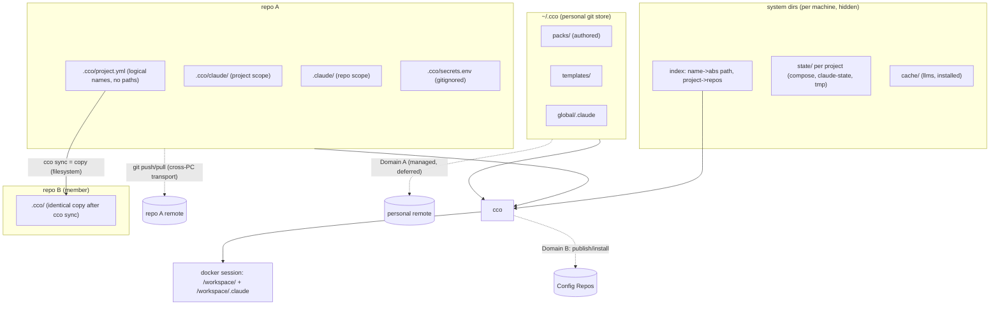
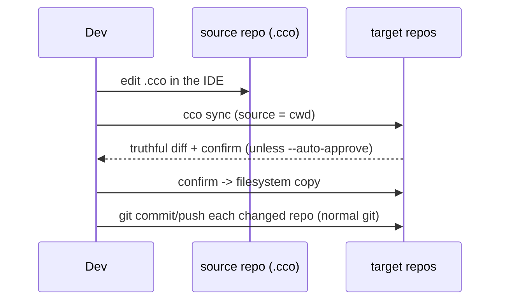

# Decentralized In-Repo Config — Design

**Status**: Approved for implementation (2026-06-15). Authoritative design; drives
the phased implementation (§9).
**Requirements**: `requirements.md` (AD1-AD12, FR-*).
**Decision records**: `decisions/` — ADR-0001 (decentralization), 0002
(machine-agnostic config), 0003 (sync-as-copy), 0004 (config/state/cache separation),
0005 (dual `.claude` scope), 0006 (breaking cutover + lazy migration).
**Decision history (historical)**: `reviews/15-06-2026-sync-adversarial-review.md`,
`reviews/15-06-2026-simplification-analysis.md`.

> `requirements.md` says **what** and **why**; this document says **how**. It is the
> single source of truth for the refactor. Open questions are isolated in §13 and are
> the subject of dedicated follow-up analyses; everything else is decided.

---

## 1. Architecture Overview

Three ideas, no custom diff/merge: **machine-agnostic committed config**, **plain
git as the cross-PC transport**, and **sync = copy** within a project on one machine.



- **Committed `<repo>/.cco/`** — machine-agnostic config, versioned with the code.
- **System dirs** — per-machine state, cache, and the name→path index; hidden, never committed.
- **`~/.cco/`** — personal git store for global resources (Domain A; depth deferred).
- **Sync** — a plain copy from a chosen source repo to targets (no merge engine).
- **Cross-PC** — plain `git` on each repo's own remote.

---

## 2. Layout

### 2.1 In-repo (committed) — machine-agnostic only
```
<repo>/
├── .claude/                  # COMMITTED — repo-local Claude config → /workspace/<repo>/.claude
├── .cco/
│   ├── .gitignore            # ignores secrets.env (+ secret patterns)
│   ├── project.yml           # logical names only; identical across the project's repos
│   ├── secrets.env.example   # COMMITTED skeleton
│   ├── secrets.env           # GITIGNORED — real values, user-edited (only in-repo exception)
│   └── claude/               # COMMITTED + (copy-)synced → /workspace/.claude
│       └── CLAUDE.md, rules/, agents/, skills/   # authored config ONLY — no generated files
```
This tree holds **authored config only**. Framework-generated files (`packs.md`,
`workspace.yml`) are NOT written here — they would pollute the truthful `git diff` and
the sync (ADR-0002/0004). They are produced in the machine-local cache (§2.2) and
overlaid into `/workspace/.claude` via nested `:ro` mounts, exactly like pack/llms
resources (RD-claude-mount, ADR-0005). `packs/` and `llms/` are framework-reserved
sub-paths within `/workspace/.claude`; committed config must not author into them.
`.cco/.gitignore` (committed):
```gitignore
secrets.env
*.env
*.key
*.pem
.credentials.json
!secrets.env.example
```
A pre-commit/pre-push scan (reused from `lib/secrets.sh`) refuses real secrets and
**exempts `*.example` from the content scan** (FR-S3).

### 2.2 System dirs (per machine, hidden, never committed) — ADR-0007
```
<state>/cco/projects/<id>/   # generated docker-compose.yml, claude-state/, .tmp/, meta
<state>/cco/index            # name -> absolute path; project -> [repo names]; tags
<state>/cco/                 # remotes+tokens, last_seen/last_read, sync-meta (§4.6), seeds
<cache>/cco/                 # llms/, installed/ (Config-Repo caches)
<cache>/cco/projects/<id>/   # generated .claude overlays (packs.md, workspace.yml) → :ro into /workspace/.claude
```
**Locations (ADR-0007)** — XDG layout on both Linux *and* macOS (no `~/Library`):
- `<state>` = `$CCO_STATE_HOME` → `$XDG_STATE_HOME/cco` → `~/.local/state/cco`
- `<cache>` = `$CCO_CACHE_HOME` → `$XDG_CACHE_HOME/cco` → `~/.cache/cco`

The **index lives in STATE** (machine-local, non-portable, scan-rebuildable — not
CONFIG). Resolve bases **host-side only** (never compute `$XDG_*` inside the
container); ignore unset/empty/non-absolute XDG values; create `0700`. Rationale: keep
the committed `.cco/` small and clean, make state un-committable by construction, and
protect it from accidental edits.

### 2.3 `~/.cco/` — personal git store (Domain A; depth deferred to RD-home)
> CONFIG store deliberately keeps the `~/.cco` **dotdir** (ADR-0007), not
> `$XDG_CONFIG_HOME/cco`: it is a user-facing, git-versioned tree the user authors in
> directly (docker `~/.docker` / cargo `~/.cargo` precedent). Clean split: `~/.cco` =
> what you edit and version; XDG state/cache = machine-internal plumbing you never touch.
```
~/.cco/
├── .git/                # personal store, opt-in remote
├── .gitignore           # allowlist discipline: only packs/ templates/ global/.claude committed
├── packs/               # authored packs
├── templates/           # authored templates
├── global/.claude/      # global Claude config
└── backups/             # vault migration archives
```

### 2.4 `project.yml` (machine-agnostic, symmetric)
```yaml
name: projectA
tags: [groupA]
repos:                   # ALL members by logical name; no paths; identical in every repo
  - repo1
  - repo2
  - repo3
extra_mounts:            # auxiliary mounts by logical name; default readonly
  - name: shared-assets
    readonly: true
entry: repo1             # OPTIONAL tie-breaker for `cco start projectA` (name-based); not a privilege
packs: [...]             # references only; packs live in ~/.cco, not in the repo
```
The host repo is **not** written in the file — it is the invoking repo at runtime
(AD6). Absolute paths for every `repos[]`/`extra_mounts[]` name come from the
machine-local index (§3).

---

## 3. Machine-Agnostic Config & the Local Path Index

The single source of machine-specific truth is the **index** (`<state>/cco/index`),
never committed, never synced:
```yaml
version: 1
paths:                       # logical name -> absolute path (repos AND extra mounts)
  repo1:          /Users/me/dev/repo1
  repo2:          /Users/me/dev/repo2
  shared-assets:  /Users/me/assets
projects:                    # subsumes the old registry
  projectA: { repos: [repo1, repo2, repo3], tags: [groupA] }
```
- **Uniqueness invariant (AD5)**: a logical name maps to exactly one absolute path
  per machine. `cco init`/`cco join` refuse a name already bound to a different path.
- **Absolute paths only**; CLI commands accept paths relative to the cwd and resolve
  to absolute before storing.
- **Maintenance CLI**: `cco resolve [project]` (interactive resolve/repair),
  `cco path set <name> <path>` / `cco path list` (move dirs, fix divergence,
  external installs). Manual edit allowed but discouraged.
- **Bootstrap / fresh machine**: `cco index refresh --scan <dir>` rebuilds the index
  by scanning for `.cco/project.yml`; first `cco start` resolves any missing name via
  prompt/clone. So a fresh clone is not stranded by an empty index (closes the old
  registry-bootstrap gap).
- **`@local`** resolution logic is reused; it now reads the index instead of a
  per-repo `local-paths.yml`. Because no real path is ever written into `project.yml`,
  there is nothing to sanitize and `git diff` is always truthful (AD3/G8).

---

## 4. Sync = Copy

### 4.1 Model
`cco sync` copies a **source** repo's committed `.cco/` set into **target** repos on
the same machine (filesystem copy). Synced set: `project.yml` + `claude/**`
(+ `secrets.env.example`). Never: `secrets.env`, repo-root `.claude/`, system dirs.

No merge engine, no `sync-base`, no commit-time, no peer/root modes, no
confirm/last-commit-wins policies. Divergence is allowed and visible; the user picks
the source. (This is the deliberate replacement for the old vault's opaque
merge/diff failures — the review's C1/C2/C3 and H1/H3/H4/H5/H6 dissolve because there
is no reconciliation algorithm, only a copy.)

### 4.2 Command surface (positional = target, `--from` = source; default source = cwd)
| Command | Source | Targets |
|---------|--------|---------|
| `cco sync` | current repo | all repos in `project.yml` |
| `cco sync <repo>` | current repo | only `<repo>` |
| `cco sync --from <repo>` | `<repo>` | all repos |
| `cco sync <repoA> --from <repoB>` | `<repoB>` | only `<repoA>` |

Flags: `--dry-run` (preview), `--auto-approve` (skip the confirm), `--check`
(exit-code only, for the user's own CI/hooks).

### 4.3 Behavior
1. Resolve source and targets (names → paths via the index).
2. Compute a **truthful diff** (plain diff; machine-agnostic content) source↔each target.
3. If no differences → no-op (exit 0).
4. Otherwise show the diff and **ask for confirmation** (unless `--auto-approve`).
5. On confirm, copy the source set into each target. A target without `.cco/`
   (code-only member, Case A) simply receives a copy.
6. Targets that are non-git or on any branch are irrelevant — sync is a filesystem
   copy, not a git operation. The user commits each repo with their normal git flow
   (`git log -- .cco/` isolates config history). `cco sync` prints a reminder of
   which repos changed.



### 4.4 `cco start` source selection & divergence
- **From a repo dir**: use the invoking repo's `.cco/` (AD6). Unambiguous.
- **By name `cco start <project>`**: if repos are aligned, any copy works; if they
  diverge and there is no clear source, use the optional `entry` repo, else prompt.
- **Divergence is never silently reconciled**: if a project's repos have divergent
  `.cco/`, `cco start` uses the chosen source and **prints a non-blocking notice**
  ("project repos have divergent .cco; started from <repo>; run `cco sync` to
  converge"). This realizes the user policy: sync-off → use cwd; sync-on → user runs
  `cco sync` to converge from a chosen source.

### 4.5 Cases (see requirements §5.3)
- **A** code-only members (no `.cco/`), single config in the host repo.
- **B** synced copies kept identical via `cco sync`.
- **C** intentional divergence (sync off); `cco sync` converges to B anytime.

### 4.6 Sync-state tracking (internal, per-machine)
cco keeps lightweight **per-machine** sync metadata in the system state dir (§2.2, never
committed). This is **not** a merge `sync-base` (no 3-way merge) — just bookkeeping that
records, per project:
- **which member repos carry a synced copy** (vs code-only) and which are currently
  **divergent** from each other;
- a **last-synced fingerprint** per repo (e.g. a content hash of the synced set at the
  last `cco sync`), so cco can tell a repo edited **locally by the dev since the last
  sync** apart from one that merely **received** a sync.

This tracking drives:
- **`cco sync` / `cco join` target selection** — knowing which repos are in sync (update
  all — Case B) vs divergent (prompt — Case C);
- **divergence flagging before `cco start`** — a non-blocking "repos diverged since last
  sync" notice (§4.4);
- optional **fast rollback** of the last sync.

Exact format and the rollback-snapshot richness are implementation details (was
RD-syncmeta; now in scope — requirements §8).

---

## 5. `@local` Path Resolution (reused, index-backed)

Retained from `../vault/local-path-resolution-design.md`; now resolves against the
machine-local index (§3) rather than a per-repo file. `project.yml` carries only
logical names; the index provides absolute paths; bootstrap on a fresh machine via
`cco index refresh --scan` + on-demand prompt/clone at `cco start`.

---

## 6. Two Sync Domains

### 6.1 Domain A — personal multi-PC
- Per-repo `.cco/` rides each repo's **own git remote** (AD8): clone/pull brings it;
  concurrent cross-PC edits are ordinary git conflicts resolved in the IDE.
- `~/.cco` global resources sync via the **personal git store**. Mechanism depth
  (managed auto pull/commit/push, conflict handling, manual vs managed) is **deferred
  to RD-home**. Hard rule regardless: commit via an explicit **allowlist**
  (`packs/ templates/ global/.claude/`), never `git add -A`.

### 6.2 Domain B — team/external (unchanged)
Publish/install/update/export over Config Repos (`cmd-project-publish.sh`,
`cmd-project-install.sh`, `cmd-pack.sh`, `cmd-remote.sh`, `remote.sh`) — unchanged.

---

## 7. Command Surface

| Area | Command | Status |
|------|---------|--------|
| Entry: clean | `cco init` (scaffold a clean `<repo>/.cco/` in the current repo) | NEW/transform |
| Entry: join | `cco join <project>` (add the current repo to `<project>` as a **member**: register it in the index + add it to `repos[]` in the project's `project.yml`). The new member's `repos[]` edit propagates to **every repo that carries a synced copy** (Case B); in a divergent project (Case C) join **prompts** which repo's `project.yml` to update, or all. The joining repo gets **no `.cco/`** (code-only member) **unless** `--sync` / interactive confirm, which copies the project's `.cco/` into it (source prompted if divergent) — **alternative to `cco init`** | NEW |
| Entry: migrate | `cco migrate <project>` (current repo, from the legacy vault backup: write `.cco/` with the migrated project config) — **alternative to `cco init`** | NEW |
| Run | `cco start [project]` (cwd-aware source; index-resolve `@local`; resolve unresolved repos/mounts) | transform |
| Sync | `cco sync [target] [--from <src>] [--dry-run\|--auto-approve\|--check]` | NEW |
| Paths/resolve | `cco resolve [project]` (resolve unresolved repos/mounts: pick a local path **or** clone from remote to a chosen destination), `cco path set/list`, `cco index refresh --scan` | NEW |
| Discovery | `cco list [--tag <t>]`, tag set/edit | transform |
| Global store | `cco config …` (manage `~/.cco`; depth = RD-home) | NEW |
| Sharing | `cco pack/project publish\|install\|update\|export`, `cco remote …` | unchanged |
| Update | `cco update …` (framework→user; merge engine unchanged) | unchanged |

**`cco init` / `cco join` / `cco migrate` are mutually exclusive** entry points for a
repo: `init` = clean config; `join` = become a **member** of a project already defined
in another repo; `migrate` = bring a legacy vault project's config into this repo.
Because the new member is added to `project.yml` (a synced file), the edit must reach
every repo holding a copy: in **Case B** (repos in sync) join updates `project.yml` in
**all synced repos**; in **Case C** (divergent, no sync) join **prompts** which repo's
`project.yml` to update, or all (membership only, no content sync). The joining repo
gets a `.cco/` copy only with `--sync` (source prompted if divergent). cco knows which
repos are synced vs divergent from its internal sync-state tracking (§4.6).
**Removed (breaking, no alias)**: the entire `cco vault *` surface
(save/diff/switch/move/profile) and `cco project create`. **First run** with no
`~/.cco`/system dirs bootstraps global resources first (journey J0); with a legacy
vault present it backs the vault up and prints migration instructions (FR-M1).
Discovery is **cwd-first**: if the cwd (or an ancestor) has `.cco/project.yml`, use
it; else resolve `<project>` via the index.

---

## 8. Key User Journeys

Entry points per repo are mutually exclusive: **init** (clean) | **join** (existing
project) | **migrate** (from legacy backup). `cco start` runs once configured.

```mermaid
flowchart TD
  subgraph J0["First run on a machine (D)"]
    z1["any cco command"] --> z2{"~/.cco + system dirs exist?"}
    z2 -->|no| z3["bootstrap global resources (~/.cco, system dirs)"]
    z2 -->|yes| z4["proceed"]
    z3 --> z4
  end
  subgraph JB["New project (B)"]
    b1["cco init in repo1"] --> b2["edit .cco; add repo2/3 to project.yml repos[]"]
    b2 --> b3["optional: cco sync (-> Case B)"] --> b4["cco start"]
  end
  subgraph JE["Join an existing project (E) — alternative to init"]
    e1["enter repo3 (new member)"] --> e2["cco join projectA"]
    e2 --> e3["register repo3 + add it to project.yml repos[] (in the holder repo)"]
    e3 --> e4{"--sync / confirm?"}
    e4 -->|yes| e5["repo3 gets a .cco copy (-> Case B)"]
    e4 -->|no| e6["repo3 stays code-only member (Case A)"]
  end
  subgraph JC["Clone a shared repo that already has .cco (C)"]
    c1["git clone repo"] --> c2["cco start  (no init; .cco already present)"]
  end
  subgraph JA["Migrate a legacy project (A) — lazy, per-project"]
    a1["first run: cco backs up the legacy vault + instructions"] --> a2["enter cloned repo"]
    a2 --> a3["cco migrate projectA  (from backup -> Case A)"]
    a3 --> a4["optional cco sync / cco init others -> Case B or C"]
  end
  subgraph JF["Resolve unresolved repos/mounts (F)"]
    f1["cco start with an unresolved repo/mount"] --> f2{"resolve"}
    f2 -->|local| f3["point to an existing local path"]
    f2 -->|remote| f4["clone from remote to a chosen destination"]
  end
```



---

## 9. Teardown & Migration (phased)

**Breaking cutover** (AD12): no dual-read, no deprecation window. Development happens on
`feat/*` → `develop`; only a working version is merged to `main` for release. Each
phase leaves cco runnable + tests green.

- **Phase 0 — machine-agnostic layout + index + path helpers.** New committed `.cco/`
  (logical names only, **new layout only — no dual-read**), system-dir state/cache,
  machine-local index. `/workspace/.claude` mount vs pack injection resolved
  (RD-claude-mount / ADR-0005): nested-overlay composition is source-agnostic — no
  shadowing. Action items it surfaced: (F1) generate `packs.md`/`workspace.yml` into the
  machine-local cache and overlay them `:ro` instead of writing into committed
  `.cco/claude/`; (F2) treat `packs/`/`llms/` as reserved + warn on cross-tree name
  collisions; (F3) keep the parent mount rw, overlays `:ro`.
- **Phase 1 — sync-as-copy + resolve.** `lib/cmd-sync.sh` (the 4 command forms,
  diff+confirm, copy; no merge engine, no sync-base). `cco resolve`/`cco path`/`cco
  index` (incl. clone-from-remote resolution).
- **Phase 2 — migration + first-run bootstrap.** First-run global bootstrap
  (`~/.cco` + system dirs when missing — journey J0); first-run **legacy-vault backup**
  + instructions; `cco migrate <project>` (lazy, per-project, from the backup);
  `cco init`/`cco join`. A minimal legacy-vault reader exists **only** inside
  `cco migrate`.
- **Phase 3 — remove the legacy vault entirely (breaking).** Delete the
  profile/switch/shadow machinery, `cco vault *`, `cco project create`, and the
  custom `project.yml` sanitize/virtual-diff/extract-restore/backup-trap (unnecessary
  under AD3). Keep `@local` (index-backed), secret-scan, gitignore-heal. Profiles →
  tags. `cco config` (`~/.cco`; managed depth per RD-home).

**Migration flow** (lazy, per-project, idempotent, backed-up):
1. **First run** detects a legacy vault → archive it to
   `~/.cco/backups/vault-<date>.tar.gz`, inform the user, print instructions, offer to
   remove the old vault. No project migrated automatically.
2. Per project: in an already-cloned repo, `cco migrate <project>` reads that
   project's config from the backup → writes a machine-agnostic `.cco/` in the repo →
   registers it in the index. The repo lands in **Case A**.
3. The user opts into Case B (`cco sync`) or Case C (`cco init` other repos), or stays
   in A. Re-runs never overwrite an existing `.cco/` without confirm. Rollback: `.cco/`
   is in the repo's git; the backup archive preserves full vault history.
A `cco migrate --all` is **optional and discouraged** (no A/B/C control; would default
to B) — evaluate before adding.

---

## 10. Packaging-Awareness (AD11)

Decentralization separates **tool** (`bin/cco`, `lib/`, `defaults/`, `templates/`,
`proxy/`, Dockerfile) from **user data** (`~/.cco`, per-repo `.cco`, system dirs). No
design choice may put tool code inside a `.cco/` or require a source clone to run;
any future hooks invoke `cco` by PATH. This keeps a future npm/npx + image package
(R-pkg) a drop-in.

---

## 11. Test Plan

| Phase | New | Rewrite | Remove |
|-------|-----|---------|--------|
| 0 | machine-agnostic layout + index tests (new layout only, no dual-read) | `test_local_paths.sh` | — |
| 1 | `test_sync.sh` (copy semantics, 4 forms, confirm); resolve incl. clone-from-remote | — | — |
| 2 | `test_migrate.sh` (lazy per-project from backup); first-run bootstrap | — | — |
| 3 | multi-project coexistence; truthful-diff (no sanitize) tests; `test_config.sh` (Domain A) | `test_vault.sh` (shrink to migrate-reader) | `test_vault_profiles.sh`; custom-diff/sanitize tests |

Net: a narrower surface — no custom diff/save/merge sync code to test, no dual-read; the
`cco update` merge engine tests are untouched.

---

## 12. Future Evolutions (out of scope)

- **Auto-sync triggers (RD-triggers)** — opt-in background daemon and/or native hooks
  in select cco commands vs opt-in git hooks. Manual `cco sync` is the v1 model.
- **`~/.cco` auto-management (RD-home)** — managed pull/commit/push with allowlist.
- **`cco update` native (R-update-native)** — cco fully agnostic; opinionated
  packs/templates via native publish/install; keep a `cco update` for installed packs.
- **cco packaging (R-pkg)** — npm/npx + image registry.
- **Persistent `/workspace` root (R-workspace).**

---

## 13. Open Questions (dedicated follow-up analyses)

These are deliberately **not** decided here; each gets its own analysis after this
design is persisted.

| # | Question |
|---|----------|
| **RD-home** | `~/.cco` management depth: auto vs manual, conflict handling, allowlist enforcement. |
| **RD-authoring** | Authoring global packs/templates: direct `~/.cco` edit (lean) vs authoring-in-repo + promote. |
| **RD-memory** | `memory/` handling: per-machine vs committed vs team-shared. |
| **RD-triggers** | Future opt-in auto-sync (daemon / native hooks / git hooks / manual-only). |

**Resolved:**
| # | Resolution |
|---|----------|
| **RD-claude-mount** | ✅ 2026-06-16 (ADR-0005). Nested-overlay composition is source-agnostic → no bind-mount shadowing. Surfaced F1 (generate `packs.md`/`workspace.yml` into cache + `:ro` overlay, not into committed `.cco/claude/`), F2 (reserve `packs/`/`llms/`, warn on cross-tree collisions), F3 (parent rw, overlays `:ro`). |
| **RD-paths** | ✅ 2026-06-16 (ADR-0007). XDG on both OSes: STATE `$CCO_STATE_HOME`→`$XDG_STATE_HOME/cco`→`~/.local/state/cco`, CACHE `$CCO_CACHE_HOME`→`$XDG_CACHE_HOME/cco`→`~/.cache/cco`; index in STATE; CONFIG keeps `~/.cco` dotdir; host-side resolution, `0700`, XDG-validation. |
