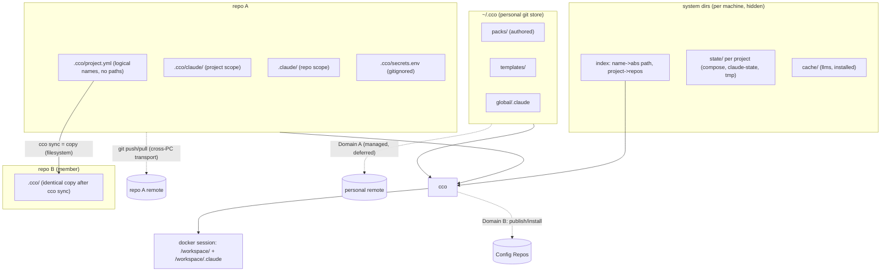
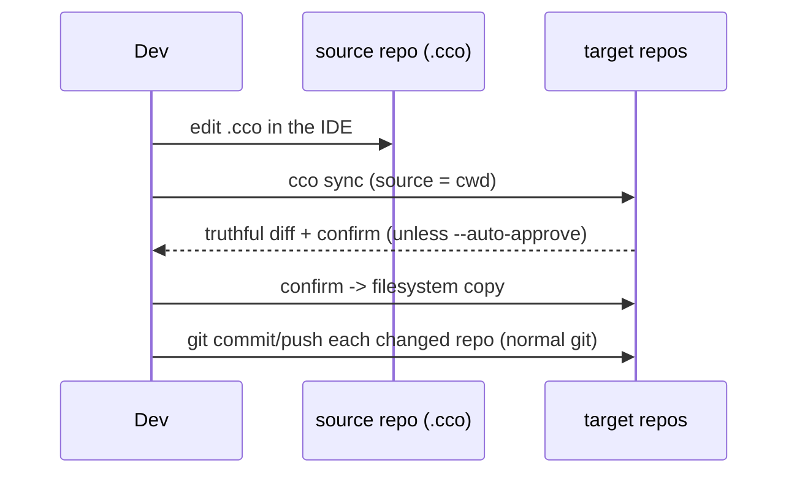

# Decentralized In-Repo Config — Design

**Status**: Approved for implementation (2026-06-15). Authoritative design; drives
the phased implementation (§9).
**Requirements**: `requirements.md` (AD1-AD12, FR-*).
**Decision record**: `decisions/0001-decentralized-in-repo-config.md`.
**Decision history**: `reviews/15-06-2026-sync-adversarial-review.md`.

> `requirements.md` says **what** and **why**; this document says **how**. It is the
> single source of truth for the refactor. Open questions are isolated in §13 and are
> the subject of dedicated follow-up analyses; everything else is decided.

---

## 1. Architecture Overview

Three ideas, no custom diff/merge: **machine-agnostic committed config**, **plain
git as the cross-PC transport**, and **sync = copy** within a project on one machine.



- **Committed `<repo>/.cco/`** — machine-agnostic config, versioned with the code.
- **System dirs** — per-machine state, cache, and the name→path index; hidden, never committed.
- **`~/.cco/`** — personal git store for global resources (Domain A; depth deferred).
- **Sync** — a plain copy from a chosen source repo to targets (no merge engine).
- **Cross-PC** — plain `git` on each repo's own remote.

---

## 2. Layout

### 2.1 In-repo (committed) — machine-agnostic only
```
<repo>/
├── .claude/                  # COMMITTED — repo-local Claude config → /workspace/<repo>/.claude
├── .cco/
│   ├── .gitignore            # ignores secrets.env (+ secret patterns)
│   ├── project.yml           # logical names only; identical across the project's repos
│   ├── secrets.env.example   # COMMITTED skeleton
│   ├── secrets.env           # GITIGNORED — real values, user-edited (only in-repo exception)
│   └── claude/               # COMMITTED + (copy-)synced → /workspace/.claude
│       └── CLAUDE.md, rules/, agents/, skills/
```
`.cco/.gitignore` (committed):
```gitignore
secrets.env
*.env
*.key
*.pem
.credentials.json
!secrets.env.example
```
A pre-commit/pre-push scan (reused from `lib/secrets.sh`) refuses real secrets and
**exempts `*.example` from the content scan** (FR-S3).

### 2.2 System dirs (per machine, hidden, never committed) — RD-paths
```
<state>/cco/projects/<id>/   # generated docker-compose.yml, claude-state/, .tmp/, meta
<state>/cco/index            # name -> absolute path; project -> [repo names]; tags
<cache>/cco/                 # llms/, installed/ (Config-Repo caches)
```
`<state>`/`<cache>` follow OS conventions (XDG on Linux; macOS equivalent) — exact
paths finalized in RD-paths. Rationale: keep the committed `.cco/` small and clean,
make state un-committable by construction, and protect it from accidental edits.

### 2.3 `~/.cco/` — personal git store (Domain A; depth deferred to RD-home)
```
~/.cco/
├── .git/                # personal store, opt-in remote
├── .gitignore           # allowlist discipline: only packs/ templates/ global/.claude committed
├── packs/               # authored packs
├── templates/           # authored templates
├── global/.claude/      # global Claude config
└── backups/             # vault migration archives
```

### 2.4 `project.yml` (machine-agnostic, symmetric)
```yaml
name: cave
tags: [cave]
repos:                   # ALL members by logical name; no paths; identical in every repo
  - cave-auth
  - cave-auth-web
  - cave-infrastructure
extra_mounts:            # auxiliary mounts by logical name; default readonly
  - name: shared-assets
    readonly: true
entry: cave-auth         # OPTIONAL tie-breaker for `cco start cave` (name-based); not a privilege
packs: [...]             # references only; packs live in ~/.cco, not in the repo
```
The host repo is **not** written in the file — it is the invoking repo at runtime
(AD6). Absolute paths for every `repos[]`/`extra_mounts[]` name come from the
machine-local index (§3).

---

## 3. Machine-Agnostic Config & the Local Path Index

The single source of machine-specific truth is the **index** (`<state>/cco/index`),
never committed, never synced:
```yaml
version: 1
paths:                       # logical name -> absolute path (repos AND extra mounts)
  cave-auth:      /Users/me/dev/cave-auth
  cave-auth-web:  /Users/me/dev/cave-auth-web
  shared-assets:  /Users/me/assets
projects:                    # subsumes the old registry
  cave: { repos: [cave-auth, cave-auth-web, cave-infrastructure], tags: [cave] }
```
- **Uniqueness invariant (AD5)**: a logical name maps to exactly one absolute path
  per machine. `cco init`/`cco join` refuse a name already bound to a different path.
- **Absolute paths only**; CLI commands accept paths relative to the cwd and resolve
  to absolute before storing.
- **Maintenance CLI**: `cco resolve [project]` (interactive resolve/repair),
  `cco path set <name> <path>` / `cco path list` (move dirs, fix divergence,
  external installs). Manual edit allowed but discouraged.
- **Bootstrap / fresh machine**: `cco index refresh --scan <dir>` rebuilds the index
  by scanning for `.cco/project.yml`; first `cco start` resolves any missing name via
  prompt/clone. So a fresh clone is not stranded by an empty index (closes the old
  registry-bootstrap gap).
- **`@local`** resolution logic is reused; it now reads the index instead of a
  per-repo `local-paths.yml`. Because no real path is ever written into `project.yml`,
  there is nothing to sanitize and `git diff` is always truthful (AD3/G8).

---

## 4. Sync = Copy

### 4.1 Model
`cco sync` copies a **source** repo's committed `.cco/` set into **target** repos on
the same machine (filesystem copy). Synced set: `project.yml` + `claude/**`
(+ `secrets.env.example`). Never: `secrets.env`, repo-root `.claude/`, system dirs.

No merge engine, no `sync-base`, no commit-time, no peer/root modes, no
confirm/last-commit-wins policies. Divergence is allowed and visible; the user picks
the source. (This is the deliberate replacement for the old vault's opaque
merge/diff failures — the review's C1/C2/C3 and H1/H3/H4/H5/H6 dissolve because there
is no reconciliation algorithm, only a copy.)

### 4.2 Command surface (positional = target, `--from` = source; default source = cwd)
| Command | Source | Targets |
|---------|--------|---------|
| `cco sync` | current repo | all repos in `project.yml` |
| `cco sync <repo>` | current repo | only `<repo>` |
| `cco sync --from <repo>` | `<repo>` | all repos |
| `cco sync <repoA> --from <repoB>` | `<repoB>` | only `<repoA>` |

Flags: `--dry-run` (preview), `--auto-approve` (skip the confirm), `--check`
(exit-code only, for the user's own CI/hooks).

### 4.3 Behavior
1. Resolve source and targets (names → paths via the index).
2. Compute a **truthful diff** (plain diff; machine-agnostic content) source↔each target.
3. If no differences → no-op (exit 0).
4. Otherwise show the diff and **ask for confirmation** (unless `--auto-approve`).
5. On confirm, copy the source set into each target. A target without `.cco/`
   (code-only member, Case A) simply receives a copy.
6. Targets that are non-git or on any branch are irrelevant — sync is a filesystem
   copy, not a git operation. The user commits each repo with their normal git flow
   (`git log -- .cco/` isolates config history). `cco sync` prints a reminder of
   which repos changed.



### 4.4 `cco start` source selection & divergence
- **From a repo dir**: use the invoking repo's `.cco/` (AD6). Unambiguous.
- **By name `cco start <project>`**: if repos are aligned, any copy works; if they
  diverge and there is no clear source, use the optional `entry` repo, else prompt.
- **Divergence is never silently reconciled**: if a project's repos have divergent
  `.cco/`, `cco start` uses the chosen source and **prints a non-blocking notice**
  ("project repos have divergent .cco; started from <repo>; run `cco sync` to
  converge"). This realizes the user policy: sync-off → use cwd; sync-on → user runs
  `cco sync` to converge from a chosen source.

### 4.5 Cases (see requirements §5.3)
- **A** code-only members (no `.cco/`), single config in the host repo.
- **B** synced copies kept identical via `cco sync`.
- **C** intentional divergence (sync off); `cco sync` converges to B anytime.

---

## 5. `@local` Path Resolution (reused, index-backed)

Retained from `../vault/local-path-resolution-design.md`; now resolves against the
machine-local index (§3) rather than a per-repo file. `project.yml` carries only
logical names; the index provides absolute paths; bootstrap on a fresh machine via
`cco index refresh --scan` + on-demand prompt/clone at `cco start`.

---

## 6. Two Sync Domains

### 6.1 Domain A — personal multi-PC
- Per-repo `.cco/` rides each repo's **own git remote** (AD8): clone/pull brings it;
  concurrent cross-PC edits are ordinary git conflicts resolved in the IDE.
- `~/.cco` global resources sync via the **personal git store**. Mechanism depth
  (managed auto pull/commit/push, conflict handling, manual vs managed) is **deferred
  to RD-home**. Hard rule regardless: commit via an explicit **allowlist**
  (`packs/ templates/ global/.claude/`), never `git add -A`.

### 6.2 Domain B — team/external (unchanged)
Publish/install/update/export over Config Repos (`cmd-project-publish.sh`,
`cmd-project-install.sh`, `cmd-pack.sh`, `cmd-remote.sh`, `remote.sh`) — unchanged.

---

## 7. Command Surface

| Area | Command | Status |
|------|---------|--------|
| Init | `cco init` (scaffold `<repo>/.cco/`), `cco init --migrate <legacy>` | NEW/transform |
| Membership | `cco join <project>` (add the current repo to a project) | NEW |
| Run | `cco start [project]` (cwd-aware source; index-resolve `@local`) | transform |
| Sync | `cco sync [target] [--from <src>] [--dry-run|--auto-approve|--check]` | NEW |
| Paths | `cco resolve [project]`, `cco path set/list`, `cco index refresh --scan` | NEW |
| Discovery | `cco list [--tag <t>]`, tag set/edit | transform |
| Global store | `cco config …` (manage `~/.cco`; depth = RD-home) | NEW |
| Sharing | `cco pack/project publish|install|update|export`, `cco remote …` | unchanged |
| Update | `cco update …` (framework→user; merge engine unchanged) | unchanged |
| Legacy | `cco vault *` → deprecated alias → `cco vault migrate` | deprecated |

**Removed**: the entire `cco vault save/diff/switch/move/profile` surface and
`cco project create` (replaced by `cco init`). Discovery is **cwd-first**: if the cwd
(or an ancestor) has `.cco/project.yml`, use it; else resolve `<project>` via the
index.

---

## 8. Key User Journeys

```mermaid
flowchart TD
  subgraph J1["Single-repo"]
    a1[cco init] --> a2[edit .cco in IDE] --> a3[cco start] --> a4[git commit/push]
  end
  subgraph J2["Add a member"]
    b1[in repo B: cco join cave] --> b2[in repo A: cco sync] --> b3[B has the config]
  end
  subgraph J3["Fresh machine"]
    c1[git clone repo A] --> c2[cco start] --> c3[index resolve: prompt/clone siblings] --> c4[run]
  end
  subgraph J6["Migration"]
    d1[cco vault migrate] --> d2[map projects to repos] --> d3[write machine-agnostic .cco + index + backup]
  end
```



---

## 9. Teardown & Migration (phased)

Each phase leaves cco runnable + tests green.

- **Phase 0 — machine-agnostic layout + index + path helpers.** New committed `.cco/`
  (logical names only), system-dir state/cache, machine-local index, `lib/paths.sh`
  dual-read. Verify the `/workspace/.claude` mount vs pack injection (RD-claude-mount).
  Additive.
- **Phase 1 — remove profiles + the custom diff/save layer.** Delete profile
  branch/switch/shadow machinery **and** `project.yml` sanitize/virtual-diff/
  extract-restore/backup-trap (now unnecessary — AD3). Keep `@local` (index-backed),
  secret-scan, gitignore-heal. Profiles → tags.
- **Phase 2 — sync-as-copy.** `lib/cmd-sync.sh` (the 4 command forms, diff+confirm,
  copy). No merge engine, no sync-base. `cco resolve`/`cco path`/`cco index`.
- **Phase 3 — global store + migration.** `cco config` (`~/.cco`; managed depth per
  RD-home), `cco vault migrate`. Dual-read keeps legacy readable.
- **Phase 4 — vault sunset (future).** Drop dual-read after 1–2 releases.

**Migration flow** (`cco vault migrate`, interactive, idempotent, backed-up): discover
vault projects → map each onto physical repo(s) (offer clone if missing; pick member
repos) → write machine-agnostic `.cco/` → build the index → archive the vault to
`~/.cco/backups/` → print a `git` reminder. Re-runs skip migrated projects and never
overwrite an existing `.cco/` without confirm. Rollback: `.cco/` is in each repo's
git; the archive preserves full vault history.

---

## 10. Packaging-Awareness (AD11)

Decentralization separates **tool** (`bin/cco`, `lib/`, `defaults/`, `templates/`,
`proxy/`, Dockerfile) from **user data** (`~/.cco`, per-repo `.cco`, system dirs). No
design choice may put tool code inside a `.cco/` or require a source clone to run;
any future hooks invoke `cco` by PATH. This keeps a future npm/npx + image package
(R-pkg) a drop-in.

---

## 11. Test Plan

| Phase | New | Rewrite | Remove |
|-------|-----|---------|--------|
| 0 | machine-agnostic layout + index + dual-read tests | — | — |
| 1 | multi-project coexistence; truthful-diff (no sanitize) tests | `test_vault.sh` | `test_vault_profiles.sh`; custom-diff tests |
| 2 | `test_sync.sh` (copy semantics, 4 forms, confirm) | `test_local_paths.sh` | sync-base/merge-engine sync tests (never built) |
| 3 | `test_config.sh` (Domain A), `test_migrate.sh` | `test_vault.sh` | — |

Net: a narrower surface — no custom diff/save/merge sync code to test; the `cco
update` merge engine tests are untouched.

---

## 12. Future Evolutions (out of scope)

- **Auto-sync triggers (RD-triggers)** — opt-in background daemon and/or native hooks
  in select cco commands vs opt-in git hooks. Manual `cco sync` is the v1 model.
- **`~/.cco` auto-management (RD-home)** — managed pull/commit/push with allowlist.
- **`cco update` native (R-update-native)** — cco fully agnostic; opinionated
  packs/templates via native publish/install; keep a `cco update` for installed packs.
- **cco packaging (R-pkg)** — npm/npx + image registry.
- **Persistent `/workspace` root (R-workspace).**

---

## 13. Open Questions (dedicated follow-up analyses)

These are deliberately **not** decided here; each gets its own analysis after this
design is persisted. None blocks Phase 0 except RD-claude-mount (a Phase-0 check).

| # | Question |
|---|----------|
| **RD-syncmeta** | Keep an internal last-synced snapshot to enable fast rollback and to distinguish user edits vs cco-sync edits (and flag divergence before `cco start`)? UX benefit vs complexity. |
| **RD-home** | `~/.cco` management depth: auto vs manual, conflict handling, allowlist enforcement. |
| **RD-authoring** | Authoring global packs/templates: direct `~/.cco` edit (lean) vs authoring-in-repo + promote. |
| **RD-paths** | Exact system-dir locations for state/cache/index on macOS & Linux (XDG-style, per-user, no home clutter). |
| **RD-memory** | `memory/` handling: per-machine vs committed vs team-shared. |
| **RD-triggers** | Future opt-in auto-sync (daemon / native hooks / git hooks / manual-only). |
| **RD-claude-mount** | Phase-0: single `/workspace/.claude` mount (cwd repo's `.cco/claude/`) vs pack-injected files in the same tree — verify no bind-mount shadowing. |
