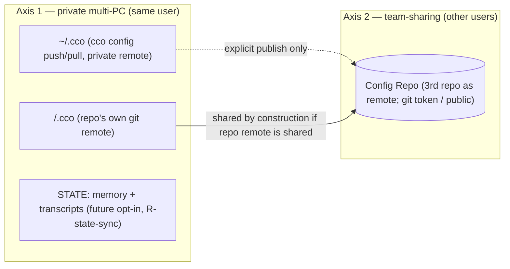

# Decentralized cco Config — Guiding Principles (Foundation)

**Status**: **Source of truth — foundational.** Fixed 2026-06-16. These principles govern the
whole "decentralized in-repo config" refactor. **Every domain analysis must validate its
decisions against this document**; a decision that clashes with a principle is a defect to
correct (in the decision or, deliberately, in the principle).
**Grounded in**: ADRs 0001–0010 (this document distills their *cross-cutting* rules; it does not
restate each ADR). See also `requirements.md`, `design.md`, `resource-coherence-inventory.md`,
`analysis-roadmap.md`.

> **Why this exists**: the resource→location mapping and the sharing/sync model were scattered
> across several ADRs and design sections, and destination was being conflated with sync. This
> document fixes the two **orthogonal** classification axes so each remaining domain analysis
> (run in its own clean session) starts from the same foundation.

---

## P1 — Config vs internal: the **edit criterion**

The primary classifier is **who edits the file and how**:

- **Config / resources** — the **user authors and edits** them, **reachable and editable from an
  IDE**. They are versioned and meaningful to the user. `secrets.env` is config too (it is
  user-edited) — merely **gitignored** because it holds secret values; it stays IDE-reachable.
- **Internal** — **cco manages** them, updated **only via the CLI**, **never hand-edited**. They
  must be **hidden** from the IDE and from accidental manual edit/delete, and **never live in a
  config repo** (neither `<repo>/.cco/` nor `~/.cco`). State, cache, indexes, registries, and any
  cco system file the user should never explicitly consult belong here.

Rule of thumb: *if the user is expected to open it in an editor → config; if only `cco …` touches
it → internal.*

## P2 — Destination taxonomy (where a resource physically lives)

| Bucket | Holds | Visibility |
|---|---|---|
| **`<repo>/.cco/`** | project config, machine-agnostic, authored (`project.yml`, `claude/`, `secrets.env` gitignored) | user-facing, in the code repo |
| **`~/.cco/`** | global resources the user **curates/authors** (`packs/`, `templates/`, `global/.claude/`, `tags.yml`) | user-facing personal store |
| **STATE** (`$XDG_STATE_HOME/cco` → `~/.local/state/cco`) | machine-local persistent **state** (index, generated compose, transcripts, memory, meta, seeds, sync-meta) | **hidden** (internal) |
| **CACHE** (`$XDG_CACHE_HOME/cco` → `~/.cache/cco`) | regenerable / re-fetchable / transient (generated overlays, Config-Repo clones, `.bak`) | **hidden** (internal) |
| **(possible 4th) internal-but-synced** | cco-managed (CLI-updated, hidden, **not** IDE-edited config), but worth **private multi-PC** sync (candidates: `tags.yml` (internal nature fixed — ADR-0011); de-tokenized remotes registry **+ `source` provenance** (R3, ADR-0013). *Manifest **removed**, not a candidate — ADR-0012*) | **hidden** (internal) — *existence + membership decided by the **Cat-4 synthesis** after R1–R4 (ADR-0011); **not** pre-judged* |

The two config buckets (`<repo>/.cco`, `~/.cco`) hold **only** P1-config. STATE/CACHE hold **only**
P1-internal that is **not** synced. Today there is **no** home for "internal yet privately synced"
data — whether one is needed, and what falls in it, is **decided by the Cat-4 synthesis after
R1–R4 (ADR-0011)**, not assumed a priori. Selection rule: co-locate a lone such resource in
`~/.cco` only if it is the *sole* member (balance cost/benefit); otherwise prefer a dedicated 4th
bucket for architectural cleanliness. *(See also the Cat-4 ∩ STATE-sync (P8) note in ADR-0011: the
sync transport may be unified across STATE, tags, and any cat-4 member.)*

> **`tags.yml` nature RESOLVED (ADR-0011); placement deferred.** R1 fixed the **nature**: the tag
> interface is **CLI-canonical** (`cco tag add/rm` + `cco list --tag`), so by P1 tags are **internal**
> (cco-managed, not hand-edited) — correcting ADR-0010's provisional "config" framing. Semantics are
> unchanged (per-user, never team-shared, synced cross-PC). The **physical placement** (dedicated 4th
> bucket vs co-locate in `~/.cco`) is **deferred to the Cat-4 synthesis** after R1–R4, per the
> selection rule above. ADR-0010 still owns the *semantics*; ADR-0011 owns *nature & method*.

## P3 — Two **orthogonal** sync axes (never conflate them)

- **Axis 1 — Private multi-PC (same user)**: move a user's own data across **their** machines.
  Transports: `~/.cco` via `cco config push/pull` (private remote); `<repo>/.cco` via the repo's
  own git remote; STATE (memory/transcripts) via a **future** opt-in (P8); a possible
  internal-but-synced bucket (P2).
- **Axis 2 — Team-sharing (different users)**: share with **other people**. Transport: **always a
  third repo acting as a remote** — a **Config Repo** (`publish`/`install`/`update`/`export`),
  access delegated to git (token for private, or public repo). Never by syncing `~/.cco` itself.

A resource's **destination (P2)** and its **sync profile** `{none | private-multi-PC | team | both}`
are independent dimensions. Classifying a resource means answering **both**.

> **Axis-1 remote access (open, → S).** The `~/.cco` personal remote is intended **private**, reached
> via the user's own git auth (token or local `.ssh`). Whether to **support a public repo for Axis-1**
> (technically against "private, same-user", but enforcing privacy may be excessive for cco) — forbid,
> allow, or allow with an **escape hatch** — is an open question owned by the sharing analysis (S).

## P4 — A resource is `(destination, sync-profile)`
Every cco-managed resource is classified on **both** axes. The consolidated mapping (domain A)
produces, for each resource: its P2 bucket **and** its P3 sync profile. Neither alone is enough.

## P5 — Sharing asymmetry (and a noted fallback)
- **`<repo>/.cco/` is team-shared *by construction*** when the repo has a shared remote — the same
  git sync serves **both** axes at once (the user's PCs *and* teammates).
- **`~/.cco` is private-only** (Axis 1). Its packs/templates reach a team **only via explicit
  publish** (Axis 2, Config Repo) — never by syncing `~/.cco`.

> **A4 fallback — solo cco adopter in a team (note for awareness; post-v1, not prioritized).**
> Use case: *a user works in a shared team repo but adopts cco alone; the team does not want
> `.cco/` committed in the repo; the user still wants their cco project config versioned and synced
> across their own PCs.* Two options to weigh in a dedicated analysis:
> - **(A)** gitignore the repo's `.cco/` — simplest, but the user loses versioning + private
>   multi-PC sync of that project config.
> - **(B)** opt-in mode where the **project's `.cco/` lives under `~/.cco` (Axis-1 synced), outside
>   the repo** — a simplified fallback reminiscent of the old central vault **but without profiles
>   or custom diff**. Enables the use case while keeping the team repo clean.
> Recorded to do justice to this user profile; decision deferred (likely domain C / a dedicated note).

## P6 — Hide internal files
Internal data (STATE, CACHE, indexes, registries, system files; P1) is **hidden** from the user,
**never in a config repo**, and only mutated through `cco …`. This protects it from accidental
edit/delete and keeps `git diff` on the config buckets truthful (G8).

## P7 — Sync mechanics
- **Sync transports already-made commits; it never fabricates them** (ADR-0008). No per-command
  network sync; `cco config push/pull` is explicit; pull non-fast-forward → abort + notify
  (resolve in the IDE).
- **Team-sharing always goes through a Config Repo** (a third repo as remote); access is delegated
  to git (token / public). `~/.cco`'s own remote is **private**.
- Within one machine, project multi-repo convergence is **sync-as-copy** (AD7), not a merge engine.

## P8 — STATE sync is a distinct, future category
`memory/` and chat transcripts are **STATE**, not config (ADR-0009). Their cross-machine /
cross-team sync is a **separate future opt-in feature (R-state-sync)** — a different *category* of
sync from the config buckets, and explicitly **not** part of the config vaults. v1 = machine-local,
no sync.

## P9 — Packaging-aware; opinionated defaults are shippable separately
No tool code lives in any data bucket (AD11); hooks invoke `cco` by PATH. cco's **opinionated
default resources** may become an **official public Config Repo**, shipped separately (relates to
R-pkg / R-update-native). The framework stays agnostic; opinionated content travels via the same
Domain-B sharing path any user would use.

## P10 — Classify by role & problem, not by surface (method)
A resource is placed (P2 destination + P3 sync profile) **only after** establishing its **role, the
problem it solves, and how it is mutated** — never from its current path or name. Surface placement
(e.g. "it lives under `~/.cco` today") is not evidence; the *role* is. A resource whose role does not
clearly map to a principle is **not** force-fit — it gets a dedicated analysis. This is why each
borderline resource/concept gets its **own clean session** (see `analysis-roadmap.md`): correct
classification needs undivided context on that resource's purpose. Every analysis must: (1) state the
resource's role + problem solved; (2) classify on both axes via P1–P9; (3) flag/resolve any conflict
with the current `design.md`/ADRs; (4) record an ADR + propagate to the living docs.

**Method lessons (ADR-0011).** (a) **Validate, don't assume** — never discard or accept a candidate
*a priori*; classify only from the validated, code-grounded role. A first pass that classified tags
from the *absence* of a CLI (instead of a deliberate CLI-vs-IDE design choice) was the error this
corrects. (b) **Maintainer confirmation** is required on choices that affect how the toolkit is used
(UX, interface, sync strategy) — these are not derivable from code alone. (c) **Cross-cutting
verdicts are synthesised, not per-resource** — e.g. the 4th-category existence is decided by a
dedicated synthesis over *all* candidates (R1–R4), not inside any single resource analysis.

**Method lessons (ADR-0014) — the analysis lens (reusable model).** The winning lens that produced
R4, to re-adopt in future designs: **(1)** ground in code first (current state, role, *how mutated*)
before classifying; **(2) decompose the resource into its constituent data** — a file/resource rarely
has one profile (an llms entry = content + coordinate + cache-state; a repo reference = name + url +
local-path); **(3)** classify each datum on the orthogonal pair **resource-type × sharing/sync-profile**
(P1/P3/P4); **(4) apply the defined principles as discriminators** — notably **P6** (team-shared ⇒ not
internal) and **DRY** (a canonical value is stored once, referenced by-name, never duplicated);
**(5)** heterogeneous profiles within one file = **split signal** → co-locate by profile;
**(6)** separate the **canonical datum** from its **references** and its **local materializations**,
and **resolve at the boundary** instead of duplicating eagerly (normalization over denormalization);
**(7)** fix **nature/classification now**, hand **mechanism** to the owning analysis (S/M), leave
**cross-cutting verdicts** (cat-4) to their synthesis. In short:
*(resource-type × sharing-type) + DRY + principle-coherence + decompose/split + resolve-at-boundary.*

## P11 — Classify every cco datum on three questions (the R3 method, generalized)

For **every** piece of cco-managed information — a **new file**, or **each datum inside one** —
answer three questions **before** placing it. This generalizes the per-datum method R3 applied
(ADR-0013) and must guide the design of any new cco file and every future analysis.

- **(a) Scope / ownership** — is it needed **even without team-sharing** (local + Axis-1 private →
  owned by the config/update analyses, e.g. R3) or is it **exclusive to team-sharing / opinionated
  defaults distribution** (Axis-2 + Class C, P9 → owned by the sharing analysis **S**)?
- **(b) Sync class** — **`never`** (syncing **breaks cco** or violates a security invariant —
  version-tied state, hashes, tokens) · **`opt-in`** (desirable but user-gated, e.g. `memory/` /
  transcripts, P8) · **`required`** (multi-PC by design, Axis-1, **never team** — cat-4 members)?
- **(c) Shared surface** — what does it **touch or share** with the unified diff/update/merge
  mechanism (so a later analysis consumes the boundary instead of re-deriving it)?

A file whose data give **heterogeneous** answers across (a)/(b)/(c) is a **split signal** (cf.
P3/P4; the `.cco/meta` grab-bag was split exactly this way). Co-locate by **answer profile**, not
merely by functional domain.

## P12 — Referenced-resource coordinates: reference by-name, one canonical coordinate, resolve at the boundary

A resource **referenced by name** from `project.yml`/`pack.yml` (a repo mount, an llms doc) is **not a
monolith** — it decomposes into data with **different sync-profiles**, co-located accordingly (P3/P4):

- **name (id)** — the reference handle in the consuming manifest; travels **with that manifest** (both
  axes).
- **coordinate** `name → url` (+ `variant` for llms / `ref` for repos) — the canonical, **user-known
  locator**. It is **config** (it must be team-shared so a recipient can resolve the resource, and by
  P6 anything team-shared **cannot** be internal); **stored once** (DRY — one update point for N
  references); **synced cross-PC** (Axis-1) **and carried to the team by resolution at the publish
  boundary** (never by publishing the whole registry, which would leak unrelated entries). It enables
  **auto-resolve** (clone/fetch).
- **local materialization** — machine-specific, **internal, local-only, never synced/shared**: the
  repo **local-path** (`cco … resolve`, explicit per PC) and the llms **content** (CACHE, re-fetched
  from the coordinate).

**Never duplicate a coordinate across consumer manifests** (denormalization → update anomaly):
reference **by-name** and **resolve at the boundary** (publish/install/start). This unifies repo-mount
and llms references under one coordinate model; only the *resolution backend* differs (repo → clone
into a local-path; llms → fetch into CACHE). Distinguish this **config coordinate** from internal,
CLI-managed, **never-team** data (tags → ADR-0011; install-provenance `source` → ADR-0013 — both cat-4
candidates): the **team-share requirement is the discriminator** (team-shared ⇒ config, not internal).
*(Established by ADR-0014, R4.)*

---

## How to use this document
Each remaining analysis (see `analysis-roadmap.md`) runs in its **own clean session** but **opens
by reading this file**. The analysis must: (1) classify every in-scope resource on both axes (P4);
(2) check each decision against P1–P9; (3) flag and resolve any conflict with the current
`design.md`/ADRs; (4) record results in an ADR + update `design.md` and the
`resource-coherence-inventory.md`.
