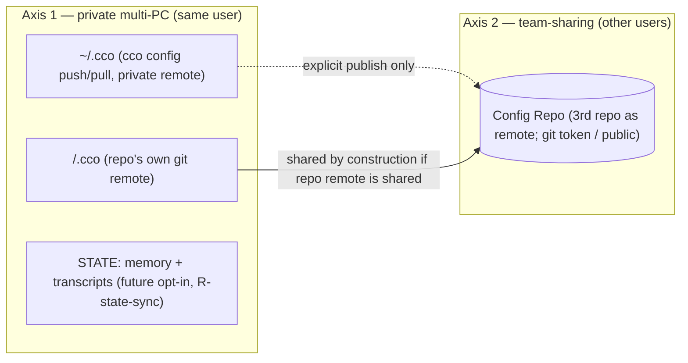

# Decentralized cco Config — Guiding Principles (Foundation)

**Status**: **Source of truth — foundational.** Fixed 2026-06-16. These principles govern the
whole "decentralized in-repo config" refactor. **Every domain analysis must validate its
decisions against this document**; a decision that clashes with a principle is a defect to
correct (in the decision or, deliberately, in the principle).
**Grounded in**: ADRs 0001–0010 (this document distills their *cross-cutting* rules; it does not
restate each ADR). See also `requirements.md`, `design.md`, `resource-coherence-inventory.md`,
`analysis-roadmap.md`.

> **Why this exists**: the resource→location mapping and the sharing/sync model were scattered
> across several ADRs and design sections, and destination was being conflated with sync. This
> document fixes the two **orthogonal** classification axes so each remaining domain analysis
> (run in its own clean session) starts from the same foundation.

---

## P1 — Config vs internal: the **edit criterion**

The primary classifier is **who edits the file and how**:

- **Config / resources** — the **user authors and edits** them, **reachable and editable from an
  IDE**. They are versioned and meaningful to the user. `secrets.env` is config too (it is
  user-edited) — merely **gitignored** because it holds secret values; it stays IDE-reachable.
- **Internal** — **cco manages** them, updated **only via the CLI**, **never hand-edited**. They
  must be **hidden** from the IDE and from accidental manual edit/delete, and **never live in a
  config repo** (neither `<repo>/.cco/` nor `~/.cco`). State, cache, indexes, registries, and any
  cco system file the user should never explicitly consult belong here.

Rule of thumb: *if the user is expected to open it in an editor → config; if only `cco …` touches
it → internal.*

## P2 — Destination taxonomy (where a resource physically lives)

| Bucket | Holds | Visibility |
|---|---|---|
| **`<repo>/.cco/`** | project config, machine-agnostic, authored (`project.yml`, `claude/`, `secrets.env` gitignored) | user-facing, in the code repo |
| **`~/.cco/`** | global resources the user **curates/authors** (`packs/`, `templates/`, `global/.claude/`, `tags.yml`) | user-facing personal store |
| **STATE** (`$XDG_STATE_HOME/cco` → `~/.local/state/cco`) | machine-local persistent **state** (index, generated compose, transcripts, memory, meta, seeds, sync-meta) | **hidden** (internal) |
| **CACHE** (`$XDG_CACHE_HOME/cco` → `~/.cache/cco`) | regenerable / re-fetchable / transient (generated overlays, Config-Repo clones, `.bak`) | **hidden** (internal) |
| **(possible 4th) internal-but-synced** | cco-managed, hidden, **not** config, but worth private multi-PC sync (candidates: TBD — remotes registry? manifest? tags?) | **hidden** (internal) — *existence + membership = domain A (T2)* |

The two config buckets (`<repo>/.cco`, `~/.cco`) hold **only** P1-config. STATE/CACHE hold **only**
P1-internal. Today there is **no** home for "internal yet privately synced" data — whether one is
needed, and what falls in it, is the open question for domain A.

## P3 — Two **orthogonal** sync axes (never conflate them)

- **Axis 1 — Private multi-PC (same user)**: move a user's own data across **their** machines.
  Transports: `~/.cco` via `cco config push/pull` (private remote); `<repo>/.cco` via the repo's
  own git remote; STATE (memory/transcripts) via a **future** opt-in (P8); a possible
  internal-but-synced bucket (P2).
- **Axis 2 — Team-sharing (different users)**: share with **other people**. Transport: **always a
  third repo acting as a remote** — a **Config Repo** (`publish`/`install`/`update`/`export`),
  access delegated to git (token for private, or public repo). Never by syncing `~/.cco` itself.

A resource's **destination (P2)** and its **sync profile** `{none | private-multi-PC | team | both}`
are independent dimensions. Classifying a resource means answering **both**.

## P4 — A resource is `(destination, sync-profile)`
Every cco-managed resource is classified on **both** axes. The consolidated mapping (domain A)
produces, for each resource: its P2 bucket **and** its P3 sync profile. Neither alone is enough.

## P5 — Sharing asymmetry (and a noted fallback)
- **`<repo>/.cco/` is team-shared *by construction*** when the repo has a shared remote — the same
  git sync serves **both** axes at once (the user's PCs *and* teammates).
- **`~/.cco` is private-only** (Axis 1). Its packs/templates reach a team **only via explicit
  publish** (Axis 2, Config Repo) — never by syncing `~/.cco`.

> **A4 fallback — solo cco adopter in a team (note for awareness; post-v1, not prioritized).**
> Use case: *a user works in a shared team repo but adopts cco alone; the team does not want
> `.cco/` committed in the repo; the user still wants their cco project config versioned and synced
> across their own PCs.* Two options to weigh in a dedicated analysis:
> - **(A)** gitignore the repo's `.cco/` — simplest, but the user loses versioning + private
>   multi-PC sync of that project config.
> - **(B)** opt-in mode where the **project's `.cco/` lives under `~/.cco` (Axis-1 synced), outside
>   the repo** — a simplified fallback reminiscent of the old central vault **but without profiles
>   or custom diff**. Enables the use case while keeping the team repo clean.
> Recorded to do justice to this user profile; decision deferred (likely domain C / a dedicated note).

## P6 — Hide internal files
Internal data (STATE, CACHE, indexes, registries, system files; P1) is **hidden** from the user,
**never in a config repo**, and only mutated through `cco …`. This protects it from accidental
edit/delete and keeps `git diff` on the config buckets truthful (G8).

## P7 — Sync mechanics
- **Sync transports already-made commits; it never fabricates them** (ADR-0008). No per-command
  network sync; `cco config push/pull` is explicit; pull non-fast-forward → abort + notify
  (resolve in the IDE).
- **Team-sharing always goes through a Config Repo** (a third repo as remote); access is delegated
  to git (token / public). `~/.cco`'s own remote is **private**.
- Within one machine, project multi-repo convergence is **sync-as-copy** (AD7), not a merge engine.

## P8 — STATE sync is a distinct, future category
`memory/` and chat transcripts are **STATE**, not config (ADR-0009). Their cross-machine /
cross-team sync is a **separate future opt-in feature (R-state-sync)** — a different *category* of
sync from the config buckets, and explicitly **not** part of the config vaults. v1 = machine-local,
no sync.

## P9 — Packaging-aware; opinionated defaults are shippable separately
No tool code lives in any data bucket (AD11); hooks invoke `cco` by PATH. cco's **opinionated
default resources** may become an **official public Config Repo**, shipped separately (relates to
R-pkg / R-update-native). The framework stays agnostic; opinionated content travels via the same
Domain-B sharing path any user would use.

---

## How to use this document
Each remaining analysis (see `analysis-roadmap.md`) runs in its **own clean session** but **opens
by reading this file**. The analysis must: (1) classify every in-scope resource on both axes (P4);
(2) check each decision against P1–P9; (3) flag and resolve any conflict with the current
`design.md`/ADRs; (4) record results in an ADR + update `design.md` and the
`resource-coherence-inventory.md`.
