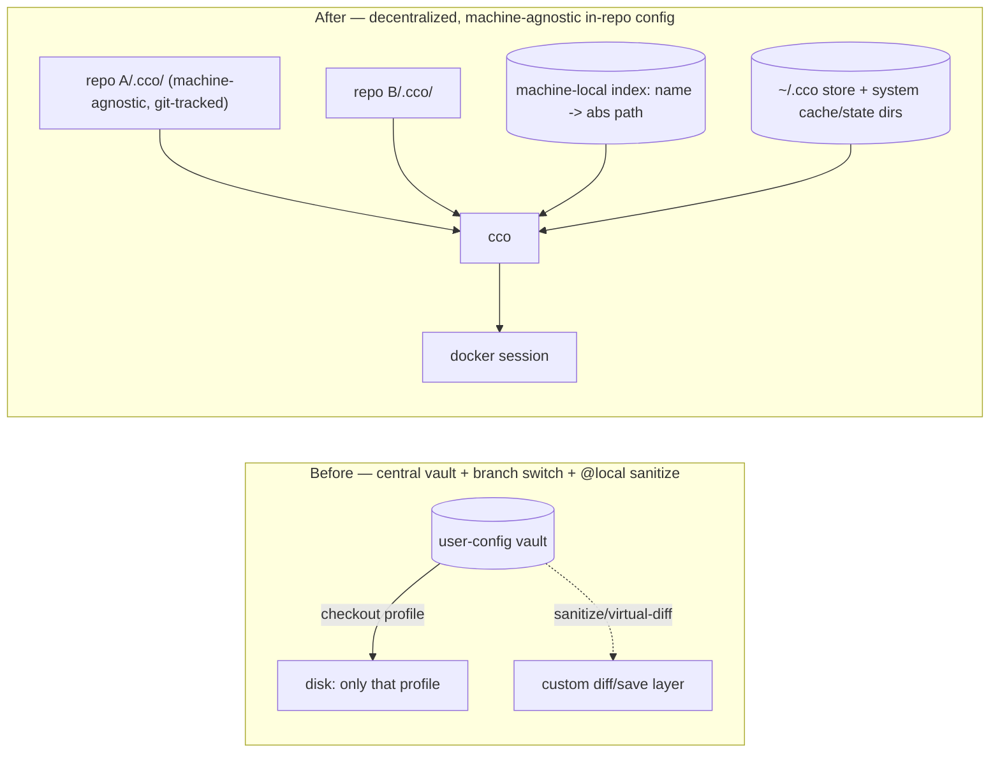

# Decentralized In-Repo Config — Requirements

**Status**: Approved for implementation (model finalized 2026-06-15). This is the
authoritative requirements document; the detailed design is in `design.md` and the
decision record in `decisions/0001-decentralized-in-repo-config.md`.
**Date**: 2026-06-15
**Supersedes**: the central git-backed vault (`user-config/` projects + branch
profiles) and `../vault/profile-isolation-design.md`. Reuses the `@local` path
contract from `../vault/local-path-resolution-design.md`.
**Decision history**: see `reviews/15-06-2026-sync-adversarial-review.md` (the
adversarial review that drove the move from a custom sync/merge engine to the
sync-as-copy model below).

---

## 1. Context & Motivation

The central vault stored all projects under `user-config/projects/<name>/` and used
git **branches as profiles**: switching profile did a `git checkout` that swapped
which projects existed on disk. This coupled two orthogonal concerns — *config
storage* and *workspace selection* — and produced a recurring structural bug class
(#B13–#B23), opaque failures, and a hard limit: only one profile's projects on disk
at a time (no concurrent cross-profile sessions).

A second, subtler source of complexity: committed config was **not** machine-neutral.
Real filesystem paths in `project.yml` were rewritten to `@local` markers on save
and back to real paths on read. Because the same committed file differed from its
on-disk form, a plain `git diff` "lied", so the vault carried a **custom diff/save**
layer (sanitize-on-save, virtual-diff, extract/restore, backup + ERR-trap) purely to
hide that discrepancy. Much of the vault's fragility lived here, not only in the
branch switch.

**Insight**: *selection* (which projects are visible) and *storage* (where config
lives) are orthogonal; and if committed config is made **100% machine-agnostic**,
plain `git` becomes a truthful, sufficient transport and the entire custom
diff/save/merge layer is unnecessary. Decentralizing storage into each repo and
removing all machine-specific data from committed files eliminates both fragility
sources at the root and aligns config with the developer's IDE workflow.



---

## 2. Goals / Non-Goals

**Goals**
- G1 — Each project's cco config lives in its own repo, versioned with the code.
- G2 — Any project is startable any time, concurrently, on the same machine.
- G3 — IDE-first: configure and run from a repo you already have open.
- G4 — Net **reduction** in framework machinery: delete the vault, the
  profile/switch layer, **and** the custom config diff/save/merge layer.
- G5 — Multi-repo agentic sessions preserved (e.g. `cave-auth` + `cave-auth-web` +
  `cave-infrastructure` in one session).
- G6 — Per-project git history for config (config commits ride with code commits).
- G7 — Structural secret-leak safety.
- G8 — **Truthful diff**: a plain `git diff` on `.cco/` always reflects real config
  changes; cco never maintains a diff view that diverges from git's.

**Non-Goals**
- N1 — A custom 3-way merge / sync-base / commit-time reconciliation engine for
  config sync. (Sync is a plain **copy** from a chosen source — see §5. A background
  daemon or git hooks are possible **future opt-in** evolutions, not in scope.)
- N2 — The monolithic vault (projects + profiles + filesystem switch + custom diff).
- N3 — Cross-team config governance beyond the existing Config Repo sharing.
- N4 — Packaging cco as an installable npm/npx artifact + image registry — a valuable
  **separate future workstream**, not part of this refactor (§9).
- N5 — Reworking the `cco update` engine. The 3-way merge engine stays **as-is** for
  framework→user template/pack updates; it is unrelated to config sync. A future
  evolution (cco fully agnostic + opinionated packs/templates distributed via native
  publish/install) is recorded in the roadmap, out of scope here (§9).

---

## 3. Agreed Architectural Decisions

| # | Decision |
|---|----------|
| **AD1** | Config is **decentralized**: `<repo>/.cco/` holds a project's committed cco config, versioned with the code. The central vault is retired. |
| **AD2** | **Profiles → tags.** No git-branch profiles, no `vault switch`. Tags are optional metadata for CLI grouping; the IDE is the project browser. |
| **AD3** | **Machine-agnostic committed config (G8).** Committed files contain **no machine-specific data** — no real paths. `project.yml` references repos and extra mounts by **logical name** only and is **byte-identical across a project's repos**. Real absolute paths live in a machine-local index outside the repo (AD5). A plain `git diff` is therefore always truthful; the custom diff/save/sanitize/virtual-diff layer is removed. |
| **AD4** | **Dual `.claude` scope** (verified: `/workspace/.claude` IS loaded at WORKDIR `/workspace`, plus nested `<repo>/.claude` on-demand). **Project/cross-repo** Claude config lives at `<repo>/.cco/claude/` → mounted `/workspace/.claude`. **Repo-local** Claude config stays at `<repo>/.claude/` → `/workspace/<repo>/.claude`, never part of project config. |
| **AD5** | **`@local` retained, resolved via a machine-local index (AD3).** The index maps `logical-name → absolute path` for repos and extra mounts, is **per-machine, never committed, never synced**, and is maintained by dedicated CLI commands (manual edit allowed but discouraged). It stores **absolute paths only**; CLI commands accept paths relative to the cwd and resolve them to absolute. The index also records `project → [member repo names]` (it subsumes the old registry). |
| **AD6** | **No privileged repo.** Any repo carrying a `.cco/` is a valid project entry point. `cco start` uses the config of the **invoking repo** (cwd) by default, or the one given by flag. The session's source is therefore always unambiguous. An optional per-project *entry* repo is only a tie-breaker for name-based `cco start <project>`. |
| **AD7** | **Sync is a plain copy (N1).** `cco sync` copies a source repo's committed `.cco/` set into target repos. No merge engine, no `sync-base`, no commit-time heuristic, no peer/root modes, no confirm/last-commit-wins policies. Works on the **same machine over the filesystem** (so it does not require repos to be git). Divergence between repos is allowed and visible; the user picks the source. |
| **AD8** | **Git is the only cross-PC transport.** A repo's `.cco/` travels on the repo's own git remote (clone/pull brings it). Concurrent cross-PC edits surface as ordinary git merge conflicts the user resolves in their IDE. No cco-specific cross-PC reconciliation. A non-git repo simply does not travel across machines (sync within a project on one machine still works — AD7). |
| **AD9** | **Config / state / cache are separated by location.** The committed `<repo>/.cco/` holds **only** machine-agnostic user config. Machine/runtime **state** (generated compose, claude-state, the local-path index, temp) and **cache** (llms, installed resources) live in **system directories outside the repo**, hidden from the user. `secrets.env` is the one exception that stays in the repo (gitignored) because the user edits it by hand. Exact filesystem locations: see open question RD-paths. |
| **AD10** | A central **`~/.cco/`** holds the user's **global resources** (authored packs, templates, global `.claude`) as a personal git store, plus references. Two strictly-separated sync domains: **A** personal multi-PC (the user's own `~/.cco` + per-repo git) and **B** team/external sharing (Config Repos publish/install — unchanged). `~/.cco` management (incl. auto-management) is **deferred to a dedicated analysis** (RD-home). |
| **AD11** | cco may later be distributed as an installable package (npm/npx) + image registry. **This design stays packaging-aware**: no tool code in any `.cco/`, no requirement to clone the cco source to run; hooks (if any) invoke `cco` by PATH. Detailed packaging design is a separate workstream (§9). |
| **AD12** | **Migration is one-time, interactive, backed-up.** `cco vault migrate` maps each legacy vault project onto physical repos, writes machine-agnostic `.cco/`, builds the index, archives the vault. Dual-read keeps the legacy layout readable for 1–2 releases. |

---

## 4. `.cco/` Structure & Secret Safety (FR-S)

The committed `<repo>/.cco/` contains only machine-agnostic user config. All
machine/runtime state and cache live outside the repo (AD9).

```
<repo>/
├── .claude/                  # COMMITTED, repo root — REPO-LOCAL Claude config
│                             #   → /workspace/<repo>/.claude  (project-independent)
├── .cco/                     # COMMITTED — machine-agnostic project config
│   ├── .gitignore            #   ignores secrets.env (+ secret patterns)
│   ├── project.yml           #   logical names only, NO real paths, identical across repos
│   ├── secrets.env.example   #   committed skeleton (no real values)
│   ├── secrets.env           #   GITIGNORED — real values, user-edited (the one in-repo exception)
│   └── claude/               #   PROJECT/cross-repo Claude config → /workspace/.claude
│       └── CLAUDE.md, rules/, agents/, skills/
└── (no state/, no cache/, no local-paths in the repo — see system dirs below)
```

State/cache/index live in system directories (AD9; exact paths = RD-paths):
```
<state-dir>/cco/projects/<id>/   # generated docker-compose, claude-state, .tmp, meta
<state-dir>/cco/index            # machine-local name→abs-path + project→repos index (AD5)
<cache-dir>/cco/                 # llms, installed resources
~/.cco/                          # personal git store: packs/, templates/, global/.claude/  (AD10)
```

- **FR-S1** — All committed cco config is under `<repo>/.cco/` (plus the repo-root
  `<repo>/.claude/` repo-local Claude config). No machine state is committed.
- **FR-S2** — Because runtime **state lives outside the repo entirely** (AD9), a
  secret cannot structurally end up in a committed state directory. The only
  in-repo secret file is `secrets.env`, blanket-gitignored.
- **FR-S3** — Defense-in-depth: secret patterns (`secrets.env`, `*.env`, `*.key`,
  `*.pem`, `.credentials.json`) in `.gitignore` **and** a pre-commit/pre-push scan
  reusing `lib/secrets.sh`. The scan MUST exempt `*.example` files from the
  **content** check (a skeleton documents `API_KEY=…` by design) and MUST keep
  `secrets.env.example` stageable while refusing `secrets.env`.
- **FR-S4** — `secrets.env.example` (committed, no values) documents required vars;
  `secrets.env` (gitignored, in-repo) holds real values, copy-if-missing.
- **FR-S5** — Path helpers (`lib/paths.sh`) gain the new locations with dual-read
  fallback to the legacy flat `.cco/` layout during the deprecation window;
  precedence when both exist must be explicit.

---

## 5. Machine-Agnostic Config, Local Paths & Sync (FR-Y)

### 5.1 Machine-agnostic config (FR-Y-A)
- **FR-Y-A1** — `project.yml` lists **all** member repos and extra mounts by
  **logical name**; no real paths; no implicit-host rewriting. It is identical in
  every repo of the project, so `git diff` is truthful (G8, AD3).
- **FR-Y-A2** — The machine-local index (AD5) resolves logical names to absolute
  paths at consumption time (`cco start`). It is never committed/synced.
- **FR-Y-A3** — Dedicated CLI maintains the index: resolve on first use, update when
  the user moves directories, when external projects are installed, or on
  divergence. Manual edit of the index file remains an escape hatch (discouraged).
  Commands accept relative paths (resolved to absolute); the file stores absolute.

### 5.2 Sync = copy (FR-Y-S)
Sync keeps a project's committed `.cco/` set identical across its repos by
**copying** from a chosen source. The synced set is `project.yml` + `claude/**`
(+ `secrets.env.example`). **Never**: `secrets.env`, the repo-root `.claude/`, or
anything in system dirs.

Command forms (positional arg = **target**, `--from` = **source**; default source =
current repo):

| Command | Source | Targets |
|---------|--------|---------|
| `cco sync` | current repo | all repos in `project.yml` |
| `cco sync <repo>` | current repo | only `<repo>` |
| `cco sync --from <repo>` | `<repo>` | all repos in `project.yml` |
| `cco sync <repoA> --from <repoB>` | `<repoB>` | only `<repoA>` |

- **FR-Y-S1** — Sync is a filesystem copy (AD7); it does **not** require repos to be
  git and does not use git history/commit-time.
- **FR-Y-S2** — Sync is **optional**. A project may run with no sync and
  deliberately divergent repo configs (Case C below). Divergence is allowed and
  visible; `cco start` always uses an unambiguous source (AD6).
- **FR-Y-S3** — By default sync shows a **truthful diff and asks for confirmation**;
  `--auto-approve` (or equivalent) skips the prompt. `--dry-run` previews without
  writing. *(Snapshot/rollback and user-vs-sync change detection — see RD-syncmeta.)*
- **FR-Y-S4** — A repo without `.cco/` is a code-only member (Case A): it is a valid
  target of sync (gains a copy) but cannot be a start source.

### 5.3 Supported cases (project repo1 + repo2 + repo3)
- **Case A — single-config, no copies.** `cco init` only in repo1; sync off. repo2/3
  are listed in repo1's `project.yml` and mounted as **code only** (no `.cco/`).
  `cco start` runs from repo1.
- **Case B — synced copies.** `cco init` repo1, add repo2/3 as members; `cco sync`
  gives repo2/3 a copy of `.cco/`. `cco start` uses the invoking repo's `.cco`
  (or `--from`); if copies diverge it is always clear which was used; sync anytime.
- **Case C — intentional divergence.** `cco init` in all three with **different**
  `.cco/`; sync off. Repos diverge by design; `cco start` uses the invoking repo's
  config; running `cco sync` at any time converges to Case B.

```mermaid
flowchart TD
  U["cco sync [target] [--from source]"] --> SRC["pick source (default: cwd)"]
  SRC --> D{diff vs targets}
  D -->|no change| NOOP[no-op]
  D -->|change| C{confirm? (unless --auto-approve)}
  C -->|yes| CP["copy source .cco -> targets"]
  C -->|no| ABORT[abort, nothing written]
```

---

## 6. Central Store `~/.cco` & Domains (FR-C) — depth deferred

- **FR-C1** — `~/.cco/` holds the user's **global resources**: authored `packs/`,
  `templates/`, and `global/.claude/`. It is a personal git store (Domain A).
- **FR-C2** — The machine-local index (AD5) is the source for `cco list` and tag
  filtering; it lives in a system dir, is per-machine, and is rebuildable by scanning
  known directories (`cco index refresh --scan`) so a fresh machine can repopulate.
- **FR-C3 (Domain A)** — Personal multi-PC: per-repo `.cco/` rides each repo's own
  remote; `~/.cco` global resources sync via the personal store. **Auto-management,
  conflict handling, and the exact mechanism are deferred to a dedicated analysis
  (RD-home).** Whatever the mechanism, it MUST commit via an **explicit allowlist**
  (`packs/ templates/ global/.claude/`), never `git add -A`, so machine-specific or
  secret files can never be pushed.
- **FR-C4 (Domain B)** — Team/external sharing via Config Repos
  (`publish`/`install`/`update`/`export`) is **unchanged**. Authoring of global
  resources happens directly in `~/.cco` (opened in an IDE when working at global
  scope), or via publish/install for shared resources — see RD-authoring.

---

## 7. Migration & Constraints

- **FR-M1** — `cco vault migrate` (interactive, idempotent, backed-up): maps each
  legacy vault project onto physical repo(s), writes machine-agnostic `.cco/`, builds
  the index, archives the vault to `~/.cco/backups/vault-<date>.tar.gz`. Re-runs skip
  already-migrated projects and never overwrite an existing `.cco/` without confirm.
- **FR-M2** — Deprecation window: legacy `user-config/` and the flat `.cco/` layout
  remain readable for 1–2 releases via dual-read; a boot warning points to migrate.
- **C1** — bash 3.2 compatibility (macOS default) — no bash-4 constructs.
- **C2** — `.claude/` must remain at the repo root (Claude Code native).
- **C3** — Repos may be plain directories (not git). The model must not assume git
  for core operation; git is required only to enable cross-PC travel/sync (opt-in).
- **C4** — Teardown removes the vault profile/switch/shadow machinery **and** the
  custom config diff/save/sanitize/virtual-diff layer; reused: `@local` resolution,
  secret-scan, gitignore-heal. The 3-way merge engine is **kept** for `cco update`.

---

## 8. Decisions & Open Questions

**Decided (2026-06-15):**
| # | Decision |
|---|----------|
| Machine-agnostic committed config (AD3, G8) | ✅ no real paths in committed files; `git diff` truthful |
| Global machine-local index for paths (AD5) | ✅ absolute paths, CLI-managed, subsumes registry |
| No privileged repo; cwd is the start source (AD6) | ✅ entry repo only a name-based tie-breaker |
| Sync = copy, 4 command forms (AD7, §5.2) | ✅ no merge engine / sync-base / commit-time / peer-root / confirm-LCW policies |
| Git is the only cross-PC transport (AD8) | ✅ conflicts resolved natively in IDE |
| Config/state/cache separated by location (AD9) | ✅ state+cache out of repo; `secrets.env` the in-repo exception |
| Vault removed; `project create` removed | ✅ surface = `cco init` + `cco sync` + `cco start` + global-store mgmt + existing publish/install/remote/pack/llms/update |
| Sync default = diff + confirm; `--auto-approve` | ✅ (snapshot/rollback = RD-syncmeta) |
| Merge engine stays for `cco update` only (N5) | ✅ |

**Open — deferred to dedicated analyses (run after this design is persisted):**
| # | Question |
|---|----------|
| **RD-syncmeta** | Should sync keep a last-synced snapshot for fast rollback and to distinguish user edits vs cco-sync edits (and surface divergence before `cco start`)? Internal-only metadata; evaluate UX benefit vs complexity. |
| **RD-home** | `~/.cco` management depth: auto-management (pull-before-read / commit+push-after-write) feasibility, conflict handling, allowlist enforcement, manual vs managed modes. |
| **RD-authoring** | How users author global packs/templates (direct `~/.cco` edit vs authoring-in-repo + promote). Lean: `~/.cco` is a personal repo opened directly at global scope. |
| **RD-paths** | Exact filesystem locations for state/cache/index on macOS & Linux (XDG-style per-user `~/.local/state`, `~/.cache`, `~/.config` vs other). Avoid cluttering the home dir; per-user not root. |
| **RD-memory** | `memory/` handling: per-machine vs committed-in-repo vs team-shared. Teams may want shared memory for project state/decisions; others may not want it committed. |
| **RD-triggers** | Future opt-in auto-sync: background daemon and/or native hooks in select cco commands vs opt-in git hooks vs manual-only. Manual-only is the v1 default. |
| **RD-claude-mount** | Phase-0: how the single `/workspace/.claude` mount (cwd repo's `.cco/claude/`) coexists with pack-injected files in the same tree (`lib/packs.sh`); verify no bind-mount shadowing. |

---

## 9. Impact / Supersession & Future Workstreams

- Supersedes the central-vault project store and `../vault/profile-isolation-design.md`;
  reuses `../vault/local-path-resolution-design.md` (`@local`).
- Roadmap: update the "Vault Simplification" entry to **decentralized in-repo config
  (sync-as-copy)**; mark vault profile/switch and custom-diff items removed.

**Separate roadmap items (NOT in this refactor's scope):**
- **R-pkg** — Distribute cco as npm/npx + container image (AD11, N4).
- **R-update-native** — Evolve `cco update`: make cco fully agnostic and distribute
  opinionated packs/project-templates via native publish/install (like any user),
  keeping a `cco update` for installed packs (merge local edits vs replace/discard).
  Recorded now so it is not forgotten; designed separately (N5).
- **R-workspace** — Persistent `/workspace` root.

**Next artifacts:** `design.md` (detailed design, authoritative for implementation)
and ADR `0001` (decision record). Dedicated analyses for the RD-* open questions.
