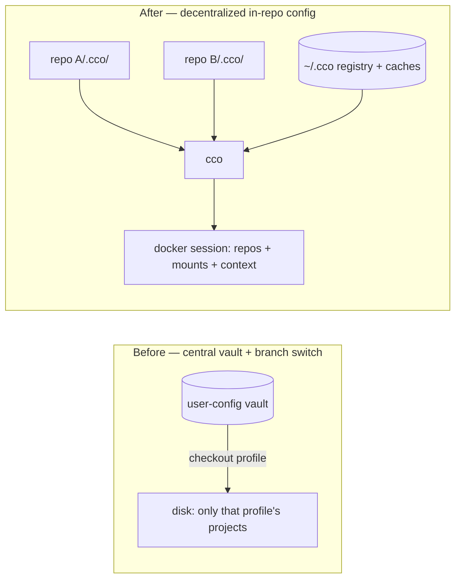
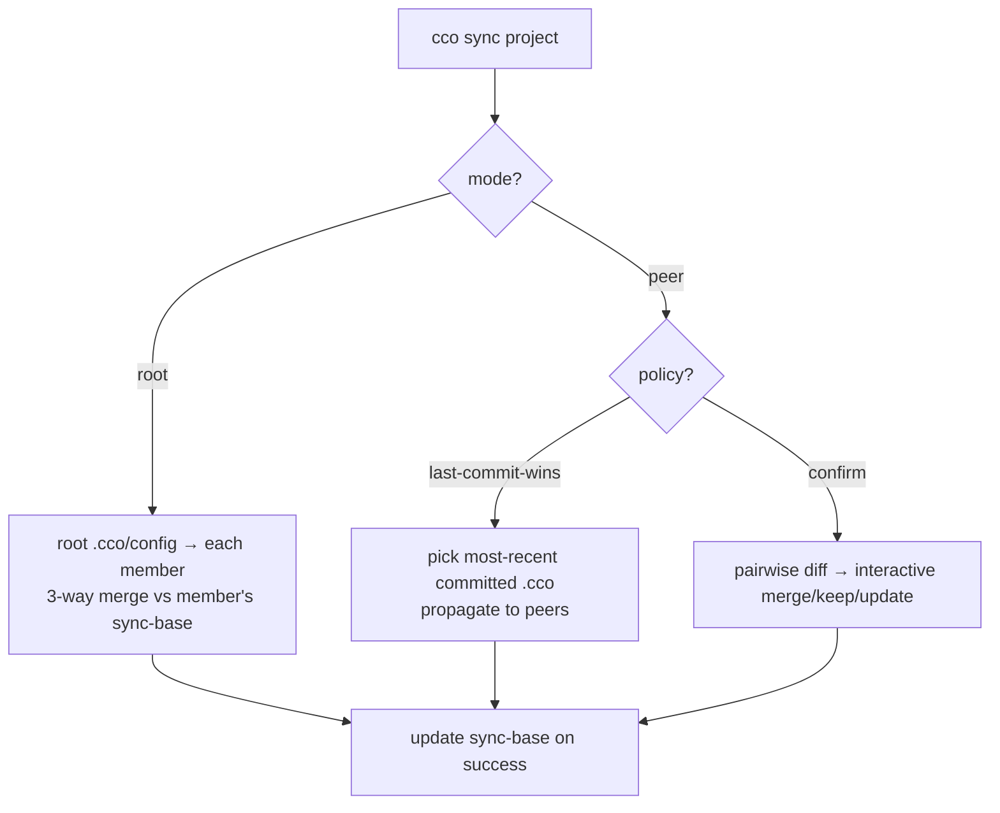

# Decentralized In-Repo Config — Requirements

**Status**: Draft — requirements converged, pending residual decisions (§8)
**Date**: 2026-06-12
**Supersedes**: `../vault/profile-isolation-design.md` (branch-switch real isolation)
and the central-vault project store. Reuses `../vault/local-path-resolution-design.md`
(the `@local` contract).
**Source**: two analyst waves (teardown, `.cco/` classification, central registry,
`@local` reuse, sync engine, migration/sharing). Roadmap entry: "Vault Simplification".

> This document captures the **requirements and agreed architectural decisions**
> for moving claude-orchestrator from a central git-backed vault to a
> **decentralized, in-repo configuration** model. The detailed design lives in
> `design.md`; the decision record in `decisions/`.

---

## 1. Context & Motivation

The central vault stores all projects under `user-config/projects/<name>/` and uses
git **branches as profiles**; switching profile = `git checkout` that swaps which
projects exist on disk. This coupling of *config storage* and *workspace selection*
produced a recurring bug class (#B13–#B23) and a hard UX limit: projects from
different profiles cannot run concurrently on one machine.

The developer's tool is the IDE; the vault forces a constant IDE↔terminal↔vault
context switch, and config is versioned separately from the code it configures.

**Insight**: *selection* (which projects are visible) and *storage* (where config
lives) are orthogonal. Decentralizing storage into each repo removes the entire
fragile switch machinery and aligns config with the developer's IDE workflow.



---

## 2. Goals / Non-Goals

**Goals**
- G1 — Each project's cco config lives in its own repo, versioned with the code.
- G2 — Any project is startable any time, concurrently, on the same machine.
- G3 — IDE-first: configure and run from the repo you already have open.
- G4 — Net **reduction** in framework machinery (delete the vault/profile/switch layer).
- G5 — Multi-repo agentic sessions preserved (e.g. `cave-auth` + `cave-auth-web` +
  `cave-infrastructure` in one session).
- G6 — Per-project git history for config (config commits ride with code commits).
- G7 — Structural secret-leak safety.

**Non-Goals**
- N1 — A live/continuous config sync daemon (sync is explicit, on-demand).
- N2 — Preserving the "one `vault pull` syncs everything across PCs" workflow
  (replaced by per-repo git remotes + `~/.cco` caches; see §6).
- N3 — Cross-team config governance beyond the existing Config Repo sharing.

---

## 3. Agreed Architectural Decisions

| # | Decision |
|---|----------|
| **AD1** | Config is **decentralized**: `<repo>/.cco/` holds a project's cco config, versioned with the code. The central vault is retired. |
| **AD2** | **Profiles → tags.** No git-branch profiles, no `vault switch`. Tags are optional metadata for CLI grouping; the IDE is the project browser. |
| **AD3** | `.cco/` is internally **split by subdirectory**: committed config vs gitignored state/secrets (see §4). |
| **AD4** | Project-level `.claude/` **stays at the repo root** (Claude Code reads it natively from `/workspace/.claude`). It is committed and part of the synced set. `.cco/` holds cco-specific config only. |
| **AD5** | The `@local` path contract is **retained and reused** (~13/18 `local-paths.sh` functions unchanged). Committed `project.yml` is identical across a project's repos (all `@local`); real paths live in a **per-repo, gitignored, never-synced** `local-paths.yml`. |
| **AD6** | The host repo (the one holding `.cco/`) is the **implicit** primary at path `.`; only *sibling* repos appear in `repos[]`. |
| **AD7** | A central **`~/.cco/`** keeps: a project **registry** (name → repo paths, tags, sync metadata), shared **caches** (packs, templates, llms), global config, and remotes. |
| **AD8** | Multi-repo config **sync is explicit and on-demand**, dual-mode (root / rootless-policy), and **reuses the existing 3-way merge engine** with a committed `sync-base/` snapshot (see §5). |
| **AD9** | Migration from the vault is a **one-time, interactive, backed-up** operation; the vault is removable afterward. |

---

## 4. `.cco/` Structure & Secret Safety (FR-S)

```
<repo>/
├── .claude/                 # COMMITTED, repo root — Claude Code native (rules, agents, skills, CLAUDE.md)
├── .cco/
│   ├── .gitignore           # blanket-ignores state/ and secrets/
│   ├── config/              # COMMITTED — cco config the user edits
│   │   ├── project.yml
│   │   └── secrets.env.example
│   ├── tracked/             # COMMITTED — framework bookkeeping (not user-edited)
│   │   ├── base/            #   update-system 3-way merge ancestor
│   │   ├── sync-base/       #   cross-repo sync 3-way ancestor
│   │   ├── source
│   │   └── source-url
│   ├── state/               # GITIGNORED (blanket) — machine/runtime
│   │   ├── meta
│   │   ├── docker-compose.yml
│   │   ├── managed/
│   │   ├── claude-state/
│   │   ├── local-paths.yml
│   │   └── .tmp/
│   └── secrets/             # GITIGNORED (blanket)
│       └── secrets.env
└── memory/                  # see §8 residual decision (default: gitignored, per-machine)
```

- **FR-S1** — All cco config under `.cco/`; committed content confined to
  `.cco/config/` and `.cco/tracked/`. The repo-root `.claude/` is the only
  committed cco-related content outside `.cco/` (Claude Code constraint, AD4).
- **FR-S2** — `state/` and `secrets/` are **blanket-gitignored**; a secret cannot
  structurally sit inside a committed directory.
- **FR-S3** — Defense-in-depth: explicit secret patterns (`secrets.env`, `*.env`,
  `*.key`, `*.pem`, `.credentials.json`) in `.gitignore` **and** a pre-commit/
  pre-push scan reusing `lib/secrets.sh` patterns; staging anything under
  `.cco/state/` or `.cco/secrets/` is refused.
- **FR-S4** — `secrets.env.example` (committed, no real values) documents required
  vars; `secrets.env` (gitignored) holds real values, copy-if-missing.
- **FR-S5** — Path helpers (`lib/paths.sh`) gain the new subdir locations with
  dual-read fallback to today's flat `.cco/` layout (backward compatible).

---

## 5. Sync Requirements (FR-Y)

- **FR-Y1** — Sync operates **only** on the committed config set:
  `.claude/**` (tracked subset) + `.cco/config/project.yml` +
  `.cco/tracked/{source,source-url}`. Never secrets, `state/`, `local-paths.yml`,
  or `memory/`.
- **FR-Y2** — Sync **reuses the existing engine**: `_merge_file`,
  `_resolve_with_merge` (merge/edit/replace/keep/skip), `_interactive_sync`,
  `_file_hash`, `_save_base_version` — no new merge logic.
- **FR-Y3** — A committed **`sync-base/`** snapshot provides the common ancestor for
  3-way merge across syncs (analogous to `base/`). Updated only on successful sync.
- **FR-Y4** — **Dual mode**, selected per project in `project.yml`:
  - *root*: `sync: {mode: root, root: <repo>, members: [...]}` → root → members.
  - *peer*: `sync: {mode: peer, policy: last-commit-wins | confirm, peers: [...]}`.
    `last-commit-wins` propagates the most-recent committed `.cco` config;
    `confirm` detects divergence and resolves interactively via the merge engine.
- **FR-Y5** — Commands: `cco sync <project>` with `--dry-run`, `--check`
  (exit-code only), `--force`; `cco init --sync <project>` to associate a repo.
- **FR-Y6** — Siblings located via `~/.cco` registry + per-repo `local-paths.yml`.
  Unmounted sibling → skipped with warning; sibling on another branch → read via
  `git show <branch>:…` without checkout.
- **FR-Y7** — Idempotent: re-running with no new commits is a no-op (exit 0).
  `sync-base/` is updated only on success, never on skip/conflict.
- **FR-Y8** — No pre-commit auto-sync by default (loop risk); an opt-in pre-push
  `--check` is permitted.



---

## 6. Central Store, Registry & Sharing (FR-C)

- **FR-C1** — `~/.cco/` holds: `registry.yml` (project → repo paths, tags, sync
  metadata), `packs/`, `templates/`, `llms/` caches, `global/` config, `remotes`.
- **FR-C2** — `registry.yml` is the source for `cco list` and tag filtering
  (`cco list --tag <t>`); kept fresh on `init`/`start`/`create`/`delete`; stale
  entries (missing repos) flagged, prunable via a refresh.
- **FR-C3** — Sharing is **unchanged in spirit**: packs/templates published to and
  installed from external Config Repos; `~/.cco` is the local cache.
- **FR-C4** — Cross-project reuse: a pack/template made in one repo can be exported
  to the `~/.cco` cache and installed into another (copy `~/.cco` → `<repo>/.cco`),
  via the existing pack export/install primitives.
- **FR-C5** — Multi-PC config travel is per-repo: clone the repo (config comes with
  it) + resolve `@local` siblings; shared packs via `~/.cco`/Config Repos; secrets
  re-entered per machine (never in git).

---

## 7. Migration & Constraints

- **FR-M1** — `cco vault migrate` (or `cco init --migrate <legacy-project>`):
  interactively maps each vault project (known only by `@local` refs) onto a
  physical repo, copies config into `<repo>/.cco/`, registers it. Multi-repo
  projects designate a primary/root repo.
- **FR-M2** — One-time archive of the vault to `~/.cco/backups/vault-<date>.tar.gz`
  before retirement (no data loss; git history preserved in the archive).
- **FR-M3** — Deprecation window: legacy `user-config/` remains readable for 1–2
  releases via dual-read; a boot warning points to `cco vault migrate`.
- **C1** — bash 3.2 compatibility (macOS default) — no bash-4 constructs.
- **C2** — `.claude/` must remain at the repo root (Claude Code native).
- **C3** — Teardown removes ~60% of `cmd-vault.sh` (~1900 del + ~360 transform) and
  all of `test_vault_profiles.sh`; reused: `@local`, secret-scan, gitignore-heal,
  legacy-path normalization.

---

## 8. Residual Decisions (need sign-off)

| # | Decision | Recommendation |
|---|----------|----------------|
| **RD1** | `memory/` handling without the vault | **Gitignored per-machine** by default (personal session memory); opt-in to commit per-repo. |
| **RD2** | Default sync mode for a new multi-repo project | `peer` + `confirm` (safest); `root` opt-in. |
| **RD3** | `sync-base/` committed disk cost (a config snapshot per repo) | Accept (small, <~MB); document `cco clean` reset. |
| **RD4** | `cco update` integration — should it offer sibling sync? | Defer to design.md; lean yes as a prompt, not automatic. |

---

## 9. Impact / Supersession

- Supersedes `../vault/profile-isolation-design.md` and the central-vault project
  store; reuses `../vault/local-path-resolution-design.md`.
- Roadmap: update the "Vault Simplification" entry from "single filesystem + tags"
  to **decentralized in-repo config**; mark vault profile/switch items removed.
- Next artifacts: `design.md` (detailed design) and an ADR recording the decision
  and its rationale/alternatives.
