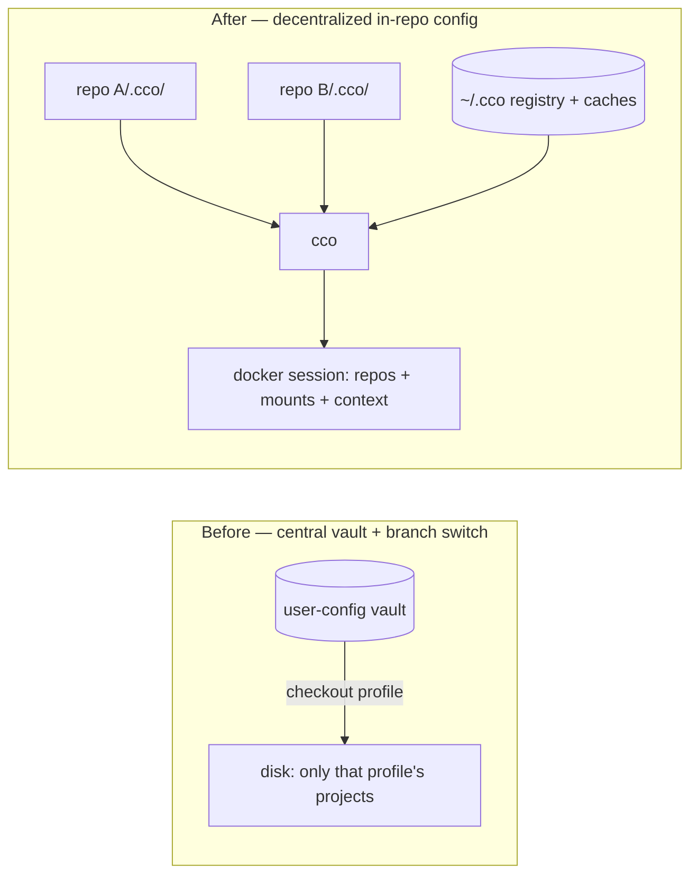
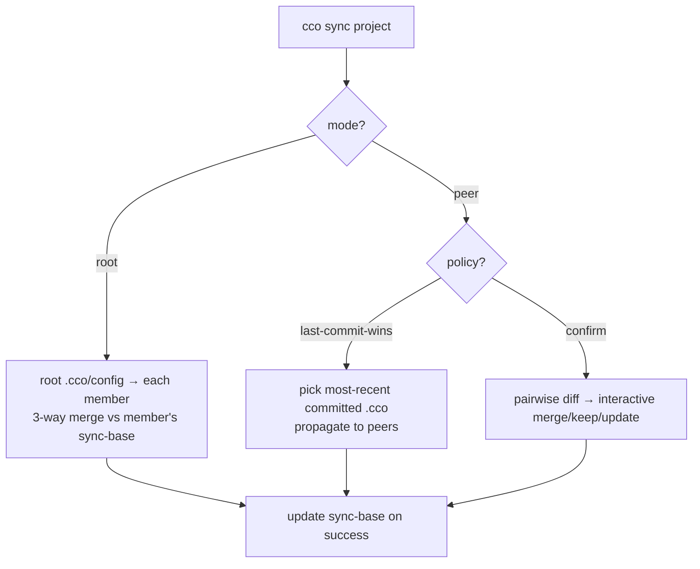

# Decentralized In-Repo Config — Requirements

**Status**: Draft — converged across three analyst waves; awaiting final sign-off (§8: RD1/RD2 decided, open design questions remain for `design.md`)
**Date**: 2026-06-12
**Supersedes**: `../vault/profile-isolation-design.md` (branch-switch real isolation)
and the central-vault project store. Reuses `../vault/local-path-resolution-design.md`
(the `@local` contract).
**Source**: two analyst waves (teardown, `.cco/` classification, central registry,
`@local` reuse, sync engine, migration/sharing). Roadmap entry: "Vault Simplification".

> This document captures the **requirements and agreed architectural decisions**
> for moving claude-orchestrator from a central git-backed vault to a
> **decentralized, in-repo configuration** model. The detailed design lives in
> `design.md`; the decision record in `decisions/`.

---

## 1. Context & Motivation

The central vault stores all projects under `user-config/projects/<name>/` and uses
git **branches as profiles**; switching profile = `git checkout` that swaps which
projects exist on disk. This coupling of *config storage* and *workspace selection*
produced a recurring bug class (#B13–#B23) and a hard UX limit: projects from
different profiles cannot run concurrently on one machine.

The developer's tool is the IDE; the vault forces a constant IDE↔terminal↔vault
context switch, and config is versioned separately from the code it configures.

**Insight**: *selection* (which projects are visible) and *storage* (where config
lives) are orthogonal. Decentralizing storage into each repo removes the entire
fragile switch machinery and aligns config with the developer's IDE workflow.



---

## 2. Goals / Non-Goals

**Goals**
- G1 — Each project's cco config lives in its own repo, versioned with the code.
- G2 — Any project is startable any time, concurrently, on the same machine.
- G3 — IDE-first: configure and run from the repo you already have open.
- G4 — Net **reduction** in framework machinery (delete the vault/profile/switch layer).
- G5 — Multi-repo agentic sessions preserved (e.g. `cave-auth` + `cave-auth-web` +
  `cave-infrastructure` in one session).
- G6 — Per-project git history for config (config commits ride with code commits).
- G7 — Structural secret-leak safety.

**Non-Goals**
- N1 — A real-time file-watcher syncing on every keystroke. (Event-driven
  triggers — git hooks, a lightweight daemon, or auto-on-`cco`-command — ARE in
  scope as a design question; see §5/RD9, to prevent forgotten syncs and incoherent
  `.cco` across a project's repos.)
- N2 — The monolithic vault that stores projects + profiles + switches the
  filesystem. (Personal multi-PC sync *survives* in slim form — see §6, Domain A.)
- N3 — Cross-team config governance beyond the existing Config Repo sharing.
- N4 — Packaging cco as an installable npm/npx artifact + image registry — a
  valuable **separate future workstream**, not part of this refactor (see §9).

---

## 3. Agreed Architectural Decisions

| # | Decision |
|---|----------|
| **AD1** | Config is **decentralized**: `<repo>/.cco/` holds a project's cco config, versioned with the code. The central vault is retired. |
| **AD2** | **Profiles → tags.** No git-branch profiles, no `vault switch`. Tags are optional metadata for CLI grouping; the IDE is the project browser. |
| **AD3** | `.cco/` is internally **split by subdirectory**: committed config vs gitignored state/secrets (see §4). |
| **AD4** | **Dual `.claude` scope** (verified: `/workspace/.claude` IS loaded by Claude Code at WORKDIR `/workspace`, plus nested `<repo>/.claude` on-demand — `cmd-start.sh:454`, `Dockerfile:125`, code-claude llms). **Project/cross-repo** Claude config lives at `<repo>/.cco/claude/` → mounted `/workspace/.claude`, committed **and synced**. **Repo-local** Claude config stays at `<repo>/.claude/` → `/workspace/<repo>/.claude`, committed in that repo, **not synced**. No duplication of cross-repo resources into each repo is needed. |
| **AD5** | The `@local` path contract is **retained and reused** (~13/18 `local-paths.sh` functions unchanged). Committed `project.yml` is identical across a project's repos (all `@local`); real paths live in a **per-repo, gitignored, never-synced** `local-paths.yml`. |
| **AD6** | The host repo (the one holding `.cco/`) is the **implicit** primary at path `.`; only *sibling* repos appear in `repos[]`. |
| **AD7** | A central **`~/.cco/`** keeps: a project **registry** (name → repo paths, tags, sync metadata), shared **caches** (packs, templates, llms), global config, and remotes. |
| **AD8** | Multi-repo config **sync is explicit and on-demand**, dual-mode (root / rootless-policy), and **reuses the existing 3-way merge engine** with a committed `sync-base/` snapshot (see §5). |
| **AD9** | Migration from the vault is a **one-time, interactive, backed-up** operation; the vault is removable afterward. |
| **AD10** | **Two sync domains, kept strictly separate** (§6): (A) **personal multi-PC** sync of the user's own config; (B) **team/external sharing** via Config Repos (publish/install — audited unchanged). Within A, per-repo `.cco` is **user-managed** (explicit, versioned with code) while `~/.cco` is **cco-managed** (automatic, best-effort) to avoid manual central-repo handling. |
| **AD11** | cco may later be distributed as an installable package (npm/npx) + image registry so users need not clone the source — detailed design is a **separate next-sprint workstream** (§9). **This design stays packaging-aware**: file/service organization must not preclude that distribution. |

---

## 4. `.cco/` Structure & Secret Safety (FR-S)

```
<repo>/
├── .claude/                 # COMMITTED, repo root — REPO-LOCAL Claude config -> /workspace/<repo>/.claude (NOT synced)
├── .cco/
│   ├── .gitignore           # blanket-ignores state/ and secrets/
│   ├── config/              # COMMITTED — cco config the user edits
│   │   ├── project.yml
│   │   └── secrets.env.example
│   ├── claude/              # COMMITTED + SYNCED — PROJECT/cross-repo Claude config -> /workspace/.claude
│   │   ├── CLAUDE.md
│   │   ├── rules/  agents/  skills/
│   ├── tracked/             # COMMITTED — framework bookkeeping (not user-edited)
│   │   ├── base/            #   update-system 3-way merge ancestor
│   │   ├── sync-base/       #   cross-repo sync 3-way ancestor
│   │   ├── source
│   │   └── source-url
│   ├── state/               # GITIGNORED (blanket) — machine/runtime
│   │   ├── meta
│   │   ├── docker-compose.yml
│   │   ├── managed/
│   │   ├── claude-state/
│   │   ├── local-paths.yml
│   │   └── .tmp/
│   └── secrets/             # GITIGNORED (blanket)
│       └── secrets.env
└── memory/                  # see §8 residual decision (default: gitignored, per-machine)
```

- **FR-S1** — All cco config under `.cco/`; committed content confined to
  the committed subtree(s) and `.cco/tracked/`. *(Open: `project.yml` at
  `.cco/project.yml` for entry-point discoverability vs under a `.cco/config/`
  subdir for grouping/secret-safety — RD10.)* The repo-root `.claude/`
  (repo-local Claude config) is the only committed Claude-related content outside
  `.cco/` (Claude Code native; repo-scoped, not synced — AD4).
- **FR-S2** — `state/` and `secrets/` are **blanket-gitignored**; a secret cannot
  structurally sit inside a committed directory.
- **FR-S3** — Defense-in-depth: explicit secret patterns (`secrets.env`, `*.env`,
  `*.key`, `*.pem`, `.credentials.json`) in `.gitignore` **and** a pre-commit/
  pre-push scan reusing `lib/secrets.sh` patterns; staging anything under
  `.cco/state/` or `.cco/secrets/` is refused.
- **FR-S4** — `secrets.env.example` (committed, no real values) documents required
  vars; `secrets.env` (gitignored) holds real values, copy-if-missing.
- **FR-S5** — Path helpers (`lib/paths.sh`) gain the new subdir locations with
  dual-read fallback to today's flat `.cco/` layout (backward compatible).

---

## 5. Sync Requirements (FR-Y)

- **FR-Y1** — Sync operates **only** on the project's committed config set:
  `.cco/config/project.yml` + `.cco/claude/**` (project/cross-repo Claude config)
  + `.cco/tracked/{source,source-url}`. **Never** the repo-local root `.claude/`,
  secrets, `state/`, `local-paths.yml`, or `memory/`.
- **FR-Y2** — Sync **reuses the existing engine**: `_merge_file`,
  `_resolve_with_merge` (merge/edit/replace/keep/skip), `_interactive_sync`,
  `_file_hash`, `_save_base_version` — no new merge logic.
- **FR-Y3** — A committed **`sync-base/`** snapshot provides the common ancestor for
  3-way merge across syncs (analogous to `base/`). Updated only on successful sync.
- **FR-Y4** — **Dual mode**, selected per project in `project.yml`:
  - *root*: `sync: {mode: root, root: <repo>, members: [...]}` → root → members.
  - *peer*: `sync: {mode: peer, policy: last-commit-wins | confirm, peers: [...]}`.
    `last-commit-wins` propagates the most-recent committed `.cco` config;
    `confirm` detects divergence and resolves interactively via the merge engine.
- **FR-Y5** — Commands: `cco sync <project>` with `--dry-run`, `--check`
  (exit-code only), `--force`; `cco init --sync <project>` to associate a repo.
- **FR-Y6** — Siblings located via `~/.cco` registry + per-repo `local-paths.yml`.
  Unmounted sibling → skipped with warning; sibling on another branch → read via
  `git show <branch>:…` without checkout.
- **FR-Y7** — Idempotent: re-running with no new commits is a no-op (exit 0).
  `sync-base/` is updated only on success, never on skip/conflict.
- **FR-Y8** — Auto-sync triggers must avoid loops; any hook/daemon trigger is
  guarded against re-entrancy.
- **FR-Y9 (trigger & coherence)** — The sync **trigger** for per-repo `.cco`
  (manual `cco sync` vs git hooks pre-commit/pre-push vs a lightweight daemon vs
  auto-on-`cco`-command) is an **open design decision** (RD9), chosen to **prevent
  forgotten syncs and incoherent `.cco` across a project's repos**. The design must
  specify **sync timing/sequencing** (sequence diagrams) so that per-repo `.cco`,
  cross-PC git, and `~/.cco` managed sync stay coherent and avoid version-skew
  (RD11).



---

## 6. Central Store, Registry & the Two Sync Domains (FR-C)

- **FR-C1** — `~/.cco/` holds: `registry.yml` (project → repo paths, tags, sync
  metadata), `packs/` (authored) + `installed/` (from Config Repos) + `templates/`
  + `llms/` caches, `global/` config, `remotes`.
- **FR-C2** — `registry.yml` is the source for `cco list` and tag filtering
  (`cco list --tag <t>`); kept fresh on `init`/`start`/`create`/`delete`; stale
  entries (missing repos) flagged, prunable via a refresh.

The two domains below are **strictly separated** (AD10): different stores,
commands, gitignore rules, and workflows. They must never be conflated.

**Domain A — personal multi-PC sync (same user).**
- **FR-C3** — A project's `<repo>/.cco/` config travels with the **repo's own git
  remote** (clone/pull brings it); nothing extra is needed. Machine-specific
  `local-paths.yml` stays gitignored, per-machine.
- **FR-C4** — Central `~/.cco/` resources (global `.claude/`, user-**authored**
  packs/templates) sync via a **cco-managed `~/.cco` git store** — *not* a
  user-managed repo. This is the key contrast with per-repo `.cco` (which the user
  versions explicitly alongside code): `~/.cco` is managed automatically so the
  decentralized model never re-introduces manual central-repo handling. It is plain
  single-branch `git pull/push` — **none** of the old vault's switch/sanitize/shadow
  machinery, so it does not reintroduce that fragility. Enabled opt-in by
  registering a personal remote (`cco config init <url>`); without it, no sync
  (single-PC). Reuses the vault's gitignore-setup + clone helpers.
  - **FR-C4.1 (managed default, manual opt-in)** — Default mode is **managed**:
    cco auto-pulls before reading and auto-commits+pushes after modifying `~/.cco`
    resources, keeping the user's registered PCs eventually consistent. An opt-in
    **manual** mode exposes `cco config push/pull/status/diff` and disables auto,
    for users who want control or to avoid per-op network.
  - **FR-C4.2 (best-effort, non-blocking)** — Auto-sync MUST **never block or fail**
    a primary command. Offline / auth-failure / non-fast-forward → warn and continue
    with local state, deferring the sync.
  - **FR-C4.3 (conflict)** — Auto-pull fast-forwards or auto-merges (reuse the merge
    engine); a true conflict is the **only** case surfaced to the user
    (`cco config sync` to resolve). Rare for a single user across their own PCs.
  - **FR-C4.4 (granularity)** — Sync triggers only on operations that **touch
    `~/.cco`** (read-sync before `cco start`/install-from-cache; write-sync after
    `cco pack create/update`, global-config edits) — not on every command.
  - Gitignored (never synced): `remotes` (tokens), `registry.yml` (per-machine
    paths), `installed/` + `llms/` caches, `global/secrets.env`.

**Domain B — team/external sharing.**
- **FR-C5** — Sharing projects/packs/templates with **other users** stays on
  external **Config Repos** via `publish` / `install` / `update` / `export` —
  **audited as unchanged** (`cmd-project-publish.sh`, `cmd-project-install.sh`,
  `cmd-pack.sh`, `cmd-remote.sh`, `remote.sh`). `~/.cco` is the local cache.
- **FR-C6** — A and B are **orthogonal**: a user-authored pack has a *personal
  working copy* (Domain A, synced) and, when shared, an independent *published
  copy* in a Config Repo (Domain B). Secrets never travel via either git channel;
  re-entered per machine.

---

## 7. Migration & Constraints

- **FR-M1** — `cco vault migrate` (or `cco init --migrate <legacy-project>`):
  interactively maps each vault project (known only by `@local` refs) onto a
  physical repo, copies config into `<repo>/.cco/`, registers it. Multi-repo
  projects designate a primary/root repo.
- **FR-M2** — One-time archive of the vault to `~/.cco/backups/vault-<date>.tar.gz`
  before retirement (no data loss; git history preserved in the archive).
- **FR-M3** — Deprecation window: legacy `user-config/` remains readable for 1–2
  releases via dual-read; a boot warning points to `cco vault migrate`.
- **C1** — bash 3.2 compatibility (macOS default) — no bash-4 constructs.
- **C2** — `.claude/` must remain at the repo root (Claude Code native).
- **C3** — Teardown removes ~60% of `cmd-vault.sh` (~1900 del + ~360 transform) and
  all of `test_vault_profiles.sh`; reused: `@local`, secret-scan, gitignore-heal,
  legacy-path normalization.

---

## 8. Decisions & Open Questions

**Decided** (user sign-off, 2026-06-12):
| # | Decision | Outcome |
|---|----------|---------|
| **RD1** | `memory/` handling without the vault | ✅ **Gitignored per-machine** (personal session memory); opt-in to commit per-repo. |
| **RD2** | Default sync mode for a new multi-repo project | ✅ **`peer` + `confirm`** (safest); `root` opt-in. |
| **D-claude** | `.claude` scope model | ✅ **Dual scope** confirmed (AD4); `/workspace/.claude` verified loaded. |
| **D-domains** | personal sync vs team sharing | ✅ **Two separate domains** (AD10, §6). |
| **D-managed** | `~/.cco` personal-sync model | ✅ **cco-managed auto-sync** (best-effort, non-blocking, conflict-surfacing); manual mode opt-in (FR-C4). |
| **D-pkg** | npm/npx packaging | ✅ **Separate future workstream** (AD11, §9). |
| **D-ws** | persistent `/workspace` root | ✅ **Separate roadmap item** (§9), feasible, out of scope. |

**Decided in the design wave (2026-06-12 — see `design.md`):**
| # | Question | Outcome |
|---|----------|---------|
| **RD9** | Per-repo `.cco` sync **trigger** | ✅ **auto-on-`cco`-command + opt-in hooks**; daemon = future evolution (`design.md` §5.3, §12). |
| **RD10** | `.cco/project.yml` flat vs subdir | ✅ **Hybrid** — `project.yml` flat, rest grouped (`design.md` §2). |
| **T3** | Multi-repo member config | ✅ **Explicit synced copies** (not symlink) (`design.md` §5.1). |
| **RD11** | Cross-resource sync timing/coherence | ✅ Addressed via sequence diagrams + skew mitigations (`design.md` §5.4, §6.1). |

**Open — deferred to implementation:**
| # | Question | Lean |
|---|----------|------|
| **RD3** | `sync-base/` committed disk cost | Accept (small, <~MB); `cco clean` reset. |
| **RD4** | `cco update` offers sibling sync? | Yes as a prompt, not automatic. |
| **RD5** | `~/.cco` authored vs installed packs layout | `~/.cco/packs/` (authored, synced) vs `~/.cco/installed/` (Config Repos, not synced). |
| **RD6** | Domain-A managed-sync conflict on `~/.cco` | Auto-merge; surface only true conflicts (`cco config sync`). |
| **RD7** | Are `remotes` synced in Domain A? | No — tokens are per-machine secrets; re-add per PC. |
| **RD8** | Managed auto-sync throttling | Freshness check (skip pull if synced < ~120 s ago). |

---

## 9. Impact / Supersession

- Supersedes `../vault/profile-isolation-design.md` and the central-vault project
  store; reuses `../vault/local-path-resolution-design.md`.
- Roadmap: update the "Vault Simplification" entry from "single filesystem + tags"
  to **decentralized in-repo config**; mark vault profile/switch items removed.

**Separate roadmap items (NOT in this refactor's scope):**
- **R-pkg** — Distribute cco as an installable package: npm/npx for the bash CLI
  **plus** publishing the Docker image to a container registry (so users `docker
  pull` instead of `cco build`). Enabled by decentralization (tool decoupled from
  config). Two-part epic; design separately. (AD11, N4.)
- **R-workspace** — Persistent `/workspace` root: today `/workspace` root is not a
  mount (files there are ephemeral, documented + rule-warned). Optionally mount
  `<proj-repo>/.cco/workspace/` (gitignored) → `/workspace` so root-level session
  artifacts persist and are host-accessible. Verified feasible + Docker-socket-safe;
  separate analysis/design.

**Next artifacts:** `design.md` (detailed design) and an ADR recording the
decision, rationale, and alternatives.
