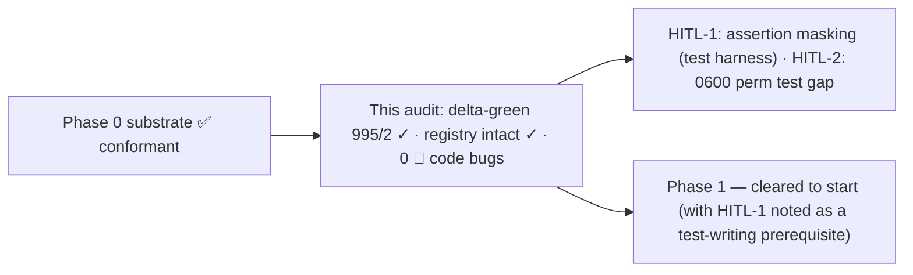

# Implementation-Adherence Review — 21-06-2026 (Phase 0 → Phase 1 boundary)

**Type**: read-only adherence/gap audit (recurring playbook `implementation-review-handoff.md`).
**Scope**: the whole decentralized-config implementation surface vs the frozen design + ADRs.
**Position**: run at the **Phase 0 → Phase 1 boundary** — Phase 0 (substrate) is CLOSED (`7dcf1e8`);
this is the **first run** of the recurring adherence playbook (no prior adherence review exists; the
design-readiness baseline is `reviews/18-06-2026-impl-readiness-review.md`).
**Branch**: `feat/vault/decentralized-config` (commits local). **HEAD at audit**: `021ebae`.

---

## 0. Verdict (TL;DR)

**Phase 0 substrate production code is conformant and ready for Phase 1.** The Transitional Registry is
**fully intact** — no early cleanup, no unsanctioned dual-read. **Zero `🔴` code-conformance bugs**
were found.

The **one substantive finding is in the test harness, not the production code**: the test runner
**masks all non-final assertion failures** in multi-assert test functions — affecting **both** the bare
`assert_*` idiom *and* the `[[ … ]] || fail` idiom used in the brand-new P0 `test_index.sh` /
`test_paths.sh`. This weakened the "green per phase" guarantee that the whole build method rests on.

> **⚑ Resolution (post-audit, maintainer-approved — see §6 F-A / §9).** The reported delta-green
> **995/2 was masked**. Applying the recommended runner fix (treat the `ASSERTION FAILED` sentinel as a
> failure regardless of exit code) revealed **17 previously-masked failures → true count 978/19**, all
> **stale-assertion / legacy test-drift** in the §11 rewrite/remove buckets (not P0 code regressions —
> P0 conformance was verified independently). The **3 P0-scope `test_invariants`** ones (stale relative
> `./` mount literal + missing `.cco/` compose sub-path) were **spot-fixed** (§11 "light-touch"), giving
> a verified **981/16**. The remaining **16 are the corrected known-failure baseline** (registry §4),
> owned by their rewrite/removal phases (P2/P3/P4–P5). HITL-1 is thus **resolved**; HITL-2 (low) remains.

---

## 1. Four-state classification — summary

| State | Count | Where |
|---|---|---|
| ✅ Implemented — conformant | all P0 substrate elements (resolver, index, parsers, registries, mount-map, overlays, harness) | §3 lens results |
| ❌ Missing | all P1–P5 scope (not yet built) | **expected — not due**; each named with its owning phase in §5 |
| 🟡 Hybrid — intentional | every Transitional-Registry item (schema bridge, `@local` plumbing, dual-seed, kept `CCO_*_DIR`, vault-git mirror, in-place `source`/`base`/`meta`, scaffolded-but-unconsumed `tags.yml`) | §4 — all matched to registry, retiring phase still ahead |
| 🔴 Hybrid — divergent / error | **none in production code** | — |

The audit's substantive findings (§6) are **test-infrastructure quality issues**, not design/ADR
element divergences, so they sit outside the four-state table by nature; they are tracked as HITL flags.

---

## 2. Method & baseline

- **Multi-lens, code-grounded** (the V methodology, lighter cycle): 8 review lenses run as parallel
  read-only passes, each citing `file:line`, then adversarially verified and de-duplicated. Only
  Phase 0 is built, so most lenses converge on a bounded surface (commits `ff8278b`→`7dcf1e8`).
- **Reported delta-green (live run, masked)**: `CCO_ALLOW_HOST_RESOLVE=1 ./bin/test` →
  **`995 passed, 2 failed, 997 total`**. The two *visible* failures matched the documented baseline
  (`test_resolve_name_from_full_variant_url` P4–P5; `test_update_migrations_run_in_order` P2). **But
  this count was masked** — see §9: the true figure is **981/16** after the audit's runner fix.
- **Delta-green awareness (caveat → confirmed live)**: a green count is *not* proof of conformance. The
  masked-assertion finding (§6 F-A / HITL-1) meant a subset of contract tests asserted only their
  **last** check. Applying the fix proved the risk was real: **17 masked failures surfaced**. The lens
  results below were code-grounded against the implementation directly (not the pass count), so they
  hold; the masking finding is what the count itself hid.

---

## 3. Lens results (Phase 0)

All citations re-read at this audit (line numbers as of HEAD `021ebae`).

### Lens 1 — Bucket-taxonomy & resolver (`lib/paths.sh`) — ✅ conformant
- Four buckets resolve host-side: `_cco_config_dir`=`~/.cco` (dotdir, not `$XDG_CONFIG_HOME`);
  `_cco_data_dir`/`_cco_state_dir`/`_cco_cache_dir` follow `CCO_*_HOME` → `XDG_*_HOME/cco` →
  `~/.local/{share,state,cache}/cco` (`paths.sh:157-198`). `_cco_first_abs` treats unset/empty/
  **non-absolute** values as absent (`:144`). Dirs created `umask 077; mkdir -p` → **0700** (`:150-154`).
- **H4 guard** (`_cco_in_container` `:120-124` keyed on `$HOME=/home/claude` ∨ `/.dockerenv`;
  `_cco_resolver_guard` `:133-134`) refuses to resolve in-container unless `CCO_ALLOW_HOST_RESOLVE=1`.
  Hatch works (the suite passes only with it set).
- **L5 symlink-safe tool root** (`bin/cco:14-22`): `BASH_SOURCE` + `readlink` loop, no `readlink -f`,
  `cd -P` — macOS/bash-3.2 clean.
- Internal data placement verified: `index`→STATE, `remotes`→DATA, `remotes-token`→STATE,
  overlays→CACHE. No internal file written into a committed CONFIG bucket by P0 code (P6/G8 intact).

### Lens 2 — Index API & coordinate parsers (`lib/index.sh`, `lib/yaml.sh`) — ✅ conformant
- **STATE index** at `<state>/cco/index` (`index.sh:_index_file`). Public API:
  `_index_get_path` / `_index_set_path` / `_index_remove_path` / `_index_list_paths` /
  **`_index_path_conflicts`** (AD5) / `_index_get_project_repos` / `_index_set_project_repos` /
  `_index_remove_project`. Atomic writes via `mktemp`+`mv`, **no flock** (H7/ADR-0022 D2). Sections
  are `version`/`paths`/`projects` only — **no tags**. Global-flat (no per-project namespacing).
- **Coordinate parsers (final schema F5, built once)**: `yml_get_repo_coords`
  (`name⟂url⟂ref`), `yml_get_mount_coords` (`name⟂url⟂ref⟂target⟂readonly`),
  `yml_get_pack_coords` (`name⟂url⟂ref⟂resource`; bare entry ⇒ authored-pack P15),
  `yml_get_llms` (now emits **url**, mandatory per ADR-0017 D1). All awk-based, bash-3.2 clean. No
  absolute path is emitted by any parser (AD3/G8). Round-trip tests present in `test_yaml_parser.sh`.
- 🟡 Legacy parsers (`yml_get_repos` `path:`, `yml_get_extra_mounts`) **coexist** — sanctioned by the
  schema bridge (see §4 #2); they die P3/P4.

### Lens 3 — Phase completeness vs §9 — see §5 (P0 complete; P1–P5 not due)

### Lens 4 — Invariant adherence — ✅ conformant
- **H1** (resolution before notices) is a P1 concern (the aggregator lands in P1); not yet wired —
  correct.
- **H4** host-side guard intact (Lens 1). **H6/H7**: H7 honored in the index; H6 (base/meta→STATE)
  correctly **deferred to P2** (§4 #8). **Compose↔entrypoint container-path contract** intact: only
  host mount *sources* were re-pointed; container *targets* in `config/entrypoint.sh` unchanged
  (`cmd-start.sh` mount block vs `entrypoint.sh:93-197`).
- **P14** (reachability never hard-block): the F2 cross-tree collision is **warn-only**
  (`packs.sh:_detect_cross_tree_conflicts`, pack `:ro` wins). **P15** discriminator (coordinate
  presence) lives in the parser/§2.4 table; resolver behavior is P4/P5 — correct.

### Lens 5 — Transitional vs error — ✅ registry fully intact (detail in §4)

### Lens 6 — Test-contract adherence — ⚠ see §6 (masking) + §5 (§11 row-0 coverage)
- §11 row-0 contracts have tests: index (`test_index.sh`), resolver matrix incl. guard
  (`test_paths.sh`), schema/parser round-trip (`test_yaml_parser.sh`), BL3 mount bucket map + F2
  collision (`test_start_dry_run.sh`), secrets/OAuth re-point (`test_secrets.sh`), remotes split
  (`test_remote.sh`), harness `minimal_project_yml`→`name`+url/ref schema (`helpers.sh:455-468`).
- **Masking finding (HITL-1)** below qualifies how much these tests actually guarantee.

### Lens 7 — Doc coherence — ✅ conformant
- Living design/ADR/requirements match the code (the lens checks above cite design §/ADR with no
  contradiction surfaced).
- **Shipped-behavior docs not rewritten ahead of code** (doc-lifecycle rule): top-level `CLAUDE.md`,
  README, guides still describe the **current** model (`user-config/`, `cco vault *`, `cco manifest`)
  — correct; their rewrite rides the P3 cutover sweep. `resource-coherence-inventory.md` remains the
  P3 driver, not yet actioned (correct).

### Lens 8 — Next-phase (P1) migration/cutover safety — ready, one prerequisite
- The P1 substrate dependencies are **present and conformant**: index API, coordinate parsers, the
  schema bridge (`_effective_repo_mounts`/`_effective_extra_mounts`/`_resolve_entry_index`), the
  reusable `@local` plumbing. The dispatcher has **no** top-level `cco sync`/`cco resolve`/`cco path`
  yet (only `cco project resolve`) — exactly as the P1 handoff states.
- **Prerequisite for P1**: write the new P1 tests (`test_sync.sh`, resolve/`--scan`, fingerprint,
  aggregator) with the **mask-safe** assertion idiom (HITL-1) so the new contracts are real.

---

## 4. Transitional Registry — verification (the trust lens)

Each item confirmed **present, intact, and still ahead of its retiring phase** (P1 is next; nothing in
the registry retires before P2). **No item was deleted early; no unsanctioned dual-read exists.**

| # | Registry item | Observed (file:line) | Verdict |
|---|---|---|---|
| 1 | `@local`/sanitize/extract/restore + `local-paths.yml` plumbing (dies P3/P4) | `local-paths.sh` `_sanitize_project_paths` (~257-411), `_extract_local_paths` (~702-770), `_restore_local_paths` (~774-786); still consumed by `cmd-vault.sh` | 🟡 intact |
| 2 | Per-section schema bridge `_effective_repo_mounts`/`_effective_extra_mounts`/`_resolve_entry_index` (dies P3/P4) | `local-paths.sh` (~1101-1202); per-section dispatch: `yml_get_repos` non-empty ⇒ legacy, empty ⇒ index | 🟡 intact |
| 3 | Dual-seed (legacy `GLOBAL_DIR` **and** `~/.cco/global`) | `helpers.sh:73-85` (legacy `:77-78`, new `:83-84`) | 🟡 intact |
| 4 | Legacy `CCO_*_DIR` kept | `helpers.sh:33-45`; `bin/cco` GLOBAL_DIR fallback | 🟡 intact |
| 5 | `check_global` not re-pointed (satisfied by dual-seed) | `utils.sh:46-50` checks `GLOBAL_DIR/.claude` | 🟡 intact |
| 6 | Vault-git mirror kept until P3 | `cmd-vault.sh` git machinery (`cmd_vault_init`, `_ensure_vault_gitignore`, `git -C "$vault_dir"`) | 🟡 intact |
| 7 | **T4-source → P4**: `source` read **in place** at `<repo\|pack>/.cco/source`, not relocated/renamed | `cmd-pack.sh` (~651/676/693) reads/writes `.cco/source` | 🟡 intact (relocating now would be the 🔴) |
| 8 | **T5 → P2**: `.cco/base/` + `.cco/meta` still in `.cco/` | `update-hash-io.sh` (~16-21) `.cco/base/`; `update-meta.sh` `.cco/meta` | 🟡 intact |
| 9 | **T4-tags → P3**: `tags.yml` has no consumer yet | no `cco tag add/rm` / `cco list --tag` wired | 🟡 intact |
| — | Legacy commands live (`cco vault *`, `cco project create`, `cco manifest`, profile/switch/shadow) | `bin/cco:235-237`; `cmd-vault.sh:3672`, `cmd-project-create.sh:8`, `manifest.sh:408` | 🟡 expected-present |

**Inverse hunt** (early-deletions / unsanctioned dual-reads): **none**. The only dual-read is the
sanctioned per-section schema bridge (#2). No registry item was prematurely removed.

**Registry currency**: no items retire at this boundary (P0→P1). The registry is **unchanged** — it is
re-affirmed current. (First item to retire is T5/H6 at P2.)

---

## 5. Phase completeness vs §9

| Phase | State | Notes |
|---|---|---|
| **P0 — Substrate** | ✅ **complete & conformant** | resolver+H4+L5 · STATE index (AD5/H7) · final coordinate parsers (F5) · DATA/STATE registries (M3) · compose bucket mount-map (BL3) host-absolute · CACHE overlays (ADR-0005 F1/F2/F3) · harness migration. Two items **correctly NOT built** (re-sequenced): T4-`source`→P4, T5-`base`/`meta`→P2. |
| **P1 — Core local** | ❌ not built — **due next** | `cmd-sync.sh` (4 forms) · `cco resolve`/`path` (+`--scan`) · reminder aggregator (H1) · sync-meta fingerprint (F39) · generic `cco project add/validate/coords`. Substrate ready (§3 Lens 8). |
| **P2 — Migration** | ❌ not built | J0 bootstrap · `cco init --migrate` · H6 base/meta→STATE + global-meta decompose · memory relocation · profile→tag prompt. |
| **P3 — Legacy cutover** | ❌ not built | delete vault/profiles/`project create`/sanitize · wire `cco tag`/`list --tag` · `cco config` + allowlist · **shipped-doc cutover sweep**. |
| **P4 — Sharing core** | ❌ not built | manifest removal (code/data split) · sync-before-publish · 2×2 verbs · `source`→DATA relocation (T4). |
| **P5 — Sharing ext** | ❌ not built | 3-layer pack resolution · internalize · `update --check` · lifecycle (`forget`, delete-cascade, validate). |

All ❌ are **expected** (their phase has not started); none is overdue.

---

## 6. Findings

### F-A · Test runner masks non-final assertion failures — **HITL-1** · severity **medium** · test-infra
**Observed** (`bin/test:60-70`): each test runs as `output=$(( set -e; "$fn_name" ) 2>&1) || exit_code=$?`.
Empirically (reproduced against the real `helpers.sh` `fail`/`assert_*`, which `return 1`):

| pattern | mid-function failure | result |
|---|---|---|
| bare `assert_x …` | swallowed | **MASKED** (exit 0) |
| `[[ cond ]] \|\| fail "msg"` | swallowed | **MASKED** (exit 0) |
| `assert_x … \|\| return 1` | aborts the test fn | caught (exit 1) |

Under `set -e`, a non-zero **return from an assertion helper** (invoked as a bare command *or* as the
RHS of `||`) does **not** abort the calling test function; only a direct `return`/`exit` in the test
body, or a failing **real command** (unbound var, missing file via `set -e`), does. Consequence: in any
multi-assert test function, **only the last assertion is load-bearing**; earlier checks can regress
silently.

**Why it matters / scope.** This is broader than the registry's §6 note (which flagged only *bare*
`assert_*`): the `[[ … ]] || fail` idiom — the dominant style in the **new** P0 `test_index.sh` and
`test_paths.sh` — is **equally masked**. Counts of unguarded multi-assert asserts in P0 files:
`test_yaml_parser.sh` ~100, `test_local_paths.sh` ~98, `test_remote.sh` ~39, `test_start_dry_run.sh`
~117 (only 4 guarded), plus `test_index.sh`/`test_paths.sh` via `|| fail`. The whole build method rests
on **"each phase leaves the suite green (delta-based)"**; masking makes green a weaker signal than
assumed and can hide drift in future phases.

**Concrete drift-hiding example (security-relevant).** `test_remote_add_with_token`
(`test_remote.sh:244-251`) places `url`-in-DATA (`:249`) and `token`-in-STATE (`:250`) in **non-final**
positions; the only effective assert is `[token saved]` (`:251`). There is **no** final assert that the
token is **absent** from the DATA `remotes` registry. A regression writing the token into DATA (an S8
no-token-leak violation) would not be caught by this test.

**Not a P0 code bug, but NOT a benign false-green either** (corrected post-fix — see §9): the masking
was **actively hiding 17 failing test functions**. P0 *production-code* conformance holds (verified
independently by the lenses), but the "995/2 delta-green" itself was masked — the true figure is
**981/16** once the failures are unmasked.

**Resolution — Option A applied (maintainer-approved):** the runner now treats a captured
`ASSERTION FAILED` sentinel as a failure regardless of exit code (`bin/test:_run_test`). One line,
zero test churn, no false negatives (verified: inline negative-test echoes always pair with `return 1`).
Alternatives considered: (B) convert ~350 asserts to `… || return 1` (large, regress-prone);
(C) make `assert_*` `exit 1` (rejected — breaks `if cmd; then fail; fi` negative tests). The full
post-fix outcome (17 surfaced, 3 P0 spot-fixed, 16-row baseline) is **§9**.

### F-B · `remotes-token` 0600 mode not asserted in tests — **HITL-2** · severity **low/nit** · test-coverage
**Observed**: `cmd-remote.sh` `chmod 600` the token file, but `test_remote.sh` asserts token *content*
(`:250` etc.), never the file **mode**. The 0600 invariant (S8) is therefore unverified by the suite.
**Proposed**: add a `stat`-based mode assert (final position, or guarded) when HITL-1's idiom is fixed.
Low priority; the runtime `chmod` is correct.

### Notes (no action)
- The `secrets/OAuth re-point` test (`test_secrets.sh`) should be confirmed to cover **both** `cco
  start` and `cco new` when P1 touches start; spot-check showed the `~/.cco` path used by both
  (`secrets.sh:load_global_secrets`) — fine for P0.

---

## 7. HITL flags

1. **HITL-1 — assertion masking (test methodology). ✅ RESOLVED (maintainer-approved, Option A).** Runner
   fix applied + suite re-baselined (§9). The masking was concealing 17 failing tests; the true baseline
   is now **981/16**.
2. **HITL-2 — `remotes-token` 0600 assertion (low). ⏳ OPEN.** Add a `stat`-based mode check (now
   mask-safe under the §9 runner fix), or accept the gap for v1.

Neither is a design/ADR contradiction; both are test-infrastructure decisions.

---

## 8. Close-the-loop actions (this audit)

- ✅ Gap report written (this file, incl. §9 post-fix outcome).
- ✅ Roadmaps + memory updated: Phase-0 audit done, **true baseline 981/16** (was 995/2 masked), registry
  intact (see `analysis-roadmap.md`, global `roadmap.md`, progress memory).
- ✅ **Transitional Registry §4 refreshed**: the "known baseline failures" list expanded from 2 → **16**
  (the masking previously hid 14), grouped by owning phase, in `implementation-review-handoff.md`.
- ✅ P1 handoff updated: baseline `981/16`, HITL-1 resolved.
- ✅ **HITL-1 applied** (runner sentinel fix + 3 P0 `test_invariants` spot-fixes) — committed with this
   audit's docs (maintainer-approved Option A). ⏳ HITL-2 open; the 16 known-failures are scheduled into
   their rewrite/removal phases (§9).

---

## 9. Post-fix outcome (HITL-1 applied — the audit's load-bearing result)

Applying Option A (runner treats the `ASSERTION FAILED` sentinel as a failure) flipped the suite from
the **masked** `995/2` to a true **`978/19`** — i.e. **17 failing test functions were being hidden by
the masking**. This is the **silent-drift failure mode** the playbook exists to catch (§"Why this
exists"), now **proven active**: P0's mount-map changes *should* have triggered the §11 "light-touch
spot-fix" of `test_invariants`, but the red was masked, so it never happened.

**Adversarial characterization** — none of the 17 is a P0 *production-code* regression (P0 conformance
was verified independently by the lenses). All 17 are **stale-assertion / legacy test-drift**,
concentrated in exactly the §11 rewrite/remove buckets:

| Group | Count | Owning phase (§11) | Nature |
|---|---|---|---|
| `test_invariants` (`invariant_2/3/4`) | 3 | **P0 — light-touch spot-fix** | stale literal `./.claude` mount (now host-absolute) + compose path missing `.cco/`; the real invariants hold (rw mount, claude-state→STATE, distinct names) |
| `test_update_*` + `test_migration_005` | 7 | **P2 — rewrite** (H6 base/meta→STATE, `--check`) | assert `.cco/base`/`.cco/meta`/changelog at pre-cutover locations |
| `test_publish_ignore_path_patterns`, `test_project_internalize_updates_base` | 2 | **P4–P5 — rewrite** (sharing) | assert `.cco/base`/publish-ignore legacy behavior |
| `test_vault_*` / `test_profile_*` | 5 | **P3 — remove** (vault/profiles deleted) | profile/switch/move behavior perturbed by the Commit-B harness HOME-flip |

**Action taken (maintainer-approved):**
1. **Spot-fixed the 3 P0-scope `test_invariants`** to the shipped Phase-0 behavior — `invariant_2`:
   relative `./.claude:/workspace/.claude` → host-absolute `/.claude:/workspace/.claude` + the rw `:ro`
   guard re-anchored; `invariant_3`/`invariant_4`: compose path `$dir/docker-compose.yml` →
   `$dir/.cco/docker-compose.yml` (the dump writes to `.cco/`). Verified: `test_invariants` now **16/0**.
2. **Re-baselined** the documented known-failure set from 2 → **16** (registry §4 / P1-handoff §4): the
   2 original + the 14 legacy/stale ones above, each tagged with its owning phase. They turn ❌→✅ (or
   are removed) when their phase rewrites/removes them.

**Verified final**: `CCO_ALLOW_HOST_RESOLVE=1 ./bin/test` → **`981 passed, 16 failed, 997 total`**, the
16 failures being exactly the re-baselined set. Delta-green going forward is measured against **16**,
not 2 — an honest signal the build method can now trust.
