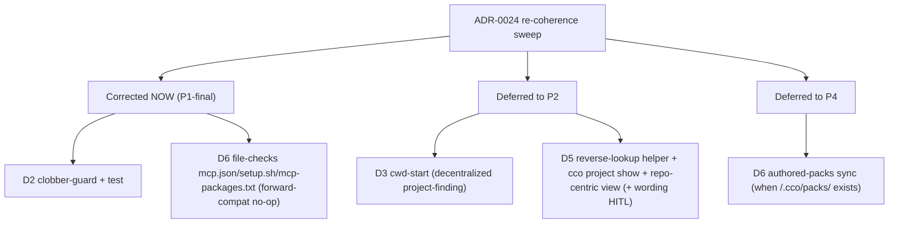

# ADR-0024 Re-Coherence Sweep — Design Validation + P0/P1 Implementation Audit

**Date**: 2026-06-22 · **Branch**: `feat/vault/decentralized-config` (commits local)
**Scope**: validate the ADR-0024 cluster (design review) and re-cohere the already-built
**P0/P1** implementation against it (the `implementation-review-handoff.md` playbook scoped
to ADR-0024). Run **before** resuming Phase 2 (RD-repo-multi-project §8 step 2).
**Method**: 4 parallel read-only analyst passes (guiding-principles adherence · `design.md`
internal coherence · cross-document consistency · code audit), then synthesis + corrections.

---

## 1. Outcome

**Design: validated.** ADR-0024 (D1–D7 + P18) **adheres to guiding principles P1–P18**, is
**internally coherent** with `design.md`, and is **cross-consistent** with the related ADRs
(0002/0003/0005/0019/0022) + `requirements.md`. No 🔴 contradiction of substance; **4 minor
clarity fixes** applied (below).

**Code: 1 blocker found + fixed.** The shipped P1 `cco sync` had **no clobber-guard** (ADR-0024
D2) — it could silently overwrite a repo hosting a different project. Fixed in the sweep, plus
the D6 sync-set completeness; suite kept **delta-green** (1043/16 → **1044/16**).

---

## 2. Design review — findings & fixes

| Pass | Verdict | Action |
|---|---|---|
| Guiding-principles adherence (P1–P18) | ✅ all D1–D7 adherent; P18 a faithful distillation | 1 🟡 (D2 vs P14 *apparent* tension — orthogonal scopes) → **fix #1** |
| `design.md` internal coherence | ✅ sync-set / one-config-home / `.claude`-scope / observability consistent across §2.1/2.4/3/4/9/13 | 1 🟡 packs-scope ambiguity → **fix #2**; 1 🟡 test-plan row → **fix #3** |
| Cross-document consistency | ✅ forward-annotations present & consistent; **D6 packs discriminator aligns exactly with ADR-0022 D4 / ADR-0019 D3** (coordinate presence = sole discriminator) | 1 🟡 requirements AD3 scoping → **fix #4** |

**Fixes applied (doc-only):**
1. **ADR-0024 D2** — clarified the guard protects sync-set **mutation safety** (cf. P17), **not**
   referenced-resource **reachability** (P14 governs reachability; the two are orthogonal). Prevents
   a future misread of "no override" as a P14 hard-block.
2. **`design.md` §4.1** — authored packs travel only within the **source project's own**
   config-bearing repos; a target hosting a different project is skipped (§4.3), so authored packs
   never spread into an unrelated repo (and a referenced repo's `.cco/` is never copied).
3. **`design.md` §11** — Phase-1 `test_sync.sh` row now names the clobber-guard test.
4. **`requirements.md` AD3** — forward-annotation: "byte-identical across a project's repos" is
   scoped to **config-bearing** members (host + synced same-name); code-only / referenced-only
   members do not carry `project.yml`.

No new ADR; no decision changed (clarity only). ADR-0024's decisions stand as written.

---

## 3. Implementation audit — P0/P1 vs ADR-0024

| Decision | Status | Evidence | Disposition |
|---|---|---|---|
| **D1** one config home per repo | ✅ conformant | index multi-membership (P0); no multi-`.cco/` attempted | none |
| **D2** sync clobber-guard | ❌→✅ **fixed** | `lib/cmd-sync.sh` did unconditional copy to all source-manifest members; no `name` check | **corrected in sweep** (see §4) |
| **D3** `cco start` cwd → hosted project | 🟡 deferred | `_start_resolve_project` still central `$PROJECTS_DIR` lookup | **P2** (scope-fork: coupled to decentralized start) |
| **D4** `.claude` scopes, no cross-project leak | ✅ conformant | only the invoking repo's `.cco/claude/` → `/workspace/.claude` (ADR-0005); repo-native untouched | none |
| **D5** repo↔project observability | 🟡 partial/deferred | only forward `_index_get_project_repos`; reverse helper + `cco project show` extension absent | **P2** (additive helper + UX; wording HITL) |
| **D6** sync-set = whole committed `.cco/` − `secrets.env`, authored packs only | 🟡→✅ **fixed (forward-compat)** | `_sync_synced_files` omitted `mcp.json`/`setup.sh`/`mcp-packages.txt` | **corrected** (file-checks added; **packs-authored sync → P4** when in-repo packs exist) |
| **D7** Axis-1/2 distributed sharing | ✅ conformant | design implication; no P1 code needed; A4 stays post-v1 | none |

**Key correction-vs-deferral split:**

---

## 4. Corrections applied (commit `8e7cc9a`)

- **D2 clobber-guard** — `lib/cmd-sync.sh`: per-target loop reads `tgt/.cco/project.yml` `name`;
  if present and ≠ the source project `name`, **skip + warn**, never copy. No override (re-home =
  de-init / re-init `--sync`). Code-only and same-name targets proceed normally.
- **D6 sync-set** — `lib/sync-meta.sh` `_sync_synced_files`: emits `mcp.json` / `setup.sh` /
  `mcp-packages.txt` when present (forward-compatible no-op until P2 relocates them into `.cco/`).
- **Test** — `test_sync_skips_target_hosting_different_project` (regression for D2).
- **Suite**: **1044 passed / 16 failed** — the 16 are the unchanged known baseline
  (8 update/P2 · 5 vault-profile/P3 · 3 sharing/P4-5); the new test passes; no regression.

**Doc fixes** (this review) committed separately.

---

## 5. Carry-forward into Phase 2 (handoff updated)

The deferred ADR-0024 items are recorded in `P2-handoff-migration-bootstrap.md` so they are built
in final form during P2 (build-once):
- **D3** — `cco start` cwd resolves to the repo's hosted project (`.cco/project.yml` `name`);
  explicit name / `--from` for a referenced project; hosts-nothing → require a name.
- **D5** — additive `_index_repos_get_projects` reverse-lookup helper + `cco project show`
  role + referenced-by + repo-centric view + ⚠ badge; **wording is HITL** (P10 lesson b).
- **D6 packs** — authored-pack (`no-url`) sync when `<repo>/.cco/packs/` authored packs exist (P4).

**New baseline = 1044/16.** P0 `project.yml` schema and the global-flat index are **unchanged**
(no build-once re-open for P0). **Next: resume Phase 2** from `P2-handoff` §4a.
